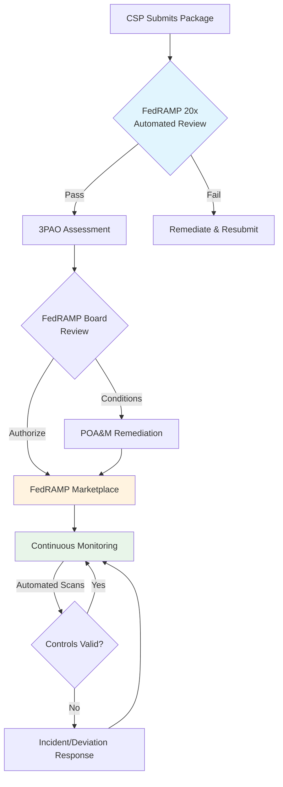
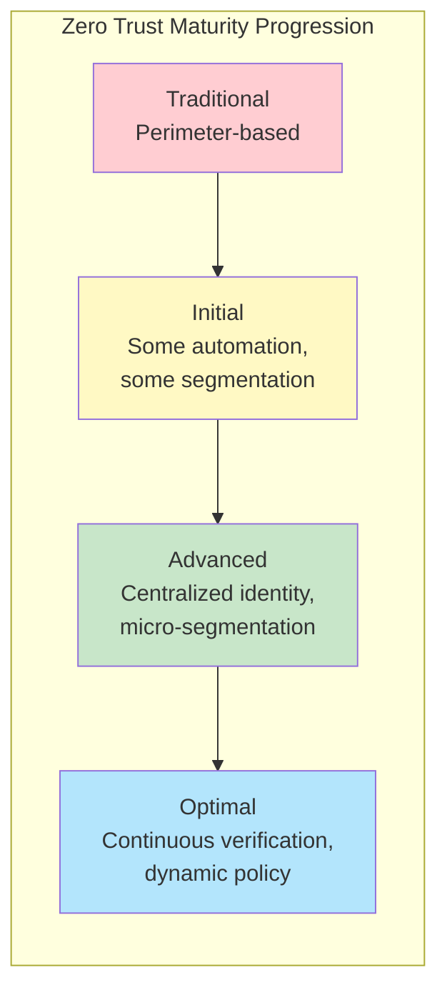
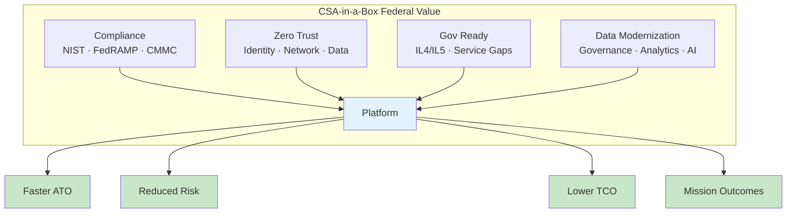

# Federal Cloud Adoption Trends — 2026

> **TL;DR:** Federal cloud spending has crossed $20 billion annually, driven by Cloud Smart mandates, zero trust executive orders, and aggressive modernization timelines. FedRAMP Rev 5 and continuous ATO automation are reshaping how agencies authorize cloud services. Azure Government has strengthened its position at IL4/IL5/IL6 while commercial hyperscalers compete fiercely for JWCC task orders. This report maps the trends that matter for CSA-in-a-Box deployments in federal, state, and local government environments.

---

## Federal cloud spending

### Budget trajectory

Federal IT spending has grown at a compound annual rate of approximately 8 % since the original Cloud First mandate in 2010. The FY 2026 President's Budget requests over $74 billion for civilian agency IT, with cloud services accounting for roughly 28 % of total IT spend — up from 22 % in FY 2023.

| Fiscal Year | Total Federal IT Budget (est.) | Cloud Portion (est.) | Cloud Growth YoY |
| ----------- | ------------------------------ | -------------------- | ---------------- |
| FY 2023     | $65 B                          | $14.3 B              | —                |
| FY 2024     | $68 B                          | $16.3 B              | +14 %            |
| FY 2025     | $71 B                          | $18.7 B              | +15 %            |
| FY 2026     | $74 B (req.)                   | $21.0 B (est.)       | +12 %            |

Defense spending tells its own story. The DoD CIO allocated over $9 billion in FY 2026 for cloud-related modernization, spanning JWCC task orders, agency-specific migrations, and classified cloud enclaves.

### Cloud Smart evolution

The Cloud Smart strategy (2019) replaced Cloud First's "move everything" directive with a measured approach emphasizing security, procurement streamlining, and workforce development. By 2026, the practical effect is that agencies no longer debate whether to adopt cloud — they debate which workloads to migrate first and which cloud operating model fits.

Key shifts since Cloud Smart:

- **Multi-cloud is accepted.** OMB no longer pushes single-vendor strategies. Most large agencies run workloads across two or more hyperscalers plus on-premises.
- **Application rationalization before migration.** Agencies are required to categorize workloads (retire, retain, rehost, refactor, replace) before spending migration dollars.
- **Shared services consolidation.** GSA's cloud brokerage and Quality Service Management Offices (QSMOs) steer agencies toward common platforms for HR, financial management, and cybersecurity.

### FITARA scorecard analysis

FITARA scorecards (14th edition, December 2025) continue to pressure CIOs. Cloud optimization scores now evaluate not just adoption but cost management, security posture, and sustainability. Agencies scoring below C on cloud metrics face budget review triggers.

Notable trends from recent scorecards:

- Agencies with centralized cloud CoEs score higher on cost optimization
- FedRAMP continuous monitoring compliance correlates with better security grades
- Agencies that adopted FinOps practices improved cloud grades by an average of one letter within two scoring cycles

---

## FedRAMP evolution

### FedRAMP 2.0 and Rev 5

The FedRAMP Authorization Act (signed December 2022, codified in the National Defense Authorization Act) established FedRAMP as a statutory program, giving it permanent funding authority and formal governance through the FedRAMP Board. The practical effects by 2026:

- **NIST SP 800-53 Rev 5 baseline.** All new authorizations must use Rev 5 controls. Legacy Rev 4 authorizations are required to transition by September 2026.
- **FedRAMP 20x initiative.** Launched in early 2025, FedRAMP 20x aims to radically streamline the authorization process through automation. The program establishes machine-readable security packages, automated validation of technical controls, and continuous monitoring as the default rather than the exception.
- **Expanded scope.** SaaS-heavy agencies now push for FedRAMP authorization of AI/ML services, data analytics platforms, and DevSecOps toolchains — categories that barely existed in the original program.

### Continuous monitoring and automation

The shift from "assess once, monitor occasionally" to continuous authorization is the single largest change in federal cloud compliance:

- **OSCAL adoption.** The Open Security Controls Assessment Language is now the expected format for System Security Plans, assessment results, and POA&Ms. Agencies that submit OSCAL-formatted packages see shorter review timelines.
- **Automated evidence collection.** FedRAMP 20x emphasizes machine-readable evidence — configuration scans, vulnerability reports, and control implementation statements that can be validated programmatically.
- **Continuous ATO (cATO).** DoD's cATO model, formalized in the DISA cATO guide, allows systems with robust continuous monitoring to maintain authorization without periodic full reassessments. Several civilian agencies are piloting analogous approaches.

### Reciprocity improvements

FedRAMP reciprocity — the idea that one agency's authorization should be accepted by others — has historically been aspirational. By 2026, real progress:

- The FedRAMP Marketplace now contains over 350 authorized services (up from ~250 in 2023)
- Agency-specific "delta" requirements are being standardized through the FedRAMP Board
- StateRAMP alignment with FedRAMP baselines reduces duplicative assessments for cloud services serving both federal and state customers

---

## Major agency cloud strategies

### Department of Defense — JWCC

The Joint Warfighting Cloud Capability (JWCC) contract awards — granted to AWS, Google Cloud, Microsoft, and Oracle — replaced the canceled JEDI single-award contract. By 2026:

- **Task order distribution.** Microsoft Azure has captured significant JWCC task orders, particularly for classified workloads at IL5 and IL6 where Azure Government Secret and Top Secret regions provide dedicated infrastructure.
- **Multi-cloud reality.** DISA operates cloud access points (CAPs) for each JWCC vendor. Individual combatant commands and agencies select vendors based on workload requirements, existing skill sets, and classification levels.
- **IL5 push.** The majority of new DoD cloud workloads target IL5 (National Security Systems with CUI), driving demand for cloud services authorized at that level. Azure Government's IL5 authorization covers a broader set of services than competitors at that classification level.

### Department of Veterans Affairs

The VA's cloud modernization program is one of the largest civilian migrations:

- **EHR modernization.** The Oracle Health (formerly Cerner) EHR deployment runs on Oracle Cloud Infrastructure, but the VA's broader analytics and administrative workloads are migrating to Azure and AWS.
- **Data analytics platform.** The VA's Corporate Data Warehouse modernization targets Azure Synapse and Databricks for veteran health analytics, claims processing, and benefits administration.
- **FedRAMP High requirement.** All VA cloud services must operate at FedRAMP High due to the sensitivity of veteran health records and PII.

### Department of Homeland Security

DHS operates across commercial cloud (AWS and Azure) with a growing Azure Government footprint:

- **CISA's cloud security mission.** CISA's own infrastructure increasingly runs on cloud, and its Continuous Diagnostics and Mitigation (CDM) program monitors federal agency cloud environments.
- **CBP and ICE analytics.** Customs and Border Protection and Immigration and Customs Enforcement run large-scale analytics workloads that require IL4/IL5 environments.
- **Zero trust implementation.** DHS is considered a leader among civilian agencies in zero trust adoption, with Entra ID (formerly Azure AD) as the primary identity provider for most components.

### Internal Revenue Service

The IRS received $80 billion in Inflation Reduction Act funding, a substantial portion directed at IT modernization:

- **Taxpayer data analytics.** The IRS is building a modern analytics platform to detect fraud, improve processing, and enhance taxpayer services. Azure Government and AWS GovCloud both support IRS workloads.
- **IRS Publication 1075 compliance.** Federal Tax Information (FTI) requires specific controls beyond FedRAMP, making the compliance surface particularly demanding.
- **Legacy mainframe migration.** The IRS maintains some of the oldest IT systems in the federal government. Migration timelines extend into the 2030s for the most critical mainframe workloads.

### USDA

The Department of Agriculture is a strong Azure customer with significant analytics needs:

- **Farm production data.** NASS (National Agricultural Statistics Service) and FSA (Farm Service Agency) process massive datasets on crop production, land use, and commodity pricing.
- **Forest Service GIS.** The US Forest Service operates one of the largest geospatial analytics environments in the federal government, increasingly on Azure.
- **Azure Government deployment.** USDA has standardized on Azure Government for most new workloads, with CSA-in-a-Box style data platforms supporting agricultural analytics. See the [USDA Agricultural Analytics](../examples/usda.md) example.

---

## Azure Government position

### Market share and trajectory

Azure Government holds a strong position in the federal cloud market, with estimated market share of 25-30 % of federal cloud spending (behind AWS GovCloud at approximately 35-40 %, but growing faster in percentage terms).

Key competitive advantages:

| Capability                     | Azure Government | AWS GovCloud | Google Cloud for Gov | Oracle Gov Cloud |
| ------------------------------ | ---------------- | ------------ | -------------------- | ---------------- |
| FedRAMP High                   | Yes              | Yes          | Yes                  | Yes              |
| DoD IL4                        | Yes              | Yes          | Yes                  | Yes              |
| DoD IL5                        | Yes              | Yes          | Limited              | Yes              |
| DoD IL6 (Secret)               | Yes              | Yes          | No                   | No               |
| Top Secret                     | Yes              | Yes          | No                   | No               |
| Integrated M365/Teams/Entra    | Native           | N/A          | N/A                  | N/A              |
| AI/ML services at IL5          | Growing          | Growing      | Limited              | Limited          |
| Sovereign cloud (US personnel) | Yes              | Yes          | Yes                  | Yes              |

### Unique capabilities

Azure Government's competitive moat extends beyond authorization levels:

- **Microsoft 365 Government.** Agencies already using M365 GCC High or DoD tenants gain seamless integration with Azure Government for identity, compliance, and data residency.
- **Entra ID for government.** Conditional Access, PIM, and Identity Governance features available in Azure Government simplify zero trust implementation.
- **Microsoft Fabric for Government.** Forecasted for Azure Government availability, Fabric will bring unified analytics (lakehouse, warehouse, real-time intelligence) to government customers. Until then, CSA-in-a-Box fills the gap. See the [Government Service Matrix](../GOV_SERVICE_MATRIX.md).
- **Azure OpenAI Service for Government.** Available in Azure Government regions, enabling agencies to build AI applications that meet FedRAMP High requirements.

### Service availability gap

The persistent gap between Azure Commercial and Azure Government service availability remains a challenge. At any given time, approximately 15-20 % of Azure Commercial services are not yet available in Azure Government. The [Government Service Matrix](../GOV_SERVICE_MATRIX.md) tracks this gap for every service used by CSA-in-a-Box.

CSA-in-a-Box directly addresses this gap by providing open-source alternatives for services not yet available in Azure Government. See the [OSS Ecosystem Guide](../guides/oss-ecosystem.md) for details.

---

## Compliance trends

| Framework                               | Status (2026)                                                                                 | Impact on CSA-in-a-Box                                                                                                                          |
| --------------------------------------- | --------------------------------------------------------------------------------------------- | ----------------------------------------------------------------------------------------------------------------------------------------------- |
| **FedRAMP Rev 5**                       | Mandatory for all new authorizations; Rev 4 transition deadline September 2026                | Platform controls mapped to Rev 5 baselines in [NIST 800-53 Rev 5](../compliance/nist-800-53-rev5.md); Bicep modules enforce technical controls |
| **StateRAMP**                           | Growing adoption — 35+ states recognize or require StateRAMP for cloud procurement            | FedRAMP Moderate coverage satisfies StateRAMP requirements with minimal delta; state-specific data residency may require Gov region deployment  |
| **CMMC 2.0**                            | Rule finalized December 2024; phased enforcement began mid-2025 for DoD contracts             | Level 2 practice coverage documented in [CMMC 2.0 L2](../compliance/cmmc-2.0-l2.md); 110 practices mapped to platform controls                  |
| **Zero Trust (EO 14028 / OMB M-22-09)** | OMB deadline for agency zero trust targets passed September 2024; agencies still implementing | Platform implements zero trust architecture patterns; Entra ID, PIM, Conditional Access, network segmentation all configured out of box         |
| **CISA BOD 22-01**                      | Known Exploited Vulnerabilities catalog actively enforced; scanning required within 24 hrs    | Defender for Cloud integration, automated vulnerability scanning, and patching runbooks address BOD requirements                                |
| **CISA BOD 23-01**                      | Asset visibility and vulnerability detection on all federal networks                          | Platform deploys diagnostic settings, Log Analytics, and Defender for Cloud to satisfy discovery and reporting requirements                     |
| **CISA BOD 25-01**                      | Secure cloud configuration baselines for M365, Azure, GCP, AWS                                | Bicep modules enforce SCuBA (Secure Cloud Business Applications) baselines; Azure Policy assignments align with CISA benchmarks                 |
| **NIST AI RMF**                         | Voluntary framework, but agencies adopting per EO 14110                                       | AI/ML architecture patterns include risk assessment templates; see [AI/ML Architecture](../reference-architecture/ai-ml-architecture.md)        |
| **Section 508 / ICT**                   | Continued enforcement; DOJ settlement activity increasing                                     | Portal UI built with accessibility compliance; see [Section 508](../compliance/section-508.md)                                                  |

---

## Zero trust mandates

### OMB M-22-09 requirements

OMB Memorandum M-22-09, "Moving the U.S. Government Toward Zero Trust Cybersecurity Principles," established specific requirements across five pillars. Agency compliance status as of early 2026:

| Pillar           | M-22-09 Requirement                                                                           | Typical Agency Status                     | CSA-in-a-Box Coverage                                                                                                        |
| ---------------- | --------------------------------------------------------------------------------------------- | ----------------------------------------- | ---------------------------------------------------------------------------------------------------------------------------- |
| **Identity**     | Enterprise-wide phishing-resistant MFA                                                        | Most agencies compliant or near-compliant | Entra ID with FIDO2/certificate-based auth; Conditional Access policies in Bicep                                             |
| **Devices**      | EDR deployed on all endpoints; device compliance signals in access decisions                  | Mixed; civilian agencies lag behind DoD   | Out of scope (endpoint management); platform uses device compliance signals from Intune when available                       |
| **Networks**     | DNS encryption, HTTP traffic inspection, macro-segmentation                                   | Significant progress but not universal    | Hub-spoke topology with Azure Firewall Premium, Private Endpoints, DNS resolution via Private DNS Zones                      |
| **Applications** | Internet-accessible apps tested regularly; internal apps begin migration to zero trust access | Early progress                            | BFF authentication pattern ([ADR 0014](../adr/0014-msal-bff-auth-pattern.md)), no direct internet exposure for data services |
| **Data**         | Comprehensive data categorization and labeling; cloud security monitoring                     | Nascent for most agencies                 | Purview integration for classification and labeling; DLP policies; encryption at rest and in transit                         |

### CISA Zero Trust Maturity Model

CISA's Zero Trust Maturity Model (v2.0, updated 2023) defines four maturity levels: Traditional, Initial, Advanced, and Optimal. Most federal agencies operate between Initial and Advanced across the five pillars. The model serves as the primary self-assessment framework agencies use for M-22-09 reporting.

### Implementation timelines

While the original M-22-09 deadline of September 2024 has passed, agencies continue to implement. CISA and OMB have shifted emphasis from deadline compliance to demonstrable progress, with annual reporting requirements through CIO FISMA metrics. The practical effect is ongoing investment in zero trust capabilities through at least FY 2028.

---

## Data modernization

### Federal Data Strategy

The Federal Data Strategy (2020-2026 action plan) established 40 practices across three principles: ethical governance, conscious design, and learning culture. By 2026, agencies are expected to have:

- Designated Chief Data Officers and mature data governance programs
- Published data inventories on data.gov
- Implemented evidence-building activities required by the Evidence Act
- Adopted open data standards and machine-readable formats

### CDO Council priorities

The CDO Council (established by the Evidence Act) has matured into a genuine cross-agency coordination body. Current priorities:

- **Data sharing agreements.** Standardized templates and processes for inter-agency data sharing, reducing legal review timelines from months to weeks.
- **AI-ready data.** Agencies are under pressure to catalog, clean, and structure datasets for AI/ML consumption per EO 14110 requirements.
- **Data quality measurement.** The CDO Council published the Federal Data Quality Framework in 2025, establishing common metrics for accuracy, completeness, timeliness, and consistency.

### Evidence Act requirements

The Foundations for Evidence-Based Policymaking Act requires agencies to conduct learning agendas, build evaluation capacity, and use evidence in budget decisions. CSA-in-a-Box supports these requirements through:

- **Analytics platform.** Provides the technical infrastructure for evidence-building activities — data ingestion, transformation, analysis, and visualization.
- **Data governance.** Purview integration supports data cataloging, lineage tracking, and quality monitoring required by the Evidence Act. See [Data Governance](../governance/DATA_CATALOGING.md).
- **Self-service analytics.** Power BI integration enables program offices to build evidence without depending on central IT for every analysis.

---

## AI in government

### EO 14110 implementation

Executive Order 14110, "Safe, Secure, and Trustworthy Development and Use of Artificial Intelligence" (October 2023), established sweeping requirements for federal AI governance. By 2026:

- **AI use case inventories.** Every CFO Act agency has published its AI use case inventory, identifying all AI systems in operation or development.
- **AI impact assessments.** Agencies must complete impact assessments for AI systems that affect rights or safety, documenting risks, mitigations, and ongoing monitoring.
- **Chief AI Officers.** Most agencies have designated a Chief AI Officer (CAIO) responsible for AI governance, risk management, and workforce development.

### AI governance frameworks

Federal AI governance is coalescing around several frameworks:

| Framework         | Scope                                                                | Status                                                                               |
| ----------------- | -------------------------------------------------------------------- | ------------------------------------------------------------------------------------ |
| NIST AI RMF 1.0   | Risk identification, assessment, and mitigation for AI systems       | Published; agencies adopting voluntarily (mandatory for some use cases per EO 14110) |
| OMB M-24-10       | Agency governance of AI, including minimum risk management practices | Final policy; compliance required by December 2025                                   |
| DHS AI governance | Department-specific AI governance for homeland security applications | Published; includes additional requirements for facial recognition and surveillance  |
| DoD RAI strategy  | Responsible AI principles for defense applications                   | Updated 2024; integrated into acquisition process                                    |

### Responsible AI requirements

CSA-in-a-Box addresses responsible AI requirements through:

- **Model governance.** MLflow integration provides model versioning, lineage tracking, and approval workflows. See [AI/ML Architecture](../reference-architecture/ai-ml-architecture.md).
- **Bias detection.** The platform supports Fairlearn and other bias detection tools in the ML pipeline.
- **Explainability.** Integration with Azure AI services includes explainability features for model predictions.
- **Data lineage.** Purview integration tracks data from source through transformation to model training, satisfying audit requirements for AI systems.

---

## Key challenges

### Talent pipeline

The federal technology workforce faces a persistent skills gap:

- **Cloud skills shortage.** Agencies report difficulty hiring and retaining cloud architects, data engineers, and security specialists at federal pay scales.
- **Clearance bottleneck.** The security clearance process adds 6-12 months to onboarding timelines for positions requiring access to classified environments. The National Background Investigations Bureau backlog exceeded 200,000 cases in 2025.
- **Contractor dependency.** An estimated 60-70 % of federal cloud work is performed by contractors, creating knowledge retention challenges and vendor lock-in risks.
- **Training investment.** Agencies that invest in upskilling existing staff (through programs like AWS/Azure/GCP government training partnerships) see better retention and lower total cost than those relying solely on external hiring.

### Security clearance bottlenecks

Classified cloud environments (IL5, IL6, Secret, Top Secret) require cleared personnel for administration and operations. The clearance pipeline affects cloud adoption timelines:

- Top Secret / SCI investigations average 12-18 months
- Reciprocity between agencies for existing clearances has improved but remains inconsistent
- Continuous vetting (CV) programs are replacing periodic reinvestigation but require cloud-based monitoring infrastructure — creating a circular dependency

### Legacy system migration

Federal agencies collectively operate an estimated 7,500+ legacy systems, some dating to the 1960s:

- **Mainframe dependency.** Agencies like SSA, IRS, and VA operate critical systems on mainframes that cannot be simply "lifted and shifted" to cloud.
- **Coexistence periods.** Realistic migration timelines span 5-10 years for complex systems, requiring hybrid architectures that bridge on-premises and cloud.
- **Data migration complexity.** Legacy databases often lack documentation, use proprietary formats, and contain decades of accumulated data quality issues.
- **Risk aversion.** Mission-critical systems with zero downtime tolerance make agencies reluctant to migrate. The USPS and FAA have experienced high-profile issues during modernization attempts.

### ATO timelines

Despite FedRAMP improvements, authorization timelines remain a barrier:

- **FedRAMP authorization.** Initial authorization still averages 12-18 months for complex systems, though FedRAMP 20x aims to reduce this significantly.
- **Agency ATO.** Even with FedRAMP reciprocity, agencies often require additional assessment work, adding 3-6 months.
- **Continuous monitoring burden.** Monthly vulnerability scans, annual assessments, and POA&M management consume significant staff time.
- **cATO promise.** Continuous ATO offers a path to faster authorization maintenance, but requires investment in automated monitoring, OSCAL-formatted documentation, and integrated DevSecOps pipelines.

---

## CSA-in-a-Box for federal

CSA-in-a-Box directly addresses several of the challenges described in this report. The platform's value proposition for federal customers:

### Compliance acceleration

- **Pre-mapped controls.** NIST 800-53 Rev 5, CMMC 2.0 L2, and HIPAA controls are mapped to specific Bicep modules, policies, and configurations. See [Compliance Documentation](../compliance/README.md).
- **Evidence generation.** Infrastructure-as-code provides auditable, repeatable evidence of control implementation.
- **FedRAMP-ready patterns.** Hub-spoke networking, private endpoints, CMK encryption, and centralized logging implement FedRAMP Moderate technical controls out of box.

### Azure Government readiness

- **Gov service gap mitigation.** The [Government Service Matrix](../GOV_SERVICE_MATRIX.md) documents every service gap, and the platform provides open-source alternatives where Azure Government services are not yet available.
- **Gov-specific Bicep modules.** The `deploy/bicep/gov/` directory contains government-specific deployment configurations that handle endpoint URL differences, API version constraints, and IL4/IL5 requirements.
- **Fabric gap bridge.** Until Microsoft Fabric reaches Azure Government, CSA-in-a-Box provides equivalent capabilities using services that are already authorized.

### Zero trust implementation

- **Identity-first architecture.** Entra ID, PIM, and Conditional Access are configured by default. See [Identity & Secrets Flow](../reference-architecture/identity-secrets-flow.md).
- **Network segmentation.** Hub-spoke topology with Azure Firewall Premium, Private Endpoints, and Private DNS Zones. See [Hub-Spoke Topology](../reference-architecture/hub-spoke-topology.md).
- **No public endpoints.** Data services are deployed with private endpoints only, eliminating attack surface.

### Data modernization support

- **Federal Data Strategy alignment.** The platform provides the infrastructure agencies need for data governance, quality management, and evidence-based analytics.
- **AI/ML ready.** Integrated MLOps pipeline supports the AI governance requirements of EO 14110.
- **Self-service analytics.** Power BI integration enables agency analysts to build evidence and reports without deep technical skills.

---

## Looking ahead — 2027 and beyond

Several trends will shape federal cloud adoption in the near term:

- **FedRAMP 20x maturation.** As automated assessment tools mature, authorization timelines should shrink meaningfully. CSA-in-a-Box will integrate OSCAL output generation (Phase 2 roadmap) to take advantage of automated assessment.
- **Sovereign cloud expansion.** Microsoft, AWS, and Google are all investing in sovereign and classified cloud capacity. New Azure Government Secret regions and expanded service availability will reduce the Gov/Commercial gap.
- **AI regulation.** Additional AI governance requirements are expected regardless of administration priorities. Platforms that build governance into the ML pipeline (model cards, bias testing, audit trails) will have competitive advantage.
- **Quantum-safe cryptography.** NIST post-quantum standards (ML-KEM, ML-DSA) are being integrated into cloud services. Federal agencies will be required to migrate to quantum-safe algorithms, and cloud platforms will need to support the transition.
- **Edge and tactical cloud.** DoD demand for cloud capabilities at the tactical edge (DDIL — disconnected, disrupted, intermittent, low-bandwidth environments) will drive new deployment patterns that extend cloud platforms to austere locations.

---

## Related

- [Government Service Matrix](../GOV_SERVICE_MATRIX.md) — Azure Government service availability for every CSA-in-a-Box component
- [Compliance Documentation](../compliance/README.md) — Control mappings for NIST, FedRAMP, CMMC, HIPAA
- [FedRAMP Moderate Guide](../compliance/fedramp-moderate.md) — Detailed FedRAMP control crosswalk
- [CMMC 2.0 Level 2](../compliance/cmmc-2.0-l2.md) — DoD contractor practice coverage
- [NIST 800-53 Rev 5](../compliance/nist-800-53-rev5.md) — Full NIST control mapping
- [Zero Trust Best Practices](../best-practices/security-compliance.md) — Defense-in-depth and zero trust patterns
- [Hub-Spoke Topology](../reference-architecture/hub-spoke-topology.md) — Network segmentation reference architecture
- [Identity & Secrets Flow](../reference-architecture/identity-secrets-flow.md) — Identity architecture
- [AI/ML Architecture](../reference-architecture/ai-ml-architecture.md) — AI governance and MLOps patterns
- [USDA Agricultural Analytics](../examples/usda.md) — Federal agency deployment example
- [Government Data Analytics](../use-cases/government-data-analytics.md) — Government use case overview
- [Assessment Templates](../assessments/index.md) — Migration readiness, platform maturity, and compliance gap analysis tools
- [Migration Guides](../migrations/README.md) — Cloud migration playbooks with federal-specific guidance
- [Platform Research Report](CSA-Platform-Research-Report.md) — Broader platform research and competitive analysis

---

**Last updated:** 2026-04-30
**Review cadence:** Semi-annual (next review: October 2026)
**Owner:** CSA-in-a-Box platform team
