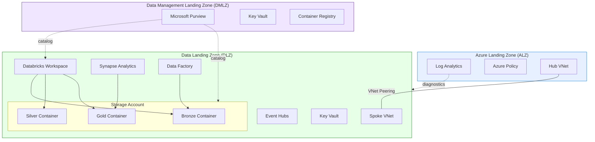

# Tutorial 01: Foundation Platform

> **Estimated Time:** 3-4 hours
> **Difficulty:** Intermediate

Deploy the complete CSA-in-a-Box foundation: Azure Landing Zone (ALZ), Data Management Landing Zone (DMLZ), and Data Landing Zone (DLZ). By the end, you will have a fully functional data platform with storage, Databricks, Synapse, and Data Factory — and you will run a real end-to-end dbt pipeline using USDA open data through Bronze → Silver → Gold.

---

## Prerequisites

Before starting, ensure you have the following installed and configured:

- [ ] **Azure subscription** with Contributor (or Owner) role at the subscription level
- [ ] **Azure CLI** 2.50 or later — [Install guide](https://learn.microsoft.com/en-us/cli/azure/install-azure-cli)
- [ ] **Bicep CLI** 0.22+ (bundled with recent Azure CLI; verify with `az bicep version`)
- [ ] **Python** 3.11 or later — [python.org](https://www.python.org/downloads/)
- [ ] **Git** — [git-scm.com](https://git-scm.com/)
- [ ] **dbt-core** with **dbt-databricks** adapter — installed in Step 10
- [ ] (Optional) **Power BI Desktop** for Step 12

Verify your tools:

```bash
az version --output table
az bicep version
python --version
git --version
```

---

## Architecture Diagram



---

## Step 1: Clone the Repository and Set Up Your Workspace

Clone the CSA-in-a-Box repo and navigate to the project root.

```bash
git clone https://github.com/your-org/csa-inabox.git
cd csa-inabox
```

Create a Python virtual environment for tooling used later in the tutorial:

```bash
python -m venv .venv
# Linux / macOS
source .venv/bin/activate
# Windows PowerShell
# .venv\Scripts\Activate.ps1

pip install --upgrade pip
```

<details>
<summary><strong>Expected Output</strong></summary>

```
Cloning into 'csa-inabox'...
remote: Enumerating objects: ...
...
Successfully installed pip-24.x
```

</details>

### Troubleshooting

| Symptom | Cause | Fix |
|---------|-------|-----|
| `git: command not found` | Git not installed | Install from [git-scm.com](https://git-scm.com/) |
| `python: command not found` | Python not on PATH | Use `python3` or add Python to PATH |
| SSL errors during clone | Corporate proxy | Set `git config --global http.proxy http://proxy:port` |

---

## Step 2: Configure Your Azure Environment

Log in to Azure and select your target subscription.

```bash
# Interactive login (opens browser)
az login

# List subscriptions
az account list --output table

# Set the subscription you want to use
az account set --subscription "<YOUR_SUBSCRIPTION_ID>"

# Verify
az account show --query "{Name:name, ID:id, State:state}" --output table
```

Register the resource providers required by the platform:

```bash
az provider register --namespace Microsoft.Purview
az provider register --namespace Microsoft.Databricks
az provider register --namespace Microsoft.Synapse
az provider register --namespace Microsoft.DataFactory
az provider register --namespace Microsoft.EventHub
az provider register --namespace Microsoft.ContainerRegistry
```

Define your naming convention. Throughout this tutorial, we use:

```bash
export CSA_PREFIX="csa"
export CSA_ENV="dev"
export CSA_LOCATION="eastus"
export CSA_RG_ALZ="${CSA_PREFIX}-rg-alz-${CSA_ENV}"
export CSA_RG_DMLZ="${CSA_PREFIX}-rg-dmlz-${CSA_ENV}"
export CSA_RG_DLZ="${CSA_PREFIX}-rg-dlz-${CSA_ENV}"
```

Create the resource groups:

```bash
az group create --name "$CSA_RG_ALZ"  --location "$CSA_LOCATION"
az group create --name "$CSA_RG_DMLZ" --location "$CSA_LOCATION"
az group create --name "$CSA_RG_DLZ"  --location "$CSA_LOCATION"
```

<details>
<summary><strong>Expected Output</strong></summary>

```json
{
  "id": "/subscriptions/.../resourceGroups/csa-rg-alz-dev",
  "location": "eastus",
  "name": "csa-rg-alz-dev",
  "properties": {
    "provisioningState": "Succeeded"
  },
  "type": "Microsoft.Resources/resourceGroups"
}
```

(Repeated for each resource group.)

</details>

### Troubleshooting

| Symptom | Cause | Fix |
|---------|-------|-----|
| `AuthorizationFailed` | Insufficient permissions | You need at least Contributor at the subscription level |
| `SubscriptionNotFound` | Wrong subscription ID | Re-run `az account list` and copy the correct ID |
| Provider registration pending | Providers take 1-2 minutes | Wait and re-run; check with `az provider show -n Microsoft.Databricks --query "registrationState"` |

---

## Step 3: Deploy the Azure Landing Zone (ALZ)

The ALZ provides shared infrastructure: Log Analytics, Azure Policy assignments, and the hub virtual network.

```bash
cd deploy/bicep/landing-zone-alz

# Review the parameter file and customize values
cat params.dev.json
```

Edit `params.dev.json` to match your environment. Key parameters:

| Parameter | Description | Example Value |
|-----------|-------------|---------------|
| `prefix` | Naming prefix | `csa` |
| `environment` | Environment tag | `dev` |
| `location` | Azure region | `eastus` |
| `logAnalyticsRetentionDays` | Log retention | `90` |

Deploy:

```bash
az deployment group create \
  --resource-group "$CSA_RG_ALZ" \
  --template-file main.bicep \
  --parameters @params.dev.json \
  --name "alz-foundation-$(date +%Y%m%d%H%M)" \
  --verbose
```

This typically takes 5-10 minutes. The deployment creates:

- **Log Analytics workspace** for centralized monitoring
- **Azure Policy** assignments for compliance guardrails
- **Hub Virtual Network** with subnets for management, firewall, and gateway

```bash
# Return to repo root
cd ../../..
```

<details>
<summary><strong>Expected Output</strong></summary>

```
{
  "id": "/subscriptions/.../providers/Microsoft.Resources/deployments/alz-foundation-...",
  "name": "alz-foundation-...",
  "properties": {
    "provisioningState": "Succeeded",
    "outputs": {
      "logAnalyticsWorkspaceId": { "value": "/subscriptions/.../Microsoft.OperationalInsights/workspaces/csa-law-dev" },
      "hubVnetId": { "value": "/subscriptions/.../Microsoft.Network/virtualNetworks/csa-vnet-hub-dev" }
    }
  }
}
```

</details>

### Troubleshooting

| Symptom | Cause | Fix |
|---------|-------|-----|
| `InvalidTemplate` | Bicep syntax error or outdated CLI | Run `az bicep upgrade` and retry |
| `DeploymentFailed` with policy conflict | Existing policies conflict | Review the specific policy error and adjust `params.dev.json` |
| Deployment hangs > 20 min | Region capacity issue | Cancel and retry in a different region |

---

## Step 4: Deploy the Data Management Landing Zone (DMLZ)

The DMLZ hosts shared governance services: Microsoft Purview for data cataloging, a central Key Vault for secrets, and a Container Registry for custom images.

```bash
cd deploy/bicep/DMLZ

# Review parameters
cat params.dev.json
```

Key parameters to customize in `params.dev.json`:

| Parameter | Description | Example Value |
|-----------|-------------|---------------|
| `prefix` | Naming prefix | `csa` |
| `environment` | Environment tag | `dev` |
| `purviewAccountName` | Purview account name | `csa-purview-dev` |
| `keyVaultName` | Key Vault name | `csa-kv-dmlz-dev` |
| `containerRegistryName` | ACR name (globally unique, alphanumeric) | `csaacrdmlzdev` |

Deploy:

```bash
az deployment group create \
  --resource-group "$CSA_RG_DMLZ" \
  --template-file main.bicep \
  --parameters @params.dev.json \
  --name "dmlz-deploy-$(date +%Y%m%d%H%M)" \
  --verbose
```

This takes 8-15 minutes (Purview provisioning is the longest step).

```bash
cd ../../..
```

<details>
<summary><strong>Expected Output</strong></summary>

```
{
  "properties": {
    "provisioningState": "Succeeded",
    "outputs": {
      "purviewAccountId": { "value": "/subscriptions/.../Microsoft.Purview/accounts/csa-purview-dev" },
      "keyVaultUri": { "value": "https://csa-kv-dmlz-dev.vault.azure.net/" },
      "containerRegistryLoginServer": { "value": "csaacrdmlzdev.azurecr.io" }
    }
  }
}
```

</details>

### Troubleshooting

| Symptom | Cause | Fix |
|---------|-------|-----|
| `NameNotAvailable` for ACR | ACR name must be globally unique | Change `containerRegistryName` to a unique alphanumeric string |
| Purview provisioning takes > 20 min | Normal for some regions | Wait up to 30 minutes; check in Azure Portal |
| `KeyVaultAlreadyExists` | Name collision | Key Vault names are globally unique — use a different name |

---

## Step 5: Deploy the Data Landing Zone (DLZ)

The DLZ is where data lives and gets processed. This is the largest deployment, provisioning:

- **Azure Data Lake Storage Gen2** with Bronze / Silver / Gold containers
- **Azure Databricks** workspace
- **Azure Synapse Analytics** workspace with serverless SQL
- **Azure Data Factory** for orchestration
- **Azure Event Hubs** namespace for streaming ingestion
- **Spoke Virtual Network** with NSGs and service endpoints

```bash
cd deploy/bicep/DLZ

# Review and customize parameters
cat params.dev.json
```

Key parameters in `params.dev.json`:

| Parameter | Description | Example Value |
|-----------|-------------|---------------|
| `prefix` | Naming prefix | `csa` |
| `environment` | Environment tag | `dev` |
| `storageAccountName` | ADLS Gen2 name | `csadlsdev` |
| `databricksWorkspaceName` | Databricks workspace | `csa-dbx-dev` |
| `synapseWorkspaceName` | Synapse workspace | `csa-syn-dev` |
| `dataFactoryName` | ADF name | `csa-adf-dev` |
| `sqlAdminPassword` | Synapse SQL admin password | (set a strong password) |

Deploy:

```bash
az deployment group create \
  --resource-group "$CSA_RG_DLZ" \
  --template-file main.bicep \
  --parameters @params.dev.json \
  --name "dlz-deploy-$(date +%Y%m%d%H%M)" \
  --verbose
```

This is the longest deployment: 15-25 minutes. Databricks and Synapse workspace provisioning take the most time.

```bash
cd ../../..
```

<details>
<summary><strong>Expected Output</strong></summary>

```
{
  "properties": {
    "provisioningState": "Succeeded",
    "outputs": {
      "storageAccountId": { "value": "/subscriptions/.../Microsoft.Storage/storageAccounts/csadlsdev" },
      "databricksWorkspaceUrl": { "value": "https://adb-1234567890.12.azuredatabricks.net" },
      "synapseWorkspaceUrl": { "value": "https://csa-syn-dev.dev.azuresynapse.net" },
      "dataFactoryId": { "value": "/subscriptions/.../Microsoft.DataFactory/factories/csa-adf-dev" }
    }
  }
}
```

</details>

### Troubleshooting

| Symptom | Cause | Fix |
|---------|-------|-----|
| `StorageAccountAlreadyTaken` | Storage name must be globally unique | Change `storageAccountName` — lowercase alphanumeric only |
| Databricks fails with quota error | Not enough cores in region | Request a quota increase or switch to a region with capacity |
| Synapse deployment fails | SQL admin password doesn't meet complexity | Use 12+ chars with uppercase, lowercase, numbers, and symbols |
| `LinkedServiceFailure` | Managed identity not yet propagated | Wait 2 minutes and re-deploy; identity propagation is eventually consistent |

---

## Step 6: Configure Networking

Connect the hub and spoke networks so all services can communicate securely.

### 6a. VNet Peering

Peer the ALZ hub VNet with the DLZ spoke VNet:

```bash
# Get VNet resource IDs
HUB_VNET_ID=$(az network vnet list \
  --resource-group "$CSA_RG_ALZ" \
  --query "[0].id" -o tsv)

SPOKE_VNET_ID=$(az network vnet list \
  --resource-group "$CSA_RG_DLZ" \
  --query "[0].id" -o tsv)

HUB_VNET_NAME=$(az network vnet list \
  --resource-group "$CSA_RG_ALZ" \
  --query "[0].name" -o tsv)

SPOKE_VNET_NAME=$(az network vnet list \
  --resource-group "$CSA_RG_DLZ" \
  --query "[0].name" -o tsv)

# Create peering: Hub → Spoke
az network vnet peering create \
  --name "hub-to-dlz" \
  --resource-group "$CSA_RG_ALZ" \
  --vnet-name "$HUB_VNET_NAME" \
  --remote-vnet "$SPOKE_VNET_ID" \
  --allow-vnet-access \
  --allow-forwarded-traffic

# Create peering: Spoke → Hub
az network vnet peering create \
  --name "dlz-to-hub" \
  --resource-group "$CSA_RG_DLZ" \
  --vnet-name "$SPOKE_VNET_NAME" \
  --remote-vnet "$HUB_VNET_ID" \
  --allow-vnet-access \
  --allow-forwarded-traffic
```

### 6b. Private Endpoints (Optional for Dev)

For production, you should create private endpoints for Storage, Databricks, Synapse, and Key Vault. In a dev environment you can skip this step, but here is the pattern for Storage:

```bash
STORAGE_ACCT=$(az storage account list \
  --resource-group "$CSA_RG_DLZ" \
  --query "[0].name" -o tsv)

STORAGE_ID=$(az storage account show \
  --name "$STORAGE_ACCT" \
  --resource-group "$CSA_RG_DLZ" \
  --query "id" -o tsv)

SUBNET_ID=$(az network vnet subnet show \
  --resource-group "$CSA_RG_DLZ" \
  --vnet-name "$SPOKE_VNET_NAME" \
  --name "default" \
  --query "id" -o tsv)

az network private-endpoint create \
  --name "pe-${STORAGE_ACCT}-blob" \
  --resource-group "$CSA_RG_DLZ" \
  --vnet-name "$SPOKE_VNET_NAME" \
  --subnet "default" \
  --private-connection-resource-id "$STORAGE_ID" \
  --group-id blob \
  --connection-name "pe-conn-${STORAGE_ACCT}-blob"
```

### 6c. DNS Zones

If using private endpoints, create private DNS zones and link them:

```bash
az network private-dns zone create \
  --resource-group "$CSA_RG_DLZ" \
  --name "privatelink.blob.core.windows.net"

az network private-dns link vnet create \
  --resource-group "$CSA_RG_DLZ" \
  --zone-name "privatelink.blob.core.windows.net" \
  --name "dns-link-dlz" \
  --virtual-network "$SPOKE_VNET_ID" \
  --registration-enabled false
```

<details>
<summary><strong>Expected Output</strong></summary>

```
{
  "peeringState": "Connected",
  "provisioningState": "Succeeded"
}
```

Both peering directions should show `Connected`.

</details>

### Troubleshooting

| Symptom | Cause | Fix |
|---------|-------|-----|
| `PeeringAlreadyExists` | Peering with that name exists | Delete with `az network vnet peering delete` and recreate |
| Peering state `Initiated` not `Connected` | Only one direction created | Create peering in both directions |
| Private endpoint DNS not resolving | DNS zone not linked to VNet | Create the private DNS zone link (Step 6c) |

---

## Step 7: Set Up RBAC and Managed Identities

Grant the necessary role assignments so services can interact with each other.

### 7a. Get Managed Identity Principal IDs

```bash
# Databricks managed identity
DBX_PRINCIPAL=$(az databricks workspace show \
  --name "csa-dbx-dev" \
  --resource-group "$CSA_RG_DLZ" \
  --query "identity.principalId" -o tsv 2>/dev/null || \
  az resource list --resource-group "$CSA_RG_DLZ" \
    --resource-type "Microsoft.Databricks/workspaces" \
    --query "[0].identity.principalId" -o tsv)

# Data Factory managed identity
ADF_PRINCIPAL=$(az datafactory show \
  --name "csa-adf-dev" \
  --resource-group "$CSA_RG_DLZ" \
  --query "identity.principalId" -o tsv 2>/dev/null || \
  az resource list --resource-group "$CSA_RG_DLZ" \
    --resource-type "Microsoft.DataFactory/factories" \
    --query "[0].identity.principalId" -o tsv)

# Synapse managed identity
SYN_PRINCIPAL=$(az synapse workspace show \
  --name "csa-syn-dev" \
  --resource-group "$CSA_RG_DLZ" \
  --query "identity.principalId" -o tsv 2>/dev/null || \
  az resource list --resource-group "$CSA_RG_DLZ" \
    --resource-type "Microsoft.Synapse/workspaces" \
    --query "[0].identity.principalId" -o tsv)

echo "Databricks: $DBX_PRINCIPAL"
echo "Data Factory: $ADF_PRINCIPAL"
echo "Synapse: $SYN_PRINCIPAL"
```

### 7b. Assign Storage Blob Data Contributor

Grant each service access to the Data Lake:

```bash
STORAGE_ID=$(az storage account show \
  --name "$STORAGE_ACCT" \
  --resource-group "$CSA_RG_DLZ" \
  --query "id" -o tsv)

for PRINCIPAL in "$ADF_PRINCIPAL" "$SYN_PRINCIPAL"; do
  az role assignment create \
    --assignee "$PRINCIPAL" \
    --role "Storage Blob Data Contributor" \
    --scope "$STORAGE_ID"
done
```

### 7c. Grant Your User Access

Assign yourself Storage Blob Data Contributor so you can browse data in the portal and run queries:

```bash
CURRENT_USER=$(az ad signed-in-user show --query "id" -o tsv)

az role assignment create \
  --assignee "$CURRENT_USER" \
  --role "Storage Blob Data Contributor" \
  --scope "$STORAGE_ID"
```

<details>
<summary><strong>Expected Output</strong></summary>

```json
{
  "principalId": "xxxxxxxx-xxxx-xxxx-xxxx-xxxxxxxxxxxx",
  "roleDefinitionId": "/subscriptions/.../providers/Microsoft.Authorization/roleDefinitions/ba92f5b4-...",
  "scope": "/subscriptions/.../storageAccounts/csadlsdev"
}
```

</details>

### Troubleshooting

| Symptom | Cause | Fix |
|---------|-------|-----|
| `PrincipalNotFound` | Managed identity not yet created | Wait 1-2 minutes after deployment for identity propagation |
| `AuthorizationFailed` on role assignment | Need Owner or User Access Administrator | Ask your subscription Owner to grant the role |
| Duplicate role assignment warning | Already assigned | Safe to ignore |

---

## Step 8: Deploy Databricks Workspace and Create a Cluster

The Databricks workspace was provisioned in Step 5. Now configure it with a compute cluster for running dbt and notebooks.

### 8a. Access the Workspace

```bash
DBX_URL=$(az databricks workspace list \
  --resource-group "$CSA_RG_DLZ" \
  --query "[0].workspaceUrl" -o tsv)

echo "Open Databricks at: https://$DBX_URL"
```

Open the URL in your browser and sign in with your Microsoft Entra ID credentials.

### 8b. Create a Personal Access Token

In the Databricks UI:

1. Click your username (top-right) → **Settings**
2. Go to **Developer** → **Access tokens**
3. Click **Generate New Token**
4. Description: `csa-tutorial`, Lifetime: `90 days`
5. Copy the token — you will need it for dbt

```bash
# Store the token for later use
export DATABRICKS_TOKEN="<paste-your-token-here>"
export DATABRICKS_HOST="https://$DBX_URL"
```

### 8c. Create a Cluster

In the Databricks UI:

1. Go to **Compute** → **Create compute**
2. Configure:
   - **Cluster name:** `csa-tutorial-cluster`
   - **Cluster mode:** Single Node (for cost savings in dev)
   - **Databricks Runtime:** 14.3 LTS or later
   - **Node type:** Standard_DS3_v2 (or equivalent, 4 cores / 14 GB)
   - **Terminate after:** 30 minutes of inactivity
3. Click **Create Compute**

Alternatively, use the Databricks CLI:

```bash
pip install databricks-cli

databricks configure --token <<EOF
$DATABRICKS_HOST
$DATABRICKS_TOKEN
EOF

databricks clusters create --json '{
  "cluster_name": "csa-tutorial-cluster",
  "spark_version": "14.3.x-scala2.12",
  "node_type_id": "Standard_DS3_v2",
  "num_workers": 0,
  "autotermination_minutes": 30,
  "spark_conf": {
    "spark.databricks.cluster.profile": "singleNode",
    "spark.master": "local[*]"
  },
  "custom_tags": {
    "ResourceClass": "SingleNode"
  }
}'
```

Wait for the cluster to reach `RUNNING` state (2-5 minutes).

<details>
<summary><strong>Expected Output</strong></summary>

```json
{
  "cluster_id": "0422-123456-abcdef"
}
```

The cluster appears in the Databricks Compute page with a green running indicator.

</details>

### Troubleshooting

| Symptom | Cause | Fix |
|---------|-------|-----|
| `CLOUD_PROVIDER_LAUNCH_FAILURE` | VM quota exhausted | Request quota increase for Standard_DS3_v2 in your region, or pick a smaller node type |
| Cannot access workspace URL | Network/firewall blocking | Ensure your network allows HTTPS to `*.azuredatabricks.net` |
| Token generation disabled | Workspace admin policy | Ask your Databricks admin to enable PAT tokens |

---

## Step 9: Configure Data Factory for Ingestion

Set up a simple Data Factory pipeline to copy raw data into the Bronze layer.

### 9a. Create Linked Services

In the Azure Portal, navigate to your Data Factory (`csa-adf-dev`) → **Manage** → **Linked services**.

Create an **Azure Data Lake Storage Gen2** linked service:

- **Name:** `ls_adls_bronze`
- **Authentication:** System-assigned Managed Identity
- **URL:** `https://csadlsdev.dfs.core.windows.net`

Test the connection. If it fails, verify the RBAC assignment from Step 7b completed.

### 9b. Create a Simple Copy Pipeline

For the tutorial, we will ingest data via the dbt workflow in Step 10 instead of building a full ADF pipeline. Data Factory is ready for production pipelines — refer to `docs/ADF_SETUP.md` for detailed pipeline configuration.

Verify Data Factory is accessible:

```bash
az datafactory show \
  --name "csa-adf-dev" \
  --resource-group "$CSA_RG_DLZ" \
  --query "{name:name, state:properties.publicNetworkAccess, provisioningState:provisioningState}" \
  --output table
```

<details>
<summary><strong>Expected Output</strong></summary>

```
Name          State     ProvisioningState
------------  --------  -------------------
csa-adf-dev   Enabled   Succeeded
```

</details>

### Troubleshooting

| Symptom | Cause | Fix |
|---------|-------|-----|
| Linked service connection test fails | RBAC not yet propagated | Wait 2 minutes; verify role assignment in Step 7b |
| `DataFactoryNotFound` | Deployment didn't complete | Re-run Step 5 deployment |

---

## Step 10: Run the dbt Pipeline with USDA Data

This is the core data engineering exercise. You will download real USDA open data, load it into the Bronze layer, and use dbt to transform it through the medallion architecture: Bronze → Silver → Gold.

### 10a. Install dbt

```bash
# From the repo root, in your virtual environment
pip install dbt-core dbt-databricks
dbt --version
```

<details>
<summary><strong>Expected Output</strong></summary>

```
Core:
  - installed: 1.8.x
  - latest:    1.8.x

Plugins:
  - databricks: 1.8.x
```

</details>

### 10b. Download USDA Open Data

The CSA-in-a-Box repo includes a data download script and the USDA vertical example.

```bash
# Download USDA open datasets
python scripts/data/seed-sample-data.sh
# Or use the USDA-specific data in the example
ls examples/usda/data/open-data/
```

If the download script is not available, manually download from the USDA APIs:

```bash
mkdir -p examples/usda/data/open-data

# USDA NASS QuickStats (crop production data)
curl -o examples/usda/data/open-data/nass_quickstats.csv \
  "https://quickstats.nass.usda.gov/api/api_GET/?key=YOUR_API_KEY&commodity_desc=CORN&year=2023&format=CSV"

# Or use the seed data already in the repo
ls examples/usda/data/
```

### 10c. Upload Raw Data to Bronze

Upload the raw CSV files to the Bronze container in your Data Lake:

```bash
STORAGE_ACCT=$(az storage account list \
  --resource-group "$CSA_RG_DLZ" \
  --query "[0].name" -o tsv)

# Create medallion containers if not already created by Bicep
for LAYER in bronze silver gold; do
  az storage container create \
    --name "$LAYER" \
    --account-name "$STORAGE_ACCT" \
    --auth-mode login \
    2>/dev/null || true
done

# Upload USDA data to Bronze
az storage blob upload-batch \
  --destination bronze \
  --source examples/usda/data/ \
  --account-name "$STORAGE_ACCT" \
  --auth-mode login \
  --destination-path "usda/" \
  --overwrite
```

<details>
<summary><strong>Expected Output</strong></summary>

```
Finished[#############################################################]  100.0000%
[
  {
    "Blob": "usda/open-data/nass_quickstats.csv",
    "Last Modified": "2026-04-22T...",
    "eTag": "..."
  },
  ...
]
```

</details>

### 10d. Configure dbt Profile

Create a dbt profile that connects to your Databricks workspace:

```bash
mkdir -p ~/.dbt

cat > ~/.dbt/profiles.yml << 'PROFILE'
csa_usda:
  target: dev
  outputs:
    dev:
      type: databricks
      catalog: hive_metastore
      schema: usda_gold
      host: "${DATABRICKS_HOST#https://}"
      http_path: /sql/1.0/warehouses/AUTO
      token: "${DATABRICKS_TOKEN}"
      threads: 4
PROFILE
```

> **Note:** Replace the `host` and `token` values with your actual Databricks workspace URL (without `https://`) and personal access token from Step 8b. The `http_path` can point to either a SQL Warehouse or a cluster. For the tutorial cluster, use: `/sql/protocolv1/o/0/0422-123456-abcdef` (replace with your cluster ID).

### 10e. Run dbt Models

Navigate to the USDA dbt project and run the transformations:

```bash
cd examples/usda/domains/dbt

# Verify dbt can connect
dbt debug

# Install dbt packages (if any)
dbt deps

# Load seed data (reference CSVs)
dbt seed

# Run all models: Bronze → Silver → Gold
dbt run

# Run tests to validate data quality
dbt test
```

<details>
<summary><strong>Expected Output</strong></summary>

```
Running with dbt=1.8.x
Found X models, Y tests, Z seeds

Concurrency: 4 threads (target='dev')

1 of X OK created sql table model usda_bronze.raw_nass_quickstats .... [OK in 12.34s]
2 of X OK created sql table model usda_silver.stg_nass_quickstats .... [OK in 8.56s]
3 of X OK created sql table model usda_gold.fct_crop_production ...... [OK in 6.78s]
...

Finished running X table models in 0 hours 1 minutes and 23.45 seconds (83.45s).

Completed successfully

Done. PASS=X WARN=0 ERROR=0 SKIP=0 TOTAL=X
```

</details>

### 10f. Validate Row Counts

After dbt completes, verify data materialized correctly:

```bash
dbt run-operation check_row_counts 2>/dev/null || \
  echo "Run the following SQL in Databricks to validate:"

cat << 'SQL'
-- Run in Databricks SQL Editor or a notebook
SELECT 'bronze' as layer, count(*) as row_count FROM usda_bronze.raw_nass_quickstats
UNION ALL
SELECT 'silver', count(*) FROM usda_silver.stg_nass_quickstats
UNION ALL
SELECT 'gold', count(*) FROM usda_gold.fct_crop_production
ORDER BY layer;
SQL
```

Expected pattern: Bronze has the most rows (raw), Silver has slightly fewer (cleaned/deduped), Gold has aggregated facts.

```bash
cd ../../../..
```

### Troubleshooting

| Symptom | Cause | Fix |
|---------|-------|-----|
| `dbt debug` fails with connection error | Wrong host, token, or http_path | Double-check `profiles.yml`; ensure cluster is running |
| `Runtime Error: Catalog 'hive_metastore' does not exist` | Unity Catalog workspace without hive_metastore | Change catalog to your UC catalog name |
| `PERMISSION_DENIED` on storage | Databricks can't access ADLS | Mount storage or configure Unity Catalog external locations |
| `dbt seed` timeout | Large seed files | Increase `threads` or reduce seed data size |
| No data in Gold tables | Model SQL has errors | Check `dbt run` output for specific model errors; fix SQL and re-run |

---

## Step 11: Query Gold Layer with Synapse Serverless SQL

Now that data is in the Gold layer, query it using Synapse Analytics serverless SQL — no infrastructure to manage.

### 11a. Get Synapse Endpoint

```bash
SYN_ENDPOINT=$(az synapse workspace show \
  --name "csa-syn-dev" \
  --resource-group "$CSA_RG_DLZ" \
  --query "connectivityEndpoints.sql" -o tsv)

echo "Synapse SQL endpoint: $SYN_ENDPOINT"
```

### 11b. Create an External Data Source

Open Synapse Studio (`https://csa-syn-dev.dev.azuresynapse.net`) or use `sqlcmd`:

```sql
-- Connect to the built-in serverless SQL pool

-- Create a database for analytics
CREATE DATABASE usda_analytics;
GO

USE usda_analytics;
GO

-- Create a credential for accessing the Data Lake
CREATE MASTER KEY ENCRYPTION BY PASSWORD = 'YourStr0ngP@ssw0rd!';

CREATE DATABASE SCOPED CREDENTIAL ManagedIdentityCredential
WITH IDENTITY = 'Managed Identity';

-- Create an external data source pointing to the Gold container
CREATE EXTERNAL DATA SOURCE GoldLayer
WITH (
    LOCATION = 'abfss://gold@csadlsdev.dfs.core.windows.net',
    CREDENTIAL = ManagedIdentityCredential
);

-- Create an external file format for Delta
CREATE EXTERNAL FILE FORMAT DeltaFormat
WITH (FORMAT_TYPE = DELTA);
```

### 11c. Query Gold Data

```sql
-- Query the Gold layer directly using OPENROWSET
SELECT TOP 100 *
FROM OPENROWSET(
    BULK 'usda/fct_crop_production/',
    DATA_SOURCE = 'GoldLayer',
    FORMAT = 'DELTA'
) AS crop_data;

-- Aggregation example
SELECT
    commodity_desc,
    year,
    SUM(value) AS total_production
FROM OPENROWSET(
    BULK 'usda/fct_crop_production/',
    DATA_SOURCE = 'GoldLayer',
    FORMAT = 'DELTA'
) AS crop_data
GROUP BY commodity_desc, year
ORDER BY year DESC, total_production DESC;
```

<details>
<summary><strong>Expected Output</strong></summary>

```
commodity_desc    year    total_production
----------------  ------  ----------------
CORN              2023    15,234,000,000
SOYBEANS          2023     4,165,000,000
WHEAT             2023     1,812,000,000
...
```

(Actual values depend on the USDA dataset downloaded.)

</details>

### Troubleshooting

| Symptom | Cause | Fix |
|---------|-------|-----|
| `Login failed` in Synapse | Microsoft Entra ID not configured | Add your user as Synapse Administrator in IAM |
| `External table not accessible` | Managed identity lacks storage access | Verify Synapse RBAC from Step 7b |
| `File not found` in OPENROWSET | Wrong path or data not in Gold | Verify Gold container contents: `az storage blob list --container-name gold --account-name csadlsdev --auth-mode login` |
| Delta format not supported | Older Synapse runtime | Ensure you're using the built-in serverless pool (supports Delta natively) |

---

## Step 12: Connect Power BI (Optional)

If you have Power BI Desktop, you can connect directly to Synapse serverless SQL or Databricks for interactive dashboards.

### Option A: Connect to Synapse

1. Open Power BI Desktop
2. **Get Data** → **Azure** → **Azure Synapse Analytics SQL**
3. Server: paste `$SYN_ENDPOINT` value from Step 11a
4. Database: `usda_analytics`
5. Data Connectivity mode: **DirectQuery** (recommended) or Import
6. Sign in with your Microsoft Entra ID credentials
7. Select the Gold-layer views/tables and build your report

### Option B: Connect to Databricks

1. Open Power BI Desktop
2. **Get Data** → **Azure** → **Azure Databricks**
3. Server hostname: your Databricks workspace URL
4. HTTP Path: `/sql/protocolv1/o/0/<cluster-id>`
5. Use your personal access token for authentication
6. Select Gold-layer tables

<details>
<summary><strong>Expected Output</strong></summary>

Power BI loads the Gold-layer tables. You can create visuals such as:

- Bar chart: crop production by commodity
- Line chart: production trends over time
- Map visual: production by state (if geographic data is available)

</details>

---

## Validation

Run the automated validation script to confirm your Foundation Platform is correctly deployed:

```bash
cd docs/tutorials/01-foundation-platform

chmod +x validate.sh

./validate.sh --prefix csa --env dev
```

<details>
<summary><strong>Expected Output</strong></summary>

```
==========================================
  CSA-in-a-Box Foundation Validation
==========================================
  Prefix:       csa
  Environment:  dev
==========================================

Using subscription: My Azure Subscription

--- Resource Groups ---
  PASS  Resource group 'csa-rg-alz-dev' exists
  PASS  Resource group 'csa-rg-dmlz-dev' exists
  PASS  Resource group 'csa-rg-dlz-dev' exists

--- Data Management Landing Zone (DMLZ) ---
  PASS  Microsoft Purview found in 'csa-rg-dmlz-dev' (count: 1)
  PASS  Key Vault found in 'csa-rg-dmlz-dev' (count: 1)
  PASS  Container Registry found in 'csa-rg-dmlz-dev' (count: 1)

--- Data Landing Zone (DLZ) ---
  PASS  Storage Account found in 'csa-rg-dlz-dev' (count: 1)
  PASS  Databricks Workspace found in 'csa-rg-dlz-dev' (count: 1)
  PASS  Synapse Workspace found in 'csa-rg-dlz-dev' (count: 1)
  PASS  Data Factory found in 'csa-rg-dlz-dev' (count: 1)
  PASS  Event Hubs Namespace found in 'csa-rg-dlz-dev' (count: 1)

--- Networking ---
  PASS  VNet found in DLZ
  PASS  Private endpoints configured (3 found)

--- Databricks ---
  PASS  Databricks workspace URL: https://adb-1234567890.12.azuredatabricks.net

--- Storage (Medallion Architecture) ---
  PASS  Container 'bronze' exists in storage account 'csadlsdev'
  PASS  Container 'silver' exists in storage account 'csadlsdev'
  PASS  Container 'gold' exists in storage account 'csadlsdev'

--- dbt Pipeline (USDA Vertical) ---
  PASS  Gold layer contains data (42 blobs)

==========================================
  Results: 18 passed, 0 failed, 0 warnings (of 18 checks)
==========================================
  All checks passed! Your Foundation Platform is ready.
```

</details>

---

## Completion Checklist

- [ ] Three resource groups created (ALZ, DMLZ, DLZ)
- [ ] ALZ deployed: Log Analytics, Policy, Hub VNet
- [ ] DMLZ deployed: Purview, Key Vault, Container Registry
- [ ] DLZ deployed: Storage, Databricks, Synapse, Data Factory, Event Hubs
- [ ] VNet peering configured between Hub and Spoke
- [ ] RBAC assigned: services have Storage Blob Data Contributor
- [ ] Databricks cluster created and running
- [ ] Data Factory accessible with linked service to ADLS
- [ ] USDA data loaded into Bronze container
- [ ] dbt pipeline ran successfully: Bronze → Silver → Gold
- [ ] Gold layer queryable via Synapse serverless SQL
- [ ] `validate.sh` reports all checks as PASS

---

## Next Steps

Your Foundation Platform is ready. Choose your next path:

- **[Tutorial 02: Governance & Compliance](../02-governance/)** — Set up Purview cataloging and policy guardrails (recommended next)
- **[Tutorial 05: Real-Time Streaming](../05-streaming/)** — Add Event Hubs and Structured Streaming
- **[Tutorial 06: AI Analytics](../06-ai-analytics/)** — Deploy Azure OpenAI and ML pipelines

See the [Tutorial Index](../README.md) for all available paths.

---

## Clean Up (Optional)

To remove all resources created in this tutorial and stop incurring costs:

```bash
# Delete in reverse order to avoid dependency issues
az group delete --name "$CSA_RG_DLZ"  --yes --no-wait
az group delete --name "$CSA_RG_DMLZ" --yes --no-wait
az group delete --name "$CSA_RG_ALZ"  --yes --no-wait
```

> **Warning:** This permanently deletes all resources and data. Only run this if you are finished with the tutorials or want to start fresh. Deletion takes 10-20 minutes to complete.

---

## Reference

- [CSA-in-a-Box Architecture](../../ARCHITECTURE.md)
- [Getting Started Guide](../../GETTING_STARTED.md)
- [Databricks Guide](../../DATABRICKS_GUIDE.md)
- [ADF Setup](../../ADF_SETUP.md)
- [Troubleshooting](../../TROUBLESHOOTING.md)
- [USDA Vertical Example](../../../examples/usda/README.md)
- [Bicep DLZ Modules](../../../deploy/bicep/DLZ/modules/)
- [Bicep DMLZ Modules](../../../deploy/bicep/DMLZ/modules/)
- [Bicep ALZ Templates](../../../deploy/bicep/landing-zone-alz/)
