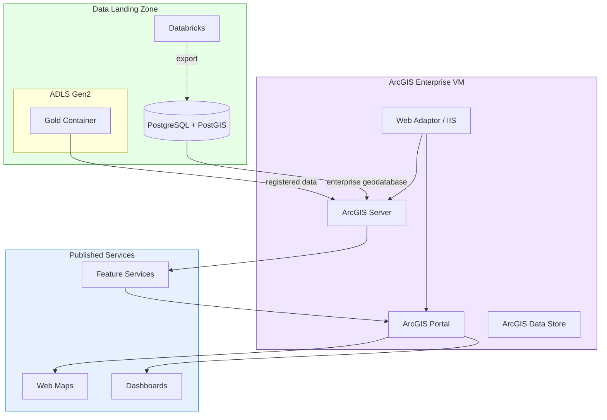

# Tutorial 04: GeoAnalytics with ArcGIS Enterprise (BYOL)

> **Estimated Time:** 3-4 hours (plus ArcGIS installation time)
> **Difficulty:** Advanced

> **BYOL (Bring Your Own License):** This tutorial requires a valid Esri ArcGIS Enterprise license. CSA-in-a-Box provisions the Azure infrastructure, but you must supply your own Esri license files. If you do not have an Esri license, see [Tutorial 03: GeoAnalytics with Open-Source Tools](../03-geoanalytics-oss/) for a fully open-source alternative.

Deploy ArcGIS Enterprise on Azure infrastructure provisioned by CSA-in-a-Box, register your data products as enterprise geodatabase feature services, and build web maps and dashboards connected to the CSA Gold layer.

---

## Prerequisites

Before starting, ensure you have:

- [ ] **Azure subscription** with Contributor role and sufficient quota for D-series VMs
- [ ] **Tutorial 01 completed** — Foundation Platform deployed
- [ ] **Valid Esri ArcGIS Enterprise license** — including Portal, Server, and Data Store authorization files
- [ ] **Esri My Esri account** — to download ArcGIS Enterprise installers
- [ ] **RDP client** — for connecting to the Windows VM (built into Windows; use Microsoft Remote Desktop on macOS)
- [ ] **Azure CLI** authenticated

Verify your tools:

```bash
az account show --query "{Name:name, ID:id}" --output table
```

### Cost Estimates

ArcGIS Enterprise requires substantial compute. Estimated Azure costs:

| Resource | SKU | Monthly Cost (Est.) |
|----------|-----|---------------------|
| ArcGIS VM | Standard_D8s_v5 (8 vCPU, 32 GB) | ~$280/month |
| OS Disk | 256 GB Premium SSD | ~$38/month |
| Data Disk | 512 GB Premium SSD | ~$73/month |
| Public IP | Static | ~$4/month |
| **Total** | | **~$395/month** |

> **Cost-Saving Tip:** Deallocate the VM when not in use with `az vm deallocate`. You only pay for disk storage while deallocated (~$111/month).

---

## Architecture Diagram



---

## Step 1: Deploy ArcGIS Infrastructure

Deploy the ArcGIS Enterprise VM and supporting resources using the CSA-in-a-Box Bicep module.

```bash
export CSA_PREFIX="csa"
export CSA_ENV="dev"
export CSA_RG_DLZ="${CSA_PREFIX}-rg-dlz-${CSA_ENV}"

cd deploy/bicep/dlz/modules

# Review the ArcGIS Bicep module
cat arcgis-enterprise.bicep
```

Deploy:

```bash
az deployment group create \
  --resource-group "$CSA_RG_DLZ" \
  --template-file arcgis-enterprise.bicep \
  --parameters \
    prefix="$CSA_PREFIX" \
    environment="$CSA_ENV" \
    vmSize="Standard_D8s_v5" \
    adminUsername="arcgisadmin" \
    adminPassword="YourStr0ng_ArcG!S_P@ss" \
    dataDiskSizeGB=512 \
  --name "arcgis-$(date +%Y%m%d%H%M)" \
  --verbose
```

This deployment takes 10-15 minutes and creates:

- **Windows Server 2022 VM** with IIS pre-configured
- **Premium SSD data disk** for ArcGIS data storage
- **Network Security Group** with rules for HTTPS (443) and RDP (3389)
- **Public IP** with DNS label for Portal/Server access
- **NIC** connected to the DLZ spoke VNet

```bash
cd ../../../..
```

<details>
<summary><strong>Expected Output</strong></summary>

```json
{
  "properties": {
    "provisioningState": "Succeeded",
    "outputs": {
      "vmName": { "value": "csa-vm-arcgis-dev" },
      "publicIpFqdn": { "value": "csa-arcgis-dev.eastus.cloudapp.azure.com" },
      "privateIpAddress": { "value": "10.1.2.10" }
    }
  }
}
```

</details>

### Troubleshooting

| Symptom | Cause | Fix |
|---------|-------|-----|
| `QuotaExceeded` for D8s_v5 | Not enough vCPU quota | Request quota increase or use `Standard_D4s_v5` (4 vCPU, minimum) |
| Deployment fails with disk error | Premium SSD not available | Switch to `StandardSSD_LRS` for dev (performance impact) |
| NSG blocks RDP | Restrictive corporate policies | Add your IP to NSG rules or use Azure Bastion |

---

## Step 2: RDP into VM and Install ArcGIS Enterprise

### 2a. Connect via RDP

```bash
# Get the public IP
ARCGIS_IP=$(az vm show \
  --name "csa-vm-arcgis-dev" \
  --resource-group "$CSA_RG_DLZ" \
  --show-details \
  --query "publicIps" -o tsv)

echo "RDP to: $ARCGIS_IP"
echo "Username: arcgisadmin"
```

Open your RDP client and connect to the VM using the IP address and credentials.

### 2b. Prepare the VM

Once connected via RDP, open PowerShell as Administrator:

```powershell
# Initialize the data disk
Get-Disk | Where-Object PartitionStyle -eq "RAW" |
    Initialize-Disk -PartitionStyle GPT -PassThru |
    New-Partition -AssignDriveLetter -UseMaximumSize |
    Format-Volume -FileSystem NTFS -NewFileSystemLabel "ArcGIS Data" -Confirm:$false

# Create directory structure on data disk
$dataDrive = (Get-Volume -FileSystemLabel "ArcGIS Data").DriveLetter
New-Item -ItemType Directory -Path "${dataDrive}:\ArcGIS\Installer" -Force
New-Item -ItemType Directory -Path "${dataDrive}:\ArcGIS\Data" -Force
New-Item -ItemType Directory -Path "${dataDrive}:\ArcGIS\Backup" -Force

# Enable IIS features required by Web Adaptor
Install-WindowsFeature Web-Server, Web-Mgmt-Tools, Web-Scripting-Tools,
    Web-Windows-Auth, Web-Asp-Net45, Web-ISAPI-Filter, Web-ISAPI-Ext -IncludeManagementTools
```

### 2c. Download and Install ArcGIS Enterprise

> **Important:** You must download ArcGIS Enterprise from your [My Esri](https://my.esri.com/) account. CSA-in-a-Box does not distribute Esri software.

1. Log in to [my.esri.com](https://my.esri.com/) from the VM's browser
2. Navigate to **Downloads** → **ArcGIS Enterprise**
3. Download the following components to `D:\ArcGIS\Installer\`:
   - ArcGIS Portal
   - ArcGIS Server
   - ArcGIS Data Store
   - ArcGIS Web Adaptor (IIS)

Follow the Esri installation documentation:

- [Install ArcGIS Enterprise on Windows](https://enterprise.arcgis.com/en/installation/windows/install-guides/windows-install.htm)
- [ArcGIS Enterprise Builder (simplified setup)](https://enterprise.arcgis.com/en/installation/windows/install-guides/arcgis-enterprise-builder.htm)

Install in this order:

1. **ArcGIS Server** → authorize with your license file
2. **ArcGIS Portal** → authorize with your license file
3. **ArcGIS Data Store** → configure as relational and tile cache
4. **ArcGIS Web Adaptor** → configure for both Portal and Server

<details>
<summary><strong>Expected Output</strong></summary>

After installation and configuration, verify by opening in the VM browser:

```
https://localhost/portal/home/     → ArcGIS Portal home page
https://localhost/server/admin/    → ArcGIS Server admin page
```

</details>

### Troubleshooting

| Symptom | Cause | Fix |
|---------|-------|-----|
| Installer fails with .NET error | Missing .NET Framework | Install .NET Framework 4.8 from Windows Features |
| Portal won't start | Insufficient memory | Ensure VM has at least 16 GB RAM; D8s_v5 recommended |
| Web Adaptor config fails | IIS not properly configured | Re-run `Install-WindowsFeature` commands from Step 2b |
| License authorization fails | Wrong license file or expired | Contact Esri support or verify on my.esri.com |

---

## Step 3: Configure ArcGIS Portal and Server

### 3a. Create Initial Administrator Account

Open `https://<ARCGIS_IP>/portal/home/` in a browser and create the initial admin account:

- **First Name / Last Name:** Your name
- **Username:** `portaladmin`
- **Password:** Use a strong password
- **Security Question:** Choose and answer

### 3b. Federate ArcGIS Server with Portal

1. In Portal, go to **Organization** → **Settings** → **Servers**
2. Click **Add Server**
3. Enter:
   - **Services URL:** `https://csa-arcgis-dev.eastus.cloudapp.azure.com/server`
   - **Admin URL:** `https://csa-arcgis-dev.eastus.cloudapp.azure.com:6443/arcgis`
   - **Username/Password:** ArcGIS Server admin credentials
4. Set as **Hosting Server**

### 3c. Configure SSL Certificate (Recommended)

For production, replace the self-signed certificate:

```powershell
# On the VM, request a Let's Encrypt certificate or use your org's CA
# Then import into ArcGIS Server and Portal
# See: https://enterprise.arcgis.com/en/server/latest/administer/windows/configuring-https.htm
```

<details>
<summary><strong>Expected Output</strong></summary>

After federation, the Portal home page shows:
- **Organization:** Your org name
- **Hosted Server:** Connected (green indicator)
- **Data Store:** Relational + Tile Cache configured

</details>

---

## Step 4: Register Enterprise Geodatabase (PostgreSQL)

Connect ArcGIS Server to the PostgreSQL/PostGIS database from Tutorial 03.

### 4a. Install PostgreSQL Client on the VM

```powershell
# Download and install PostgreSQL ODBC driver on the ArcGIS VM
# Or install the PostgreSQL client libraries required by ArcGIS
# See: https://enterprise.arcgis.com/en/server/latest/manage-data/windows/database-requirements-postgresql.htm
```

### 4b. Register the Database in ArcGIS Server

1. Open ArcGIS Server Manager: `https://<ARCGIS_IP>:6443/arcgis/manager/`
2. Go to **Site** → **Data Stores**
3. Click **Register Database**
4. Configure:
   - **Name:** `csa_geodb`
   - **Type:** PostgreSQL
   - **Connection Properties:**
     - **Server:** `csa-pg-geo-dev.postgres.database.azure.com`
     - **Port:** `5432`
     - **Database:** `geodb`
     - **Authentication:** Database (use csaadmin credentials)
     - **SSL:** Required
5. Click **Register**

### 4c. Enable Enterprise Geodatabase

Using ArcGIS Pro or Python (on a machine with ArcPy):

```python
# Requires ArcGIS Pro with ArcPy
import arcpy
arcpy.management.EnableEnterpriseGeodatabase(
    input_database="csa_geodb",  # registered database connection
    authorization_file=r"D:\ArcGIS\license\server_keycodes"
)
print("Enterprise geodatabase enabled")
```

<details>
<summary><strong>Expected Output</strong></summary>

```
Enterprise geodatabase enabled
Data Store registration: csa_geodb - Validated (green checkmark in Server Manager)
```

</details>

### Troubleshooting

| Symptom | Cause | Fix |
|---------|-------|-----|
| Registration fails with connection error | PostgreSQL firewall blocking VM | Add the VM's private IP to PostgreSQL firewall rules |
| `EnableEnterpriseGeodatabase` fails | Missing ArcGIS license level | Requires Standard or Advanced license with Geodatabase extension |
| SSL error connecting to PostgreSQL | Certificate trust issue | Download Azure PostgreSQL CA cert and add to VM trust store |

---

## Step 5: Publish Feature Services from CSA Data Products

Publish your CSA Gold-layer data as ArcGIS feature services.

### 5a. Publish via ArcGIS Pro

1. Open ArcGIS Pro on a connected machine
2. Connect to your Portal (`https://csa-arcgis-dev.eastus.cloudapp.azure.com/portal`)
3. Add a database connection to `csa_geodb`
4. Add `geo.county_earthquake_summary` to a map
5. Right-click the layer → **Sharing** → **Share As Web Layer**
6. Configure:
   - **Name:** `County Earthquake Summary`
   - **Layer Type:** Feature
   - **Server:** Your federated hosting server
7. Click **Publish**

### 5b. Publish via REST API

Alternatively, publish using the ArcGIS REST API:

```bash
# Get a token
TOKEN=$(curl -s -X POST \
  "https://csa-arcgis-dev.eastus.cloudapp.azure.com/portal/sharing/rest/generateToken" \
  -d "username=portaladmin" \
  -d "password=YourP@ssword" \
  -d "referer=https://csa-arcgis-dev.eastus.cloudapp.azure.com" \
  -d "f=json" | python -c "import sys,json; print(json.load(sys.stdin)['token'])")

# Create a feature service item
curl -X POST \
  "https://csa-arcgis-dev.eastus.cloudapp.azure.com/portal/sharing/rest/content/users/portaladmin/addItem" \
  -d "token=$TOKEN" \
  -d "f=json" \
  -d "type=Feature Service" \
  -d "title=CSA Earthquake Analysis" \
  -d "tags=csa,earthquakes,geoanalytics" \
  -d "url=https://csa-arcgis-dev.eastus.cloudapp.azure.com/server/rest/services/CSA/EarthquakeAnalysis/FeatureServer"
```

<details>
<summary><strong>Expected Output</strong></summary>

```json
{
  "success": true,
  "id": "abc123def456",
  "folder": null
}
```

Feature service available at:
```
https://csa-arcgis-dev.eastus.cloudapp.azure.com/server/rest/services/CSA/EarthquakeAnalysis/FeatureServer/0
```

</details>

---

## Step 6: Create Web Maps and Dashboards

### 6a. Create a Web Map

1. In Portal, click **Map** → **New Map**
2. Click **Add** → **Add Layer from URL**
3. Paste your Feature Service URL
4. Style the layer:
   - **Drawing Style:** Counts and Amounts (Color)
   - **Field:** `earthquake_count`
   - **Color Ramp:** Yellow → Red
5. Save the map as `CSA Earthquake Risk Map`

### 6b. Create a Dashboard

1. In Portal, go to **Content** → **Create** → **Dashboard**
2. Add widgets:
   - **Map widget:** Link to `CSA Earthquake Risk Map`
   - **Indicator:** Total earthquake count
   - **Serial Chart:** Earthquakes by state
   - **List:** Top 10 highest-risk counties
3. Configure actions: Clicking a county on the map filters all widgets
4. Save and share the dashboard

<details>
<summary><strong>Expected Output</strong></summary>

The dashboard displays:
- Interactive map with county earthquake choropleth
- KPI indicator showing total earthquake count
- Bar chart of top states by earthquake frequency
- Filterable list of high-risk counties

</details>

---

## Step 7: Configure ArcGIS Integration with CSA Gold Layer

Set up automated data refresh from the CSA Gold layer to ArcGIS.

### 7a. Register ADLS as a Data Store

In ArcGIS Server Manager:

1. Go to **Site** → **Data Stores** → **Register Cloud Store**
2. Select **Microsoft Azure Storage**
3. Configure:
   - **Name:** `csa_gold_layer`
   - **Connection String:** Use storage account key or SAS token
   - **Container:** `gold`

### 7b. Create a Scheduled Refresh

```python
# Schedule a Python script to update the geodatabase from Gold layer
# save as: scripts/geo/arcgis_refresh.py

import subprocess
import datetime

# Download latest Gold data from ADLS
subprocess.run([
    "az", "storage", "blob", "download-batch",
    "--source", "gold",
    "--destination", "D:\\ArcGIS\\Data\\gold",
    "--account-name", "csadlsdev",
    "--auth-mode", "login",
    "--pattern", "geospatial/*"
])

print(f"Gold layer refreshed at {datetime.datetime.now()}")
```

### 7c. Schedule via Windows Task Scheduler

```powershell
# Create a scheduled task to refresh data daily
$action = New-ScheduledTaskAction -Execute "python.exe" `
    -Argument "D:\ArcGIS\scripts\arcgis_refresh.py"
$trigger = New-ScheduledTaskTrigger -Daily -At "06:00AM"
Register-ScheduledTask -TaskName "CSA-GoldLayerRefresh" `
    -Action $action -Trigger $trigger `
    -Description "Refresh ArcGIS data from CSA Gold layer"
```

---

## Step 8: Next Steps — ArcGIS GeoEvent Server for Streaming

For real-time streaming data, consider adding ArcGIS GeoEvent Server:

1. **Install GeoEvent Server** on the same VM or a dedicated VM
2. **Configure input connectors** for Azure Event Hubs (see [Tutorial 05](../05-streaming-lambda/))
3. **Create GeoEvent services** to process streaming earthquake data
4. **Publish to real-time feature layers** for live dashboards

See: [ArcGIS GeoEvent Server Documentation](https://enterprise.arcgis.com/en/geoevent/latest/install/windows/welcome-to-the-arcgis-geoevent-server-install-guide.htm)

---

## Completion Checklist

- [ ] ArcGIS VM deployed on Azure
- [ ] ArcGIS Enterprise installed (Portal, Server, Data Store, Web Adaptor)
- [ ] Portal and Server federated
- [ ] Enterprise geodatabase registered (PostgreSQL)
- [ ] Feature services published from CSA data products
- [ ] Web map created with earthquake risk visualization
- [ ] Dashboard built with interactive widgets
- [ ] Gold layer integration configured

---

## What's Next

- **[Tutorial 03: GeoAnalytics with Open-Source Tools](../03-geoanalytics-oss/)** — Open-source alternative (if you haven't completed it)
- **[Tutorial 05: Real-Time Streaming](../05-streaming-lambda/)** — Add streaming data pipeline with Lambda Architecture
- **[Tutorial 06: AI Analytics](../06-ai-analytics/)** — Apply ML models for predictive geospatial analysis

See the [Tutorial Index](../README.md) for all available paths.

---

## Clean Up

To remove ArcGIS resources and stop incurring costs:

```bash
# Deallocate VM (stop charges, keep disk)
az vm deallocate --name "csa-vm-arcgis-dev" --resource-group "$CSA_RG_DLZ"

# Or delete entirely
az vm delete --name "csa-vm-arcgis-dev" --resource-group "$CSA_RG_DLZ" --yes
az disk delete --name "csa-vm-arcgis-dev-osdisk" --resource-group "$CSA_RG_DLZ" --yes
az disk delete --name "csa-vm-arcgis-dev-datadisk" --resource-group "$CSA_RG_DLZ" --yes
az network nic delete --name "csa-vm-arcgis-dev-nic" --resource-group "$CSA_RG_DLZ"
az network public-ip delete --name "csa-vm-arcgis-dev-pip" --resource-group "$CSA_RG_DLZ"
```

> **Warning:** Deleting the VM and disks permanently destroys the ArcGIS Enterprise installation. You would need to reinstall from scratch.

---

## Reference

- [ArcGIS Enterprise Installation Guide](https://enterprise.arcgis.com/en/installation/)
- [ArcGIS Enterprise on Azure - Esri](https://enterprise.arcgis.com/en/server/latest/cloud/azure/what-is-arcgis-server-on-microsoft-azure.htm)
- [Enterprise Geodatabase with PostgreSQL](https://enterprise.arcgis.com/en/server/latest/manage-data/windows/database-requirements-postgresql.htm)
- [ArcGIS REST API](https://developers.arcgis.com/rest/)
- [CSA-in-a-Box Architecture](../../ARCHITECTURE.md)
- [Tutorial 03: Open-Source GeoAnalytics](../03-geoanalytics-oss/)
