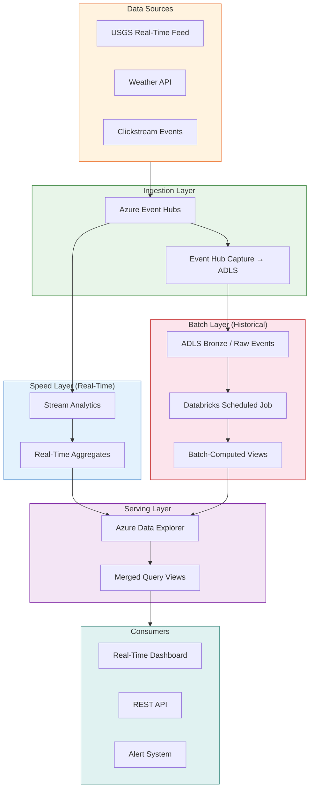

# Tutorial 05: Real-Time Streaming with Lambda Architecture

> **Estimated Time:** 5-6 hours
> **Difficulty:** Advanced

Build a complete Lambda Architecture on your CSA-in-a-Box platform for processing real-time earthquake data alongside batch historical analysis. You will configure Azure Event Hubs for ingestion, build a speed layer with Stream Analytics, a batch layer with scheduled ADLS reprocessing, and a serving layer with Azure Data Explorer — then query merged views that combine real-time and historical results.

---

## Prerequisites

Before starting, ensure you have:

- [ ] **Tutorial 01 completed** — Foundation Platform deployed (Event Hubs namespace provisioned)
- [ ] **Python 3.11+** with virtual environment active
- [ ] **Azure CLI** authenticated
- [ ] **Databricks cluster** from Tutorial 01 available
- [ ] (Optional) **Tutorial 03 completed** — for geospatial earthquake data context

Install streaming Python packages:

```bash
pip install azure-eventhub azure-identity aiohttp websockets
pip install azure-kusto-data azure-kusto-ingest
```

<details>
<summary><strong>Expected Output</strong></summary>

```
Successfully installed azure-eventhub-5.x azure-identity-1.x aiohttp-3.x ...
Successfully installed azure-kusto-data-4.x azure-kusto-ingest-4.x
```

</details>

### Troubleshooting

| Symptom | Cause | Fix |
|---------|-------|-----|
| `pip install azure-eventhub` fails | Network/proxy issue | Try `pip install --trusted-host pypi.org azure-eventhub` |
| `azure-kusto-data` conflicts | Version mismatch | Use `pip install azure-kusto-data==4.4.1 azure-kusto-ingest==4.4.1` |

---

## Architecture Overview

The Lambda Architecture combines three layers to provide both real-time and historically-accurate views of streaming data.



> **Lambda vs Kappa Architecture**
>
> | Aspect | Lambda | Kappa |
> |--------|--------|-------|
> | **Layers** | Speed + Batch + Serving | Single stream processing layer |
> | **Complexity** | Higher (two code paths) | Lower (one code path) |
> | **Reprocessing** | Batch layer handles corrections | Replay stream from Event Hub |
> | **Accuracy** | Batch provides ground truth | Depends on stream correctness |
> | **Best for** | Mixed workloads, regulatory compliance | Simple event processing, low latency only |
> | **CSA Use Case** | Earthquake monitoring with historical analysis | Simple alert forwarding |
>
> This tutorial uses **Lambda** because earthquake analysis benefits from batch reprocessing (revised magnitudes, location corrections) alongside real-time alerting.

---

## Step 1: Deploy Streaming Infrastructure

Deploy the streaming module which provisions Event Hubs, Stream Analytics, and Azure Data Explorer.

```bash
export CSA_PREFIX="csa"
export CSA_ENV="dev"
export CSA_RG_DLZ="${CSA_PREFIX}-rg-dlz-${CSA_ENV}"

cd deploy/bicep/dlz/modules

# Review the streaming Bicep module
cat streaming.bicep
```

Deploy:

```bash
az deployment group create \
  --resource-group "$CSA_RG_DLZ" \
  --template-file streaming.bicep \
  --parameters \
    prefix="$CSA_PREFIX" \
    environment="$CSA_ENV" \
    eventHubPartitionCount=4 \
    adxSkuName="Dev(No SLA)_Standard_E2a_v4" \
    adxSkuCapacity=1 \
  --name "streaming-$(date +%Y%m%d%H%M)" \
  --verbose
```

This deployment takes 15-20 minutes (ADX cluster provisioning is the longest) and creates:

- **Event Hubs namespace** with dedicated event hubs for each data source
- **Event Hub Capture** configured to write raw events to ADLS Bronze
- **Azure Stream Analytics** job for real-time aggregation
- **Azure Data Explorer (Kusto)** cluster for the serving layer
- **Managed identities** and RBAC assignments

```bash
cd ../../../..
```

<details>
<summary><strong>Expected Output</strong></summary>

```json
{
  "properties": {
    "provisioningState": "Succeeded",
    "outputs": {
      "eventHubNamespace": { "value": "csa-eh-dev" },
      "eventHubName": { "value": "earthquake-events" },
      "streamAnalyticsJobName": { "value": "csa-asa-dev" },
      "adxClusterUri": { "value": "https://csa-adx-dev.eastus.kusto.windows.net" },
      "adxDatabaseName": { "value": "csadb" }
    }
  }
}
```

</details>

### Troubleshooting

| Symptom | Cause | Fix |
|---------|-------|-----|
| ADX cluster fails with quota | ADX requires dedicated vCPUs | Use `Dev(No SLA)_Standard_E2a_v4` SKU or request quota |
| Event Hub namespace exists | Name collision | Event Hub names are globally unique — adjust prefix |
| Deployment timeout | ADX takes 15-20 min | Increase timeout or re-run — idempotent |

---

## Step 2: Configure Event Hubs with Capture to ADLS

### 2a. Create Event Hubs for Each Data Source

```bash
EH_NAMESPACE=$(az eventhubs namespace list \
  --resource-group "$CSA_RG_DLZ" \
  --query "[0].name" -o tsv)

# Create event hub for earthquake events
az eventhubs eventhub create \
  --name "earthquake-events" \
  --namespace-name "$EH_NAMESPACE" \
  --resource-group "$CSA_RG_DLZ" \
  --partition-count 4 \
  --message-retention 7

# Create event hub for weather data (future use)
az eventhubs eventhub create \
  --name "weather-events" \
  --namespace-name "$EH_NAMESPACE" \
  --resource-group "$CSA_RG_DLZ" \
  --partition-count 2 \
  --message-retention 3

echo "Event Hubs created in namespace: $EH_NAMESPACE"
```

### 2b. Event Hub Partition Strategy

| Partition Count | Use Case | Throughput |
|-----------------|----------|------------|
| 2 | Dev/test, low volume | Up to 2 MB/s ingress |
| 4 | Tutorial default, moderate volume | Up to 4 MB/s ingress |
| 8 | Production, high volume | Up to 8 MB/s ingress |
| 32 | Enterprise, very high volume | Up to 32 MB/s ingress |

> **Partition Key Strategy:** For earthquake data, use `region` (e.g., `us-west`, `us-east`, `alaska`, `hawaii`) as the partition key. This ensures events from the same region are processed in order and enables region-parallel consumers.

### 2c. Enable Capture to ADLS

```bash
STORAGE_ACCT=$(az storage account list \
  --resource-group "$CSA_RG_DLZ" \
  --query "[0].name" -o tsv)

STORAGE_ID=$(az storage account show \
  --name "$STORAGE_ACCT" \
  --resource-group "$CSA_RG_DLZ" \
  --query "id" -o tsv)

az eventhubs eventhub update \
  --name "earthquake-events" \
  --namespace-name "$EH_NAMESPACE" \
  --resource-group "$CSA_RG_DLZ" \
  --enable-capture true \
  --capture-interval 300 \
  --capture-size-limit 10485760 \
  --destination-name "EventHubArchive.AzureBlobStorage" \
  --storage-account "$STORAGE_ID" \
  --blob-container "bronze" \
  --archive-name-format "{Namespace}/{EventHub}/p={PartitionId}/{Year}/{Month}/{Day}/{Hour}/{Minute}/{Second}"
```

<details>
<summary><strong>Expected Output</strong></summary>

```json
{
  "captureDescription": {
    "enabled": true,
    "encoding": "Avro",
    "intervalInSeconds": 300,
    "sizeLimitInBytes": 10485760,
    "destination": {
      "name": "EventHubArchive.AzureBlobStorage",
      "blobContainer": "bronze",
      "archiveNameFormat": "{Namespace}/{EventHub}/p={PartitionId}/{Year}/{Month}/{Day}/{Hour}/{Minute}/{Second}"
    }
  }
}
```

</details>

### 2d. Get Connection String

```bash
# Create a SAS policy for the producer
az eventhubs eventhub authorization-rule create \
  --name "producer-policy" \
  --eventhub-name "earthquake-events" \
  --namespace-name "$EH_NAMESPACE" \
  --resource-group "$CSA_RG_DLZ" \
  --rights Send

# Get the connection string
EH_CONN_STR=$(az eventhubs eventhub authorization-rule keys list \
  --name "producer-policy" \
  --eventhub-name "earthquake-events" \
  --namespace-name "$EH_NAMESPACE" \
  --resource-group "$CSA_RG_DLZ" \
  --query "primaryConnectionString" -o tsv)

echo "Connection string saved (do not share!)"
```

### Troubleshooting

| Symptom | Cause | Fix |
|---------|-------|-----|
| Capture not writing to ADLS | Storage RBAC missing | Grant `Storage Blob Data Contributor` to Event Hub's managed identity |
| `AuthorizationFailed` creating SAS | Insufficient permissions | Need Contributor on the Event Hub namespace |
| Capture files are empty Avro | No events sent yet | Capture only writes when events arrive (Step 4) |

---

## Step 3: Set Up Real-Time Earthquake Feed Producer

Create a Python producer that streams live earthquake data from the USGS API to Event Hubs.

### 3a. Create the Producer Script

```python
# save as: examples/streaming/earthquake_monitor.py
"""
Real-time earthquake event producer for Azure Event Hubs.
Polls the USGS real-time earthquake feed and sends new events
to Event Hubs as they appear.
"""
import asyncio
import aiohttp
import json
import hashlib
import time
from datetime import datetime, timezone
from azure.eventhub.aio import EventHubProducerClient
from azure.eventhub import EventData

# Configuration
USGS_FEED_URL = "https://earthquake.usgs.gov/earthquakes/feed/v1.0/summary/2.5_hour.geojson"
EVENT_HUB_CONNECTION_STR = "<YOUR_CONNECTION_STRING>"  # from Step 2d
EVENT_HUB_NAME = "earthquake-events"
POLL_INTERVAL_SECONDS = 30

# Track seen events to avoid duplicates
seen_events = set()

def get_partition_key(feature):
    """Assign partition key based on geographic region."""
    coords = feature["geometry"]["coordinates"]
    lon, lat = coords[0], coords[1]

    if lat > 50:
        return "alaska"
    elif lat > 18 and lat < 22 and lon > -162 and lon < -154:
        return "hawaii"
    elif lon < -115:
        return "us-west"
    elif lon < -90:
        return "us-central"
    else:
        return "us-east"

async def fetch_earthquakes(session):
    """Fetch latest earthquake data from USGS."""
    async with session.get(USGS_FEED_URL) as response:
        if response.status == 200:
            return await response.json()
        else:
            print(f"USGS API error: {response.status}")
            return None

async def send_events(producer, features):
    """Send new earthquake events to Event Hub."""
    new_count = 0
    async with producer:
        for feature in features:
            event_id = feature["properties"].get("code", "")
            if event_id in seen_events:
                continue

            seen_events.add(event_id)
            new_count += 1

            # Enrich the event
            event_data = {
                "event_id": event_id,
                "magnitude": feature["properties"].get("mag"),
                "place": feature["properties"].get("place"),
                "time": feature["properties"].get("time"),
                "longitude": feature["geometry"]["coordinates"][0],
                "latitude": feature["geometry"]["coordinates"][1],
                "depth_km": feature["geometry"]["coordinates"][2] if len(feature["geometry"]["coordinates"]) > 2 else None,
                "event_type": feature["properties"].get("type"),
                "tsunami_flag": feature["properties"].get("tsunami", 0),
                "alert_level": feature["properties"].get("alert"),
                "ingested_at": datetime.now(timezone.utc).isoformat(),
                "source": "usgs",
                "region": get_partition_key(feature),
            }

            # Create batch per partition key
            partition_key = get_partition_key(feature)
            event_batch = await producer.create_batch(partition_key=partition_key)
            event_batch.add(EventData(json.dumps(event_data)))
            await producer.send_batch(event_batch)

    return new_count

async def main():
    """Main polling loop."""
    print(f"Starting earthquake monitor...")
    print(f"Polling USGS feed every {POLL_INTERVAL_SECONDS}s")
    print(f"Sending to Event Hub: {EVENT_HUB_NAME}")
    print("-" * 50)

    producer = EventHubProducerClient.from_connection_string(
        conn_str=EVENT_HUB_CONNECTION_STR,
        eventhub_name=EVENT_HUB_NAME,
    )

    async with aiohttp.ClientSession() as http_session:
        while True:
            try:
                data = await fetch_earthquakes(http_session)
                if data and "features" in data:
                    new_count = await send_events(producer, data["features"])
                    total = len(data["features"])
                    ts = datetime.now().strftime("%H:%M:%S")
                    print(f"[{ts}] Polled {total} events, sent {new_count} new")
                else:
                    print(f"No data received from USGS")
            except Exception as e:
                print(f"Error: {e}")

            await asyncio.sleep(POLL_INTERVAL_SECONDS)

if __name__ == "__main__":
    asyncio.run(main())
```

### 3b. Run the Producer

```bash
# Set the connection string
export EH_CONN_STR="<paste from Step 2d>"

# Update the script with your connection string, then run:
python examples/streaming/earthquake_monitor.py
```

<details>
<summary><strong>Expected Output</strong></summary>

```
Starting earthquake monitor...
Polling USGS feed every 30s
Sending to Event Hub: earthquake-events
--------------------------------------------------
[14:23:05] Polled 12 events, sent 12 new
[14:23:35] Polled 12 events, sent 0 new
[14:24:05] Polled 13 events, sent 1 new
[14:24:35] Polled 13 events, sent 0 new
...
```

</details>

### 3c. Verify Events in Event Hub

```bash
# Check Event Hub metrics
az eventhubs eventhub show \
  --name "earthquake-events" \
  --namespace-name "$EH_NAMESPACE" \
  --resource-group "$CSA_RG_DLZ" \
  --query "{name:name, partitions:partitionCount, status:status}" \
  --output table

# Check incoming message count (via monitor)
az monitor metrics list \
  --resource $(az eventhubs namespace show \
    --name "$EH_NAMESPACE" \
    --resource-group "$CSA_RG_DLZ" \
    --query "id" -o tsv) \
  --metric "IncomingMessages" \
  --interval PT1M \
  --query "value[0].timeseries[0].data[-5:]" \
  --output table
```

### Troubleshooting

| Symptom | Cause | Fix |
|---------|-------|-----|
| `AuthenticationError` | Invalid connection string | Re-copy from `az eventhubs eventhub authorization-rule keys list` |
| No new events sent | All events already seen | Reset by restarting the script (clears `seen_events` set) |
| USGS returns 503 | Rate limiting | Increase `POLL_INTERVAL_SECONDS` to 60+ |
| Events sent but not captured | Capture interval not elapsed | Wait for `capture-interval` (300s) to trigger first file |

---

## Step 4: Build Speed Layer — Stream Analytics Real-Time Aggregation

Configure Azure Stream Analytics to process events in real time and compute rolling aggregations.

### 4a. Configure Stream Analytics Input

```bash
ASA_JOB=$(az stream-analytics job list \
  --resource-group "$CSA_RG_DLZ" \
  --query "[0].name" -o tsv)

# Create Event Hub input
az stream-analytics input create \
  --resource-group "$CSA_RG_DLZ" \
  --job-name "$ASA_JOB" \
  --name "earthquake-input" \
  --type "Stream" \
  --datasource @- << 'JSON'
{
  "type": "Microsoft.EventHub/EventHub",
  "properties": {
    "eventHubName": "earthquake-events",
    "serviceBusNamespace": "csa-eh-dev",
    "sharedAccessPolicyName": "RootManageSharedAccessKey",
    "consumerGroupName": "$Default"
  }
}
JSON
```

### 4b. Configure Stream Analytics Output

```bash
# Output to Azure Data Explorer
az stream-analytics output create \
  --resource-group "$CSA_RG_DLZ" \
  --job-name "$ASA_JOB" \
  --name "adx-output" \
  --datasource @- << 'JSON'
{
  "type": "Microsoft.Kusto/clusters/databases",
  "properties": {
    "cluster": "https://csa-adx-dev.eastus.kusto.windows.net",
    "database": "csadb",
    "table": "earthquake_realtime",
    "authenticationMode": "Msi"
  }
}
JSON
```

### 4c. Define the Stream Analytics Query

Navigate to the Stream Analytics job in the Azure Portal or use the CLI:

```sql
-- Stream Analytics Query
-- Speed layer: 5-minute tumbling window aggregations

-- Real-time earthquake aggregation by region
SELECT
    region,
    System.Timestamp() AS window_end,
    COUNT(*) AS event_count,
    AVG(magnitude) AS avg_magnitude,
    MAX(magnitude) AS max_magnitude,
    MIN(magnitude) AS min_magnitude,
    AVG(depth_km) AS avg_depth_km,
    SUM(CASE WHEN magnitude >= 5.0 THEN 1 ELSE 0 END) AS significant_count,
    SUM(CASE WHEN tsunami_flag = 1 THEN 1 ELSE 0 END) AS tsunami_alerts
INTO [adx-output]
FROM [earthquake-input]
TIMESTAMP BY DATEADD(millisecond, [time], '1970-01-01T00:00:00Z')
GROUP BY
    region,
    TumblingWindow(minute, 5)

-- Anomaly detection: sudden magnitude spike
SELECT
    event_id,
    magnitude,
    place,
    region,
    System.Timestamp() AS detected_at,
    'MAGNITUDE_SPIKE' AS alert_type
INTO [alerts-output]
FROM [earthquake-input]
TIMESTAMP BY DATEADD(millisecond, [time], '1970-01-01T00:00:00Z')
WHERE magnitude >= 6.0

-- Sliding window: rolling 1-hour statistics
SELECT
    'global' AS scope,
    System.Timestamp() AS window_end,
    COUNT(*) AS hourly_count,
    AVG(magnitude) AS hourly_avg_mag,
    MAX(magnitude) AS hourly_max_mag
INTO [adx-hourly-output]
FROM [earthquake-input]
TIMESTAMP BY DATEADD(millisecond, [time], '1970-01-01T00:00:00Z')
GROUP BY
    SlidingWindow(hour, 1)
HAVING COUNT(*) > 0
```

### 4d. Start the Stream Analytics Job

```bash
az stream-analytics job start \
  --resource-group "$CSA_RG_DLZ" \
  --name "$ASA_JOB" \
  --output-start-mode "Now"

echo "Stream Analytics job started"
```

<details>
<summary><strong>Expected Output</strong></summary>

```
{
  "jobState": "Running",
  "provisioningState": "Succeeded"
}
Stream Analytics job started
```

</details>

### Troubleshooting

| Symptom | Cause | Fix |
|---------|-------|-----|
| Job fails to start | Input/output configuration error | Check job diagnostics in Azure Portal → Stream Analytics → Activity Log |
| No output rows | No matching events in window | Verify producer is running and events are arriving |
| `DeserializationError` | JSON schema mismatch | Verify event JSON structure matches query column names |
| Timestamp error | Epoch milliseconds not converting | Ensure `DATEADD(millisecond, [time], '1970-01-01')` is correct |

---

## Step 5: Build Batch Layer — Scheduled Reprocessing from ADLS

The batch layer processes captured events from ADLS for historically-accurate aggregations.

### 5a. Verify Capture Data in ADLS

```bash
STORAGE_ACCT=$(az storage account list \
  --resource-group "$CSA_RG_DLZ" \
  --query "[0].name" -o tsv)

# List captured Avro files
az storage blob list \
  --container-name bronze \
  --account-name "$STORAGE_ACCT" \
  --auth-mode login \
  --prefix "csa-eh-dev/earthquake-events/" \
  --query "[].{Name:name, Size:properties.contentLength, Modified:properties.lastModified}" \
  --output table
```

<details>
<summary><strong>Expected Output</strong></summary>

```
Name                                                                          Size   Modified
---------------------------------------------------------------------------  ------  -------------------------
csa-eh-dev/earthquake-events/p=0/2026/04/22/14/23/00.avro                   12456  2026-04-22T14:28:00+00:00
csa-eh-dev/earthquake-events/p=1/2026/04/22/14/23/00.avro                    8234  2026-04-22T14:28:00+00:00
...
```

</details>

### 5b. Create Databricks Batch Processing Notebook

```python
# Databricks notebook: notebooks/streaming/batch_reprocess.py
"""
Batch layer: reprocess all captured earthquake events from ADLS.
Computes accurate historical aggregations and writes to Gold layer.
"""
from pyspark.sql import SparkSession
from pyspark.sql.functions import (
    col, count, avg, max as spark_max, min as spark_min, sum as spark_sum,
    from_json, window, to_timestamp, expr
)
from pyspark.sql.types import *

spark = SparkSession.builder.getOrCreate()

# Read all captured Avro files from Bronze
raw_df = spark.read.format("avro").load(
    "abfss://bronze@csadlsdev.dfs.core.windows.net/csa-eh-dev/earthquake-events/"
)

# Parse the JSON body from Event Hub capture
schema = StructType([
    StructField("event_id", StringType()),
    StructField("magnitude", DoubleType()),
    StructField("place", StringType()),
    StructField("time", LongType()),
    StructField("longitude", DoubleType()),
    StructField("latitude", DoubleType()),
    StructField("depth_km", DoubleType()),
    StructField("event_type", StringType()),
    StructField("tsunami_flag", IntegerType()),
    StructField("alert_level", StringType()),
    StructField("region", StringType()),
])

events_df = raw_df.select(
    from_json(col("Body").cast("string"), schema).alias("event")
).select("event.*")

events_df = events_df.withColumn(
    "event_time",
    to_timestamp(expr("timestamp_millis(time)"))
)

print(f"Total captured events: {events_df.count()}")
events_df.printSchema()

# Batch aggregation: hourly by region
hourly_agg = events_df.groupBy(
    window("event_time", "1 hour"),
    "region"
).agg(
    count("*").alias("event_count"),
    avg("magnitude").alias("avg_magnitude"),
    spark_max("magnitude").alias("max_magnitude"),
    spark_min("magnitude").alias("min_magnitude"),
    avg("depth_km").alias("avg_depth_km"),
    spark_sum(expr("CASE WHEN magnitude >= 5.0 THEN 1 ELSE 0 END")).alias("significant_count"),
)

hourly_agg = hourly_agg.select(
    col("window.start").alias("window_start"),
    col("window.end").alias("window_end"),
    "region", "event_count", "avg_magnitude", "max_magnitude",
    "min_magnitude", "avg_depth_km", "significant_count"
)

print(f"Hourly aggregation rows: {hourly_agg.count()}")
hourly_agg.show(10, truncate=False)

# Write batch results to Gold layer
hourly_agg.write.format("delta").mode("overwrite").save(
    "abfss://gold@csadlsdev.dfs.core.windows.net/streaming/earthquake_batch_hourly"
)

# Daily summary
daily_agg = events_df.groupBy(
    window("event_time", "1 day"),
    "region"
).agg(
    count("*").alias("event_count"),
    avg("magnitude").alias("avg_magnitude"),
    spark_max("magnitude").alias("max_magnitude"),
    spark_sum(expr("CASE WHEN tsunami_flag = 1 THEN 1 ELSE 0 END")).alias("tsunami_events"),
)

daily_agg = daily_agg.select(
    col("window.start").alias("date"),
    "region", "event_count", "avg_magnitude", "max_magnitude", "tsunami_events"
)

daily_agg.write.format("delta").mode("overwrite").save(
    "abfss://gold@csadlsdev.dfs.core.windows.net/streaming/earthquake_batch_daily"
)

print("Batch layer processing complete")
```

### 5c. Schedule the Batch Job

In Databricks, create a scheduled workflow:

1. Go to **Workflows** → **Create Job**
2. Configure:
   - **Name:** `CSA Batch Reprocess - Earthquakes`
   - **Notebook:** `notebooks/streaming/batch_reprocess.py`
   - **Cluster:** Your tutorial cluster
   - **Schedule:** Every 6 hours (or daily for lower cost)
3. Click **Create**

```bash
# Or via Databricks CLI
databricks jobs create --json '{
  "name": "CSA Batch Reprocess - Earthquakes",
  "tasks": [{
    "task_key": "batch_reprocess",
    "notebook_task": {
      "notebook_path": "/notebooks/streaming/batch_reprocess"
    },
    "existing_cluster_id": "<your-cluster-id>"
  }],
  "schedule": {
    "quartz_cron_expression": "0 0 */6 * * ?",
    "timezone_id": "UTC"
  }
}'
```

<details>
<summary><strong>Expected Output</strong></summary>

```json
{
  "job_id": 123456789
}
```

</details>

### Troubleshooting

| Symptom | Cause | Fix |
|---------|-------|-----|
| No Avro files in Bronze | Capture not triggered | Ensure producer is running and capture interval (300s) has elapsed |
| `AnalysisException: path does not exist` | No captured data yet | Wait for Event Hub Capture to write first files |
| Schema mismatch on parse | JSON field names changed | Verify producer event structure matches the schema |
| Delta write fails | Missing permissions | Grant `Storage Blob Data Contributor` to Databricks managed identity |

---

## Step 6: Build Serving Layer — Azure Data Explorer Queries

Configure Azure Data Explorer as the unified serving layer for both speed and batch results.

### 6a. Create ADX Database and Tables

```bash
ADX_CLUSTER=$(az kusto cluster list \
  --resource-group "$CSA_RG_DLZ" \
  --query "[0].uri" -o tsv)

ADX_DB="csadb"

echo "ADX Cluster: $ADX_CLUSTER"
```

Connect to ADX using the [Azure Data Explorer web UI](https://dataexplorer.azure.com/) or `az kusto`:

```kusto
// Create tables for the serving layer

// Real-time aggregations (from Stream Analytics speed layer)
.create table earthquake_realtime (
    region: string,
    window_end: datetime,
    event_count: int,
    avg_magnitude: real,
    max_magnitude: real,
    min_magnitude: real,
    avg_depth_km: real,
    significant_count: int,
    tsunami_alerts: int
)

// Batch aggregations (from Databricks batch layer)
.create table earthquake_batch_hourly (
    window_start: datetime,
    window_end: datetime,
    region: string,
    event_count: int,
    avg_magnitude: real,
    max_magnitude: real,
    min_magnitude: real,
    avg_depth_km: real,
    significant_count: int
)

// Raw events for ad-hoc analysis
.create table earthquake_raw (
    event_id: string,
    magnitude: real,
    place: string,
    event_time: datetime,
    longitude: real,
    latitude: real,
    depth_km: real,
    region: string,
    tsunami_flag: int,
    alert_level: string
)

// Set retention policy
.alter table earthquake_realtime policy retention softdelete = 30d
.alter table earthquake_batch_hourly policy retention softdelete = 365d
.alter table earthquake_raw policy retention softdelete = 90d
```

### 6b. Ingest Batch Results into ADX

```kusto
// Ingest batch layer results from Gold ADLS
.ingest into table earthquake_batch_hourly (
    h'abfss://gold@csadlsdev.dfs.core.windows.net/streaming/earthquake_batch_hourly;managed_identity=system'
) with (format='parquet')
```

### 6c. Create Materialized Views

```kusto
// Materialized view: latest regional summary
.create materialized-view earthquake_regional_latest on table earthquake_realtime
{
    earthquake_realtime
    | summarize
        last_update = max(window_end),
        total_events = sum(event_count),
        avg_mag = avg(avg_magnitude),
        max_mag = max(max_magnitude),
        total_significant = sum(significant_count),
        total_tsunami = sum(tsunami_alerts)
      by region
}

// Materialized view: daily rollup
.create materialized-view earthquake_daily on table earthquake_realtime
{
    earthquake_realtime
    | summarize
        total_events = sum(event_count),
        avg_mag = avg(avg_magnitude),
        max_mag = max(max_magnitude)
      by region, bin(window_end, 1d)
}
```

<details>
<summary><strong>Expected Output</strong></summary>

```
Table 'earthquake_realtime' created successfully.
Table 'earthquake_batch_hourly' created successfully.
Table 'earthquake_raw' created successfully.
Materialized view 'earthquake_regional_latest' created successfully.
Materialized view 'earthquake_daily' created successfully.
```

</details>

### Troubleshooting

| Symptom | Cause | Fix |
|---------|-------|-----|
| Cannot connect to ADX web UI | Cluster not running | Start cluster: `az kusto cluster start --name csa-adx-dev --resource-group $CSA_RG_DLZ` |
| Ingest fails with auth error | Managed identity not configured | Grant `Database Ingestor` role to the service principal |
| Materialized view lag | Cluster too small | Scale up ADX SKU or reduce materialized view complexity |

---

## Step 7: Query Merged Views (Speed + Batch)

The Lambda Architecture's power comes from combining speed layer (real-time, approximate) with batch layer (historical, accurate) results.

### 7a. Merged Regional Summary

```kusto
// Lambda merge: combine real-time and batch views
// Batch is authoritative for completed windows; speed fills in the latest
let batch_cutoff = ago(6h);  // batch layer runs every 6 hours
//
// Batch results (authoritative, up to cutoff)
let batch_results = earthquake_batch_hourly
    | where window_end <= batch_cutoff
    | summarize
        event_count = sum(event_count),
        avg_magnitude = avg(avg_magnitude),
        max_magnitude = max(max_magnitude)
      by region;
//
// Speed results (real-time, after cutoff)
let speed_results = earthquake_realtime
    | where window_end > batch_cutoff
    | summarize
        event_count = sum(event_count),
        avg_magnitude = avg(avg_magnitude),
        max_magnitude = max(max_magnitude)
      by region;
//
// Merge
batch_results
| union speed_results
| summarize
    total_events = sum(event_count),
    avg_magnitude = avg(avg_magnitude),
    max_magnitude = max(max_magnitude),
    sources = count()
  by region
| extend data_freshness = iff(sources > 1, "batch+realtime", "batch-only")
| order by total_events desc
```

<details>
<summary><strong>Expected Output</strong></summary>

```
region      total_events  avg_magnitude  max_magnitude  data_freshness
----------  ------------  -------------  -------------  ----------------
us-west           234         3.14           5.80       batch+realtime
alaska            189         3.45           6.20       batch+realtime
hawaii             67         2.98           4.80       batch+realtime
us-central         34         2.56           3.90       batch+realtime
us-east            12         2.34           3.10       batch-only
```

</details>

### 7b. Time-Series Analysis

```kusto
// Hourly earthquake frequency over the last 7 days
earthquake_batch_hourly
| union earthquake_realtime
| where window_end > ago(7d)
| summarize total_events = sum(event_count) by bin(window_end, 1h)
| render timechart
```

### 7c. Anomaly Detection Query

```kusto
// Detect unusual earthquake activity (> 2 std dev from mean)
let stats = earthquake_batch_hourly
    | summarize avg_count = avg(event_count), std_count = stdev(event_count);
//
earthquake_realtime
| where window_end > ago(1d)
| extend is_anomaly = event_count > toscalar(stats | project avg_count + 2 * std_count)
| where is_anomaly
| project window_end, region, event_count, avg_magnitude, max_magnitude
| order by window_end desc
```

---

## Step 8: Monitor with Dashboards

### 8a. Create ADX Dashboard

1. In [Azure Data Explorer web UI](https://dataexplorer.azure.com/), click **Dashboards** → **New Dashboard**
2. Add tiles:
   - **Tile 1: Map** — Earthquake events by region (use latitude/longitude)
   - **Tile 2: Time Chart** — Hourly event count (from merged view)
   - **Tile 3: Stat** — Max magnitude in last 24 hours
   - **Tile 4: Table** — Latest 20 events from `earthquake_raw`
3. Set auto-refresh to 1 minute

### 8b. Azure Monitor Alerts

```bash
# Create an alert for significant earthquakes (magnitude >= 6.0)
az monitor metrics alert create \
  --name "significant-earthquake" \
  --resource-group "$CSA_RG_DLZ" \
  --scopes $(az eventhubs namespace show \
    --name "$EH_NAMESPACE" \
    --resource-group "$CSA_RG_DLZ" \
    --query "id" -o tsv) \
  --condition "total IncomingMessages > 50 where EventHub = earthquake-events" \
  --window-size 5m \
  --evaluation-frequency 1m \
  --severity 2 \
  --description "Unusual earthquake event volume detected"
```

<details>
<summary><strong>Expected Output</strong></summary>

```json
{
  "name": "significant-earthquake",
  "severity": 2,
  "enabled": true,
  "evaluationFrequency": "PT1M",
  "windowSize": "PT5M"
}
```

</details>

---

## Step 9: Advanced — Add Weather and Clickstream Sources

Extend the Lambda Architecture with additional data sources.

### 9a. Weather Data Producer

```python
# save as: examples/streaming/weather_producer.py
"""
Weather data producer — sends weather observations to Event Hubs.
"""
import asyncio
import aiohttp
import json
from datetime import datetime, timezone
from azure.eventhub.aio import EventHubProducerClient
from azure.eventhub import EventData

WEATHER_API_URL = "https://api.weather.gov/alerts/active?area=CA"
EVENT_HUB_CONNECTION_STR = "<YOUR_WEATHER_EH_CONN_STR>"
EVENT_HUB_NAME = "weather-events"

async def fetch_and_send():
    producer = EventHubProducerClient.from_connection_string(
        conn_str=EVENT_HUB_CONNECTION_STR,
        eventhub_name=EVENT_HUB_NAME,
    )

    async with aiohttp.ClientSession() as session:
        async with session.get(WEATHER_API_URL) as response:
            data = await response.json()

    async with producer:
        batch = await producer.create_batch()
        for feature in data.get("features", []):
            event = {
                "alert_id": feature["properties"].get("id"),
                "event": feature["properties"].get("event"),
                "severity": feature["properties"].get("severity"),
                "headline": feature["properties"].get("headline"),
                "area": feature["properties"].get("areaDesc"),
                "onset": feature["properties"].get("onset"),
                "expires": feature["properties"].get("expires"),
                "ingested_at": datetime.now(timezone.utc).isoformat(),
            }
            try:
                batch.add(EventData(json.dumps(event)))
            except ValueError:
                await producer.send_batch(batch)
                batch = await producer.create_batch()
                batch.add(EventData(json.dumps(event)))

        await producer.send_batch(batch)
        print(f"Sent {len(data.get('features', []))} weather alerts")

if __name__ == "__main__":
    asyncio.run(fetch_and_send())
```

### 9b. Clickstream Simulator

```python
# save as: examples/streaming/clickstream_simulator.py
"""
Simulated clickstream events for testing the streaming pipeline.
"""
import asyncio
import json
import random
import uuid
from datetime import datetime, timezone
from azure.eventhub.aio import EventHubProducerClient
from azure.eventhub import EventData

EVENT_HUB_CONNECTION_STR = "<YOUR_CLICKSTREAM_EH_CONN_STR>"
EVENT_HUB_NAME = "clickstream-events"

PAGES = ["/map", "/dashboard", "/reports", "/alerts", "/settings", "/api/earthquakes"]
ACTIONS = ["view", "click", "search", "filter", "export", "share"]

async def generate_events(producer, count=100):
    async with producer:
        batch = await producer.create_batch()
        for _ in range(count):
            event = {
                "session_id": str(uuid.uuid4()),
                "user_id": f"user-{random.randint(1, 50)}",
                "page": random.choice(PAGES),
                "action": random.choice(ACTIONS),
                "duration_ms": random.randint(100, 30000),
                "timestamp": datetime.now(timezone.utc).isoformat(),
            }
            try:
                batch.add(EventData(json.dumps(event)))
            except ValueError:
                await producer.send_batch(batch)
                batch = await producer.create_batch()
                batch.add(EventData(json.dumps(event)))

        await producer.send_batch(batch)
        print(f"Sent {count} clickstream events")

async def main():
    producer = EventHubProducerClient.from_connection_string(
        conn_str=EVENT_HUB_CONNECTION_STR,
        eventhub_name=EVENT_HUB_NAME,
    )
    while True:
        await generate_events(producer, count=random.randint(10, 50))
        await asyncio.sleep(5)

if __name__ == "__main__":
    asyncio.run(main())
```

---

## Completion Checklist

- [ ] Streaming infrastructure deployed (Event Hubs, Stream Analytics, ADX)
- [ ] Event Hubs configured with Capture to ADLS Bronze
- [ ] Earthquake producer running and sending events
- [ ] Speed layer: Stream Analytics job running with real-time aggregation
- [ ] Batch layer: Databricks notebook processing captured events
- [ ] Serving layer: ADX tables, materialized views, and retention policies
- [ ] Merged queries combining speed and batch results
- [ ] Monitoring dashboard and alerts configured
- [ ] (Optional) Additional data sources (weather, clickstream)

---

## What's Next

Your Lambda Architecture streaming pipeline is operational. Choose your next path:

- **[Tutorial 03: GeoAnalytics with Open-Source Tools](../03-geoanalytics-oss/)** — Add spatial analysis to your earthquake data
- **[Tutorial 06: AI Analytics](../06-ai-analytics/)** — Apply ML for earthquake prediction and anomaly detection
- **[Tutorial 07: Security & Compliance](../07-security-compliance/)** — Secure your streaming pipeline with Private Link and encryption

See the [Tutorial Index](../README.md) for all available paths.

---

## Clean Up

To remove streaming resources:

```bash
# Stop Stream Analytics job
az stream-analytics job stop --name "$ASA_JOB" --resource-group "$CSA_RG_DLZ"

# Stop ADX cluster (saves compute costs, keeps data)
az kusto cluster stop --name "csa-adx-dev" --resource-group "$CSA_RG_DLZ"

# Or delete everything
az kusto cluster delete --name "csa-adx-dev" --resource-group "$CSA_RG_DLZ" --yes
az stream-analytics job delete --name "$ASA_JOB" --resource-group "$CSA_RG_DLZ" --yes
```

> **Note:** Stopping the ADX cluster preserves data but eliminates compute charges. Deleting is permanent.

---

## Reference

- [Azure Event Hubs Documentation](https://learn.microsoft.com/en-us/azure/event-hubs/)
- [Event Hubs Capture](https://learn.microsoft.com/en-us/azure/event-hubs/event-hubs-capture-overview)
- [Azure Stream Analytics](https://learn.microsoft.com/en-us/azure/stream-analytics/)
- [Azure Data Explorer (Kusto)](https://learn.microsoft.com/en-us/azure/data-explorer/)
- [KQL Quick Reference](https://learn.microsoft.com/en-us/azure/data-explorer/kql-quick-reference)
- [Lambda Architecture - Microsoft](https://learn.microsoft.com/en-us/azure/architecture/data-guide/big-data/#lambda-architecture)
- [USGS Earthquake API](https://earthquake.usgs.gov/fdsnws/event/1/)
- [CSA-in-a-Box Architecture](../../ARCHITECTURE.md)
