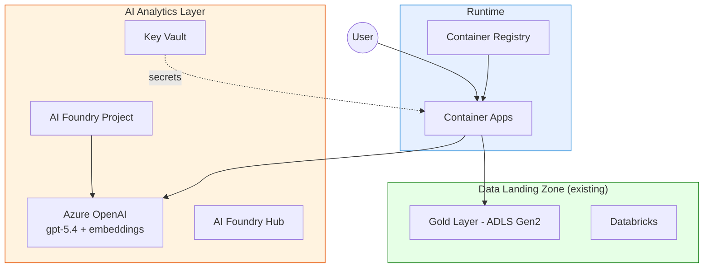

# Tutorial 06: AI-First Analytics with Azure AI Foundry

> **Estimated Time:** 75-90 minutes
> **Difficulty:** Intermediate-Advanced

Deploy Azure AI Foundry and Azure OpenAI on top of your CSA-in-a-Box foundation platform. By the end you will have a working AI chatbot that understands your data products, queries the Gold layer using natural language, and runs on Azure Container Apps.

---

## Prerequisites

- [ ] **Foundation Platform deployed** (complete [Tutorial 01](../01-foundation-platform/README.md) first)
- [ ] **Azure OpenAI access** approved -- [Request access](https://aka.ms/oai/access)
- [ ] **Azure CLI** 2.60+ with `ai` and `containerapp` extensions
- [ ] **Python** 3.11+
- [ ] **Docker Desktop** or **Podman**

```bash
az version --output table
az extension add --name ai --upgrade --yes
az extension add --name containerapp --upgrade --yes
python --version && docker --version
```

---

## Architecture Diagram



---

## Environment Variables

```bash
export CSA_PREFIX="csa"
export CSA_ENV="dev"
export CSA_LOCATION="eastus"
export CSA_RG_DLZ="${CSA_PREFIX}-rg-dlz-${CSA_ENV}"
export CSA_RG_AI="${CSA_PREFIX}-rg-ai-${CSA_ENV}"
export CSA_AOAI_NAME="${CSA_PREFIX}-aoai-${CSA_ENV}"
export CSA_FOUNDRY_HUB="${CSA_PREFIX}-aifoundry-hub-${CSA_ENV}"
export CSA_FOUNDRY_PROJECT="${CSA_PREFIX}-aifoundry-proj-${CSA_ENV}"
export CSA_ACA_NAME="${CSA_PREFIX}-chatbot-${CSA_ENV}"
export CSA_ACA_ENV="${CSA_PREFIX}-aca-env-${CSA_ENV}"
export STORAGE_ACCT=$(az storage account list \
  --resource-group "$CSA_RG_DLZ" --query "[0].name" -o tsv)
```

---

## Step 1: Create the AI Resource Group

```bash
az group create --name "$CSA_RG_AI" --location "$CSA_LOCATION"
```

<details>
<summary><strong>Expected Output</strong></summary>

```json
{
    "id": "/subscriptions/.../resourceGroups/csa-rg-ai-dev",
    "location": "eastus",
    "properties": { "provisioningState": "Succeeded" }
}
```

</details>

---

## Step 2: Deploy AI Infrastructure

```bash
cd deploy/bicep/dlz/modules

az deployment group create \
  --resource-group "$CSA_RG_AI" \
  --template-file ai-analytics.bicep \
  --parameters \
    prefix="$CSA_PREFIX" \
    environment="$CSA_ENV" \
    location="$CSA_LOCATION" \
    openAiName="$CSA_AOAI_NAME" \
    aiFoundryHubName="$CSA_FOUNDRY_HUB" \
  --name "ai-analytics-$(date +%Y%m%d%H%M)" \
  --verbose

cd ../../../..
```

Deployment takes 5-10 minutes. It provisions Azure OpenAI, AI Foundry Hub, Key Vault, and supporting resources.

<details>
<summary><strong>Expected Output</strong></summary>

```json
{
    "properties": {
        "provisioningState": "Succeeded",
        "outputs": {
            "openAiEndpoint": {
                "value": "https://csa-aoai-dev.openai.azure.com/"
            },
            "aiFoundryHubId": {
                "value": "/subscriptions/.../workspaces/csa-aifoundry-hub-dev"
            }
        }
    }
}
```

</details>

### Troubleshooting

| Symptom                     | Cause                | Fix                                                       |
| --------------------------- | -------------------- | --------------------------------------------------------- |
| `InvalidTemplateDeployment` | Bicep file not found | Verify path `deploy/bicep/dlz/modules/ai-analytics.bicep` |
| `QuotaExceeded` for OpenAI  | Region capacity      | Try `eastus2`, `swedencentral`, or `canadaeast`           |
| `AuthorizationFailed`       | Permissions          | Need Contributor role on the resource group               |

---

## Step 3: Configure Azure OpenAI Models

### 3a. Deploy gpt-5.4

```bash
az cognitiveservices account deployment create \
  --name "$CSA_AOAI_NAME" \
  --resource-group "$CSA_RG_AI" \
  --deployment-name "gpt-54" \
  --model-name "gpt-5.4" \
  --model-version "2026-03-01" \
  --model-format OpenAI \
  --sku-capacity 30 \
  --sku-name "Standard"
```

### 3b. Deploy text-embedding-3-large

```bash
az cognitiveservices account deployment create \
  --name "$CSA_AOAI_NAME" \
  --resource-group "$CSA_RG_AI" \
  --deployment-name "text-embedding-3-large" \
  --model-name "text-embedding-3-large" \
  --model-version "1" \
  --model-format OpenAI \
  --sku-capacity 30 \
  --sku-name "Standard"
```

### 3c. Retrieve Endpoint and Key

```bash
export AOAI_ENDPOINT=$(az cognitiveservices account show \
  --name "$CSA_AOAI_NAME" --resource-group "$CSA_RG_AI" \
  --query "properties.endpoint" -o tsv)

export AOAI_KEY=$(az cognitiveservices account keys list \
  --name "$CSA_AOAI_NAME" --resource-group "$CSA_RG_AI" \
  --query "key1" -o tsv)

echo "Endpoint: $AOAI_ENDPOINT"
```

<details>
<summary><strong>Expected Output</strong></summary>

```
Endpoint: https://csa-aoai-dev.openai.azure.com/
```

</details>

### Troubleshooting

| Symptom             | Cause             | Fix                                                                                                    |
| ------------------- | ----------------- | ------------------------------------------------------------------------------------------------------ |
| `ModelNotAvailable` | Region limitation | Check [model availability](https://learn.microsoft.com/en-us/azure/ai-services/openai/concepts/models) |
| `InsufficientQuota` | TPM exceeded      | Reduce `sku-capacity` or request increase                                                              |
| Deployment > 10 min | Normal            | Wait up to 15 minutes                                                                                  |

---

## Step 4: Set Up Azure AI Foundry Hub and Project

### 4a. Create the Hub

```bash
az ml workspace create \
  --name "$CSA_FOUNDRY_HUB" \
  --resource-group "$CSA_RG_AI" \
  --kind hub \
  --location "$CSA_LOCATION"
```

### 4b. Create a Project

```bash
HUB_ID=$(az ml workspace show \
  --name "$CSA_FOUNDRY_HUB" --resource-group "$CSA_RG_AI" \
  --query "id" -o tsv)

az ml workspace create \
  --name "$CSA_FOUNDRY_PROJECT" \
  --resource-group "$CSA_RG_AI" \
  --kind project \
  --hub-id "$HUB_ID" \
  --location "$CSA_LOCATION"
```

### 4c. Add the OpenAI Connection

```bash
cat > /tmp/aoai-connection.yml << EOF
name: aoai-connection
type: azure_open_ai
azure_endpoint: $AOAI_ENDPOINT
api_key: $AOAI_KEY
api_version: "2025-04-01-preview"
EOF

az ml connection create \
  --file /tmp/aoai-connection.yml \
  --resource-group "$CSA_RG_AI" \
  --workspace-name "$CSA_FOUNDRY_PROJECT"
```

<details>
<summary><strong>Expected Output</strong></summary>

```
name: aoai-connection
type: azure_open_ai
azure_endpoint: https://csa-aoai-dev.openai.azure.com/
```

</details>

### Troubleshooting

| Symptom             | Cause             | Fix                                |
| ------------------- | ----------------- | ---------------------------------- |
| `WorkspaceNotFound` | Hub missing       | Run Step 4a first                  |
| Connection fails    | Endpoint format   | Include trailing `/` in URL        |
| `HubIdInvalid`      | Wrong resource ID | Verify with `az ml workspace show` |

---

## Step 5: Build a Simple Chatbot

### 5a. Install Dependencies

```bash
pip install azure-ai-projects azure-ai-inference azure-identity openai
```

### 5b. Create the Chatbot

Create `examples/ai-chatbot/chatbot.py`:

```python
import os
from openai import AzureOpenAI

client = AzureOpenAI(
    azure_endpoint=os.environ["AZURE_OPENAI_ENDPOINT"],
    api_key=os.environ["AZURE_OPENAI_API_KEY"],
    api_version="2025-04-01-preview",
)

SYSTEM_PROMPT = (
    "You are a data analytics assistant for the CSA-in-a-Box platform. "
    "Help users understand data products in the Gold layer."
)

def chat(user_message, history=None):
    messages = [{"role": "system", "content": SYSTEM_PROMPT}]
    messages.extend(history or [])
    messages.append({"role": "user", "content": user_message})
    resp = client.chat.completions.create(
        model="gpt-54", messages=messages, temperature=0.3, max_tokens=1024
    )
    return resp.choices[0].message.content

if __name__ == "__main__":
    print("CSA-in-a-Box AI Chatbot (type 'quit' to exit)")
    print("-" * 50)
    history = []
    while True:
        q = input("\nYou: ").strip()
        if q.lower() in ("quit", "exit"):
            break
        reply = chat(q, history)
        print(f"\nAssistant: {reply}")
        history += [
            {"role": "user", "content": q},
            {"role": "assistant", "content": reply},
        ]
```

### 5c. Test Locally

```bash
export AZURE_OPENAI_ENDPOINT="$AOAI_ENDPOINT"
export AZURE_OPENAI_API_KEY="$AOAI_KEY"
python examples/ai-chatbot/chatbot.py
```

<details>
<summary><strong>Expected Output</strong></summary>

```
CSA-in-a-Box AI Chatbot (type 'quit' to exit)
--------------------------------------------------

You: What is the Gold layer?
Assistant: The Gold layer contains curated, business-ready data products...
```

</details>

---

## Step 6: Add Data Product Awareness

Connect the chatbot to query Gold layer tables using natural language-to-SQL.

Create `examples/ai-chatbot/data_chatbot.py`:

```python
import os
from openai import AzureOpenAI
from azure.identity import DefaultAzureCredential
from azure.storage.filedatalake import DataLakeServiceClient

client = AzureOpenAI(
    azure_endpoint=os.environ["AZURE_OPENAI_ENDPOINT"],
    api_key=os.environ["AZURE_OPENAI_API_KEY"],
    api_version="2025-04-01-preview",
)

def list_gold_tables():
    credential = DefaultAzureCredential()
    service = DataLakeServiceClient(
        account_url=f"https://{os.environ['STORAGE_ACCOUNT_NAME']}.dfs.core.windows.net",
        credential=credential,
    )
    fs = service.get_file_system_client("gold")
    return [p.name for p in fs.get_paths() if p.is_directory]

def chat_with_data(user_message, history=None):
    tables = list_gold_tables()
    system = (
        "You are a data analytics assistant. "
        f"Available Gold layer tables: {tables}. "
        "When asked about data, reference these tables and suggest SQL queries."
    )
    messages = [{"role": "system", "content": system}]
    messages.extend(history or [])
    messages.append({"role": "user", "content": user_message})
    resp = client.chat.completions.create(
        model="gpt-54", messages=messages, temperature=0.3, max_tokens=1024
    )
    return resp.choices[0].message.content

if __name__ == "__main__":
    print("Data-Aware Chatbot (type 'quit' to exit)")
    history = []
    while True:
        q = input("You: ").strip()
        if q.lower() in ("quit", "exit"):
            break
        reply = chat_with_data(q, history)
        print(f"Assistant: {reply}")
        history += [{"role": "user", "content": q}, {"role": "assistant", "content": reply}]
```

Test it:

```bash
export STORAGE_ACCOUNT_NAME="$STORAGE_ACCT"
python examples/ai-chatbot/data_chatbot.py
```

<details>
<summary><strong>Expected Output</strong></summary>

```
You: What crop production data do we have?
Assistant: Based on the Gold layer, I can see the following tables:
- `fct_crop_production` -- Crop production facts by state and year
- `dim_commodity` -- Commodity reference data
You can query them with: SELECT * FROM usda_gold.fct_crop_production LIMIT 10;
```

</details>

---

## Step 7: Deploy Chatbot to Container Apps

### 7a. Create a Dockerfile

Create `examples/ai-chatbot/Dockerfile`:

```dockerfile
FROM python:3.11-slim
WORKDIR /app
COPY requirements.txt .
RUN pip install --no-cache-dir -r requirements.txt
COPY . .
EXPOSE 8000
CMD ["uvicorn", "api:app", "--host", "0.0.0.0", "--port", "8000"]
```

Create `examples/ai-chatbot/requirements.txt`:

```
openai>=1.30
azure-identity>=1.15
azure-storage-file-datalake>=12.14
fastapi>=0.111
uvicorn>=0.29
```

Create `examples/ai-chatbot/api.py`:

```python
import os
from fastapi import FastAPI
from pydantic import BaseModel
from openai import AzureOpenAI

app = FastAPI(title="CSA AI Chatbot")
client = AzureOpenAI(
    azure_endpoint=os.environ["AZURE_OPENAI_ENDPOINT"],
    api_key=os.environ["AZURE_OPENAI_API_KEY"],
    api_version="2025-04-01-preview",
)

class ChatRequest(BaseModel):
    message: str
    history: list[dict] = []

class ChatResponse(BaseModel):
    reply: str

@app.post("/chat", response_model=ChatResponse)
def chat(req: ChatRequest):
    messages = [{"role": "system", "content": "You are a data analytics assistant."}]
    messages.extend(req.history)
    messages.append({"role": "user", "content": req.message})
    resp = client.chat.completions.create(
        model="gpt-54", messages=messages, temperature=0.3, max_tokens=1024
    )
    return ChatResponse(reply=resp.choices[0].message.content)

@app.get("/health")
def health():
    return {"status": "healthy"}
```

### 7b. Build and Push the Image

```bash
ACR_NAME=$(az acr list --resource-group "$CSA_RG_AI" --query "[0].name" -o tsv)

az acr build \
  --registry "$ACR_NAME" \
  --image csa-chatbot:v1 \
  --file examples/ai-chatbot/Dockerfile \
  examples/ai-chatbot/
```

### 7c. Deploy to Container Apps

```bash
az containerapp env create \
  --name "$CSA_ACA_ENV" \
  --resource-group "$CSA_RG_AI" \
  --location "$CSA_LOCATION"

az containerapp create \
  --name "$CSA_ACA_NAME" \
  --resource-group "$CSA_RG_AI" \
  --environment "$CSA_ACA_ENV" \
  --image "${ACR_NAME}.azurecr.io/csa-chatbot:v1" \
  --target-port 8000 \
  --ingress external \
  --min-replicas 1 \
  --max-replicas 3 \
  --env-vars \
    AZURE_OPENAI_ENDPOINT="$AOAI_ENDPOINT" \
    AZURE_OPENAI_API_KEY=secretref:aoai-key \
  --secrets aoai-key="$AOAI_KEY" \
  --registry-server "${ACR_NAME}.azurecr.io"
```

<details>
<summary><strong>Expected Output</strong></summary>

```json
{
    "properties": {
        "configuration": {
            "ingress": {
                "fqdn": "csa-chatbot-dev.kindocean-abc123.eastus.azurecontainerapps.io"
            }
        },
        "provisioningState": "Succeeded"
    }
}
```

</details>

---

## Step 8: Test End-to-End

### 8a. Get the Chatbot URL

```bash
CHATBOT_URL=$(az containerapp show \
  --name "$CSA_ACA_NAME" \
  --resource-group "$CSA_RG_AI" \
  --query "properties.configuration.ingress.fqdn" -o tsv)

echo "Chatbot URL: https://$CHATBOT_URL"
```

### 8b. Send a Test Request

```bash
curl -X POST "https://$CHATBOT_URL/chat" \
  -H "Content-Type: application/json" \
  -d '{"message": "What crop data is in the Gold layer?"}'
```

<details>
<summary><strong>Expected Output</strong></summary>

```json
{
    "reply": "The Gold layer contains curated crop production data including..."
}
```

</details>

### 8c. Health Check

```bash
curl "https://$CHATBOT_URL/health"
```

<details>
<summary><strong>Expected Output</strong></summary>

```json
{ "status": "healthy" }
```

</details>

---

## Validation

Verify the complete deployment:

```bash
echo "=== AI Infrastructure ==="
az cognitiveservices account show --name "$CSA_AOAI_NAME" \
  --resource-group "$CSA_RG_AI" --query "properties.provisioningState" -o tsv

echo "=== Model Deployments ==="
az cognitiveservices account deployment list --name "$CSA_AOAI_NAME" \
  --resource-group "$CSA_RG_AI" --query "[].{name:name,status:properties.provisioningState}" -o table

echo "=== AI Foundry Project ==="
az ml workspace show --name "$CSA_FOUNDRY_PROJECT" \
  --resource-group "$CSA_RG_AI" --query "provisioningState" -o tsv

echo "=== Container App ==="
az containerapp show --name "$CSA_ACA_NAME" \
  --resource-group "$CSA_RG_AI" --query "properties.provisioningState" -o tsv
```

<details>
<summary><strong>Expected Output</strong></summary>

```
=== AI Infrastructure ===
Succeeded
=== Model Deployments ===
Name                     Status
-----------------------  ---------
gpt-54                   Succeeded
text-embedding-3-large   Succeeded
=== AI Foundry Project ===
Succeeded
=== Container App ===
Succeeded
```

</details>

---

## Completion Checklist

- [ ] AI resource group created
- [ ] Azure OpenAI deployed with gpt-5.4 and text-embedding-3-large
- [ ] AI Foundry Hub and Project created
- [ ] OpenAI connection registered in AI Foundry
- [ ] Basic chatbot tested locally
- [ ] Data-aware chatbot queries Gold layer tables
- [ ] Chatbot containerized and deployed to Container Apps
- [ ] End-to-end test passes via curl
- [ ] Health check endpoint returns healthy

---

## Troubleshooting (Summary)

| Symptom                           | Cause                      | Fix                                                                                      |
| --------------------------------- | -------------------------- | ---------------------------------------------------------------------------------------- |
| `QuotaExceeded` on OpenAI         | Region TPM limits          | Change region or reduce `sku-capacity`                                                   |
| Container App returns 502         | App crash on startup       | Check logs: `az containerapp logs show --name $CSA_ACA_NAME --resource-group $CSA_RG_AI` |
| `AuthenticationError` from OpenAI | Wrong key or endpoint      | Verify env vars match `az cognitiveservices account show` output                         |
| AI Foundry project not visible    | Wrong subscription context | Run `az account set --subscription <id>`                                                 |
| ACR image pull fails              | Registry auth              | Enable admin user or configure managed identity                                          |
| Slow first response               | Cold start                 | Set `--min-replicas 1` to keep one instance warm                                         |

---

## What's Next

Your AI analytics layer is live. Continue with:

- **[Tutorial 07: Building AI Agents with Semantic Kernel](../07-agents-foundry-sk/README.md)** -- Build multi-agent teams that automate data governance tasks
- **[Tutorial 08: RAG with Azure AI Search](../08-rag-vector-search/README.md)** -- Add retrieval-augmented generation over your data catalog
- **[Tutorial 09: GraphRAG Knowledge Graphs](../09-graphrag-knowledge/README.md)** -- Build knowledge graphs for advanced data lineage analysis

See the [Tutorial Index](../README.md) for all available paths.

---

## Clean Up (Optional)

```bash
az group delete --name "$CSA_RG_AI" --yes --no-wait
```

> **Warning:** This permanently deletes all AI resources. Container Apps, OpenAI deployments, and AI Foundry projects will be removed.

---

## Reference

- [Azure OpenAI Documentation](https://learn.microsoft.com/en-us/azure/ai-services/openai/)
- [Azure AI Foundry Documentation](https://learn.microsoft.com/en-us/azure/ai-studio/)
- [Azure Container Apps Documentation](https://learn.microsoft.com/en-us/azure/container-apps/)
- [CSA-in-a-Box Architecture](../../ARCHITECTURE.md)
- [AI Analytics Bicep Module](../../../deploy/bicep/dlz/modules/ai-analytics.bicep)
