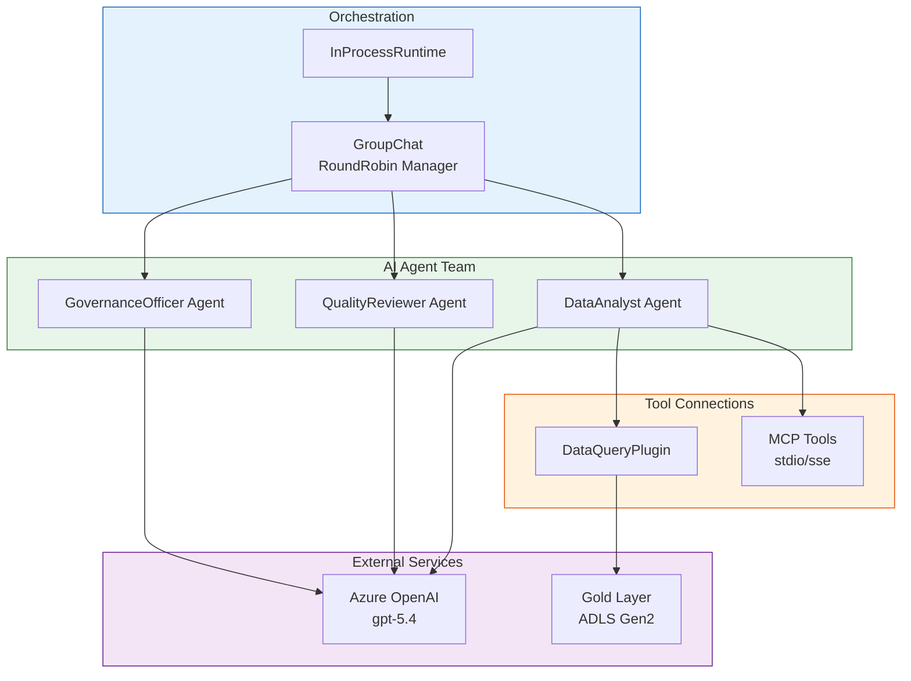

# Tutorial 07: Building AI Agents with Semantic Kernel

> **Estimated Time:** 75-90 minutes
> **Difficulty:** Advanced
> **Last Updated:** 2026-04-22

Build intelligent AI agents using Semantic Kernel and Azure OpenAI on the CSA-in-a-Box platform. You will create single-agent chatbots, multi-agent teams with specialized roles (DataAnalyst, QualityReviewer, GovernanceOfficer), and connect them to external tools via MCP.

---

## Prerequisites

- [ ] **Tutorial 06 completed** (Azure OpenAI deployed with gpt-5.4)
- [ ] **Python** 3.11+
- [ ] **Azure OpenAI endpoint and key** from Tutorial 06

```bash
python --version
echo "AOAI Endpoint: $AOAI_ENDPOINT"
```

---

## Architecture Diagram



---

## Environment Variables

```bash
# From Tutorial 06
export AZURE_OPENAI_ENDPOINT="$AOAI_ENDPOINT"
export AZURE_OPENAI_API_KEY="$AOAI_KEY"
export AZURE_OPENAI_DEPLOYMENT="gpt-54"
export STORAGE_ACCOUNT_NAME="$STORAGE_ACCT"
```

---

## Step 1: Install Semantic Kernel

```bash
pip install semantic-kernel[azure] azure-identity
```

<details>
<summary><strong>Expected Output</strong></summary>

```
Successfully installed semantic-kernel-1.x.x azure-ai-inference-1.x.x ...
```

</details>

Verify the installation:

```bash
python -c "import semantic_kernel; print(f'SK version: {semantic_kernel.__version__}')"
```

---

## Step 2: Create a Kernel with AzureChatCompletion

Create `examples/ai-agents/kernel_setup.py`:

```python
import os
from semantic_kernel import Kernel
from semantic_kernel.connectors.ai.open_ai import AzureChatCompletion

def create_kernel() -> Kernel:
    kernel = Kernel()
    kernel.add_service(
        AzureChatCompletion(
            service_id="gpt54",
            deployment_name=os.environ["AZURE_OPENAI_DEPLOYMENT"],
            endpoint=os.environ["AZURE_OPENAI_ENDPOINT"],
            api_key=os.environ["AZURE_OPENAI_API_KEY"],
        )
    )
    return kernel

if __name__ == "__main__":
    k = create_kernel()
    print(f"Kernel created with services: {list(k.services.keys())}")
```

Test it:

```bash
python examples/ai-agents/kernel_setup.py
```

<details>
<summary><strong>Expected Output</strong></summary>

```
Kernel created with services: ['gpt54']
```

</details>

---

## Step 3: Build a DataQueryPlugin

Create `examples/ai-agents/plugins/data_query_plugin.py`:

```python
from semantic_kernel.functions import kernel_function
from azure.identity import DefaultAzureCredential
from azure.storage.filedatalake import DataLakeServiceClient
import os

class DataQueryPlugin:
    def __init__(self):
        self.credential = DefaultAzureCredential()
        self.account = os.environ["STORAGE_ACCOUNT_NAME"]

    @kernel_function(
        name="list_gold_tables",
        description="List all available tables in the Gold layer of the data lake."
    )
    def list_gold_tables(self) -> str:
        service = DataLakeServiceClient(
            account_url=f"https://{self.account}.dfs.core.windows.net",
            credential=self.credential,
        )
        fs = service.get_file_system_client("gold")
        tables = [p.name for p in fs.get_paths() if p.is_directory]
        return f"Available Gold tables: {', '.join(tables)}"

    @kernel_function(
        name="get_table_schema",
        description="Get the schema (column names) of a Gold layer table."
    )
    def get_table_schema(self, table_name: str) -> str:
        service = DataLakeServiceClient(
            account_url=f"https://{self.account}.dfs.core.windows.net",
            credential=self.credential,
        )
        fs = service.get_file_system_client("gold")
        paths = list(fs.get_paths(path=table_name, max_results=5))
        files = [p.name for p in paths]
        return f"Table '{table_name}' contains files: {files}"

    @kernel_function(
        name="suggest_sql_query",
        description="Suggest a SQL query for a given analytical question."
    )
    def suggest_sql_query(self, question: str, table_name: str) -> str:
        return (
            f"Suggested query for '{question}':\n"
            f"SELECT * FROM usda_gold.{table_name} "
            f"WHERE ... -- customize based on your question\n"
            f"LIMIT 100;"
        )
```

Register the plugin with the kernel:

```python
from plugins.data_query_plugin import DataQueryPlugin

kernel = create_kernel()
kernel.add_plugin(DataQueryPlugin(), plugin_name="DataQuery")
print(f"Plugins: {list(kernel.plugins.keys())}")
```

<details>
<summary><strong>Expected Output</strong></summary>

```
Plugins: ['DataQuery']
```

</details>

---

## Step 4: Create a ChatCompletionAgent

Create `examples/ai-agents/single_agent.py`:

```python
import asyncio
from semantic_kernel.agents import ChatCompletionAgent
from semantic_kernel.contents import ChatHistory
from kernel_setup import create_kernel
from plugins.data_query_plugin import DataQueryPlugin

async def main():
    kernel = create_kernel()
    kernel.add_plugin(DataQueryPlugin(), plugin_name="DataQuery")

    agent = ChatCompletionAgent(
        kernel=kernel,
        service_id="gpt54",
        name="DataAnalyst",
        instructions=(
            "You are a data analyst for the CSA-in-a-Box platform. "
            "Use the DataQuery plugin to explore Gold layer tables "
            "and help users understand their data."
        ),
    )

    chat = ChatHistory()
    print("DataAnalyst Agent (type 'quit' to exit)")
    print("-" * 50)

    while True:
        user_input = input("\nYou: ").strip()
        if user_input.lower() in ("quit", "exit"):
            break
        chat.add_user_message(user_input)
        async for response in agent.invoke(chat):
            print(f"\nDataAnalyst: {response.content}")

asyncio.run(main())
```

Test it:

```bash
cd examples/ai-agents
python single_agent.py
```

<details>
<summary><strong>Expected Output</strong></summary>

```
DataAnalyst Agent (type 'quit' to exit)
--------------------------------------------------

You: What tables are in the Gold layer?
DataAnalyst: Let me check the Gold layer for you.
[Function call: DataQuery.list_gold_tables]
Available Gold tables: fct_crop_production, dim_commodity, dim_state...
```

</details>

---

## Step 5: Build a Multi-Agent Team

Create `examples/ai-agents/multi_agent_team.py`:

```python
import asyncio
from semantic_kernel.agents import ChatCompletionAgent
from semantic_kernel.agents.group_chat import (
    GroupChatOrchestration,
    RoundRobinGroupChatManager,
)
from semantic_kernel.agents.runtime import InProcessRuntime
from kernel_setup import create_kernel
from plugins.data_query_plugin import DataQueryPlugin

async def main():
    kernel = create_kernel()
    kernel.add_plugin(DataQueryPlugin(), plugin_name="DataQuery")

    # Agent 1: DataAnalyst
    analyst = ChatCompletionAgent(
        kernel=kernel,
        service_id="gpt54",
        name="DataAnalyst",
        instructions=(
            "You analyze data in the Gold layer. Use DataQuery tools "
            "to explore tables, suggest queries, and summarize findings. "
            "Present results clearly with numbers and tables."
        ),
    )

    # Agent 2: QualityReviewer
    reviewer = ChatCompletionAgent(
        kernel=kernel,
        service_id="gpt54",
        name="QualityReviewer",
        instructions=(
            "You review data quality. Check for completeness, accuracy, "
            "and consistency. Flag missing values, outliers, and schema "
            "issues. Provide a quality score (1-10) with justification."
        ),
    )

    # Agent 3: GovernanceOfficer
    officer = ChatCompletionAgent(
        kernel=kernel,
        service_id="gpt54",
        name="GovernanceOfficer",
        instructions=(
            "You enforce data governance policies. Check that data "
            "products comply with naming conventions, access controls, "
            "and classification rules. Flag PII or sensitive data. "
            "Approve or reject data for production use."
        ),
    )

    print("Multi-Agent Governance Review")
    print("=" * 50)

    # Set up orchestration
    orchestration = GroupChatOrchestration(
        members=[analyst, reviewer, officer],
        manager=RoundRobinGroupChatManager(max_rounds=6),
    )

    runtime = InProcessRuntime()
    runtime.start()

    result = await orchestration.invoke(
        task=(
            "Review the crop production data product in the Gold layer. "
            "The DataAnalyst should explore the data, the QualityReviewer "
            "should assess quality, and the GovernanceOfficer should "
            "verify compliance. Provide a final recommendation."
        ),
        runtime=runtime,
    )

    print("\n--- Final Result ---")
    print(result.value)

    await runtime.stop_when_idle()

asyncio.run(main())
```

Run the multi-agent review:

```bash
python multi_agent_team.py
```

<details>
<summary><strong>Expected Output</strong></summary>

```
Multi-Agent Governance Review
==================================================

[DataAnalyst] Exploring the Gold layer...
  Found table: fct_crop_production with 42,000 rows
  Columns: commodity_desc, year, state, value, unit

[QualityReviewer] Assessing data quality...
  Completeness: 98.5% (some null values in 'value' column)
  Consistency: Schema follows naming conventions
  Quality Score: 8/10

[GovernanceOfficer] Checking governance compliance...
  Naming: PASS - follows snake_case convention
  PII Check: PASS - no personally identifiable information
  Classification: Public agricultural data
  Recommendation: APPROVED for production use

--- Final Result ---
The crop production data product has been reviewed and APPROVED.
```

</details>

### Troubleshooting

| Symptom | Cause | Fix |
|---------|-------|-----|
| `ImportError: semantic_kernel` | Not installed | Run `pip install semantic-kernel[azure]` |
| Agent returns empty response | Token limit reached | Reduce `max_rounds` or shorten instructions |
| `ServiceNotFoundError` | Wrong service_id | Ensure `service_id="gpt54"` matches kernel setup |

---

## Step 6: Use GroupChatOrchestration Patterns

### 6a. Custom Termination Strategy

You can customize when the group chat ends:

```python
from semantic_kernel.agents.group_chat import RoundRobinGroupChatManager

manager = RoundRobinGroupChatManager(
    max_rounds=10,
)

# The orchestration stops when max_rounds is reached
# or when an agent includes "APPROVED" or "REJECTED" in their response
```

### 6b. Sequential Workflow

For a strict review pipeline where each agent builds on the previous:

```python
orchestration = GroupChatOrchestration(
    members=[analyst, reviewer, officer],
    manager=RoundRobinGroupChatManager(max_rounds=3),  # One round each
)
```

<details>
<summary><strong>Expected Output</strong></summary>

```
Round 1: DataAnalyst analyzes the data
Round 2: QualityReviewer reviews the analysis
Round 3: GovernanceOfficer makes final decision
```

</details>

---

## Step 7: Add MCP Tool Connections

Connect agents to external tools using the Model Context Protocol (MCP).

### 7a. Create an MCP Tool Plugin

Create `examples/ai-agents/plugins/mcp_tools.py`:

```python
import asyncio
from semantic_kernel.connectors.mcp import MCPStdioPlugin

async def create_mcp_plugin():
    plugin = MCPStdioPlugin(
        name="DataCatalog",
        command="python",
        args=["mcp_server.py"],
        env={"STORAGE_ACCOUNT": "csadlsdev"},
    )
    await plugin.connect()
    return plugin
```

### 7b. Register MCP Tools with an Agent

```python
async def main():
    kernel = create_kernel()

    mcp_plugin = await create_mcp_plugin()
    kernel.add_plugin(mcp_plugin, plugin_name="DataCatalog")

    agent = ChatCompletionAgent(
        kernel=kernel,
        service_id="gpt54",
        name="CatalogAgent",
        instructions="Use DataCatalog tools to browse and search the data catalog.",
    )

    # ... use agent as before
```

<details>
<summary><strong>Expected Output</strong></summary>

```
CatalogAgent: Connecting to MCP server...
CatalogAgent: Available tools: ['search_catalog', 'get_table_info', 'list_domains']
```

</details>

### Troubleshooting

| Symptom | Cause | Fix |
|---------|-------|-----|
| MCP connection timeout | Server not running | Verify `mcp_server.py` exists and is executable |
| `PluginNotFoundError` | Plugin not registered | Call `kernel.add_plugin()` before creating agent |
| Tool calls fail silently | Missing environment vars | Set all required env vars before starting |

---

## Step 8: Run the Governance Review Demo

Put it all together with a complete end-to-end governance review workflow.

```bash
cd examples/ai-agents
python multi_agent_team.py
```

### 8a. Full Demo Script

```python
import asyncio
from kernel_setup import create_kernel
from semantic_kernel.agents import ChatCompletionAgent
from semantic_kernel.agents.group_chat import (
    GroupChatOrchestration,
    RoundRobinGroupChatManager,
)
from semantic_kernel.agents.runtime import InProcessRuntime
from plugins.data_query_plugin import DataQueryPlugin

async def governance_review(data_product: str):
    kernel = create_kernel()
    kernel.add_plugin(DataQueryPlugin(), plugin_name="DataQuery")

    agents = [
        ChatCompletionAgent(
            kernel=kernel, service_id="gpt54", name="DataAnalyst",
            instructions="Analyze the data product. List tables, row counts, and key metrics.",
        ),
        ChatCompletionAgent(
            kernel=kernel, service_id="gpt54", name="QualityReviewer",
            instructions="Review data quality. Score 1-10. Flag issues.",
        ),
        ChatCompletionAgent(
            kernel=kernel, service_id="gpt54", name="GovernanceOfficer",
            instructions="Check compliance. Approve or reject with reasons.",
        ),
    ]

    orchestration = GroupChatOrchestration(
        members=agents,
        manager=RoundRobinGroupChatManager(max_rounds=6),
    )

    runtime = InProcessRuntime()
    runtime.start()

    result = await orchestration.invoke(
        task=f"Perform a governance review of the '{data_product}' data product.",
        runtime=runtime,
    )

    await runtime.stop_when_idle()
    return result.value

if __name__ == "__main__":
    result = asyncio.run(governance_review("fct_crop_production"))
    print("\n" + "=" * 50)
    print("GOVERNANCE REVIEW COMPLETE")
    print("=" * 50)
    print(result)
```

<details>
<summary><strong>Expected Output</strong></summary>

```
==================================================
GOVERNANCE REVIEW COMPLETE
==================================================
Data Product: fct_crop_production
Status: APPROVED
Quality Score: 8/10
Compliance: PASS
Notes: Data meets all governance requirements for production use.
```

</details>

---

## Validation

```bash
# Verify all components
python -c "
from semantic_kernel import Kernel
from semantic_kernel.connectors.ai.open_ai import AzureChatCompletion
from semantic_kernel.agents import ChatCompletionAgent
print('All imports successful')
"

# Verify kernel creation
python examples/ai-agents/kernel_setup.py

# Verify plugin registration
python -c "
from kernel_setup import create_kernel
from plugins.data_query_plugin import DataQueryPlugin
k = create_kernel()
k.add_plugin(DataQueryPlugin(), 'DataQuery')
print(f'Plugins: {list(k.plugins.keys())}')
print(f'Functions: {[f.name for f in k.plugins[\"DataQuery\"].functions.values()]}')
"
```

<details>
<summary><strong>Expected Output</strong></summary>

```
All imports successful
Kernel created with services: ['gpt54']
Plugins: ['DataQuery']
Functions: ['list_gold_tables', 'get_table_schema', 'suggest_sql_query']
```

</details>

---

## Completion Checklist

- [ ] Semantic Kernel installed and verified
- [ ] Kernel configured with AzureChatCompletion
- [ ] DataQueryPlugin created with @kernel_function decorators
- [ ] Single ChatCompletionAgent working interactively
- [ ] Multi-agent team (DataAnalyst + QualityReviewer + GovernanceOfficer) functional
- [ ] GroupChatOrchestration with RoundRobinGroupChatManager configured
- [ ] InProcessRuntime executing orchestrations
- [ ] MCP tool connections understood
- [ ] Governance review demo runs end-to-end

---

## Troubleshooting (Summary)

| Symptom | Cause | Fix |
|---------|-------|-----|
| `ImportError: semantic_kernel` | Package not installed | `pip install semantic-kernel[azure]` |
| `AuthenticationError` from OpenAI | Wrong credentials | Verify `AZURE_OPENAI_ENDPOINT` and `AZURE_OPENAI_API_KEY` |
| Agent loops without progress | Instructions too vague | Make agent instructions more specific and action-oriented |
| `RateLimitError` | Too many requests | Reduce `max_rounds` or add delays between agent calls |
| Plugin functions not called | Function descriptions unclear | Improve `description` parameter in `@kernel_function` |
| MCP server connection refused | Server not started | Start the MCP server process before connecting |
| `TimeoutError` in orchestration | Agents taking too long | Reduce `max_tokens` or simplify the task |

---

## What's Next

Your AI agents are operational. Continue with:

- **[Tutorial 08: RAG with Azure AI Search](../08-rag-vector-search/README.md)** -- Add retrieval-augmented generation to give agents access to your full data catalog
- **[Tutorial 09: GraphRAG Knowledge Graphs](../09-graphrag-knowledge/README.md)** -- Build knowledge graphs for advanced lineage and impact analysis

See the [Tutorial Index](../README.md) for all available paths.

---

## Clean Up (Optional)

No additional Azure resources were created in this tutorial beyond what Tutorial 06 provisioned. To clean up:

```bash
# Remove the examples directory
rm -rf examples/ai-agents

# Or delete the entire AI resource group (includes Tutorial 06 resources)
az group delete --name "$CSA_RG_AI" --yes --no-wait
```

---

## Reference

- [Semantic Kernel Documentation](https://learn.microsoft.com/en-us/semantic-kernel/)
- [Semantic Kernel Agents](https://learn.microsoft.com/en-us/semantic-kernel/frameworks/agent/)
- [Azure OpenAI + Semantic Kernel](https://learn.microsoft.com/en-us/semantic-kernel/get-started/)
- [MCP Integration](https://learn.microsoft.com/en-us/semantic-kernel/concepts/plugins/mcp-plugins)
- [CSA-in-a-Box AI Agents Examples](../../../examples/ai-agents/)
