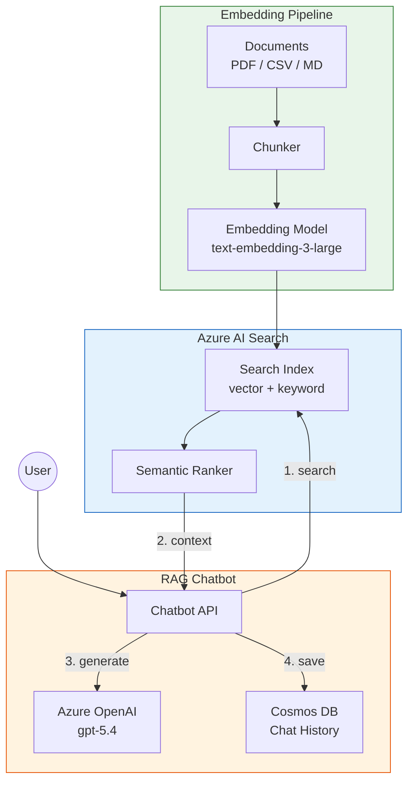

# Tutorial 08: RAG with Azure AI Search

> **Estimated Time:** 75-90 minutes
> **Difficulty:** Intermediate-Advanced

Build a Retrieval-Augmented Generation (RAG) pipeline using Azure AI Search and Azure OpenAI. You will create a search index with vector fields, build an embedding pipeline, implement hybrid search (vector + keyword + semantic reranking), and deploy a RAG chatbot that answers questions from your data catalog.

---

## Prerequisites

- [ ] **Tutorial 06 completed** (Azure OpenAI with gpt-5.4 and text-embedding-3-large)
- [ ] **Azure AI Search** resource (provisioned in this tutorial)
- [ ] **Python** 3.11+
- [ ] **Azure CLI** 2.60+

```bash
az version --output table
python --version
pip install azure-search-documents azure-cosmos openai azure-identity
```

---

## Architecture Diagram



---

## Environment Variables

```bash
# From Tutorial 06
export AOAI_ENDPOINT="$AOAI_ENDPOINT"
export AOAI_KEY="$AOAI_KEY"
export CSA_RG_AI="${CSA_PREFIX}-rg-ai-${CSA_ENV}"

# New for this tutorial
export SEARCH_NAME="${CSA_PREFIX}-search-${CSA_ENV}"
export SEARCH_ENDPOINT="https://${SEARCH_NAME}.search.windows.net"
export COSMOS_NAME="${CSA_PREFIX}-cosmos-chat-${CSA_ENV}"
export INDEX_NAME="csa-data-catalog"
```

---

## Step 1: Deploy Azure AI Search

```bash
az search service create \
  --name "$SEARCH_NAME" \
  --resource-group "$CSA_RG_AI" \
  --location "$CSA_LOCATION" \
  --sku standard \
  --partition-count 1 \
  --replica-count 1 \
  --semantic-search free
```

Retrieve the admin key:

```bash
export SEARCH_KEY=$(az search admin-key show \
  --service-name "$SEARCH_NAME" \
  --resource-group "$CSA_RG_AI" \
  --query "primaryKey" -o tsv)

echo "Search endpoint: $SEARCH_ENDPOINT"
```

<details>
<summary><strong>Expected Output</strong></summary>

```
Search endpoint: https://csa-search-dev.search.windows.net
```

</details>

### Troubleshooting

| Symptom | Cause | Fix |
|---------|-------|-----|
| `ServiceNameNotAvailable` | Name taken | Use a different name (globally unique) |
| `QuotaExceeded` | Too many search services | Delete unused services or use a different subscription |
| Semantic search unavailable | Wrong SKU or region | Use `standard` SKU or higher; check region support |

---

## Step 2: Deploy Azure OpenAI Embedding Model

If you have not already deployed text-embedding-3-large in Tutorial 06:

```bash
az cognitiveservices account deployment create \
  --name "$CSA_AOAI_NAME" \
  --resource-group "$CSA_RG_AI" \
  --deployment-name "text-embedding-3-large" \
  --model-name "text-embedding-3-large" \
  --model-version "1" \
  --model-format OpenAI \
  --sku-capacity 30 \
  --sku-name "Standard"
```

Verify the deployment:

```bash
az cognitiveservices account deployment list \
  --name "$CSA_AOAI_NAME" \
  --resource-group "$CSA_RG_AI" \
  --query "[?name=='text-embedding-3-large'].{name:name,status:properties.provisioningState}" \
  -o table
```

<details>
<summary><strong>Expected Output</strong></summary>

```
Name                     Status
-----------------------  ---------
text-embedding-3-large   Succeeded
```

</details>

---

## Step 3: Create the Search Index with Vector Fields

Create `examples/rag/create_index.py`:

```python
import os
from azure.search.documents.indexes import SearchIndexClient
from azure.search.documents.indexes.models import (
    SearchIndex,
    SearchField,
    SearchFieldDataType,
    SimpleField,
    SearchableField,
    VectorSearch,
    HnswAlgorithmConfiguration,
    VectorSearchProfile,
    SemanticConfiguration,
    SemanticSearch,
    SemanticPrioritizedFields,
    SemanticField,
    SearchIndex,
)
from azure.core.credentials import AzureKeyCredential

client = SearchIndexClient(
    endpoint=os.environ["SEARCH_ENDPOINT"],
    credential=AzureKeyCredential(os.environ["SEARCH_KEY"]),
)

fields = [
    SimpleField(name="id", type=SearchFieldDataType.String, key=True, filterable=True),
    SearchableField(name="title", type=SearchFieldDataType.String),
    SearchableField(name="content", type=SearchFieldDataType.String),
    SearchableField(name="source", type=SearchFieldDataType.String, filterable=True),
    SearchableField(name="category", type=SearchFieldDataType.String, filterable=True, facetable=True),
    SimpleField(name="last_updated", type=SearchFieldDataType.DateTimeOffset, filterable=True, sortable=True),
    SearchField(
        name="content_vector",
        type=SearchFieldDataType.Collection(SearchFieldDataType.Single),
        searchable=True,
        vector_search_dimensions=3072,
        vector_search_profile_name="vector-profile",
    ),
]

vector_search = VectorSearch(
    algorithms=[HnswAlgorithmConfiguration(name="hnsw-config")],
    profiles=[VectorSearchProfile(name="vector-profile", algorithm_configuration_name="hnsw-config")],
)

semantic_config = SemanticConfiguration(
    name="semantic-config",
    prioritized_fields=SemanticPrioritizedFields(
        title_field=SemanticField(field_name="title"),
        content_fields=[SemanticField(field_name="content")],
    ),
)

index = SearchIndex(
    name=os.environ["INDEX_NAME"],
    fields=fields,
    vector_search=vector_search,
    semantic_search=SemanticSearch(configurations=[semantic_config]),
)

result = client.create_or_update_index(index)
print(f"Index '{result.name}' created/updated successfully")
```

Run it:

```bash
python examples/rag/create_index.py
```

<details>
<summary><strong>Expected Output</strong></summary>

```
Index 'csa-data-catalog' created/updated successfully
```

</details>

### Index Schema Reference

```json
{
  "name": "csa-data-catalog",
  "fields": [
    { "name": "id", "type": "Edm.String", "key": true },
    { "name": "title", "type": "Edm.String", "searchable": true },
    { "name": "content", "type": "Edm.String", "searchable": true },
    { "name": "source", "type": "Edm.String", "filterable": true },
    { "name": "category", "type": "Edm.String", "filterable": true },
    { "name": "last_updated", "type": "Edm.DateTimeOffset", "sortable": true },
    { "name": "content_vector", "type": "Collection(Edm.Single)", "dimensions": 3072, "searchable": true }
  ],
  "vectorSearch": {
    "algorithms": [{ "name": "hnsw-config", "kind": "hnsw" }],
    "profiles": [{ "name": "vector-profile", "algorithm": "hnsw-config" }]
  },
  "semantic": {
    "configurations": [{ "name": "semantic-config" }]
  }
}
```

---

## Step 4: Build the Embedding Pipeline

Create `examples/rag/embed_documents.py`:

```python
import os
import hashlib
from openai import AzureOpenAI
from azure.search.documents import SearchClient
from azure.core.credentials import AzureKeyCredential

oai = AzureOpenAI(
    azure_endpoint=os.environ["AOAI_ENDPOINT"],
    api_key=os.environ["AOAI_KEY"],
    api_version="2025-04-01-preview",
)

search = SearchClient(
    endpoint=os.environ["SEARCH_ENDPOINT"],
    index_name=os.environ["INDEX_NAME"],
    credential=AzureKeyCredential(os.environ["SEARCH_KEY"]),
)


def chunk_text(text: str, chunk_size: int = 1000, overlap: int = 200) -> list[str]:
    """Split text into overlapping chunks."""
    chunks = []
    start = 0
    while start < len(text):
        end = start + chunk_size
        chunks.append(text[start:end])
        start += chunk_size - overlap
    return chunks


def embed_text(text: str) -> list[float]:
    """Generate embedding vector for text."""
    resp = oai.embeddings.create(
        model="text-embedding-3-large",
        input=text,
    )
    return resp.data[0].embedding


def index_document(title: str, content: str, source: str, category: str):
    """Chunk, embed, and upload a document to the search index."""
    chunks = chunk_text(content)
    documents = []

    for i, chunk in enumerate(chunks):
        doc_id = hashlib.md5(f"{title}_{i}".encode()).hexdigest()
        vector = embed_text(chunk)
        documents.append({
            "id": doc_id,
            "title": f"{title} (part {i+1})",
            "content": chunk,
            "source": source,
            "category": category,
            "content_vector": vector,
        })

    result = search.upload_documents(documents)
    succeeded = sum(1 for r in result if r.succeeded)
    print(f"  Indexed {succeeded}/{len(documents)} chunks for '{title}'")
    return succeeded
```

---

## Step 5: Upload Vectors to the Index

Create `examples/rag/load_catalog.py`:

```python
import os
import glob
from embed_documents import index_document

# Index CSA platform documentation
docs_path = "docs/"
md_files = glob.glob(os.path.join(docs_path, "**/*.md"), recursive=True)

print(f"Found {len(md_files)} markdown files to index")

total = 0
for filepath in md_files:
    with open(filepath, "r", encoding="utf-8") as f:
        content = f.read()
    if len(content) < 50:  # Skip tiny files
        continue
    title = os.path.basename(filepath).replace(".md", "").replace("_", " ").title()
    total += index_document(
        title=title,
        content=content,
        source=filepath,
        category="documentation",
    )

print(f"\nTotal chunks indexed: {total}")
```

Run the embedding pipeline:

```bash
cd /path/to/csa-inabox
python examples/rag/load_catalog.py
```

<details>
<summary><strong>Expected Output</strong></summary>

```
Found 24 markdown files to index
  Indexed 3/3 chunks for 'Architecture'
  Indexed 5/5 chunks for 'Getting Started'
  Indexed 2/2 chunks for 'Databricks Guide'
  ...

Total chunks indexed: 47
```

</details>

### Troubleshooting

| Symptom | Cause | Fix |
|---------|-------|-----|
| `RateLimitError` on embeddings | Too many concurrent calls | Add `time.sleep(0.5)` between batches |
| `InvalidRequestError` | Text too long for embedding | Reduce `chunk_size` to 500-800 tokens |
| `IndexNotFoundError` | Index not created | Run Step 3 first |

---

## Step 6: Implement Hybrid Search

Create `examples/rag/search.py`:

```python
import os
from openai import AzureOpenAI
from azure.search.documents import SearchClient
from azure.search.documents.models import (
    VectorizableTextQuery,
    QueryType,
    QueryCaptionType,
    QueryAnswerType,
)
from azure.core.credentials import AzureKeyCredential

oai = AzureOpenAI(
    azure_endpoint=os.environ["AOAI_ENDPOINT"],
    api_key=os.environ["AOAI_KEY"],
    api_version="2025-04-01-preview",
)

search = SearchClient(
    endpoint=os.environ["SEARCH_ENDPOINT"],
    index_name=os.environ["INDEX_NAME"],
    credential=AzureKeyCredential(os.environ["SEARCH_KEY"]),
)


def embed_query(query: str) -> list[float]:
    resp = oai.embeddings.create(model="text-embedding-3-large", input=query)
    return resp.data[0].embedding


def hybrid_search(query: str, top_k: int = 5) -> list[dict]:
    """Perform hybrid search: vector + keyword + semantic reranking."""
    vector = embed_query(query)

    results = search.search(
        search_text=query,
        vector_queries=[
            VectorizableTextQuery(
                text=query,
                k_nearest_neighbors=top_k,
                fields="content_vector",
            )
        ],
        query_type=QueryType.SEMANTIC,
        semantic_configuration_name="semantic-config",
        query_caption=QueryCaptionType.EXTRACTIVE,
        query_answer=QueryAnswerType.EXTRACTIVE,
        top=top_k,
    )

    hits = []
    for r in results:
        hits.append({
            "title": r["title"],
            "content": r["content"],
            "source": r["source"],
            "score": r["@search.score"],
            "reranker_score": r.get("@search.reranker_score", 0),
        })
    return hits


if __name__ == "__main__":
    query = "How does the medallion architecture work?"
    print(f"Query: {query}\n")
    results = hybrid_search(query)
    for i, r in enumerate(results, 1):
        print(f"{i}. [{r['reranker_score']:.2f}] {r['title']}")
        print(f"   {r['content'][:120]}...")
        print()
```

Test hybrid search:

```bash
python examples/rag/search.py
```

<details>
<summary><strong>Expected Output</strong></summary>

```
Query: How does the medallion architecture work?

1. [3.42] Architecture (part 1)
   The medallion architecture organizes data into three layers: Bronze (raw), Silver (cleaned), Gold (curated business-r...

2. [2.89] Getting Started (part 2)
   Data flows through the medallion layers via dbt transformations. Bronze contains raw ingested data, Silver applies...

3. [1.95] Databricks Guide (part 1)
   Configure your Databricks workspace to read from Bronze and write to Silver and Gold containers using Unity Catalog...
```

</details>

---

## Step 7: Build the RAG Chatbot

Create `examples/rag/rag_chatbot.py`:

```python
import os
from openai import AzureOpenAI
from search import hybrid_search

oai = AzureOpenAI(
    azure_endpoint=os.environ["AOAI_ENDPOINT"],
    api_key=os.environ["AOAI_KEY"],
    api_version="2025-04-01-preview",
)

SYSTEM_PROMPT = (
    "You are a knowledgeable assistant for the CSA-in-a-Box data platform. "
    "Answer questions using ONLY the provided context. "
    "If the context does not contain the answer, say so. "
    "Cite your sources by referencing the document title."
)


def rag_chat(question: str, history: list[dict] | None = None) -> str:
    # 1. Retrieve relevant context
    results = hybrid_search(question, top_k=5)
    context = "\n\n---\n\n".join(
        f"**{r['title']}** (source: {r['source']})\n{r['content']}"
        for r in results
    )

    # 2. Build prompt with context
    messages = [{"role": "system", "content": SYSTEM_PROMPT}]
    messages.extend(history or [])
    messages.append({
        "role": "user",
        "content": f"Context:\n{context}\n\nQuestion: {question}",
    })

    # 3. Generate answer
    resp = oai.chat.completions.create(
        model="gpt-54", messages=messages, temperature=0.2, max_tokens=1024
    )
    return resp.choices[0].message.content


if __name__ == "__main__":
    print("RAG Chatbot (type 'quit' to exit)")
    print("-" * 50)
    history = []
    while True:
        q = input("\nYou: ").strip()
        if q.lower() in ("quit", "exit"):
            break
        reply = rag_chat(q, history)
        print(f"\nAssistant: {reply}")
        history += [{"role": "user", "content": q}, {"role": "assistant", "content": reply}]
```

Test it:

```bash
python examples/rag/rag_chatbot.py
```

<details>
<summary><strong>Expected Output</strong></summary>

```
RAG Chatbot (type 'quit' to exit)
--------------------------------------------------

You: How do I deploy Databricks?
Assistant: Based on the documentation, Databricks is deployed as part of the
Data Landing Zone (DLZ) in Step 5 of the Foundation Platform tutorial.

The deployment uses Bicep templates located in `deploy/bicep/DLZ/main.bicep`.
Key parameters include `databricksWorkspaceName` and node type configuration.
After deployment, you need to create a compute cluster and generate a Personal
Access Token for dbt connectivity.

(Source: Getting Started, Databricks Guide)
```

</details>

---

## Step 8: Add Cosmos DB for Conversation History

### 8a. Create Cosmos DB Account

```bash
az cosmosdb create \
  --name "$COSMOS_NAME" \
  --resource-group "$CSA_RG_AI" \
  --kind GlobalDocumentDB \
  --default-consistency-level Session \
  --locations regionName="$CSA_LOCATION" failoverPriority=0

az cosmosdb sql database create \
  --account-name "$COSMOS_NAME" \
  --resource-group "$CSA_RG_AI" \
  --name "chatbot"

az cosmosdb sql container create \
  --account-name "$COSMOS_NAME" \
  --resource-group "$CSA_RG_AI" \
  --database-name "chatbot" \
  --name "conversations" \
  --partition-key-path "/user_id" \
  --throughput 400
```

### 8b. Get Connection Details

```bash
export COSMOS_ENDPOINT=$(az cosmosdb show \
  --name "$COSMOS_NAME" --resource-group "$CSA_RG_AI" \
  --query "documentEndpoint" -o tsv)

export COSMOS_KEY=$(az cosmosdb keys list \
  --name "$COSMOS_NAME" --resource-group "$CSA_RG_AI" \
  --query "primaryMasterKey" -o tsv)
```

### 8c. Add History to the Chatbot

```python
from azure.cosmos import CosmosClient
import uuid
from datetime import datetime

cosmos = CosmosClient(os.environ["COSMOS_ENDPOINT"], os.environ["COSMOS_KEY"])
db = cosmos.get_database_client("chatbot")
container = db.get_container_client("conversations")

def save_conversation(user_id: str, messages: list[dict]):
    container.upsert_item({
        "id": str(uuid.uuid4()),
        "user_id": user_id,
        "messages": messages,
        "timestamp": datetime.utcnow().isoformat(),
    })

def load_history(user_id: str, limit: int = 10) -> list[dict]:
    query = f"SELECT TOP {limit} * FROM c WHERE c.user_id = @uid ORDER BY c.timestamp DESC"
    items = list(container.query_items(query, parameters=[{"name": "@uid", "value": user_id}]))
    if items:
        return items[0].get("messages", [])
    return []
```

<details>
<summary><strong>Expected Output</strong></summary>

```
Cosmos DB 'chatbot' database created
Container 'conversations' created with /user_id partition key
```

</details>

---

## Step 9: Test with Real CSA Documentation

```bash
# Index all CSA documentation
python examples/rag/load_catalog.py

# Start the RAG chatbot
python examples/rag/rag_chatbot.py
```

Try these test queries:

1. "What Azure services does CSA-in-a-Box deploy?"
2. "How do I configure dbt for Databricks?"
3. "What is the difference between Bronze, Silver, and Gold layers?"
4. "How do I set up VNet peering?"

<details>
<summary><strong>Expected Output</strong></summary>

```
You: What Azure services does CSA-in-a-Box deploy?
Assistant: CSA-in-a-Box deploys the following Azure services across three landing zones:

**ALZ (Azure Landing Zone):** Log Analytics, Azure Policy, Hub VNet
**DMLZ (Data Management):** Microsoft Purview, Key Vault, Container Registry
**DLZ (Data Landing Zone):** ADLS Gen2, Databricks, Synapse Analytics, Data Factory, Event Hubs

(Source: Architecture, Getting Started)
```

</details>

---

## Validation

```bash
# Verify search index exists
az search service show \
  --name "$SEARCH_NAME" \
  --resource-group "$CSA_RG_AI" \
  --query "status" -o tsv

# Verify document count in index
python -c "
import os
from azure.search.documents import SearchClient
from azure.core.credentials import AzureKeyCredential
client = SearchClient(
    os.environ['SEARCH_ENDPOINT'], os.environ['INDEX_NAME'],
    AzureKeyCredential(os.environ['SEARCH_KEY'])
)
print(f'Documents in index: {client.get_document_count()}')
"

# Test hybrid search
python examples/rag/search.py
```

<details>
<summary><strong>Expected Output</strong></summary>

```
running
Documents in index: 47
Query: How does the medallion architecture work?
1. [3.42] Architecture (part 1)...
```

</details>

---

## Completion Checklist

- [ ] Azure AI Search deployed with semantic ranker
- [ ] Embedding model (text-embedding-3-large) deployed
- [ ] Search index created with vector fields (3072 dimensions)
- [ ] Embedding pipeline chunks and indexes documents
- [ ] Documents uploaded to the search index
- [ ] Hybrid search (vector + keyword + semantic reranking) works
- [ ] RAG chatbot answers questions from the data catalog
- [ ] Cosmos DB stores conversation history
- [ ] End-to-end test with real CSA documentation passes

---

## Troubleshooting (Summary)

| Symptom | Cause | Fix |
|---------|-------|-----|
| `IndexNotFoundError` | Index not created | Run `create_index.py` first |
| Empty search results | No documents indexed | Run `load_catalog.py` to populate the index |
| `RateLimitError` on embeddings | TPM quota | Add delays or reduce batch size |
| Poor search relevance | Chunk size too large | Reduce to 500-800 characters with 200 overlap |
| `AuthenticationError` | Wrong search key | Re-export `SEARCH_KEY` from `az search admin-key show` |
| Cosmos connection timeout | Firewall rules | Allow Azure services in Cosmos DB networking settings |
| Semantic ranker not working | SKU too low | Need `standard` or higher SKU for semantic search |

---

## What's Next

Your RAG pipeline is operational. Continue with:

- **[Tutorial 09: GraphRAG Knowledge Graphs](../09-graphrag-knowledge/README.md)** -- Build knowledge graphs that combine vector search with graph-based reasoning for advanced lineage and impact analysis

See the [Tutorial Index](../README.md) for all available paths.

---

## Clean Up (Optional)

```bash
# Delete the search service
az search service delete --name "$SEARCH_NAME" --resource-group "$CSA_RG_AI" --yes

# Delete the Cosmos DB account
az cosmosdb delete --name "$COSMOS_NAME" --resource-group "$CSA_RG_AI" --yes

# Or delete the entire AI resource group
az group delete --name "$CSA_RG_AI" --yes --no-wait
```

---

## Reference

- [Azure AI Search Documentation](https://learn.microsoft.com/en-us/azure/search/)
- [Azure AI Search Vector Search](https://learn.microsoft.com/en-us/azure/search/vector-search-overview)
- [Azure OpenAI Embeddings](https://learn.microsoft.com/en-us/azure/ai-services/openai/concepts/understand-embeddings)
- [Azure Cosmos DB Documentation](https://learn.microsoft.com/en-us/azure/cosmos-db/)
- [RAG Pattern Best Practices](https://learn.microsoft.com/en-us/azure/search/retrieval-augmented-generation-overview)
- [CSA-in-a-Box Architecture](../../ARCHITECTURE.md)
