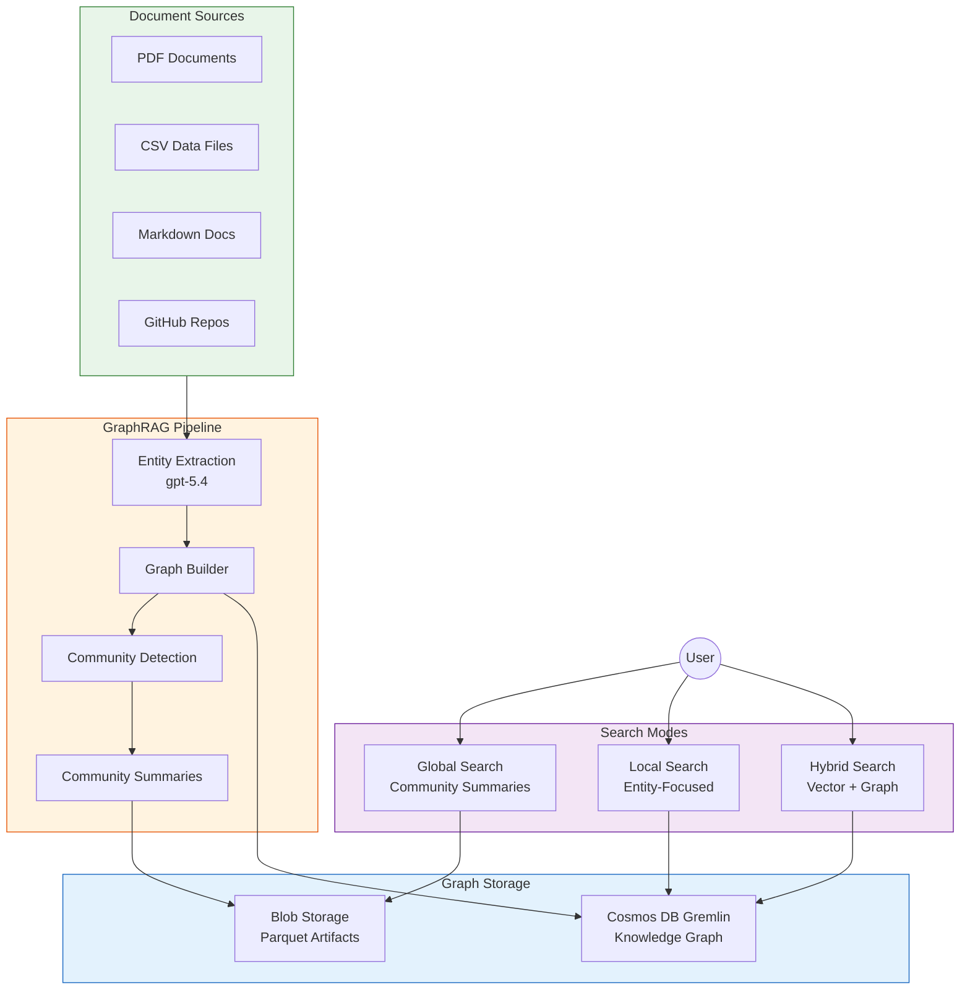

# Tutorial 09: GraphRAG Knowledge Graphs

> **Estimated Time:** 75-90 minutes
> **Difficulty:** Advanced
> **Last Updated:** 2026-04-22

Build a GraphRAG knowledge graph that extracts entities and relationships from your data catalog, indexes them in Cosmos DB (Gremlin), and enables advanced queries like impact analysis and lineage traversal. You will combine graph-based reasoning with vector search for a hybrid retrieval system.

---

## Prerequisites

- [ ] **Tutorial 06 completed** (Azure OpenAI with gpt-5.4)
- [ ] **Tutorial 08 completed** (Azure AI Search with embeddings -- optional but recommended)
- [ ] **Python** 3.11+
- [ ] **Azure CLI** 2.60+

```bash
python --version
pip install graphrag gremlinpython azure-cosmos azure-identity openai
```

---

## Architecture Diagram



---

## Environment Variables

```bash
# From Tutorial 06
export AOAI_ENDPOINT="$AOAI_ENDPOINT"
export AOAI_KEY="$AOAI_KEY"
export CSA_RG_AI="${CSA_PREFIX}-rg-ai-${CSA_ENV}"
export CSA_LOCATION="eastus"

# New for this tutorial
export COSMOS_GREMLIN_NAME="${CSA_PREFIX}-cosmos-graph-${CSA_ENV}"
export GRAPHRAG_STORAGE="${CSA_PREFIX}graphragstorage"
export GRAPHRAG_INPUT_DIR="./ragtest/input"
export GRAPHRAG_ROOT="./ragtest"
```

---

## Step 1: Deploy GraphRAG Infrastructure

### 1a. Using the Deployment Script

```bash
chmod +x scripts/ai/deploy-graphrag-infra.sh
./scripts/ai/deploy-graphrag-infra.sh \
  --prefix "$CSA_PREFIX" \
  --env "$CSA_ENV" \
  --location "$CSA_LOCATION" \
  --resource-group "$CSA_RG_AI"
```

### 1b. Manual Deployment (Alternative)

If the script is not available, deploy manually:

```bash
# Create Cosmos DB with Gremlin API
az cosmosdb create \
  --name "$COSMOS_GREMLIN_NAME" \
  --resource-group "$CSA_RG_AI" \
  --capabilities EnableGremlin \
  --default-consistency-level Session \
  --locations regionName="$CSA_LOCATION" failoverPriority=0

# Create the graph database
az cosmosdb gremlin database create \
  --account-name "$COSMOS_GREMLIN_NAME" \
  --resource-group "$CSA_RG_AI" \
  --name "knowledge-graph"

# Create the graph container
az cosmosdb gremlin graph create \
  --account-name "$COSMOS_GREMLIN_NAME" \
  --resource-group "$CSA_RG_AI" \
  --database-name "knowledge-graph" \
  --name "entities" \
  --partition-key-path "/category" \
  --throughput 400

# Create blob storage for GraphRAG artifacts
az storage account create \
  --name "$GRAPHRAG_STORAGE" \
  --resource-group "$CSA_RG_AI" \
  --location "$CSA_LOCATION" \
  --sku Standard_LRS

az storage container create \
  --name "graphrag" \
  --account-name "$GRAPHRAG_STORAGE" \
  --auth-mode login
```

<details>
<summary><strong>Expected Output</strong></summary>

```json
{
  "name": "csa-cosmos-graph-dev",
  "properties": { "provisioningState": "Succeeded" },
  "capabilities": [{ "name": "EnableGremlin" }]
}
```

</details>

### Troubleshooting

| Symptom | Cause | Fix |
|---------|-------|-----|
| `AccountNameAlreadyExists` | Cosmos DB name taken | Use a more unique prefix |
| Gremlin API not available | Region limitation | Try `eastus`, `westus2`, or `westeurope` |
| Script permission denied | Not executable | Run `chmod +x` on the script |

---

## Step 2: Prepare Documents

### 2a. Create the Input Directory

```bash
mkdir -p "$GRAPHRAG_INPUT_DIR"
```

### 2b. Gather Documents from Multiple Sources

```bash
# Copy platform documentation
cp docs/*.md "$GRAPHRAG_INPUT_DIR/"
cp docs/tutorials/*/README.md "$GRAPHRAG_INPUT_DIR/" 2>/dev/null || true

# Copy data product definitions
find examples/ -name "*.md" -exec cp {} "$GRAPHRAG_INPUT_DIR/" \;

# Download from GitHub (if you have additional repos)
# curl -L "https://raw.githubusercontent.com/org/repo/main/docs/README.md" \
#   -o "$GRAPHRAG_INPUT_DIR/external-readme.md"
```

### 2c. Convert Non-Text Sources

For PDF and CSV files, convert to text first:

```python
# examples/graphrag/convert_sources.py
import csv
import os

def csv_to_text(csv_path: str, output_dir: str):
    """Convert a CSV file to a text document for GraphRAG."""
    basename = os.path.splitext(os.path.basename(csv_path))[0]
    with open(csv_path, "r") as f:
        reader = csv.DictReader(f)
        rows = list(reader)

    text = f"# {basename}\n\n"
    text += f"This dataset contains {len(rows)} records.\n\n"
    text += f"## Columns\n\n"
    if rows:
        text += ", ".join(rows[0].keys()) + "\n\n"
        text += "## Sample Records\n\n"
        for row in rows[:10]:
            text += str(dict(row)) + "\n"

    output_path = os.path.join(output_dir, f"{basename}.txt")
    with open(output_path, "w") as f:
        f.write(text)
    print(f"Converted {csv_path} -> {output_path}")
```

```bash
python examples/graphrag/convert_sources.py
ls -la "$GRAPHRAG_INPUT_DIR/"
```

<details>
<summary><strong>Expected Output</strong></summary>

```
total 156
-rw-r--r-- 1 user user  8234 Apr 22 10:00 ARCHITECTURE.md
-rw-r--r-- 1 user user 12456 Apr 22 10:00 GETTING_STARTED.md
-rw-r--r-- 1 user user  4567 Apr 22 10:00 DATABRICKS_GUIDE.md
-rw-r--r-- 1 user user  3210 Apr 22 10:00 nass_quickstats.txt
...
```

</details>

---

## Step 3: Configure GraphRAG Settings

### 3a. Initialize GraphRAG

```bash
cd "$GRAPHRAG_ROOT"
graphrag init
```

### 3b. Configure settings.yaml

Edit the generated `settings.yaml`:

```yaml
llm:
  api_key: ${AOAI_KEY}
  type: azure_openai_chat
  model: gpt-5.4
  deployment_name: gpt-54
  api_base: ${AOAI_ENDPOINT}
  api_version: "2025-04-01-preview"
  max_retries: 3
  tokens_per_minute: 30000
  requests_per_minute: 30

embeddings:
  llm:
    api_key: ${AOAI_KEY}
    type: azure_openai_embedding
    model: text-embedding-3-large
    deployment_name: text-embedding-3-large
    api_base: ${AOAI_ENDPOINT}
    api_version: "2025-04-01-preview"

chunks:
  size: 1200
  overlap: 200

entity_extraction:
  max_gleanings: 1
  entity_types:
    - service
    - data_product
    - pipeline
    - table
    - column
    - team
    - technology
    - policy

community_reports:
  max_length: 2000

storage:
  type: blob
  connection_string: ${GRAPHRAG_STORAGE_CONNECTION}
  container_name: graphrag

input:
  type: file
  file_type: text
  base_dir: input
```

### 3c. Set Storage Connection

```bash
export GRAPHRAG_STORAGE_CONNECTION=$(az storage account show-connection-string \
  --name "$GRAPHRAG_STORAGE" \
  --resource-group "$CSA_RG_AI" \
  --query "connectionString" -o tsv)
```

<details>
<summary><strong>Expected Output</strong></summary>

```
settings.yaml created with Azure OpenAI and blob storage configuration.
```

</details>

---

## Step 4: Build the Knowledge Graph Index

```bash
cd "$GRAPHRAG_ROOT"
graphrag index --root .
```

This is the longest step (15-30 minutes depending on document count). GraphRAG will:

1. **Chunk** all input documents
2. **Extract** entities and relationships using gpt-5.4
3. **Build** the entity graph
4. **Detect** communities using Leiden algorithm
5. **Summarize** each community

<details>
<summary><strong>Expected Output</strong></summary>

```
GraphRAG Indexing Pipeline
==========================
Step 1/6: Loading input documents... 24 files loaded
Step 2/6: Chunking documents... 156 chunks created
Step 3/6: Extracting entities... 342 entities, 567 relationships
Step 4/6: Building graph... 342 nodes, 567 edges
Step 5/6: Detecting communities... 28 communities found
Step 6/6: Generating community reports... 28 reports generated

Indexing complete!
  Entities: 342
  Relationships: 567
  Communities: 28
  Artifacts saved to blob storage
```

</details>

### Troubleshooting

| Symptom | Cause | Fix |
|---------|-------|-----|
| `RateLimitError` | Too many LLM calls | Reduce `tokens_per_minute` and `requests_per_minute` |
| `BlobStorageError` | Wrong connection string | Re-export `GRAPHRAG_STORAGE_CONNECTION` |
| Indexing takes > 1 hour | Too many documents | Reduce input docs or increase TPM quota |
| `EntityExtractionError` | Model capacity | Use a higher `sku-capacity` for gpt-5.4 |

---

## Step 5: Explore the Graph in Cosmos DB Gremlin

### 5a. Get Connection Details

```bash
export GREMLIN_ENDPOINT=$(az cosmosdb show \
  --name "$COSMOS_GREMLIN_NAME" \
  --resource-group "$CSA_RG_AI" \
  --query "documentEndpoint" -o tsv)

export GREMLIN_KEY=$(az cosmosdb keys list \
  --name "$COSMOS_GREMLIN_NAME" \
  --resource-group "$CSA_RG_AI" \
  --query "primaryMasterKey" -o tsv)
```

### 5b. Upload Graph to Cosmos DB

Create `examples/graphrag/upload_to_cosmos.py`:

```python
import os
import pandas as pd
from gremlin_python.driver import client, serializer

GREMLIN_URI = os.environ["GREMLIN_ENDPOINT"].replace("https://", "wss://").replace(":443/", ":443/gremlin")
GREMLIN_KEY = os.environ["GREMLIN_KEY"]
DATABASE = "knowledge-graph"
GRAPH = "entities"

gremlin = client.Client(
    GREMLIN_URI, "g",
    username=f"/dbs/{DATABASE}/colls/{GRAPH}",
    password=GREMLIN_KEY,
    message_serializer=serializer.GraphSONSerializersV2d0(),
)

# Load entities from GraphRAG output
entities = pd.read_parquet("output/entities.parquet")
relationships = pd.read_parquet("output/relationships.parquet")

print(f"Uploading {len(entities)} entities and {len(relationships)} relationships...")

# Add vertices
for _, e in entities.iterrows():
    query = (
        f"g.addV('{e['type']}').property('id', '{e['id']}')"
        f".property('name', '{e['name']}')"
        f".property('description', '{e['description'][:200]}')"
        f".property('category', '{e['type']}')"
        f".property('pk', '{e['type']}')"
    )
    gremlin.submit(query)

# Add edges
for _, r in relationships.iterrows():
    query = (
        f"g.V('{r['source']}').addE('{r['type']}')"
        f".to(g.V('{r['target']}'))"
        f".property('description', '{r['description'][:100]}')"
    )
    gremlin.submit(query)

print("Upload complete!")
gremlin.close()
```

```bash
python examples/graphrag/upload_to_cosmos.py
```

<details>
<summary><strong>Expected Output</strong></summary>

```
Uploading 342 entities and 567 relationships...
Upload complete!
```

</details>

### 5c. Explore with Gremlin Queries

```python
# Query: List all services
result = gremlin.submit("g.V().hasLabel('service').values('name').dedup()")
print("Services:", list(result))

# Query: Find all tables connected to Databricks
result = gremlin.submit(
    "g.V().has('name', 'Databricks').both().hasLabel('table').values('name')"
)
print("Databricks tables:", list(result))

# Query: Count entities by type
result = gremlin.submit("g.V().groupCount().by(label)")
print("Entity counts:", list(result))
```

<details>
<summary><strong>Expected Output</strong></summary>

```
Services: ['Databricks', 'Synapse', 'Data Factory', 'Purview', 'Event Hubs', 'Key Vault']
Databricks tables: ['fct_crop_production', 'dim_commodity', 'raw_nass_quickstats']
Entity counts: [{'service': 12, 'data_product': 8, 'table': 15, 'pipeline': 6, 'policy': 4}]
```

</details>

---

## Step 6: Run Global Search

Global search uses community summaries for high-level questions:

```bash
cd "$GRAPHRAG_ROOT"
graphrag query --root . --method global --query "What are the main components of the CSA platform?"
```

<details>
<summary><strong>Expected Output</strong></summary>

```
SUCCESS: Global Search

The CSA-in-a-Box platform consists of three primary landing zones:

1. **Azure Landing Zone (ALZ):** Provides foundational infrastructure including
   Log Analytics for monitoring, Azure Policy for compliance, and hub networking.

2. **Data Management Landing Zone (DMLZ):** Houses governance services including
   Microsoft Purview for data cataloging, centralized Key Vault, and Container Registry.

3. **Data Landing Zone (DLZ):** The core data processing layer with ADLS Gen2
   (medallion architecture), Databricks, Synapse Analytics, and Data Factory.

These components are connected via hub-spoke VNet peering and secured with
RBAC and managed identities. [Community 1, Community 3, Community 7]
```

</details>

---

## Step 7: Run Local Search

Local search focuses on specific entities for detailed questions:

```bash
graphrag query --root . --method local --query "What tables does the crop production pipeline produce?"
```

<details>
<summary><strong>Expected Output</strong></summary>

```
SUCCESS: Local Search

The crop production pipeline produces the following tables:

**Bronze Layer:**
- `raw_nass_quickstats` -- Raw USDA NASS data as ingested

**Silver Layer:**
- `stg_nass_quickstats` -- Cleaned and deduplicated staging table

**Gold Layer:**
- `fct_crop_production` -- Fact table with production metrics by state/year
- `dim_commodity` -- Commodity dimension table
- `dim_state` -- State/geography dimension table

The pipeline uses dbt for transformations, running on Databricks compute.
[Entities: dbt_pipeline, fct_crop_production, raw_nass_quickstats]
```

</details>

---

## Step 8: Build Hybrid Search (Vector + Graph)

Create `examples/graphrag/hybrid_search.py`:

```python
import os
from openai import AzureOpenAI
from gremlin_python.driver import client, serializer

oai = AzureOpenAI(
    azure_endpoint=os.environ["AOAI_ENDPOINT"],
    api_key=os.environ["AOAI_KEY"],
    api_version="2025-04-01-preview",
)

GREMLIN_URI = os.environ["GREMLIN_ENDPOINT"].replace("https://", "wss://").replace(":443/", ":443/gremlin")
gremlin = client.Client(
    GREMLIN_URI, "g",
    username="/dbs/knowledge-graph/colls/entities",
    password=os.environ["GREMLIN_KEY"],
    message_serializer=serializer.GraphSONSerializersV2d0(),
)


def graph_context(query: str) -> str:
    """Extract relevant graph context for a query."""
    # Find entities mentioned in the query
    keywords = query.lower().split()
    entities = []
    for kw in keywords:
        if len(kw) > 3:
            result = gremlin.submit(
                f"g.V().has('name', containing('{kw}')).limit(5)"
                f".project('name','type','desc')"
                f".by('name').by(label).by('description')"
            )
            entities.extend(list(result))

    if not entities:
        return "No graph context found."

    # Get relationships for found entities
    context_parts = []
    for e in entities[:5]:
        neighbors = gremlin.submit(
            f"g.V().has('name', '{e['name']}').bothE()"
            f".project('relation','target')"
            f".by(label).by(inV().values('name'))"
        )
        rels = list(neighbors)
        context_parts.append(
            f"Entity: {e['name']} ({e['type']})\n"
            f"  Description: {e['desc']}\n"
            f"  Relationships: {rels[:5]}"
        )

    return "\n\n".join(context_parts)


def hybrid_rag(question: str) -> str:
    """Combine graph context with LLM generation."""
    ctx = graph_context(question)

    messages = [
        {"role": "system", "content": (
            "You answer questions using knowledge graph context. "
            "Reference specific entities and relationships in your answer."
        )},
        {"role": "user", "content": f"Graph Context:\n{ctx}\n\nQuestion: {question}"},
    ]

    resp = oai.chat.completions.create(
        model="gpt-54", messages=messages, temperature=0.2, max_tokens=1024
    )
    return resp.choices[0].message.content


if __name__ == "__main__":
    q = "What services are connected to Databricks and what data do they process?"
    print(f"Question: {q}\n")
    print(hybrid_rag(q))
```

```bash
python examples/graphrag/hybrid_search.py
```

<details>
<summary><strong>Expected Output</strong></summary>

```
Question: What services are connected to Databricks and what data do they process?

Databricks is a central compute service in the Data Landing Zone with the following connections:

- **ADLS Gen2** (reads/writes): Databricks reads from the Bronze container and writes
  transformed data to Silver and Gold containers
- **Data Factory** (orchestration): ADF triggers Databricks notebooks for scheduled processing
- **Purview** (governance): Purview catalogs Databricks tables and tracks lineage
- **Synapse Analytics** (consumption): Synapse queries Gold layer tables produced by Databricks

The primary data processed is USDA crop production data flowing through the
Bronze -> Silver -> Gold medallion architecture via dbt transformations.
```

</details>

---

## Step 9: Impact Analysis and Lineage Traversal

### 9a. Impact Analysis

"If we change table X, what downstream consumers are affected?"

```python
def impact_analysis(entity_name: str, depth: int = 3) -> list[dict]:
    """Trace downstream impact of changes to an entity."""
    query = (
        f"g.V().has('name', '{entity_name}')"
        f".repeat(outE().inV()).times({depth}).emit()"
        f".path().by('name').by(label)"
    )
    result = gremlin.submit(query)
    paths = list(result)

    print(f"Impact analysis for '{entity_name}' (depth={depth}):")
    for path in paths:
        print(f"  {' -> '.join(str(p) for p in path)}")
    return paths
```

```bash
python -c "
from hybrid_search import impact_analysis
impact_analysis('raw_nass_quickstats', depth=3)
"
```

<details>
<summary><strong>Expected Output</strong></summary>

```
Impact analysis for 'raw_nass_quickstats' (depth=3):
  raw_nass_quickstats -> transforms_to -> stg_nass_quickstats
  stg_nass_quickstats -> transforms_to -> fct_crop_production
  fct_crop_production -> consumed_by -> Synapse Analytics
  fct_crop_production -> consumed_by -> Power BI Dashboard
```

</details>

### 9b. Lineage Traversal

"Where does this Gold table's data come from?"

```python
def lineage_trace(table_name: str) -> list[dict]:
    """Trace upstream lineage of a table."""
    query = (
        f"g.V().has('name', '{table_name}')"
        f".repeat(inE().outV()).times(5).emit()"
        f".path().by('name').by(label)"
    )
    result = gremlin.submit(query)
    paths = list(result)

    print(f"Lineage for '{table_name}':")
    for path in paths:
        print(f"  {' <- '.join(str(p) for p in path)}")
    return paths
```

<details>
<summary><strong>Expected Output</strong></summary>

```
Lineage for 'fct_crop_production':
  fct_crop_production <- transforms_to <- stg_nass_quickstats
  stg_nass_quickstats <- transforms_to <- raw_nass_quickstats
  raw_nass_quickstats <- ingested_by <- Data Factory
  Data Factory <- reads_from <- USDA API
```

</details>

---

## Validation

```bash
# Verify Cosmos DB Gremlin
az cosmosdb show --name "$COSMOS_GREMLIN_NAME" \
  --resource-group "$CSA_RG_AI" \
  --query "{name:name, status:provisioningState}" -o table

# Verify graph data
python -c "
# ... connect to Gremlin ...
result = gremlin.submit('g.V().count()')
print(f'Vertices: {list(result)[0]}')
result = gremlin.submit('g.E().count()')
print(f'Edges: {list(result)[0]}')
"

# Test global search
graphrag query --root "$GRAPHRAG_ROOT" --method global \
  --query "Summarize the platform architecture"

# Test local search
graphrag query --root "$GRAPHRAG_ROOT" --method local \
  --query "What is Databricks used for?"
```

<details>
<summary><strong>Expected Output</strong></summary>

```
Name                     Status
-----------------------  -----------
csa-cosmos-graph-dev     Succeeded

Vertices: 342
Edges: 567
```

</details>

---

## Completion Checklist

- [ ] GraphRAG infrastructure deployed (Cosmos DB Gremlin + Blob Storage)
- [ ] Documents gathered from multiple sources (PDF, CSV, Markdown)
- [ ] GraphRAG settings.yaml configured with Azure OpenAI
- [ ] Knowledge graph index built successfully
- [ ] Graph uploaded to Cosmos DB Gremlin
- [ ] Global search returns community-level summaries
- [ ] Local search returns entity-focused answers
- [ ] Hybrid search combines vector and graph context
- [ ] Impact analysis traces downstream dependencies
- [ ] Lineage traversal traces upstream data origins

---

## Troubleshooting (Summary)

| Symptom | Cause | Fix |
|---------|-------|-----|
| `graphrag` command not found | Not installed | `pip install graphrag` |
| `RateLimitError` during indexing | TPM quota | Reduce `tokens_per_minute` in settings.yaml |
| Cosmos DB Gremlin timeout | Query too complex | Add `.limit()` to Gremlin queries |
| Empty graph | Indexing failed silently | Check `output/logs/` for errors |
| `GremlinConnectionError` | Wrong endpoint | Ensure endpoint uses `wss://` protocol |
| No communities detected | Too few documents | Add more input documents (minimum 5-10 recommended) |
| `ParquetReadError` | Indexing incomplete | Re-run `graphrag index` from scratch |

---

## What's Next

Your knowledge graph is operational. You now have the complete CSA-in-a-Box AI stack:

- **Tutorial 06:** AI Foundry + OpenAI chatbot
- **Tutorial 07:** Multi-agent teams with Semantic Kernel
- **Tutorial 08:** RAG with vector search
- **Tutorial 09:** GraphRAG with knowledge graphs (this tutorial)

Combine these capabilities to build:

- **Intelligent data governance agents** that use graph context to make decisions
- **Self-service analytics** where users query data products in natural language
- **Automated impact analysis** before schema changes
- **Data lineage visualization** powered by graph traversal

See the [Tutorial Index](../README.md) for all available paths.

---

## Clean Up (Optional)

```bash
# Delete GraphRAG-specific resources
az cosmosdb delete --name "$COSMOS_GREMLIN_NAME" --resource-group "$CSA_RG_AI" --yes
az storage account delete --name "$GRAPHRAG_STORAGE" --resource-group "$CSA_RG_AI" --yes

# Remove local artifacts
rm -rf "$GRAPHRAG_ROOT"

# Or delete the entire AI resource group
az group delete --name "$CSA_RG_AI" --yes --no-wait
```

---

## Reference

- [GraphRAG Documentation](https://microsoft.github.io/graphrag/)
- [Azure Cosmos DB Gremlin API](https://learn.microsoft.com/en-us/azure/cosmos-db/gremlin/)
- [Gremlin Query Language](https://tinkerpop.apache.org/gremlin.html)
- [CSA-in-a-Box GraphRAG Module](../../../csa_platform/ai_integration/graphrag/)
- [GraphRAG Infrastructure Script](../../../scripts/ai/deploy-graphrag-infra.sh)
- [Azure OpenAI Documentation](https://learn.microsoft.com/en-us/azure/ai-services/openai/)
