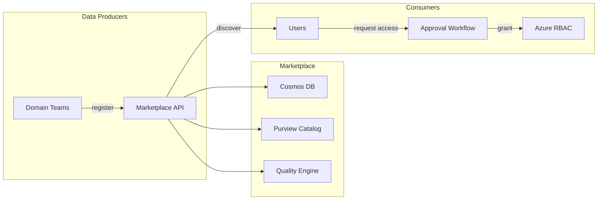

# Tutorial 10: Data Marketplace — Publish, Discover, and Consume Data Products

> **Estimated Time:** 60 minutes | **Path:** F (Platform Operations) | **Prerequisites:** Tutorial 01



## What You'll Build

A self-service data marketplace where domain teams publish data products
and consumers discover, request access to, and monitor quality scores.

## Prerequisites

- Tutorial 01 completed (foundation platform deployed)
- Azure Cosmos DB account (deployed with foundation)
- Microsoft Purview instance configured

## Environment Variables

```bash
export COSMOS_ENDPOINT="https://<your-cosmos>.documents.azure.com:443/"
export PURVIEW_ENDPOINT="https://<your-purview>.purview.azure.com"
export AZURE_OPENAI_ENDPOINT="https://<your-openai>.openai.azure.com/"
```

---

## Step 1: Understand the Data Product Schema

The marketplace uses a structured schema for data products. Each product
includes metadata, quality scores, access policies, and lineage.

```python
# Data Product structure (from portal.shared.api.models.marketplace)
{
    "id": "dp-finance-revenue",
    "name": "Revenue Summary",
    "domain": "finance",
    "layer": "gold",
    "description": "Aggregated revenue by region and quarter",
    "owner": {
        "team": "Finance Data Team",
        "email": "finance-data@contoso.com"
    },
    "schema": {
        "format": "delta",
        "location": "abfss://gold@storage.dfs.core.windows.net/finance/revenue_summary",
        "columns": [
            {"name": "revenue", "type": "decimal(18,2)", "description": "Total revenue"},
            {"name": "region", "type": "string", "description": "Geographic region"},
            {"name": "quarter", "type": "string", "description": "Fiscal quarter"}
        ]
    },
    "quality": {
        "overall_score": 87.3,
        "completeness": 92.1,
        "accuracy": 88.5,
        "timeliness": 85.2,
        "gate_status": "PASS"
    },
    "sla": {
        "freshness_hours": 24,
        "uptime_percent": 99.5
    },
    "classification": ["Financial Data", "Confidential"],
    "status": "certified"
}
```

**Expected Output:** Understanding of the data product model.

---

## Step 2: Register a Data Product

Use the marketplace API to register a new data product.

```bash
# The marketplace API runs as part of the portal
# Start the portal locally for development
cd portal
pip install -e ".[dev]"
uvicorn portal.shared.api.main:app --reload --port 8000
```

```bash
# Register a data product
curl -X POST http://localhost:8000/api/v1/marketplace/products \
  -H "Content-Type: application/json" \
  -d '{
    "name": "Air Quality Index",
    "domain": "environmental",
    "layer": "gold",
    "description": "Daily air quality measurements by county from EPA AQS",
    "owner": {"team": "Environmental Team", "email": "env@contoso.com"},
    "schema": {
      "format": "delta",
      "location": "abfss://gold@storage.dfs.core.windows.net/environmental/air_quality_index",
      "columns": [
        {"name": "aqi", "type": "integer", "description": "Air Quality Index value"},
        {"name": "county_fips", "type": "string", "description": "County FIPS code"},
        {"name": "pollutant", "type": "string", "description": "Primary pollutant"},
        {"name": "date", "type": "date", "description": "Measurement date"}
      ]
    },
    "classification": ["Public Data"],
    "status": "endorsed"
  }'
```

**Expected Output:**
```json
{
  "id": "dp-environmental-air-quality",
  "status": "endorsed",
  "created_at": "2026-04-22T...",
  "quality": {"overall_score": null, "gate_status": "PENDING"}
}
```

---

## Step 3: Run Quality Assessment

Trigger a quality assessment for the registered product.

```bash
curl -X POST http://localhost:8000/api/v1/marketplace/products/dp-environmental-air-quality/quality \
  -H "Content-Type: application/json" \
  -d '{"suite": "gold_standard"}'
```

The quality engine runs Great Expectations checks:
- **Completeness**: % of non-null values across required columns
- **Accuracy**: Business rule validation (AQI between 0-500, valid FIPS codes)
- **Timeliness**: Time since last data refresh vs SLA
- **Consistency**: Cross-table referential integrity checks

**Expected Output:**
```json
{
  "overall_score": 91.2,
  "completeness": 95.0,
  "accuracy": 92.1,
  "timeliness": 88.0,
  "consistency": 89.5,
  "gate_status": "PASS",
  "details": {
    "checks_passed": 14,
    "checks_failed": 1,
    "checks_warning": 2
  }
}
```

---

## Step 4: Search and Discover Products

```bash
# Search by keyword
curl "http://localhost:8000/api/v1/marketplace/products?q=environmental"

# Filter by domain
curl "http://localhost:8000/api/v1/marketplace/products?domain=finance&status=certified"

# Get product details
curl "http://localhost:8000/api/v1/marketplace/products/dp-finance-revenue"
```

**Expected Output:**
```json
{
  "results": [
    {
      "id": "dp-environmental-air-quality",
      "name": "Air Quality Index",
      "domain": "environmental",
      "quality": {"overall_score": 91.2, "gate_status": "PASS"},
      "status": "endorsed"
    }
  ],
  "total": 1
}
```

---

## Step 5: Request Access

Consumers request access through the approval workflow.

```bash
curl -X POST http://localhost:8000/api/v1/marketplace/access-requests \
  -H "Content-Type: application/json" \
  -d '{
    "product_id": "dp-environmental-air-quality",
    "requestor": "analyst@contoso.com",
    "justification": "Need AQI data for county health impact analysis",
    "access_level": "read",
    "duration_days": 90
  }'
```

**Expected Output:**
```json
{
  "request_id": "ar-001",
  "status": "pending_approval",
  "approver": "env@contoso.com",
  "created_at": "2026-04-22T..."
}
```

The owner receives a notification and can approve/deny via the portal or API.

---

## Step 6: Approve and Grant Access

```bash
# Owner approves the request
curl -X PUT http://localhost:8000/api/v1/marketplace/access-requests/ar-001 \
  -H "Content-Type: application/json" \
  -d '{"status": "approved", "notes": "Approved for Q2 analysis"}'
```

On approval, the system:
1. Creates Azure RBAC role assignment for the requestor
2. Adds reader access to the storage container
3. Registers the access grant in Purview
4. Sends notification to the requestor

---

## Step 7: Purview Integration

The marketplace syncs with Microsoft Purview for unified governance.

```python
"""Sync marketplace products to Purview catalog."""
from azure.identity import DefaultAzureCredential
import requests

credential = DefaultAzureCredential()
token = credential.get_token("https://purview.azure.net/.default").token

# Create Purview entity for the data product
entity = {
    "typeName": "azure_datalake_gen2_path",
    "attributes": {
        "qualifiedName": "abfss://gold@storage.dfs.core.windows.net/environmental/air_quality_index",
        "name": "Air Quality Index",
        "description": "Daily air quality measurements by county from EPA AQS",
    },
    "classifications": [{"typeName": "Microsoft.Public"}],
}

resp = requests.post(
    f"{PURVIEW_ENDPOINT}/datamap/api/atlas/v2/entity",
    headers={"Authorization": f"Bearer {token}"},
    json={"entity": entity},
)
print(f"Purview entity created: {resp.json()['guidAssignments']}")
```

---

## Step 8: Monitor Data Product Health

Set up ongoing monitoring for your registered products.

```bash
# Get product health dashboard
curl "http://localhost:8000/api/v1/marketplace/products/dp-environmental-air-quality/health"
```

**Expected Output:**
```json
{
  "product_id": "dp-environmental-air-quality",
  "health": {
    "quality_trend": [91.2, 90.8, 92.1, 91.5],
    "freshness_status": "on_time",
    "last_refresh": "2026-04-22T06:00:00Z",
    "consumers": 3,
    "active_access_grants": 2,
    "sla_compliance": 99.8
  }
}
```

---

## Troubleshooting

| Issue | Cause | Solution |
|---|---|---|
| `401 Unauthorized` | Missing or expired token | Run `az login` and retry |
| Quality score `null` | Assessment not yet run | Trigger quality check (Step 3) |
| Purview sync failed | Network/permission issue | Check Purview RBAC roles |
| Access request stuck | No approver configured | Set product owner email |

## What's Next

- **Tutorial 01**: [Foundation Platform](../01-foundation-platform/) — deploy the base infrastructure
- **Tutorial 02**: [Data Governance](../02-data-governance/) — configure Purview policies
- **Tutorial 06**: [AI Analytics](../06-ai-analytics-foundry/) — add AI-powered insights

## Related Documentation

- [Data Marketplace README](../../../csa_platform/data_marketplace/README.md)
- [Quality Scoring](../../../docs/governance/DATA_QUALITY.md)
- [Access Policies](../../../docs/governance/DATA_ACCESS.md)
