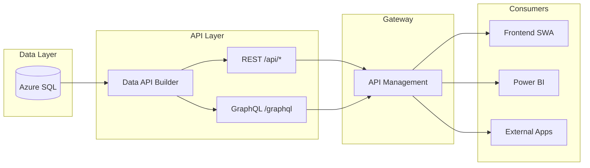
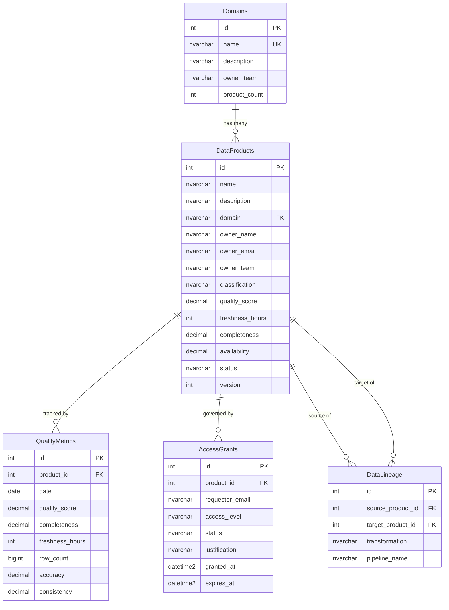

# Tutorial 11: Data API Builder for Data Mesh Sharing

> **Estimated Time:** 90 minutes | **Path:** F (Platform Operations) | **Prerequisites:** Azure subscription, SQL Server



## What You'll Build

A complete data-sharing layer using **Azure Data API Builder (DAB)** that
turns your SQL database into instant REST and GraphQL APIs — no backend code
required. By the end of this tutorial you will have:

- An **Azure SQL** database with a data-product catalog schema
- A **Data API Builder** instance exposing REST and GraphQL endpoints
- **Role-based permissions** (anonymous read, authenticated CRUD, admin full access)
- **Entity relationships** and stored-procedure endpoints
- A **Static Web App** frontend for browsing products and running GraphQL queries
- An **API Management** integration for enterprise governance

### Why Data API Builder?

In a Data Mesh architecture each domain team owns and publishes its data
products. DAB eliminates the need for each team to build custom APIs — they
define a JSON configuration and DAB generates the API automatically:

| Concern | Without DAB | With DAB |
|---------|-------------|----------|
| API creation | Weeks of FastAPI/Express code | 10-minute JSON config |
| Schema changes | Code changes + redeploy | Edit config, restart |
| Auth/permissions | Custom middleware | Declarative roles in config |
| REST + GraphQL | Pick one or build both | Both generated automatically |
| Relationships | Manual joins in code | Declared in config, resolved by DAB |

---

## Prerequisites

| Requirement | Details |
|-------------|---------|
| Azure subscription | Pay-as-you-go or Enterprise Agreement |
| Azure CLI | v2.50+ (`az --version`) |
| SQL Server | Azure SQL or SQL Server 2019+ (local dev) |
| Data API Builder CLI | `dotnet tool install -g Microsoft.DataApiBuilder` |
| VS Code | Recommended, with REST Client extension |
| Node.js | 18+ (for SWA CLI, optional) |

### Environment Setup

```bash
# Login to Azure
az login

# Set subscription
az account set --subscription "<YOUR_SUBSCRIPTION_ID>"

# Create resource group
az group create --name rg-csa-dab-dev --location usgovvirginia
```

---

## Step 1: Deploy Infrastructure

The Bicep module at `deploy/bicep/DLZ/modules/data-api-builder.bicep` provisions:

| Resource | Purpose |
|----------|---------|
| Azure SQL Server + Database | Stores data-product catalog |
| Container App (DAB) | Hosts Data API Builder |
| Static Web App | Hosts the frontend portal |
| Managed Identity | Connects DAB to SQL securely |
| Application Insights | Monitoring and diagnostics |

### Deploy

```bash
az deployment group create \
  --resource-group rg-csa-dab-dev \
  --template-file deploy/bicep/DLZ/modules/data-api-builder.bicep \
  --parameters deploy/bicep/DLZ/modules/data-api-builder.dev.bicepparam \
  --parameters sqlAdminPassword='<STRONG_PASSWORD_HERE>'
```

### Key Parameters

| Parameter | Dev | Prod | Description |
|-----------|-----|------|-------------|
| `sqlSkuName` | Basic | S2 | Database performance tier |
| `staticWebAppSku` | Free | Standard | SWA tier (Standard adds custom domains, auth) |
| `publicNetworkAccessEnabled` | true | false | SQL public access (disable in prod) |
| `enableResourceLock` | false | true | Prevent accidental deletion |
| `containerCpu` / `containerMemory` | 0.25 / 0.5Gi | 1.0 / 2Gi | DAB container sizing |

### Verify Deployment

```bash
# Get outputs
az deployment group show \
  --resource-group rg-csa-dab-dev \
  --name data-api-builder \
  --query properties.outputs

# Test SQL connectivity
sqlcmd -S <sqlServerFqdn> -d csa-dab-db-dev -U sqladmin -P '<PASSWORD>' -Q "SELECT 1"
```

---

## Step 2: Create the Database Schema

The schema lives in `examples/data-api-builder/sql/setup.sql`. It creates
five tables that model a data-product catalog:



### Run the Schema Script

```bash
sqlcmd -S <server>.database.windows.net \
  -d csa-dab-db-dev \
  -U sqladmin -P '<PASSWORD>' \
  -i examples/data-api-builder/sql/setup.sql
```

### What Gets Created

**Tables:**
- `Domains` — organizational domains (finance, operations, marketing, hr)
- `DataProducts` — the data products published by each domain
- `QualityMetrics` — daily quality measurements per product
- `AccessGrants` — access request and approval tracking
- `DataLineage` — source-to-target transformation lineage

**Stored Procedures:**
- `sp_domain_stats` — aggregate statistics per domain
- `sp_quality_trend` — quality score trend for a product over N days

**Seed Data:**
- 4 domains, 5 data products, 30 quality metric records, 3 access grants

### Verify

```bash
sqlcmd -S <server>.database.windows.net -d csa-dab-db-dev \
  -U sqladmin -P '<PASSWORD>' \
  -Q "SELECT name, domain, quality_score, status FROM dbo.DataProducts"
```

---

## Step 3: Configure Data API Builder

The configuration file `examples/data-api-builder/dab-config.json` is the
heart of DAB. It tells DAB which tables to expose, what permissions to
enforce, and how entities relate to each other.

### Configuration Structure

```
dab-config.json
├── data-source          → Database connection
├── runtime
│   ├── rest             → REST endpoint settings (/api)
│   ├── graphql          → GraphQL endpoint settings (/graphql)
│   └── host             → CORS, authentication, mode
└── entities
    ├── DataProducts     → Full CRUD, role-based
    ├── QualityMetrics   → Read-only (admin write)
    ├── AccessGrants     → Row-level security
    ├── Domains          → Read for all
    ├── DataLineage      → Read for authenticated
    ├── DomainStats      → Stored procedure
    └── QualityTrend     → Stored procedure
```

### 3.1 Data Source

```json
"data-source": {
  "database-type": "mssql",
  "connection-string": "@env('SQL_CONNECTION_STRING')",
  "options": {
    "set-session-context": true
  }
}
```

The `@env()` syntax reads the connection string from an environment variable.
`set-session-context` passes the authenticated user's claims to SQL Server
via `SESSION_CONTEXT`, enabling row-level security in the database.

### 3.2 Runtime Settings

```json
"runtime": {
  "rest": { "enabled": true, "path": "/api" },
  "graphql": { "enabled": true, "path": "/graphql", "allow-introspection": true },
  "host": {
    "cors": { "origins": ["http://localhost:4280", "https://*.azurestaticapps.net"] },
    "authentication": { "provider": "StaticWebApps" },
    "mode": "production"
  }
}
```

### 3.3 Entity Configuration — DataProducts Example

```json
"DataProducts": {
  "source": { "object": "dbo.DataProducts", "type": "table" },
  "graphql": {
    "type": { "singular": "DataProduct", "plural": "DataProducts" }
  },
  "rest": { "path": "/products" },
  "permissions": [
    {
      "role": "anonymous",
      "actions": [{
        "action": "read",
        "fields": {
          "include": ["id", "name", "description", "domain", "quality_score", "status"],
          "exclude": ["owner_email"]
        },
        "policy": { "database": "@item.status ne 'draft'" }
      }]
    },
    {
      "role": "authenticated",
      "actions": [
        { "action": "read" },
        { "action": "create", "fields": { "exclude": ["id", "created_at", "updated_at"] } },
        { "action": "update", "fields": { "exclude": ["id", "created_at"] } }
      ]
    },
    { "role": "admin", "actions": [{ "action": "*" }] }
  ],
  "relationships": {
    "qualityMetrics": {
      "cardinality": "many",
      "target.entity": "QualityMetrics",
      "source.fields": ["id"],
      "target.fields": ["product_id"]
    },
    "domain_info": {
      "cardinality": "one",
      "target.entity": "Domains",
      "source.fields": ["domain"],
      "target.fields": ["name"]
    }
  }
}
```

### 3.4 How to ADD a New Entity

To share a new table through DAB, add an entry to the `entities` section:

```json
"NewEntity": {
  "source": { "object": "dbo.YourTable", "type": "table" },
  "graphql": { "enabled": true, "type": { "singular": "NewEntity", "plural": "NewEntities" } },
  "rest": { "enabled": true, "path": "/new-entities" },
  "permissions": [
    { "role": "anonymous", "actions": [{ "action": "read" }] }
  ]
}
```

Then restart DAB — no code changes needed.

### 3.5 How to REMOVE an Entity

Delete the entity block from `dab-config.json` and restart. The table
remains in the database; only the API endpoint is removed.

### 3.6 How to Change PERMISSIONS

Permissions are per-role, per-action. Common patterns:

```json
// Read-only for everyone
{ "role": "anonymous", "actions": [{ "action": "read" }] }

// Read-write for authenticated users
{ "role": "authenticated", "actions": [
  { "action": "read" },
  { "action": "create" },
  { "action": "update" }
]}

// Full access for admin
{ "role": "admin", "actions": [{ "action": "*" }] }

// Row-level security — users see only their own rows
{ "role": "authenticated", "actions": [{
  "action": "read",
  "policy": { "database": "@claims.email eq @item.owner_email" }
}]}

// Field restrictions — hide sensitive columns
{ "role": "anonymous", "actions": [{
  "action": "read",
  "fields": { "exclude": ["owner_email", "classification"] }
}]}
```

### 3.7 How to Add RELATIONSHIPS

Relationships enable nested queries in GraphQL. Add them to the source
entity's `relationships` block:

```json
// One-to-many: Product has many QualityMetrics
"qualityMetrics": {
  "cardinality": "many",
  "target.entity": "QualityMetrics",
  "source.fields": ["id"],
  "target.fields": ["product_id"]
}

// Many-to-one: Product belongs to a Domain
"domain_info": {
  "cardinality": "one",
  "target.entity": "Domains",
  "source.fields": ["domain"],
  "target.fields": ["name"]
}
```

### Run DAB Locally

```bash
export SQL_CONNECTION_STRING="Server=tcp:<server>.database.windows.net,1433;Database=csa-dab-db-dev;User ID=sqladmin;Password=<PWD>;Encrypt=true;TrustServerCertificate=false;"

dab start --config examples/data-api-builder/dab-config.json
```

DAB starts on `http://localhost:5000`. You should see:

```
info: Azure.DataApiBuilder[0]
      REST path: /api
      GraphQL path: /graphql
      Listening on: http://localhost:5000
```

---

## Step 4: REST API Examples

DAB automatically generates REST endpoints for every entity. The base path
is `/api` followed by the entity's `rest.path`.

### GET — All Products

```bash
curl http://localhost:5000/api/products | jq
```

Response:

```json
{
  "value": [
    {
      "id": 1,
      "name": "Revenue Summary",
      "domain": "finance",
      "quality_score": 92.5,
      "status": "active"
    }
  ]
}
```

### GET — Single Product by ID

```bash
curl http://localhost:5000/api/products/id/1 | jq
```

### GET — Filter by Domain

```bash
curl "http://localhost:5000/api/products?\$filter=domain eq 'finance'" | jq
```

### GET — Sort by Quality Score

```bash
curl "http://localhost:5000/api/products?\$orderby=quality_score desc" | jq
```

### GET — Pagination

```bash
# First page (10 items)
curl "http://localhost:5000/api/products?\$first=10" | jq

# Next page using cursor
curl "http://localhost:5000/api/products?\$first=10&\$after=<nextLink_cursor>" | jq
```

### GET — Combined Filters

```bash
curl "http://localhost:5000/api/products?\$filter=domain eq 'finance' and status eq 'active'&\$orderby=quality_score desc&\$first=5" | jq
```

### POST — Create a Product

```bash
curl -X POST http://localhost:5000/api/products \
  -H "Content-Type: application/json" \
  -H "X-MS-API-ROLE: authenticated" \
  -d '{
    "name": "Customer Segments",
    "description": "Customer segmentation by purchase behavior",
    "domain": "marketing",
    "owner_name": "Dan Wilson",
    "owner_email": "dan@contoso.com",
    "owner_team": "Marketing Insights",
    "classification": "internal",
    "quality_score": 82.5,
    "freshness_hours": 24,
    "completeness": 90.0,
    "status": "draft",
    "version": 1
  }'
```

### PUT — Update a Product

```bash
curl -X PUT http://localhost:5000/api/products/id/1 \
  -H "Content-Type: application/json" \
  -H "X-MS-API-ROLE: authenticated" \
  -d '{
    "quality_score": 93.0,
    "version": 3
  }'
```

### DELETE — Remove a Product

```bash
curl -X DELETE http://localhost:5000/api/products/id/99 \
  -H "X-MS-API-ROLE: admin"
```

### Stored Procedure — Domain Stats

```bash
curl http://localhost:5000/api/domain-stats | jq
```

### Stored Procedure — Quality Trend

```bash
curl "http://localhost:5000/api/quality-trend?product_id=1&days=30" | jq
```

> **Tip:** Open `examples/data-api-builder/api-examples/rest-examples.http`
> in VS Code with the REST Client extension to run all these interactively.

---

## Step 5: GraphQL API Examples

DAB exposes a GraphQL endpoint at `/graphql` with full introspection support.

### Query — All Products (Paginated)

```graphql
{
  dataProducts(first: 10) {
    items {
      id
      name
      domain
      quality_score
      status
    }
    hasNextPage
    endCursor
  }
}
```

```bash
curl -X POST http://localhost:5000/graphql \
  -H "Content-Type: application/json" \
  -d '{"query":"{ dataProducts(first: 10) { items { id name domain quality_score status } hasNextPage endCursor } }"}'
```

### Query — Product with Nested Quality Metrics

```graphql
{
  dataProduct_by_pk(id: 1) {
    name
    domain
    quality_score
    qualityMetrics {
      items {
        date
        quality_score
        completeness
        accuracy
      }
    }
    domain_info {
      name
      owner_team
      product_count
    }
  }
}
```

This demonstrates the power of DAB relationships — a single query fetches
the product, its quality history, and its domain details without any custom
resolver code.

### Query — Filter by Domain

```graphql
{
  dataProducts(filter: { domain: { eq: "finance" }, status: { eq: "active" } }) {
    items {
      id
      name
      quality_score
      owner_team
    }
  }
}
```

### Mutation — Create a Product

```graphql
mutation {
  createDataProduct(item: {
    name: "Customer Lifetime Value"
    description: "Predicted CLV by customer segment"
    domain: "marketing"
    owner_name: "Dan Wilson"
    owner_email: "dan@contoso.com"
    owner_team: "Marketing Insights"
    classification: "confidential"
    quality_score: 85.0
    freshness_hours: 48
    completeness: 92.0
    status: "draft"
    version: 1
  }) {
    id
    name
    status
  }
}
```

### Mutation — Update a Product

```graphql
mutation {
  updateDataProduct(id: 1, item: {
    quality_score: 94.2
    version: 3
  }) {
    id
    name
    quality_score
    version
  }
}
```

### Subscriptions

DAB does not natively support GraphQL subscriptions. For real-time updates,
consider:

- Polling the GraphQL endpoint on an interval
- Using Azure SignalR Service alongside DAB
- Azure SQL change tracking with Azure Functions pushing events

> **Reference:** See `examples/data-api-builder/api-examples/graphql-examples.graphql`
> for the complete query collection.

---

## Step 6: Build the Frontend

The frontend is a static site in `examples/data-api-builder/frontend/` that
connects directly to DAB's REST and GraphQL endpoints.

### Architecture

```
frontend/
├── index.html               ← Dashboard with stats cards
├── products.html             ← Searchable product catalog
├── explorer.html             ← GraphQL query editor
├── styles.css                ← Dark theme (slate-900 + cyan/emerald)
├── app.js                    ← API client + DOM rendering
└── staticwebapp.config.json  ← SWA routing + auth config
```

### 6.1 Dashboard (`index.html`)

The dashboard loads on page init and calls `api.fetchStats()` which makes
parallel requests to `/api/products` and `/api/domains`, then computes:

- **Total Products** — count of all products
- **Avg Quality Score** — mean `quality_score` across products
- **Active Domains** — domains with `product_count > 0`
- **Pending Requests** — (placeholder for access-grant integration)

### 6.2 Product Catalog (`products.html`)

Features:
- **Search** — filters by product name using `contains(name, 'term')`
- **Domain Filter** — dropdown populated from `/api/domains`
- **Sortable** — products ordered by `quality_score desc`
- **Detail Panel** — click a row to see full details + quality history

The search and filter controls use a 300ms debounce to avoid excessive API
calls.

### 6.3 GraphQL Explorer (`explorer.html`)

A simple in-browser GraphQL editor with:
- **Query textarea** with monospace font
- **Example query dropdown** — pre-loaded queries for common operations
- **Execute button** — sends POST to `/graphql` and renders JSON result
- **Type reference** — shows available types and their fields

### 6.4 API Client (`app.js`)

The `DabApiClient` class encapsulates all API interactions:

```javascript
const api = new DabApiClient('/data-api');

// REST calls
const products = await api.fetchProducts({ domain: 'finance', orderBy: 'quality_score desc' });
const product  = await api.fetchProduct(1);
const domains  = await api.fetchDomains();
const stats    = await api.fetchDomainStats();
const trend    = await api.fetchQualityTrend(1, 30);

// GraphQL
const result = await api.executeGraphQL('{ dataProducts { items { id name } } }');
```

### Run Locally

```bash
# Install SWA CLI
npm install -g @azure/static-web-apps-cli

# Start DAB in one terminal
dab start --config examples/data-api-builder/dab-config.json

# Start SWA in another terminal (proxies /data-api to DAB)
swa start examples/data-api-builder/frontend \
  --data-api-location http://localhost:5000
```

Open `http://localhost:4280` in your browser.

### Deploy to Azure Static Web Apps

```bash
swa deploy examples/data-api-builder/frontend \
  --deployment-token <SWA_DEPLOYMENT_TOKEN> \
  --env production
```

---

## Step 7: Integrate with API Management

For enterprise governance, import DAB's APIs into Azure API Management.

### 7.1 Import REST API

```bash
# Get DAB endpoint from deployment outputs
DAB_URL=$(az deployment group show \
  --resource-group rg-csa-dab-dev \
  --name data-api-builder \
  --query properties.outputs.dabEndpoint.value -o tsv)

# Import into APIM
az apim api import \
  --resource-group rg-csa-dab-dev \
  --service-name csa-dab-apim-dev \
  --path "data-products" \
  --api-id "data-products-api" \
  --display-name "Data Products API" \
  --service-url "$DAB_URL/api" \
  --protocols https \
  --specification-format OpenAPI \
  --specification-url "$DAB_URL/api/openapi"
```

### 7.2 Add Subscription Key Requirement

```bash
az apim api update \
  --resource-group rg-csa-dab-dev \
  --service-name csa-dab-apim-dev \
  --api-id data-products-api \
  --subscription-required true
```

### 7.3 Add Rate Limiting Policy

```xml
<policies>
  <inbound>
    <base />
    <rate-limit calls="100" renewal-period="60" />
    <validate-jwt header-name="Authorization"
                  failed-validation-httpcode="401"
                  failed-validation-error-message="Unauthorized">
      <openid-config url="https://login.microsoftonline.com/{tenant}/v2.0/.well-known/openid-configuration" />
      <required-claims>
        <claim name="aud"><value>{client_id}</value></claim>
      </required-claims>
    </validate-jwt>
  </inbound>
</policies>
```

### 7.4 Test Through APIM

```bash
APIM_URL="https://csa-dab-apim-dev.azure-api.net/data-products"
APIM_KEY="<YOUR_SUBSCRIPTION_KEY>"

curl -H "Ocp-Apim-Subscription-Key: $APIM_KEY" "$APIM_URL/products" | jq
```

---

## Step 8: Data Mesh Patterns

DAB is a natural fit for Data Mesh because it lets each domain team
independently publish data products as APIs without writing backend code.

### 8.1 Domain Ownership

Each domain team manages its own `dab-config.json`:

```
finance-team/
└── dab-config.json     ← Revenue, Budget, Forecast entities

operations-team/
└── dab-config.json     ← Shipments, Inventory, Logistics entities

marketing-team/
└── dab-config.json     ← Campaigns, Segments, Engagement entities
```

Teams add or remove entities by editing their config — no dependency on a
central platform team.

### 8.2 Self-Serve Infrastructure

The Bicep module enables self-service provisioning:

```bash
# Each domain team deploys their own DAB instance
az deployment group create \
  --resource-group rg-finance-data \
  --template-file deploy/bicep/DLZ/modules/data-api-builder.bicep \
  --parameters namePrefix='finance-dab' environment='dev' \
  --parameters sqlAdminPassword='<PWD>'
```

### 8.3 Federated Governance

API Management enforces cross-domain policies centrally:

| Policy | Purpose |
|--------|---------|
| Subscription keys | Track API consumers |
| Rate limiting | Prevent abuse |
| JWT validation | Authenticate consumers |
| IP filtering | Restrict access (Azure Gov) |
| Request/response logging | Audit trail |
| CORS | Control browser access |

Domain teams own their DAB configs (data products); the platform team owns
APIM policies (governance).

### 8.4 Data Product as API

Each shared dataset becomes a discoverable API endpoint:

```
https://apim.contoso.com/finance/products          ← Revenue data
https://apim.contoso.com/operations/products        ← Shipment data
https://apim.contoso.com/marketing/products         ← Campaign data
```

Consumers discover products through the APIM developer portal, request
access, and start consuming immediately through REST or GraphQL.

### 8.5 Quality Observability

The `QualityMetrics` table and `sp_quality_trend` stored procedure provide
built-in quality observability:

```bash
# Quality dashboard for any product
curl "https://apim.contoso.com/data-products/quality-trend?product_id=1&days=90"

# Domain-level quality summary
curl "https://apim.contoso.com/data-products/domain-stats"
```

---

## Troubleshooting

### DAB won't start

| Symptom | Cause | Fix |
|---------|-------|-----|
| `Connection refused` | SQL Server not reachable | Check firewall rules, verify connection string |
| `Login failed` | Wrong credentials | Verify `SQL_CONNECTION_STRING` env var |
| `Entity not found` | Table doesn't exist | Run `setup.sql` first |
| `CORS error` in browser | Origin not in allow list | Add your origin to `runtime.host.cors.origins` |
| `401 Unauthorized` | Role not set | Add `X-MS-API-ROLE` header for local testing |

### Common REST errors

| HTTP Code | Meaning | Action |
|-----------|---------|--------|
| 400 | Bad filter syntax | Check `$filter` OData syntax |
| 403 | Insufficient permissions | Verify role has the required action |
| 404 | Entity or item not found | Check entity path and ID |
| 409 | Conflict (duplicate) | Item with same key already exists |

### GraphQL issues

- **Introspection disabled:** Set `allow-introspection: true` in config
- **Relationship returns null:** Verify `source.fields` and `target.fields` match FK columns
- **Permission denied:** Add the role to the target entity's permissions too

### Azure deployment issues

```bash
# Check Container App logs
az containerapp logs show \
  --name csa-dab-app-dev \
  --resource-group rg-csa-dab-dev \
  --follow

# Check SQL connectivity from Container App
az containerapp exec \
  --name csa-dab-app-dev \
  --resource-group rg-csa-dab-dev \
  --command "curl -v telnet://<sql-server>:1433"
```

---

## Next Steps

1. **Add your own entities** — Follow Step 3.4 to expose your domain's tables
2. **Enable Azure AD authentication** — Replace `StaticWebApps` provider with `AzureAD` in `dab-config.json`
3. **Set up CI/CD** — Add GitHub Actions to deploy config changes automatically
4. **Connect Power BI** — Use the REST endpoint as a Power BI data source
5. **Add data lineage** — Populate the `DataLineage` table to track transformations
6. **Scale for production** — Deploy with `data-api-builder.prod.bicepparam` for HA and security
7. **Explore Tutorial 10** — See how DAB integrates with the broader [Data Marketplace](../10-data-marketplace/README.md)

---

## Reference

| Resource | Link |
|----------|------|
| Azure Data API Builder Docs | https://learn.microsoft.com/azure/data-api-builder/ |
| DAB GitHub | https://github.com/Azure/data-api-builder |
| DAB Configuration Reference | https://learn.microsoft.com/azure/data-api-builder/configuration-file |
| OData Filter Syntax | https://learn.microsoft.com/azure/data-api-builder/rest#filter |
| Example Code | [`examples/data-api-builder/`](../../../examples/data-api-builder/) |
| Bicep Module | [`deploy/bicep/DLZ/modules/data-api-builder.bicep`](../../../deploy/bicep/DLZ/modules/data-api-builder.bicep) |
