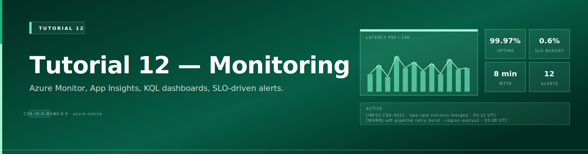
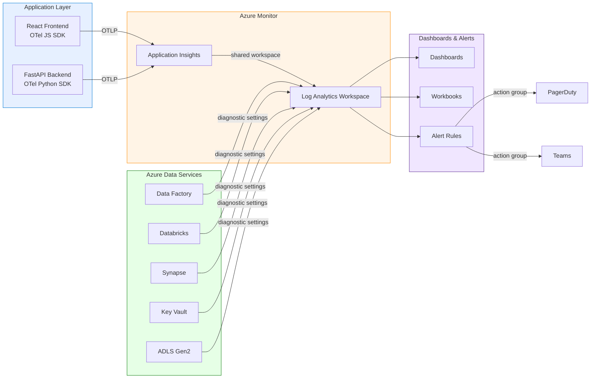

# Tutorial 12: Monitoring & Observability

{ .architecture-hero loading="eager" }


> **Estimated Time:** 2-3 hours
> **Difficulty:** Intermediate-Advanced

Add end-to-end monitoring and observability to your CSA-in-a-Box data platform. By the end you will have diagnostic settings streaming telemetry from every core service, Application Insights collecting distributed traces, Azure Monitor dashboards surfacing key metrics, alert rules firing on pipeline failures, and dbt artifacts flowing into Log Analytics.

---

## Prerequisites

- [ ] **Tutorial 01 completed** — Foundation Platform (ALZ, DMLZ, DLZ) deployed
- [ ] **Azure CLI** 2.50+ with Bicep CLI 0.22+
- [ ] **Contributor role** on the DLZ and ALZ resource groups
- [ ] **Python 3.11+** with a virtual environment activated
- [ ] **Node.js 18+** and npm (for frontend instrumentation)
- [ ] **dbt-core** with **dbt-databricks** adapter installed
- [ ] (Optional) **PagerDuty** or **Microsoft Teams** webhook URL for notifications

---

## Architecture Diagram



---

## Step 1: Enable Diagnostic Settings

Stream logs and metrics from every core service to the central Log Analytics workspace.

```bash
LAW_ID=$(az monitor log-analytics workspace list \
  --resource-group "$CSA_RG_ALZ" --query "[0].id" -o tsv)

# Enable on Data Factory (repeat pattern for each resource)
ADF_ID=$(az datafactory show --name "csa-adf-dev" \
  --resource-group "$CSA_RG_DLZ" --query "id" -o tsv)

az monitor diagnostic-settings create \
  --name "diag-adf" \
  --resource "$ADF_ID" \
  --workspace "$LAW_ID" \
  --logs '[{"categoryGroup":"allLogs","enabled":true}]' \
  --metrics '[{"category":"AllMetrics","enabled":true}]'
```

Repeat for Databricks, Synapse, Key Vault, and Storage. For a Bicep-based approach, create `deploy/bicep/DLZ/modules/diagnostic-settings.bicep` with a resource block per service using the `Microsoft.Insights/diagnosticSettings@2021-05-01-preview` API:

```bicep
param logAnalyticsWorkspaceId string
param dataFactoryId string

resource adfDiag 'Microsoft.Insights/diagnosticSettings@2021-05-01-preview' = {
  name: 'diag-datafactory'
  scope: resourceId('Microsoft.DataFactory/factories', last(split(dataFactoryId, '/')))
  properties: {
    workspaceId: logAnalyticsWorkspaceId
    logs: [ { categoryGroup: 'allLogs', enabled: true } ]
    metrics: [ { category: 'AllMetrics', enabled: true } ]
  }
}
// Duplicate this pattern for Databricks, Synapse, Key Vault, Storage
```

<details>
<summary><strong>Expected Output</strong></summary>

```json
{
    "name": "diag-adf",
    "properties": {
        "logs": [{ "categoryGroup": "allLogs", "enabled": true }],
        "workspaceId": "/subscriptions/.../workspaces/csa-law-dev"
    }
}
```

</details>

!!! tip
Diagnostic data begins streaming within 5-10 minutes. If nothing appears after 15 minutes, verify the workspace ID and check that the resource identity has **Log Analytics Contributor**.

---

## Step 2: Deploy Application Insights

Create an Application Insights resource connected to the existing Log Analytics workspace.

```bash
az deployment group create \
  --resource-group "$CSA_RG_DLZ" \
  --template-file deploy/bicep/DLZ/modules/app-insights.bicep \
  --parameters prefix="$CSA_PREFIX" environment="$CSA_ENV" \
               logAnalyticsWorkspaceId="$LAW_ID" \
  --name "appi-deploy-$(date +%Y%m%d%H%M)"
```

The Bicep module (`deploy/bicep/DLZ/modules/app-insights.bicep`):

```bicep
param location string = resourceGroup().location
param prefix string
param environment string
param logAnalyticsWorkspaceId string

resource appInsights 'Microsoft.Insights/components@2020-02-02' = {
  name: '${prefix}-appi-${environment}'
  location: location
  kind: 'web'
  properties: {
    Application_Type: 'web'
    WorkspaceResourceId: logAnalyticsWorkspaceId
    IngestionMode: 'LogAnalytics'
  }
}
output connectionString string = appInsights.properties.ConnectionString
```

Store the connection string for later steps:

```bash
export APPLICATIONINSIGHTS_CONNECTION_STRING=$(az monitor app-insights component show \
  --resource-group "$CSA_RG_DLZ" --query "[0].connectionString" -o tsv)
```

---

## Step 3: Instrument the Portal Application

### 3a. FastAPI Backend

```bash
pip install azure-monitor-opentelemetry opentelemetry-instrumentation-fastapi
```

```python
# app/main.py — add near the top, before routes
import os, logging
from azure.monitor.opentelemetry import configure_azure_monitor
from opentelemetry.instrumentation.fastapi import FastAPIInstrumentor

configure_azure_monitor(
    connection_string=os.environ["APPLICATIONINSIGHTS_CONNECTION_STRING"],
    logger_name="csa.portal",
)
logger = logging.getLogger("csa.portal")

# After creating FastAPI app:
FastAPIInstrumentor.instrument_app(app)
```

### 3b. React Frontend

```bash
npm install @opentelemetry/api @opentelemetry/sdk-trace-web \
  @opentelemetry/instrumentation-fetch @opentelemetry/exporter-trace-otlp-http \
  @opentelemetry/context-zone
```

```typescript
// src/telemetry.ts
import { WebTracerProvider } from "@opentelemetry/sdk-trace-web";
import { OTLPTraceExporter } from "@opentelemetry/exporter-trace-otlp-http";
import { BatchSpanProcessor } from "@opentelemetry/sdk-trace-base";
import { FetchInstrumentation } from "@opentelemetry/instrumentation-fetch";
import { ZoneContextManager } from "@opentelemetry/context-zone";
import { registerInstrumentations } from "@opentelemetry/instrumentation";
import { Resource } from "@opentelemetry/resources";

export function initTelemetry() {
    const provider = new WebTracerProvider({
        resource: new Resource({ "service.name": "csa-portal-frontend" }),
    });
    provider.addSpanProcessor(
        new BatchSpanProcessor(
            new OTLPTraceExporter({ url: "/api/v1/otlp/traces" }),
        ),
    );
    provider.register({ contextManager: new ZoneContextManager() });
    registerInstrumentations({
        instrumentations: [
            new FetchInstrumentation({
                propagateTraceHeaderCorsUrls: [/\/api\//],
            }),
        ],
    });
}
```

Call `initTelemetry()` in `src/main.tsx` before rendering. Traces appear in Application Insights **Transaction search** within 2-3 minutes.

---

## Step 4: Configure Azure Monitor Dashboards

Create a shared dashboard with KQL-powered tiles. Open **Azure Portal** > **Dashboard** > **New dashboard**, name it `CSA Data Platform Health`, and add **Logs (Analytics)** tiles with these queries:

**Pipeline Duration (last 24 h):**

```kql
ADFPipelineRun
| where TimeGenerated > ago(24h)
| summarize AvgDuration = avg(datetime_diff('second', End, Start)),
            MaxDuration = max(datetime_diff('second', End, Start))
  by PipelineName
| sort by AvgDuration desc
```

**Error Rate by Service:**

```kql
AppExceptions
| where TimeGenerated > ago(24h)
| summarize ErrorCount = count() by AppRoleName, bin(TimeGenerated, 1h)
| render timechart
```

**Data Freshness (latest write per container):**

```kql
StorageBlobLogs
| where OperationName in ("PutBlob", "PutBlockList")
| where TimeGenerated > ago(7d)
| extend Container = tostring(split(Uri, "/")[3])
| summarize LastWrite = max(TimeGenerated) by Container
| extend HoursSinceWrite = datetime_diff('hour', now(), LastWrite)
```

---

## Step 5: Build a Data Pipeline Health Workbook

Open **Monitor** > **Workbooks** > **New**. Add a **Time range picker** parameter (`TimeRange`), then add query steps for each metric below. Save the workbook as `CSA Pipeline Health` in the ALZ resource group.

**Pipeline Success Rate:**

```kql
ADFPipelineRun
| where TimeGenerated > {TimeRange:start} and TimeGenerated < {TimeRange:end}
| summarize Total = count(), Succeeded = countif(Status == "Succeeded"),
            Failed = countif(Status == "Failed") by PipelineName
| extend SuccessRate = round(100.0 * Succeeded / Total, 1)
| sort by SuccessRate asc
```

**Data Volume by Layer** (render as timechart):

```kql
StorageBlobLogs
| where TimeGenerated > {TimeRange:start} and OperationName in ("PutBlob", "PutBlockList")
| extend Container = tostring(split(Uri, "/")[3])
| where Container in ("bronze", "silver", "gold")
| summarize TotalBytes = sum(RequestBodySize) by Container, bin(TimeGenerated, 1h)
| render timechart
```

**Pipeline Latency Percentiles:**

```kql
ADFPipelineRun | where Status == "Succeeded"
| extend DurationMin = datetime_diff('minute', End, Start)
| summarize P50 = percentile(DurationMin, 50), P95 = percentile(DurationMin, 95) by PipelineName
```

Pin workbook sections to the dashboard from Step 4 for a unified view.

---

## Step 6: Set Up Alert Rules

### 6a. Create an Action Group

```bash
az monitor action-group create \
  --resource-group "$CSA_RG_ALZ" \
  --name "csa-ops-actiongroup" --short-name "csa-ops" \
  --action email ops-team ops-team@contoso.com \
  --action webhook teams-webhook "https://outlook.office.com/webhook/YOUR_URL"
```

### 6b. Pipeline Failure Alert

```bash
ACTION_GROUP_ID=$(az monitor action-group show \
  --resource-group "$CSA_RG_ALZ" --name "csa-ops-actiongroup" --query "id" -o tsv)

az monitor scheduled-query create \
  --resource-group "$CSA_RG_ALZ" \
  --name "alert-pipeline-failure" \
  --scopes "$LAW_ID" \
  --condition "count > 0" \
  --condition-query "ADFPipelineRun | where Status == 'Failed' | where TimeGenerated > ago(15m)" \
  --evaluation-frequency "5m" --window-size "15m" --severity 1 \
  --action-groups "$ACTION_GROUP_ID"
```

### 6c. Additional Alerts

Apply the same pattern for these scenarios:

| Alert Name               | KQL Condition                                                              | Severity |
| ------------------------ | -------------------------------------------------------------------------- | -------- |
| Databricks Cluster Error | `DatabricksClusters \| where ActionName contains 'error'`                  | 2        |
| Synapse Query Timeout    | `SynapseBuiltinSqlPoolRequestsEnded \| where ErrorCode contains 'Timeout'` | 2        |
| Storage Quota (metric)   | `avg UsedCapacity > 4 TB` (use `az monitor metrics alert create`)          | 3        |

<details>
<summary><strong>Expected Output</strong></summary>

```json
{
    "name": "alert-pipeline-failure",
    "properties": {
        "enabled": true,
        "severity": 1,
        "evaluationFrequency": "PT5M"
    }
}
```

</details>

!!! warning
Adjust thresholds for your environment. Test every alert rule in Step 9 before relying on it.

---

## Step 7: dbt Observability

Push dbt run artifacts into Log Analytics for model-level visibility.

### 7a. Upload Script

Create `scripts/monitoring/upload_dbt_artifacts.py`. The script reads `target/run_results.json`, extracts model name, status, and execution time for each result, then posts the records to Log Analytics using the HTTP Data Collector API with HMAC-SHA256 authentication. Set `LOG_ANALYTICS_WORKSPACE_ID` and `LOG_ANALYTICS_SHARED_KEY` as environment variables. The custom log type is `DbtRunResults` (accessible as `DbtRunResults_CL` in KQL).

```python
# scripts/monitoring/upload_dbt_artifacts.py  (key excerpt)
import json, os, datetime, requests, hashlib, hmac, base64

WS_ID  = os.environ["LOG_ANALYTICS_WORKSPACE_ID"]
WS_KEY = os.environ["LOG_ANALYTICS_SHARED_KEY"]

with open(os.environ.get("DBT_RUN_RESULTS_PATH", "target/run_results.json")) as f:
    data = json.load(f)

records = [
    {"model_name": r["unique_id"], "status": r["status"],
     "execution_time_s": r["execution_time"],
     "rows_affected": r.get("adapter_response",{}).get("rows_affected",0)}
    for r in data["results"]
]

# Build HMAC signature, POST to
# https://{WS_ID}.ods.opinsights.azure.com/api/logs?api-version=2016-04-01
# with headers: Log-Type=DbtRunResults, Authorization=SharedKey ...
body = json.dumps(records)
# (full signing logic omitted for brevity — see Azure docs for HTTP Data Collector API)
```

### 7b. Run After dbt

```bash
dbt run && dbt test
export LOG_ANALYTICS_WORKSPACE_ID=$(az monitor log-analytics workspace list \
  --resource-group "$CSA_RG_ALZ" --query "[0].customerId" -o tsv)
export LOG_ANALYTICS_SHARED_KEY=$(az monitor log-analytics workspace get-shared-keys \
  --resource-group "$CSA_RG_ALZ" --workspace-name "$(az monitor log-analytics workspace list \
  --resource-group "$CSA_RG_ALZ" --query "[0].name" -o tsv)" --query "primarySharedKey" -o tsv)
python scripts/monitoring/upload_dbt_artifacts.py
```

### 7c. Query Model Performance

```kql
DbtRunResults_CL
| where TimeGenerated > ago(7d)
| summarize AvgDuration = avg(execution_time_s_d), MaxDuration = max(execution_time_s_d),
            RunCount = count() by model_name_s
| sort by AvgDuration desc
```

---

## Step 8: End-to-End Correlation

Propagate correlation IDs across ADF, Databricks, and dbt for distributed tracing.

**ADF:** Pass `@pipeline().RunId` as a base parameter to the Databricks notebook activity. **Databricks:** Read the correlation ID with `dbutils.widgets.get("correlation_id")` and forward it to dbt via `--vars`:

```python
# /Shared/dbt-runner notebook on Databricks
correlation_id = dbutils.widgets.get("correlation_id")
import subprocess, os
os.environ["CSA_CORRELATION_ID"] = correlation_id
result = subprocess.run(
    ["dbt", "run", "--vars", f'{{"correlation_id": "{correlation_id}"}}'],
    capture_output=True, text=True, cwd="/Workspace/Repos/usda/dbt"
)
if result.returncode != 0:
    raise Exception(f"dbt failed: {result.stderr}")
```

**KQL join** across all three systems by correlation ID:

```kql
let cid = "YOUR_ADF_RUN_ID";
ADFPipelineRun | where RunId == cid
| join kind=inner (DatabricksNotebook | where Properties contains cid) on TimeGenerated
| join kind=leftouter (DbtRunResults_CL | summarize Models=count(), TotalDur=sum(execution_time_s_d)) on TimeGenerated
```

---

## Step 9: Validate the Setup

Trigger a deliberate failure to confirm alerts fire and dashboards update.

```bash
# Introduce a bad model, run dbt, then restore
cd examples/usda/domains/dbt
cp models/gold/fct_crop_production.sql models/gold/fct_crop_production.sql.bak
echo "SELECT * FROM nonexistent_table_xyz;" > models/gold/fct_crop_production.sql
dbt run --select fct_crop_production || echo "Expected failure"
mv models/gold/fct_crop_production.sql.bak models/gold/fct_crop_production.sql
cd ../../../..
```

Within 5-15 minutes, verify:

1. **Alert fires** — `az monitor alert list --resource-group "$CSA_RG_ALZ" --output table`
2. **Dashboard updates** — error count tile in the Azure Portal reflects the failure
3. **Workbook** — success rate table shows the failed pipeline

---

## Step 10: Clean Up (Optional)

```bash
for RULE in alert-pipeline-failure alert-dbx-cluster-failure alert-query-timeout; do
  az monitor scheduled-query delete --resource-group "$CSA_RG_ALZ" --name "$RULE" --yes 2>/dev/null
done
az monitor metrics alert delete --resource-group "$CSA_RG_ALZ" --name "alert-storage-capacity" --yes 2>/dev/null
az monitor action-group delete --resource-group "$CSA_RG_ALZ" --name "csa-ops-actiongroup" --yes 2>/dev/null
az monitor app-insights component delete --resource-group "$CSA_RG_DLZ" --app "csa-appi-dev" --yes 2>/dev/null
```

!!! warning
Deleting Application Insights removes all historical trace and log data. Export workbook templates before cleanup.

---

## KQL Query Reference

| Scenario                       | Query                                                                                                                                                                                                            |
| ------------------------------ | ---------------------------------------------------------------------------------------------------------------------------------------------------------------------------------------------------------------- |
| Slow ADF activities (> 10 min) | `ADFActivityRun \| extend DurMin=datetime_diff('minute',End,Start) \| where DurMin > 10`                                                                                                                         |
| Key Vault access audit         | `AzureDiagnostics \| where ResourceProvider == "MICROSOFT.KEYVAULT" \| project TimeGenerated, OperationName, CallerIPAddress`                                                                                    |
| Storage ops per container      | `StorageBlobLogs \| extend Container=tostring(split(Uri,"/")[3]) \| summarize Reads=countif(OperationName startswith "Get"), Writes=countif(OperationName startswith "Put") by Container, bin(TimeGenerated,1d)` |
| Top 10 slowest API endpoints   | `AppRequests \| where Success==true \| summarize P95=percentile(DurationMs,95), Count=count() by Name \| top 10 by P95 desc`                                                                                     |
| Application error trends       | `AppExceptions \| summarize Errors=count() by ExceptionType=type, bin(TimeGenerated,1h) \| render timechart`                                                                                                     |
| dbt model regressions          | `DbtRunResults_CL \| summarize avg(execution_time_s_d) by model_name_s, bin(TimeGenerated,1d) \| render timechart`                                                                                               |

---

## Troubleshooting

| Symptom                                      | Cause                                          | Fix                                                                                                     |
| -------------------------------------------- | ---------------------------------------------- | ------------------------------------------------------------------------------------------------------- |
| No data in Log Analytics after 15 min        | Wrong workspace ID or missing role             | Verify with `az monitor diagnostic-settings list --resource <ID>`; assign **Log Analytics Contributor** |
| Application Insights shows no traces         | Connection string not set or app not restarted | Check `APPLICATIONINSIGHTS_CONNECTION_STRING` env var; restart the app                                  |
| Alert never fires on test failure            | KQL query returns no rows                      | Run the query manually in Log Analytics; adjust the time window or condition                            |
| `DbtRunResults_CL` table missing             | Custom log table creation takes 15-30 min      | Wait after first ingestion; verify the HTTP Data Collector API returned 200                             |
| Dashboard tiles show "No data"               | Time range too narrow                          | Expand the range; trigger activity and wait 5 minutes                                                   |
| `AuthorizationFailed` on diagnostic settings | Insufficient permissions                       | Assign **Monitoring Contributor** at the resource group scope                                           |
| Teams notifications not arriving             | Webhook URL expired                            | Regenerate the Incoming Webhook in Teams; update the action group                                       |

---

## Related

- [Monitoring & Observability Best Practices](../../best-practices/monitoring-observability.md)
- [Observability with OpenTelemetry Pattern](../../patterns/observability-otel.md)
- [Performance Testing Guide](../../guides/performance-testing.md)
- [OSS Monitoring Guide](../../guides/oss-monitoring.md)
- [Performance Tuning Best Practices](../../best-practices/performance-tuning.md)
- [Tutorial 01: Foundation Platform](../01-foundation-platform/README.md) — prerequisite infrastructure
- [Tutorial Index](../README.md)
