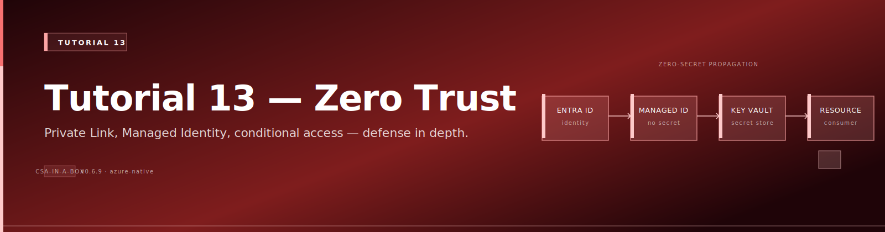
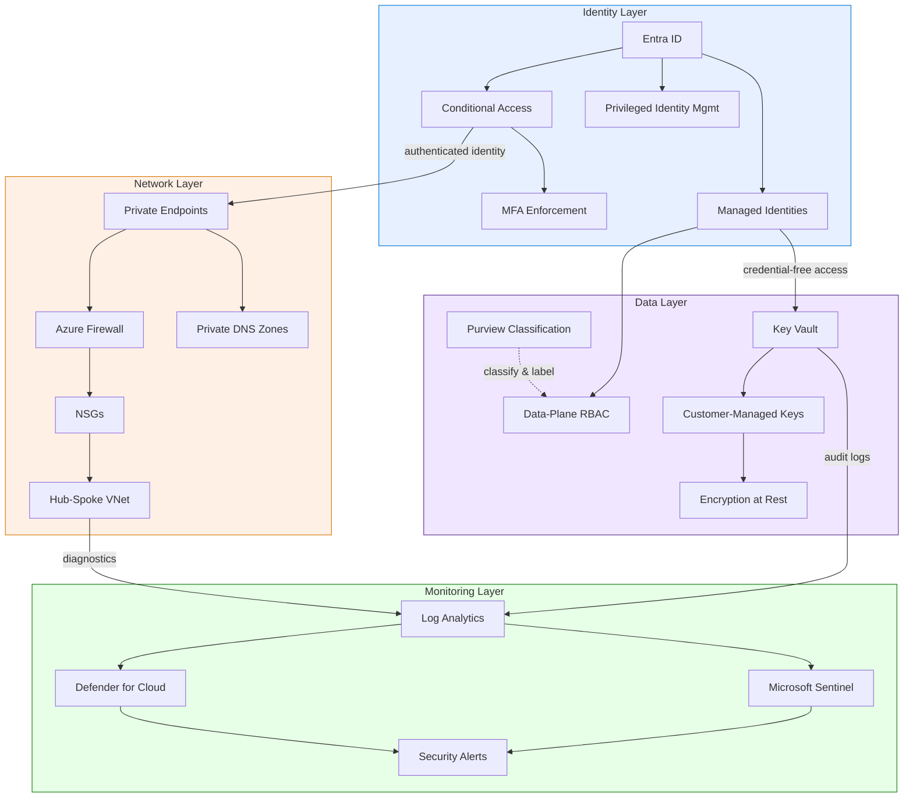

# Tutorial 13: Security — Zero Trust Configuration

{ .architecture-hero loading="eager" }


> **Estimated Time:** 4-6 hours
> **Difficulty:** Advanced

Harden your CSA-in-a-Box data platform with a Zero Trust posture covering identity, network isolation, encryption, threat detection, and data classification. By the end, every data-plane operation flows through verified identity, encrypted channels, and auditable controls aligned to NIST 800-53.

---

## Prerequisites

- [ ] **[Tutorial 01: Foundation Platform](../01-foundation-platform/README.md)** deployed and passing validation
- [ ] **[Tutorial 02: Data Governance](../02-data-governance/README.md)** with Purview configured
- [ ] **Azure subscription** with Owner role (required for policy and role assignments)
- [ ] **Azure CLI** 2.55+ with the `sentinel` extension (`az extension add --name sentinel --upgrade`)
- [ ] **Bicep CLI** 0.24+ (verify with `az bicep version`)
- [ ] **Entra ID** Global Administrator or Conditional Access Administrator role
- [ ] **Microsoft Defender for Cloud** trial or paid workspace

!!! danger "Owner role required"
Several steps create Policy assignments, Defender plans, and cross-service role bindings. Contributor alone is not sufficient.

---

## Architecture Diagram



---

## Step 1: Configure Conditional Access Policies

Conditional Access is the front door of Zero Trust. Create three policies: require MFA, block legacy auth, and require compliant devices. The CLI commands use the Graph API; you can also configure these through the Entra ID portal.

```bash
# 1a. Require MFA for all data platform access
az rest --method POST \
  --uri "https://graph.microsoft.com/v1.0/identity/conditionalAccess/policies" \
  --headers "Content-Type=application/json" \
  --body '{
    "displayName": "CSA-ZT: Require MFA for Data Platform",
    "state": "enabledForReportingButNotEnforced",
    "conditions": {
      "applications": { "includeApplications": ["797f4846-ba00-4fd7-ba43-dac1f8f63013"] },
      "users": { "includeUsers": ["All"] },
      "clientAppTypes": ["browser", "mobileAppsAndDesktopClients"]
    },
    "grantControls": { "operator": "OR", "builtInControls": ["mfa"] }
  }'

# 1b. Block legacy authentication (IMAP, SMTP, POP3)
az rest --method POST \
  --uri "https://graph.microsoft.com/v1.0/identity/conditionalAccess/policies" \
  --headers "Content-Type=application/json" \
  --body '{
    "displayName": "CSA-ZT: Block Legacy Authentication",
    "state": "enabled",
    "conditions": {
      "applications": { "includeApplications": ["All"] },
      "users": { "includeUsers": ["All"] },
      "clientAppTypes": ["exchangeActiveSync", "other"]
    },
    "grantControls": { "operator": "OR", "builtInControls": ["block"] }
  }'

# 1c. Require compliant or hybrid-joined device
az rest --method POST \
  --uri "https://graph.microsoft.com/v1.0/identity/conditionalAccess/policies" \
  --headers "Content-Type=application/json" \
  --body '{
    "displayName": "CSA-ZT: Require Compliant Device",
    "state": "enabledForReportingButNotEnforced",
    "conditions": {
      "applications": { "includeApplications": ["All"] },
      "users": { "includeUsers": ["All"] }
    },
    "grantControls": { "operator": "OR", "builtInControls": ["compliantDevice", "domainJoinedDevice"] }
  }'
```

!!! danger "Test in report-only mode first"
The MFA and device policies use `enabledForReportingButNotEnforced`. Monitor the CA Insights workbook for 7 days before switching to `enabled`.

<details>
<summary><strong>Expected Output</strong></summary>

Three policies appear in Entra ID > Security > Conditional Access, each returning a JSON object with `id` and `state`.

</details>

---

## Step 2: Deploy Private Endpoints

Private endpoints remove public internet exposure. Traffic flows exclusively over the Microsoft backbone through your VNet.

```bash
export CSA_PREFIX="csa" CSA_ENV="dev" CSA_LOCATION="eastus"
export CSA_RG_ALZ="${CSA_PREFIX}-rg-alz-${CSA_ENV}"
export CSA_RG_DMLZ="${CSA_PREFIX}-rg-dmlz-${CSA_ENV}"
export CSA_RG_DLZ="${CSA_PREFIX}-rg-dlz-${CSA_ENV}"
SPOKE_VNET_NAME=$(az network vnet list -g "$CSA_RG_DLZ" --query "[0].name" -o tsv)

# Create dedicated subnet for private endpoints
az network vnet subnet create -g "$CSA_RG_DLZ" --vnet-name "$SPOKE_VNET_NAME" \
  --name "snet-private-endpoints" --address-prefixes "10.1.4.0/24" \
  --disable-private-endpoint-network-policies true
```

The repository includes a shared module at `deploy/bicep/shared/modules/privateEndpoint.bicep`. Create endpoints for ADLS (blob + dfs), Key Vault, Databricks, and Synapse using that module.

```bash
# Create private DNS zones and link to VNet
SPOKE_VNET_ID=$(az network vnet show -g "$CSA_RG_DLZ" -n "$SPOKE_VNET_NAME" --query id -o tsv)
for ZONE in "privatelink.blob.core.windows.net" "privatelink.dfs.core.windows.net" \
  "privatelink.vaultcore.azure.net" "privatelink.azuredatabricks.net" \
  "privatelink.sql.azuresynapse.net"; do
  az network private-dns zone create -g "$CSA_RG_DLZ" -n "$ZONE" 2>/dev/null || true
  az network private-dns link vnet create -g "$CSA_RG_DLZ" --zone-name "$ZONE" \
    --name "link-${ZONE%%.*}" --virtual-network "$SPOKE_VNET_ID" \
    --registration-enabled false 2>/dev/null || true
done

# Disable public access after private endpoints are confirmed
STORAGE_ACCT=$(az storage account list -g "$CSA_RG_DLZ" --query "[0].name" -o tsv)
az storage account update -n "$STORAGE_ACCT" -g "$CSA_RG_DLZ" --default-action Deny --bypass AzureServices
KV_NAME=$(az keyvault list -g "$CSA_RG_DMLZ" --query "[0].name" -o tsv)
az keyvault update -n "$KV_NAME" -g "$CSA_RG_DMLZ" --default-action Deny --bypass AzureServices
```

<details>
<summary><strong>Expected Output</strong></summary>

Each service returns `"defaultAction": "Deny"`. All traffic now requires a private endpoint or trusted Azure service.

</details>

---

## Step 3: Set Up Azure Firewall

Azure Firewall provides centralized outbound filtering in the hub VNet. The repo includes rules at `deploy/bicep/landing-zone-alz/modules/networking/hub/firewallPolicyRules.bicep`.

```bash
FW_POLICY=$(az network firewall policy list -g "$CSA_RG_ALZ" --query "[0].name" -o tsv)

# Create rule collection group
az network firewall policy rule-collection-group create \
  -g "$CSA_RG_ALZ" --policy-name "$FW_POLICY" --name "rcg-data-platform" --priority 300

# Network rule: allow Entra ID authentication
az network firewall policy rule-collection-group collection add-filter-collection \
  -g "$CSA_RG_ALZ" --policy-name "$FW_POLICY" --rule-collection-group-name "rcg-data-platform" \
  --name "rc-allow-aad" --collection-priority 310 --action Allow --rule-type NetworkRule \
  --rule-name "allow-aad" --source-addresses "10.1.0.0/16" \
  --destination-addresses "AzureActiveDirectory" --ip-protocols TCP --destination-ports 443

# Application rule: allow Databricks control plane
az network firewall policy rule-collection-group collection add-filter-collection \
  -g "$CSA_RG_ALZ" --policy-name "$FW_POLICY" --rule-collection-group-name "rcg-data-platform" \
  --name "rc-app-databricks" --collection-priority 320 --action Allow --rule-type ApplicationRule \
  --rule-name "allow-dbx" --source-addresses "10.1.0.0/16" --protocols Https=443 \
  --target-fqdns "*.azuredatabricks.net" "*.databricks.azure.com"

# Forced tunneling: route all DLZ egress through firewall
FW_PRIVATE_IP=$(az network firewall list -g "$CSA_RG_ALZ" --query "[0].ipConfigurations[0].privateIPAddress" -o tsv)
az network route-table create -g "$CSA_RG_DLZ" -n "rt-force-tunnel" -l "$CSA_LOCATION"
az network route-table route create -g "$CSA_RG_DLZ" --route-table-name "rt-force-tunnel" \
  --name "route-to-fw" --address-prefix "0.0.0.0/0" \
  --next-hop-type VirtualAppliance --next-hop-ip-address "$FW_PRIVATE_IP"
az network vnet subnet update -g "$CSA_RG_DLZ" --vnet-name "$SPOKE_VNET_NAME" \
  --name "default" --route-table "rt-force-tunnel"
```

<details>
<summary><strong>Expected Output</strong></summary>

Route table shows `"nextHopType": "VirtualAppliance"` with the firewall private IP. All DLZ egress traverses Azure Firewall.

</details>

---

## Step 4: Enable Managed Identities

Managed identities eliminate stored credentials. Every service authenticates using its Entra ID identity with tokens issued automatically by the platform.

```bash
# Verify system-assigned MI is enabled on each service
for SVC_TYPE in "Microsoft.DataFactory/factories" "Microsoft.Synapse/workspaces" "Microsoft.Databricks/workspaces"; do
  RES_ID=$(az resource list -g "$CSA_RG_DLZ" --resource-type "$SVC_TYPE" --query "[0].id" -o tsv)
  PRINCIPAL=$(az resource show --ids "$RES_ID" --query "identity.principalId" -o tsv 2>/dev/null)
  if [ -z "$PRINCIPAL" ] || [ "$PRINCIPAL" = "None" ]; then
    az resource update --ids "$RES_ID" --set identity.type=SystemAssigned
  else
    echo "OK: $(basename $RES_ID) has MI $PRINCIPAL"
  fi
done

# Create user-assigned MI for shared workloads
az identity create -g "$CSA_RG_DLZ" -n "${CSA_PREFIX}-uami-shared-${CSA_ENV}" -l "$CSA_LOCATION"
UAMI_PRINCIPAL=$(az identity show -g "$CSA_RG_DLZ" -n "${CSA_PREFIX}-uami-shared-${CSA_ENV}" --query principalId -o tsv)
```

!!! danger "No static credentials in production"
Any linked service using `ServicePrincipal` with a key or `SqlAuthentication` must migrate to managed identity. See [Identity & Secrets Flow](../../reference-architecture/identity-secrets-flow.md).

<details>
<summary><strong>Expected Output</strong></summary>

```
OK: csa-adf-dev has MI a1b2c3d4-...
OK: csa-syn-dev has MI e5f6g7h8-...
OK: csa-dbx-dev has MI i9j0k1l2-...
```

</details>

---

## Step 5: Configure Key Vault Access

Key Vault stores encryption keys and any secrets that cannot be eliminated. RBAC mode replaces legacy access policies.

```bash
# Enable RBAC, soft-delete, and purge protection
az keyvault update -n "$KV_NAME" -g "$CSA_RG_DMLZ" \
  --enable-rbac-authorization true --enable-soft-delete true \
  --enable-purge-protection true --retention-days 90

KV_ID=$(az keyvault show -n "$KV_NAME" -g "$CSA_RG_DMLZ" --query id -o tsv)
CURRENT_USER=$(az ad signed-in-user show --query id -o tsv)

# Admin: Key Vault Administrator
az role assignment create --assignee "$CURRENT_USER" --role "Key Vault Administrator" --scope "$KV_ID"

# Data services: Key Vault Secrets User (read-only)
for SVC_TYPE in "Microsoft.DataFactory/factories" "Microsoft.Synapse/workspaces"; do
  PRINCIPAL=$(az resource list -g "$CSA_RG_DLZ" --resource-type "$SVC_TYPE" --query "[0].identity.principalId" -o tsv)
  az role assignment create --assignee "$PRINCIPAL" --role "Key Vault Secrets User" --scope "$KV_ID"
done

# Encryption workload: Key Vault Crypto User
az role assignment create --assignee "$UAMI_PRINCIPAL" --role "Key Vault Crypto User" --scope "$KV_ID"

# Enable audit logging to Log Analytics
LAW_ID=$(az monitor log-analytics workspace list -g "$CSA_RG_ALZ" --query "[0].id" -o tsv)
az monitor diagnostic-settings create --name "kv-diag" --resource "$KV_ID" --workspace "$LAW_ID" \
  --logs '[{"category":"AuditEvent","enabled":true,"retentionPolicy":{"enabled":true,"days":365}}]'
```

<details>
<summary><strong>Expected Output</strong></summary>

Key Vault shows `"enableRbacAuthorization": true`, `"enablePurgeProtection": true`, and `"softDeleteRetentionInDays": 90`.

</details>

---

## Step 6: Enable Defender for Cloud

Defender for Cloud provides continuous security posture assessment and threat detection.

```bash
# Enable Defender plans
for PLAN in StorageAccounts KeyVaults SqlServers AppService Arm Containers; do
  az security pricing create -n "$PLAN" --tier Standard
done

# Configure security contact
az security contact create --name "default" --email "security-team@contoso.com" \
  --alert-notifications "on" --alerts-to-admins "on"

# Enable auto-provisioning
az security auto-provisioning-setting update --name "default" --auto-provision "On"

# Check initial secure score
az security secure-score list --query "[0].{Score:score.current, Max:score.max, Pct:score.percentage}" -o table
```

!!! tip "Target a secure score above 80%"
A score below 70% indicates critical gaps. Prioritize recommendations marked High severity. The remaining steps address the most common data-platform gaps.

<details>
<summary><strong>Expected Output</strong></summary>

```
Score    Max    Pct
-------  -----  ------
42.5     56.0   75.89
```

</details>

---

## Step 7: Deploy Sentinel Workspace

Microsoft Sentinel aggregates security signals into a single SIEM/SOAR investigation surface.

```bash
LAW_NAME=$(az monitor log-analytics workspace list -g "$CSA_RG_ALZ" --query "[0].name" -o tsv)

# Onboard Sentinel
az sentinel onboarding-state create -g "$CSA_RG_ALZ" --workspace-name "$LAW_NAME" --name "default"

# Connect Entra ID sign-in and audit logs
az sentinel data-connector create -g "$CSA_RG_ALZ" --workspace-name "$LAW_NAME" \
  --data-connector-id "entra-id-conn" --kind "AzureActiveDirectory" \
  --properties '{"tenantId":"'$(az account show --query tenantId -o tsv)'","dataTypes":{"signinLogs":{"state":"Enabled"},"auditLogs":{"state":"Enabled"}}}'

# Create brute-force detection analytics rule
az sentinel alert-rule create -g "$CSA_RG_ALZ" --workspace-name "$LAW_NAME" \
  --rule-id "brute-force-detect" --kind Scheduled \
  --properties '{
    "displayName": "Brute-force attempt on data platform",
    "severity": "High", "enabled": true,
    "query": "SigninLogs | where ResultType != 0 | summarize Failures=count() by UserPrincipalName, IPAddress, bin(TimeGenerated, 1h) | where Failures > 10",
    "queryFrequency": "PT1H", "queryPeriod": "PT1H",
    "triggerOperator": "GreaterThan", "triggerThreshold": 0,
    "tactics": ["CredentialAccess"]
  }'
```

Verify data ingestion with this KQL query in the Sentinel Logs blade:

```kql
union SigninLogs, AzureActivity
| where TimeGenerated > ago(1h)
| summarize Count=count() by Type
```

<details>
<summary><strong>Expected Output</strong></summary>

Sentinel Data connectors blade shows green status. The KQL query returns `SigninLogs` and `AzureActivity` row counts.

</details>

---

## Step 8: Purview Data Classification

Purview scans data sources, classifies sensitive content (PII, PHI, financial), and applies sensitivity labels that drive access policies.

```bash
PURVIEW_ACCT=$(az purview account list -g "$CSA_RG_DMLZ" --query "[0].name" -o tsv)
STORAGE_ID=$(az storage account show -n "$STORAGE_ACCT" -g "$CSA_RG_DLZ" --query id -o tsv)
PURVIEW_MI=$(az purview account show -n "$PURVIEW_ACCT" -g "$CSA_RG_DMLZ" --query identity.principalId -o tsv)

# Grant Purview read access to the data lake
az role assignment create --assignee "$PURVIEW_MI" --role "Storage Blob Data Reader" --scope "$STORAGE_ID"

# Register ADLS as a data source and trigger a scan
az rest --method PUT \
  --uri "https://${PURVIEW_ACCT}.purview.azure.com/scan/datasources/adls-dlz?api-version=2022-07-01-preview" \
  --headers "Content-Type=application/json" \
  --body '{"kind":"AdlsGen2","properties":{"endpoint":"https://'"$STORAGE_ACCT"'.dfs.core.windows.net/","resourceId":"'"$STORAGE_ID"'"}}'

az rest --method PUT \
  --uri "https://${PURVIEW_ACCT}.purview.azure.com/scan/datasources/adls-dlz/scans/scan-zt?api-version=2022-07-01-preview" \
  --headers "Content-Type=application/json" \
  --body '{"kind":"AdlsGen2Msi","properties":{"scanRulesetName":"AdlsGen2","scanRulesetType":"System"}}'

az rest --method POST \
  --uri "https://${PURVIEW_ACCT}.purview.azure.com/scan/datasources/adls-dlz/scans/scan-zt/runs?api-version=2022-07-01-preview" \
  --headers "Content-Type=application/json" --body '{}'
```

After 10-30 minutes, review findings in the Purview portal. Common auto-classifications: Person's Name, Email Address, SSN, Credit Card Number.

<details>
<summary><strong>Expected Output</strong></summary>

Purview Data Map shows scanned assets with classification counts. Any detected SSNs or credit card numbers require immediate access restriction and encryption review.

</details>

---

## Step 9: Network Isolation Verification

Verify no public endpoints remain and all data-plane traffic flows through private endpoints.

```bash
echo "=== Public Network Access ==="
echo -n "Storage: "; az storage account show -n "$STORAGE_ACCT" -g "$CSA_RG_DLZ" --query "networkRuleSet.defaultAction" -o tsv
echo -n "Key Vault: "; az keyvault show -n "$KV_NAME" -g "$CSA_RG_DMLZ" --query "properties.networkAcls.defaultAction" -o tsv
SYN_NAME=$(az synapse workspace list -g "$CSA_RG_DLZ" --query "[0].name" -o tsv)
echo -n "Synapse: "; az synapse workspace show -n "$SYN_NAME" -g "$CSA_RG_DLZ" --query "publicNetworkAccess" -o tsv

echo "=== Private Endpoints ==="
az network private-endpoint list -g "$CSA_RG_DLZ" \
  --query "[].{Name:name, Status:privateLinkServiceConnections[0].properties.privateLinkServiceConnectionState.status}" -o table
```

<details>
<summary><strong>Expected Output</strong></summary>

Storage: `Deny`, Key Vault: `Deny`, Synapse: `Disabled`. All private endpoints show `Approved` status.

</details>

---

## Step 10: Security Posture Validation

Run a final sweep and generate an auditable summary.

```bash
echo "============================================="
echo "  CSA-in-a-Box Zero Trust Validation Report"
echo "============================================="
echo "--- Identity ---"
echo "  CA policies: $(az rest --method GET --uri 'https://graph.microsoft.com/v1.0/identity/conditionalAccess/policies' --query 'value | length(@)' 2>/dev/null || echo N/A)"
echo "--- Network ---"
echo "  Private endpoints: $(az network private-endpoint list -g "$CSA_RG_DLZ" --query 'length(@)' -o tsv)"
echo "  Storage public access: $(az storage account show -n "$STORAGE_ACCT" -g "$CSA_RG_DLZ" --query 'networkRuleSet.defaultAction' -o tsv)"
echo "--- Data ---"
echo "  KV RBAC: $(az keyvault show -n "$KV_NAME" -g "$CSA_RG_DMLZ" --query 'properties.enableRbacAuthorization' -o tsv)"
echo "  KV purge protection: $(az keyvault show -n "$KV_NAME" -g "$CSA_RG_DMLZ" --query 'properties.enablePurgeProtection' -o tsv)"
echo "--- Monitoring ---"
echo "  Defender plans: $(az security pricing list --query 'length([?pricingTier==`Standard`])' -o tsv)"
echo "  Sentinel workspace: $LAW_NAME"
echo "  Secure score: $(az security secure-score list --query '[0].score.percentage' -o tsv)%"
echo "============================================="
```

<details>
<summary><strong>Expected Output</strong></summary>

All identity, network, data, and monitoring fields populated. CA policies: 3, Private endpoints: 4+, Storage: Deny, KV RBAC: true, purge protection: true, Defender plans: 6, secure score above 80%.

</details>

---

## Security Controls Checklist (NIST 800-53)

**Identity and Access (AC, IA)**

- [ ] **AC-2/IA-2** — Conditional Access enforces MFA for all users
- [ ] **AC-3** — RBAC follows least privilege (no Owner on data resources)
- [ ] **AC-6** — Privileged Identity Management enabled for admin roles
- [ ] **AC-7** — Legacy authentication blocked via Conditional Access
- [ ] **IA-5** — No static credentials in any service configuration

**Network (SC)**

- [ ] **SC-7** — All services use private endpoints; public access disabled
- [ ] **SC-7(5)** — Azure Firewall filters all outbound traffic from data VNets
- [ ] **SC-8/SC-28** — TLS 1.2+ enforced; HTTPS-only on storage accounts
- [ ] **SC-12** — Encryption keys in Key Vault with purge protection

**Data Protection & Monitoring (MP, AU, SI)**

- [ ] **MP-4/SC-13** — Data classified in Purview; encrypted at rest
- [ ] **AU-2/AU-12** — Diagnostic and audit logs forwarded to Log Analytics
- [ ] **AU-6** — Sentinel analytics rules detect brute-force and anomalous access
- [ ] **SI-4** — Defender for Cloud monitors Storage, Key Vault, SQL, Resource Manager

---

## Troubleshooting

| Symptom                                      | Cause                                      | Fix                                                     |
| -------------------------------------------- | ------------------------------------------ | ------------------------------------------------------- |
| `AuthorizationFailed` on Defender enablement | Need Owner or Security Admin role          | Elevate via PIM or ask subscription Owner               |
| CA policy locks out admin                    | Policy set to `enabled` without exclusion  | Use break-glass account; switch policy to report-only   |
| Private endpoint shows `Pending`             | Resource owner has not approved connection | Approve in target resource Networking blade             |
| DNS resolves public IP despite PE            | Private DNS zone not linked to VNet        | Create zone link (Step 2) and flush DNS cache           |
| Sentinel shows no data                       | Diagnostic settings target wrong workspace | Verify LAW ID in diagnostic settings matches Sentinel   |
| Key Vault `ForbiddenByPolicy` after RBAC     | Legacy access policies still active        | Remove all access policies after confirming RBAC roles  |
| Purview scan returns `403`                   | Purview MI lacks Storage Blob Data Reader  | Assign role (Step 8) and wait 5 minutes for propagation |

---

## Related

- [Security & Compliance Best Practices](../../best-practices/security-compliance.md)
- [Identity & Secrets Flow](../../reference-architecture/identity-secrets-flow.md)
- [Hub-Spoke Topology](../../reference-architecture/hub-spoke-topology.md)
- [Tutorial 01: Foundation Platform](../01-foundation-platform/README.md)
- [Tutorial 02: Data Governance](../02-data-governance/README.md)
- [Tutorial 12: Monitoring & Observability](../12-monitoring-observability/README.md)
- [Managed Identity vs Service Principal](../../decisions/managed-identity-vs-service-principal.md)
- [Bicep Private Endpoint Module](../../../deploy/bicep/shared/modules/privateEndpoint.bicep)
- [Bicep NSG Module](../../../deploy/bicep/shared/modules/networking/nsg.bicep)
- [Bicep Firewall Policy Rules](../../../deploy/bicep/landing-zone-alz/modules/networking/hub/firewallPolicyRules.bicep)
