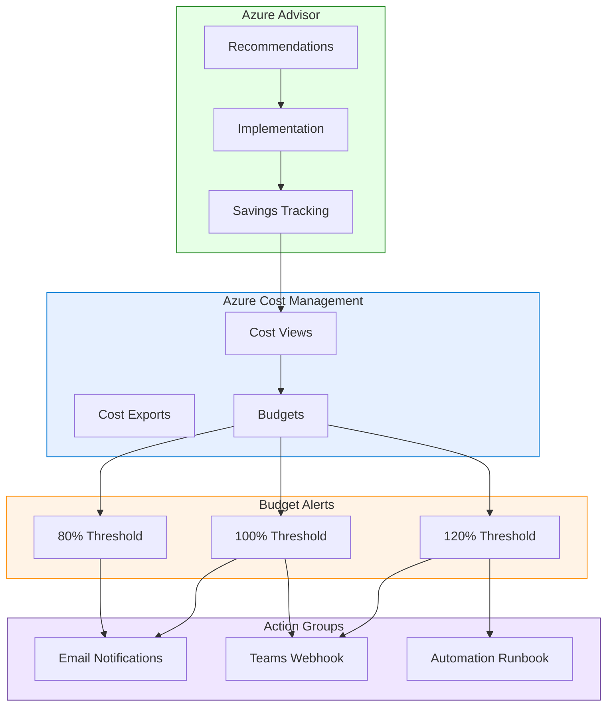

# Tutorial 14: Cost Optimization

> **Estimated Time:** 3-4 hours
> **Difficulty:** Intermediate

Reduce your Azure data platform spend by 30-60% without sacrificing performance. This tutorial walks through budget alerts, auto-shutdown schedules, right-sizing, reserved capacity analysis, storage lifecycle management, and continuous cost monitoring so your CSA-in-a-Box environment runs lean from day one.

---

## Prerequisites

- [ ] **Completed [Tutorial 01: Foundation Platform](../01-foundation-platform/README.md)** with all resources deployed
- [ ] **Azure subscription** with Contributor role (Owner required for policy assignments)
- [ ] **Azure CLI** 2.50+ with Bicep CLI 0.22+
- [ ] **Cost Management + Billing** reader role at the subscription level
- [ ] (Optional) **Power BI Desktop** for Step 9

```bash
az version --output table
az provider show -n Microsoft.CostManagement --query "registrationState" -o tsv
```

---

## Architecture Diagram



---

## Step 1: Set Up Cost Management Fundamentals

Enable Cost Management and configure views that show where money is going.

```bash
az provider register --namespace Microsoft.CostManagement
az provider register --namespace Microsoft.Consumption

export CSA_PREFIX="csa"
export CSA_ENV="dev"
export CSA_SUBSCRIPTION_ID=$(az account show --query "id" -o tsv)
export CSA_RG_DLZ="${CSA_PREFIX}-rg-dlz-${CSA_ENV}"
```

Set up a recurring cost export to your storage account:

```bash
STORAGE_ACCT=$(az storage account list \
  --resource-group "$CSA_RG_DLZ" --query "[0].name" -o tsv)

az costmanagement export create \
  --name "csa-daily-cost-export" \
  --scope "subscriptions/$CSA_SUBSCRIPTION_ID" \
  --type "ActualCost" \
  --timeframe "MonthToDate" \
  --recurrence "Daily" \
  --schedule-status "Active" \
  --storage-account-id "/subscriptions/$CSA_SUBSCRIPTION_ID/resourceGroups/$CSA_RG_DLZ/providers/Microsoft.Storage/storageAccounts/$STORAGE_ACCT" \
  --storage-container "cost-exports" \
  --storage-directory "daily"
```

<details>
<summary><strong>Expected Output</strong></summary>

```json
{
    "name": "csa-daily-cost-export",
    "properties": {
        "schedule": { "recurrence": "Daily", "status": "Active" },
        "deliveryInfo": { "destination": { "container": "cost-exports" } }
    }
}
```

</details>

---

## Step 2: Implement Resource Tagging

Tags are the foundation of cost accountability. Every resource should carry these four tags:

| Tag Key       | Purpose             | Example Values               |
| ------------- | ------------------- | ---------------------------- |
| `environment` | Deployment stage    | `dev`, `staging`, `prod`     |
| `cost-center` | Budget owner        | `data-engineering`, `ml-ops` |
| `owner`       | Team contact        | `platform-team`              |
| `project`     | Workload identifier | `csa-inabox`, `usda-etl`     |

Deploy a policy that audits untagged resources:

```bicep
// file: deploy/bicep/cost/tag-policy.bicep
targetScope = 'subscription'

param requiredTags array = ['environment', 'cost-center', 'owner', 'project']

resource policyDefinition 'Microsoft.Authorization/policyDefinitions@2023-04-01' = [for tag in requiredTags: {
  name: 'require-tag-${tag}'
  properties: {
    policyType: 'Custom'
    mode: 'Indexed'
    displayName: 'Require tag: ${tag}'
    policyRule: {
      if: { field: '[concat(\'tags[\', \'${tag}\', \']\')]', exists: 'false' }
      then: { effect: 'audit' }
    }
  }
}]
```

```bash
az deployment sub create \
  --location eastus \
  --template-file deploy/bicep/cost/tag-policy.bicep \
  --name "tag-policy-$(date +%Y%m%d%H%M)"

# Backfill tags on existing resource group
az tag update \
  --resource-id "/subscriptions/$CSA_SUBSCRIPTION_ID/resourceGroups/$CSA_RG_DLZ" \
  --operation merge \
  --tags environment="$CSA_ENV" cost-center=data-engineering owner=platform-team project=csa-inabox
```

!!! warning
Use `audit` mode first to inventory untagged resources. Switch to `deny` only after cleanup, otherwise new deployments will fail.

---

## Step 3: Create Budget Alerts

Deploy budgets with escalating thresholds at 80%, 100%, and 120%.

```bicep
// file: deploy/bicep/cost/budgets.bicep
targetScope = 'subscription'

param monthlyBudget int = 1000
param alertEmails array = ['platform-team@contoso.com']

resource budget 'Microsoft.Consumption/budgets@2023-05-01' = {
  name: 'csa-monthly-budget'
  properties: {
    category: 'Cost'
    amount: monthlyBudget
    timeGrain: 'Monthly'
    timePeriod: { startDate: '${utcNow('yyyy-MM')}-01' }
    notifications: {
      warning80:  { enabled: true, operator: 'GreaterThanOrEqualTo', threshold: 80,  contactEmails: alertEmails, thresholdType: 'Actual' }
      critical100:{ enabled: true, operator: 'GreaterThanOrEqualTo', threshold: 100, contactEmails: alertEmails, thresholdType: 'Actual' }
      overrun120: { enabled: true, operator: 'GreaterThanOrEqualTo', threshold: 120, contactEmails: alertEmails, thresholdType: 'Actual' }
    }
  }
}
```

Resource group budget via CLI:

```bash
az consumption budget create \
  --budget-name "csa-dlz-monthly-budget" \
  --resource-group "$CSA_RG_DLZ" \
  --amount 500 --time-grain Monthly \
  --start-date "$(date +%Y-%m)-01" --end-date "2027-12-31" \
  --category Cost
```

!!! tip
Add a **forecasted** budget alongside the actual budget. Forecasted alerts warn you days in advance when Azure predicts you will exceed your target.

---

## Step 4: Configure Auto-Shutdown Schedules

Dev/test environments running 24/7 waste 65-75% of their compute budget. Shut them down outside business hours.

```bash
az automation account create \
  --name "csa-automation-${CSA_ENV}" \
  --resource-group "$CSA_RG_DLZ" \
  --location eastus
```

Create a runbook that terminates all running Databricks clusters:

```powershell
# file: scripts/cost/Stop-DatabricksClusters.ps1
param([string]$ResourceGroupName = "csa-rg-dlz-dev", [string]$WorkspaceName = "csa-dbx-dev")

Connect-AzAccount -Identity
$workspace = Get-AzDatabricksWorkspace -ResourceGroupName $ResourceGroupName -Name $WorkspaceName
$token   = (Get-AzAccessToken -ResourceUrl "2ff814a6-3304-4ab8-85cb-cd0e6f879c1d").Token
$headers = @{ "Authorization" = "Bearer $token"; "Content-Type" = "application/json" }
$baseUrl = "https://$($workspace.Url)"

$clusters = (Invoke-RestMethod -Uri "$baseUrl/api/2.0/clusters/list" -Headers $headers).clusters
$running  = $clusters | Where-Object { $_.state -eq "RUNNING" }

foreach ($c in $running) {
    Write-Output "Terminating: $($c.cluster_name)"
    Invoke-RestMethod -Uri "$baseUrl/api/2.0/clusters/delete" -Method POST -Headers $headers `
        -Body (@{ cluster_id = $c.cluster_id } | ConvertTo-Json)
}
```

Schedule it for 7 PM EST every weekday:

```bash
az automation schedule create \
  --automation-account-name "csa-automation-${CSA_ENV}" \
  --resource-group "$CSA_RG_DLZ" \
  --name "weekday-shutdown" \
  --frequency "Week" --interval 1 \
  --start-time "$(date -d 'tomorrow 00:00' +%Y-%m-%dT00:00:00Z)" \
  --time-zone "America/New_York"
```

!!! warning
Confirm your timezone offset. A wrong timezone means clusters shut down during business hours. Test with a one-time run first.

---

## Step 5: Right-Size Compute Resources

Over-provisioned compute is the single largest source of waste.

```bash
az advisor recommendation list --category Cost \
  --query "[].{Resource:resourceMetadata.resourceId, Savings:extendedProperties.savingsAmount, Action:shortDescription.solution}" \
  --output table
```

Query Databricks cluster utilization to find over-provisioned clusters:

```sql
-- Run in Databricks SQL: clusters with low CPU over 14 days
SELECT cluster_name, node_type,
       avg(cpu_utilization_percent) AS avg_cpu,
       max(cpu_utilization_percent) AS peak_cpu
FROM system.compute.cluster_metrics
WHERE date >= current_date() - INTERVAL 14 DAYS
GROUP BY cluster_name, node_type
HAVING avg_cpu < 30
ORDER BY avg_cpu ASC;
```

| Avg CPU | Action                                    |
| ------- | ----------------------------------------- |
| < 20%   | Downsize by 2 VM sizes (e.g., DS5 to DS3) |
| 20-40%  | Downsize by 1 VM size                     |
| 40-70%  | Current size is appropriate               |
| > 70%   | Consider upsizing or enabling autoscale   |

!!! tip
For dev/test Synapse pools, pause the pool when not in use. A paused DW100c costs nothing. Use `az synapse sql pool pause` to stop billing immediately.

---

## Step 6: Reserved Instances Analysis

Reserved capacity provides 30-72% savings for steady-state workloads at the cost of a 1- or 3-year commitment.

```bash
az advisor recommendation list --category Cost \
  --query "[?contains(shortDescription.solution, 'Reserved')].{Resource:resourceMetadata.resourceId, AnnualSavings:extendedProperties.annualSavingsAmount, Term:extendedProperties.term}" \
  --output table
```

| Service        | 1-Year Savings | 3-Year Savings | Breakeven |
| -------------- | -------------- | -------------- | --------- |
| VMs (D-series) | 30-40%         | 55-65%         | 7-8 mo    |
| SQL Database   | 25-35%         | 50-60%         | 8-9 mo    |
| Cosmos DB      | 20-30%         | 45-55%         | 8-10 mo   |
| Databricks DBU | 25-37%         | 50-62%         | 7-9 mo    |

!!! warning
Reservations are non-refundable. Only reserve for workloads running at 60%+ utilization consistently. Review projected savings in the Azure Portal before committing.

---

## Step 7: Storage Lifecycle Policies

Lifecycle policies automatically move aging data to cheaper tiers.

```json
{
    "rules": [
        {
            "enabled": true,
            "name": "bronze-tiering",
            "type": "Lifecycle",
            "definition": {
                "actions": {
                    "baseBlob": {
                        "tierToCool": {
                            "daysAfterModificationGreaterThan": 30
                        },
                        "tierToArchive": {
                            "daysAfterModificationGreaterThan": 90
                        },
                        "delete": { "daysAfterModificationGreaterThan": 365 }
                    }
                },
                "filters": {
                    "blobTypes": ["blockBlob"],
                    "prefixMatch": ["bronze/"]
                }
            }
        }
    ]
}
```

```bash
az storage account management-policy create \
  --account-name "$STORAGE_ACCT" \
  --resource-group "$CSA_RG_DLZ" \
  --policy @deploy/bicep/cost/lifecycle-policy.json
```

Schedule Delta table maintenance to reclaim storage:

```sql
-- Databricks scheduled job: remove stale files and compact small files
VACUUM usda_bronze.raw_nass_quickstats RETAIN 168 HOURS;
OPTIMIZE usda_gold.fct_crop_production ZORDER BY (commodity_desc, year);
```

!!! tip
Hot-to-cool tiering saves roughly 50% on storage. Archive saves 90% but has retrieval latency (hours). Only archive data you rarely need.

---

## Step 8: Spot Instance Strategy

Spot VMs cost 60-90% less than on-demand but can be evicted with 30 seconds notice. Use them for fault-tolerant batch workloads only.

Configure a Databricks job cluster with spot workers:

```json
{
    "cluster_name": "csa-batch-spot-cluster",
    "spark_version": "14.3.x-scala2.12",
    "node_type_id": "Standard_DS3_v2",
    "num_workers": 4,
    "azure_attributes": {
        "first_on_demand": 1,
        "availability": "SPOT_WITH_FALLBACK_AZURE",
        "spot_bid_max_price": -1
    },
    "autotermination_minutes": 20
}
```

`first_on_demand: 1` keeps the driver on a reliable on-demand node. `SPOT_WITH_FALLBACK_AZURE` falls back to on-demand when no spot capacity is available. For AKS ML training workloads, add a spot node pool with `az aks nodepool add --priority Spot --eviction-policy Delete`.

!!! warning
Never use spot instances for streaming jobs or interactive workloads. Evictions will interrupt your pipeline.

---

## Step 9: Build Cost Dashboards

Connect Power BI to Cost Management exports for real-time spend tracking and chargeback.

```bash
# Verify the daily export is running
az costmanagement export show \
  --name "csa-daily-cost-export" \
  --scope "subscriptions/$CSA_SUBSCRIPTION_ID" \
  --query "{Name:name, Status:schedule.status}" --output table
```

Chargeback report by cost-center tag:

```bash
az consumption usage list \
  --subscription "$CSA_SUBSCRIPTION_ID" \
  --start-date "$(date -d '30 days ago' +%Y-%m-%d)" \
  --end-date "$(date +%Y-%m-%d)" \
  --query "[].{CostCenter:tags.\"cost-center\", Service:meterCategory, Cost:pretaxCost}" \
  --output table
```

In Power BI Desktop: **Get Data** > **Azure** > **Azure Cost Management**, then build charts by service, resource group, and cost-center tag for chargeback.

---

## Step 10: Continuous Optimization

Cost optimization is not a one-time project. Establish a monthly review cycle.

```bash
echo "=== Monthly Cost Review ==="
# Budget status
az consumption budget list \
  --query "[].{Budget:name, Limit:amount, Spent:currentSpend.amount}" --output table
# Advisor recommendations count
az advisor recommendation list --category Cost --query "length(@)"
# Untagged resources
az resource list \
  --query "[?tags.environment == null].{Name:name, Type:type, RG:resourceGroup}" --output table
```

Track your Advisor score over time to confirm optimization efforts are working:

```bash
az advisor recommendation list --category Cost \
  --query "[].{Impact:impact, Problem:shortDescription.problem, Savings:extendedProperties.savingsAmount}" \
  --output table
```

!!! tip
Set a calendar reminder for the first Monday of each month to run this review.

---

## Cost Optimization Checklist

- [ ] Enable auto-shutdown for all dev/test Databricks clusters
- [ ] Pause Synapse dedicated SQL pools when not in use
- [ ] Set auto-termination (30 min) on all interactive clusters
- [ ] Apply lifecycle policies to Bronze storage (hot to cool at 30 days)
- [ ] Tag all resources with `environment`, `cost-center`, `owner`, `project`
- [ ] Delete unattached managed disks and unused public IPs
- [ ] Right-size VMs with < 20% average CPU utilization
- [ ] Use spot instances for batch Databricks jobs
- [ ] Enable Databricks cluster pools to reduce startup cost
- [ ] Set budget alerts at 80%, 100%, and 120% thresholds
- [ ] Schedule Data Factory pipelines for off-peak hours only
- [ ] Use serverless Synapse SQL instead of dedicated pools for ad-hoc queries
- [ ] Evaluate reserved instances for workloads at 60%+ utilization
- [ ] Compact Delta tables with OPTIMIZE and ZORDER
- [ ] Enable Cost Management anomaly alerts

---

## Typical Savings

| Optimization                       | Typical Savings | Effort       |
| ---------------------------------- | --------------- | ------------ |
| Auto-shutdown dev/test compute     | 65-75%          | Low (1 hour) |
| Storage lifecycle (hot to cool)    | 40-50%          | Low (1 hour) |
| Databricks spot instances (batch)  | 60-90%          | Medium       |
| Right-size underutilized VMs       | 20-40%          | Medium       |
| Reserved instances (1-year)        | 30-40%          | Low          |
| Reserved instances (3-year)        | 55-65%          | Low          |
| Pause Synapse dedicated pools      | 100% when idle  | Low          |
| Delta VACUUM and OPTIMIZE          | 10-30% storage  | Low          |
| Tag-based governance and cleanup   | 10-20%          | Medium       |
| Continuous Advisor recommendations | 5-15% ongoing   | Low          |

---

## Troubleshooting

| Symptom                                | Cause                                    | Fix                                                                             |
| -------------------------------------- | ---------------------------------------- | ------------------------------------------------------------------------------- |
| Budget alerts not firing               | Start date is in the future              | Set `start-date` to the first of the current month                              |
| Cost exports show $0                   | Export created recently                  | Wait 24 hours; trigger manually with `az costmanagement export execute`         |
| `AuthorizationFailed` on budget create | Missing Cost Management Contributor role | Request the role from your subscription Owner                                   |
| Auto-shutdown runbook fails silently   | Managed identity not assigned            | Enable system-assigned identity and grant Contributor on the DLZ resource group |
| Lifecycle policy not moving blobs      | Policy evaluates once per day            | Wait 24-48 hours; verify the policy targets the correct storage account         |
| Advisor shows no recommendations       | Resources are new                        | Advisor needs 7-14 days of usage data before generating recommendations         |
| Spot instances evicted too frequently  | Low spot capacity in region              | Use a different VM size or region; enable `SPOT_WITH_FALLBACK_AZURE`            |

---

## Related

- [Tutorial 01: Foundation Platform](../01-foundation-platform/README.md) -- Deploy the base infrastructure this tutorial optimizes
- [Tutorial 02: Governance & Compliance](../02-governance/) -- Policy enforcement and tagging standards
- [Tutorial 10: Azure Monitor](../10-azure-monitor/) -- Monitoring and alerting for cost anomalies
- [Azure Cost Management documentation](https://learn.microsoft.com/en-us/azure/cost-management-billing/)
- [Azure Advisor cost recommendations](https://learn.microsoft.com/en-us/azure/advisor/advisor-cost-recommendations)
- [Databricks cluster best practices](https://learn.microsoft.com/en-us/azure/databricks/clusters/cluster-config-best-practices)
- [ADLS lifecycle management](https://learn.microsoft.com/en-us/azure/storage/blobs/lifecycle-management-overview)
