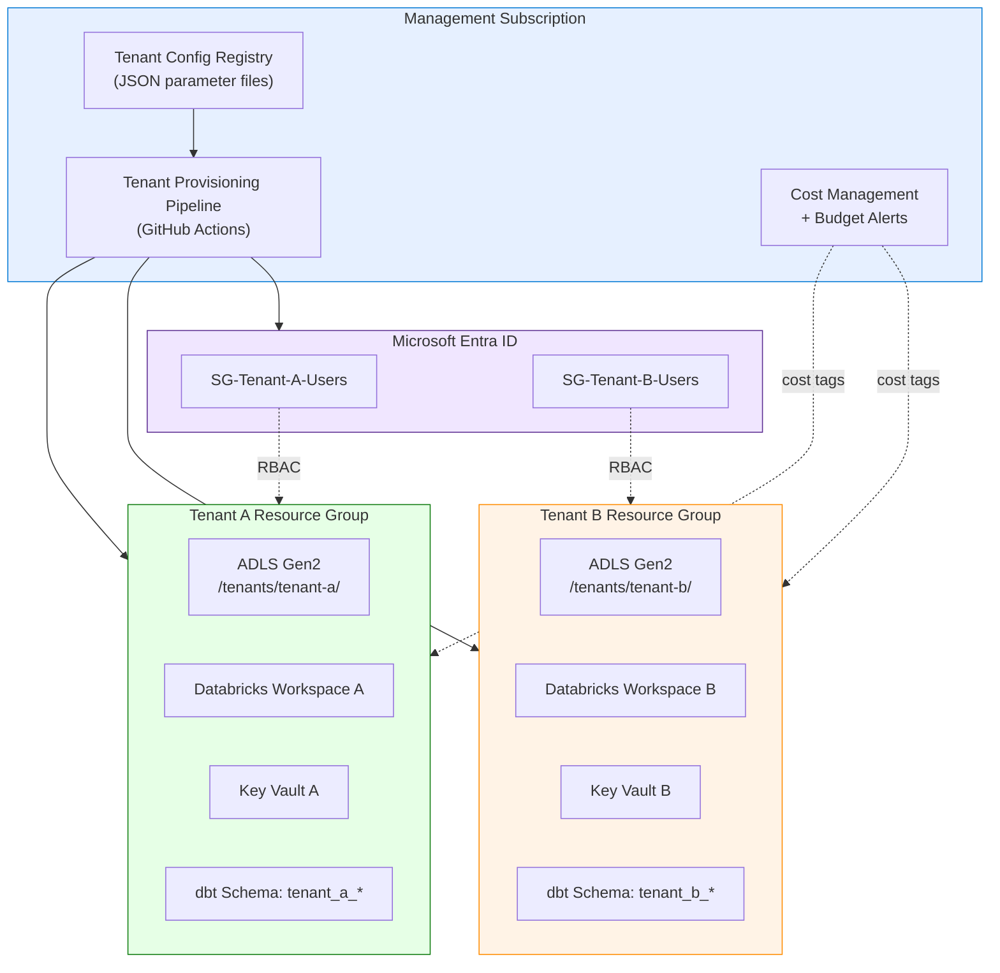

# Tutorial 15: Multi-Tenant Onboarding

> **Estimated Time:** 3-4 hours
> **Difficulty:** Advanced

Provision isolated tenant environments on the CSA-in-a-Box platform. By the end of this tutorial you will have a repeatable pipeline that creates per-tenant resource groups, ADLS folders, Databricks workspaces, Key Vaults, and dbt schemas -- with RBAC boundaries that guarantee tenant A cannot see tenant B's data. You will also wire up billing separation with cost tags and budget alerts.

---

## Prerequisites

Before starting, ensure you have the following installed and configured:

- [ ] **Completed [Tutorial 01: Foundation Platform](../01-foundation-platform/README.md)** -- a working DLZ is required
- [ ] **Azure subscription** with Owner role (needed for RBAC assignments)
- [ ] **Azure CLI** 2.50+ -- [Install guide](https://learn.microsoft.com/en-us/cli/azure/install-azure-cli)
- [ ] **Bicep CLI** 0.22+ (verify with `az bicep version`)
- [ ] **GitHub CLI** (`gh`) -- [Install guide](https://cli.github.com/)
- [ ] **Python** 3.11+ with `dbt-core` and `dbt-databricks`
- [ ] **Microsoft Entra ID** permissions to create security groups and app registrations

Verify your tools:

```bash
az version --output table
az bicep version
gh --version
python --version
dbt --version
```

---

## Architecture Diagram



---

## Step 1: Define the Tenant Configuration Schema

Create a JSON parameter file that captures everything needed to provision a tenant. This file drives the entire onboarding pipeline.

```bash
mkdir -p deploy/bicep/tenant-onboarding
```

Create `deploy/bicep/tenant-onboarding/tenant-config.schema.json`:

```json
{
    "$schema": "https://json-schema.org/draft/2020-12/schema",
    "type": "object",
    "required": ["tenantId", "tenantName", "environment", "owner"],
    "properties": {
        "tenantId": {
            "type": "string",
            "pattern": "^[a-z0-9-]{3,24}$",
            "description": "URL-safe tenant slug (e.g. contoso-gov)"
        },
        "tenantName": {
            "type": "string",
            "description": "Human-readable tenant display name"
        },
        "environment": {
            "type": "string",
            "enum": ["dev", "staging", "prod"]
        },
        "owner": {
            "type": "string",
            "format": "email",
            "description": "Tenant admin email — added as Owner to the Entra group"
        },
        "region": {
            "type": "string",
            "default": "eastus"
        },
        "skuTier": {
            "type": "string",
            "enum": ["basic", "standard", "premium"],
            "default": "standard"
        },
        "budgetMonthlyUsd": {
            "type": "number",
            "default": 500
        }
    }
}
```

Now create a concrete parameter file for your first tenant:

```bash
cat > deploy/bicep/tenant-onboarding/params.tenant-alpha.json << 'EOF'
{
  "tenantId": "tenant-alpha",
  "tenantName": "Tenant Alpha (Demo)",
  "environment": "dev",
  "owner": "admin@tenant-alpha.example.com",
  "region": "eastus",
  "skuTier": "standard",
  "budgetMonthlyUsd": 500
}
EOF
```

<details>
<summary><strong>Full schema validation</strong></summary>

You can validate parameter files against the schema using Python:

```python
import json, jsonschema

with open("tenant-config.schema.json") as f:
    schema = json.load(f)
with open("params.tenant-alpha.json") as f:
    config = json.load(f)

jsonschema.validate(config, schema)
print("Valid tenant configuration.")
```

</details>

### Troubleshooting

| Symptom                               | Cause                                  | Fix                                             |
| ------------------------------------- | -------------------------------------- | ----------------------------------------------- |
| Schema validation fails on `tenantId` | ID contains uppercase or special chars | Use only lowercase letters, digits, and hyphens |
| Missing required field error          | Parameter file incomplete              | Compare against schema `required` array         |

---

## Step 2: Create Bicep Modules for Tenant Resource Provisioning

Build modular Bicep templates so each tenant gets a consistent set of resources.

### 2a. Tenant Resource Group Module

Create `deploy/bicep/tenant-onboarding/modules/tenant-rg.bicep`:

```bicep
targetScope = 'subscription'

@description('Tenant slug used for naming')
param tenantId string

@description('Environment tag')
param environment string

@description('Azure region')
param location string

@description('Tenant display name')
param tenantName string

@description('Monthly budget in USD')
param budgetMonthlyUsd int = 500

var rgName = 'rg-${tenantId}-${environment}'

resource tenantRg 'Microsoft.Resources/resourceGroups@2023-07-01' = {
  name: rgName
  location: location
  tags: {
    tenant: tenantId
    tenantName: tenantName
    environment: environment
    costCenter: 'tenant-${tenantId}'
    managedBy: 'csa-tenant-pipeline'
  }
}

output resourceGroupName string = tenantRg.name
output resourceGroupId string = tenantRg.id
```

### 2b. Tenant Storage Module

Create `deploy/bicep/tenant-onboarding/modules/tenant-storage.bicep`:

```bicep
@description('Tenant slug')
param tenantId string

@description('Environment')
param environment string

param location string = resourceGroup().location

var storageAccountName = replace('st${tenantId}${environment}', '-', '')

resource storageAccount 'Microsoft.Storage/storageAccounts@2023-01-01' = {
  name: storageAccountName
  location: location
  kind: 'StorageV2'
  sku: { name: 'Standard_LRS' }
  properties: {
    isHnsEnabled: true                // ADLS Gen2
    minimumTlsVersion: 'TLS1_2'
    allowBlobPublicAccess: false
    networkAcls: {
      defaultAction: 'Deny'
      bypass: 'AzureServices'
    }
  }
  tags: {
    tenant: tenantId
    costCenter: 'tenant-${tenantId}'
  }
}

// Create medallion containers
resource bronzeContainer 'Microsoft.Storage/storageAccounts/blobServices/containers@2023-01-01' = {
  name: '${storageAccount.name}/default/bronze'
}

resource silverContainer 'Microsoft.Storage/storageAccounts/blobServices/containers@2023-01-01' = {
  name: '${storageAccount.name}/default/silver'
}

resource goldContainer 'Microsoft.Storage/storageAccounts/blobServices/containers@2023-01-01' = {
  name: '${storageAccount.name}/default/gold'
}

output storageAccountName string = storageAccount.name
output storageAccountId string = storageAccount.id
```

### 2c. Tenant Key Vault Module

Create `deploy/bicep/tenant-onboarding/modules/tenant-keyvault.bicep`:

```bicep
@description('Tenant slug')
param tenantId string

@description('Environment')
param environment string

param location string = resourceGroup().location

@description('Object ID of the tenant Entra security group')
param tenantGroupObjectId string

var kvName = 'kv-${tenantId}-${environment}'

resource keyVault 'Microsoft.KeyVault/vaults@2023-07-01' = {
  name: kvName
  location: location
  properties: {
    sku: { family: 'A', name: 'standard' }
    tenantId: subscription().tenantId
    enableRbacAuthorization: true
    enableSoftDelete: true
    softDeleteRetentionInDays: 30
    networkAcls: {
      defaultAction: 'Deny'
      bypass: 'AzureServices'
    }
  }
  tags: {
    tenant: tenantId
    costCenter: 'tenant-${tenantId}'
  }
}

output keyVaultName string = keyVault.name
output keyVaultUri string = keyVault.properties.vaultUri
```

### 2d. Main Orchestrator Template

Create `deploy/bicep/tenant-onboarding/main.bicep` that wires the modules together:

```bicep
targetScope = 'subscription'

@description('Tenant configuration')
param tenantId string
param tenantName string
param environment string
param location string = 'eastus'
param budgetMonthlyUsd int = 500
param tenantGroupObjectId string

// 1. Resource group
module tenantRg 'modules/tenant-rg.bicep' = {
  name: 'deploy-rg-${tenantId}'
  params: {
    tenantId: tenantId
    tenantName: tenantName
    environment: environment
    location: location
    budgetMonthlyUsd: budgetMonthlyUsd
  }
}

// 2. Storage (ADLS Gen2)
module tenantStorage 'modules/tenant-storage.bicep' = {
  name: 'deploy-storage-${tenantId}'
  scope: resourceGroup(tenantRg.outputs.resourceGroupName)
  params: {
    tenantId: tenantId
    environment: environment
    location: location
  }
  dependsOn: [ tenantRg ]
}

// 3. Key Vault
module tenantKv 'modules/tenant-keyvault.bicep' = {
  name: 'deploy-kv-${tenantId}'
  scope: resourceGroup(tenantRg.outputs.resourceGroupName)
  params: {
    tenantId: tenantId
    environment: environment
    location: location
    tenantGroupObjectId: tenantGroupObjectId
  }
  dependsOn: [ tenantRg ]
}

output resourceGroupName string = tenantRg.outputs.resourceGroupName
output storageAccountName string = tenantStorage.outputs.storageAccountName
output keyVaultName string = tenantKv.outputs.keyVaultName
```

<details>
<summary><strong>Expected directory layout</strong></summary>

```
deploy/bicep/tenant-onboarding/
  main.bicep
  tenant-config.schema.json
  params.tenant-alpha.json
  modules/
    tenant-rg.bicep
    tenant-storage.bicep
    tenant-keyvault.bicep
```

</details>

---

## Step 3: Implement Namespace Isolation

Each tenant must have isolated storage paths, Databricks workspaces, and dbt schemas so that data never leaks across boundaries.

### 3a. ADLS Folder Isolation

Each tenant's ADLS account already has dedicated bronze/silver/gold containers (created in Step 2b). Within the shared platform storage, create tenant-scoped folders:

```bash
TENANT_ID="tenant-alpha"
PLATFORM_STORAGE="csadlsdev"  # Your platform storage account

for LAYER in bronze silver gold; do
  az storage fs directory create \
    --name "tenants/${TENANT_ID}" \
    --file-system "$LAYER" \
    --account-name "$PLATFORM_STORAGE" \
    --auth-mode login
done
```

### 3b. Databricks Workspace Isolation

For full isolation, each tenant gets a separate Databricks workspace. For cost-effective dev environments, use a shared workspace with schema-level isolation:

```bash
# Option A: Dedicated workspace per tenant (production)
az databricks workspace create \
  --name "dbx-${TENANT_ID}-dev" \
  --resource-group "rg-${TENANT_ID}-dev" \
  --location eastus \
  --sku standard \
  --tags "tenant=${TENANT_ID}" "costCenter=tenant-${TENANT_ID}"

# Option B: Schema-level isolation in shared workspace (dev)
# Create a tenant-scoped catalog in Unity Catalog
databricks unity-catalog catalogs create \
  --name "catalog_${TENANT_ID//-/_}" \
  --comment "Isolated catalog for ${TENANT_ID}"
```

### 3c. dbt Schema Namespace

Configure dbt to prefix all schema names with the tenant slug. Add to `dbt_project.yml`:

```yaml
vars:
    tenant_id: "tenant_alpha" # Override per-tenant via --vars or env

models:
    my_project:
        bronze:
            +schema: "{{ var('tenant_id') }}_bronze"
        silver:
            +schema: "{{ var('tenant_id') }}_silver"
        gold:
            +schema: "{{ var('tenant_id') }}_gold"
```

Run tenant-scoped dbt:

```bash
dbt run --vars '{"tenant_id": "tenant_alpha"}'
dbt run --vars '{"tenant_id": "tenant_beta"}'
```

!!! tip
The existing shared macro at `domains/shared/dbt/macros/tenant_filter.sql` provides a Jinja macro for filtering data by tenant. Use `{{ tenant_filter('tenant_id_column') }}` in your models to ensure row-level tenant isolation.

---

## Step 4: Configure RBAC for Tenant Isolation

Create Entra ID security groups per tenant and assign Azure RBAC roles that scope access to that tenant's resources only.

### 4a. Create Entra ID Security Groups

```bash
TENANT_ID="tenant-alpha"

# Create tenant security group
GROUP_ID=$(az ad group create \
  --display-name "SG-${TENANT_ID}-Users" \
  --mail-nickname "sg-${TENANT_ID}-users" \
  --description "Users for ${TENANT_ID} data platform resources" \
  --query "id" -o tsv)

echo "Created group: $GROUP_ID"

# Add the tenant admin as owner
OWNER_ID=$(az ad user show \
  --id "admin@tenant-alpha.example.com" \
  --query "id" -o tsv)

az ad group owner add \
  --group "$GROUP_ID" \
  --owner-object-id "$OWNER_ID"
```

### 4b. Assign Storage RBAC (Scoped to Tenant Resources)

```bash
TENANT_RG="rg-${TENANT_ID}-dev"
TENANT_STORAGE=$(az storage account list \
  --resource-group "$TENANT_RG" \
  --query "[0].id" -o tsv)

# Storage Blob Data Contributor -- scoped to tenant storage only
az role assignment create \
  --assignee "$GROUP_ID" \
  --role "Storage Blob Data Contributor" \
  --scope "$TENANT_STORAGE"

# Key Vault Secrets User -- scoped to tenant Key Vault
TENANT_KV=$(az keyvault list \
  --resource-group "$TENANT_RG" \
  --query "[0].id" -o tsv)

az role assignment create \
  --assignee "$GROUP_ID" \
  --role "Key Vault Secrets User" \
  --scope "$TENANT_KV"
```

### 4c. Assign Resource Group Reader

```bash
TENANT_RG_ID=$(az group show --name "$TENANT_RG" --query "id" -o tsv)

az role assignment create \
  --assignee "$GROUP_ID" \
  --role "Reader" \
  --scope "$TENANT_RG_ID"
```

<details>
<summary><strong>Verify RBAC assignments</strong></summary>

```bash
az role assignment list \
  --assignee "$GROUP_ID" \
  --output table \
  --query "[].{Role:roleDefinitionName, Scope:scope}"
```

Expected output:

```
Role                            Scope
------------------------------  --------------------------------------------------
Storage Blob Data Contributor   /subscriptions/.../storageAccounts/sttenantalpha...
Key Vault Secrets User          /subscriptions/.../vaults/kv-tenant-alpha-dev
Reader                          /subscriptions/.../resourceGroups/rg-tenant-alpha-dev
```

</details>

### Troubleshooting

| Symptom                                   | Cause                               | Fix                                                                      |
| ----------------------------------------- | ----------------------------------- | ------------------------------------------------------------------------ |
| `Insufficient privileges` creating groups | Missing Entra ID role               | Requires Groups Administrator or Global Administrator                    |
| `PrincipalNotFound` on RBAC assignment    | Group creation still propagating    | Wait 30 seconds and retry                                                |
| Users in group can see other tenant RGs   | Role assigned at subscription scope | Verify `--scope` targets the tenant resource group, not the subscription |

---

## Step 5: Set Up Billing Separation

Use cost allocation tags and budget alerts so each tenant's spend is tracked and capped independently.

### 5a. Enforce Cost Tags via Azure Policy

```bash
# Apply a policy requiring the 'tenant' tag on all resources in tenant RGs
az policy assignment create \
  --name "require-tenant-tag-${TENANT_ID}" \
  --display-name "Require tenant tag for ${TENANT_ID}" \
  --policy "/providers/Microsoft.Authorization/policyDefinitions/871b6d14-10aa-478d-b466-cc659d3d0eb4" \
  --scope "/subscriptions/$(az account show --query id -o tsv)/resourceGroups/rg-${TENANT_ID}-dev" \
  --params "{ \"tagName\": { \"value\": \"tenant\" } }"
```

### 5b. Create a Budget with Alert Threshold

```bash
SUBSCRIPTION_ID=$(az account show --query id -o tsv)
BUDGET_AMOUNT=500  # From tenant config

az consumption budget create \
  --budget-name "budget-${TENANT_ID}" \
  --amount "$BUDGET_AMOUNT" \
  --category Cost \
  --time-grain Monthly \
  --start-date "$(date +%Y-%m-01)" \
  --end-date "$(date -d '+1 year' +%Y-%m-01 2>/dev/null || date -v+1y +%Y-%m-01)" \
  --resource-group "rg-${TENANT_ID}-dev" \
  --notifications \
    '{
      "Actual_GreaterThan_80_Percent": {
        "enabled": true,
        "operator": "GreaterThan",
        "threshold": 80,
        "contactEmails": ["admin@tenant-alpha.example.com"],
        "thresholdType": "Actual"
      }
    }'
```

### 5c. View Tenant Costs

```bash
# Query costs filtered by tenant tag
az cost management query \
  --type ActualCost \
  --timeframe MonthToDate \
  --dataset-filter '{
    "tags": { "name": "tenant", "values": ["tenant-alpha"] }
  }' \
  --output table 2>/dev/null || echo "Use Azure Portal > Cost Management > Cost Analysis with tag filter: tenant=tenant-alpha"
```

!!! warning
Budget alerts are informational only -- they do not stop resource consumption. For hard spend limits, implement an Azure Function that disables resources when the budget threshold is exceeded.

---

## Step 6: Build the Tenant Onboarding Pipeline

Automate the entire provisioning flow with a GitHub Actions workflow.

Create `.github/workflows/tenant-onboard.yml`:

```yaml
name: Tenant Onboarding

on:
    workflow_dispatch:
        inputs:
            tenant_config_file:
                description: "Path to tenant config JSON (e.g. deploy/bicep/tenant-onboarding/params.tenant-alpha.json)"
                required: true
                type: string

permissions:
    id-token: write
    contents: read

jobs:
    validate:
        runs-on: ubuntu-latest
        outputs:
            tenant_id: ${{ steps.parse.outputs.tenant_id }}
            environment: ${{ steps.parse.outputs.environment }}
        steps:
            - uses: actions/checkout@v4

            - name: Parse tenant config
              id: parse
              run: |
                  CONFIG="${{ github.event.inputs.tenant_config_file }}"
                  echo "tenant_id=$(jq -r '.tenantId' $CONFIG)" >> $GITHUB_OUTPUT
                  echo "environment=$(jq -r '.environment' $CONFIG)" >> $GITHUB_OUTPUT
                  echo "region=$(jq -r '.region // "eastus"' $CONFIG)" >> $GITHUB_OUTPUT

            - name: Validate config against schema
              run: |
                  pip install jsonschema
                  python -c "
                  import json, jsonschema
                  schema = json.load(open('deploy/bicep/tenant-onboarding/tenant-config.schema.json'))
                  config = json.load(open('${{ github.event.inputs.tenant_config_file }}'))
                  jsonschema.validate(config, schema)
                  print('Config valid.')
                  "

    provision:
        needs: validate
        runs-on: ubuntu-latest
        environment: ${{ needs.validate.outputs.environment }}
        steps:
            - uses: actions/checkout@v4

            - name: Azure Login
              uses: azure/login@v2
              with:
                  client-id: ${{ secrets.AZURE_CLIENT_ID }}
                  tenant-id: ${{ secrets.AZURE_TENANT_ID }}
                  subscription-id: ${{ secrets.AZURE_SUBSCRIPTION_ID }}

            - name: Create Entra Security Group
              id: entra
              run: |
                  TENANT_ID="${{ needs.validate.outputs.tenant_id }}"
                  GROUP_ID=$(az ad group create \
                    --display-name "SG-${TENANT_ID}-Users" \
                    --mail-nickname "sg-${TENANT_ID}-users" \
                    --query "id" -o tsv)
                  echo "group_id=$GROUP_ID" >> $GITHUB_OUTPUT

            - name: Deploy Bicep
              run: |
                  CONFIG="${{ github.event.inputs.tenant_config_file }}"
                  az deployment sub create \
                    --location "$(jq -r '.region // "eastus"' $CONFIG)" \
                    --template-file deploy/bicep/tenant-onboarding/main.bicep \
                    --parameters \
                      tenantId="$(jq -r '.tenantId' $CONFIG)" \
                      tenantName="$(jq -r '.tenantName' $CONFIG)" \
                      environment="$(jq -r '.environment' $CONFIG)" \
                      location="$(jq -r '.region // "eastus"' $CONFIG)" \
                      budgetMonthlyUsd="$(jq -r '.budgetMonthlyUsd // 500' $CONFIG)" \
                      tenantGroupObjectId="${{ steps.entra.outputs.group_id }}" \
                    --name "tenant-onboard-$(date +%s)"

            - name: Assign RBAC
              run: |
                  TENANT_ID="${{ needs.validate.outputs.tenant_id }}"
                  ENV="${{ needs.validate.outputs.environment }}"
                  GROUP_ID="${{ steps.entra.outputs.group_id }}"
                  STORAGE_ID=$(az storage account list \
                    --resource-group "rg-${TENANT_ID}-${ENV}" \
                    --query "[0].id" -o tsv)
                  az role assignment create \
                    --assignee "$GROUP_ID" \
                    --role "Storage Blob Data Contributor" \
                    --scope "$STORAGE_ID"

            - name: Create budget alert
              run: |
                  CONFIG="${{ github.event.inputs.tenant_config_file }}"
                  TENANT_ID="$(jq -r '.tenantId' $CONFIG)"
                  BUDGET="$(jq -r '.budgetMonthlyUsd // 500' $CONFIG)"
                  OWNER="$(jq -r '.owner' $CONFIG)"
                  az consumption budget create \
                    --budget-name "budget-${TENANT_ID}" \
                    --amount "$BUDGET" \
                    --category Cost \
                    --time-grain Monthly \
                    --start-date "$(date +%Y-%m-01)" \
                    --end-date "$(date -d '+1 year' +%Y-%m-01)" \
                    --resource-group "rg-${TENANT_ID}-$(jq -r '.environment' $CONFIG)"
```

<details>
<summary><strong>Triggering the pipeline</strong></summary>

```bash
gh workflow run tenant-onboard.yml \
  -f tenant_config_file="deploy/bicep/tenant-onboarding/params.tenant-alpha.json"
```

Monitor progress:

```bash
gh run list --workflow=tenant-onboard.yml --limit 3
gh run watch
```

</details>

---

## Step 7: Create the Tenant Offboarding Process

When a tenant leaves, export their data and then clean up all resources.

### 7a. Export Tenant Data

```bash
TENANT_ID="tenant-alpha"
ENV="dev"
TENANT_STORAGE=$(az storage account list \
  --resource-group "rg-${TENANT_ID}-${ENV}" \
  --query "[0].name" -o tsv)

# Download tenant data to a local export
mkdir -p "exports/${TENANT_ID}"

for LAYER in bronze silver gold; do
  az storage blob download-batch \
    --destination "exports/${TENANT_ID}/${LAYER}" \
    --source "$LAYER" \
    --account-name "$TENANT_STORAGE" \
    --auth-mode login
done

echo "Data exported to exports/${TENANT_ID}/"
```

### 7b. Resource Cleanup

```bash
# Remove RBAC assignments
GROUP_ID=$(az ad group show \
  --group "SG-${TENANT_ID}-Users" \
  --query "id" -o tsv)

az role assignment delete --assignee "$GROUP_ID" --yes 2>/dev/null

# Delete the Entra security group
az ad group delete --group "$GROUP_ID"

# Delete the entire tenant resource group (cascades to all resources)
az group delete \
  --name "rg-${TENANT_ID}-${ENV}" \
  --yes --no-wait

echo "Offboarding complete for ${TENANT_ID}. Resource deletion is asynchronous."
```

!!! warning
Resource group deletion is irreversible. Always confirm the data export completed successfully before deleting resources.

### 7c. dbt Schema Cleanup

```bash
# Drop tenant schemas from the shared Databricks workspace
databricks sql execute \
  --statement "DROP SCHEMA IF EXISTS ${TENANT_ID//-/_}_bronze CASCADE"
databricks sql execute \
  --statement "DROP SCHEMA IF EXISTS ${TENANT_ID//-/_}_silver CASCADE"
databricks sql execute \
  --statement "DROP SCHEMA IF EXISTS ${TENANT_ID//-/_}_gold CASCADE"
```

---

## Step 8: Test Isolation

Verify that one tenant cannot access another tenant's resources.

### 8a. Provision a Second Tenant

```bash
cat > deploy/bicep/tenant-onboarding/params.tenant-beta.json << 'EOF'
{
  "tenantId": "tenant-beta",
  "tenantName": "Tenant Beta (Test)",
  "environment": "dev",
  "owner": "admin@tenant-beta.example.com",
  "region": "eastus",
  "skuTier": "standard",
  "budgetMonthlyUsd": 300
}
EOF

gh workflow run tenant-onboard.yml \
  -f tenant_config_file="deploy/bicep/tenant-onboarding/params.tenant-beta.json"
```

### 8b. Cross-Tenant Access Test

Log in as a user in Tenant Alpha's security group and attempt to access Tenant Beta's storage:

```bash
# As a Tenant Alpha user:
BETA_STORAGE=$(az storage account list \
  --resource-group "rg-tenant-beta-dev" \
  --query "[0].name" -o tsv)

# This SHOULD fail with AuthorizationPermissionMismatch
az storage blob list \
  --container-name bronze \
  --account-name "$BETA_STORAGE" \
  --auth-mode login 2>&1

# Expected error:
# "AuthorizationPermissionMismatch: This request is not authorized
#  to perform this operation using this permission."
```

### 8c. dbt Schema Isolation Test

```sql
-- As a Tenant Alpha user, this should succeed:
SELECT * FROM tenant_alpha_gold.fct_summary LIMIT 10;

-- This should fail with insufficient privileges:
SELECT * FROM tenant_beta_gold.fct_summary LIMIT 10;
-- ERROR: User does not have permission to access schema tenant_beta_gold
```

<details>
<summary><strong>Full isolation checklist</strong></summary>

| Test                           | Expected Result                   | Command                                                                        |
| ------------------------------ | --------------------------------- | ------------------------------------------------------------------------------ |
| Alpha reads Alpha storage      | Success                           | `az storage blob list --container-name bronze --account-name sttenantalphadev` |
| Alpha reads Beta storage       | `AuthorizationPermissionMismatch` | `az storage blob list --container-name bronze --account-name sttenantbetadev`  |
| Alpha reads Alpha Key Vault    | Success                           | `az keyvault secret list --vault-name kv-tenant-alpha-dev`                     |
| Alpha reads Beta Key Vault     | `ForbiddenByPolicy`               | `az keyvault secret list --vault-name kv-tenant-beta-dev`                      |
| Alpha queries Alpha dbt schema | Success                           | `SELECT * FROM tenant_alpha_gold.fct_summary`                                  |
| Alpha queries Beta dbt schema  | Permission denied                 | `SELECT * FROM tenant_beta_gold.fct_summary`                                   |

</details>

---

## Step 9: Validate and Monitor

### 9a. Tenant Inventory Report

```bash
# List all tenant resource groups
az group list \
  --query "[?tags.managedBy=='csa-tenant-pipeline'].{Name:name, Tenant:tags.tenant, Location:location}" \
  --output table
```

### 9b. Cost Report by Tenant

```bash
# View costs grouped by tenant tag
az cost management query \
  --type ActualCost \
  --timeframe MonthToDate \
  --dataset-grouping '[{"type": "Tag", "name": "tenant"}]' \
  --output table 2>/dev/null || \
  echo "View in Azure Portal: Cost Management > Cost analysis > Group by tag: tenant"
```

### 9c. Automated Monitoring

Set up alerts for tenant resource health:

```bash
TENANT_ID="tenant-alpha"

az monitor activity-log alert create \
  --name "alert-${TENANT_ID}-rg-changes" \
  --resource-group "rg-${TENANT_ID}-dev" \
  --condition category=Administrative \
  --action-group "/subscriptions/.../actionGroups/platform-ops" \
  --description "Alert on resource changes in ${TENANT_ID}"
```

---

## Completion Checklist

- [ ] Tenant configuration schema created and validated
- [ ] Bicep modules deployed: resource group, ADLS, Key Vault
- [ ] Namespace isolation configured: ADLS folders, dbt schemas
- [ ] Entra ID security groups created per tenant
- [ ] RBAC scoped to tenant resource groups only
- [ ] Cost tags and budget alerts configured
- [ ] Onboarding pipeline (GitHub Actions) working end-to-end
- [ ] Offboarding process tested (data export, resource cleanup)
- [ ] Cross-tenant isolation verified (storage, Key Vault, dbt schemas)
- [ ] Monitoring alerts configured

---

## Next Steps

- **[Tutorial 13: Security & Zero Trust](../13-security-zero-trust/README.md)** -- harden tenant isolation with private endpoints and conditional access
- **[Tutorial 14: Cost Optimization](../14-cost-optimization/README.md)** -- set up automated cost controls and reservation recommendations per tenant
- **[Tutorial 16: dbt Development Workflow](../16-dbt-development-workflow/README.md)** -- build the data models that run inside each tenant namespace

See the [Tutorial Index](../README.md) for all available paths.

---

## Clean Up (Optional)

To remove all tenant resources created in this tutorial:

```bash
for TENANT in tenant-alpha tenant-beta; do
  az group delete --name "rg-${TENANT}-dev" --yes --no-wait
  az ad group delete --group "SG-${TENANT}-Users" 2>/dev/null
done
```

> **Warning:** This permanently deletes all tenant resources and data. Only run this if you are finished with the tutorial.

---

## Reference

- [CSA-in-a-Box Architecture](../../ARCHITECTURE.md)
- [Bicep DLZ Modules](../../../deploy/bicep/DLZ/)
- [Shared dbt Macros (tenant_filter)](../../../domains/shared/dbt/macros/tenant_filter.sql)
- [Azure RBAC Built-in Roles](https://learn.microsoft.com/en-us/azure/role-based-access-control/built-in-roles)
- [Azure Budgets and Cost Alerts](https://learn.microsoft.com/en-us/azure/cost-management-billing/costs/tutorial-acm-create-budgets)
- [Entra ID Security Groups](https://learn.microsoft.com/en-us/entra/fundamentals/how-to-manage-groups)
