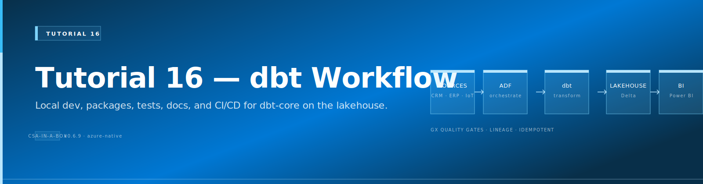
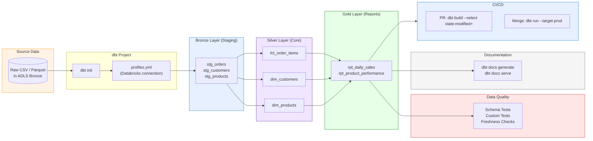

# Tutorial 16: dbt Development Workflow

{ .architecture-hero loading="eager" }


> **Estimated Time:** 2-3 hours
> **Difficulty:** Intermediate

Build a complete dbt project from scratch on the CSA-in-a-Box platform. You will initialize a new dbt project, connect it to Databricks, create models following the medallion architecture (Bronze staging, Silver facts/dims, Gold reports), add data quality tests, generate documentation, and wire up CI/CD with GitHub Actions. By the end you will have a production-ready dbt workflow that mirrors the patterns used throughout the CSA-in-a-Box domain examples.

---

## Prerequisites

Before starting, ensure you have the following installed and configured:

- [ ] **Completed [Tutorial 01: Foundation Platform](../01-foundation-platform/README.md)** -- Databricks workspace and ADLS storage deployed
- [ ] **Python** 3.11+ -- [python.org](https://www.python.org/downloads/)
- [ ] **Databricks Personal Access Token** -- created in Tutorial 01, Step 8b
- [ ] **Git** -- [git-scm.com](https://git-scm.com/)
- [ ] **GitHub CLI** (`gh`) -- [Install guide](https://cli.github.com/) (for Step 10)
- [ ] (Optional) **VS Code** with the [dbt Power User extension](https://marketplace.visualstudio.com/items?itemName=innoverio.vscode-dbt-power-user)

Verify your tools:

```bash
python --version
git --version
```

---

## Architecture Diagram



---

## Step 1: Install dbt-core and the Databricks Adapter

Create a virtual environment and install dbt with the Databricks adapter.

```bash
cd csa-inabox

python -m venv .venv
# Linux / macOS
source .venv/bin/activate
# Windows PowerShell
# .venv\Scripts\Activate.ps1

pip install --upgrade pip
pip install dbt-core dbt-databricks
```

Verify the installation:

```bash
dbt --version
```

<details>
<summary><strong>Expected Output</strong></summary>

```
Core:
  - installed: 1.8.x
  - latest:    1.8.x

Plugins:
  - databricks: 1.8.x
  - spark:      1.8.x
```

</details>

### Troubleshooting

| Symptom                            | Cause             | Fix                                                                             |
| ---------------------------------- | ----------------- | ------------------------------------------------------------------------------- |
| `pip install` fails with SSL error | Corporate proxy   | Set `pip install --trusted-host pypi.org --trusted-host files.pythonhosted.org` |
| `dbt: command not found`           | dbt not on PATH   | Activate the virtual environment or use `python -m dbt`                         |
| Dependency conflict                | Existing packages | Use a fresh virtual environment                                                 |

---

## Step 2: Initialize a New dbt Project

Scaffold a new dbt project that follows CSA-in-a-Box conventions.

```bash
# Initialize -- choose 'databricks' when prompted for the adapter
dbt init csa_tutorial
```

When prompted:

1. **Which database:** select `databricks`
2. **host:** enter your Databricks workspace URL (without `https://`)
3. **http_path:** enter your SQL Warehouse or cluster HTTP path
4. **token:** enter your Databricks PAT
5. **catalog:** enter `hive_metastore` (or your Unity Catalog name)
6. **schema:** enter `tutorial_dev`
7. **threads:** enter `4`

```bash
cd csa_tutorial
```

<details>
<summary><strong>Generated project structure</strong></summary>

```
csa_tutorial/
  dbt_project.yml
  models/
    example/
      my_first_dbt_model.sql
      my_second_dbt_model.sql
      schema.yml
  seeds/
  macros/
  snapshots/
  tests/
  analyses/
```

</details>

!!! tip
Compare the generated `dbt_project.yml` with the existing domain examples at `domains/sales/dbt/dbt_project.yml` to see CSA-in-a-Box conventions like medallion-layer schema routing and shared macro paths.

---

## Step 3: Configure profiles.yml for Databricks

The `dbt init` command creates `~/.dbt/profiles.yml`. Verify and tune it for your environment.

```bash
cat ~/.dbt/profiles.yml
```

It should look like this (adjust values for your workspace):

```yaml
csa_tutorial:
    target: dev
    outputs:
        dev:
            type: databricks
            catalog: hive_metastore
            schema: tutorial_dev
            host: adb-1234567890.12.azuredatabricks.net
            http_path: /sql/1.0/warehouses/abcdef1234567890
            token: "{{ env_var('DATABRICKS_TOKEN') }}"
            threads: 4
        prod:
            type: databricks
            catalog: hive_metastore
            schema: tutorial_prod
            host: adb-1234567890.12.azuredatabricks.net
            http_path: /sql/1.0/warehouses/abcdef1234567890
            token: "{{ env_var('DATABRICKS_TOKEN') }}"
            threads: 8
```

!!! tip
Use `{{ env_var('DATABRICKS_TOKEN') }}` instead of hardcoding tokens. Set the environment variable before running dbt: `export DATABRICKS_TOKEN="dapi..."`.

Test the connection:

```bash
export DATABRICKS_TOKEN="<your-token>"
dbt debug
```

<details>
<summary><strong>Expected Output</strong></summary>

```
Configuration:
  profiles.yml file [OK found and valid]
  dbt_project.yml file [OK found and valid]
  profile: csa_tutorial [OK found]
  target: dev [OK found]

Required dependencies:
  - git [OK found]

Connection:
  host: adb-1234567890.12.azuredatabricks.net
  http_path: /sql/1.0/warehouses/abcdef1234567890
  catalog: hive_metastore
  schema: tutorial_dev
  Connection test: [OK connection ok]

All checks passed!
```

</details>

### Troubleshooting

| Symptom                   | Cause                                           | Fix                                                |
| ------------------------- | ----------------------------------------------- | -------------------------------------------------- |
| `Connection test: FAILED` | Wrong host, path, or token                      | Verify workspace URL and regenerate PAT if expired |
| `Catalog does not exist`  | Unity Catalog not enabled or wrong catalog name | Use `hive_metastore` for non-UC workspaces         |
| `Cluster terminated`      | Idle cluster auto-terminated                    | Start the cluster in the Databricks UI and retry   |

---

## Step 4: Create Source Definitions

Define the raw data sources that dbt will read from. Remove the generated example models first.

```bash
rm -rf models/example
mkdir -p models/bronze models/silver models/gold
```

Create `models/bronze/sources.yml`:

```yaml
version: 2

sources:
    - name: raw_tutorial
      description: >
          Raw tutorial data. In dev, loaded via dbt seed.
          In production, ingested by ADF to ADLS Bronze.
      schema: seeds
      loaded_at_field: _ingested_at
      freshness:
          warn_after: { count: 24, period: hour }
          error_after: { count: 48, period: hour }
      tables:
          - name: raw_orders
            description: Raw order records with customer and product references.
            columns:
                - name: order_id
                  description: Unique order identifier.
                  tests:
                      - not_null
                      - unique
                - name: customer_id
                  description: Foreign key to customers.
                - name: product_id
                  description: Foreign key to products.
                - name: quantity
                  description: Units ordered.
                - name: unit_price
                  description: Price per unit in USD.
                - name: order_date
                  description: Date the order was placed.
                - name: _ingested_at
                  description: Ingestion timestamp (set by seed or ADF).

          - name: raw_customers
            description: Customer master data.
            columns:
                - name: customer_id
                  tests:
                      - not_null
                      - unique
                - name: customer_name
                - name: region
                - name: segment

          - name: raw_products
            description: Product catalog.
            columns:
                - name: product_id
                  tests:
                      - not_null
                      - unique
                - name: product_name
                - name: category
                - name: list_price
```

Create seed CSV files so you can develop without external data:

```bash
mkdir -p seeds
```

Create `seeds/raw_orders.csv`:

```csv
order_id,customer_id,product_id,quantity,unit_price,order_date,_ingested_at
1001,C001,P001,5,29.99,2024-01-15,2024-01-15T10:00:00
1002,C002,P003,2,49.99,2024-01-16,2024-01-16T10:00:00
1003,C001,P002,1,199.99,2024-01-17,2024-01-17T10:00:00
1004,C003,P001,10,29.99,2024-01-18,2024-01-18T10:00:00
1005,C002,P004,3,14.99,2024-01-19,2024-01-19T10:00:00
1006,C004,P002,2,199.99,2024-01-20,2024-01-20T10:00:00
1007,C005,P003,1,49.99,2024-01-21,2024-01-21T10:00:00
1008,C001,P005,4,9.99,2024-01-22,2024-01-22T10:00:00
```

Create `seeds/raw_customers.csv`:

```csv
customer_id,customer_name,region,segment
C001,Acme Corp,West,Enterprise
C002,Beta LLC,East,SMB
C003,Gamma Inc,Central,Enterprise
C004,Delta Co,West,Government
C005,Epsilon Ltd,East,SMB
```

Create `seeds/raw_products.csv`:

```csv
product_id,product_name,category,list_price
P001,Widget A,Widgets,29.99
P002,Gadget Pro,Gadgets,199.99
P003,Widget B,Widgets,49.99
P004,Accessory X,Accessories,14.99
P005,Accessory Y,Accessories,9.99
```

Load the seed data:

```bash
dbt seed
```

<details>
<summary><strong>Expected Output</strong></summary>

```
Running with dbt=1.8.x
Found 0 models, 0 tests, 0 snapshots, 3 seeds

Concurrency: 4 threads (target='dev')

1 of 3 OK loaded seed file tutorial_dev.raw_orders ........... [INSERT 8 in 2.34s]
2 of 3 OK loaded seed file tutorial_dev.raw_customers ........ [INSERT 5 in 1.56s]
3 of 3 OK loaded seed file tutorial_dev.raw_products ......... [INSERT 5 in 1.23s]

Completed successfully.
Done. PASS=3 WARN=0 ERROR=0 SKIP=0 TOTAL=3
```

</details>

---

## Step 5: Build Bronze Staging Models

Bronze models are thin wrappers over raw sources. They cast types, rename columns, and add metadata -- but do not apply business logic.

Create `models/bronze/stg_orders.sql`:

```sql
-- stg_orders.sql
-- Bronze staging: type-cast and add lineage metadata.
-- Pattern reference: domains/sales/dbt/models/bronze/brz_sales_orders.sql

{{
  config(
    materialized='incremental',
    unique_key='order_id',
    file_format='delta'
  )
}}

with source as (
    select * from {{ source('raw_tutorial', 'raw_orders') }}
),

staged as (
    select
        cast(order_id as int)           as order_id,
        cast(customer_id as string)     as customer_id,
        cast(product_id as string)      as product_id,
        cast(quantity as int)           as quantity,
        cast(unit_price as decimal(10,2)) as unit_price,
        cast(order_date as date)        as order_date,
        cast(_ingested_at as timestamp) as _ingested_at,
        current_timestamp()             as _dbt_loaded_at
    from source

    
    where _ingested_at > (select max(_ingested_at) from {{ this }})
    
)

select * from staged
```

Create `models/bronze/stg_customers.sql`:

```sql
{{
  config(
    materialized='table',
    file_format='delta'
  )
}}

select
    cast(customer_id as string)    as customer_id,
    cast(customer_name as string)  as customer_name,
    cast(region as string)         as region,
    cast(segment as string)        as segment,
    current_timestamp()            as _dbt_loaded_at
from {{ source('raw_tutorial', 'raw_customers') }}
```

Create `models/bronze/stg_products.sql`:

```sql
{{
  config(
    materialized='table',
    file_format='delta'
  )
}}

select
    cast(product_id as string)     as product_id,
    cast(product_name as string)   as product_name,
    cast(category as string)       as category,
    cast(list_price as decimal(10,2)) as list_price,
    current_timestamp()            as _dbt_loaded_at
from {{ source('raw_tutorial', 'raw_products') }}
```

Run the bronze models:

```bash
dbt run --select bronze
```

---

## Step 6: Build Silver Fact and Dimension Models

Silver models apply business logic, join sources, handle deduplication, and enforce data contracts.

Create `models/silver/dim_customers.sql`:

```sql
-- dim_customers.sql
-- Silver dimension: enriched customer dimension with derived attributes.

{{
  config(
    materialized='table',
    file_format='delta'
  )
}}

with customers as (
    select * from {{ ref('stg_customers') }}
)

select
    customer_id,
    customer_name,
    region,
    segment,
    case
        when segment = 'Enterprise' then 'Tier 1'
        when segment = 'Government' then 'Tier 1'
        when segment = 'SMB'        then 'Tier 2'
        else 'Tier 3'
    end as customer_tier,
    current_timestamp() as _dbt_loaded_at
from customers
```

Create `models/silver/dim_products.sql`:

```sql
{{
  config(
    materialized='table',
    file_format='delta'
  )
}}

with products as (
    select * from {{ ref('stg_products') }}
)

select
    product_id,
    product_name,
    category,
    list_price,
    case
        when list_price >= 100 then 'Premium'
        when list_price >= 25  then 'Standard'
        else 'Value'
    end as price_tier,
    current_timestamp() as _dbt_loaded_at
from products
```

Create `models/silver/fct_order_items.sql`:

```sql
-- fct_order_items.sql
-- Silver fact: order line items with computed total and joined dimensions.

{{
  config(
    materialized='incremental',
    unique_key='order_id',
    file_format='delta',
    incremental_strategy='merge'
  )
}}

with orders as (
    select * from {{ ref('stg_orders') }}
    
    where _dbt_loaded_at > (select max(_dbt_loaded_at) from {{ this }})
    
),

customers as (
    select * from {{ ref('dim_customers') }}
),

products as (
    select * from {{ ref('dim_products') }}
)

select
    o.order_id,
    o.customer_id,
    o.product_id,
    c.customer_name,
    c.region,
    c.customer_tier,
    p.product_name,
    p.category,
    p.price_tier,
    o.quantity,
    o.unit_price,
    (o.quantity * o.unit_price) as line_total,
    o.order_date,
    o._ingested_at,
    current_timestamp() as _dbt_loaded_at
from orders o
left join customers c on o.customer_id = c.customer_id
left join products p on o.product_id = p.product_id
```

Run the silver models:

```bash
dbt run --select silver
```

---

## Step 7: Build Gold Report Models

Gold models aggregate data for consumption by dashboards, APIs, and analysts. They are the external-facing contract.

Create `models/gold/rpt_daily_sales.sql`:

```sql
-- rpt_daily_sales.sql
-- Gold report: daily sales summary for executive dashboards.

{{
  config(
    materialized='table',
    file_format='delta'
  )
}}

with order_items as (
    select * from {{ ref('fct_order_items') }}
)

select
    order_date,
    region,
    count(distinct order_id)   as total_orders,
    sum(quantity)               as total_units,
    sum(line_total)             as total_revenue,
    avg(line_total)             as avg_order_value,
    count(distinct customer_id) as unique_customers
from order_items
group by order_date, region
```

Create `models/gold/rpt_product_performance.sql`:

```sql
-- rpt_product_performance.sql
-- Gold report: product performance metrics for merchandising.

{{
  config(
    materialized='table',
    file_format='delta'
  )
}}

with order_items as (
    select * from {{ ref('fct_order_items') }}
)

select
    product_id,
    product_name,
    category,
    price_tier,
    count(distinct order_id)   as times_ordered,
    sum(quantity)               as total_units_sold,
    sum(line_total)             as total_revenue,
    avg(unit_price)             as avg_selling_price,
    count(distinct customer_id) as unique_buyers
from order_items
group by product_id, product_name, category, price_tier
```

Run all models end-to-end:

```bash
dbt run
```

<details>
<summary><strong>Expected Output</strong></summary>

```
Running with dbt=1.8.x
Found 7 models, 0 tests, 0 snapshots, 3 seeds

Concurrency: 4 threads (target='dev')

1 of 7 OK created sql incremental model tutorial_dev.stg_orders ........ [OK in 4.56s]
2 of 7 OK created sql table model tutorial_dev.stg_customers ........... [OK in 3.21s]
3 of 7 OK created sql table model tutorial_dev.stg_products ............ [OK in 2.98s]
4 of 7 OK created sql table model tutorial_dev.dim_customers ........... [OK in 3.45s]
5 of 7 OK created sql table model tutorial_dev.dim_products ............ [OK in 2.87s]
6 of 7 OK created sql incremental model tutorial_dev.fct_order_items ... [OK in 5.12s]
7 of 7 OK created sql table model tutorial_dev.rpt_daily_sales ......... [OK in 3.67s]

Finished running 3 table models, 2 incremental models, 2 table models in 28.34s.
Completed successfully.

Done. PASS=7 WARN=0 ERROR=0 SKIP=0 TOTAL=7
```

</details>

---

## Step 8: Add Data Tests

dbt supports schema tests (declared in YAML), custom singular tests (SQL files), and source freshness checks.

### 8a. Schema Tests

Create `models/silver/schema.yml`:

```yaml
version: 2

models:
    - name: fct_order_items
      description: Fact table of order line items with joined dimensions.
      columns:
          - name: order_id
            description: Unique order identifier.
            tests:
                - not_null
                - unique
          - name: customer_id
            tests:
                - not_null
                - relationships:
                      to: ref('dim_customers')
                      field: customer_id
          - name: product_id
            tests:
                - not_null
                - relationships:
                      to: ref('dim_products')
                      field: product_id
          - name: line_total
            tests:
                - not_null
          - name: quantity
            tests:
                - not_null
                - accepted_values:
                      values: [1, 2, 3, 4, 5, 6, 7, 8, 9, 10]
                      severity: warn

    - name: dim_customers
      description: Customer dimension with derived tier.
      columns:
          - name: customer_id
            tests:
                - not_null
                - unique
          - name: customer_tier
            tests:
                - accepted_values:
                      values: ["Tier 1", "Tier 2", "Tier 3"]

    - name: dim_products
      description: Product dimension with price tier classification.
      columns:
          - name: product_id
            tests:
                - not_null
                - unique
          - name: price_tier
            tests:
                - accepted_values:
                      values: ["Premium", "Standard", "Value"]
```

### 8b. Custom Singular Test

Create `tests/assert_no_negative_revenue.sql`:

```sql
-- Custom test: ensure no order line has negative revenue.
-- dbt treats any rows returned by a test as failures.

select
    order_id,
    line_total
from {{ ref('fct_order_items') }}
where line_total < 0
```

### 8c. Source Freshness

Source freshness was already declared in `sources.yml` (Step 4). Check it:

```bash
dbt source freshness
```

### 8d. Run All Tests

```bash
dbt test
```

<details>
<summary><strong>Expected Output</strong></summary>

```
Running with dbt=1.8.x
Found 7 models, 14 tests, 0 snapshots, 3 seeds, 3 sources

Concurrency: 4 threads (target='dev')

 1 of 14 PASS not_null_fct_order_items_order_id ............. [PASS in 1.23s]
 2 of 14 PASS unique_fct_order_items_order_id ............... [PASS in 1.45s]
 3 of 14 PASS not_null_fct_order_items_customer_id .......... [PASS in 1.12s]
 4 of 14 PASS relationships_fct_order_items_customer_id ..... [PASS in 1.67s]
 5 of 14 PASS not_null_fct_order_items_product_id ........... [PASS in 1.10s]
 6 of 14 PASS relationships_fct_order_items_product_id ...... [PASS in 1.54s]
 7 of 14 PASS not_null_fct_order_items_line_total ........... [PASS in 1.08s]
 8 of 14 WARN accepted_values_fct_order_items_quantity ...... [WARN in 1.32s]
 9 of 14 PASS not_null_dim_customers_customer_id ............ [PASS in 0.98s]
10 of 14 PASS unique_dim_customers_customer_id .............. [PASS in 1.02s]
11 of 14 PASS accepted_values_dim_customers_customer_tier ... [PASS in 0.89s]
12 of 14 PASS not_null_dim_products_product_id .............. [PASS in 0.91s]
13 of 14 PASS unique_dim_products_product_id ................ [PASS in 0.95s]
14 of 14 PASS assert_no_negative_revenue .................... [PASS in 1.15s]

Finished running 14 tests in 18.41s.
Done. PASS=13 WARN=1 ERROR=0 SKIP=0 TOTAL=14
```

</details>

### Troubleshooting

| Symptom                                   | Cause                            | Fix                                                       |
| ----------------------------------------- | -------------------------------- | --------------------------------------------------------- |
| `relationships` test fails                | Seed data missing referenced IDs | Verify FK values in seed CSVs match PK values             |
| `accepted_values` warns but does not fail | Severity set to `warn`           | Change to `severity: error` for strict enforcement        |
| Source freshness errors                   | `loaded_at_field` column missing | Add `_ingested_at` to your seed CSV and source definition |

---

## Step 9: Generate and Serve Documentation

dbt auto-generates a documentation website from your YAML descriptions, model lineage, and SQL.

```bash
# Generate the docs catalog
dbt docs generate

# Serve locally (opens http://localhost:8080)
dbt docs serve --port 8080
```

<details>
<summary><strong>What you will see</strong></summary>

The documentation site includes:

- **Model lineage graph** showing Bronze --> Silver --> Gold flow
- **Column-level descriptions** from your `schema.yml` files
- **Test coverage** for each model and column
- **Source freshness** status
- **SQL compiled** for each model (click any model to see the compiled query)

Press `Ctrl+C` to stop the local server.

</details>

!!! tip
For production, deploy the docs site to GitHub Pages. Add `dbt docs generate` to your CI pipeline and publish the `target/` folder as a static site.

---

## Step 10: Set Up CI/CD Pipeline

Automate dbt runs with GitHub Actions: validate on pull requests, deploy on merge to `main`.

### 10a. Update dbt_project.yml for Layer Routing

Edit `dbt_project.yml` to route models to medallion schemas (matching the CSA-in-a-Box convention used in `domains/sales/dbt/dbt_project.yml`):

```yaml
name: "csa_tutorial"
version: "1.0.0"
config-version: 2
require-dbt-version: [">=1.7.0", "<2.0.0"]

profile: "csa_tutorial"

model-paths: ["models"]
seed-paths: ["seeds"]
test-paths: ["tests"]
macro-paths: ["macros"]
snapshot-paths: ["snapshots"]
analysis-paths: ["analyses"]

vars:
    file_format: "delta"
    incremental_strategy: "merge"

models:
    csa_tutorial:
        bronze:
            +materialized: incremental
            +file_format: delta
            +schema: bronze
            +tags: ["bronze"]
        silver:
            +materialized: incremental
            +file_format: delta
            +schema: silver
            +tags: ["silver"]
            +incremental_strategy: merge
        gold:
            +materialized: table
            +file_format: delta
            +schema: gold
            +tags: ["gold"]

seeds:
    csa_tutorial:
        +schema: seeds
```

### 10b. Create GitHub Actions Workflow

Create `.github/workflows/dbt-ci.yml`:

```yaml
name: dbt CI/CD

on:
    pull_request:
        paths:
            - "models/**"
            - "seeds/**"
            - "macros/**"
            - "tests/**"
            - "dbt_project.yml"
    push:
        branches: [main]
        paths:
            - "models/**"
            - "seeds/**"
            - "macros/**"
            - "tests/**"
            - "dbt_project.yml"

env:
    DATABRICKS_HOST: ${{ secrets.DATABRICKS_HOST }}
    DATABRICKS_TOKEN: ${{ secrets.DATABRICKS_TOKEN }}

jobs:
    dbt-pr-check:
        if: github.event_name == 'pull_request'
        runs-on: ubuntu-latest
        steps:
            - uses: actions/checkout@v4

            - name: Set up Python
              uses: actions/setup-python@v5
              with:
                  python-version: "3.11"

            - name: Install dbt
              run: pip install dbt-core dbt-databricks

            - name: Configure profiles
              run: |
                  mkdir -p ~/.dbt
                  cat > ~/.dbt/profiles.yml << 'EOF'
                  csa_tutorial:
                    target: ci
                    outputs:
                      ci:
                        type: databricks
                        catalog: hive_metastore
                        schema: tutorial_ci_${{ github.event.pull_request.number }}
                        host: ${{ env.DATABRICKS_HOST }}
                        http_path: /sql/1.0/warehouses/${{ secrets.DATABRICKS_SQL_WAREHOUSE_ID }}
                        token: ${{ env.DATABRICKS_TOKEN }}
                        threads: 4
                  EOF

            - name: dbt deps
              run: dbt deps

            - name: dbt seed
              run: dbt seed

            - name: dbt build (models + tests)
              run: dbt build

            - name: Upload docs artifact
              run: |
                  dbt docs generate
                  echo "Documentation generated successfully."

    dbt-deploy:
        if: github.event_name == 'push' && github.ref == 'refs/heads/main'
        runs-on: ubuntu-latest
        steps:
            - uses: actions/checkout@v4

            - name: Set up Python
              uses: actions/setup-python@v5
              with:
                  python-version: "3.11"

            - name: Install dbt
              run: pip install dbt-core dbt-databricks

            - name: Configure profiles
              run: |
                  mkdir -p ~/.dbt
                  cat > ~/.dbt/profiles.yml << 'EOF'
                  csa_tutorial:
                    target: prod
                    outputs:
                      prod:
                        type: databricks
                        catalog: hive_metastore
                        schema: tutorial_prod
                        host: ${{ env.DATABRICKS_HOST }}
                        http_path: /sql/1.0/warehouses/${{ secrets.DATABRICKS_SQL_WAREHOUSE_ID }}
                        token: ${{ env.DATABRICKS_TOKEN }}
                        threads: 8
                  EOF

            - name: dbt deps
              run: dbt deps

            - name: dbt seed
              run: dbt seed

            - name: dbt run (production)
              run: dbt run

            - name: dbt test (production)
              run: dbt test
```

### 10c. Add Repository Secrets

```bash
# Set secrets for the GitHub Actions workflow
gh secret set DATABRICKS_HOST --body "adb-1234567890.12.azuredatabricks.net"
gh secret set DATABRICKS_TOKEN --body "dapi..."
gh secret set DATABRICKS_SQL_WAREHOUSE_ID --body "abcdef1234567890"
```

<details>
<summary><strong>Testing the pipeline</strong></summary>

```bash
# Create a feature branch and make a change
git checkout -b feature/add-dbt-models
git add .
git commit -m "feat: add dbt tutorial models"
git push -u origin feature/add-dbt-models

# Open a PR -- this triggers the CI check
gh pr create --title "Add dbt tutorial models" --body "Tutorial 16 dbt workflow"

# Watch the CI run
gh run watch
```

</details>

### Troubleshooting

| Symptom                         | Cause                          | Fix                                          |
| ------------------------------- | ------------------------------ | -------------------------------------------- |
| CI fails with `ConnectionError` | Secrets not set                | Run `gh secret list` to verify secrets exist |
| `SchemaAlreadyExists` in CI     | PR schema collision            | Schema name includes PR number for isolation |
| Prod deploy runs on PR          | Workflow trigger misconfigured | Check the `if:` conditions on each job       |

---

## Step 11: Advanced -- dbt Packages, Macros, and Hooks

### 11a. Install dbt Packages

Create `packages.yml` in the project root:

```yaml
packages:
    - package: dbt-labs/dbt_utils
      version: [">=1.1.0", "<2.0.0"]
    - package: calogica/dbt_expectations
      version: [">=0.10.0", "<1.0.0"]
```

```bash
dbt deps
```

Use `dbt_utils` in your models:

```sql
-- Example: generate a surrogate key
select
    {{ dbt_utils.generate_surrogate_key(['order_id', 'product_id']) }} as order_item_key,
    *
from {{ ref('stg_orders') }}
```

### 11b. Custom Macros

Create a reusable macro at `macros/cents_to_dollars.sql`:

```sql

    round(cast({{ column_name }} as decimal(18,2)) / 100, 2)

```

The CSA-in-a-Box platform includes shared macros at `domains/shared/dbt/macros/` that you can reference by adding the path to your `dbt_project.yml`:

```yaml
macro-paths: ["macros", "../../domains/shared/dbt/macros"]
```

Available shared macros include:

| Macro                      | Purpose                            |
| -------------------------- | ---------------------------------- |
| `generate_schema_name.sql` | Routes models to medallion schemas |
| `incremental_filter.sql`   | Standardized incremental filtering |
| `tenant_filter.sql`        | Multi-tenant row-level filtering   |
| `data_quality.sql`         | Reusable data quality checks       |
| `scd_type2.sql`            | Slowly changing dimension Type 2   |

### 11c. Pre/Post Hooks

Add hooks to `dbt_project.yml` for logging and optimization:

```yaml
models:
    csa_tutorial:
        gold:
            +post-hook:
                - "OPTIMIZE {{ this }}"
                - "ANALYZE TABLE {{ this }} COMPUTE STATISTICS"
```

!!! tip
`OPTIMIZE` runs Z-ordering on Delta tables for faster queries. `ANALYZE TABLE` updates Databricks statistics for the query optimizer.

---

## Completion Checklist

- [ ] dbt-core and dbt-databricks installed and `dbt debug` passes
- [ ] Project initialized with `dbt init`
- [ ] `profiles.yml` configured for Databricks (dev and prod targets)
- [ ] Source definitions created with freshness checks
- [ ] Seed data loaded with `dbt seed`
- [ ] Bronze staging models built (stg\_ prefix)
- [ ] Silver fact and dimension models built (fct*, dim* prefix)
- [ ] Gold report models built (rpt\_ prefix)
- [ ] Schema tests and custom tests passing (`dbt test`)
- [ ] Documentation generated (`dbt docs generate`)
- [ ] CI/CD pipeline configured (GitHub Actions)
- [ ] `dbt_utils` package installed and working

---

## Next Steps

- **[Tutorial 01: Foundation Platform](../01-foundation-platform/README.md)** -- if you need to set up Databricks first
- **[Tutorial 15: Multi-Tenant Onboarding](../15-multi-tenant-onboarding/README.md)** -- isolate dbt schemas per tenant
- **[Tutorial 12: Monitoring & Observability](../12-monitoring-observability/README.md)** -- add dbt run monitoring and alerting

See the [Tutorial Index](../README.md) for all available paths.

---

## Reference

- [CSA-in-a-Box Sales Domain dbt Project](https://github.com/fgarofalo56/csa-inabox/tree/main/domains/sales/dbt/)
- [CSA-in-a-Box Shared dbt Macros](https://github.com/fgarofalo56/csa-inabox/tree/main/domains/shared/dbt/macros/)
- [dbt Project Template](https://github.com/fgarofalo56/csa-inabox/tree/main/templates/data-product/scaffold/dbt/)
- [dbt Documentation](https://docs.getdbt.com/)
- [dbt-databricks Adapter](https://github.com/databricks/dbt-databricks)
- [Databricks SQL Warehouse Docs](https://learn.microsoft.com/en-us/azure/databricks/sql/)
