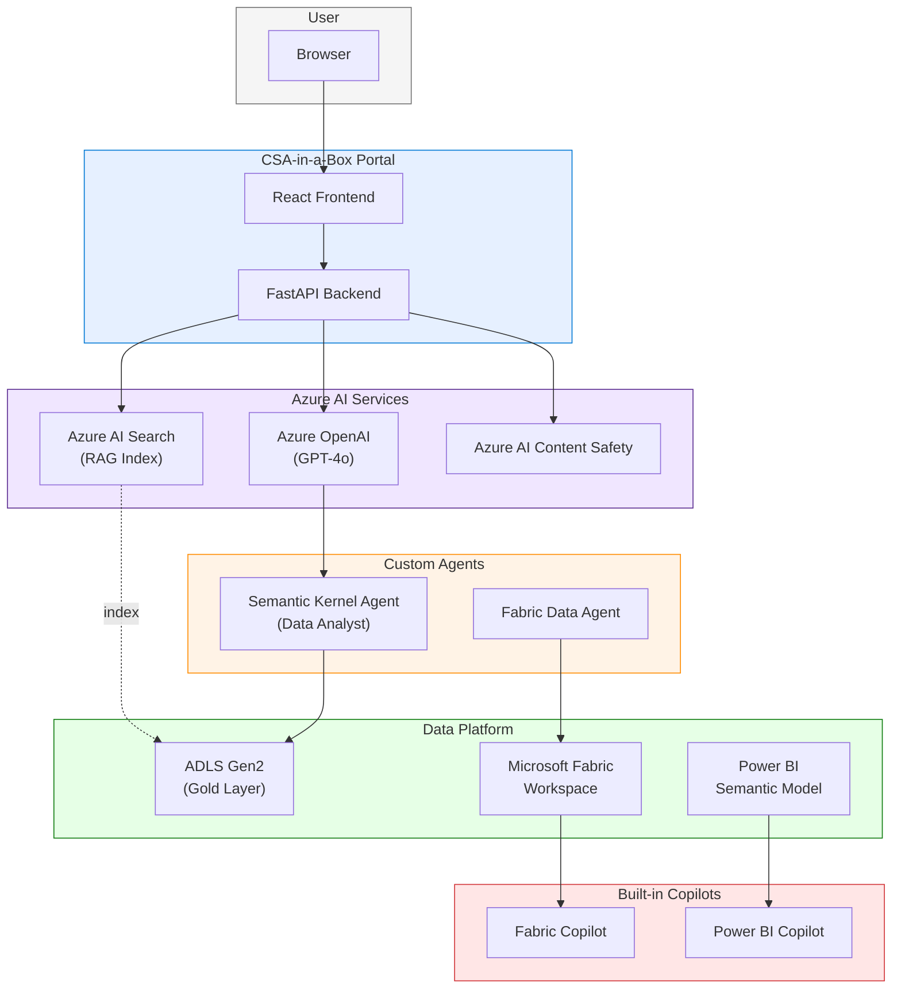

# Tutorial 17: Copilot & AI Integration

> **Estimated Time:** 3-4 hours
> **Difficulty:** Advanced

Integrate AI capabilities into the CSA-in-a-Box platform. You will deploy Azure OpenAI, connect the portal chat feature to GPT-4o with RAG grounding via Azure AI Search, enable Fabric Copilot and Power BI Copilot, build a custom data agent with Semantic Kernel, and add content safety and prompt logging. By the end you will have a full AI-assisted analytics experience layered on top of your data platform.

---

## Prerequisites

Before starting, ensure you have the following installed and configured:

- [ ] **Completed [Tutorial 01: Foundation Platform](../01-foundation-platform/)** -- ADLS, Databricks, and Data Factory deployed
- [ ] **Azure subscription** with permissions to create Azure OpenAI and Azure AI Search resources
- [ ] **Azure OpenAI access** -- [Request access](https://aka.ms/oai/access) if not already enabled
- [ ] **Azure CLI** 2.50+ -- [Install guide](https://learn.microsoft.com/en-us/cli/azure/install-azure-cli)
- [ ] **Python** 3.11+ with `pip`
- [ ] **Node.js** 18+ (for portal frontend)
- [ ] (Optional) **Microsoft Fabric capacity** (F64 or higher for Fabric Copilot)
- [ ] (Optional) **Power BI Pro or Premium Per User** license (for Power BI Copilot)

Verify your tools:

```bash
az version --output table
python --version
node --version
```

---

## Architecture Diagram



---

## Step 1: Deploy Azure OpenAI Resource and Create GPT-4o Deployment

Provision an Azure OpenAI resource and deploy the GPT-4o model.

```bash
export CSA_PREFIX="csa"
export CSA_ENV="dev"
export CSA_LOCATION="eastus2"  # Check model availability by region
export CSA_RG_AI="${CSA_PREFIX}-rg-ai-${CSA_ENV}"

# Create resource group for AI services
az group create --name "$CSA_RG_AI" --location "$CSA_LOCATION"

# Create Azure OpenAI resource
az cognitiveservices account create \
  --name "${CSA_PREFIX}-openai-${CSA_ENV}" \
  --resource-group "$CSA_RG_AI" \
  --kind OpenAI \
  --sku S0 \
  --location "$CSA_LOCATION" \
  --custom-domain "${CSA_PREFIX}-openai-${CSA_ENV}" \
  --tags environment="$CSA_ENV" project="csa-inabox"
```

Deploy the GPT-4o model:

```bash
az cognitiveservices account deployment create \
  --name "${CSA_PREFIX}-openai-${CSA_ENV}" \
  --resource-group "$CSA_RG_AI" \
  --deployment-name "gpt-4o" \
  --model-name "gpt-4o" \
  --model-version "2024-08-06" \
  --model-format OpenAI \
  --sku-capacity 30 \
  --sku-name Standard
```

Retrieve the endpoint and key:

```bash
AOAI_ENDPOINT=$(az cognitiveservices account show \
  --name "${CSA_PREFIX}-openai-${CSA_ENV}" \
  --resource-group "$CSA_RG_AI" \
  --query "properties.endpoint" -o tsv)

AOAI_KEY=$(az cognitiveservices account keys list \
  --name "${CSA_PREFIX}-openai-${CSA_ENV}" \
  --resource-group "$CSA_RG_AI" \
  --query "key1" -o tsv)

echo "Endpoint: $AOAI_ENDPOINT"
```

<details>
<summary><strong>Expected Output</strong></summary>

```
Endpoint: https://csa-openai-dev.openai.azure.com/
```

The deployment takes 1-3 minutes. Verify in the Azure Portal under Cognitive Services > your resource > Model deployments.

</details>

!!! tip
For production, use managed identity instead of API keys. Assign the `Cognitive Services OpenAI User` role to your service principal or managed identity.

### Troubleshooting

| Symptom                     | Cause                                    | Fix                                                                                                    |
| --------------------------- | ---------------------------------------- | ------------------------------------------------------------------------------------------------------ |
| `QuotaExceeded`             | Region capacity full                     | Try `eastus2`, `swedencentral`, or `canadaeast`                                                        |
| `AccountNotFound`           | Azure OpenAI not enabled on subscription | [Request access](https://aka.ms/oai/access)                                                            |
| Model version not available | Version retired or not in region         | Check [model availability](https://learn.microsoft.com/en-us/azure/ai-services/openai/concepts/models) |

---

## Step 2: Configure the Portal AI Chat Feature

The CSA-in-a-Box portal includes a React frontend with an AI chat panel backed by a FastAPI endpoint. Configure it to use your Azure OpenAI deployment.

### 2a. Set Backend Environment Variables

Add the following to your portal backend `.env` or environment configuration:

```bash
# Azure OpenAI configuration
export AZURE_OPENAI_ENDPOINT="https://csa-openai-dev.openai.azure.com/"
export AZURE_OPENAI_API_KEY="<your-key>"  # Or use managed identity
export AZURE_OPENAI_DEPLOYMENT="gpt-4o"
export AZURE_OPENAI_API_VERSION="2024-08-06"
```

### 2b. Backend Chat Endpoint

The FastAPI backend exposes a `/api/chat` endpoint. Here is the pattern used by the portal:

```python
# portal/backend/api/chat.py (reference pattern)
from fastapi import APIRouter, Depends
from openai import AsyncAzureOpenAI
import os

router = APIRouter()

client = AsyncAzureOpenAI(
    azure_endpoint=os.environ["AZURE_OPENAI_ENDPOINT"],
    api_key=os.environ.get("AZURE_OPENAI_API_KEY"),
    api_version=os.environ.get("AZURE_OPENAI_API_VERSION", "2024-08-06"),
)

@router.post("/api/chat")
async def chat(request: dict):
    messages = request.get("messages", [])

    # Add system prompt with platform context
    system_message = {
        "role": "system",
        "content": (
            "You are an AI assistant for the CSA-in-a-Box data platform. "
            "You help users understand their data, write queries, and "
            "interpret analytics results. Be concise and accurate."
        ),
    }

    response = await client.chat.completions.create(
        model=os.environ["AZURE_OPENAI_DEPLOYMENT"],
        messages=[system_message] + messages,
        temperature=0.7,
        max_tokens=1024,
    )

    return {"reply": response.choices[0].message.content}
```

### 2c. Frontend Chat Component

The React frontend sends messages to the `/api/chat` endpoint. Verify the chat panel works:

```bash
# Start the backend
cd portal/backend
pip install -r requirements.txt
uvicorn main:app --reload --port 8000

# In a separate terminal, start the frontend
cd portal/frontend
npm install
npm run dev
```

Open the portal in your browser and test the AI chat with a question like "What data sources are available in the Gold layer?"

<details>
<summary><strong>Verify with curl</strong></summary>

```bash
curl -X POST http://localhost:8000/api/chat \
  -H "Content-Type: application/json" \
  -d '{
    "messages": [
      {"role": "user", "content": "What tables are in the Gold layer?"}
    ]
  }'
```

Expected response:

```json
{
    "reply": "The Gold layer in CSA-in-a-Box typically contains report-ready tables such as..."
}
```

</details>

---

## Step 3: Set Up Azure AI Search for RAG Grounding

Create an Azure AI Search index over your data lake metadata so the AI assistant can provide grounded, accurate answers.

### 3a. Create Azure AI Search Resource

```bash
az search service create \
  --name "${CSA_PREFIX}-search-${CSA_ENV}" \
  --resource-group "$CSA_RG_AI" \
  --location "$CSA_LOCATION" \
  --sku basic \
  --partition-count 1 \
  --replica-count 1

SEARCH_ENDPOINT="https://${CSA_PREFIX}-search-${CSA_ENV}.search.windows.net"
SEARCH_KEY=$(az search admin-key show \
  --service-name "${CSA_PREFIX}-search-${CSA_ENV}" \
  --resource-group "$CSA_RG_AI" \
  --query "primaryKey" -o tsv)
```

### 3b. Create a Search Index for Data Lake Metadata

```python
# scripts/create_search_index.py
from azure.search.documents.indexes import SearchIndexClient
from azure.search.documents.indexes.models import (
    SearchIndex,
    SimpleField,
    SearchableField,
    SearchFieldDataType,
)
from azure.core.credentials import AzureKeyCredential
import os

client = SearchIndexClient(
    endpoint=os.environ["SEARCH_ENDPOINT"],
    credential=AzureKeyCredential(os.environ["SEARCH_KEY"]),
)

index = SearchIndex(
    name="datalake-metadata",
    fields=[
        SimpleField(name="id", type=SearchFieldDataType.String, key=True),
        SearchableField(name="table_name", type=SearchFieldDataType.String),
        SearchableField(name="layer", type=SearchFieldDataType.String, filterable=True),
        SearchableField(name="domain", type=SearchFieldDataType.String, filterable=True),
        SearchableField(name="description", type=SearchFieldDataType.String),
        SearchableField(name="columns", type=SearchFieldDataType.String),
        SimpleField(name="row_count", type=SearchFieldDataType.Int64),
        SimpleField(name="last_updated", type=SearchFieldDataType.DateTimeOffset),
    ],
)

client.create_or_update_index(index)
print(f"Index '{index.name}' created.")
```

### 3c. Populate the Index with dbt Metadata

```python
# scripts/index_dbt_metadata.py
from azure.search.documents import SearchClient
from azure.core.credentials import AzureKeyCredential
import json, os, glob

client = SearchClient(
    endpoint=os.environ["SEARCH_ENDPOINT"],
    index_name="datalake-metadata",
    credential=AzureKeyCredential(os.environ["SEARCH_KEY"]),
)

# Parse dbt manifest for model metadata
manifest_path = "target/manifest.json"
with open(manifest_path) as f:
    manifest = json.load(f)

documents = []
for node_id, node in manifest.get("nodes", {}).items():
    if node["resource_type"] != "model":
        continue
    columns = ", ".join(
        [f"{c['name']} ({c.get('description', 'N/A')})"
         for c in node.get("columns", {}).values()]
    )
    documents.append({
        "id": node_id.replace(".", "-"),
        "table_name": node["name"],
        "layer": node.get("tags", ["unknown"])[0] if node.get("tags") else "unknown",
        "domain": node.get("fqn", [""])[1] if len(node.get("fqn", [])) > 1 else "",
        "description": node.get("description", ""),
        "columns": columns,
        "row_count": 0,
    })

result = client.upload_documents(documents)
print(f"Indexed {len(documents)} models.")
```

```bash
pip install azure-search-documents

export SEARCH_ENDPOINT="https://csa-search-dev.search.windows.net"
export SEARCH_KEY="<your-admin-key>"

python scripts/create_search_index.py
dbt docs generate  # Creates target/manifest.json
python scripts/index_dbt_metadata.py
```

---

## Step 4: Implement Grounded Chat (RAG Pattern)

Upgrade the chat endpoint to retrieve relevant context from Azure AI Search before sending the prompt to GPT-4o.

```python
# portal/backend/api/chat_grounded.py
from fastapi import APIRouter
from openai import AsyncAzureOpenAI
from azure.search.documents.aio import SearchClient
from azure.core.credentials import AzureKeyCredential
import os

router = APIRouter()

openai_client = AsyncAzureOpenAI(
    azure_endpoint=os.environ["AZURE_OPENAI_ENDPOINT"],
    api_key=os.environ["AZURE_OPENAI_API_KEY"],
    api_version="2024-08-06",
)

search_client = SearchClient(
    endpoint=os.environ["SEARCH_ENDPOINT"],
    index_name="datalake-metadata",
    credential=AzureKeyCredential(os.environ["SEARCH_KEY"]),
)


@router.post("/api/chat/grounded")
async def grounded_chat(request: dict):
    user_message = request["messages"][-1]["content"]

    # 1. Retrieve relevant context from AI Search
    search_results = search_client.search(
        search_text=user_message,
        top=5,
        select=["table_name", "layer", "domain", "description", "columns"],
    )

    context_chunks = []
    async for result in search_results:
        context_chunks.append(
            f"Table: {result['table_name']} (Layer: {result['layer']}, "
            f"Domain: {result['domain']})\n"
            f"Description: {result['description']}\n"
            f"Columns: {result['columns']}"
        )

    grounding_context = "\n\n".join(context_chunks)

    # 2. Build augmented prompt
    system_message = {
        "role": "system",
        "content": (
            "You are an AI assistant for the CSA-in-a-Box data platform. "
            "Answer the user's question using ONLY the following data catalog context. "
            "If the context does not contain the answer, say so.\n\n"
            f"## Data Catalog Context\n{grounding_context}"
        ),
    }

    # 3. Send to GPT-4o
    response = await openai_client.chat.completions.create(
        model=os.environ["AZURE_OPENAI_DEPLOYMENT"],
        messages=[system_message] + request["messages"],
        temperature=0.3,  # Lower temperature for factual answers
        max_tokens=1024,
    )

    return {
        "reply": response.choices[0].message.content,
        "sources": [c.split("\n")[0] for c in context_chunks],
    }
```

Test the grounded chat:

```bash
curl -X POST http://localhost:8000/api/chat/grounded \
  -H "Content-Type: application/json" \
  -d '{
    "messages": [
      {"role": "user", "content": "What customer dimensions are available?"}
    ]
  }'
```

<details>
<summary><strong>Expected Response</strong></summary>

```json
{
    "reply": "The platform includes a customer dimension table (dim_customers) in the Silver layer with the following columns: customer_id, customer_name, region, segment, and customer_tier...",
    "sources": ["Table: dim_customers (Layer: silver, Domain: sales)"]
}
```

</details>

---

## Step 5: Enable Fabric Copilot

Microsoft Fabric Copilot provides AI-powered data analysis directly within the Fabric workspace. Enable it for your CSA-in-a-Box Fabric capacity.

### 5a. Prerequisites for Fabric Copilot

Fabric Copilot requires:

- **Fabric capacity** F64 or higher (or Power BI Premium P1+)
- **Tenant admin** enabled Copilot in the Fabric admin portal
- **Azure OpenAI** data processing opt-in (for data grounding)

### 5b. Enable Copilot in Fabric Admin Settings

1. Navigate to the [Fabric admin portal](https://app.fabric.microsoft.com/admin-portal)
2. Go to **Tenant settings** > **Copilot and Azure OpenAI Service**
3. Enable **Users can use Copilot and other features powered by Azure OpenAI**
4. Choose the appropriate scope (entire organization or specific security groups)
5. Enable **Data sent to Azure OpenAI can be processed outside your tenant's geographic region** if required for your region

!!! warning
For US Government cloud tenants, Fabric Copilot availability varies by cloud environment. Check [Fabric Copilot availability](https://learn.microsoft.com/en-us/fabric/get-started/copilot-fabric-overview#available-regions) for current region support.

### 5c. Use Fabric Copilot for Data Analysis

Once enabled, Copilot appears in Fabric notebooks, Data Factory pipelines, and SQL endpoints:

**In a Fabric notebook:**

1. Open a notebook in your Fabric workspace
2. Click the **Copilot** button in the toolbar
3. Ask natural language questions about your data:
    - "Analyze the sales trends in the Gold layer"
    - "Create a chart showing revenue by region"
    - "Write a query to find the top 10 customers by order volume"

**In a SQL analytics endpoint:**

1. Open the SQL analytics endpoint for your Lakehouse
2. Click **Copilot** in the query editor
3. Describe the query you want: "Show total revenue by product category for the last quarter"

For detailed guidance, see the [Fabric Copilot Guide](https://fgarofalo56.github.io/Suppercharge_Microsoft_Fabric/features/copilot/).

---

## Step 6: Use Power BI Copilot for Report Generation

Power BI Copilot generates reports, visuals, and DAX formulas from natural language.

### 6a. Prerequisites

- Power BI Pro or Premium Per User license
- Copilot enabled by your Power BI admin
- A semantic model published to a Premium or Fabric workspace

### 6b. Create a Semantic Model

If you completed Tutorial 01, you already have Gold-layer tables in Databricks. Create a Power BI semantic model:

1. Open **Power BI Desktop**
2. **Get Data** > **Azure Databricks**
3. Connect to your workspace and select Gold-layer tables (`rpt_daily_sales`, `rpt_product_performance`)
4. **Publish** to a Fabric-enabled workspace

### 6c. Generate Reports with Copilot

1. Open the published report in the Power BI Service
2. Click **Copilot** in the report toolbar
3. Use natural language prompts:
    - "Create a report page showing sales trends over time"
    - "Add a bar chart comparing revenue by product category"
    - "Summarize the key insights from this data"
    - "Write a DAX measure for year-over-year growth"

<details>
<summary><strong>Example Copilot interactions</strong></summary>

**Prompt:** "Create a visual showing monthly revenue trends"

Copilot will:

1. Identify the date and revenue columns in your semantic model
2. Create a line chart with months on the X-axis and total revenue on the Y-axis
3. Apply appropriate formatting and title

**Prompt:** "Write a DAX measure for average order value"

Copilot generates:

```dax
Average Order Value =
DIVIDE(
    SUM('fct_order_items'[line_total]),
    DISTINCTCOUNT('fct_order_items'[order_id]),
    0
)
```

</details>

---

## Step 7: Build a Custom Data Agent with Semantic Kernel

Create an AI agent that can query your data platform, analyze results, and provide insights. This extends the patterns in `examples/ai-agents/`.

### 7a. Install Dependencies

```bash
pip install semantic-kernel azure-identity azure-ai-projects
```

### 7b. Create the Data Agent

Create `agents/data_copilot.py`:

```python
"""
Custom data copilot built with Semantic Kernel.
References: examples/ai-agents/data-analyst-agent/agent.py
"""

import asyncio
import os
from semantic_kernel import Kernel
from semantic_kernel.connectors.ai.open_ai import AzureChatCompletion
from semantic_kernel.contents import ChatHistory
from semantic_kernel.functions import kernel_function


class DataPlatformPlugin:
    """Plugin that gives the agent access to data platform queries."""

    @kernel_function(
        name="query_gold_layer",
        description="Execute a SQL query against the Gold layer tables in Databricks.",
    )
    def query_gold_layer(self, query: str) -> str:
        """Execute a query against the Gold layer."""
        # In production, use Databricks SQL connector
        # For tutorial, return mock results
        return (
            f"Query executed: {query}\n"
            "Results: 42 rows returned.\n"
            "Sample: order_date=2024-01-15, region=West, total_revenue=14995.00"
        )

    @kernel_function(
        name="list_available_tables",
        description="List all available tables in the Gold layer.",
    )
    def list_available_tables(self) -> str:
        return (
            "Available Gold layer tables:\n"
            "- rpt_daily_sales (order_date, region, total_orders, total_revenue)\n"
            "- rpt_product_performance (product_name, category, total_units_sold)\n"
            "- dim_customers (customer_id, customer_name, region, customer_tier)\n"
            "- dim_products (product_id, product_name, category, price_tier)"
        )

    @kernel_function(
        name="assess_data_quality",
        description="Check data quality metrics for a given table.",
    )
    def assess_data_quality(self, table_name: str) -> str:
        return (
            f"Data quality report for {table_name}:\n"
            "- Row count: 1,247\n"
            "- Null percentage: 0.3%\n"
            "- Last refreshed: 2024-01-22 10:00 UTC\n"
            "- All schema tests passing"
        )


async def main():
    kernel = Kernel()

    # Add Azure OpenAI chat completion
    kernel.add_service(
        AzureChatCompletion(
            deployment_name=os.environ["AZURE_OPENAI_DEPLOYMENT"],
            endpoint=os.environ["AZURE_OPENAI_ENDPOINT"],
            api_key=os.environ["AZURE_OPENAI_API_KEY"],
        )
    )

    # Add the data platform plugin
    kernel.add_plugin(DataPlatformPlugin(), plugin_name="data_platform")

    # Create chat history
    history = ChatHistory()
    history.add_system_message(
        "You are a data analyst assistant for the CSA-in-a-Box platform. "
        "Use the data_platform plugin to query tables, list available data, "
        "and check data quality. Always ground your answers in actual data."
    )

    print("Data Copilot ready. Type 'quit' to exit.\n")

    while True:
        user_input = input("You: ")
        if user_input.lower() == "quit":
            break

        history.add_user_message(user_input)

        result = await kernel.invoke_prompt(
            prompt="{{$history}}",
            history=history,
        )

        print(f"Agent: {result}\n")
        history.add_assistant_message(str(result))


if __name__ == "__main__":
    asyncio.run(main())
```

```bash
export AZURE_OPENAI_ENDPOINT="https://csa-openai-dev.openai.azure.com/"
export AZURE_OPENAI_API_KEY="<your-key>"
export AZURE_OPENAI_DEPLOYMENT="gpt-4o"

python agents/data_copilot.py
```

<details>
<summary><strong>Example interaction</strong></summary>

```
Data Copilot ready. Type 'quit' to exit.

You: What tables are available?
Agent: Here are the available Gold layer tables:
- rpt_daily_sales: Contains daily sales aggregates with columns for order_date, region, total_orders, and total_revenue
- rpt_product_performance: Product-level metrics including total_units_sold by category
- dim_customers: Customer dimension with region and tier classifications
- dim_products: Product catalog with category and price tier

You: What is the data quality status of rpt_daily_sales?
Agent: The data quality for rpt_daily_sales looks good:
- 1,247 rows total
- Only 0.3% null values
- Last refreshed today at 10:00 UTC
- All schema tests are passing
```

</details>

!!! tip
For a production-grade agent with real Databricks SQL execution, see the existing example at `examples/ai-agents/data-analyst-agent/agent.py`. For a Fabric-specific agent, see `examples/fabric-data-agent/`.

---

## Step 8: Add Content Safety Filters

Protect your AI features from generating or accepting harmful content using Azure AI Content Safety.

### 8a. Create Content Safety Resource

```bash
az cognitiveservices account create \
  --name "${CSA_PREFIX}-content-safety-${CSA_ENV}" \
  --resource-group "$CSA_RG_AI" \
  --kind ContentSafety \
  --sku S0 \
  --location "$CSA_LOCATION"

SAFETY_ENDPOINT=$(az cognitiveservices account show \
  --name "${CSA_PREFIX}-content-safety-${CSA_ENV}" \
  --resource-group "$CSA_RG_AI" \
  --query "properties.endpoint" -o tsv)

SAFETY_KEY=$(az cognitiveservices account keys list \
  --name "${CSA_PREFIX}-content-safety-${CSA_ENV}" \
  --resource-group "$CSA_RG_AI" \
  --query "key1" -o tsv)
```

### 8b. Add Safety Middleware to the Chat Endpoint

```python
# portal/backend/middleware/content_safety.py
from azure.ai.contentsafety import ContentSafetyClient
from azure.ai.contentsafety.models import AnalyzeTextOptions, TextCategory
from azure.core.credentials import AzureKeyCredential
import os

safety_client = ContentSafetyClient(
    endpoint=os.environ["SAFETY_ENDPOINT"],
    credential=AzureKeyCredential(os.environ["SAFETY_KEY"]),
)

SEVERITY_THRESHOLD = 2  # 0=safe, 2=low, 4=medium, 6=high


def check_content_safety(text: str) -> dict:
    """Screen text for harmful content. Returns pass/fail with details."""
    result = safety_client.analyze_text(
        AnalyzeTextOptions(text=text)
    )

    categories_flagged = []
    for category in result.categories_analysis:
        if category.severity >= SEVERITY_THRESHOLD:
            categories_flagged.append({
                "category": category.category,
                "severity": category.severity,
            })

    return {
        "safe": len(categories_flagged) == 0,
        "flagged_categories": categories_flagged,
    }
```

Integrate into the chat endpoint:

```python
@router.post("/api/chat/safe")
async def safe_chat(request: dict):
    user_message = request["messages"][-1]["content"]

    # Screen the user input
    input_check = check_content_safety(user_message)
    if not input_check["safe"]:
        return {
            "reply": "I'm unable to process that request. Please rephrase your question.",
            "safety_flag": input_check["flagged_categories"],
        }

    # Get AI response (using grounded chat from Step 4)
    response = await grounded_chat(request)

    # Screen the AI output
    output_check = check_content_safety(response["reply"])
    if not output_check["safe"]:
        return {
            "reply": "The response was filtered for safety. Please try a different question.",
            "safety_flag": output_check["flagged_categories"],
        }

    return response
```

```bash
pip install azure-ai-contentsafety

export SAFETY_ENDPOINT="https://csa-content-safety-dev.cognitiveservices.azure.com/"
export SAFETY_KEY="<your-key>"
```

---

## Step 9: Implement Prompt Logging and Evaluation (LLMOps)

Log all prompts and responses for monitoring, debugging, and cost tracking.

### 9a. Create a Logging Module

```python
# portal/backend/middleware/prompt_logger.py
import json
import logging
from datetime import datetime, timezone
from azure.monitor.opentelemetry import configure_azure_monitor
from opentelemetry import trace

# Configure Application Insights (if available)
# configure_azure_monitor(connection_string=os.environ.get("APPINSIGHTS_CONNECTION_STRING"))

logger = logging.getLogger("llmops")
tracer = trace.get_tracer(__name__)


def log_prompt_response(
    user_message: str,
    system_prompt: str,
    response: str,
    model: str,
    tokens_prompt: int,
    tokens_completion: int,
    latency_ms: float,
    grounding_sources: list[str] | None = None,
):
    """Log prompt/response pairs for LLMOps monitoring."""
    entry = {
        "timestamp": datetime.now(timezone.utc).isoformat(),
        "model": model,
        "user_message_length": len(user_message),
        "response_length": len(response),
        "tokens_prompt": tokens_prompt,
        "tokens_completion": tokens_completion,
        "tokens_total": tokens_prompt + tokens_completion,
        "latency_ms": latency_ms,
        "grounding_sources": grounding_sources or [],
    }
    logger.info("llm_interaction", extra=entry)

    # Also emit as OpenTelemetry span
    with tracer.start_as_current_span("llm.chat") as span:
        span.set_attribute("llm.model", model)
        span.set_attribute("llm.tokens.prompt", tokens_prompt)
        span.set_attribute("llm.tokens.completion", tokens_completion)
        span.set_attribute("llm.latency_ms", latency_ms)
```

### 9b. Integrate Logging into the Chat Endpoint

```python
import time

@router.post("/api/chat/grounded")
async def grounded_chat_with_logging(request: dict):
    start = time.monotonic()
    user_message = request["messages"][-1]["content"]

    # ... (search + prompt construction from Step 4) ...

    response = await openai_client.chat.completions.create(
        model=os.environ["AZURE_OPENAI_DEPLOYMENT"],
        messages=[system_message] + request["messages"],
        temperature=0.3,
        max_tokens=1024,
    )

    latency_ms = (time.monotonic() - start) * 1000

    # Log the interaction
    log_prompt_response(
        user_message=user_message,
        system_prompt=system_message["content"],
        response=response.choices[0].message.content,
        model=response.model,
        tokens_prompt=response.usage.prompt_tokens,
        tokens_completion=response.usage.completion_tokens,
        latency_ms=latency_ms,
        grounding_sources=[c.split("\n")[0] for c in context_chunks],
    )

    return {
        "reply": response.choices[0].message.content,
        "sources": [c.split("\n")[0] for c in context_chunks],
        "usage": {
            "prompt_tokens": response.usage.prompt_tokens,
            "completion_tokens": response.usage.completion_tokens,
        },
    }
```

### 9c. Monitor in Application Insights

```bash
# Query recent LLM interactions in Application Insights
az monitor app-insights query \
  --app "${CSA_PREFIX}-appinsights-${CSA_ENV}" \
  --resource-group "$CSA_RG_AI" \
  --analytics-query "
    traces
    | where message == 'llm_interaction'
    | project timestamp, customDimensions.model, customDimensions.tokens_total,
              customDimensions.latency_ms
    | order by timestamp desc
    | take 20
  "
```

---

## Step 10: Test End-to-End and Validate

### 10a. Integration Test Script

```bash
# Test 1: Azure OpenAI responds
curl -s "$AOAI_ENDPOINT/openai/deployments/gpt-4o/chat/completions?api-version=2024-08-06" \
  -H "Content-Type: application/json" \
  -H "api-key: $AOAI_KEY" \
  -d '{"messages":[{"role":"user","content":"Say hello"}],"max_tokens":10}' \
  | python -c "import sys,json; r=json.load(sys.stdin); print('PASS: OpenAI' if r.get('choices') else 'FAIL: OpenAI')"

# Test 2: AI Search returns results
curl -s "$SEARCH_ENDPOINT/indexes/datalake-metadata/docs/search?api-version=2024-07-01" \
  -H "Content-Type: application/json" \
  -H "api-key: $SEARCH_KEY" \
  -d '{"search":"customers","top":1}' \
  | python -c "import sys,json; r=json.load(sys.stdin); print(f'PASS: Search ({r[\"@odata.count\"]} docs)' if r.get('value') else 'FAIL: Search')"

# Test 3: Content Safety is working
curl -s "$SAFETY_ENDPOINT/contentsafety/text:analyze?api-version=2024-09-01" \
  -H "Content-Type: application/json" \
  -H "Ocp-Apim-Subscription-Key: $SAFETY_KEY" \
  -d '{"text":"Hello, how can I help?"}' \
  | python -c "import sys,json; r=json.load(sys.stdin); print('PASS: Content Safety' if 'categoriesAnalysis' in r else 'FAIL: Content Safety')"

# Test 4: Grounded chat endpoint
curl -s http://localhost:8000/api/chat/grounded \
  -H "Content-Type: application/json" \
  -d '{"messages":[{"role":"user","content":"What tables are in the Gold layer?"}]}' \
  | python -c "import sys,json; r=json.load(sys.stdin); print('PASS: Grounded Chat' if r.get('reply') and r.get('sources') else 'FAIL: Grounded Chat')"
```

### 10b. Validation Checklist

Run each test and confirm all pass:

```
PASS: OpenAI -- GPT-4o deployment responds
PASS: Search -- AI Search index contains documents
PASS: Content Safety -- Content filtering operational
PASS: Grounded Chat -- RAG pipeline returns sources with response
```

### Troubleshooting

| Symptom                          | Cause                                         | Fix                                                                |
| -------------------------------- | --------------------------------------------- | ------------------------------------------------------------------ |
| OpenAI returns 401               | Invalid API key                               | Regenerate key with `az cognitiveservices account keys regenerate` |
| Search returns 0 results         | Index not populated                           | Re-run `python scripts/index_dbt_metadata.py`                      |
| Content Safety 404               | Wrong API version or endpoint                 | Verify endpoint and use `api-version=2024-09-01`                   |
| Grounded chat returns no sources | Search index empty or query mismatch          | Test search directly with curl first                               |
| Fabric Copilot not visible       | Not enabled by admin or insufficient capacity | Check Fabric admin settings (Step 5b)                              |

---

## Completion Checklist

- [ ] Azure OpenAI resource deployed with GPT-4o model
- [ ] Portal chat endpoint configured and responding
- [ ] Azure AI Search index created and populated with dbt metadata
- [ ] Grounded chat (RAG) returning sourced answers
- [ ] Fabric Copilot enabled (if Fabric capacity available)
- [ ] Power BI Copilot generating reports from semantic models
- [ ] Custom data agent built with Semantic Kernel
- [ ] Content safety filters screening prompts and responses
- [ ] Prompt logging and LLMOps monitoring operational
- [ ] End-to-end tests passing

---

## Next Steps

- **[Tutorial 08: RAG & Vector Search](../08-rag-vector-search/)** -- add vector embeddings for semantic search over your data catalog
- **[Tutorial 07: Agents with Foundry & Semantic Kernel](../07-agents-foundry-sk/)** -- deploy multi-agent collaboration patterns
- **[Tutorial 09: GraphRAG Knowledge](../09-graphrag-knowledge/)** -- build knowledge graphs for complex data lineage queries

See the [Tutorial Index](../README.md) for all available paths.

---

## Clean Up (Optional)

To remove all AI resources created in this tutorial:

```bash
az group delete --name "$CSA_RG_AI" --yes --no-wait
```

> **Warning:** This permanently deletes the Azure OpenAI, AI Search, and Content Safety resources. Model deployments and search indexes will be lost.

---

## Reference

- [CSA-in-a-Box AI Agents Examples](../../../examples/ai-agents/)
- [Fabric Data Agent Example](../../../examples/fabric-data-agent/)
- [Azure OpenAI Service Docs](https://learn.microsoft.com/en-us/azure/ai-services/openai/)
- [Azure AI Search Docs](https://learn.microsoft.com/en-us/azure/search/)
- [Azure AI Content Safety](https://learn.microsoft.com/en-us/azure/ai-services/content-safety/)
- [Semantic Kernel Documentation](https://learn.microsoft.com/en-us/semantic-kernel/)
- [Fabric Copilot Guide](https://fgarofalo56.github.io/Suppercharge_Microsoft_Fabric/features/copilot/)
- [Power BI Copilot](https://learn.microsoft.com/en-us/power-bi/create-reports/copilot-introduction)
