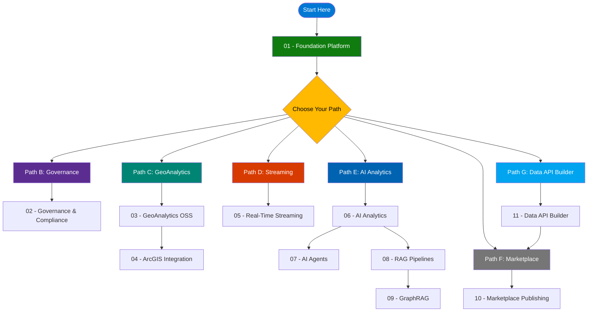

# Tutorials

Welcome to the CSA-in-a-Box tutorial series. These tutorials guide you through deploying, configuring, and extending the Cloud-Scale Analytics platform on Azure — from foundational infrastructure through AI-powered analytics and marketplace publishing.

!!! tip "New here?"
    Start with [01 — Foundation Platform](./01-foundation-platform/README.md). Every other path depends on it.

---

## Learning path

All paths begin with **01 — Foundation Platform**, which deploys the core Azure Landing Zone, Data Management Landing Zone, and Data Landing Zone infrastructure.

---

## Path A — Foundation (required)

- :material-foundation:{ .lg .middle } **01 — Foundation Platform**

    ***

    **3–4 hours**. Deploy ALZ, DMLZ, and DLZ with storage, Databricks, Synapse, Data Factory. Run your first dbt pipeline with USDA data through Bronze → Silver → Gold.

    *Prerequisites:* Azure subscription (Contributor+), Azure CLI 2.50+, Bicep CLI, Python 3.11+, Git.

    [:octicons-arrow-right-24: Start Tutorial 01](./01-foundation-platform/README.md)

---

## Path B — Governance & compliance

- :material-shield-check:{ .lg .middle } **02 — Governance & Compliance**

    ***

    **2–3 hours**. Configure Microsoft Purview for data cataloging, deploy Azure Policy guardrails, set up sensitivity labels, and implement row-level security.

    *Prerequisites:* Path A complete, Microsoft Purview access, Microsoft Entra ID P1+.

    [:octicons-arrow-right-24: Start Tutorial 02](./02-data-governance/README.md)

---

## Path C — GeoAnalytics

- :material-map-marker-radius:{ .lg .middle } **03 — GeoAnalytics OSS**

    ***

    **90 min**. Deploy PostGIS, process GeoParquet, H3 hexagonal indexing, and Apache Sedona on Databricks for spatial analytics.

    *Prerequisites:* Path A complete.

    [:octicons-arrow-right-24: Start Tutorial 03](./03-geoanalytics-oss/README.md)

- :material-earth:{ .lg .middle } **04 — ArcGIS Enterprise (BYOL)**

    ***

    **2 hours**. Provision Azure infrastructure for ArcGIS Enterprise, configure enterprise geodatabase, and publish feature services.

    *Prerequisites:* Path A + valid Esri ArcGIS Enterprise license (BYOL).

    [:octicons-arrow-right-24: Start Tutorial 04](./04-geoanalytics-arcgis/README.md)

---

## Path D — Real-time streaming

- :material-flash:{ .lg .middle } **05 — Real-Time Streaming (Lambda)**

    ***

    **90 min**. Deploy Lambda architecture with Event Hubs, Stream Analytics, Azure Data Explorer, and Cosmos DB. Build a real-time earthquake monitor.

    *Prerequisites:* Path A complete.

    [:octicons-arrow-right-24: Start Tutorial 05](./05-streaming-lambda/README.md)

---

## Path E — AI analytics

- :material-robot:{ .lg .middle } **06 — AI Analytics with Foundry**

    ***

    **90 min**. Deploy Azure AI Foundry with GPT-5.4, build a data-aware chatbot, deploy to Container Apps.

    [:octicons-arrow-right-24: Start Tutorial 06](./06-ai-analytics-foundry/README.md)

- :material-account-group:{ .lg .middle } **07 — AI Agents (Semantic Kernel)**

    ***

    **90 min**. Build single and multi-agent systems with Semantic Kernel, plugins, GroupChatOrchestration, and MCP tools.

    [:octicons-arrow-right-24: Start Tutorial 07](./07-agents-foundry-sk/README.md)

- :material-magnify:{ .lg .middle } **08 — RAG with AI Search**

    ***

    **90 min**. Hybrid vector + keyword + semantic reranking search; build a RAG chatbot over your data catalog.

    [:octicons-arrow-right-24: Start Tutorial 08](./08-rag-vector-search/README.md)

- :material-graph:{ .lg .middle } **09 — GraphRAG Knowledge Graphs**

    ***

    **90 min**. Build knowledge graphs with Microsoft GraphRAG, Cosmos DB Gremlin, and hybrid graph + vector search.

    [:octicons-arrow-right-24: Start Tutorial 09](./09-graphrag-knowledge/README.md)

*Prerequisites for Path E:* Path A complete, Azure OpenAI access approved. Tutorial 09 also requires Cosmos DB (Gremlin API).

---

## Path F — Marketplace publishing

- :material-storefront:{ .lg .middle } **10 — Data Marketplace**

    ***

    **60 min**. Register data products, run quality assessments, manage access requests, and sync with Purview catalog.

    *Prerequisites:* Path A + Cosmos DB deployed.

    [:octicons-arrow-right-24: Start Tutorial 10](./10-data-marketplace/README.md)

---

## Path G — Data API Builder & APIM gateway

- :material-api:{ .lg .middle } **11 — Data API Builder**

    ***

    **90 min**. Deploy Azure SQL + DAB on Container Apps, expose domain data as REST & GraphQL APIs, build a frontend catalog, and integrate with APIM as the unified Data Mesh gateway.

    *Prerequisites:* Path A + Azure SQL + Azure Container Apps.

    [:octicons-arrow-right-24: Start Tutorial 11](./11-data-api-builder/README.md)

---

## Quick-start recommendation

If you are new to CSA-in-a-Box, follow this order:

1. **01 — Foundation Platform** (required for all paths).
2. **02 — Governance** (recommended for production readiness).
3. Pick the path that matches your workload: GeoAnalytics, Streaming, AI, Marketplace, or Data API.

## Conventions

- Each tutorial has a `validate.sh` script that verifies successful completion.
- Code blocks prefixed with `$` are shell commands; those without are expected output.
- All resource naming follows the pattern `{prefix}-{service}-{environment}` (e.g., `csa-dlz-dev`).
- Estimated times assume familiarity with Azure CLI and basic cloud concepts.
