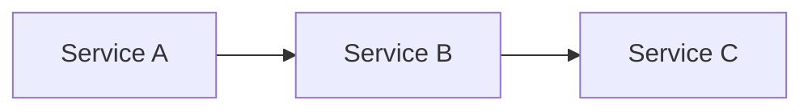

# Tutorial NN: [Title]

> **Estimated Time:** X hours
> **Difficulty:** Beginner | Intermediate | Advanced

## Prerequisites

- [ ] Completed [Tutorial 01 - Foundation Platform](../01-foundation-platform/README.md)
- [ ] Azure CLI 2.50+ installed (`az --version`)
- [ ] [Additional prerequisite]
- [ ] [Additional prerequisite]

## What You Will Build

[2-3 sentence description of what the reader will have at the end of this tutorial.]

## Architecture Diagram



<!-- Replace with actual architecture for this tutorial -->

---

## Step 1: [Step Title]

[Narrative explanation of what this step accomplishes and why.]

```bash
# Command(s) for this step
az group list --output table
```

<details>
<summary><strong>Expected Output</strong></summary>

```
Name                    Location       Status
----------------------  -------------  ---------
csa-rg-alz-dev          eastus         Succeeded
csa-rg-dlz-dev          eastus         Succeeded
```

</details>

### Troubleshooting

| Symptom      | Cause            | Fix          |
| ------------ | ---------------- | ------------ |
| `error: ...` | [Why it happens] | [How to fix] |

---

## Step 2: [Step Title]

[Repeat the pattern above for each step.]

```bash
# Command(s)
```

<details>
<summary><strong>Expected Output</strong></summary>

```
[expected output here]
```

</details>

### Troubleshooting

| Symptom      | Cause            | Fix          |
| ------------ | ---------------- | ------------ |
| `error: ...` | [Why it happens] | [How to fix] |

---

<!-- Repeat Step N sections as needed -->

---

## Validation

Run the validation script to confirm all resources are correctly deployed:

```bash
chmod +x validate.sh
./validate.sh
```

All checks should show `PASS`. If any check shows `FAIL`, review the troubleshooting section of the corresponding step.

## Completion Checklist

- [ ] [Resource/outcome 1] is deployed and accessible
- [ ] [Resource/outcome 2] is configured
- [ ] [Resource/outcome 3] produces expected results
- [ ] `validate.sh` reports all checks as PASS

## Next Steps

- Continue to [Tutorial NN+1: Title](../NN+1-slug/README.md)
- Explore [related documentation](../../ARCHITECTURE.md)

## Clean Up (Optional)

To remove all resources created in this tutorial:

```bash
az group delete --name <resource-group> --yes --no-wait
```

> **Warning:** This permanently deletes all resources in the resource group. Only run this if you are finished with the tutorial.
