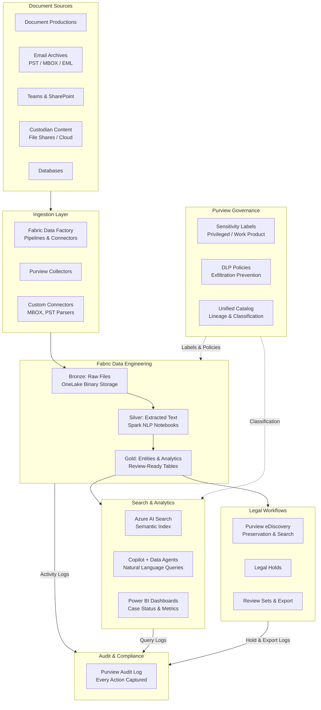
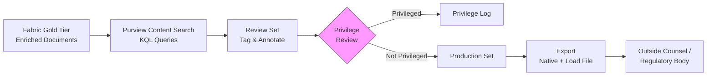

# AI-Enhanced Document Analytics & eDiscovery

Large-scale investigations — merger Second Requests, Civil Investigative Demands, regulatory inquiries — routinely produce document corpora measured in terabytes across dozens of data source types. Industry benchmarks from eDiscovery vendors report engagements involving 18 TB of data across 17+ data store types for a single DOJ Second Request ([HaystackID](https://haystackid.com/antitrust-investigation-services/)), with estimated costs of ~$4.3 million for contested mergers ([OpenText](https://blogs.opentext.com/beating-the-bad-odds-of-an-antitrust-investigation/)). Microsoft Fabric combined with Purview and Copilot provides a unified platform for text analytics, governed review, chain-of-custody audit, and defensible AI use on investigative data.

This guide walks through the architecture and implementation of a document analytics pipeline built on Fabric, from raw ingestion through entity extraction, semantic search, and eDiscovery export.

---

## The Document Analytics Challenge

Investigative document review sits at the intersection of data engineering, information governance, and legal process. The technical requirements are driven by both scale and legal defensibility:

**Scale and heterogeneity.** A typical Second Request or CID response involves tens of terabytes drawn from email archives (PST, MBOX, EML), collaboration platforms (SharePoint, Teams, Slack exports), structured databases, file shares, cloud storage, and mobile device captures. Each source type has its own metadata schema, encoding, and extraction requirements.

**Chain-of-custody integrity.** Every action taken on investigative data — ingestion, transformation, access, export — must be logged in a tamper-evident audit trail. Courts and regulators expect the producing party to demonstrate that no documents were altered, deleted, or accessed outside authorized channels between collection and production.

**Privilege review.** Attorney-client privilege and work product doctrine require that privileged documents be identified and withheld before production. Privilege review is traditionally the most expensive phase, often requiring manual review of hundreds of thousands of documents.

**Compressed timelines.** DOJ Second Requests carry statutory deadlines (typically 30 days from issuance, with negotiated extensions averaging ~106 days). Missing deadlines can result in adverse inferences or enforcement actions.

**Defensibility.** The methodology used for document review must withstand scrutiny. Courts have increasingly accepted technology-assisted review (TAR) and predictive coding, but the producing party must be able to explain and defend the approach, including any AI or analytics applied to the corpus.

!!! warning "Legal Coordination Required"
    Document analytics pipelines for investigative workloads must be designed in coordination with legal counsel. The technical architecture decisions described here — data residency, access controls, audit logging, AI governance — have direct legal implications. Engage your legal team before deploying.

---

## Architecture

The pipeline follows a medallion architecture pattern (bronze → silver → gold) within Fabric, with Purview providing governance controls at each tier and eDiscovery integration for legal workflows.



Key architectural decisions:

- **OneLake as the single copy.** All document data lands in OneLake once. Downstream processing (text extraction, NLP, search indexing) reads from OneLake rather than maintaining separate copies. This simplifies chain-of-custody tracking and reduces storage costs.
- **Delta Lake for immutability.** Bronze and silver tiers use Delta format with time travel enabled. Every transformation is versioned, supporting point-in-time reconstruction of the corpus state.
- **Purview as the governance plane.** Sensitivity labels, DLP policies, and audit logging are enforced by Purview across all Fabric workloads. This is not optional — investigative data requires end-to-end governance.

---

## Step-by-Step: Building a Document Analytics Pipeline

### Step 1 — Ingest Document Productions to OneLake

Document productions arrive in various formats — typically as structured directory trees on Azure Blob Storage or ADLS Gen2. The first step is landing this data into the Fabric Lakehouse bronze tier while preserving the original directory structure and file metadata.

```python
# Fabric notebook: Ingest document production to OneLake
from notebookutils import mssparkutils
from pyspark.sql import functions as F
from datetime import datetime

# Source: production data staged in ADLS
production_path = "abfss://productions@<storage>.dfs.core.windows.net/second-request-2024/"
target_path = "Tables/bronze_document_productions"

# Copy preserving directory structure and metadata
mssparkutils.fs.cp(production_path, target_path, recurse=True)

# Build a manifest of all ingested files for chain-of-custody
manifest_df = (
    spark.read.format("binaryFile")
    .option("recursiveFileLookup", "true")
    .load(target_path)
    .select(
        "path",
        "length",
        "modificationTime",
        F.sha2("content", 256).alias("sha256_hash"),
    )
    .withColumn("ingestion_timestamp", F.lit(datetime.utcnow().isoformat()))
    .withColumn("ingestion_batch", F.lit("SR-2024-001"))
)

manifest_df.write.format("delta").mode("append").saveAsTable("bronze.ingestion_manifest")

print(f"Ingested {manifest_df.count()} files into bronze tier.")
```

!!! tip "Hash Everything at Ingestion"
    Computing SHA-256 hashes at ingestion time creates a tamper-evident baseline. Any subsequent modification to a file can be detected by comparing the current hash against the ingestion manifest. This is a fundamental chain-of-custody control.

For email archives (PST, MBOX), use a preprocessing step to extract individual messages before loading into the bronze tier:

```python
# Fabric notebook: Extract messages from MBOX archives
import mailbox
import json
import os

def extract_mbox(mbox_path: str, output_dir: str) -> int:
    """Extract individual messages from an MBOX file to JSON."""
    mbox = mailbox.mbox(mbox_path)
    count = 0
    for i, message in enumerate(mbox):
        msg_data = {
            "message_id": message.get("Message-ID", f"unknown-{i}"),
            "from": message.get("From", ""),
            "to": message.get("To", ""),
            "cc": message.get("Cc", ""),
            "subject": message.get("Subject", ""),
            "date": message.get("Date", ""),
            "body": message.get_payload(decode=True).decode("utf-8", errors="replace")
            if not message.is_multipart()
            else "",
            "has_attachments": message.is_multipart(),
        }
        output_path = os.path.join(output_dir, f"msg_{i:08d}.json")
        with open(output_path, "w", encoding="utf-8") as f:
            json.dump(msg_data, f, ensure_ascii=False)
        count += 1
    return count
```

---

### Step 2 — Extract Text with Spark NLP

The silver tier normalizes all document types into a common text representation. This is where format-specific extraction logic runs at scale using Spark.

```python
# Fabric Spark notebook: Extract text from documents
from pyspark.sql import functions as F
from pyspark.sql.types import StringType, StructType, StructField
import fitz  # PyMuPDF for PDF
from docx import Document as DocxDocument
import email
import io

@F.udf(returnType=StringType())
def extract_text(content: bytes, file_type: str) -> str:
    """Extract text from various document formats."""
    if content is None:
        return ""
    try:
        if file_type == "pdf":
            doc = fitz.open(stream=content, filetype="pdf")
            return "\n".join(page.get_text() for page in doc)
        elif file_type in ("docx", "doc"):
            doc = DocxDocument(io.BytesIO(content))
            return "\n".join(p.text for p in doc.paragraphs)
        elif file_type == "eml":
            msg = email.message_from_bytes(content)
            payload = msg.get_payload(decode=True)
            return payload.decode("utf-8", errors="replace") if payload else ""
        elif file_type in ("txt", "csv", "log", "md"):
            return content.decode("utf-8", errors="replace")
        elif file_type == "json":
            return content.decode("utf-8", errors="replace")
        else:
            # Attempt UTF-8 decode as fallback
            return content.decode("utf-8", errors="replace")
    except Exception as e:
        return f"[EXTRACTION_ERROR: {str(e)}]"

# Read all documents from bronze tier
df = (
    spark.read.format("binaryFile")
    .option("recursiveFileLookup", "true")
    .load("Tables/bronze_document_productions/*")
)

# Extract text and compute metadata
df_extracted = (
    df.withColumn("file_type", F.lower(F.regexp_extract("path", r"\.(\w+)$", 1)))
    .withColumn("extracted_text", extract_text("content", "file_type"))
    .withColumn("word_count", F.size(F.split("extracted_text", r"\s+")))
    .withColumn("char_count", F.length("extracted_text"))
    .withColumn("extraction_timestamp", F.current_timestamp())
    .withColumn(
        "extraction_status",
        F.when(F.col("extracted_text").startswith("[EXTRACTION_ERROR"), "failed")
        .otherwise("success"),
    )
)

# Write to silver tier (drop binary content to save storage)
df_extracted.select(
    "path",
    "file_type",
    "extracted_text",
    "word_count",
    "char_count",
    "modificationTime",
    "extraction_timestamp",
    "extraction_status",
).write.format("delta").mode("overwrite").saveAsTable("silver.document_extracts")

# Report extraction results
extraction_stats = df_extracted.groupBy("extraction_status").count().collect()
for row in extraction_stats:
    print(f"  {row['extraction_status']}: {row['count']} documents")
```

!!! info "Handling Extraction Failures"
    Documents that fail text extraction (corrupted files, unsupported formats, password-protected archives) are flagged with `extraction_status = 'failed'` rather than silently dropped. These must be routed to manual processing — in an investigative context, you cannot simply ignore documents that resist automated extraction.

---

### Step 3 — Entity Recognition and Classification

The gold tier enriches extracted text with named entities — organizations, people, monetary values, dates, locations — to support investigator queries and privilege review.

```python
# Fabric Spark notebook: Named entity recognition
from synapse.ml.services import AnalyzeText
from pyspark.sql import functions as F

# Load silver tier extracts (successful extractions only)
df_text = (
    spark.read.table("silver.document_extracts")
    .filter(F.col("extraction_status") == "success")
    .filter(F.col("word_count") > 5)  # Skip near-empty documents
)

# Azure AI Language for entity recognition
# Requires AI Services linked service in Fabric workspace
entity_results = (
    AnalyzeText()
    .setTextCol("extracted_text")
    .setKind("EntityRecognition")
    .setOutputCol("entities")
    .setLinkedService("<ai-services-linked-service>")
    .transform(df_text.select("path", "extracted_text"))
)

# Flatten entities into a queryable table
entities_flat = entity_results.select(
    "path",
    F.explode("entities.documents.entities").alias("entity"),
).select(
    "path",
    F.col("entity.text").alias("entity_text"),
    F.col("entity.category").alias("entity_type"),
    F.col("entity.subcategory").alias("entity_subtype"),
    F.col("entity.confidenceScore").alias("confidence"),
)

# Filter to high-confidence entities
entities_filtered = entities_flat.filter(F.col("confidence") >= 0.75)

entities_filtered.write.format("delta").mode("overwrite").saveAsTable(
    "gold.document_entities"
)

# Build entity summary for case overview
entity_summary = (
    entities_filtered.groupBy("entity_type", "entity_text")
    .agg(
        F.count("*").alias("mention_count"),
        F.countDistinct("path").alias("document_count"),
        F.avg("confidence").alias("avg_confidence"),
    )
    .orderBy(F.desc("document_count"))
)

entity_summary.write.format("delta").mode("overwrite").saveAsTable(
    "gold.entity_summary"
)
```

For privilege detection, apply a keyword-based pre-screen combined with entity co-occurrence analysis:

```python
# Privilege pre-screen: flag documents mentioning attorneys or legal terms
privilege_keywords = [
    "attorney-client",
    "privileged",
    "work product",
    "legal advice",
    "attorney",
    "counsel",
    "litigation hold",
    "in confidence",
]

keyword_pattern = "|".join(privilege_keywords)

df_privilege = (
    spark.read.table("silver.document_extracts")
    .filter(F.col("extraction_status") == "success")
    .withColumn(
        "privilege_flag",
        F.when(
            F.lower(F.col("extracted_text")).rlike(keyword_pattern), True
        ).otherwise(False),
    )
    .withColumn(
        "privilege_keyword_matches",
        F.size(
            F.array_distinct(
                F.expr(
                    f"filter(array({','.join(repr(k) for k in privilege_keywords)}), "
                    f"k -> lower(extracted_text) like concat('%', k, '%'))"
                )
            )
        ),
    )
)

# Documents flagged for privilege review
df_privilege.filter(F.col("privilege_flag")).select(
    "path", "file_type", "privilege_keyword_matches", "word_count"
).write.format("delta").mode("overwrite").saveAsTable("gold.privilege_review_queue")
```

!!! warning "Privilege Review is Not Fully Automatable"
    Keyword-based and NLP-based privilege screening are pre-filters, not replacements for attorney review. The output of this step is a prioritized review queue — documents with a high likelihood of privilege are surfaced first, but final privilege determinations must be made by qualified attorneys.

---

### Step 4 — Configure Purview Sensitivity Labels and DLP

Purview sensitivity labels enforce information protection across the Fabric workspace. For investigative data, configure labels that restrict access and prevent unauthorized export.

```powershell
# PowerShell: Configure sensitivity labels (Security & Compliance PowerShell)
# Connect first: Connect-IPPSSession

# Create the label
New-Label -DisplayName "Confidential - Attorney Work Product" `
    -Tooltip "Contains attorney-client privileged material. Do not distribute." `
    -ContentType "File, Email" `
    -EncryptionEnabled $true `
    -EncryptionProtectionType "Template" `
    -EncryptionTemplateId "<RMS-template-id>" `
    -Comment "Applied to documents flagged during privilege review"

# Create a sublabel for investigation data
New-Label -DisplayName "Investigation Data - Restricted" `
    -ParentId "<parent-label-id>" `
    -Tooltip "Second Request / CID production data. Access restricted to case team." `
    -ContentType "File, Email" `
    -EncryptionEnabled $true `
    -EncryptionProtectionType "Template" `
    -EncryptionTemplateId "<RMS-template-id>"
```

Configure DLP policies to prevent exfiltration of labeled content:

```powershell
# DLP policy: Block sharing of investigation data outside case team
New-DlpCompliancePolicy -Name "Investigation Data Protection" `
    -ExchangeLocation All `
    -SharePointLocation All `
    -OneDriveLocation All `
    -Mode Enable

New-DlpComplianceRule -Policy "Investigation Data Protection" `
    -Name "Block external sharing of privileged content" `
    -ContentContainsSensitiveInformation @{
        Name = "Confidential - Attorney Work Product"
    } `
    -BlockAccess $true `
    -BlockAccessScope NotInOrganization
```

Configure audit logging for the Fabric workspace:

| Audit Category | What Is Captured | Retention |
|---|---|---|
| Data access | Every read/query against Lakehouse tables | 1 year (standard) or 10 years (Audit Premium) |
| Data modification | All writes, updates, deletes in Delta tables | 1 year / 10 years |
| Sharing & export | Any attempt to share or export workspace artifacts | 1 year / 10 years |
| Copilot interactions | All prompts submitted and responses generated | 1 year / 10 years |
| Admin actions | Workspace configuration changes, permission grants | 1 year / 10 years |

!!! tip "Audit Premium for Investigations"
    Standard Microsoft 365 audit logs retain data for 1 year. For investigative workloads where chain-of-custody must be maintained for the duration of litigation (potentially years), enable Audit Premium with 10-year retention. This is configured at the tenant level and requires E5 or E5 Compliance licensing.

---

### Step 5 — Index for Semantic Search with Azure AI Search

Build a search index over the extracted and enriched document corpus. This enables both programmatic queries and natural-language search through Copilot.

```python
# Fabric notebook: Index documents into Azure AI Search
from azure.search.documents.indexes import SearchIndexClient
from azure.search.documents.indexes.models import (
    SearchIndex,
    SimpleField,
    SearchableField,
    SearchFieldDataType,
    SemanticConfiguration,
    SemanticField,
    SemanticPrioritizedFields,
    SemanticSearch,
)
from azure.search.documents import SearchClient
from azure.identity import DefaultAzureCredential

credential = DefaultAzureCredential()
endpoint = "https://<search-service>.search.windows.net"

# Define the index schema
index = SearchIndex(
    name="investigation-documents",
    fields=[
        SimpleField(
            name="id", type=SearchFieldDataType.String, key=True, filterable=True
        ),
        SearchableField(
            name="content",
            type=SearchFieldDataType.String,
            analyzer_name="en.microsoft",
        ),
        SimpleField(
            name="file_path", type=SearchFieldDataType.String, filterable=True
        ),
        SimpleField(
            name="file_type",
            type=SearchFieldDataType.String,
            filterable=True,
            facetable=True,
        ),
        SimpleField(
            name="custodian",
            type=SearchFieldDataType.String,
            filterable=True,
            facetable=True,
        ),
        SimpleField(
            name="date_modified", type=SearchFieldDataType.DateTimeOffset, sortable=True
        ),
        SimpleField(
            name="word_count", type=SearchFieldDataType.Int32, sortable=True
        ),
        SearchableField(name="entities", type=SearchFieldDataType.String),
        SimpleField(
            name="privilege_flag", type=SearchFieldDataType.Boolean, filterable=True
        ),
    ],
    semantic_search=SemanticSearch(
        configurations=[
            SemanticConfiguration(
                name="investigation-semantic",
                prioritized_fields=SemanticPrioritizedFields(
                    content_fields=[SemanticField(field_name="content")]
                ),
            )
        ]
    ),
)

# Create or update the index
index_client = SearchIndexClient(endpoint=endpoint, credential=credential)
index_client.create_or_update_index(index)
print(f"Index '{index.name}' created/updated.")

# Batch-upload documents from gold tier
search_client = SearchClient(
    endpoint=endpoint, index_name="investigation-documents", credential=credential
)

# Read from Lakehouse and push to search index
docs_df = spark.read.table("silver.document_extracts").filter(
    F.col("extraction_status") == "success"
)
entities_df = spark.read.table("gold.document_entities")

# Join entities as concatenated string per document
entities_agg = entities_df.groupBy("path").agg(
    F.concat_ws("; ", F.collect_set("entity_text")).alias("entities_text")
)

indexed_df = docs_df.join(entities_agg, "path", "left")

# Upload in batches (Azure AI Search limit: 1000 docs per batch)
batch_size = 1000
rows = indexed_df.collect()
for i in range(0, len(rows), batch_size):
    batch = []
    for row in rows[i : i + batch_size]:
        batch.append(
            {
                "id": row["path"].replace("/", "_").replace(".", "_"),
                "content": row["extracted_text"][:32766],  # Field size limit
                "file_path": row["path"],
                "file_type": row["file_type"],
                "entities": row.get("entities_text", ""),
            }
        )
    result = search_client.upload_documents(documents=batch)
    print(f"  Uploaded batch {i // batch_size + 1}: {len(batch)} documents")
```

!!! info "Content Truncation"
    Azure AI Search has a 32,766 character limit per string field. For documents exceeding this limit, consider chunking the content into multiple index entries with a shared document ID, or storing the full text in OneLake and indexing only the first N characters plus extracted entities.

---

### Step 6 — Copilot and Data Agents for Investigator Queries

With the document corpus indexed and enriched, Copilot in Fabric enables investigators to query the data using natural language. Fabric Data Agents can be configured to provide domain-specific query capabilities.

**Example investigator queries:**

| Query | What It Does |
|---|---|
| "Find all communications between Company A and Company B executives about pricing in Q3 2024" | Semantic search filtered by entity co-occurrence and date range |
| "Show documents mentioning market allocation in the telecommunications sector" | Keyword + semantic search across the corpus |
| "Summarize the key terms discussed in the merger agreement attachments" | Retrieval-augmented summarization over relevant document subset |
| "Which custodians have the most documents mentioning competitive intelligence?" | Aggregation query against entity and custodian metadata |
| "List all documents flagged for privilege review that mention outside counsel" | Filtered query combining privilege flags and entity matching |

Copilot queries execute against the Lakehouse tables and Azure AI Search index. The underlying data access is governed by workspace permissions and sensitivity labels — Copilot cannot surface content that the querying user does not have permission to view.

!!! warning "Copilot Governance"
    Microsoft Purview provides governance controls for Copilot interactions in Fabric:

    - **Audit**: All Copilot prompts and responses are logged in Purview Audit
    - **eDiscovery**: AI-generated content is discoverable and preservable
    - **Retention**: Copilot interactions follow workspace retention policies
    - **DSPM for AI**: Data Security Posture Management detects risky AI usage patterns

    See [Purview governance for Copilot in Fabric](https://learn.microsoft.com/en-us/purview/ai-copilot-fabric) for configuration details.

To create a custom Data Agent for investigative queries:

1. In the Fabric workspace, create a new Data Agent artifact
2. Connect it to the `gold` Lakehouse tables and the Azure AI Search index
3. Provide system instructions that constrain the agent to investigative queries and enforce output formatting (e.g., always cite source document paths)
4. Publish the agent to the case team with appropriate RBAC

---

### Step 7 — eDiscovery Export and Preservation

Purview eDiscovery (Premium) integrates with the Fabric pipeline for legal hold, search, and export workflows.

**Legal holds** prevent deletion or modification of custodian content across Microsoft 365 workloads (Exchange, SharePoint, OneDrive, Teams). When applied to custodians associated with an investigation, holds ensure that relevant content is preserved regardless of user actions or retention policies.

**Content search** in eDiscovery can query across Microsoft 365 sources and, with appropriate connectors, surface content indexed from the Fabric pipeline. Search queries support KQL syntax for precise filtering:

```
(sender:john@companya.com OR recipients:john@companya.com)
AND (subject:"pricing" OR body:"market allocation")
AND date:2024-07-01..2024-09-30
```

**Review sets** allow case teams to collect search results into a dedicated review environment where documents can be tagged, annotated, and assessed for relevance and privilege.

**Export** produces documents in standard formats accepted by opposing counsel and regulators:

| Export Format | Use Case |
|---|---|
| PST | Email productions |
| Native files | Document productions with original metadata |
| PDF + load file | Processed productions with Bates numbering |
| CSV manifest | Chain-of-custody documentation |



!!! tip "Defensibility Documentation"
    For each production, generate a methodology memo documenting:

    - Data sources collected and collection methods
    - Processing steps applied (text extraction, deduplication, NLP)
    - Search terms and queries used to identify responsive documents
    - TAR/analytics methodology and validation metrics
    - Privilege review process and quality control measures
    - Export specifications and Bates numbering scheme

    This documentation is critical if the methodology is challenged by opposing counsel or the court.

---

## Industry Benchmarks

The following figures are drawn from published third-party sources and provide context for the scale and cost of investigative document review. These are not Microsoft claims.

| Metric | Value | Source |
|---|---|---|
| Document volume (DOJ Second Request) | 18 TB across 17+ data store types | [HaystackID](https://haystackid.com/antitrust-investigation-services/) |
| Average cost (contested merger Second Request) | ~$4.3 million, up to $9 million | [OpenText](https://blogs.opentext.com/beating-the-bad-odds-of-an-antitrust-investigation/) |
| Timeline (DOJ Second Request) | ~106 days average | [HaystackID](https://haystackid.com/antitrust-investigation-services/) |
| Review cost reduction with TAR | 50-80% vs. linear manual review | Industry consensus (various EDRM studies) |

!!! info "Technology-Assisted Review"
    TAR, predictive coding, and advanced analytics are routinely accepted by the DOJ and FTC for Second Request compliance. The seminal case *Da Silva Moore v. Publicis Groupe* (2012) established judicial acceptance of TAR, and subsequent rulings have reinforced that TAR can be more accurate than exhaustive manual review. See [FTI Technology](https://ftitechnology.com/solutions/second-requests) and [TransPerfect Legal](https://www.transperfectlegal.com/practice-groups/second-requests-mergers-acquisition) for industry context.

---

## Evidence: Production Deployments

| Organization | Use Case | Source |
|---|---|---|
| Microsoft (internal) | Enterprise data governance transformation with Purview + Fabric | [Microsoft Inside Track](https://www.microsoft.com/insidetrack/blog/transforming-data-governance-at-microsoft-with-microsoft-purview-and-microsoft-fabric/) |
| Microsoft (internal) | Purview Unified Catalog for estate-wide data governance | [Microsoft Inside Track](https://www.microsoft.com/insidetrack/blog/powering-data-governance-at-microsoft-with-purview-unified-catalog/) |

---

## Operational Considerations

**Workspace isolation.** Create a dedicated Fabric workspace per investigation. Do not co-mingle investigative data with operational analytics workloads. Apply workspace-level RBAC so that only authorized case team members can access the data.

**Data residency.** Confirm that the Fabric capacity region and OneLake storage region comply with any data residency requirements (e.g., data that must remain within a specific jurisdiction). This is particularly relevant for cross-border investigations.

**Capacity sizing.** Text extraction and NLP processing on multi-terabyte corpora require substantial Spark compute. Plan for F64 or higher Fabric capacity during peak processing phases, with the option to scale down during review phases when the workload shifts to interactive queries.

**Cost management.** The primary cost drivers are:

- Fabric capacity units (CU) during Spark processing
- Azure AI Services calls for entity recognition (per-transaction pricing)
- Azure AI Search units for the semantic index
- Purview eDiscovery Premium licensing (per-user)
- Storage in OneLake (per-GB, relatively low cost)

!!! tip "Pause Capacity After Processing"
    Fabric capacity can be paused when not actively running Spark jobs. During review phases — when investigators are querying the indexed data through Copilot or Power BI — the compute requirements are significantly lower. Schedule capacity scaling based on the investigation phase.

---

## Related Resources

- [Purview eDiscovery Documentation](https://learn.microsoft.com/en-us/purview/ediscovery-manage-legal-investigations)
- [Governance and Compliance in Fabric](https://learn.microsoft.com/en-us/fabric/governance/governance-compliance-overview)
- [Purview for Copilot in Fabric](https://learn.microsoft.com/en-us/purview/ai-copilot-fabric)
- [DSPM for AI in Purview](https://learn.microsoft.com/en-us/purview/ai-microsoft-purview)
- [Unified Analytics Platform on Fabric](fabric-unified-analytics.md) — companion guide for the data platform layer
- [Antitrust Analytics on Azure](antitrust-analytics.md) — DOJ-specific analytical context
- [Azure Analytics: White Papers & Resources](azure-analytics-resources.md) — eDiscovery section
