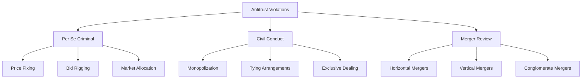
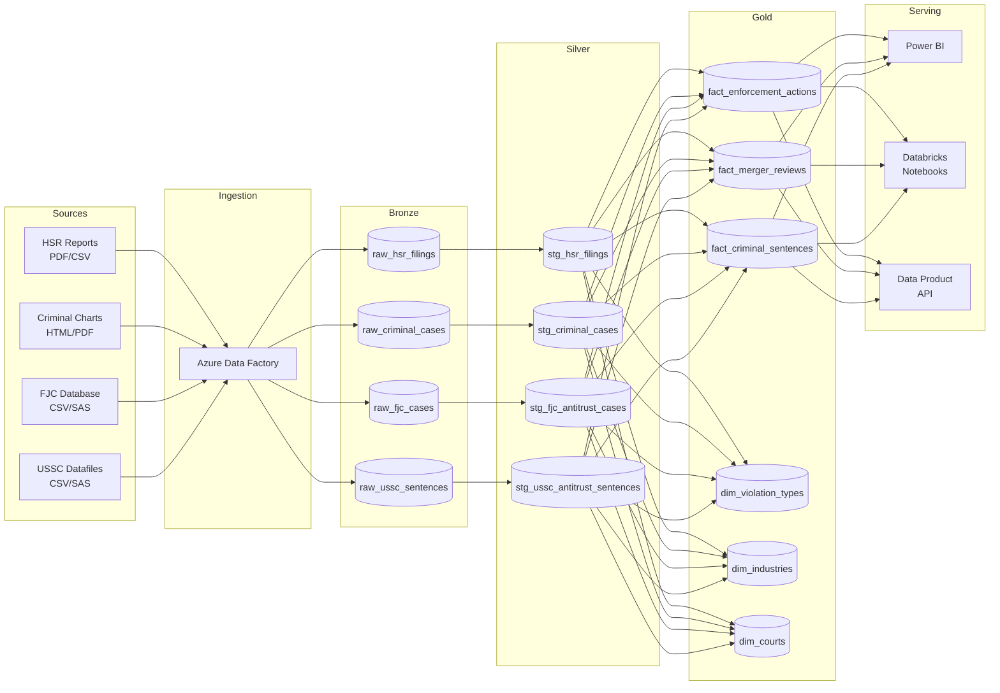
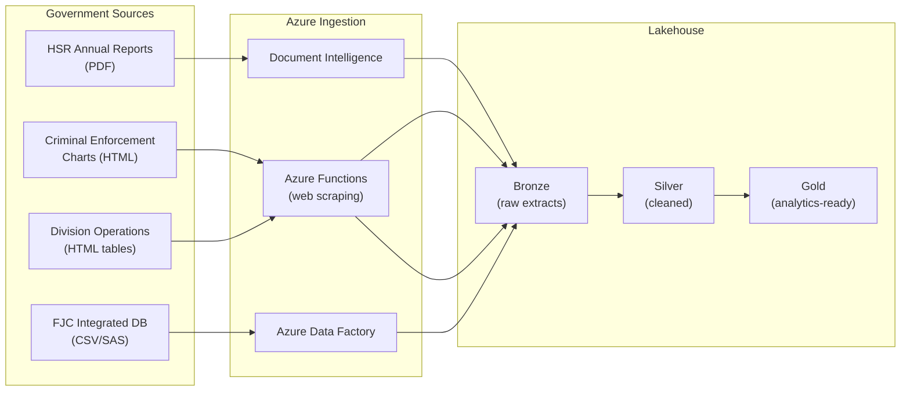

## Antitrust Analytics on Azure

Antitrust enforcement generates vast amounts of structured and semi-structured public data — merger filings, criminal enforcement actions, sentencing statistics, and judicial opinions. This use case demonstrates how CSA-in-a-Box patterns transform these disparate sources into a unified analytics platform on Azure.

---

## What is Antitrust Analytics?

Antitrust analytics applies data engineering and analytical techniques to competition law enforcement data. The goal is to identify trends in merger review activity, criminal prosecution outcomes, penalty severity, and enforcement priorities over time.

Typical consumers of antitrust analytics include:

- **Law firms** advising clients on merger clearance risk and criminal exposure
- **Corporate compliance teams** benchmarking enforcement trends
- **Economists** studying market concentration and competition policy
- **Policy researchers** evaluating the effectiveness of enforcement programs
- **Government agencies** tracking their own enforcement metrics

---

## DOJ Antitrust Division Overview

The U.S. Department of Justice Antitrust Division is the federal agency responsible for enforcing federal antitrust laws. Its mission is to promote economic competition through enforcement, advocacy, and education.

The Division's work falls into two main categories:

### Civil Enforcement

Civil enforcement focuses on mergers and acquisitions that may substantially lessen competition, as well as civil non-merger conduct cases (monopolization, anticompetitive agreements). The Hart-Scott-Rodino (HSR) Act requires parties to notify the DOJ and FTC before completing transactions above certain thresholds.

### Criminal Enforcement

Criminal enforcement targets per se violations of the Sherman Act — price-fixing, bid-rigging, and market allocation schemes. These cases carry significant penalties including corporate fines and individual imprisonment.

---

## Types of Antitrust Violations

The three primary federal antitrust statutes create the analytical framework for enforcement data:

| Statute         | Year | Scope            | Key Provisions                                                                          |
| --------------- | ---- | ---------------- | --------------------------------------------------------------------------------------- |
| **Sherman Act** | 1890 | Criminal & Civil | Section 1: agreements in restraint of trade; Section 2: monopolization                  |
| **Clayton Act** | 1914 | Civil            | Section 7: mergers that substantially lessen competition; Section 3: tying arrangements |
| **FTC Act**     | 1914 | Civil (FTC only) | Section 5: unfair methods of competition; unfair or deceptive acts                      |

!!! info "Criminal vs. Civil"
Only the Sherman Act carries criminal penalties. Clayton Act and FTC Act violations are civil matters. The DOJ has exclusive authority over criminal antitrust enforcement; the FTC shares civil merger review authority under the HSR Act.

### Common Violation Categories



---

## Key Data Sources

Antitrust analytics draws from several authoritative public data sources. Each maps to a distinct ingestion pattern in the CSA-in-a-Box medallion architecture.

| Source                          | Publisher                  | Data Type                                            | Update Frequency | URL                                                                                         |
| ------------------------------- | -------------------------- | ---------------------------------------------------- | ---------------- | ------------------------------------------------------------------------------------------- |
| **HSR Annual Reports**          | FTC & DOJ (joint)          | Merger filings, second requests, enforcement actions | Annual           | [ftc.gov/legal-library](https://www.ftc.gov/legal-library/browse/reports)                   |
| **Criminal Enforcement Charts** | DOJ Antitrust Division     | Fines, jail sentences, cases by year                 | Periodic         | [justice.gov/atr](https://www.justice.gov/atr/criminal-enforcement-fine-and-jail-charts)    |
| **DOJ Antitrust Division**      | DOJ                        | Press releases, case filings, policy documents       | Ongoing          | [justice.gov/atr](https://www.justice.gov/atr)                                              |
| **FJC Integrated Database**     | Federal Judicial Center    | Federal court case filings and terminations          | Quarterly        | [fjc.gov/research/idb](https://www.fjc.gov/research/idb)                                    |
| **USSC Datafiles**              | U.S. Sentencing Commission | Individual sentencing records                        | Annual           | [ussc.gov/research/datafiles](https://www.ussc.gov/research/datafiles/commission-datafiles) |

!!! tip "Data Freshness"
Most antitrust data sources update on annual or quarterly cycles. Design your ingestion pipelines with appropriate scheduling — daily polling is unnecessary and may trigger rate limiting on government sites.

---

## Reference Architecture

The antitrust analytics platform follows the standard CSA-in-a-Box medallion architecture with domain-specific adaptations.



### Azure Services Used

| Service                          | Role                                                 |
| -------------------------------- | ---------------------------------------------------- |
| **Azure Data Factory**           | Orchestration and ingestion from public data sources |
| **Azure Data Lake Storage Gen2** | Medallion layer storage (Bronze/Silver/Gold)         |
| **Azure Databricks**             | dbt transformations and analytical notebooks         |
| **Delta Lake**                   | Table format for ACID transactions and time travel   |
| **Microsoft Purview**            | Data catalog, lineage, and governance                |
| **Power BI**                     | Dashboards and self-service analytics                |
| **Azure Key Vault**              | Secrets management for service connections           |

---

## Example Analytics

### Merger Review Trends

Track HSR filing volumes, second request rates, and enforcement outcomes over time to identify shifts in merger review intensity.

```sql
-- Gold layer: Annual merger review summary
SELECT
    fiscal_year,
    total_hsr_filings,
    second_requests_issued,
    ROUND(second_requests_issued * 100.0 / NULLIF(total_hsr_filings, 0), 2)
        AS second_request_rate_pct,
    mergers_challenged,
    mergers_abandoned_after_second_request
FROM {{ ref('fact_merger_reviews') }}
ORDER BY fiscal_year DESC
```

### Criminal Enforcement Patterns

Analyze criminal prosecution trends including case volumes, fine amounts, and imprisonment rates by violation type.

```sql
-- Gold layer: Criminal enforcement by violation type
SELECT
    violation_type,
    fiscal_year,
    COUNT(*) AS cases_filed,
    SUM(corporate_fine_amount) AS total_corporate_fines,
    AVG(individual_sentence_months) AS avg_sentence_months,
    SUM(CASE WHEN imprisonment_imposed THEN 1 ELSE 0 END) AS individuals_imprisoned
FROM {{ ref('fact_criminal_sentences') }}
GROUP BY violation_type, fiscal_year
ORDER BY fiscal_year DESC, total_corporate_fines DESC
```

### Penalty Analysis

Compare penalty severity across time periods and violation categories to identify sentencing trends.

```sql
-- Gold layer: Penalty trend analysis
SELECT
    fiscal_year,
    violation_category,
    PERCENTILE_CONT(0.5) WITHIN GROUP (ORDER BY fine_amount) AS median_fine,
    MAX(fine_amount) AS max_fine,
    PERCENTILE_CONT(0.5) WITHIN GROUP (ORDER BY sentence_months) AS median_sentence_months
FROM {{ ref('fact_enforcement_actions') }}
WHERE enforcement_type = 'criminal'
GROUP BY fiscal_year, violation_category
```

---

## How the DOJ Domain Demonstrates the Pattern

The `domains/doj_antitrust/` directory in this repository is a complete, working implementation of the antitrust analytics use case. It demonstrates every layer of the CSA-in-a-Box pattern:

| Layer              | Implementation                                             |
| ------------------ | ---------------------------------------------------------- |
| **Seed data**      | Public enforcement statistics loaded as dbt seeds          |
| **Bronze models**  | Raw ingestion with source metadata and load timestamps     |
| **Silver models**  | Cleaned, typed, and deduplicated staging models            |
| **Gold models**    | Business-ready fact and dimension tables                   |
| **Data quality**   | Flag-don't-drop pattern for enforcement data integrity     |
| **Data contracts** | YAML-based data product contracts for downstream consumers |
| **Analytics**      | Databricks notebooks with enforcement trend analysis       |

!!! tip "Try It Yourself"
See the [DOJ Antitrust: Step-by-Step Domain Build](doj-antitrust-deep-dive.md) for a complete walkthrough of how this domain was constructed.

---

## Published Resources

### Official Reports & White Papers

| Publication                                                                                                                          | Publisher                     | Description                                                                                                |
| ------------------------------------------------------------------------------------------------------------------------------------ | ----------------------------- | ---------------------------------------------------------------------------------------------------------- |
| [Microsoft Digital Defense Report 2025](https://aka.ms/Microsoft-Digital-Defense-Report-2025)                                        | Microsoft Security (Oct 2025) | Annual threat landscape analysis — relevant to securing enforcement data platforms                         |
| [Azure Synapse Security White Paper](https://learn.microsoft.com/azure/synapse-analytics/guidance/security-white-paper-introduction) | Microsoft                     | Multi-part white paper on securing analytics workloads — data protection, access control, network security |

### Government Data Sources

- [DOJ Antitrust Division](https://www.justice.gov/atr) — Official division homepage with press releases, case filings, and policy documents
- [Federal Judicial Center Integrated Database](https://www.fjc.gov/research/idb) — Federal court case data
- [U.S. Sentencing Commission Datafiles](https://www.ussc.gov/research/datafiles/commission-datafiles) — Individual-level sentencing data

### Azure Architecture References

- [Analytics End-to-End with Azure](https://learn.microsoft.com/en-us/azure/architecture/example-scenario/dataplate2e/data-platform-end-to-end) — Microsoft reference architecture
- [Cloud-Scale Analytics](https://learn.microsoft.com/en-us/azure/cloud-adoption-framework/scenarios/cloud-scale-analytics/) — Cloud Adoption Framework analytics scenario
- [Azure FedRAMP High Authorization](https://learn.microsoft.com/azure/compliance/offerings/offering-fedramp) — Compliance documentation for government analytics workloads

---

## Ingesting Government Antitrust Data with Azure

The DOJ and FTC publish structured enforcement data in PDF reports, HTML tables, and downloadable datasets. This section shows how to build automated pipelines that ingest these sources into a lakehouse using Azure services.

### Source-to-Lakehouse Pipeline Overview



### 1. HSR Annual Reports → Azure Document Intelligence

The [Hart-Scott-Rodino Annual Reports](https://www.ftc.gov/legal-library/browse/reports) are published as PDFs with tables containing merger filing statistics. Azure Document Intelligence (formerly Form Recognizer) extracts structured data from these documents.

**Azure services:** Document Intelligence + Azure Functions + ADLS Gen2

```python
# Azure Function: Extract tables from HSR Annual Report PDF
from azure.ai.formrecognizer import DocumentAnalysisClient
from azure.identity import DefaultAzureCredential

def extract_hsr_tables(pdf_url: str) -> list[dict]:
    """Extract merger filing tables from HSR Annual Report PDF."""
    client = DocumentAnalysisClient(
        endpoint="https://<your-resource>.cognitiveservices.azure.com/",
        credential=DefaultAzureCredential(),
    )

    # prebuilt-layout extracts tables, key-value pairs, and text
    poller = client.begin_analyze_document_from_url(
        "prebuilt-layout", pdf_url
    )
    result = poller.result()

    tables = []
    for table in result.tables:
        rows = []
        for cell in table.cells:
            while len(rows) <= cell.row_index:
                rows.append({})
            # Use first row as headers
            if cell.row_index == 0:
                continue
            header = table.cells[cell.column_index].content
            rows[cell.row_index][header] = cell.content
        tables.append({"row_count": table.row_count, "data": rows[1:]})

    return tables
```

**Pipeline steps:**

1. **Download** — Azure Function fetches PDF from `ftc.gov` on a scheduled trigger (annually)
2. **Extract** — Document Intelligence extracts tables into structured JSON
3. **Land** — Write raw JSON to `bronze/hsr_annual_reports/` in ADLS Gen2
4. **Transform** — dbt model cleans and types the extracted data into silver
5. **Serve** — Gold-layer `gld_merger_review_summary` aggregates across fiscal years

### 2. Criminal Enforcement Charts → Web Scraping + Azure Functions

The [DOJ Criminal Enforcement Fine and Jail Charts](https://www.justice.gov/atr/criminal-enforcement-fine-and-jail-charts) publish historical fine amounts and jail sentences as HTML pages with embedded data.

**Azure services:** Azure Functions (timer-triggered) + ADLS Gen2

```python
# Azure Function: Scrape DOJ criminal enforcement trend data
import httpx
from bs4 import BeautifulSoup
import json, datetime

def scrape_criminal_enforcement() -> list[dict]:
    """Scrape fine and jail trend data from DOJ ATR charts page."""
    url = "https://www.justice.gov/atr/criminal-enforcement-fine-and-jail-charts"
    resp = httpx.get(url, follow_redirects=True, timeout=30)
    soup = BeautifulSoup(resp.text, "html.parser")

    records = []
    for table in soup.find_all("table"):
        headers = [th.get_text(strip=True) for th in table.find_all("th")]
        for row in table.find_all("tr")[1:]:
            cells = [td.get_text(strip=True) for td in row.find_all("td")]
            if len(cells) == len(headers):
                records.append(dict(zip(headers, cells)))

    return records

def upload_to_bronze(records: list[dict]):
    """Write scraped data to ADLS bronze layer as JSON."""
    from azure.storage.filedatalake import DataLakeServiceClient
    from azure.identity import DefaultAzureCredential

    client = DataLakeServiceClient(
        account_url="https://<storage>.dfs.core.windows.net",
        credential=DefaultAzureCredential(),
    )
    fs = client.get_file_system_client("bronze")
    today = datetime.date.today().isoformat()
    file = fs.get_file_client(f"doj/criminal_enforcement/{today}.json")
    file.upload_data(json.dumps(records, indent=2), overwrite=True)
```

**Scheduling:** Deploy as a timer-triggered Azure Function that runs quarterly (DOJ updates charts ~annually, but quarterly checks catch updates early).

### 3. Division Operations Data → ADF + Databricks

The [Division Operations & Accomplishments](https://www.justice.gov/atr/division-operations) page publishes workload statistics in HTML tables that change format occasionally.

**Azure services:** Azure Data Factory (Web Activity) + Databricks notebook

```python
# Databricks notebook: Parse DOJ Division Operations HTML
import requests
from bs4 import BeautifulSoup
import pandas as pd

url = "https://www.justice.gov/atr/division-operations"
resp = requests.get(url, timeout=30)
soup = BeautifulSoup(resp.text, "html.parser")

# Extract all tables from the page
dfs = pd.read_html(resp.text)

# Each table covers a different metric (cases filed, investigations, etc.)
for i, df in enumerate(dfs):
    table_name = f"division_operations_table_{i}"
    spark_df = spark.createDataFrame(df)
    spark_df.write.format("delta").mode("overwrite").saveAsTable(
        f"bronze.doj.{table_name}"
    )
    print(f"Wrote {len(df)} rows to bronze.doj.{table_name}")
```

**ADF orchestration:** A Data Factory pipeline uses a Web Activity to check the page's `Last-Modified` header, then triggers the Databricks notebook only when the page has been updated.

### 4. FTC Big Data Report → Document Intelligence

The [FTC Big Data Report](https://www.ftc.gov/system/files/documents/reports/big-data-tool-inclusion-or-exclusion-understanding-issues/160106big-data-rpt.pdf) is a 62-page policy document. While not tabular data, Azure AI services can extract key findings and build a searchable knowledge base.

**Azure services:** Document Intelligence + Azure AI Search + Azure OpenAI

```python
# Index FTC report into Azure AI Search for RAG queries
from azure.search.documents import SearchClient
from azure.search.documents.indexes import SearchIndexClient
from azure.ai.formrecognizer import DocumentAnalysisClient

def index_ftc_report(pdf_url: str):
    """Extract text from FTC report and index for semantic search."""
    # 1. Extract full text with Document Intelligence
    doc_client = DocumentAnalysisClient(...)
    poller = doc_client.begin_analyze_document_from_url(
        "prebuilt-read", pdf_url
    )
    result = poller.result()

    # 2. Chunk into paragraphs
    chunks = []
    for page in result.pages:
        for line in page.lines:
            chunks.append({
                "id": f"ftc-bigdata-p{page.page_number}-{line.spans[0].offset}",
                "content": line.content,
                "page": page.page_number,
                "source": "FTC Big Data Report (2016)",
            })

    # 3. Upload to Azure AI Search
    search_client = SearchClient(
        endpoint="https://<search>.search.windows.net",
        index_name="antitrust-knowledge-base",
        credential=DefaultAzureCredential(),
    )
    search_client.upload_documents(chunks)
```

This enables natural-language queries like _"What did the FTC recommend about predictive analytics in enforcement?"_ through the CSA-in-a-Box Copilot.

!!! tip "End-to-End Pattern"
The DOJ domain in this repository (`domains/doj/`) demonstrates the downstream dbt models that consume these bronze-layer extracts. See the [step-by-step domain build](doj-antitrust-deep-dive.md) for the complete Bronze → Silver → Gold transformation pipeline.
