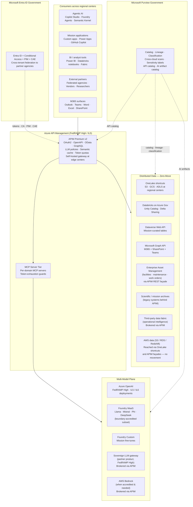

# API-First Multi-Model AI Ecosystem for a Federal Mission Agency

## The customer situation

A large federal mission agency operates an AI strategy organized around five architectural pillars:

1. **Multi-model future** — evaluating multiple AI systems simultaneously, not standardizing on one
2. **Distributed data** — authoritative data lives in multiple regional centers, partner clouds, and mission systems
3. **API-first mandate** — every system must expose a machine-readable RESTful API
4. **Zero-move data** — compute travels to data; data does not move to compute
5. **Interoperability** — eliminate silos across the enterprise

The estate today includes: Microsoft 365, Power Platform, Dataverse, SharePoint, multiple Azure subscriptions, a sizable AWS footprint, Databricks workspaces, a third-party operational data fabric, a FedRAMP-High-accredited sovereign LLM gateway, and a portfolio of on-prem mission systems (enterprise asset management, scientific data archives, mainframe). The agency has FedRAMP High reciprocity on three partner products.

The architecture team is actively evaluating API gateway solutions. AWS API Gateway and MuleSoft Anypoint are on the shortlist. Microsoft has been invited to make a substantive case for Azure API Management as the third option.

The procurement requirement is explicit: **"this must work with how the agency exists today, with the least burden."** No rip-and-replace.

---

## The strategic answer

Microsoft is positioned as the **secure interoperability layer** that connects the ecosystem the agency has already built. The Microsoft argument is not "buy our AI." The Microsoft argument is **"we are the layer that makes your ecosystem work."**

The four durable-leverage categories Microsoft solves natively:

| Category | What it means | Microsoft answer |
|---|---|---|
| **Orchestration** | Coordinate multiple models, agents, and workflows across centers | APIM + Copilot Studio + Foundry Agent Service + Semantic Kernel |
| **Governance** | Discovery, security, identity, retention, auditability, compliance | Entra ID + Purview + APIM policies + Foundry Evaluations |
| **Integration** | Standardized APIs that bind heterogeneous systems together | APIM + Logic Apps + Power Platform connectors + Graph + Dataverse |
| **Lifecycle** | Author → deploy → monitor → retire models, agents, APIs | Foundry + APIM versions/revisions + Copilot Studio + GitHub + Azure DevOps |

The five-pillar architectural reality maps onto Microsoft capabilities one-for-one:

| Pillar | Microsoft capability |
|---|---|
| Multi-Model Future | Azure OpenAI + Foundry MaaS + Foundry custom-deploy + external models brokered via APIM |
| Distributed Data | OneLake shortcuts + APIM façades + Purview cross-cloud catalog |
| API-First Mandate | APIM as universal gateway, OpenAPI / OData metadata everywhere |
| Zero-Move Data | OneLake shortcuts to S3 / GCS / ADLS, Synapse OPENROWSET, APIM proxy to in-place systems |
| Interoperability | One identity (Entra), one gateway (APIM), one governance plane (Purview) — across any system |

---

## Architecture

---

## Block-by-block delivery — the substantive case

### Block 1: Validate the architecture (the customer is already right)

Microsoft does not arrive with a redirect. The Microsoft position is:

> "We've reviewed the five pillars. They are correct. They are also exactly what Azure was built for. Here is how the Microsoft platform supports the architecture the agency has already chosen."

The Microsoft brief acknowledges:

- The five pillars are the right pillars
- Zero-move is not aspirational; it is mandatory
- The multi-vendor model strategy is correct — Microsoft does not need to be the only AI
- "Least burden" is the binding requirement; the proposal honors it

### Block 2: APIM as the enterprise API gateway

APIM is positioned as the **central endpoint** that brokers connections across Azure, AWS, GCP, Databricks, the third-party fabric, the sovereign LLM gateway, M365 / Graph / Dataverse, and internal mission systems.

Capability the gateway delivers:

| Need | APIM mechanism |
|---|---|
| Token issuance & validation | Entra ID + JWT policy + Conditional Access chain |
| Rate limiting | Per-subscription, per-IP, per-user, per-operation |
| Cost governance | `llm-token-limit` per subscription; `emit-token-metric` for chargeback |
| Security policies | XML policy DSL; central WAF; threat protection; mTLS |
| Multi-backend routing | Backend pools with circuit breakers and priority |
| Observability | App Insights + Log Analytics + KQL — included |
| Multi-cloud reach | Self-hosted gateway at edge centers + any HTTPS backend |
| Sovereign coverage | APIM in Azure Gov (FedRAMP High), IL5 |

The honest comparison delivered alongside:

- **vs AWS API Gateway** — APIM has native LLM policies AWS does not; APIM has a built-in developer portal; APIM evaluates auth in-process without the Lambda authorizer tax.
- **vs MuleSoft Anypoint** — APIM has native LLM policies MuleSoft does not; APIM has a fraction of the per-core licensing cost; APIM integrates natively with Entra, M365, Graph, Dataverse, Copilot Studio.

A demonstration of layered MCP servers behind APIM addresses two production problems concurrently: token exhaustion and cost management. The pattern is generalizable — every mission use case in the agency benefits from the same gateway shape.

### Block 3: Dataverse API deep dive — the must-win technical moment

The full deep-dive lives in [the Dataverse API integration use case](./dataverse-api-integration.md). The condensed answer:

- Dataverse exposes a **fully OData v4-compliant Web API** at `https://{org}.api.crm.dynamics.com/api/data/v9.2/`
- Every table, column, choice set, and relationship is discoverable through the **`$metadata` endpoint** — the OData equivalent of OpenAPI
- Authentication is OAuth 2.0: user-delegated, service principal, managed identity, or on-behalf-of
- Any consuming system — a notebook in Databricks, a Python script, a Foundry agent, a mainframe ETL job — calls the Dataverse Web API with a bearer token and reads or writes data
- The Web API supports `$filter`, `$select`, `$expand`, `$orderby`, `$top`, `$batch` for efficient query patterns
- Custom APIs and bound actions allow strongly-typed server-side endpoints
- In the catalog vision, Dataverse is one of several **endpoint patterns** — Dataverse Web API, SharePoint via Graph, Data API Builder over SQL, OneLake SQL endpoint, bring-your-own REST behind APIM

This makes Dataverse a first-class participant in the API-first ecosystem, fully introspectable, no hidden surface.

### Block 4: Cross-platform integration — the connective tissue

The full architecture lives in [the cross-platform integration use case](./cross-platform-integration-fabric.md). The integration map:

- **APIM** — gateway layer, identity-grounded
- **Graph API** — M365 data (mail, calendar, sites, Teams, OneDrive)
- **Dataverse Web API** — Power Platform / business application data
- **Azure AI Foundry** — model hosting, orchestration, evaluations
- **Copilot Studio** — agent authoring and deployment (low-code)
- **Foundry Agent Service** — pro-code agent deployment
- **GitHub Copilot** — developer productivity grounded in Entra identity
- **MCP server tier** — multi-model tool layer behind APIM
- **Zero-trust wrap** — Conditional Access + PIM + CAE on every API call

All connected via standardized APIs. All grounded in one Entra identity. All catalogued in Purview.

The differentiator against Gemini's M365-via-SharePoint integration narrative: **Microsoft integrates across the entire enterprise platform** — M365 Copilot, Copilot Studio, GitHub Copilot, Power Apps, Power Automate, Pages, Sales / Service Copilots, the Foundry agent surface, and the Agent 365 control plane.

### Block 5: Apply the architecture to a real use case — facilities / EAM

The full walkthrough is in [the EAM use case](./enterprise-asset-management-apim.md). The condensed pattern:

1. The agency's enterprise asset management datasets remain in their current environment — **no data movement**
2. APIM exposes the EAM data through a stable REST façade with OData-style filtering
3. Dataverse connects as a consumer (enrichment) or producer (writebacks) depending on workflow
4. Agents in Copilot Studio query the EAM data through APIM with full identity and audit
5. Purview catalogs the EAM endpoints, lineages them to consuming AI workflows, and applies sensitivity labels

The same pattern applies to financial procurement, scientific data, mission planning, and any other use-case domain. APIM is the seam; the rest are pluggable.

---

## "Least burden" — what the agency does NOT have to change

The architecture is engineered to require minimum disruption:

| Existing investment | What stays | What integrates |
|---|---|---|
| AWS footprint | All AWS data stays in S3 / Redshift / RDS | Reached via OneLake shortcuts and APIM façades |
| Databricks workspaces | All Databricks workspaces stay | Unity Catalog federates; Delta Sharing publishes datasets |
| Third-party data fabric | Stays as the operational intelligence layer | Brokered via APIM; participates in Purview catalog |
| Sovereign LLM gateway | Stays as one of the model backends | Brokered via APIM; appears as one model among many |
| Mainframe / legacy systems | Stay in place | APIM REST façade exposes them as machine-readable endpoints |
| Existing OIDC IdPs at regional centers | Stay as identity sources | Federated to Entra via B2B / cross-tenant |
| Existing MuleSoft or AWS API Gateway deployments | Co-exist for the life of current contracts | New APIs route through APIM; old APIs strangled over time |

No data movement. No rip-and-replace. New value layered on existing investments.

---

## FedRAMP High and data classification

The architecture deploys cleanly into each accredited boundary:

| Boundary | Available services | Notes |
|---|---|---|
| **Azure Commercial** | All services | Default for non-regulated workloads |
| **Azure Government / GCC High (FedRAMP High)** | APIM, AOAI (most models), Foundry (subset), Dataverse, Graph, Purview, Databricks | The primary boundary for the agency |
| **DoD IL5** | APIM, AOAI (subset), Dataverse, Databricks | For controlled / mission-specific workloads |
| **DoD IL6** | APIM, select AOAI, sovereign Foundry path | For classified workloads where authorized |

For the three partner products with FedRAMP High reciprocity, APIM is the integration point. The partner products run inside the accredited boundary; APIM brokers traffic without re-credentialing or crossing accreditation lines.

---

## Outcomes at 12 months

| Quarter | Outcome |
|---|---|
| Q1 | APIM Premium v2 deployed in Azure Gov; Entra tenant integrated; first AOAI deployment with token-quota policy live; one OpenAPI catalogued in Purview |
| Q2 | First mission use case (EAM / facilities) live through APIM; first agent in Copilot Studio in production; semantic cache + chargeback dashboard live |
| Q3 | MCP server tier behind APIM; Foundry MaaS routing live; cross-boundary federation to two partner agencies; second model family in production |
| Q4 | OneLake shortcuts to AWS data; cross-cloud lineage in Purview; second mission use case (financial procurement) live; M365 Copilot + Copilot Studio + Foundry Agent surfaces all in production |

Measured deliverables — the kind the technical gatekeepers will validate:

- Per-subscription token-budget enforcement demonstrable
- Semantic cache hit-rate measurable on production traffic
- Chargeback report per consuming application
- End-to-end lineage from data source through API through model through consumer
- Cross-cloud catalog entries in Purview with sensitivity labels propagating

---

## What the customer asks; what we answer

| Question | Substantive answer |
|---|---|
| **"Why APIM over AWS API Gateway?"** | Native LLM policies, in-process auth without Lambda authorizer tax, built-in developer portal, multi-cloud-native, deep Entra / Conditional Access integration. See [Azure vs AWS API stack](../comparison/azure-vs-aws-api-stack.md). |
| **"Why APIM over MuleSoft?"** | Native LLM policies, fraction of the licensing cost, native Entra / M365 / Graph / Dataverse integration, FedRAMP High native, broader productivity reach. See [Azure vs MuleSoft Anypoint](../comparison/azure-vs-mulesoft.md). |
| **"How would Dataverse be connected via REST? How do you know what's in the API?"** | OData v4 Web API with `$metadata` endpoint; programmatic introspection of every entity, attribute, relationship. See [the Dataverse use case](./dataverse-api-integration.md). |
| **"How does this work with how the agency exists today?"** | Co-existence pattern. No data movement. Existing identity sources federated. Existing APIs imported into APIM. Strangler-fig migration on the customer's timeline. |
| **"How does this hold up across FedRAMP High and DoD impact levels?"** | APIM, Entra, Purview, AOAI all accredited. Same Bicep templates deploy to any boundary. Cross-boundary federation via Entra B2B. |
| **"How does this stay ahead of Gemini's M365 integration narrative?"** | Microsoft integrates across the entire enterprise — M365, Copilot Studio, GitHub Copilot, Power Platform, Sales / Service Copilots, Foundry Agent Service, Agent 365. Gemini integrates with SharePoint Online. The asymmetry is decisive. |

---

## Related material in this repo

- [Whitepaper — API-first data strategy on Azure](../research/api-first-data-strategy-whitepaper.md)
- [Use case — Dataverse API integration](./dataverse-api-integration.md)
- [Use case — Enterprise asset management through APIM](./enterprise-asset-management-apim.md)
- [Use case — Cross-platform integration with Microsoft as the connective tissue](./cross-platform-integration-fabric.md)
- [Reference architecture — API-first multi-model ecosystem](../reference-architecture/api-first-multi-model-ecosystem.md)
- [Guide — APIM + MCP layered orchestration](../guides/apim-mcp-layered-orchestration.md)
- [Guide — Zero-trust API governance for federal mission environments](../guides/zero-trust-api-governance-federal.md)
- [ADR-0023 — APIM as the integration fabric](../adr/0023-apim-as-integration-fabric.md)
