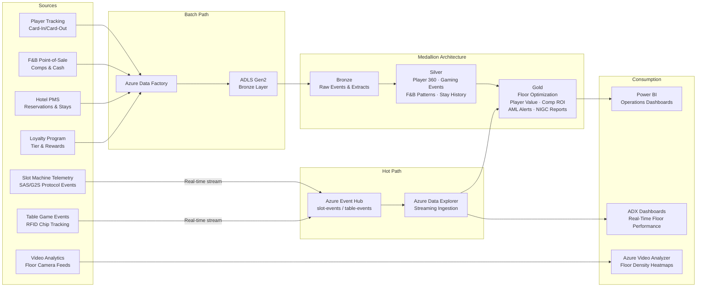

## Tribal Casino & Gaming Operations Analytics on Azure

This use case covers the ingestion, transformation, and analysis of tribal casino gaming operations data — slot machine telemetry, table game events, player tracking, F&B point-of-sale, hotel PMS, and loyalty programs — using Azure Cloud Scale Analytics patterns. The implementation combines real-time slot and table game event streaming with batch ingestion from operational systems to produce floor performance dashboards, player lifetime value models, comp optimization analysis, and regulatory compliance reports for NIGC and Title 31 AML requirements.

!!! info "Reference Implementation"
The complete working code for this domain lives in [`examples/casino-analytics/`](../../examples/casino-analytics/). This page explains the architecture, data sources, and step-by-step build process.

!!! warning "Synthetic Data Only"
**ALL data in this implementation is fully synthetic.** No real player data, gaming results, or financial transactions are used. Player names, loyalty IDs, transaction amounts, and all other personally identifiable information are generated using Faker and random distributions. This dataset is designed for architectural demonstration only and must not be used for actual gaming operations or regulatory filings.

---

## Architecture Overview

The platform follows a dual-path ingestion model: a **hot path** for sub-second slot telemetry and table game events via Event Hub and Azure Data Explorer, and a **cold/batch path** for player tracking, F&B, hotel, and loyalty data via Azure Data Factory into ADLS Gen2 with dbt-driven medallion transformations.



---

## Data Sources

All data sources listed below are **synthetically generated** for demonstration purposes.

| Source                 | Protocol / Format         | Frequency      | Volume (Synthetic)    | Key Fields                                                                               |
| ---------------------- | ------------------------- | -------------- | --------------------- | ---------------------------------------------------------------------------------------- |
| Slot Machine Telemetry | SAS/G2S → JSON            | Sub-second     | ~50M events/day       | `machine_id`, `denomination`, `coin_in`, `coin_out`, `jackpot`, `game_cycle_ms`          |
| Table Game Events      | RFID Chip Tracking → JSON | Per-hand/round | ~5M events/day        | `table_id`, `game_type`, `buy_in`, `cash_out`, `avg_bet`, `hands_played`                 |
| Player Tracking        | Card-In/Card-Out CSV      | Session-level  | ~200K sessions/day    | `player_id`, `card_in_ts`, `card_out_ts`, `machine_id`, `theo_win`, `actual_win`         |
| F&B Point-of-Sale      | POS Export CSV            | Batch (hourly) | ~80K transactions/day | `check_id`, `player_id`, `outlet`, `items`, `total`, `comp_amount`, `payment_type`       |
| Hotel PMS              | PMS Export CSV            | Batch (daily)  | ~5K reservations/day  | `reservation_id`, `player_id`, `room_type`, `rate`, `nights`, `comp_flag`, `amenities`   |
| Loyalty Program        | CRM Extract CSV           | Batch (daily)  | ~500K member records  | `player_id`, `tier`, `points_balance`, `lifetime_theo`, `lifetime_actual`, `signup_date` |
| Video Floor Analytics  | Azure Video Analyzer      | Continuous     | ~200 camera feeds     | `camera_id`, `zone`, `person_count`, `density_pct`, `timestamp`                          |

---

## Step-by-Step Implementation

### Step 1: Real-Time Slot Telemetry Streaming

Slot machines emit events on every game cycle — coin-in, coin-out, bonus triggers, and jackpot hits. These events stream through Event Hub into Azure Data Explorer for sub-second floor monitoring.

#### Slot Event Producer (Python)

```python
"""Synthetic slot machine telemetry producer for Event Hub."""

import asyncio
import json
import random
import uuid
from datetime import datetime, timezone

from azure.eventhub.aio import EventHubProducerClient
from azure.eventhub import EventData

CONNECTION_STR = "Endpoint=sb://<namespace>.servicebus.windows.net/;SharedAccessKeyName=send;SharedAccessKey=<key>"
EVENTHUB_NAME = "slot-events"

DENOMINATIONS = [0.01, 0.05, 0.25, 1.00, 5.00]
MACHINE_IDS = [f"SLT-{i:04d}" for i in range(1, 501)]
GAME_TYPES = ["video-slots", "progressive", "video-poker", "mechanical-reel"]


def generate_slot_event() -> dict:
    """Generate a single synthetic slot machine event."""
    machine_id = random.choice(MACHINE_IDS)
    denomination = random.choice(DENOMINATIONS)
    credits_wagered = random.choice([1, 2, 3, 5, 10, 20])
    coin_in = denomination * credits_wagered

    # House edge simulation: ~8-12% hold depending on game type
    hold_pct = random.uniform(0.06, 0.14)
    if random.random() < 0.35:  # ~35% of spins pay something
        payout_multiplier = random.choices(
            [1, 2, 5, 10, 50, 500],
            weights=[50, 25, 12, 8, 4, 1],
            k=1
        )[0]
        coin_out = coin_in * payout_multiplier
    else:
        coin_out = 0.0

    return {
        "event_id": str(uuid.uuid4()),
        "machine_id": machine_id,
        "timestamp": datetime.now(timezone.utc).isoformat(),
        "denomination": denomination,
        "game_type": random.choice(GAME_TYPES),
        "credits_wagered": credits_wagered,
        "coin_in": round(coin_in, 2),
        "coin_out": round(coin_out, 2),
        "jackpot_flag": coin_out > coin_in * 100,
        "game_cycle_ms": random.randint(2800, 5500),
        "zone": f"ZONE-{random.choice(['A','B','C','D','E'])}",
        "floor_section": random.choice(["high-limit", "main-floor", "non-smoking", "vip"]),
    }


async def produce_events(batch_size: int = 100, interval_sec: float = 1.0):
    """Stream synthetic slot events to Event Hub."""
    producer = EventHubProducerClient.from_connection_string(
        conn_str=CONNECTION_STR, eventhub_name=EVENTHUB_NAME
    )
    async with producer:
        while True:
            batch = await producer.create_batch()
            for _ in range(batch_size):
                event = generate_slot_event()
                batch.add(EventData(json.dumps(event)))
            await producer.send_batch(batch)
            await asyncio.sleep(interval_sec)


if __name__ == "__main__":
    asyncio.run(produce_events())
```

#### ADX Ingestion Setup

```kql
// Create target table for slot telemetry
.create table SlotEvents (
    event_id: string,
    machine_id: string,
    timestamp: datetime,
    denomination: real,
    game_type: string,
    credits_wagered: int,
    coin_in: real,
    coin_out: real,
    jackpot_flag: bool,
    game_cycle_ms: int,
    zone: string,
    floor_section: string
)

// Create JSON ingestion mapping
.create table SlotEvents ingestion json mapping 'SlotEventsMapping'
    '[{"column":"event_id","path":"$.event_id"},'
    ' {"column":"machine_id","path":"$.machine_id"},'
    ' {"column":"timestamp","path":"$.timestamp"},'
    ' {"column":"denomination","path":"$.denomination"},'
    ' {"column":"game_type","path":"$.game_type"},'
    ' {"column":"credits_wagered","path":"$.credits_wagered"},'
    ' {"column":"coin_in","path":"$.coin_in"},'
    ' {"column":"coin_out","path":"$.coin_out"},'
    ' {"column":"jackpot_flag","path":"$.jackpot_flag"},'
    ' {"column":"game_cycle_ms","path":"$.game_cycle_ms"},'
    ' {"column":"zone","path":"$.zone"},'
    ' {"column":"floor_section","path":"$.floor_section"}]'

// Connect Event Hub data connection via Azure portal or ARM template
```

---

### Step 2: Player Engagement Scoring and Lifecycle Tracking

The Silver layer builds a unified player 360 profile by joining gaming sessions, F&B activity, hotel stays, and loyalty data.

#### dbt Model: Player 360 Silver (`models/silver/slv_player_360.sql`)

```sql
-- models/silver/slv_player_360.sql
-- Unified player profile combining gaming, F&B, hotel, and loyalty data

{{ config(
    materialized='incremental',
    unique_key='player_id',
    schema='silver'
) }}

with gaming_summary as (
    select
        player_id,
        count(distinct session_id)          as total_sessions,
        sum(coin_in)                        as lifetime_coin_in,
        sum(coin_out)                       as lifetime_coin_out,
        sum(theo_win)                       as lifetime_theo_win,
        sum(actual_win)                     as lifetime_actual_win,
        avg(session_duration_min)           as avg_session_duration_min,
        max(session_end_ts)                 as last_gaming_activity,
        min(session_start_ts)              as first_gaming_activity,
        count(distinct machine_id)          as unique_machines_played,
        mode() within group (order by floor_section)  as preferred_floor_section,
        mode() within group (order by denomination)   as preferred_denomination
    from {{ ref('brz_player_sessions') }}
    group by player_id
),

fb_summary as (
    select
        player_id,
        count(distinct check_id)    as total_fb_visits,
        sum(total)                  as lifetime_fb_spend,
        sum(comp_amount)            as lifetime_fb_comps,
        mode() within group (order by outlet)  as favorite_outlet,
        max(transaction_ts)         as last_fb_visit
    from {{ ref('brz_fb_transactions') }}
    where player_id is not null
    group by player_id
),

hotel_summary as (
    select
        player_id,
        count(distinct reservation_id)  as total_stays,
        sum(nights)                     as lifetime_room_nights,
        sum(case when comp_flag then 1 else 0 end)  as comp_room_nights,
        avg(rate)                       as avg_daily_rate,
        max(checkout_date)              as last_hotel_stay
    from {{ ref('brz_hotel_reservations') }}
    where player_id is not null
    group by player_id
),

loyalty as (
    select
        player_id,
        tier,
        points_balance,
        signup_date,
        lifetime_theo    as loyalty_lifetime_theo,
        lifetime_actual  as loyalty_lifetime_actual
    from {{ ref('brz_loyalty_members') }}
)

select
    coalesce(g.player_id, f.player_id, h.player_id, l.player_id)  as player_id,
    l.tier                          as loyalty_tier,
    l.points_balance,
    l.signup_date,

    -- Gaming metrics
    g.total_sessions,
    g.lifetime_coin_in,
    g.lifetime_coin_out,
    g.lifetime_theo_win,
    g.lifetime_actual_win,
    g.avg_session_duration_min,
    g.preferred_floor_section,
    g.preferred_denomination,
    g.unique_machines_played,
    g.first_gaming_activity,
    g.last_gaming_activity,

    -- F&B metrics
    f.total_fb_visits,
    f.lifetime_fb_spend,
    f.lifetime_fb_comps,
    f.favorite_outlet,
    f.last_fb_visit,

    -- Hotel metrics
    h.total_stays,
    h.lifetime_room_nights,
    h.comp_room_nights,
    h.avg_daily_rate,
    h.last_hotel_stay,

    -- Derived: days since last visit (any touchpoint)
    datediff(
        day,
        greatest(
            coalesce(g.last_gaming_activity, '1900-01-01'),
            coalesce(f.last_fb_visit, '1900-01-01'),
            coalesce(h.last_hotel_stay, '1900-01-01')
        ),
        current_date
    ) as days_since_last_visit,

    -- Derived: engagement score (0-100)
    least(100, (
        coalesce(g.total_sessions, 0) * 0.3
        + coalesce(f.total_fb_visits, 0) * 2.0
        + coalesce(h.total_stays, 0) * 5.0
        + case when l.tier = 'Platinum' then 20
               when l.tier = 'Gold' then 15
               when l.tier = 'Silver' then 10
               else 5 end
    )) as engagement_score,

    current_timestamp as _loaded_at

from gaming_summary g
full outer join fb_summary f on g.player_id = f.player_id
full outer join hotel_summary h on g.player_id = h.player_id
full outer join loyalty l on g.player_id = l.player_id
```

---

### Step 3: Floor Layout Optimization with Heat Mapping

KQL queries against the ADX real-time store produce floor performance metrics for heat map visualizations. Zone-level coin-in, hold percentages, and machine utilization drive layout decisions.

#### KQL: Real-Time Floor Performance

```kql
// Floor performance by zone — rolling 15-minute windows
SlotEvents
| where timestamp > ago(15m)
| summarize
    total_coin_in = sum(coin_in),
    total_coin_out = sum(coin_out),
    hold_pct = round((sum(coin_in) - sum(coin_out)) / sum(coin_in) * 100, 2),
    active_machines = dcount(machine_id),
    total_spins = count(),
    jackpot_count = countif(jackpot_flag),
    avg_cycle_ms = avg(game_cycle_ms)
    by zone, floor_section
| extend revenue = total_coin_in - total_coin_out
| order by revenue desc

// Machine-level utilization for repositioning analysis
SlotEvents
| where timestamp > ago(1h)
| summarize
    spins = count(),
    coin_in = sum(coin_in),
    hold = round((sum(coin_in) - sum(coin_out)) / sum(coin_in) * 100, 2),
    idle_pct = round(
        (3600 - sum(game_cycle_ms) / 1000.0) / 3600 * 100, 2
    )
    by machine_id, zone, denomination
| where idle_pct > 80
| order by idle_pct desc
| project machine_id, zone, denomination, spins, coin_in, hold, idle_pct
```

---

### Step 4: F&B Preference Analysis and Comp Optimization

Comp ROI analysis links complimentary F&B and hotel spending back to incremental gaming revenue, enabling data-driven reinvestment decisions.

```sql
-- Gold layer: Comp ROI by loyalty tier
-- models/gold/gld_comp_roi_analysis.sql

{{ config(materialized='table', schema='gold') }}

select
    p.loyalty_tier,
    count(distinct p.player_id)                         as player_count,
    round(avg(p.lifetime_theo_win), 2)                  as avg_theo_win,
    round(sum(p.lifetime_fb_comps +
        p.comp_room_nights * p.avg_daily_rate), 2)      as total_comp_cost,
    round(sum(p.lifetime_coin_in - p.lifetime_coin_out), 2)  as total_gaming_revenue,
    round(
        sum(p.lifetime_coin_in - p.lifetime_coin_out) /
        nullif(sum(p.lifetime_fb_comps +
            p.comp_room_nights * p.avg_daily_rate), 0),
        2
    )                                                    as comp_roi_ratio,
    round(avg(p.engagement_score), 1)                   as avg_engagement_score,
    round(avg(p.days_since_last_visit), 0)              as avg_days_since_visit
from {{ ref('slv_player_360') }} p
group by p.loyalty_tier
order by comp_roi_ratio desc
```

---

### Step 5: Title 31 AML Compliance Monitoring

The Bank Secrecy Act (Title 31) requires casinos to file Currency Transaction Reports (CTRs) for cash transactions exceeding $10,000 in a gaming day and Suspicious Activity Reports (SARs) for structuring patterns.

#### SQL: AML Threshold Monitoring

```sql
-- models/gold/gld_aml_ctr_candidates.sql
-- Identify CTR-reportable transactions: aggregate cash activity > $10,000 per gaming day

{{ config(materialized='incremental', schema='gold', unique_key='player_gaming_day') }}

with daily_cash_activity as (
    select
        s.player_id,
        cast(s.session_start_ts as date)      as gaming_day,
        sum(s.cash_buy_in)                    as total_buy_in,
        sum(s.cash_out)                       as total_cash_out,
        sum(s.cash_buy_in) + sum(s.cash_out)  as total_cash_activity,
        count(distinct s.session_id)          as session_count,
        array_agg(distinct s.machine_id)      as machines_used
    from {{ ref('brz_player_sessions') }} s
    group by s.player_id, cast(s.session_start_ts as date)
),

structuring_detection as (
    -- Flag transactions just below $10,000 threshold (potential structuring)
    select
        player_id,
        gaming_day,
        total_cash_activity,
        session_count,
        case
            when total_cash_activity between 8000 and 9999
                 and session_count >= 3
            then true
            else false
        end as structuring_flag
    from daily_cash_activity
)

select
    d.player_id || '-' || d.gaming_day  as player_gaming_day,
    d.player_id,
    d.gaming_day,
    d.total_buy_in,
    d.total_cash_out,
    d.total_cash_activity,
    d.session_count,
    d.machines_used,
    case
        when d.total_cash_activity >= 10000 then 'CTR_REQUIRED'
        when s.structuring_flag then 'SAR_REVIEW'
        else 'BELOW_THRESHOLD'
    end as compliance_action,
    current_timestamp as _evaluated_at
from daily_cash_activity d
left join structuring_detection s
    on d.player_id = s.player_id and d.gaming_day = s.gaming_day
where d.total_cash_activity >= 8000
   or s.structuring_flag


    and d.gaming_day > (select max(gaming_day) from {{ this }})

```

---

### Step 6: NIGC Regulatory Reporting

The National Indian Gaming Commission (NIGC) requires periodic reporting on gaming revenue, machine counts, and operational metrics. Gold-layer aggregations feed standardized report outputs.

```sql
-- models/gold/gld_nigc_revenue_report.sql
-- Monthly revenue summary formatted for NIGC regulatory submission

{{ config(materialized='table', schema='gold') }}

select
    date_trunc('month', gaming_day)          as report_month,
    game_category,
    count(distinct machine_id)               as machine_count,
    sum(coin_in)                             as total_coin_in,
    sum(coin_out)                            as total_coin_out,
    sum(coin_in) - sum(coin_out)             as gross_gaming_revenue,
    round((sum(coin_in) - sum(coin_out)) / nullif(sum(coin_in), 0) * 100, 2)
                                              as hold_percentage,
    sum(jackpot_amount)                      as total_jackpots_paid,
    count(distinct player_id)                as unique_players
from {{ ref('slv_gaming_events_daily') }}
group by date_trunc('month', gaming_day), game_category
order by report_month desc, game_category
```

---

### Step 7: Floor Density Analytics with Azure Video Analyzer

Azure Video Analyzer with Custom Vision models processes floor camera feeds to estimate zone-level occupancy and density, enabling real-time staffing and safety decisions.

```python
"""Query Azure Video Analyzer for floor density metrics."""

from azure.media.videoanalyzer import VideoAnalyzerClient
from azure.identity import DefaultAzureCredential

credential = DefaultAzureCredential()
client = VideoAnalyzerClient(
    account_name="<video-analyzer-account>",
    resource_group="<resource-group>",
    subscription_id="<subscription-id>",
    credential=credential,
)

# Floor density is computed by Custom Vision person-detection model
# deployed as a spatial analysis pipeline on each camera feed.
# Results are emitted to Event Hub and queryable in ADX:

FLOOR_DENSITY_KQL = """
FloorDensityEvents
| where timestamp > ago(30m)
| summarize
    avg_person_count = avg(person_count),
    max_person_count = max(person_count),
    avg_density_pct = round(avg(density_pct), 1)
    by zone, bin(timestamp, 5m)
| order by timestamp desc, zone asc
"""
```

---

## Regulatory Compliance Reference

| Regulation               | Authority               | Requirement                                                  | Implementation                                                     |
| ------------------------ | ----------------------- | ------------------------------------------------------------ | ------------------------------------------------------------------ |
| **Title 31 / BSA**       | FinCEN                  | CTR filing for cash transactions ≥ $10,000 per gaming day    | `gld_aml_ctr_candidates` model with daily aggregation              |
| **Title 31 / BSA**       | FinCEN                  | SAR filing for suspicious structuring patterns               | Structuring detection logic (multiple transactions near threshold) |
| **NIGC Regulations**     | NIGC                    | Monthly/quarterly revenue reporting by game category         | `gld_nigc_revenue_report` model                                    |
| **NIGC MICS**            | NIGC                    | Minimum Internal Control Standards for slot/table operations | Audit trail via Bronze-layer raw event retention                   |
| **Tribal-State Compact** | State Gaming Commission | Compact-specific revenue sharing and reporting               | Configurable per-compact reporting templates                       |

!!! note "Tribal Sovereignty"
Tribal gaming operations are regulated under the Indian Gaming Regulatory Act (IGRA). Specific reporting requirements vary by tribal-state compact. The models provided here implement common Title 31 and NIGC requirements; compact-specific customizations should be configured per deployment.

---

## Power BI Dashboard Layers

| Dashboard                       | Refresh                       | Key Metrics                                          | Audience                       |
| ------------------------------- | ----------------------------- | ---------------------------------------------------- | ------------------------------ |
| **Real-Time Floor Monitor**     | Sub-minute (ADX Direct Query) | Active machines, coin-in/out by zone, jackpot alerts | Floor managers, surveillance   |
| **Player Value & Segmentation** | Daily                         | Player 360 scores, tier distribution, churn risk     | Marketing, player development  |
| **Comp ROI Analysis**           | Weekly                        | Comp cost vs. incremental revenue by tier            | Finance, marketing directors   |
| **AML Compliance**              | Daily                         | CTR candidates, structuring alerts, SAR queue        | Compliance officers            |
| **NIGC Revenue Summary**        | Monthly                       | Gross gaming revenue, hold %, machine counts         | Tribal gaming commission, NIGC |
| **Floor Density**               | Near real-time (ADX)          | Zone occupancy, peak hours, staffing recommendations | Operations, security           |

---

## Cross-References

- **Streaming Patterns**: See [Real-Time Intelligence & Anomaly Detection](realtime-intelligence-anomaly-detection.md) for Event Hub and ADX ingestion patterns used in the slot telemetry hot path.
- **IoT Telemetry**: Slot machine SAS/G2S protocol handling follows similar patterns to IoT device telemetry ingestion documented in the streaming examples at [`examples/casino-analytics/streaming/`](../../examples/casino-analytics/streaming/).
- **Medallion Architecture**: The Bronze → Silver → Gold transformation pattern follows the same dbt project structure described in [Fabric Unified Analytics](fabric-unified-analytics.md).
- **Video Analytics**: Floor density processing extends the Azure Video Analyzer patterns in [`examples/casino-analytics/video/`](../../examples/casino-analytics/video/).

---

## Deployment

```bash
# Deploy infrastructure
cd examples/casino-analytics/deploy
az deployment group create \
    --resource-group rg-casino-analytics \
    --template-file main.bicep \
    --parameters @parameters.json

# Start synthetic data producers
cd ../streaming
python slot_event_producer.py &
python table_event_producer.py &

# Run dbt transformations
cd ../
dbt run --project-dir . --profiles-dir . --target dev
dbt test --project-dir . --profiles-dir . --target dev
```

---

## Sources

- [National Indian Gaming Commission (NIGC)](https://www.nigc.gov/)
- [FinCEN — Bank Secrecy Act / Title 31 Casino Requirements](https://www.fincen.gov/resources/statutes-and-regulations/bank-secrecy-act)
- [Azure Event Hubs Documentation](https://learn.microsoft.com/en-us/azure/event-hubs/)
- [Azure Data Explorer Documentation](https://learn.microsoft.com/en-us/azure/data-explorer/)
- [Azure Video Analyzer Documentation](https://learn.microsoft.com/en-us/azure/azure-video-analyzer/)
- [dbt Documentation](https://docs.getdbt.com/)
