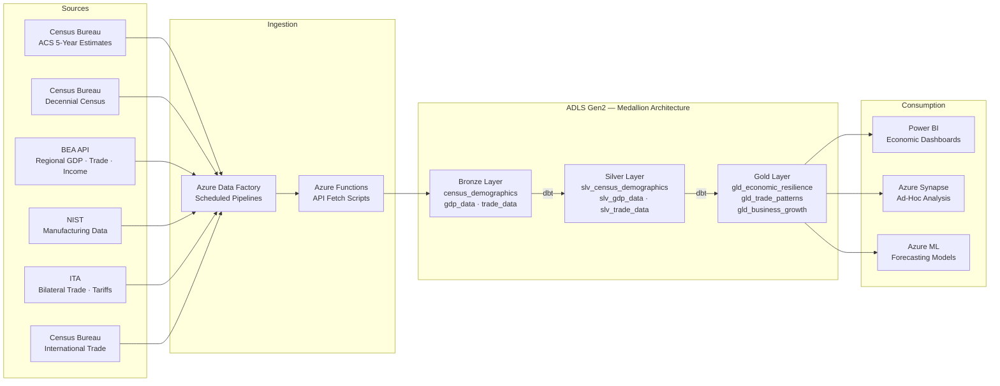
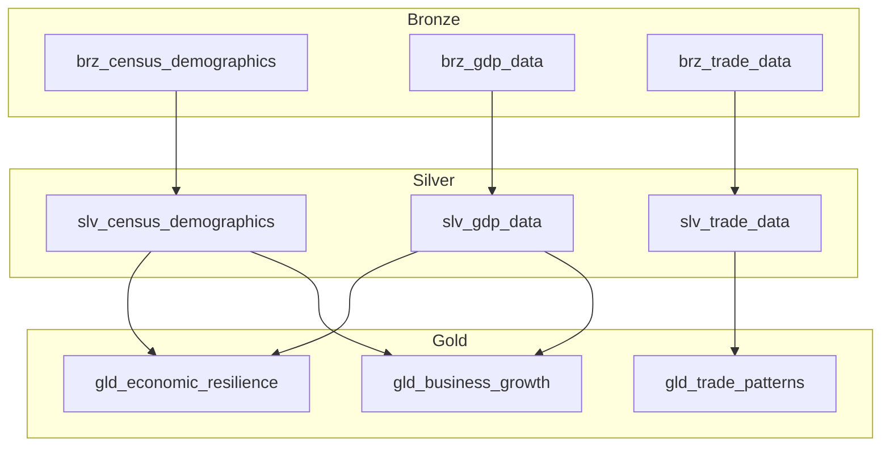

## Department of Commerce Economic Analytics on Azure

This use case covers the ingestion, transformation, and analysis of data from multiple Department of Commerce bureaus — Census Bureau, Bureau of Economic Analysis (BEA), National Institute of Standards and Technology (NIST), and International Trade Administration (ITA) — using Azure Cloud Scale Analytics patterns. The implementation produces regional economic resilience indices, bilateral trade pattern analysis, small business growth predictions, and demographic insight dashboards from authoritative federal economic data.

!!! info "Reference Implementation"
The complete working code for this domain lives in [`examples/commerce/`](../../examples/commerce/). This page explains the architecture, data sources, and step-by-step build process.

---

## Architecture Overview

The platform follows a batch ingestion model: federal APIs (Census ACS, BEA Regional GDP, Census International Trade) are ingested via Azure Data Factory into ADLS Gen2, then transformed through a dbt-driven medallion architecture. Bronze stores raw API responses, Silver produces cleansed and standardized domain tables, and Gold computes composite analytics — economic resilience scores, trade pattern summaries, and business growth predictions.



---

## Data Sources

| Source                                 | Bureau        | API Endpoint                                                  | Key Variables                                                             | Refresh Cadence   |
| -------------------------------------- | ------------- | ------------------------------------------------------------- | ------------------------------------------------------------------------- | ----------------- |
| American Community Survey (ACS) 5-Year | Census Bureau | `https://api.census.gov/data/{year}/acs/acs5`                 | Population, median income, poverty rate, unemployment, education, housing | Annual (December) |
| Decennial Census                       | Census Bureau | `https://api.census.gov/data/{year}/dec/dhc`                  | Total population, demographics, housing units                             | Every 10 years    |
| Regional GDP by Industry               | BEA           | `https://apps.bea.gov/api/data` (Regional, SQGDP2)            | GDP by NAICS sector, personal income, compensation                        | Quarterly         |
| International Trade (HS)               | Census Bureau | `https://api.census.gov/data/timeseries/intltrade/imports/hs` | Bilateral trade values, commodity codes, quantities, tariffs              | Monthly           |
| NIST Manufacturing Extension           | NIST          | Program data via bulk download                                | Manufacturing competitiveness, MEP client outcomes                        | Annual            |
| Trade Policy Data                      | ITA           | `https://api.trade.gov/gateway/v1/`                           | Tariff schedules, trade agreements, market intelligence                   | Varies            |

!!! note "API Key Requirements"
Census Bureau APIs require a free API key from [api.census.gov/data/key_signup.html](https://api.census.gov/data/key_signup.html). BEA APIs require a separate key from [apps.bea.gov/API/signup/](https://apps.bea.gov/API/signup/). Both are free for government and research use.

---

## Step-by-Step Implementation

### Step 1: Census API Ingestion

The `fetch_census_bea.py` script pulls ACS 5-Year estimates at the county level for a configurable set of states and years. It fetches 12 demographic variables per county including population, income, poverty, employment, education, and housing.

```python
"""Census ACS data fetch — excerpt from examples/commerce/data/open-data/fetch_census_bea.py"""

ACS_VARIABLES = {
    "B01001_001E": {"name": "total_population", "concept": "Sex By Age"},
    "B19013_001E": {"name": "median_household_income", "concept": "Median Household Income"},
    "B17001_002E": {"name": "below_poverty_level", "concept": "Poverty Status"},
    "B23025_005E": {"name": "unemployed", "concept": "Employment Status"},
    "B15003_022E": {"name": "bachelors_degree", "concept": "Educational Attainment"},
    "B25077_001E": {"name": "median_home_value", "concept": "Median Value"},
}

CENSUS_BASE_URL = "https://api.census.gov/data"

def fetch_census_demographics(states: list[str], years: list[int]) -> list[dict]:
    """Fetch ACS 5-Year demographic estimates at county level."""
    var_string = ",".join(ACS_VARIABLES.keys())
    records = []

    for year in years:
        for state_fips in states:
            url = f"{CENSUS_BASE_URL}/{year}/acs/acs5"
            params = {
                "get": f"NAME,{var_string}",
                "for": "county:*",
                "in": f"state:{state_fips}",
                "key": os.environ["CENSUS_API_KEY"],
            }
            resp = requests.get(url, params=params, timeout=30)
            resp.raise_for_status()
            data = resp.json()

            headers = data[0]
            for row in data[1:]:
                row_dict = dict(zip(headers, row))
                # Transform each variable into a record ...
                records.append(transform_row(row_dict, year, state_fips))

    return records
```

Run the fetcher:

```bash
python examples/commerce/data/open-data/fetch_census_bea.py \
  --dataset census \
  --census-key $CENSUS_API_KEY \
  --states "06,17,36,48,12" \
  --years "2021,2022" \
  --output-dir ./output
```

### Step 2: BEA GDP Data Pipeline

BEA's Regional API provides quarterly GDP by industry (NAICS sector) at the state level. The pipeline fetches table `SQGDP2` across configurable line codes representing major industry sectors.

```python
"""BEA Regional GDP fetch — excerpt"""

BEA_BASE_URL = "https://apps.bea.gov/api/data"

def fetch_gdp_data(years: list[int], bea_api_key: str) -> list[dict]:
    """Fetch BEA Regional GDP by industry."""
    line_codes = ["1", "2", "3", "6", "10", "34", "50", "59", "68", "75", "82"]
    records = []

    for line_code in line_codes:
        params = {
            "UserID": bea_api_key,
            "method": "GetData",
            "datasetname": "Regional",
            "TableName": "SQGDP2",
            "LineCode": line_code,
            "GeoFips": "STATE",
            "Year": ",".join(str(y) for y in years),
            "ResultFormat": "JSON",
        }
        resp = requests.get(BEA_BASE_URL, params=params, timeout=30)
        result_data = resp.json()["BEAAPI"]["Results"]["Data"]

        for item in result_data:
            records.append({
                "state_fips": item["GeoFips"][:2],
                "naics_sector": item.get("IndustryClassification", ""),
                "industry_name": item.get("Description", ""),
                "gdp_current_dollars": parse_value(item.get("DataValue")),
                "year": int(item["TimePeriod"][:4]),
                "quarter": extract_quarter(item["TimePeriod"]),
            })

    return records
```

### Step 3: Regional Economic Resilience Scoring

The `gld_economic_resilience` gold model computes a composite resilience index for each state-year by combining three dimensions:

| Component                        | Method                                              | Weight | Interpretation                                              |
| -------------------------------- | --------------------------------------------------- | ------ | ----------------------------------------------------------- |
| Employment Diversity Index       | Shannon Entropy: H = −Σ(pᵢ · ln(pᵢ)) / ln(N)        | 40%    | Higher diversity → more resilient to single-industry shocks |
| Herfindahl-Hirschman Index (HHI) | HHI = Σ(sᵢ²) where sᵢ is industry GDP share         | 35%    | Lower concentration → more resilient                        |
| GDP Stability Score              | 100 − Coefficient of Variation over lookback window | 25%    | Lower volatility → more stable economy                      |

```sql
-- Excerpt from gld_economic_resilience.sql: composite score calculation
SELECT
    state_fips AS state_code,
    state_name,
    year,
    employment_diversity_index,
    hhi_score,
    gdp_stability_score,

    -- Composite resilience score
    ROUND(
        0.40 * employment_diversity_index * 100
        + 0.35 * GREATEST(0, (1 - hhi_score / 3000.0) * 100)
        + 0.25 * gdp_stability_score,
        2
    ) AS resilience_score,

    CASE
        WHEN resilience_score >= 80 THEN 'HIGHLY_RESILIENT'
        WHEN resilience_score >= 60 THEN 'RESILIENT'
        WHEN resilience_score >= 40 THEN 'MODERATE'
        WHEN resilience_score >= 20 THEN 'VULNERABLE'
        ELSE 'AT_RISK'
    END AS resilience_category

FROM combined
ORDER BY year DESC, resilience_score DESC
```

!!! tip "Configurable Weights"
Component weights are defined in `dbt_project.yml` via dbt variables (`employment_diversity_weight`, `hhi_weight`, `gdp_stability_weight`). Adjust these to reflect regional policy priorities.

### Step 4: International Trade Pattern Analysis

The `gld_trade_patterns` gold model produces two output types from the silver trade data:

1. **Bilateral Summary** — total exports, imports, trade balance, YoY growth, and partner rankings per country per year
2. **Commodity Trends** — trade volumes by HS chapter with concentration metrics

```sql
-- Excerpt from gld_trade_patterns.sql: bilateral trade balance
SELECT
    partner_country_code,
    partner_country_name,
    year,
    SUM(CASE WHEN flow_type = 'EXPORT' THEN trade_value_usd ELSE 0 END) AS total_exports,
    SUM(CASE WHEN flow_type = 'IMPORT' THEN trade_value_usd ELSE 0 END) AS total_imports,
    total_exports - total_imports AS trade_balance,
    CASE
        WHEN trade_balance > 0 THEN 'SURPLUS'
        WHEN trade_balance < 0 THEN 'DEFICIT'
        ELSE 'BALANCED'
    END AS trade_balance_direction,
    AVG(CASE WHEN flow_type = 'IMPORT' THEN effective_tariff_rate_pct END)
        AS avg_import_tariff_rate,
    ROW_NUMBER() OVER (PARTITION BY year ORDER BY SUM(trade_value_usd) DESC)
        AS trade_volume_rank
FROM slv_trade_data
GROUP BY partner_country_code, partner_country_name, year
```

### Step 5: Small Business Growth Prediction

The `gld_business_growth` gold model combines Census demographics with GDP indicators to score each state's business growth climate. The composite score uses z-score normalization across six weighted factors:

| Factor                              | Weight | Source           |
| ----------------------------------- | ------ | ---------------- |
| GDP growth rate (YoY)               | 25%    | BEA Regional GDP |
| Education level (% bachelor's+)     | 20%    | Census ACS       |
| Income growth rate                  | 20%    | Census ACS       |
| Low unemployment (inverted)         | 15%    | Census ACS       |
| Population growth rate              | 10%    | Census ACS       |
| Industry diversity (active sectors) | 10%    | BEA Regional GDP |

Output categories: `HIGH_GROWTH`, `MODERATE_GROWTH`, `STABLE`, `SLOW_GROWTH`, `DECLINING`.

The model also produces simulated business survival rates (1-year, 3-year, 5-year) calibrated against economic health proxies.

### Step 6: Census Demographic Insights

The silver layer standardizes raw ACS variable-level data into a wide-format demographic table with derived metrics:

- **Poverty rate**: `below_poverty_level / total_poverty_status × 100`
- **Unemployment rate**: `unemployed / labor_force × 100`
- **Education attainment**: `(bachelors + masters) / total_population × 100`
- **Labor force participation**: `labor_force / total_population × 100`

These metrics feed both the resilience and business growth gold models as contextual indicators.

---

## dbt Model Lineage



---

## FISMA Compliance and Government Cloud Deployment

This implementation is designed for deployment on **Azure Government** (IL4/IL5) or **Azure Government Secret** regions to meet federal data handling requirements.

!!! warning "FISMA Requirements"
Commerce Bureau data pipelines handling CUI (Controlled Unclassified Information) must operate within a FISMA Moderate boundary. Ensure all Azure services are deployed in `usgovvirginia` or `usgovarizona` regions.

| Control Area                | Implementation                                                              | Azure Service       |
| --------------------------- | --------------------------------------------------------------------------- | ------------------- |
| Access Control (AC)         | Azure AD with RBAC, Managed Identities for service-to-service               | Azure AD / Entra ID |
| Audit & Accountability (AU) | Diagnostic settings on all services, Log Analytics workspace                | Azure Monitor       |
| Data Encryption at Rest     | ADLS Gen2 with customer-managed keys in Key Vault                           | Azure Key Vault     |
| Data Encryption in Transit  | TLS 1.2+ enforced, Private Endpoints for all data services                  | Azure Private Link  |
| API Key Management          | Census/BEA API keys stored in Key Vault, referenced via ADF linked services | Azure Key Vault     |
| Network Isolation           | VNet integration for ADF, Synapse, and compute resources                    | Azure VNet + NSGs   |
| Boundary Protection (SC)    | No public endpoints; all traffic routed through private endpoints           | Azure Private DNS   |

Deployment parameters for government regions are in [`examples/commerce/deploy/params.gov.json`](../../examples/commerce/deploy/params.gov.json).

```bash
# Deploy to Azure Government
az cloud set --name AzureUSGovernment
az deployment group create \
  --resource-group rg-commerce-analytics \
  --template-file deploy/main.bicep \
  --parameters @deploy/params.gov.json
```

---

## Data Contracts

Data contracts define the schema expectations between pipeline stages. The commerce domain defines three contracts:

| Contract            | File                                 | Purpose                                                     |
| ------------------- | ------------------------------------ | ----------------------------------------------------------- |
| Census Demographics | `contracts/census-demographics.yaml` | ACS variable schema, FIPS validation, nullability rules     |
| Economic Indicators | `contracts/economic-indicators.yaml` | GDP fields, unit scales, temporal grain constraints         |
| Trade Data          | `contracts/trade-data.yaml`          | HS code format, trade value bounds, country code validation |

---

## Sources and API References

| Resource                                 | URL                                                                                                                  |
| ---------------------------------------- | -------------------------------------------------------------------------------------------------------------------- |
| Census Bureau API Documentation          | [https://www.census.gov/data/developers.html](https://www.census.gov/data/developers.html)                           |
| Census API Key Signup                    | [https://api.census.gov/data/key_signup.html](https://api.census.gov/data/key_signup.html)                           |
| ACS 5-Year Variables                     | [https://api.census.gov/data/2022/acs/acs5/variables.html](https://api.census.gov/data/2022/acs/acs5/variables.html) |
| Census International Trade API           | [https://api.census.gov/data/timeseries/intltrade.html](https://api.census.gov/data/timeseries/intltrade.html)       |
| BEA API Documentation                    | [https://apps.bea.gov/API/signup/](https://apps.bea.gov/API/signup/)                                                 |
| BEA Regional GDP Tables                  | [https://apps.bea.gov/iTable/?ReqID=70](https://apps.bea.gov/iTable/?ReqID=70)                                       |
| NIST Manufacturing Extension Partnership | [https://www.nist.gov/mep](https://www.nist.gov/mep)                                                                 |
| ITA Trade Data API                       | [https://api.trade.gov/](https://api.trade.gov/)                                                                     |
| Azure Government Regions                 | [https://learn.microsoft.com/azure/azure-government/](https://learn.microsoft.com/azure/azure-government/)           |
