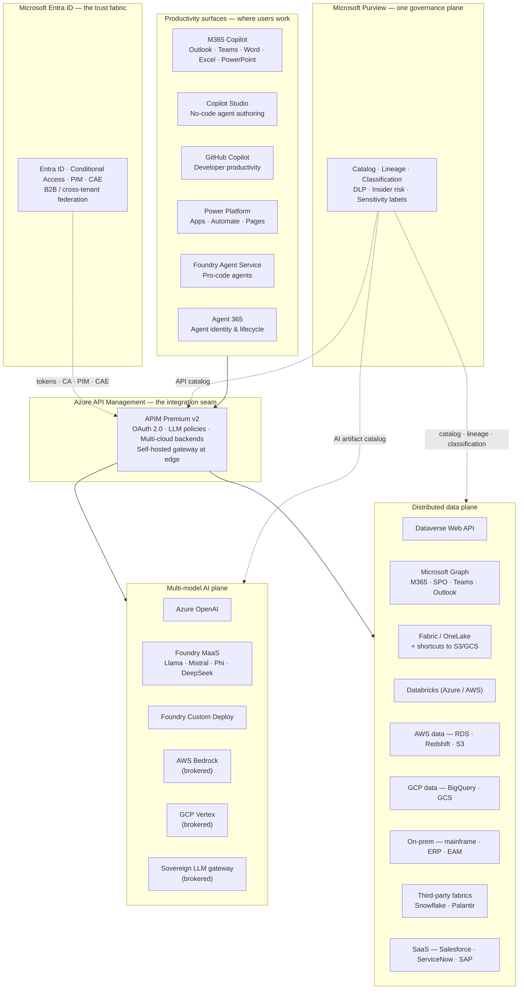

# Cross-Platform Integration — Microsoft as the Connective Tissue

## The architectural position in one sentence

> Microsoft does not need to be the only AI in a heterogeneous environment. Microsoft is positioned as the **layer that makes the ecosystem work** — and the layer that connects that ecosystem to where the workforce actually does its job.

A modern enterprise environment is plural. It includes Azure, AWS, often GCP, Databricks, third-party data fabrics, partner LLM gateways, on-prem systems-of-record, and a Microsoft 365 estate where the workforce reads email and edits documents. Any platform proposal that assumes mono-vendor loses. Any platform that respects the ecosystem and offers to bind it together wins.

This use case documents the integration architecture in full.

---

## The integration map

The picture has three load-bearing seams:

1. **APIM is the seam between consumers and backends.** One URL, one auth, one observability surface, one cost model — regardless of where the backend lives.
2. **Entra is the trust fabric across all seams.** Every API call carries an identity-grounded token. Conditional Access, PIM, and CAE apply universally.
3. **Purview is the seam between data, APIs, and AI.** One catalog, one lineage graph, one classification system — across clouds, on-prem, and SaaS.

Stand any one of these up alone and you have a useful capability. Stand all three up together and you have **a secure interoperability layer for a heterogeneous ecosystem** — which is the architectural goal.

---

## Six concrete integration patterns

### Pattern 1 — Cross-cloud data without movement

Authoritative data typically lives in S3 (AWS), GCS (GCP), ADLS (Azure), and on-prem file shares simultaneously. The pattern:

- **OneLake shortcuts** point at S3 / GCS / ADLS — the data appears in OneLake without copying
- **APIM façades** expose AWS RDS / Redshift / on-prem databases as REST APIs
- **Synapse OPENROWSET** queries Parquet / Delta in any storage with T-SQL
- **Power BI DirectQuery** runs reports across multiple clouds in one composite model

No data moves. Compute travels to the data. The same Purview catalog covers all of it.

### Pattern 2 — Identity that reaches every system

Single-sign-on is a 20-year-old technology. The 2026 reality is harder: device-trust signals, geolocation, real-time risk, just-in-time elevation, continuous re-evaluation. Entra provides:

- **OIDC / SAML federation** to any IdP at any regional site or partner
- **B2B / cross-tenant access settings** for federated tenants and vendors
- **Conditional Access** on every API call, with rich signals
- **PIM** for just-in-time admin elevation
- **CAE** that revokes tokens within minutes on risk events
- **Workload identity** for non-human callers — managed identities, federated identity credentials for K8s, service principals with certificates

No competing identity plane reaches this combination of capabilities. Cognito doesn't. Okta does some of it but not the workload identity / managed identity story. Ping does some of it but with a separate licensing model.

### Pattern 3 — One gateway, many model backends

The MCP-server-behind-APIM pattern is documented in detail in [the APIM + MCP guide](../guides/apim-mcp-layered-orchestration.md). The short version:

- Agents call APIM
- APIM applies `llm-token-limit`, `llm-semantic-cache-*`, `llm-content-safety`
- APIM routes to one of: Azure OpenAI deployments (multi-region pool with circuit breaker), Foundry MaaS models, Foundry custom deployments, brokered external models (Bedrock, sovereign)
- Token usage is emitted with subscription + model dimensions
- Chargeback flows from App Insights to FinOps

This pattern is uniquely cheap on Azure because APIM, Entra, App Insights, and Foundry compose. The equivalent on AWS is 5–7 separate products glued with Lambda.

### Pattern 4 — Productivity reach (the asymmetry)

The Microsoft asymmetry that no competitor matches: **the same APIs that the agents call are also the surfaces where users actually work**.

| Surface | What it consumes | Why it matters |
|---|---|---|
| M365 Copilot | Graph API, all of M365 | The default tenant data — where users live |
| Copilot Studio | APIM, Dataverse, Power Platform connectors, MCP | Citizen developers wire APIs into business workflows |
| GitHub Copilot | Repos, custom skills, Entra-grounded | Developer productivity in the same identity graph |
| Power Apps / Automate / Pages | Dataverse + 1,400+ connectors | Business-process automation with the same auth |
| Sales / Service / Finance Copilots | Dynamics + Graph | Role-specific copilots grounded in the workforce |
| Foundry Agent Service | MCP, OpenAPI tools, Foundry models | Pro-code agents in the same governance plane |

This is the differentiator against integration narratives anchored on SharePoint-only connectivity. Microsoft integrates with **every productivity surface a workforce uses, in one identity graph**.

### Pattern 5 — Governance that crosses clouds and systems

Purview is the only governance plane that natively spans Azure, AWS, GCP, on-prem, and SaaS:

- **Catalog scope** — data assets in any storage; APIs in any cloud; AI artifacts (models, prompt flows, evaluations)
- **Sensitivity labels** — apply at the document, table, or API level; propagate through APIs to AI outputs
- **Lineage** — from source system, through API, through model, to report or response
- **DLP** — applied at endpoint, M365, cloud apps; same policies, same labels, same enforcement points
- **Insider risk** — Purview Insider Risk Management on behavior across surfaces

The Lake Formation + tags equivalent on AWS covers S3 / Glue / Redshift well. It does not cover APIs, AI artifacts, M365, or cross-cloud. The Purview reach is decisive for any environment with data outside of one cloud or a productivity estate inside Microsoft 365.

### Pattern 6 — Agent identity and lifecycle

Agents are not just a new application type — they are a new principal type. They authenticate, hold tokens, call tools, write data, and need lifecycle management. The Microsoft answer:

- **Agent 365** — control plane for cross-tenant agent identity, lifecycle, governance, audit
- **Entra workload identities** — agents authenticate as first-class principals, not on behalf of a service account
- **Purview AI artifact catalog** — agents, prompt flows, evaluations, fine-tunes all catalogued
- **APIM as the agent's egress point** — every agent call to a tool flows through the gateway with policy, rate-limit, cost governance, and audit
- **Foundry Evaluations** — continuous evaluation of agent behavior; regression on prompt or model change

The agent lifecycle problem is the next mile of AI governance. Microsoft has the integrated answer; the competing platforms do not.

---

## The architectural framing — "the connective tissue"

The position in five lines:

1. Modern enterprises build ecosystems, they do not buy one AI.
2. Ecosystems generate four hard problems: orchestration, governance, integration, lifecycle.
3. Microsoft is the only vendor that solves all four natively, on one integrated platform.
4. The seam is APIM, Entra, Purview — operating across any cloud, any system, any boundary.
5. The differentiator is productivity reach — Microsoft's surfaces are where users actually work, and the same identity / governance / gateway reaches them.

This is the architectural position. It is also the position most resistant to substitution: when a new vendor enters the environment (a sovereign LLM, a partner data fabric, a regional system), the seam absorbs the new participant. The architectural value compounds.

---

## How to start producing value — the minimum-disruption sequence

The pattern is engineered to require **minimum change to existing investments** to start producing value:

1. Stand up APIM Premium v2 (Bicep template available in the [Solution Store](../solution-store/index.md))
2. Federate or align the Entra tenant with existing identity sources
3. Register the first existing API behind APIM via OpenAPI import
4. Stand up Purview and connect to the first three data sources
5. Run one Copilot Studio agent against the new front door
6. Measure: latency, cache hit rate, cost, audit completeness
7. Repeat for the second domain

At each step the architecture accumulates capability without disturbing existing investments. This is the minimum-disruption path in concrete form.

---

## Quick links

- [Use case — API-first multi-model AI ecosystem](./api-first-multi-model-ai-ecosystem.md)
- [Use case — Dataverse API integration](./dataverse-api-integration.md)
- [Use case — Enterprise asset management through APIM](./enterprise-asset-management-apim.md)
- [Reference architecture — API-first multi-model ecosystem](../reference-architecture/api-first-multi-model-ecosystem.md)
- [Best practice — Multi-model AI orchestration](../best-practices/multi-model-ai-orchestration.md)
- [Guide — APIM + MCP layered orchestration](../guides/apim-mcp-layered-orchestration.md)
- [Whitepaper — API-first data strategy on Azure](../research/api-first-data-strategy-whitepaper.md)
