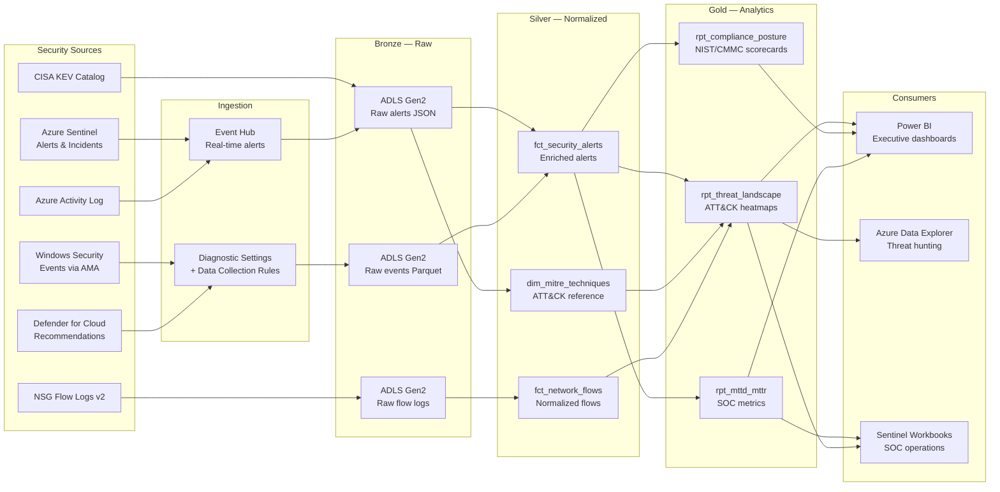
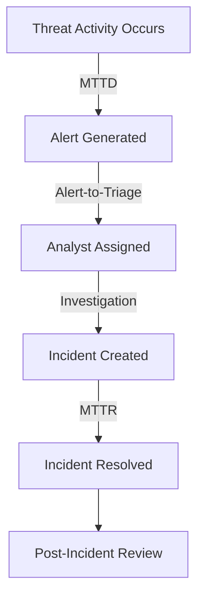

## Federal Cybersecurity & Threat Analytics on Azure

Federal Security Operations Centers generate millions of events daily across endpoints, network perimeters, identity systems, and cloud workloads. Individually, each telemetry source captures a narrow slice of attacker behavior. Combined in a unified analytical platform, they enable MITRE ATT&CK technique correlation, mean-time-to-detect/respond (MTTD/MTTR) tracking, anomaly-based threat hunting, and continuous compliance posture assessment against CMMC, NIST 800-53, and FedRAMP controls.

This use case applies the CSA-in-a-Box medallion architecture to federal cybersecurity telemetry, demonstrating how near-real-time alert ingestion and batch log processing converge in a single lakehouse to support both operational SOC workflows and executive compliance reporting.

---

## Data Sources

| Source | Description | Volume / Coverage | Update Frequency | Access Method |
|---|---|---|---|---|
| **Azure Sentinel Alerts** | Security alerts from analytics rules, ML models, and fusion detection | Varies by environment, typically 1K–100K alerts/day | Near real-time | Log Analytics API / Event Hub export |
| **Windows Security Events** | Logon events (4624/4625), process creation (4688), privilege use (4672), service installs (7045) | 10–500 GB/day depending on endpoint count | Real-time via AMA | Data Collection Rules → Log Analytics |
| **NSG Flow Logs** | Network Security Group flow records — source/dest IP, port, protocol, bytes, allow/deny | 1–50 GB/day per subscription | 1-minute aggregation | ADLS Gen2 (JSON) |
| **Azure Activity Log** | Control-plane operations — resource creation, RBAC changes, policy assignments | Low volume, high signal | Near real-time | Diagnostic Settings → Event Hub |
| **Microsoft Defender for Cloud** | Security recommendations, secure score, vulnerability assessments, regulatory compliance | Per-subscription | Continuous | REST API / Log Analytics |
| **CISA KEV Catalog** | Known Exploited Vulnerabilities — CVEs with mandated remediation deadlines | ~1,100 entries, growing | Updated as needed | JSON download / REST API |

!!! info "Data Collection"
    Windows Security Events use the Azure Monitor Agent (AMA) with Data Collection Rules for selective event forwarding. NSG Flow Logs v2 write directly to ADLS Gen2. Sentinel alerts can be exported to Event Hub for real-time downstream processing. The CISA KEV catalog is publicly available at [cisa.gov/known-exploited-vulnerabilities-catalog](https://www.cisa.gov/known-exploited-vulnerabilities-catalog).

---

## Architecture

The architecture separates two ingestion paths: a **hot path** for real-time alert triage through Event Hub and Azure Data Explorer, and a **batch path** for historical log normalization through ADLS and dbt. Both paths converge in Gold-layer analytical models consumed by Power BI dashboards, Sentinel workbooks, and ADX near-real-time queries.



---

## Step-by-Step Implementation

### 1. Deploy Sentinel Workspace

The Bicep template provisions a Log Analytics workspace, enables the Microsoft Sentinel solution, configures data connectors for Azure Activity, Azure AD, and Microsoft 365 Defender, and sets up a Data Collection Rule for selective Windows Security Event forwarding.

```bicep
// sentinel-workspace.bicep — key resource definitions

@description('Log Analytics data retention in days')
@minValue(30)
@maxValue(730)
param retentionDays int = 90

resource workspace 'Microsoft.OperationalInsights/workspaces@2022-10-01' = {
  name: '${namePrefix}-law-${environment}'
  location: location
  properties: {
    sku: { name: 'PerGB2018' }
    retentionInDays: retentionDays
    features: {
      enableLogAccessUsingOnlyResourcePermissions: true
    }
    workspaceCapping: {
      dailyQuotaGb: environment == 'prd' ? -1 : 5
    }
  }
}

resource sentinel 'Microsoft.OperationsManagement/solutions@2015-11-01-preview' = {
  name: 'SecurityInsights(${workspaceName})'
  location: location
  plan: {
    name: 'SecurityInsights(${workspaceName})'
    publisher: 'Microsoft'
    product: 'OMSGallery/SecurityInsights'
  }
  properties: {
    workspaceResourceId: workspace.id
  }
}

// Data Collection Rule — selective Windows Security Events
resource dataCollectionRule 'Microsoft.Insights/dataCollectionRules@2022-06-01' = {
  name: '${namePrefix}-dcr-winsec-${environment}'
  location: location
  properties: {
    dataSources: {
      windowsEventLogs: [{
        name: 'securityEvents'
        streams: ['Microsoft-SecurityEvent']
        xPathQueries: [
          'Security!*[System[(EventID=4624 or EventID=4625 or EventID=4634 or EventID=4648 or EventID=4672 or EventID=4688 or EventID=4720 or EventID=4726 or EventID=7045)]]'
        ]
      }]
    }
    destinations: {
      logAnalytics: [{
        name: 'sentinelWorkspace'
        workspaceResourceId: workspace.id
      }]
    }
    dataFlows: [{
      streams: ['Microsoft-SecurityEvent']
      destinations: ['sentinelWorkspace']
    }]
  }
}
```

Deploy with:

```bash
az deployment group create \
  --resource-group rg-cyber-dev \
  --template-file examples/cybersecurity/deploy/sentinel-workspace.bicep \
  --parameters namePrefix=csa environment=dev retentionDays=90
```

!!! note "Full Templates"
    Complete Bicep templates are in `examples/cybersecurity/deploy/`. The workspace template also provisions a managed identity and diagnostic settings for workspace audit logging.

---

### 2. Configure Sentinel Analytics Rules

Analytics rules define the detection logic that generates alerts. The project includes five pre-built rules covering common attack patterns mapped to MITRE ATT&CK tactics.

```bicep
// analytics-rules.bicep — Brute Force Detection example

resource bruteForceRule 'Microsoft.SecurityInsights/alertRules@2023-02-01-preview' = {
  scope: workspace
  name: guid(workspace.id, 'brute-force-detection')
  kind: 'Scheduled'
  properties: {
    displayName: 'Brute Force Attack - Multiple Failed Sign-Ins'
    severity: 'Medium'
    query: '''
      SigninLogs
      | where ResultType != "0"
      | summarize FailedAttempts = count(),
          TargetAccounts = dcount(UserPrincipalName),
          Accounts = make_set(UserPrincipalName, 10)
        by IPAddress, bin(TimeGenerated, 5m)
      | where FailedAttempts > 10
    '''
    queryFrequency: 'PT5M'
    queryPeriod: 'PT10M'
    tactics: ['CredentialAccess']
    techniques: ['T1110']
  }
}
```

| Rule | Tactic | Technique | Severity |
|---|---|---|---|
| Brute Force — Failed Sign-Ins | Credential Access | T1110 | Medium |
| Suspicious PowerShell Execution | Execution, Defense Evasion | T1059.001 | High |
| Lateral Movement — RDP from Unusual Source | Lateral Movement | T1021.001 | High |
| Data Exfiltration — Large Outbound Transfer | Exfiltration | T1048 | High |
| Communication with Known Malicious IP | Command and Control | T1071 | High |

---

### 3. MITRE ATT&CK Correlation (dbt Silver)

The `dim_mitre_techniques` model normalizes the ATT&CK framework into a queryable dimension, enabling enrichment of every alert with tactic context, severity weighting, and parent-technique rollups.

```sql
-- domains/silver/dim_mitre_techniques.sql
WITH raw_techniques AS (
    SELECT
        id              AS technique_id,
        name            AS technique_name,
        tactic          AS tactic_name,
        severity_weight AS severity_weight,
        data_sources    AS data_sources
    FROM {{ source('mitre_reference', 'mitre_attack_mapping') }}
),

enriched AS (
    SELECT
        technique_id,
        technique_name,
        tactic_name,
        CASE
            WHEN CONTAINS(technique_id, '.')
            THEN SUBSTRING(technique_id, 1, INSTR(technique_id, '.') - 1)
            ELSE technique_id
        END AS parent_technique_id,
        CONTAINS(technique_id, '.') AS is_sub_technique,
        severity_weight,
        CASE
            WHEN severity_weight >= 0.9 THEN 'Critical'
            WHEN severity_weight >= 0.7 THEN 'High'
            WHEN severity_weight >= 0.5 THEN 'Medium'
            ELSE 'Low'
        END AS severity_tier,
        CURRENT_TIMESTAMP() AS updated_at
    FROM raw_techniques
)

SELECT * FROM enriched
```

The `fct_security_alerts` model joins raw alerts to MITRE dimensions, producing enriched rows with composite risk scores used by all Gold-layer reports.

---

### 4. Anomaly Detection with Isolation Forest

The ML pipeline extracts behavioral features from Silver-layer alerts and applies an Isolation Forest model to flag structurally unusual activity. This surfaces alerts that rule-based detection might miss.

```python
# Feature engineering from security alert patterns
feature_cols = [
    "hour_of_day",      # Temporal — off-hours activity
    "day_of_week",      # Temporal — weekend activity
    "is_business_hours", # Binary flag
    "severity_level",    # Numeric severity (1-4)
    "provider_frequency", # How common is this alert source
    "technique_frequency", # How common is this MITRE technique
]

X = pdf[feature_cols].fillna(0).values
scaler = StandardScaler()
X_scaled = scaler.fit_transform(X)

# Isolation Forest — ~15% expected anomaly rate
iso_forest = IsolationForest(
    n_estimators=100,
    contamination=0.15,
    random_state=42,
    n_jobs=-1,
)
pdf["anomaly_label"] = iso_forest.fit_predict(X_scaled)
pdf["anomaly_score"] = iso_forest.decision_function(X_scaled)

# Composite priority score
pdf["priority_score"] = (
    0.40 * (pdf["severity_level"] / 4.0) +
    0.35 * pdf["anomaly_normalized"] +
    0.25 * (pdf["technique_frequency"] / pdf["technique_frequency"].max()).fillna(0)
)
```

!!! warning "Model Tuning"
    The `contamination=0.15` parameter should be calibrated to your environment's baseline alert volume. High-alert environments may need lower contamination rates to avoid alert fatigue. Evaluate precision/recall trade-offs on labeled historical data before production deployment.

---

### 5. Compliance Posture Scoring (dbt Gold)

The `rpt_compliance_posture` model maps MITRE ATT&CK tactics to NIST 800-53 control families, producing a gap analysis with remediation priority scoring. This supports continuous monitoring requirements under CMMC, FedRAMP, and FISMA.

```sql
-- domains/gold/rpt_compliance_posture.sql (abbreviated)
WITH control_mapping AS (
    SELECT * FROM (VALUES
        ('Initial Access',       'AC', 'Access Control',        'AC-17', 'Remote Access'),
        ('Execution',            'SI', 'System Integrity',      'SI-3',  'Malicious Code Protection'),
        ('Credential Access',    'IA', 'Identification & Auth', 'IA-5',  'Authenticator Management'),
        ('Lateral Movement',     'AC', 'Access Control',        'AC-4',  'Information Flow Enforcement'),
        ('Exfiltration',         'SC', 'System & Comms',        'SC-7',  'Boundary Protection'),
        ('Command and Control',  'SC', 'System & Comms',        'SC-7',  'Boundary Protection')
    ) AS t(tactic_name, control_family_id, control_family_name, control_id, control_name)
),

posture AS (
    SELECT
        cm.control_id,
        cm.control_name,
        cm.tactic_name AS associated_tactic,
        COALESCE(am.alert_count, 0) AS alert_count_30d,
        CASE
            WHEN am.max_severity >= 3 THEN 'At Risk'
            WHEN am.alert_count > 5   THEN 'Needs Review'
            ELSE 'Monitored'
        END AS compliance_status,
        ROUND(
            COALESCE(am.avg_risk_score, 0) * LOG2(COALESCE(am.alert_count, 0) + 1), 2
        ) AS remediation_priority
    FROM control_mapping cm
    LEFT JOIN alert_metrics am ON cm.tactic_name = am.tactic_name
)

SELECT * FROM posture ORDER BY remediation_priority DESC
```

| Framework | Controls Mapped | Assessment Frequency |
|---|---|---|
| NIST 800-53 Rev 5 | AC, CM, IA, SI, SC, CP, MP | Continuous (30-day rolling) |
| CMMC Level 2 | Maps via NIST 800-53 crosswalk | Continuous |
| FedRAMP High | Inherits NIST 800-53 High baseline | Continuous |

---

### 6. KQL Threat Hunting

Pre-built KQL queries execute against the Sentinel workspace for proactive threat hunting. These can run interactively in Sentinel or programmatically via the Azure Monitor Query API.

```kql
// Hunt: C2 Beaconing Detection
// Identifies periodic outbound connections indicating command-and-control
AzureNetworkAnalytics_CL
| where TimeGenerated > ago(24h)
| where FlowDirection_s == "O" and FlowStatus_s == "A"
| where not(ipv4_is_private(DestIP_s))
| summarize
    ConnectionCount = count(),
    AvgInterval = avg(datetime_diff('second', TimeGenerated,
        prev(TimeGenerated, 1)))
  by SrcIP_s, DestIP_s, DestPort_d, bin(TimeGenerated, 1h)
| where ConnectionCount > 20
| extend BeaconScore = iff(AvgInterval between (50 .. 70), "High", "Low")
| where BeaconScore == "High"
```

```kql
// Hunt: Pass-the-Hash Indicators
SecurityEvent
| where TimeGenerated > ago(7d)
| where EventID == 4624
| where LogonType == 9
    or (LogonType == 3 and AuthenticationPackageName == "NTLM")
| where AccountType == "User"
| summarize
    LogonCount = count(),
    UniqueTargets = dcount(Computer),
    Targets = make_set(Computer, 10)
  by TargetAccount, IpAddress
| where UniqueTargets > 3
| order by UniqueTargets desc
```

Additional hunts included in the project: unusual process execution from non-standard paths, privilege escalation via admin group membership changes, and suspicious PowerShell with obfuscation indicators.

---

### 7. CISA BOD Automation

The pipeline ingests the CISA Known Exploited Vulnerabilities (KEV) catalog and correlates entries against Defender for Cloud vulnerability assessments to identify assets with mandated remediation deadlines under Binding Operational Directive 22-01.

```python
import requests
import pandas as pd

# Fetch current CISA KEV catalog
kev_url = "https://www.cisa.gov/sites/default/files/feeds/known_exploited_vulnerabilities.json"
response = requests.get(kev_url)
kev_data = response.json()

df_kev = pd.json_normalize(kev_data["vulnerabilities"])
df_kev["dueDate"] = pd.to_datetime(df_kev["dueDate"])

# Flag overdue vulnerabilities
df_kev["is_overdue"] = df_kev["dueDate"] < pd.Timestamp.now()
overdue_count = df_kev["is_overdue"].sum()
print(f"CISA KEV: {len(df_kev)} total, {overdue_count} past remediation deadline")

# Join against Defender for Cloud findings to identify affected assets
# df_findings = spark.table("cybersecurity_silver.fct_vulnerability_findings")
# df_matched = df_findings.join(df_kev_spark, on="cveId", how="inner")
```

---

## Zero Trust Analytics Integration

The analytics pipeline supports Zero Trust Architecture principles by providing continuous verification signals across identity, device, network, and workload pillars.

| Zero Trust Pillar | Data Source | Analytics Output |
|---|---|---|
| **Identity** | Azure AD Sign-In Logs, Security Events (4624/4625) | Impossible travel detection, brute force alerts, MFA gap analysis |
| **Device** | Defender for Endpoint, Security Events (7045) | Endpoint compliance scoring, unauthorized software detection |
| **Network** | NSG Flow Logs, DNS logs | Lateral movement detection, C2 beaconing, data exfiltration tracking |
| **Workload** | Azure Activity Log, Defender for Cloud | Resource misconfiguration alerts, privilege escalation detection |
| **Data** | DLP alerts, Azure Information Protection | Sensitive data access anomalies, unauthorized sharing patterns |

!!! tip "Conditional Access Integration"
    Anomaly scores from the Isolation Forest model can feed Azure AD Conditional Access policies via custom risk signals, enabling automated session revocation when user behavior deviates from baseline.

---

## MTTD/MTTR Reporting

The Gold-layer `rpt_mttd_mttr` model computes SOC performance metrics from alert and incident lifecycle timestamps.

| Metric | Definition | Target (Federal SOC) |
|---|---|---|
| **MTTD** | Time from threat activity to first alert generation | < 15 minutes |
| **MTTR** | Time from alert creation to incident closure | < 4 hours (Critical), < 24 hours (High) |
| **Alert-to-Triage** | Time from alert creation to analyst assignment | < 10 minutes |
| **False Positive Rate** | Percentage of alerts closed as benign | < 30% |
| **Coverage Ratio** | MITRE ATT&CK techniques with active detection rules | > 60% of applicable techniques |



---

## Azure Government Deployment

For FedRAMP High workloads, deploy all resources to Azure Government regions. Key differences from commercial Azure:

| Component | Commercial | Azure Government |
|---|---|---|
| Sentinel | All regions | USGov Virginia, USGov Arizona |
| Log Analytics | All regions | USGov Virginia, USGov Arizona, USDoD Central, USDoD East |
| Event Hub | All regions | USGov Virginia, USGov Arizona |
| ADLS Gen2 | All regions | USGov Virginia, USGov Arizona |
| Defender for Cloud | All regions | USGov Virginia, USGov Arizona |
| ARM endpoint | `management.azure.com` | `management.usgovcloudapi.net` |

!!! warning "Azure Government Considerations"
    - Use `az cloud set --name AzureUSGovernment` before deploying
    - Sentinel content hub solutions may have delayed availability in government regions
    - Log Analytics workspace IDs differ between clouds — update `WORKSPACE_ID` references
    - Some Defender for Cloud features (e.g., CSPM) may have feature parity gaps — check [Azure Government services availability](https://learn.microsoft.com/en-us/azure/azure-government/compare-azure-government-global-azure)

```bash
# Deploy to Azure Government
az cloud set --name AzureUSGovernment
az login

az deployment group create \
  --resource-group rg-cyber-prd \
  --template-file examples/cybersecurity/deploy/sentinel-workspace.bicep \
  --parameters namePrefix=csa environment=prd retentionDays=365
```

---

## Project Structure

```
examples/cybersecurity/
├── contracts/
│   └── sentinel-alerts.yaml          # Data contract for alert schema
├── data/
│   ├── cisa-kev-sample.json          # Sample CISA KEV catalog
│   ├── mitre-attack-mapping.json     # ATT&CK technique reference
│   ├── sample-network-flows.csv      # Sample NSG flow data
│   └── sample-sentinel-alerts.json   # Sample Sentinel alerts
├── deploy/
│   ├── analytics-rules.bicep         # Sentinel detection rules
│   └── sentinel-workspace.bicep      # Workspace + connectors
├── domains/
│   ├── bronze/
│   │   └── stg_sentinel_alerts.sql   # Raw alert staging
│   ├── silver/
│   │   ├── dim_mitre_techniques.sql  # ATT&CK dimension
│   │   └── fct_security_alerts.sql   # Enriched alert facts
│   └── gold/
│       ├── rpt_compliance_posture.sql # NIST/CMMC gap analysis
│       └── rpt_threat_landscape.sql   # Threat activity summary
└── notebooks/
    ├── 01-alert-exploration.py       # Data profiling
    ├── 02-threat-detection-ml.py     # Isolation Forest anomaly detection
    └── 03-kql-threat-hunting.py      # KQL hunt library
```

---

## Sources

- [MITRE ATT&CK Framework](https://attack.mitre.org/) — Technique and tactic taxonomy
- [MITRE ATT&CK Enterprise Matrix](https://attack.mitre.org/matrices/enterprise/) — Full technique mapping
- [CISA Known Exploited Vulnerabilities Catalog](https://www.cisa.gov/known-exploited-vulnerabilities-catalog) — Mandated remediation tracking
- [CISA Binding Operational Directive 22-01](https://www.cisa.gov/news-events/directives/bod-22-01-reducing-significant-risk-known-exploited-vulnerabilities) — Federal vulnerability remediation requirements
- [NIST SP 800-53 Rev 5](https://csrc.nist.gov/publications/detail/sp/800-53/rev-5/final) — Security and privacy controls
- [CMMC Model Overview](https://dodcio.defense.gov/CMMC/) — DoD cybersecurity maturity model
- [Microsoft Sentinel Documentation](https://learn.microsoft.com/en-us/azure/sentinel/) — SIEM deployment and configuration
- [Azure Government Documentation](https://learn.microsoft.com/en-us/azure/azure-government/) — FedRAMP High deployment guidance
- [FedRAMP Authorization](https://www.fedramp.gov/) — Federal cloud security authorization program
