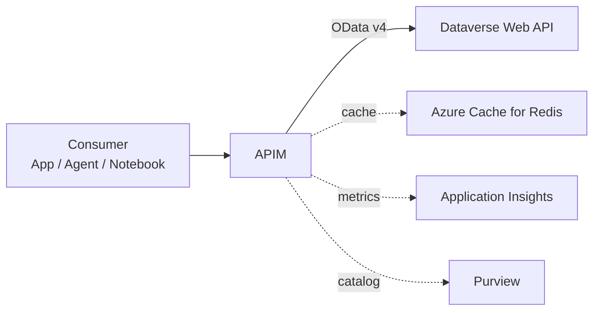
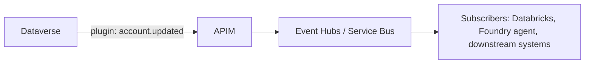

# Dataverse as a First-Class API Surface

## Why this use case exists

Architects evaluating Microsoft as the integration backbone for a multi-vendor AI ecosystem ask a specific, fair, technically pointed question:

> **"How would Dataverse be connected via a RESTful API? And how do you know what's in the API?"**

The answer wins or loses credibility on every other claim. This document is the complete technical answer, with working code.

---

## The short answer

Dataverse exposes a fully **OData v4-compliant Web API** at `https://{org}.api.crm.dynamics.com/api/data/v9.2/`. Every table, column, choice set, relationship, and bound action is reachable through that endpoint, and the entire schema is discoverable at runtime through the `$metadata` document — the OData equivalent of an OpenAPI specification. Authentication is OAuth 2.0 against Microsoft Entra ID. Any system that can issue an HTTPS request with a bearer token can read or write Dataverse — a Databricks notebook, a Python script, a Foundry agent, a Power Automate flow, a mainframe Java program, or a third-party SaaS application.

---

## The full Web API surface

### Endpoint structure

The endpoint format depends on the cloud boundary:

| Boundary | Endpoint format |
|---|---|
| Commercial | `https://{org}.api.crm.dynamics.com/api/data/v9.2/` |
| GCC | `https://{org}.api.crm9.dynamics.com/api/data/v9.2/` |
| GCC High | `https://{org}.api.crm.microsoftdynamics.us/api/data/v9.2/` |
| DoD | `https://{org}.api.crm.appsplatform.us/api/data/v9.2/` |
| China | `https://{org}.api.crm.dynamics.cn/api/data/v9.2/` |

The path structure is identical across boundaries. The accreditation is what changes.

### Core operations

| Operation | Method + path | Notes |
|---|---|---|
| List | `GET /accounts` | Returns paged collection with `$filter`, `$select`, `$expand`, `$top`, `$skip`, `$orderby`, `$count` |
| Retrieve | `GET /accounts({id})` | UUID-keyed; `$select` and `$expand` apply |
| Create | `POST /accounts` body=JSON | Returns 204 + `OData-EntityId` header containing the new URL |
| Update | `PATCH /accounts({id})` body=JSON | Partial update; only modifies specified fields |
| Upsert | `PATCH /accounts({id})` + `If-Match: *` or `If-None-Match: *` | Conditional upsert by primary key |
| Delete | `DELETE /accounts({id})` | Soft/hard depending on entity configuration |
| Bound action | `POST /accounts({id})/Microsoft.Dynamics.CRM.Merge` body=JSON | Strongly-typed actions on a record |
| Unbound function | `GET /WhoAmI` | Strongly-typed functions on the service |
| Custom API | `POST /{publisher}_{action}` body=JSON | Author your own server-side endpoints |
| Batch | `POST /$batch` body=multipart | Multiple operations in one transaction |
| Change-tracking | `GET /accounts?$select=name&$deltatoken=...` | Initial fetch returns delta token; subsequent reads return only changes |

### Useful headers

| Header | Purpose |
|---|---|
| `Authorization: Bearer {token}` | OAuth 2.0 access token |
| `OData-Version: 4.0` | Required by OData v4 |
| `OData-MaxVersion: 4.0` | Required |
| `Accept: application/json` | JSON responses |
| `Prefer: odata.include-annotations="*"` | Include picklist labels, lookup display names, etc. |
| `Prefer: return=representation` | Return the new/updated record on `POST` / `PATCH` |
| `If-Match: *` | Concurrency / upsert semantics |
| `MSCRM.SuppressDuplicateDetection: true` | Bypass duplicate-detection rules |

### Query operators

OData v4 query options Dataverse supports:

```http
GET /accounts?
  $select=name,accountnumber,revenue,modifiedon&
  $filter=revenue gt 1000000 and statecode eq 0&
  $orderby=revenue desc&
  $top=50&
  $count=true&
  $expand=primarycontactid($select=fullname,emailaddress1)
```

Functions: `contains`, `startswith`, `endswith`, `not contains`, `Microsoft.Dynamics.CRM.In`, `Microsoft.Dynamics.CRM.Between`, `Microsoft.Dynamics.CRM.LastXDays`, etc.

---

## Metadata discovery — answering "how do you know what's in the API?"

This is the section that wins technical credibility. The Dataverse Web API is **fully introspectable**:

### The `$metadata` document — CSDL

```http
GET https://{org}.api.crm.dynamics.com/api/data/v9.2/$metadata
Authorization: Bearer {token}
Accept: application/xml
```

Returns the **Common Schema Definition Language (CSDL)** document — an XML manifest of every entity, attribute, relationship, choice set, function, and action available in the environment. This is the OData equivalent of an OpenAPI / Swagger document, generated automatically and always current.

Excerpt:

```xml
<EntityType Name="account">
  <Key><PropertyRef Name="accountid"/></Key>
  <Property Name="accountid" Type="Edm.Guid" Nullable="false"/>
  <Property Name="name" Type="Edm.String" MaxLength="160"/>
  <Property Name="accountnumber" Type="Edm.String" MaxLength="20"/>
  <Property Name="revenue" Type="Edm.Decimal" Precision="28" Scale="4"/>
  <Property Name="industrycode" Type="Edm.Int32"/>
  <NavigationProperty Name="primarycontactid" Type="Microsoft.Dynamics.CRM.contact"/>
  ...
</EntityType>
```

### Programmatic metadata APIs

Beyond the static CSDL, Dataverse exposes a typed Metadata Web API for fine-grained discovery:

```http
# All entity definitions (one row per table)
GET /api/data/v9.2/EntityDefinitions
  ?$select=LogicalName,DisplayName,EntitySetName,IsCustomEntity,PrimaryIdAttribute

# Attribute definitions for one entity
GET /api/data/v9.2/EntityDefinitions(LogicalName='account')/Attributes
  ?$select=LogicalName,AttributeType,DisplayName,IsCustomAttribute,RequiredLevel,MaxLength

# A specific attribute, with picklist options if applicable
GET /api/data/v9.2/EntityDefinitions(LogicalName='account')/Attributes(LogicalName='industrycode')
  /Microsoft.Dynamics.CRM.PicklistAttributeMetadata?$expand=OptionSet

# Relationships
GET /api/data/v9.2/RelationshipDefinitions

# Specific one-to-many relationship
GET /api/data/v9.2/RelationshipDefinitions(SchemaName='account_primary_contact')
  /Microsoft.Dynamics.CRM.OneToManyRelationshipMetadata
```

The result: a consuming application can, at runtime, enumerate every table, every attribute, every relationship, every choice set, and every option label. **Nothing about the API surface is hidden.**

### What this means in practice

Three operational benefits flow from full introspection:

1. **Agents can plan against the surface.** A Foundry agent can call `/EntityDefinitions` to enumerate available tables, then make targeted queries. No hand-curated tool list required.
2. **External systems can self-update.** When Dataverse schema changes, integration code can detect the change automatically and adapt — instead of breaking silently and being patched after incidents.
3. **Generated client SDKs.** CSDL is a machine-readable schema; tools like the OData client generators or open-source SDKs (`pyodata`, `simple-odata-client`, `dataverse-sdk-python`) can generate strongly-typed client code.

---

## Authentication — the four patterns

| Pattern | When to use | Token flow |
|---|---|---|
| **Delegated (Authorization Code + PKCE)** | Interactive applications acting on behalf of a user | Auth code → access token + refresh token; user's permissions enforced |
| **Service principal (Client Credentials)** | Server-to-server, no user context | Client ID + secret/cert → app-only token; requires application user in Dataverse with assigned role |
| **Managed identity** | Azure-hosted callers (Functions, App Service, AKS, Databricks) | No secrets in code; identity assigned to the resource |
| **On-Behalf-Of (OBO)** | Middle-tier service calling Dataverse on behalf of an authenticated user | First token → token exchange → downstream token with user context preserved |

### Recommended posture for zero-trust environments

**Managed identity + APIM front-door.** The consuming application authenticates the upstream caller's Entra token at APIM. APIM forwards to Dataverse asserting its own managed identity. No shared secrets touch the application. Identity is end-to-end auditable.

### Required Dataverse-side setup for service principals

For the client credentials pattern, the service principal must be registered as an **application user** in the Dataverse environment and assigned a security role. Steps:

1. Register the app in Entra ID with no redirect URI (server-to-server)
2. Grant the app permission to `Dynamics CRM user_impersonation` (or a custom scope mapped to `Dataverse.user_impersonation`)
3. In the Dataverse environment's Settings → Users + permissions → Application users, create an application user backed by the app registration
4. Assign a security role (custom roles preferred; least-privilege)

The app then acquires tokens with `scope=https://{org}.api.crm.dynamics.com/.default`.

---

## A working example — Databricks reading Dataverse

This is the moment of truth in most evaluations. A Databricks notebook in the same Entra tenant reads Dataverse, with no data movement and no secrets in code:

```python
from azure.identity import ManagedIdentityCredential
import httpx
import pandas as pd

# Managed identity assigned to the Databricks workspace.
# In Azure Gov, the resource id of Dataverse changes — see the boundary table.
DV_RESOURCE = "https://yourorg.api.crm.dynamics.com"
DV_URL = f"{DV_RESOURCE}/api/data/v9.2/accounts"

cred = ManagedIdentityCredential()
token = cred.get_token(f"{DV_RESOURCE}/.default").token

headers = {
    "Authorization": f"Bearer {token}",
    "OData-MaxVersion": "4.0",
    "OData-Version": "4.0",
    "Accept": "application/json",
    # Include lookup display names and picklist labels in the response
    "Prefer": 'odata.include-annotations="*"',
}

params = {
    "$select": "name,accountnumber,industrycode,revenue,modifiedon",
    "$filter": "revenue gt 1000000 and statecode eq 0",
    "$orderby": "revenue desc",
    "$top": 5000,
}

records = []
url = DV_URL
with httpx.Client(timeout=60) as client:
    while url:
        resp = client.get(url, params=params if url == DV_URL else None, headers=headers)
        resp.raise_for_status()
        body = resp.json()
        records.extend(body["value"])
        url = body.get("@odata.nextLink")

# Land in bronze as Delta — never overwriting the system of record
df = spark.createDataFrame(pd.DataFrame(records))
df.write.format("delta").mode("overwrite").saveAsTable("bronze.dataverse_accounts")
```

Three properties of note:

1. **Zero data movement.** The data lives in Dataverse. Databricks reads it on demand.
2. **No secrets.** Managed identity issues the token.
3. **Identity carried through.** The Databricks identity is the principal in Dataverse audit logs — not a service account that masks attribution.

The same pattern works from a Foundry agent (the agent uses its assigned identity), an Azure Function (the function's managed identity), a Power Automate flow (the flow uses the user's delegated token), a third-party application (uses a registered app + client credentials), or a mainframe job (uses a service principal with a certificate).

---

## Writing data back to Dataverse

```python
new_account = {
    "name": "Acme Holdings",
    "accountnumber": "ACME-2026-0042",
    "revenue": 5_250_000.00,
    "industrycode": 1,
}

with httpx.Client(timeout=60) as client:
    resp = client.post(
        DV_URL,
        headers={**headers, "Prefer": "return=representation"},
        json=new_account,
    )
    resp.raise_for_status()
    created = resp.json()
    new_id = created["accountid"]
```

Update:

```python
patch = {"revenue": 6_100_000.00}
resp = client.patch(f"{DV_URL}({new_id})", headers=headers, json=patch)
resp.raise_for_status()
```

Batch — multiple operations in one transaction:

```http
POST /api/data/v9.2/$batch
Content-Type: multipart/mixed; boundary=batch_boundary

--batch_boundary
Content-Type: application/http

PATCH /accounts(00000000-0000-0000-0000-000000000001) HTTP/1.1
Content-Type: application/json

{"revenue": 7000000.00}
--batch_boundary
Content-Type: application/http

POST /contacts HTTP/1.1
Content-Type: application/json

{"firstname": "Jane", "lastname": "Doe", "parentcustomerid_account@odata.bind": "/accounts(00000000-0000-0000-0000-000000000001)"}
--batch_boundary--
```

---

## Patterns that win in production

### Pattern 1: Dataverse behind APIM

In a properly governed catalog, Dataverse is not called directly by consumers. APIM fronts it, and APIM provides:

- A stable endpoint that doesn't change when org URLs change
- Per-consumer rate limiting and quotas
- Caching for read-heavy queries
- Token validation and Conditional Access enforcement
- Consistent observability with the rest of the API estate
- Inclusion in the unified Purview API catalog

The pattern looks like:



### Pattern 2: Change tracking + delta tokens

For systems pulling Dataverse data on a schedule, full-table polling is wasteful. The delta-token pattern:

```http
# Initial pull
GET /accounts?$select=name,revenue,modifiedon&$deltatoken=null

# Subsequent pulls — token returned from previous response
GET /accounts?$select=name,revenue,modifiedon&$deltatoken={token}
```

Returns only records changed since the last token. Critical for high-volume integrations.

### Pattern 3: Custom APIs for complex operations

When a business operation involves several entities and needs to be atomic, expose it as a **Custom API** rather than orchestrating from the client:

```http
POST /api/data/v9.2/contoso_RecalculateAccountStandings
{
  "regionId": "us-east",
  "asOfDate": "2026-05-01"
}
```

The Custom API runs server-side, applies all business rules, and returns a strongly-typed result. The client signature stays stable even when the implementation changes.

### Pattern 4: Webhooks + Dataverse plugin → APIM

For event-driven integration, Dataverse plugins call webhooks on record changes. APIM is the natural webhook receiver:



Combined with Conditional Access and managed identities, this gives a complete event-driven integration story without polling.

---

## Where Dataverse fits in the API catalog

In a mature API-first catalog, Dataverse is one of several endpoint patterns that data products expose:

| Endpoint pattern | When to use |
|---|---|
| **Dataverse Web API** | Structured, transactional, user-curated business data with rich security |
| **Microsoft Graph API** | M365 content — mail, sites, files, Teams, calendar, people |
| **Data API Builder (DAB)** | Arbitrary SQL or Cosmos backends exposed as REST + GraphQL |
| **OneLake SQL endpoint** | Warehouse / lakehouse queries |
| **Bring-your-own REST** | Legacy systems, mainframe, SAP, EAM behind APIM façades |

All five flow through APIM. All five inherit the same identity model, the same rate limits, the same observability, the same Purview catalog entry, the same lineage. Dataverse is one peer among many — not a special case.

---

## Common pitfalls

| Pitfall | Mitigation |
|---|---|
| Hitting rate limits on bulk imports | Use the `$batch` endpoint; throttle to 60 requests/minute per app-user; consider Dataverse Bulk API for very large loads |
| Picklist values returned as integers, not labels | Add `Prefer: odata.include-annotations="*"` |
| Lookup fields returning GUIDs only | Use `$expand=lookupfield($select=name)` |
| Service principal "user not found" | Register an Application User in Dataverse and assign a security role |
| Tokens expiring mid-batch | Use `MSAL` token cache; or APIM-fronted with token refresh on the gateway |
| Pagination missed in client code | Always follow `@odata.nextLink` |
| Delta-token resets | Delta tokens can expire; on `410 Gone`, restart from null and full-load once |
| Concurrency conflicts on PATCH | Use ETags with `If-Match`; retry on `412` |
| Schema drift surprises consumers | Pin the API version (`v9.2`); subscribe to Dataverse "what's new" releases; use `$metadata` diffing in CI |

---

## Migration patterns

### From custom integrations talking to a SQL replica of Dataverse

Most legacy patterns replicate Dataverse to a SQL store and then query SQL. This is unnecessary in 2026:

- The Web API is performant enough for nearly any analytic use case
- Materialization can be done with Fabric / Databricks pulling directly via Web API
- The data residency model is simpler — one source of truth

The migration is straightforward: identify SQL queries hitting the replica, translate to OData filters / expansions, point at the Web API directly or through APIM.

### From MuleSoft or AWS connectors

If the agency is already using MuleSoft's Dataverse connector or AWS AppFlow's Dynamics 365 connector, the Web API is what those connectors call under the hood. Replacing the connector with a direct Web API call (or a Logic Apps / Power Automate flow) removes a per-connector license line item and a layer of indirection.

---

## Quick links

- [Use case — API-first multi-model AI ecosystem](./api-first-multi-model-ai-ecosystem.md)
- [Use case — Cross-platform integration with Microsoft as the connective tissue](./cross-platform-integration-fabric.md)
- [Guide — APIM as the universal API gateway](../guides/apim-universal-gateway.md)
- [Best practice — API-first data strategy](../best-practices/api-first-data-strategy.md)
- [Whitepaper — API-first data strategy on Azure](../research/api-first-data-strategy-whitepaper.md)
- [Microsoft Learn — Dataverse Web API reference](https://learn.microsoft.com/power-apps/developer/data-platform/webapi/overview)
