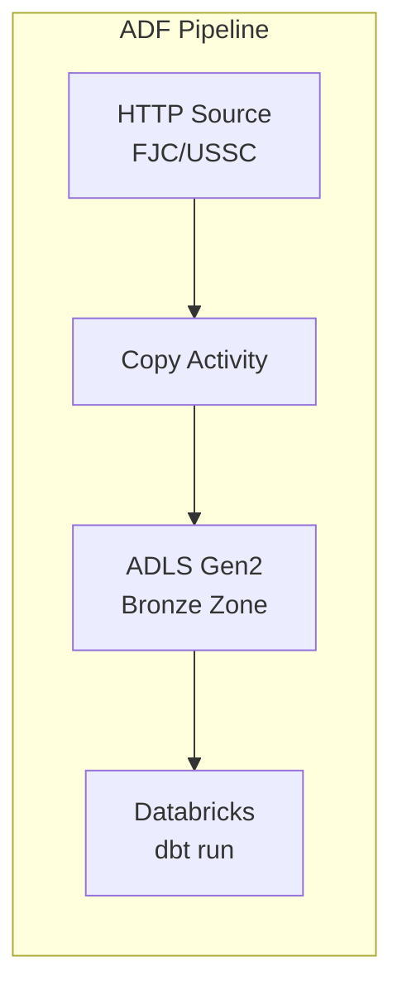

## DOJ Antitrust: Step-by-Step Domain Build

This guide walks through the complete process of building the DOJ Antitrust analytics domain from scratch using CSA-in-a-Box. It serves as a reference template for constructing any new domain in the framework.

---

## Step 1: Data Discovery and Source Identification

Every domain begins with identifying authoritative data sources and understanding their structure, update cadence, and access patterns.

### Discovery Process

For the DOJ Antitrust domain, the discovery process involved:

1. **Catalog public data sources** — Identify all publicly available datasets related to antitrust enforcement
2. **Assess data formats** — Determine whether sources provide CSV, JSON, PDF, HTML, or API access
3. **Evaluate update frequency** — Annual reports vs. real-time press releases vs. quarterly court data
4. **Check licensing and terms** — Government data is generally public domain, but verify
5. **Sample the data** — Download representative files and profile the contents

### Sources Identified

| Source | Format | Access Method | Refresh |
|---|---|---|---|
| HSR Annual Reports | PDF tables, some CSV | HTTP download | Annual |
| Criminal enforcement charts | HTML tables, PDF | Web scraping / manual extract | Periodic |
| FJC Integrated Database | CSV, SAS datasets | HTTP download | Quarterly |
| USSC Commission Datafiles | CSV, SAS datasets | HTTP download | Annual |
| DOJ press releases | HTML | RSS / web scraping | Ongoing |

!!! warning "Data Format Challenges"
    Government data frequently arrives in PDF tables or legacy SAS formats. Plan for format conversion in your ingestion pipeline. For the seed data approach used here, manual extraction to CSV is acceptable; for production pipelines, consider tools like Tabula (PDF) or the `pandas` SAS reader.

---

## Step 2: Schema Design (Bronze / Silver / Gold)

The medallion architecture provides clear separation of concerns across data maturity levels.

### Bronze Layer — Raw Ingestion

Bronze models preserve source data exactly as received, adding only ingestion metadata.

```sql
-- models/bronze/brz_criminal_enforcement.sql
WITH source AS (
    SELECT * FROM {{ ref('criminal_enforcement_seed') }}
)

SELECT
    *,
    CURRENT_TIMESTAMP() AS _loaded_at,
    'doj_criminal_charts' AS _source_system,
    '{{ invocation_id }}' AS _dbt_run_id
FROM source
```

**Bronze conventions:**

- Prefix: `brz_`
- No data type changes or transformations
- Add `_loaded_at`, `_source_system`, `_dbt_run_id` metadata columns
- Materialized as incremental or table

### Silver Layer — Cleaned and Typed

Silver models apply data typing, deduplication, renaming to business-friendly names, and basic validation.

```sql
-- models/silver/stg_criminal_enforcement.sql
WITH source AS (
    SELECT * FROM {{ ref('brz_criminal_enforcement') }}
)

SELECT
    CAST(fiscal_year AS INT) AS fiscal_year,
    TRIM(UPPER(violation_type)) AS violation_type,
    TRIM(defendant_name) AS defendant_name,
    CAST(fine_amount AS DECIMAL(18, 2)) AS fine_amount,
    CAST(sentence_months AS INT) AS sentence_months,
    CASE
        WHEN imprisonment = 'Yes' THEN TRUE
        WHEN imprisonment = 'No' THEN FALSE
        ELSE NULL
    END AS imprisonment_imposed,
    _loaded_at,
    _source_system
FROM source
WHERE fiscal_year IS NOT NULL
```

**Silver conventions:**

- Prefix: `stg_`
- Explicit data type casting
- Consistent naming (snake_case, business-friendly)
- Basic filtering (remove obviously invalid records)
- Materialized as table or view

### Gold Layer — Business-Ready

Gold models implement business logic, create dimensional models, and produce analytics-ready datasets.

```sql
-- models/gold/fact_enforcement_actions.sql
WITH criminal AS (
    SELECT * FROM {{ ref('stg_criminal_enforcement') }}
),

civil AS (
    SELECT * FROM {{ ref('stg_civil_enforcement') }}
),

combined AS (
    SELECT
        fiscal_year,
        'criminal' AS enforcement_type,
        violation_type,
        defendant_name,
        fine_amount,
        sentence_months,
        imprisonment_imposed
    FROM criminal

    UNION ALL

    SELECT
        fiscal_year,
        'civil' AS enforcement_type,
        violation_type,
        defendant_name,
        remedy_value AS fine_amount,
        NULL AS sentence_months,
        FALSE AS imprisonment_imposed
    FROM civil
)

SELECT
    {{ dbt_utils.generate_surrogate_key(['fiscal_year', 'enforcement_type',
        'defendant_name']) }} AS enforcement_action_id,
    *
FROM combined
```

**Gold conventions:**

- Fact tables: `fact_` prefix with surrogate keys
- Dimension tables: `dim_` prefix
- Business logic encapsulated here, not in silver
- Materialized as table

---

## Step 3: Seed Data Creation from Public Sources

For domains backed by static or slowly-changing public data, dbt seeds provide a simple, version-controlled ingestion mechanism.

### Creating Seed Files

```
domains/doj_antitrust/
└── seeds/
    ├── criminal_enforcement_seed.csv
    ├── hsr_filing_statistics_seed.csv
    ├── antitrust_case_filings_seed.csv
    └── schema.yml
```

**Example seed file** (`criminal_enforcement_seed.csv`):

```csv
fiscal_year,violation_type,defendant_name,fine_amount,sentence_months,imprisonment
2023,Price Fixing,Example Corp,50000000,0,No
2023,Bid Rigging,John Doe,0,18,Yes
2022,Market Allocation,Sample Inc,25000000,0,No
```

**Seed schema** (`schema.yml`):

```yaml
version: 2

seeds:
  - name: criminal_enforcement_seed
    description: >
      Criminal antitrust enforcement actions from DOJ published charts.
      Source: https://www.justice.gov/atr/criminal-enforcement-fine-and-jail-charts
    config:
      column_types:
        fiscal_year: integer
        fine_amount: float
        sentence_months: integer
    columns:
      - name: fiscal_year
        description: Federal fiscal year of the enforcement action
        tests:
          - not_null
      - name: violation_type
        description: Category of antitrust violation
        tests:
          - not_null
          - accepted_values:
              values: ['Price Fixing', 'Bid Rigging', 'Market Allocation', 'Other']
```

!!! tip "Seeds vs. Ingestion Pipelines"
    Seeds are ideal for reference data, lookup tables, and slowly-changing datasets that you want version-controlled. For high-volume or frequently-updated data, use ADF pipelines to land files directly in the bronze layer.

---

## Step 4: dbt Model Development

### Project Structure

```
domains/doj_antitrust/
├── dbt_project.yml
├── seeds/
│   ├── criminal_enforcement_seed.csv
│   └── schema.yml
├── models/
│   ├── bronze/
│   │   ├── brz_criminal_enforcement.sql
│   │   ├── brz_hsr_filings.sql
│   │   └── schema.yml
│   ├── silver/
│   │   ├── stg_criminal_enforcement.sql
│   │   ├── stg_hsr_filings.sql
│   │   └── schema.yml
│   └── gold/
│       ├── fact_enforcement_actions.sql
│       ├── fact_merger_reviews.sql
│       ├── dim_violation_types.sql
│       └── schema.yml
├── tests/
│   └── assert_valid_fiscal_years.sql
└── analyses/
    └── enforcement_trends.sql
```

### dbt_project.yml Configuration

```yaml
name: doj_antitrust
version: '1.0.0'
config-version: 2

profile: 'databricks'

model-paths: ["models"]
seed-paths: ["seeds"]
test-paths: ["tests"]
analysis-paths: ["analyses"]

models:
  doj_antitrust:
    bronze:
      +materialized: table
      +schema: bronze
      +tags: ['bronze', 'doj']
    silver:
      +materialized: table
      +schema: silver
      +tags: ['silver', 'doj']
    gold:
      +materialized: table
      +schema: gold
      +tags: ['gold', 'doj']
```

---

## Step 5: Data Quality with Flag-Don't-Drop

CSA-in-a-Box uses the **flag-don't-drop** pattern for data quality. Instead of silently dropping records that fail validation, the pattern flags them with quality indicators and preserves them for investigation.

### Implementation

```sql
-- models/silver/stg_criminal_enforcement.sql
WITH source AS (
    SELECT * FROM {{ ref('brz_criminal_enforcement') }}
),

validated AS (
    SELECT
        *,

        -- Quality flags
        CASE
            WHEN fiscal_year IS NULL THEN 'FAIL'
            WHEN fiscal_year < 1890 OR fiscal_year > YEAR(CURRENT_DATE()) THEN 'WARN'
            ELSE 'PASS'
        END AS _dq_fiscal_year,

        CASE
            WHEN fine_amount IS NOT NULL AND fine_amount < 0 THEN 'FAIL'
            ELSE 'PASS'
        END AS _dq_fine_amount,

        CASE
            WHEN violation_type IS NULL THEN 'FAIL'
            WHEN violation_type NOT IN ('Price Fixing', 'Bid Rigging',
                'Market Allocation', 'Other') THEN 'WARN'
            ELSE 'PASS'
        END AS _dq_violation_type

    FROM source
)

SELECT
    *,
    CASE
        WHEN _dq_fiscal_year = 'FAIL'
            OR _dq_fine_amount = 'FAIL'
            OR _dq_violation_type = 'FAIL'
        THEN 'QUARANTINE'
        WHEN _dq_fiscal_year = 'WARN'
            OR _dq_violation_type = 'WARN'
        THEN 'WARNING'
        ELSE 'CLEAN'
    END AS _dq_status
FROM validated
```

### Quality Status Levels

| Status | Meaning | Action |
|---|---|---|
| `CLEAN` | All checks passed | Include in gold layer |
| `WARNING` | Minor issues detected | Include in gold with flag; review periodically |
| `QUARANTINE` | Critical issues | Exclude from gold; route to data steward |

!!! info "Why Flag-Don't-Drop?"
    Dropping records silently creates invisible data loss. Government data often contains legitimate edge cases (historical records, unusual formats). Flagging preserves the data for human review while protecting downstream analytics from bad inputs.

---

## Step 6: Gold Layer Business Logic

Gold models combine cleaned silver data with business rules to produce analytics-ready tables.

### Dimension Tables

```sql
-- models/gold/dim_violation_types.sql
SELECT DISTINCT
    {{ dbt_utils.generate_surrogate_key(['violation_type']) }} AS violation_type_id,
    violation_type,
    CASE violation_type
        WHEN 'Price Fixing' THEN 'Sherman Act Section 1'
        WHEN 'Bid Rigging' THEN 'Sherman Act Section 1'
        WHEN 'Market Allocation' THEN 'Sherman Act Section 1'
        WHEN 'Monopolization' THEN 'Sherman Act Section 2'
        WHEN 'Merger' THEN 'Clayton Act Section 7'
        ELSE 'Other'
    END AS governing_statute,
    CASE violation_type
        WHEN 'Price Fixing' THEN TRUE
        WHEN 'Bid Rigging' THEN TRUE
        WHEN 'Market Allocation' THEN TRUE
        ELSE FALSE
    END AS is_per_se_criminal
FROM {{ ref('stg_criminal_enforcement') }}
WHERE _dq_status != 'QUARANTINE'
```

### Fact Tables with Metrics

```sql
-- models/gold/fact_merger_reviews.sql
SELECT
    fiscal_year,
    total_hsr_transactions_reported,
    transactions_granted_early_termination,
    second_requests_issued,
    ROUND(
        second_requests_issued * 100.0
        / NULLIF(total_hsr_transactions_reported, 0), 2
    ) AS second_request_rate_pct,
    merger_challenges_filed,
    mergers_abandoned,
    consent_decrees_entered
FROM {{ ref('stg_hsr_filings') }}
WHERE _dq_status != 'QUARANTINE'
```

---

## Step 7: Data Product Contracts

Data product contracts define the schema, SLAs, and ownership of gold-layer datasets exposed to consumers.

```yaml
# data_products/doj_enforcement_actions.yml
data_product:
  name: doj_enforcement_actions
  version: "1.0.0"
  domain: doj_antitrust
  owner: analytics-team
  description: >
    Consolidated antitrust enforcement actions combining criminal and civil
    cases from DOJ published data. Includes fines, sentences, and violation
    classifications.

  schema:
    table: fact_enforcement_actions
    columns:
      - name: enforcement_action_id
        type: STRING
        description: Surrogate key
        pii: false
      - name: fiscal_year
        type: INT
        description: Federal fiscal year
      - name: enforcement_type
        type: STRING
        description: "criminal or civil"
      - name: violation_type
        type: STRING
        description: Category of antitrust violation
      - name: fine_amount
        type: DECIMAL(18,2)
        description: Fine or remedy amount in USD

  sla:
    freshness: monthly
    completeness: ">= 95%"
    availability: "99.5%"

  classification:
    sensitivity: public
    pii: false
    export_control: none

  consumers:
    - power_bi_enforcement_dashboard
    - research_notebooks
```

---

## Step 8: Analytics Notebooks

Databricks notebooks consume gold-layer tables for exploratory analysis and visualization.

```python
# notebooks/enforcement_trends.py

# Load gold layer tables
enforcement = spark.table("gold.fact_enforcement_actions")
mergers = spark.table("gold.fact_merger_reviews")

# Criminal enforcement trends
criminal_trends = (
    enforcement
    .filter(col("enforcement_type") == "criminal")
    .groupBy("fiscal_year", "violation_type")
    .agg(
        count("*").alias("case_count"),
        sum("fine_amount").alias("total_fines"),
        avg("sentence_months").alias("avg_sentence_months")
    )
    .orderBy("fiscal_year")
)

display(criminal_trends)

# Merger review intensity
merger_trends = (
    mergers
    .select(
        "fiscal_year",
        "total_hsr_transactions_reported",
        "second_request_rate_pct",
        "merger_challenges_filed"
    )
    .orderBy("fiscal_year")
)

display(merger_trends)
```

---

## Step 9: Connecting to Azure Services

### Azure Data Factory Integration

For production deployments, replace seed-based ingestion with ADF pipelines:



**Pipeline configuration:**

1. **Linked Service** — HTTP connector to government data endpoints
2. **Dataset** — CSV/JSON format definitions matching source schemas
3. **Copy Activity** — Land raw files in `bronze/doj_antitrust/` container path
4. **Databricks Activity** — Trigger `dbt run --select tag:doj` after ingestion

### Microsoft Purview Catalog

Register gold-layer tables in Purview for discoverability and governance:

- **Classification** — Apply sensitivity labels (public data in this case)
- **Lineage** — Auto-captured from ADF and Databricks activities
- **Glossary** — Map business terms (e.g., "HSR Filing" → `fact_merger_reviews`)
- **Access Policies** — Control who can query enforcement data

### Power BI Dashboards

Connect Power BI directly to gold-layer Delta tables via Databricks SQL endpoint or Synapse Serverless for executive dashboards showing:

- Enforcement action trends over time
- Fine amount distributions by violation type
- Merger review pipeline metrics
- Geographic distribution of cases

---

## Summary

Building the DOJ Antitrust domain followed the standard CSA-in-a-Box pattern:

| Step | What | Why |
|---|---|---|
| 1. Discovery | Identify sources and formats | Know what you're working with |
| 2. Schema design | Bronze/Silver/Gold layers | Separation of concerns |
| 3. Seed data | CSV files from public sources | Version-controlled, reproducible |
| 4. dbt models | SQL transformations per layer | Testable, documented |
| 5. Data quality | Flag-don't-drop pattern | Preserve data, protect analytics |
| 6. Gold logic | Business rules and dimensions | Analytics-ready output |
| 7. Contracts | Schema + SLA definitions | Consumer confidence |
| 8. Notebooks | Exploratory analytics | Derive insights |
| 9. Azure services | ADF, Purview, Power BI | Production operations |

This pattern is repeatable for any new domain. Replace the data sources and business logic, but keep the architecture consistent.
