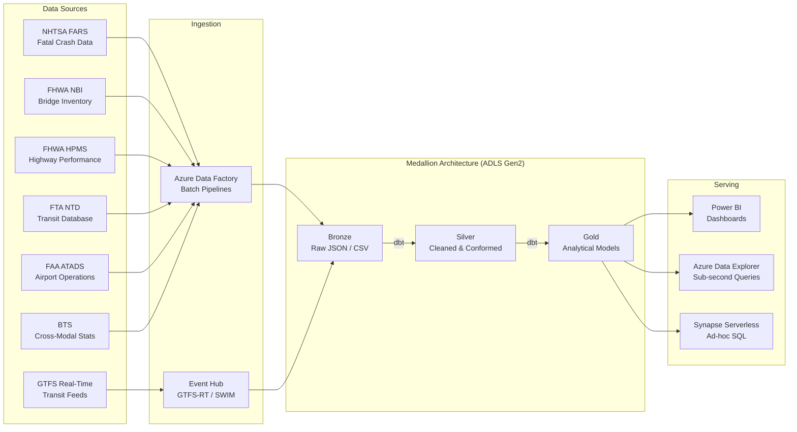

## DOT Multi-Modal Transportation Analytics on Azure

This page documents the end-to-end architecture for building a multi-modal transportation analytics platform on Azure. The platform ingests data from five DOT operating administrations — NHTSA (highway safety), FHWA (bridges and highway performance), FTA (transit), FAA (aviation), and BTS (cross-modal statistics) — and produces analytical outputs for crash hotspot detection, bridge maintenance prioritization, transit performance monitoring, and airport operations analysis.

The implementation follows the CSA-in-a-Box medallion architecture pattern. Working code is in `examples/dot/`.

---

## Architecture



---

## Data Sources

| Source    | Agency | Description                                                                            | Volume                             | Update Frequency               | API / Access                                                         |
| --------- | ------ | -------------------------------------------------------------------------------------- | ---------------------------------- | ------------------------------ | -------------------------------------------------------------------- |
| **FARS**  | NHTSA  | Fatality Analysis Reporting System — every fatal motor vehicle crash in the U.S.       | ~6.4M crash records (1975–present) | Annual + preliminary quarterly | [CrashAPI](https://crashviewer.nhtsa.dot.gov/CrashAPI)               |
| **NBI**   | FHWA   | National Bridge Inventory — structural condition of every bridge >20ft                 | 620,000+ bridges                   | Annual                         | [data.transportation.gov](https://data.transportation.gov)           |
| **HPMS**  | FHWA   | Highway Performance Monitoring System — pavement condition, traffic volume, lane miles | All federal-aid highways           | Annual                         | [HPMS](https://www.fhwa.dot.gov/policyinformation/hpms.cfm)          |
| **NTD**   | FTA    | National Transit Database — ridership, financial, safety data for transit agencies     | 900+ agencies, ~2,200 modes        | Monthly + Annual               | [NTD](https://www.transit.dot.gov/ntd)                               |
| **ATADS** | FAA    | Air Traffic Activity Data System — tower operations, instrument operations             | 500+ airports                      | Monthly                        | [ATADS](https://aspm.faa.gov/opsnet/sys/opsnet-s-main.asp)           |
| **BTS**   | DOT    | Bureau of Transportation Statistics — cross-modal performance metrics                  | National                           | Monthly + Annual               | [BTS](https://www.bts.gov/topics/national-transportation-statistics) |

!!! info "GTFS Real-Time"
Over 1,000 U.S. transit agencies publish GTFS-realtime feeds (vehicle positions, trip updates, service alerts). These are ingested via Event Hub for near-real-time transit monitoring. The [MobilityData GTFS-RT catalog](https://gtfs.org/resources/gtfs-realtime/) lists available feeds.

---

## Highway Safety Analytics

### FARS Data Ingestion

The `examples/dot/data/open-data/fetch_fars.py` script fetches crash data from two endpoints:

1. **NHTSA CrashAPI** — case-level fatal crash records by state and year
2. **data.transportation.gov SODA API** — supplemental fatality and highway safety datasets

```python
"""Fetch FARS crash cases for a state and year via CrashAPI."""
import requests

CRASH_API = "https://crashviewer.nhtsa.dot.gov/CrashAPI"

def fetch_crash_cases(state_fips: int, year: int, max_results: int = 5000):
    response = requests.get(
        f"{CRASH_API}/crashes/GetCaseList",
        params={
            "StateCase": state_fips,
            "CaseYear": year,
            "MaxResults": max_results,
            "format": "json",
        },
        timeout=60,
    )
    response.raise_for_status()
    data = response.json()
    results = data.get("Results", [{}])
    return results[0].get("CrashResultsCase", []) if results else []

# Example: Texas 2022
cases = fetch_crash_cases(state_fips=48, year=2022)
```

### Crash Severity Analysis

The silver layer model `slv_crash_data` standardizes raw FARS records into a consistent schema with computed fields: `severity_score`, `grid_cell_id` (0.1-degree lat/lon bucketing), `is_alcohol_related`, `is_pedestrian_involved`, `is_nighttime`, and temporal buckets.

### Hotspot Detection

The gold layer model `gld_safety_hotspots` (see `examples/dot/domains/dbt/models/gold/gld_safety_hotspots.sql`) aggregates crashes by grid cell and year to produce:

- **Severity-weighted scores** per grid cell
- **Year-over-year trend classification** (WORSENING / STABLE / IMPROVING)
- **Contributing factor breakdown** (alcohol, pedestrian, nighttime, adverse weather)
- **Hotspot tier ranking** (TIER_1_CRITICAL through TIER_4_STANDARD based on percentile cutoffs)
- **State and national hotspot ranks**

```sql
-- Simplified excerpt from gld_safety_hotspots.sql
SELECT
    grid_cell_id,
    state_code,
    analysis_year,
    COUNT(DISTINCT case_id)                        AS total_crashes,
    SUM(fatality_count)                            AS total_fatalities,
    SUM(severity_score)                            AS severity_weighted_score,
    ROUND(AVG(severity_score), 2)                  AS avg_severity_score,
    ROUND(AVG(latitude), 6)                        AS cluster_center_lat,
    ROUND(AVG(longitude), 6)                       AS cluster_center_lon,
    -- Hotspot tier via percentile window
    CASE
        WHEN severity_weighted_score >= PERCENTILE_CONT(0.95)
             WITHIN GROUP (ORDER BY severity_weighted_score)
             OVER (PARTITION BY analysis_year)
        THEN 'TIER_1_CRITICAL'
        ...
    END AS hotspot_tier
FROM silver.crash_data
GROUP BY grid_cell_id, state_code, analysis_year
ORDER BY severity_weighted_score DESC;
```

!!! tip "Geospatial Extension"
For sub-county corridor-level analysis, pair grid-cell hotspots with road network geometry from HPMS. See the [Geoanalytics patterns](../patterns/geoanalytics.md) for Azure Maps and H3 hex-grid integration.

---

## Bridge Infrastructure Analytics

### NBI Data Ingestion

The National Bridge Inventory is available as a single flat file (~620K rows) via [data.transportation.gov](https://data.transportation.gov). ADF pulls the full dataset annually and incrementally detects changed records based on the `structure_number_008` key and `date_of_inspect_090`.

### Condition Scoring

The silver model `slv_highway_conditions` normalizes NBI condition ratings (0–9 scale for deck, superstructure, substructure) and computes a composite condition index.

### Maintenance Priority Index

The gold model `gld_infrastructure_priority` (see `examples/dot/domains/dbt/models/gold/gld_infrastructure_priority.sql`) produces a weighted priority score combining:

| Factor                  | Weight | Source Field                                 |
| ----------------------- | ------ | -------------------------------------------- |
| Structural condition    | 30%    | Deck + superstructure + substructure ratings |
| Functional obsolescence | 20%    | Functional classification vs. current demand |
| Average daily traffic   | 20%    | ADT from HPMS overlay                        |
| Detour length           | 15%    | NBI field `detour_kilos_019`                 |
| Age since last rehab    | 15%    | `year_reconstructed_106` vs. current year    |

The output ranks every bridge within its state and nationally, enabling DOTs to allocate Highway Bridge Program (HBP) funding to the highest-risk structures.

---

## Transit Analytics

### NTD Ridership Trends

FTA publishes monthly ridership data (unlinked passenger trips by mode) and annual financial/operating statistics for every agency receiving federal transit funds. ADF ingests both via the [NTD data portal](https://www.transit.dot.gov/ntd/ntd-data).

### Agency Performance Comparison

The gold model `gld_transit_dashboard` computes per-agency KPIs:

- **Ridership recovery ratio** — current UPT vs. pre-pandemic baseline (2019)
- **Cost per trip** — total operating expense / unlinked passenger trips
- **Farebox recovery** — fare revenue / operating expense
- **Vehicle revenue miles per peak vehicle** — fleet utilization
- **Mean distance between failures** — reliability metric

These KPIs are partitioned by mode (bus, heavy rail, light rail, commuter rail, demand response) for cross-modal comparison.

### GTFS Real-Time Monitoring

For agencies publishing GTFS-RT feeds, Event Hub ingests protobuf messages at 15–30 second intervals. ADX stores vehicle positions and trip updates for sub-second query performance, enabling:

- Real-time vehicle tracking dashboards
- Schedule adherence analysis (on-time performance)
- Dwell time computation at stop level
- Headway regularity monitoring

---

## FAA Aviation Operations

This section provides a summary of aviation analytics. For the complete treatment — including real-time flight operations, safety trend analysis, wildlife strike correlation, and NAS performance dashboards — see the dedicated [FAA Aviation Safety & Operations Analytics](faa-aviation-analytics.md) page.

### ATADS Airport Operations Data

The Air Traffic Activity Data System (ATADS) records tower operations (takeoffs, landings, overflights) and instrument operations at towered airports. ADF pulls monthly summaries via the [OPSNET portal](https://aspm.faa.gov/opsnet/sys/opsnet-s-main.asp).

### Capacity Analysis

The gold layer computes airport utilization rates by comparing actual operations against declared capacity (airport acceptance rate). Airports consistently operating above 85% of declared capacity are flagged for capacity constraint analysis.

### Delay Pattern Detection (KQL)

For airports with ADX-integrated operations data, the following KQL query detects delay anomalies:

```kql
// Detect airports with delay rates exceeding 2 standard deviations
let baseline = AirportOperations
    | where Timestamp between (ago(365d) .. ago(30d))
    | summarize avg_delay = avg(AvgDepartureDelayMin),
                stddev_delay = stdev(AvgDepartureDelayMin)
      by AirportCode;
AirportOperations
| where Timestamp > ago(30d)
| summarize recent_avg_delay = avg(AvgDepartureDelayMin) by AirportCode
| join kind=inner baseline on AirportCode
| extend z_score = (recent_avg_delay - avg_delay) / stddev_delay
| where z_score > 2.0
| project AirportCode, recent_avg_delay, avg_delay, z_score
| order by z_score desc
```

### Airport Performance Dashboards

Power BI dashboards surface airport-level KPIs: operations per hour, average delay minutes, on-time departure percentage, and capacity utilization. Drill-through pages link airport-level metrics to carrier-level and runway-level detail.

!!! note "Dedicated FAA Page"
For ASPM, OPSNET, wildlife strike analysis, SWIM real-time integration, and NAS-wide performance metrics, see [FAA Aviation Safety & Operations Analytics](faa-aviation-analytics.md).

---

## Predictive Analytics

### Crash Risk Scoring

Using the historical hotspot data and contributing factor profiles, a gradient-boosted model scores each grid cell's probability of experiencing a fatal crash in the next 12 months. Features include:

- 3-year crash trend (from `gld_safety_hotspots`)
- Road functional class and speed limit
- Rural/urban classification
- Alcohol-related crash percentage
- Nighttime crash percentage
- Adjacent cell severity (spatial lag)

The model is trained in Azure Machine Learning and scores are written back to the gold layer for Power BI consumption.

### Infrastructure Deterioration Forecasting

Bridge condition trajectories are modeled using Markov chain transition matrices fitted to historical NBI inspection data. For each bridge, the model estimates:

- **Expected years to structurally deficient** — based on current condition and deterioration rate
- **Optimal intervention year** — minimizing lifecycle cost (repair vs. replace)
- **Risk-adjusted priority** — combining deterioration forecast with traffic impact

---

## Data Contracts

The `examples/dot/contracts/` directory contains data contract definitions (YAML) for each domain:

| Contract                   | Purpose                                                  |
| -------------------------- | -------------------------------------------------------- |
| `crash-analytics.yaml`     | Schema, SLAs, and quality checks for crash data pipeline |
| `highway-conditions.yaml`  | Bridge condition and highway performance data contract   |
| `transit-performance.yaml` | Transit ridership and agency performance contract        |

These contracts enforce schema validation, freshness checks, and data quality thresholds at the silver layer boundary.

---

## Deployment

The `examples/dot/deploy/` directory includes parameterized deployment configurations:

- `params.dev.json` — development environment (Azure Commercial)
- `params.gov.json` — Azure Government Cloud (IL4/IL5 compliant)

!!! warning "Azure Government"
Not all Azure services are available in Azure Government regions. Verify service availability against the [Gov Service Matrix](../GOV_SERVICE_MATRIX.md) before deploying. ADX and Event Hub are available in Gov; confirm Synapse Serverless and Azure ML availability for your target IL.

---

## Cross-References

- [Government Data Analytics on Azure](government-data-analytics.md) — compliance frameworks and Azure Government Cloud
- [FAA Aviation Safety & Operations Analytics](faa-aviation-analytics.md) — dedicated aviation deep-dive
- [Real-Time Intelligence & Anomaly Detection](realtime-intelligence-anomaly-detection.md) — streaming patterns for GTFS-RT and SWIM
- [Fabric Unified Analytics](fabric-unified-analytics.md) — Microsoft Fabric alternative for transit analytics
- `examples/dot/ARCHITECTURE.md` — detailed technical architecture
- `examples/dot/README.md` — quickstart and local development

---

## Sources

| Resource                               | URL                                                             |
| -------------------------------------- | --------------------------------------------------------------- |
| NHTSA FARS CrashAPI                    | <https://crashviewer.nhtsa.dot.gov/CrashAPI>                    |
| NHTSA FARS Encyclopedia                | <https://www-fars.nhtsa.dot.gov/Main/index.aspx>                |
| data.transportation.gov (SODA)         | <https://data.transportation.gov>                               |
| FHWA National Bridge Inventory         | <https://www.fhwa.dot.gov/bridge/nbi.cfm>                       |
| FHWA HPMS                              | <https://www.fhwa.dot.gov/policyinformation/hpms.cfm>           |
| FTA National Transit Database          | <https://www.transit.dot.gov/ntd>                               |
| FAA ATADS / OPSNET                     | <https://aspm.faa.gov/opsnet/sys/opsnet-s-main.asp>             |
| FAA ASPM                               | <https://aspm.faa.gov>                                          |
| BTS National Transportation Statistics | <https://www.bts.gov/topics/national-transportation-statistics> |
| GTFS Realtime Specification            | <https://gtfs.org/realtime/>                                    |
| MobilityData GTFS-RT Catalog           | <https://gtfs.org/resources/gtfs-realtime/>                     |
