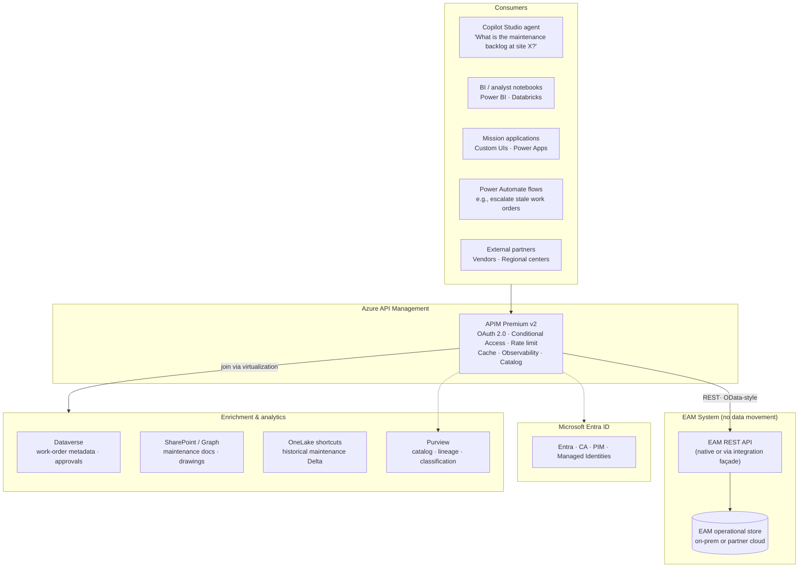
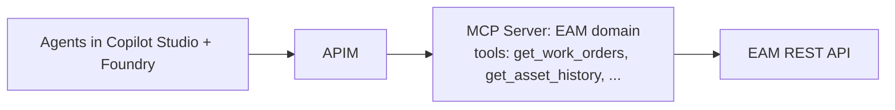
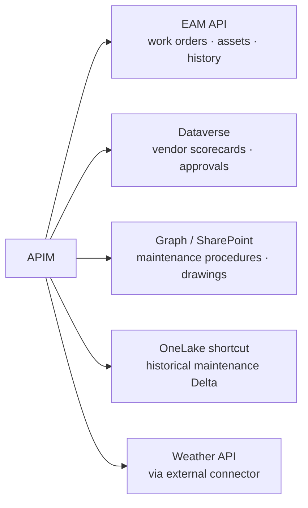

# Enterprise Asset Management Exposed Through APIM

## When this pattern applies

Use this reference when an enterprise asset management (EAM) platform — work-order management, facilities, maintenance, asset hierarchies, parts inventory — is mission-critical, typically deployed on-premises or in a partner cloud, and the goal is to:

1. Make EAM data **discoverable and queryable** by AI agents, BI tools, and downstream systems
2. **Not move the data** out of the EAM system (compliance, freshness, governance, licensing)
3. Apply **unified identity, rate limiting, audit, and cost governance** across all consumers
4. Catalog the EAM endpoints in **Purview** alongside data lakes, Dataverse, and SaaS systems
5. Use the same pattern for the next enterprise domain — **financial procurement** — and the one after

This is the exemplar use case for an API-first, zero-move architecture.

---

## The architecture



The architecture has three load-bearing properties:

1. **EAM data does not move.** APIM proxies live calls. Caching at the gateway and materialization at OneLake handle the latency / cost tail without disturbing the system of record.
2. **One identity model.** Every consumer authenticates against Entra. APIM validates and forwards. The EAM system either trusts APIM via mTLS / IP allowlist or sees the user's identity passed through.
3. **One catalog.** Purview registers the EAM endpoints alongside data lakes, Dataverse tables, and SaaS systems. Lineage flows from EAM through API through consuming AI workflow.

---

## The API surface — what EAM endpoints look like

The EAM system's native API surface varies by product. APIM normalizes it into a stable, OpenAPI-described shape:

| Resource | Operations | Notes |
|---|---|---|
| `/sites` | `GET`, `GET/{id}`, filter by region | Hierarchical; supports `$expand=buildings` |
| `/buildings/{id}` | `GET`, paged children | Square footage, condition, cost center |
| `/assets/{id}` | `GET` | Make, model, install date, lifecycle stage |
| `/work-orders` | `GET` (filter), `POST`, `PATCH` | Status, priority, assignee, scheduled date |
| `/work-orders/{id}/history` | `GET` | Audit timeline |
| `/maintenance-events` | `GET` paged | Linked to work orders and assets |
| `/parts-inventory` | `GET`, `PATCH` | Stock, reorder point, supplier |
| `/cost-codes` | `GET` | Allocation hierarchy |
| `/preventive-maintenance/schedules` | `GET`, `POST` | Recurring work definitions |

OpenAPI 3.x specification published; importable into any tool; included in the APIM Developer Portal and Purview API catalog.

### Example call

```http
GET /eam/work-orders?site=NW-12&status=open&priority=high&$top=50&$orderby=createdon desc
Authorization: Bearer {entra-token}
Ocp-Apim-Subscription-Key: {subscription-key}
```

APIM:

1. Validates the JWT (signature, issuer, audience, lifetime, scopes)
2. Applies Conditional Access — device compliance, location, risk
3. Checks per-subscription rate limit
4. Checks cache for an identical recent query
5. Logs the request to App Insights with subscription, user, scope, and latency dimensions
6. Forwards to the EAM REST endpoint with mTLS
7. On response, applies caching policy and emits metrics

The consumer experiences a fast, stable, governed REST API. The EAM system experiences a single trusted caller (APIM) with predictable load.

---

## Agentic AI consumption

A Copilot Studio agent grounded in this surface can answer questions like:

- *"What is the open work-order backlog at site NW-12 by priority?"*
- *"Which buildings have preventive maintenance overdue more than 30 days?"*
- *"Forecast parts inventory shortfall for the next 60 days based on scheduled work."*
- *"Generate a maintenance summary report for the regional director."*

The agent is configured with the EAM API as a **custom connector** in Copilot Studio. The connector definition is the OpenAPI document. Authentication flows through the user's Entra identity. The agent inherits the user's RBAC — it cannot see work orders the user cannot see.

For pro-code agents (Foundry Agent Service / Semantic Kernel), the same OpenAPI is registered as an **OpenAPI tool**, or an MCP server fronts the EAM domain with explicit tools:

```python
# Foundry Agent Service — OpenAPI tool registration
from azure.ai.agents.models import OpenApiAnonymousAuthDetails, OpenApiTool
import json

with open("eam-openapi.json") as f:
    eam_openapi_spec = json.load(f)

eam_tool = OpenApiTool(
    name="enterprise_asset_management",
    description="Read facilities, work orders, assets, and maintenance events.",
    spec=eam_openapi_spec,
    auth=OpenApiAnonymousAuthDetails(),  # APIM handles auth via Entra; agent passes through
)
```

Or as an MCP server fronted by APIM (recommended for multi-agent reuse):



---

## Cost governance — the production-grade story

Three production problems EAM-on-AI exposes, and the APIM-native answers:

| Problem | APIM mechanism |
|---|---|
| One bad agent loop fans out 50,000 queries against the EAM API in five minutes | Per-subscription rate limit + `llm-token-limit` on the agent's model calls; backstop circuit-breaker on the EAM backend |
| A read-heavy dashboard re-fetches the same data per refresh | APIM cache policy with `vary-by-query` and ETag-based revalidation |
| Multiple consumers can't be billed back accurately | APIM `emit-token-metric` and request-count metrics with `subscription-id` dimension; chargeback report from App Insights |
| Burstiness during shift changes (8 AM, 8 PM) | Premium v2 capacity-based pricing; backend pool with circuit breaker to shed load gracefully |

---

## Governance — the Purview chain

Every EAM API call participates in the unified governance plane:

1. **Catalog.** APIM publishes the EAM APIs to Purview. Ownership, SLA, sensitivity classification recorded.
2. **Lineage.** Purview links EAM endpoints to consuming data products in Fabric / Databricks, to agents in Copilot Studio, and to reports in Power BI.
3. **Classification.** Sensitivity labels (e.g., "Mission-CUI", "Internal-Only") applied at the catalog level; APIM enforces "label-required headers" on outbound traffic.
4. **Audit.** Every call logged to App Insights, retained per agency policy, queryable by KQL.
5. **DLP.** Outbound response bodies scanned by Purview DLP rules where required; suspicious data movement blocked.

This is the property that makes the architecture survive third-party security reviews: the entire data path is identity-grounded, classified, and auditable end-to-end.

---

## Enrichment — joining EAM data with the rest of the enterprise

The most valuable patterns are joins. A maintenance manager asks: *"For our top 20 highest-cost-of-failure assets, what's the combined view of work-order history, vendor performance, parts availability, and weather forecast at the site?"*

The Microsoft answer composes through APIM:



The agent or analytical tool issues parallel calls — all through one APIM front door, one identity, one cost model, one observability surface. The EAM system isn't asked to model vendor scorecards or weather. Each system stays in its lane; APIM is the seam.

---

## The pattern generalizes — financial procurement is next

Once the EAM-on-APIM pattern works for facilities, the same shape solves financial procurement:

| Element | Facilities | Financial procurement |
|---|---|---|
| System of record | EAM platform | Procurement / ERP |
| API surface | `/sites`, `/work-orders`, `/assets` | `/purchase-orders`, `/vendors`, `/invoices`, `/contracts` |
| Identity | Entra | Entra |
| Gateway | APIM | APIM |
| Catalog | Purview | Purview |
| AI consumer | Maintenance agents | Procurement agents |
| Enrichment | Dataverse + Graph + OneLake + weather | Dataverse + Graph + OneLake + market data |

Same architecture, different domain. This is the "enterprise catalog buildout" pattern in practice.

---

## Minimum-disruption inventory

What does **not** have to change to make this work:

- The EAM platform stays in place — no migration required
- Existing on-prem networking and security stays in place — APIM Self-Hosted Gateway can run inside the boundary
- Existing identity sources at regional sites stay — federated to Entra via B2B
- Existing licensing for the EAM product is honored
- Existing dashboards continue to work — they can be pointed at APIM or left direct

What changes:

- A new APIM Premium v2 instance is stood up in the target Azure subscription
- EAM API contracts are documented as OpenAPI and imported into APIM
- Entra tokens are issued and validated at the gateway
- Purview registers the new endpoints
- One agent / one dashboard / one notebook starts using the new front door

The deployment is **additive**. No existing investment is disturbed.

---

## Outcomes at 6 months

| Month | Outcome |
|---|---|
| 1 | APIM Premium v2 deployed; first EAM endpoint live; one OpenAPI in Purview |
| 2 | Read-only Copilot Studio agent live for maintenance managers; user testing in regional center |
| 3 | Cache hit rate > 60% on dashboard traffic; rate limiting prevents 3 noisy-neighbor incidents; backend load on EAM measurably reduced |
| 4 | Write-back via PATCH live with approval-flow integration; Power Automate workflow for stale-work-order escalation |
| 5 | Cross-system join (EAM + Dataverse + Graph + weather) demonstrated; multi-region rollout planning starts |
| 6 | Financial procurement domain follows the same pattern; second agent in production |

Measured deliverables — the kind a technical gatekeeper will validate:

- p95 latency under target with semantic / standard cache
- Per-consumer cost report with chargeback dimensions
- End-to-end lineage in Purview
- Backend EAM load reduced via cache + rate limit
- Zero data movement events outside the EAM system (audit)

---

## Quick links

- [Use case — API-first multi-model AI ecosystem](./api-first-multi-model-ai-ecosystem.md)
- [Use case — Dataverse API integration](./dataverse-api-integration.md)
- [Guide — APIM as the universal API gateway](../guides/apim-universal-gateway.md)
- [Best practice — Zero-move data architecture](../best-practices/zero-move-data-architecture.md)
- [Best practice — API-first data strategy](../best-practices/api-first-data-strategy.md)
- [Solution Store — Azure API-first accelerators](../solution-store/index.md)
