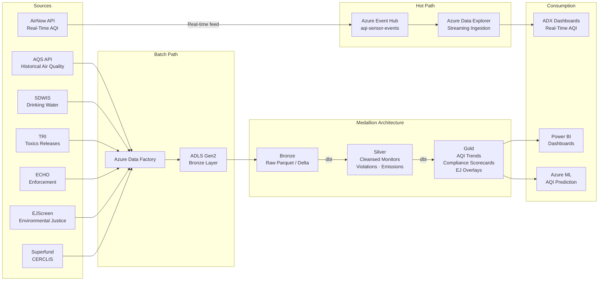

## EPA Environmental Analytics on Azure

This use case covers the ingestion, transformation, and analysis of data from multiple EPA programs — AirNow, AQS, SDWIS, TRI, ECHO, EJScreen, and Superfund — using Azure Cloud Scale Analytics patterns. The implementation combines real-time AQI sensor streaming with batch ingestion from regulatory databases to produce air quality trend analysis, compliance scorecards, and environmental justice overlays.

!!! info "Reference Implementation"
The complete working code for this domain lives in [`examples/epa/`](../../examples/epa/). This page explains the architecture, data sources, and step-by-step build process.

---

## Architecture Overview

The platform follows a dual-path ingestion model: a **hot path** for sub-minute AQI sensor data via Event Hub and Azure Data Explorer, and a **cold/batch path** for historical and regulatory datasets via Azure Data Factory into ADLS Gen2 with dbt-driven medallion transformations.



---

## Data Sources

| Source                              | API / URL                                              | Update Frequency                              | Description                                                                                                             |
| ----------------------------------- | ------------------------------------------------------ | --------------------------------------------- | ----------------------------------------------------------------------------------------------------------------------- |
| **AirNow**                          | `https://www.airnowapi.org/aq`                         | Real-time (1–5 min)                           | Current AQI observations and forecasts for 500+ metropolitan areas across all 50 states. Requires API key registration. |
| **AQS** (Air Quality System)        | `https://aqs.epa.gov/data/api`                         | Daily (quality-assured data lags 6–12 months) | Historical air quality monitoring data — sample-level, daily, and annual summaries. Email/key authentication.           |
| **SDWIS** (Safe Drinking Water)     | `https://enviro.epa.gov/enviro/efservice/WATER_SYSTEM` | Monthly                                       | Public water system inventory, violations, enforcement actions. Covers 25,000+ systems.                                 |
| **TRI** (Toxics Release Inventory)  | `https://enviro.epa.gov/tri/`                          | Annual (18-month reporting lag)               | Chemical release reports from 20,000+ industrial facilities. 650+ reportable chemicals with release media breakdown.    |
| **ECHO** (Enforcement & Compliance) | `https://echodata.epa.gov/echo`                        | Monthly                                       | Integrated compliance data across CAA, CWA, RCRA, and SDWIS. No authentication required. Paginate at 10,000 records.    |
| **EJScreen**                        | `https://gaftp.epa.gov/EJScreen/`                      | Annual                                        | Environmental justice screening data at Census tract level — demographic indicators, pollution burden indices.          |
| **Superfund / CERCLIS**             | `https://enviro.epa.gov/enviro/efservice/SEMS`         | Quarterly                                     | 1,300+ National Priorities List sites with contaminant, remediation, and community health data.                         |

!!! tip "API Key Registration"
AirNow API keys are free and issued at [docs.airnowapi.org](https://docs.airnowapi.org/). Rate limit is 500 requests/hour per key. AQS uses a separate email/key pair registered at [aqs.epa.gov/data/api](https://aqs.epa.gov/data/api). All other sources are unauthenticated.

---

## Step-by-Step Domain Build

### Step 1: Configure AirNow API Ingestion

AirNow supports two ingestion modes. The **hot path** streams current observations through Event Hub for real-time dashboards. The **cold path** pulls historical data through ADF for batch analytics.

#### Hot Path — Real-Time AQI via Event Hub

An Azure Function polls the AirNow current-observation endpoint on a 5-minute timer trigger and pushes events to Event Hub:

```python
"""AirNow real-time AQI fetcher — Azure Function timer trigger."""

import json
import logging
import os
from datetime import datetime, timezone

import azure.functions as func
import requests
from azure.eventhub import EventHubProducerClient, EventData

AIRNOW_URL = "https://www.airnowapi.org/aq/observation/zipCode/current/"
API_KEY = os.environ["AIRNOW_API_KEY"]
EVENT_HUB_CONN = os.environ["EVENT_HUB_CONNECTION_STRING"]
EVENT_HUB_NAME = "aqi-sensor-events"

# Target ZIP codes — expand as needed
ZIP_CODES = ["20001", "90210", "10001", "60601", "77001", "30301"]

def fetch_current_aqi(zip_code: str) -> list[dict]:
    """Fetch current AQI observation for a single ZIP code."""
    params = {
        "format": "application/json",
        "zipCode": zip_code,
        "distance": 25,
        "API_KEY": API_KEY,
    }
    resp = requests.get(AIRNOW_URL, params=params, timeout=30)
    resp.raise_for_status()
    observations = resp.json()

    enriched = []
    for obs in observations:
        enriched.append({
            "schema_version": "1.0",
            "source_type": "airnow_current",
            "site_id": f"{obs.get('StateCode', '')}-{obs.get('ReportingArea', '')}",
            "event_time": datetime.now(timezone.utc).isoformat(),
            "parameter_name": obs.get("ParameterName"),
            "aqi_value": obs.get("AQI"),
            "aqi_category": obs.get("Category", {}).get("Name"),
            "latitude": obs.get("Latitude"),
            "longitude": obs.get("Longitude"),
            "zip_code": zip_code,
        })
    return enriched

def main(timer: func.TimerRequest) -> None:
    producer = EventHubProducerClient.from_connection_string(
        EVENT_HUB_CONN, eventhub_name=EVENT_HUB_NAME
    )
    batch = producer.create_batch()

    for zip_code in ZIP_CODES:
        try:
            observations = fetch_current_aqi(zip_code)
            for obs in observations:
                batch.add(EventData(json.dumps(obs)))
        except Exception:
            logging.exception("Failed to fetch AQI for ZIP %s", zip_code)

    with producer:
        producer.send_batch(batch)
    logging.info("Published %d AQI events to Event Hub", batch.size_in_bytes)
```

#### Cold Path — Historical AQS via ADF

Configure an ADF pipeline with a REST linked service pointing to `https://aqs.epa.gov/data/api`. Use a ForEach activity to iterate over state codes and date ranges, pulling daily summary data into the Bronze landing zone.

!!! warning "AQS Rate Limits"
AQS enforces strict rate limits. Use ADF's retry and back-off policies. Batch requests by state and year to stay within limits. Quality-assured AQS data lags AirNow by 6–12 months.

---

### Step 2: Bronze Layer — Raw Ingestion

The Bronze layer preserves source data exactly as received, adding only ingestion metadata. Each EPA source gets its own Bronze model.

```sql
-- models/bronze/brz_air_quality.sql
{{ config(
    materialized='incremental',
    unique_key='record_hash',
    tags=['bronze', 'air_quality']
) }}

WITH source AS (
    SELECT * FROM {{ ref('air_quality') }}
)

SELECT
    *,
    CURRENT_TIMESTAMP() AS _dbt_loaded_at,
    'AQS' AS source_system,
    '{{ invocation_id }}' AS _dbt_run_id,
    MD5(CONCAT_WS('|', site_id, parameter_code, CAST(date_local AS STRING))) AS record_hash,
    CASE
        WHEN aqi IS NOT NULL AND aqi BETWEEN 0 AND 500 THEN TRUE
        ELSE FALSE
    END AS is_valid_record
FROM source
```

Bronze conventions used across all EPA models:

- Prefix: `brz_`
- No data type changes or business logic
- Metadata columns: `_dbt_loaded_at`, `source_system`, `_dbt_run_id`, `record_hash`
- `is_valid_record` flag for downstream filtering
- Materialized as incremental with hash-based deduplication

---

### Step 3: Silver Layer — Cleansed and Standardized

Silver models apply EPA-specific business rules: AQI recalculation from raw concentrations using 40 CFR Part 58 breakpoint tables, pollutant code standardization, health advisory assignment, and data quality scoring.

The full Silver air quality model is at [`examples/epa/domains/dbt/models/silver/slv_air_quality.sql`](../../examples/epa/domains/dbt/models/silver/slv_air_quality.sql). Key transformation highlights:

```sql
-- Excerpt from slv_air_quality.sql: AQI breakpoint recalculation for PM2.5
CASE
    WHEN pollutant = 'PM2.5' AND concentration IS NOT NULL THEN
        CASE
            WHEN concentration <= 12.0 THEN ROUND(concentration / 12.0 * 50)
            WHEN concentration <= 35.4 THEN ROUND(50 + (concentration - 12.0) / (35.4 - 12.0) * 50)
            WHEN concentration <= 55.4 THEN ROUND(100 + (concentration - 35.4) / (55.4 - 35.4) * 50)
            WHEN concentration <= 150.4 THEN ROUND(150 + (concentration - 55.4) / (150.4 - 55.4) * 50)
            WHEN concentration <= 250.4 THEN ROUND(200 + (concentration - 150.4) / (250.4 - 150.4) * 100)
            WHEN concentration <= 500.4 THEN ROUND(300 + (concentration - 250.4) / (500.4 - 250.4) * 200)
            ELSE 500
        END
    ...
END AS aqi_value
```

Silver models also exist for water systems (`slv_water_systems.sql`) and toxic releases (`slv_toxic_releases.sql`), applying analogous cleansing: violation status derivation for SDWIS, chemical classification and release media normalization for TRI.

---

### Step 4: Gold Layer — Analytical Models

Gold models aggregate Silver data into three analytical products.

#### Air Quality Trend Analysis

```sql
-- models/gold/gld_aqi_forecast.sql (simplified)
{{ config(materialized='table', tags=['gold', 'air_quality', 'forecast']) }}

SELECT
    site_id,
    state_name,
    cbsa_name,
    pollutant,
    observation_date,
    aqi_value,

    -- Trailing 7-day average
    AVG(aqi_value) OVER (
        PARTITION BY site_id, pollutant
        ORDER BY observation_date
        ROWS BETWEEN 6 PRECEDING AND CURRENT ROW
    ) AS aqi_7day_avg,

    -- Year-over-year comparison
    LAG(aqi_value, 365) OVER (
        PARTITION BY site_id, pollutant
        ORDER BY observation_date
    ) AS aqi_same_day_prior_year,

    -- Trend classification
    CASE
        WHEN AVG(aqi_value) OVER (...) > 1.1 * AVG(aqi_value) OVER (...)
            THEN 'WORSENING'
        WHEN AVG(aqi_value) OVER (...) < 0.9 * AVG(aqi_value) OVER (...)
            THEN 'IMPROVING'
        ELSE 'STABLE'
    END AS trend_direction

FROM {{ ref('slv_air_quality') }}
WHERE is_valid = TRUE
```

#### Compliance Scorecards

The [`gld_compliance_dashboard.sql`](../../examples/epa/domains/dbt/models/gold/gld_compliance_dashboard.sql) model joins water system violations, TRI facility emissions, and ECHO enforcement data to produce per-facility and per-state compliance scores.

#### Environmental Justice Overlays

The [`gld_environmental_justice.sql`](../../examples/epa/domains/dbt/models/gold/gld_environmental_justice.sql) model combines EJScreen demographic indicators with pollution burden metrics (AQI exposure, TRI proximity, Superfund distance) to compute cumulative environmental justice scores at the Census tract level.

---

### Step 5: Real-Time Streaming — AQI to ADX

Azure Data Explorer receives AQI events from Event Hub via streaming ingestion. Materialized views pre-aggregate data for dashboards.

```kql
// Create the streaming table
.create table AqiSensorEvents (
    schema_version: string,
    source_type: string,
    site_id: string,
    event_time: datetime,
    parameter_name: string,
    aqi_value: int,
    aqi_category: string,
    latitude: real,
    longitude: real,
    zip_code: string,
    ingestion_time: datetime
)

// Enable streaming ingestion
.alter table AqiSensorEvents policy streamingingestion enable

// 5-minute rolling aggregation
.create materialized-view AqiSite5MinAvg on table AqiSensorEvents {
    AqiSensorEvents
    | summarize
        avg_aqi = avg(aqi_value),
        max_aqi = max(aqi_value),
        readings = count()
      by site_id, parameter_name, bin(event_time, 5m)
}

// Alert rule: AQI exceeds 150 (Unhealthy for Sensitive Groups)
.create function AqiAlertCheck() {
    AqiSensorEvents
    | where event_time > ago(10m)
    | where aqi_value > 150
    | summarize latest_aqi = arg_max(event_time, *) by site_id
    | project site_id, event_time, parameter_name, aqi_value, aqi_category
}
```

!!! tip "ADX Retention and Caching"
Set a hot cache window of 30 days for real-time dashboards and a retention policy of 365 days for historical trend queries. Older data rolls to cold storage automatically.

---

### Step 6: ML-Based Air Quality Prediction

Use historical Silver-layer AQI data with meteorological features to train a next-day AQI prediction model. The notebook at [`examples/epa/notebooks/air_quality_forecasting.py`](../../examples/epa/notebooks/air_quality_forecasting.py) contains the full implementation.

```python
"""Simplified AQI prediction pipeline using scikit-learn."""

import pandas as pd
from sklearn.ensemble import GradientBoostingRegressor
from sklearn.model_selection import TimeSeriesSplit
from sklearn.metrics import mean_absolute_error

# Load Silver-layer AQI data from Delta table
df = spark.read.format("delta").load(
    "abfss://silver@storageaccount.dfs.core.windows.net/slv_air_quality"
).toPandas()

# Feature engineering
df["day_of_year"] = df["observation_date"].dt.dayofyear
df["day_of_week"] = df["observation_date"].dt.dayofweek
df["month"] = df["observation_date"].dt.month

# Lag features — previous 1, 3, 7 day AQI
for lag in [1, 3, 7]:
    df[f"aqi_lag_{lag}"] = df.groupby(["site_id", "pollutant"])["aqi_value"].shift(lag)

df = df.dropna()

features = ["day_of_year", "day_of_week", "month", "aqi_lag_1", "aqi_lag_3", "aqi_lag_7"]
target = "aqi_value"

model = GradientBoostingRegressor(n_estimators=200, max_depth=5, learning_rate=0.1)

# Time-series cross-validation
tscv = TimeSeriesSplit(n_splits=5)
for train_idx, test_idx in tscv.split(df):
    X_train, X_test = df[features].iloc[train_idx], df[features].iloc[test_idx]
    y_train, y_test = df[target].iloc[train_idx], df[target].iloc[test_idx]
    model.fit(X_train, y_train)
    preds = model.predict(X_test)
    mae = mean_absolute_error(y_test, preds)
    print(f"Fold MAE: {mae:.2f}")
```

---

### Step 7: Power BI Dashboards and KQL Queries

#### KQL Query — AQI Anomaly Detection

Use ADX to identify monitors reporting anomalous readings relative to their historical baseline:

```kql
// Detect AQI anomalies: readings > 2 standard deviations above 30-day site average
let lookback = 30d;
let threshold_sigma = 2.0;
AqiSensorEvents
| where event_time > ago(lookback)
| summarize
    avg_aqi = avg(aqi_value),
    stdev_aqi = stdev(aqi_value),
    latest_aqi = arg_max(event_time, aqi_value)
  by site_id, parameter_name
| extend anomaly_threshold = avg_aqi + (threshold_sigma * stdev_aqi)
| where latest_aqi > anomaly_threshold
| project
    site_id,
    parameter_name,
    latest_aqi,
    avg_aqi = round(avg_aqi, 1),
    stdev_aqi = round(stdev_aqi, 1),
    anomaly_threshold = round(anomaly_threshold, 1),
    sigma_deviation = round((latest_aqi - avg_aqi) / stdev_aqi, 2)
| order by sigma_deviation desc
```

#### Power BI Dataset Configuration

Connect Power BI to three sources:

1. **ADX (DirectQuery)** — Real-time AQI heatmaps and alerting dashboards using the `AqiSite5MinAvg` materialized view
2. **Synapse Serverless SQL** — Gold-layer Delta tables for compliance scorecards and trend analysis
3. **Azure ML endpoint** — Next-day AQI prediction overlay on the air quality map

!!! info "Row-Level Security"
For multi-agency deployments, apply Power BI RLS filters on `state_code` to limit regional office views to their jurisdiction.

---

## Compliance Considerations

EPA cloud deployments on Azure must address federal security and compliance frameworks.

| Framework   | Requirement                                        | Azure Implementation                                                                                                          |
| ----------- | -------------------------------------------------- | ----------------------------------------------------------------------------------------------------------------------------- |
| **FedRAMP** | Moderate or High baseline for federal systems      | Deploy to Azure Government (FedRAMP High authorized). Commercial Azure supports FedRAMP Moderate for non-sensitive workloads. |
| **FISMA**   | NIST SP 800-53 control families                    | Align to NIST controls via Azure Policy initiatives. Use Defender for Cloud regulatory compliance dashboard.                  |
| **FOIA**    | Public data products must be openly accessible     | AQI, TRI, and EJScreen outputs are public domain. Serve via unauthenticated API endpoints or open data portals.               |
| **CUI**     | Enforcement-sensitive data may require CUI marking | ECHO enforcement strategy details and pending actions — coordinate with ISSO for CUI determination.                           |

!!! warning "Azure Government vs. Commercial"
If the deployment handles CUI or enforcement-sensitive data, use Azure Government regions (`usgovvirginia`, `usgovarizona`). Public environmental data (AQI, TRI) can run on commercial Azure with appropriate access controls.

**Key security controls:**

- **Encryption**: SSE at rest, TLS 1.2+ in transit
- **Network isolation**: VNet integration with private endpoints for storage and ADX
- **Identity**: Microsoft Entra ID with RBAC; managed identities for service-to-service auth
- **Audit**: Azure Monitor diagnostic settings on all data plane operations
- **Data classification**: Tag datasets as PUBLIC, CUI, or PII in Purview catalog

---

## Cross-References

- **Reference implementation**: [`examples/epa/`](../../examples/epa/) — dbt models, data contracts, notebooks, deployment configs
- **Architecture deep dive**: [`examples/epa/ARCHITECTURE.md`](../../examples/epa/ARCHITECTURE.md) — full streaming and batch architecture
- **IoT streaming patterns**: [Real-Time Intelligence & Anomaly Detection](realtime-intelligence-anomaly-detection.md) — Event Hub and ADX patterns applicable to AQI streaming
- **Platform architecture**: [`docs/ARCHITECTURE.md`](../ARCHITECTURE.md) — core CSA platform components
- **Government analytics overview**: [Government Data Analytics](government-data-analytics.md) — broader context for federal agency use cases

---

## Sources

| Resource                                | URL                                                                                                                                |
| --------------------------------------- | ---------------------------------------------------------------------------------------------------------------------------------- |
| AirNow API Documentation                | [https://docs.airnowapi.org/](https://docs.airnowapi.org/)                                                                         |
| AQS API Reference                       | [https://aqs.epa.gov/aqsweb/documents/data_api.html](https://aqs.epa.gov/aqsweb/documents/data_api.html)                           |
| EPA Envirofacts (SDWIS, TRI, Superfund) | [https://enviro.epa.gov/](https://enviro.epa.gov/)                                                                                 |
| ECHO Facility Search                    | [https://echo.epa.gov/](https://echo.epa.gov/)                                                                                     |
| EJScreen Tool                           | [https://www.epa.gov/ejscreen](https://www.epa.gov/ejscreen)                                                                       |
| TRI Explorer                            | [https://www.epa.gov/toxics-release-inventory-tri-program](https://www.epa.gov/toxics-release-inventory-tri-program)               |
| EPA Open Data Portal                    | [https://www.epa.gov/data](https://www.epa.gov/data)                                                                               |
| Azure Government Compliance             | [https://learn.microsoft.com/en-us/azure/compliance/](https://learn.microsoft.com/en-us/azure/compliance/)                         |
| NIST SP 800-53 Controls                 | [https://csrc.nist.gov/publications/detail/sp/800-53/rev-5/final](https://csrc.nist.gov/publications/detail/sp/800-53/rev-5/final) |
