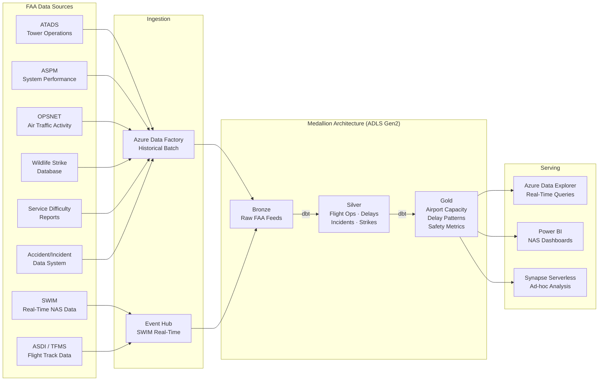

## FAA Aviation Safety & Operations Analytics on Azure

This page documents the architecture and implementation patterns for building an aviation analytics platform on Azure using FAA data sources. The platform covers airport operations monitoring, delay pattern analysis, safety trend detection, wildlife strike correlation, and National Airspace System (NAS) performance dashboarding.

This is a sub-domain of the broader [DOT Multi-Modal Transportation Analytics](dot-transportation-analytics.md) platform. Aviation-specific data flows integrate with the shared medallion architecture and serving layer.

---

## Architecture



---

## Data Sources

| Source                 | Full Name                           | Description                                                                   | Volume                  | Update Freq | Access                                                      |
| ---------------------- | ----------------------------------- | ----------------------------------------------------------------------------- | ----------------------- | ----------- | ----------------------------------------------------------- |
| **ATADS**              | Air Traffic Activity Data System    | Tower operations counts (takeoffs, landings, overflights) at towered airports | 500+ airports           | Monthly     | [OPSNET](https://aspm.faa.gov/opsnet/sys/Main.asp)          |
| **ASPM**               | Aviation System Performance Metrics | Flight-level on-time performance, delay causes, taxi times                    | All ASPM airports (~77) | Daily       | [ASPM](https://aspm.faa.gov)                                |
| **OPSNET**             | Operations Network                  | Facility-level air traffic activity, delays, equipment outages                | All ATC facilities      | Monthly     | [OPSNET](https://aspm.faa.gov/opsnet/sys/opsnet-s-main.asp) |
| **Wildlife Strike DB** | FAA Wildlife Strike Database        | Bird and wildlife strikes reported by pilots, airports, airlines              | ~17,000 strikes/year    | Continuous  | [Wildlife Strikes](https://wildlife.faa.gov)                |
| **SDR**                | Service Difficulty Reports          | Mechanical failures and component malfunctions reported by repair stations    | ~80,000 reports/year    | Continuous  | [SDR](https://sdrs.faa.gov/)                                |
| **AIDS**               | Accident/Incident Data System       | FAA-recorded aviation accidents and incidents                                 | ~1,700 accidents/year   | Continuous  | [Aviation Safety](https://www.asias.faa.gov)                |
| **SWIM**               | System Wide Information Management  | Real-time NAS data feeds (STDDS, TFMS, TBFM)                                  | Continuous stream       | Real-time   | [SWIM](https://www.faa.gov/air_traffic/technology/swim)     |
| **ASDI/TFMS**          | Traffic Flow Management System      | Flight track positions, flight plans, departure/arrival events                | All IFR flights         | Real-time   | Via SWIM                                                    |

!!! info "SWIM Access"
SWIM data feeds require a connection agreement with FAA. The SWIM Cloud Distribution Service (SCDS) provides cloud-native access. See [SWIM](https://www.faa.gov/air_traffic/technology/swim) for onboarding.

---

## Bronze Layer — Raw Ingestion

### Batch Sources (ADF)

ADF pipelines ingest historical data on scheduled cadences:

| Pipeline          | Source                     | Schedule        | Format   | Landing Path                          |
| ----------------- | -------------------------- | --------------- | -------- | ------------------------------------- |
| `pl_faa_atads`    | ATADS monthly reports      | 1st of month    | CSV      | `bronze/faa/atads/{year}/{month}/`    |
| `pl_faa_aspm`     | ASPM daily summaries       | Daily 06:00 UTC | CSV      | `bronze/faa/aspm/{date}/`             |
| `pl_faa_opsnet`   | OPSNET facility data       | Monthly         | CSV      | `bronze/faa/opsnet/{year}/{month}/`   |
| `pl_faa_wildlife` | Wildlife strike exports    | Weekly          | CSV      | `bronze/faa/wildlife_strikes/{date}/` |
| `pl_faa_sdr`      | Service difficulty reports | Weekly          | XML→JSON | `bronze/faa/sdr/{date}/`              |
| `pl_faa_aids`     | Accident/incident records  | Monthly         | CSV      | `bronze/faa/aids/{year}/{month}/`     |

### Real-Time Sources (Event Hub)

SWIM feeds are ingested via Event Hub with the following configuration:

```
Event Hub Namespace: eh-faa-swim-{env}
Partition Count:     8
Retention:           7 days
Consumer Groups:     $Default, cg-adx-ingest, cg-alert-processor
```

| Feed                      | Event Hub       | Message Format | Throughput      |
| ------------------------- | --------------- | -------------- | --------------- |
| STDDS (departure/arrival) | `eh-swim-stdds` | XML            | ~2,000 msgs/min |
| TFMS (flow management)    | `eh-swim-tfms`  | XML            | ~500 msgs/min   |
| TBFM (time-based flow)    | `eh-swim-tbfm`  | XML            | ~300 msgs/min   |

ADX ingests directly from Event Hub consumer group `cg-adx-ingest` for real-time query access.

---

## Silver Layer — Cleaned & Conformed

### Flight Operations (`slv_flight_operations`)

Consolidates ASPM and ATADS into a unified operations fact table:

| Column                      | Type           | Description                                  |
| --------------------------- | -------------- | -------------------------------------------- |
| `airport_code`              | `VARCHAR(4)`   | ICAO airport identifier                      |
| `operation_date`            | `DATE`         | Date of operations                           |
| `hour_local`                | `INT`          | Local hour (0–23)                            |
| `departures`                | `INT`          | Departure count                              |
| `arrivals`                  | `INT`          | Arrival count                                |
| `total_operations`          | `INT`          | departures + arrivals + overflights          |
| `avg_departure_delay_min`   | `DECIMAL(6,1)` | Average departure delay in minutes           |
| `avg_arrival_delay_min`     | `DECIMAL(6,1)` | Average arrival delay in minutes             |
| `avg_taxi_out_min`          | `DECIMAL(5,1)` | Average taxi-out time                        |
| `avg_taxi_in_min`           | `DECIMAL(5,1)` | Average taxi-in time                         |
| `delay_cause_weather_pct`   | `DECIMAL(5,2)` | Percentage of delays attributed to weather   |
| `delay_cause_volume_pct`    | `DECIMAL(5,2)` | Percentage of delays attributed to volume    |
| `delay_cause_equipment_pct` | `DECIMAL(5,2)` | Percentage of delays attributed to equipment |

### Delays (`slv_delay_events`)

Individual delay events from OPSNET with cause codes mapped to FAA delay categories: weather, volume, equipment, runway, other.

### Incidents (`slv_safety_incidents`)

Unified incident records from AIDS and SDR with standardized severity classification (major, serious, incident, occurrence) and component taxonomy.

### Wildlife Strikes (`slv_wildlife_strikes`)

Cleaned wildlife strike records with standardized species taxonomy, damage classification, and geolocation (airport reference point).

---

## Gold Layer — Analytical Models

### Airport Capacity Model (`gld_airport_capacity`)

Compares actual throughput against declared capacity to compute utilization:

```sql
-- dbt gold model: airport capacity utilization
{{ config(materialized='table', tags=['gold', 'faa', 'capacity']) }}

WITH hourly_ops AS (
    SELECT
        airport_code,
        operation_date,
        hour_local,
        total_operations,
        -- Airport Acceptance Rate (AAR) from reference table
        aar.declared_rate AS declared_hourly_capacity
    FROM {{ ref('slv_flight_operations') }} ops
    LEFT JOIN {{ ref('ref_airport_capacity') }} aar
        ON ops.airport_code = aar.airport_code
),

daily_summary AS (
    SELECT
        airport_code,
        operation_date,
        SUM(total_operations) AS daily_operations,
        MAX(declared_hourly_capacity) * 16 AS daily_capacity_estimate,
        -- Peak hour utilization
        MAX(total_operations * 1.0 / NULLIF(declared_hourly_capacity, 0))
            AS peak_hour_utilization,
        -- Hours above 85% capacity
        SUM(CASE
            WHEN total_operations > declared_hourly_capacity * 0.85
            THEN 1 ELSE 0
        END) AS hours_above_85pct,
        -- Average delay during congested hours
        AVG(CASE
            WHEN total_operations > declared_hourly_capacity * 0.85
            THEN avg_departure_delay_min
        END) AS avg_delay_congested_hours
    FROM hourly_ops
    GROUP BY airport_code, operation_date
)

SELECT
    airport_code,
    operation_date,
    daily_operations,
    daily_capacity_estimate,
    ROUND(daily_operations * 100.0 / NULLIF(daily_capacity_estimate, 0), 1)
        AS daily_utilization_pct,
    ROUND(peak_hour_utilization * 100.0, 1) AS peak_hour_utilization_pct,
    hours_above_85pct,
    ROUND(avg_delay_congested_hours, 1) AS avg_delay_congested_min,
    CASE
        WHEN peak_hour_utilization > 0.95 THEN 'CAPACITY_CONSTRAINED'
        WHEN peak_hour_utilization > 0.85 THEN 'HIGH_UTILIZATION'
        WHEN peak_hour_utilization > 0.70 THEN 'MODERATE'
        ELSE 'UNCONSTRAINED'
    END AS capacity_status,
    CURRENT_TIMESTAMP() AS _dbt_loaded_at
FROM daily_summary
```

### Delay Patterns (`gld_delay_patterns`)

Aggregates delay events by airport, time period, and cause category to surface systemic patterns:

- **Seasonal delay profiles** — monthly average delays by cause
- **Time-of-day patterns** — hourly delay distribution (morning bank, afternoon build, evening recovery)
- **Cascade detection** — airports where delays in one hour predict delays in subsequent hours (autocorrelation > 0.7)
- **Weather sensitivity index** — ratio of weather-day delays to fair-weather-day delays

### Safety Metrics (`gld_safety_metrics`)

Aggregates incident and accident data by airport, aircraft category, and time period:

- **Incident rate** — incidents per 100,000 operations
- **Wildlife strike rate** — strikes per 10,000 operations
- **Damage rate** — percentage of strikes causing substantial damage
- **Trend classification** — 3-year moving average trend (increasing / stable / decreasing)

---

## Real-Time Flight Operations Monitoring

For airports with SWIM integration, ADX provides sub-second query access to live operations data.

### Delay Anomaly Detection (KQL)

```kql
// Detect airports experiencing abnormal delay spikes in the last 2 hours
let lookback = 2h;
let baseline_days = 90d;
let threshold_zscore = 2.5;
//
let baseline = FlightOperations
    | where Timestamp between (ago(baseline_days) .. ago(1d))
    | summarize
        baseline_avg_delay = avg(DepartureDelayMin),
        baseline_stdev = stdev(DepartureDelayMin)
      by AirportCode, HourOfDay = datetime_part("hour", Timestamp);
//
FlightOperations
| where Timestamp > ago(lookback)
| summarize
    current_avg_delay = avg(DepartureDelayMin),
    current_ops = count(),
    pct_delayed = countif(DepartureDelayMin > 15) * 100.0 / count()
  by AirportCode, HourOfDay = datetime_part("hour", Timestamp)
| join kind=inner baseline on AirportCode, HourOfDay
| extend z_score = (current_avg_delay - baseline_avg_delay) / baseline_stdev
| where z_score > threshold_zscore and current_ops > 10
| project
    AirportCode,
    HourOfDay,
    current_avg_delay,
    baseline_avg_delay,
    z_score = round(z_score, 2),
    pct_delayed = round(pct_delayed, 1),
    current_ops
| order by z_score desc
```

### Ground Delay Program Monitoring (KQL)

```kql
// Track active and recent Ground Delay Programs
TFMAdvisories
| where Timestamp > ago(24h)
| where AdvisoryType == "GDP" or AdvisoryType == "GS"
| summarize
    start_time = min(Timestamp),
    end_time = max(Timestamp),
    avg_delay_assigned = avg(AssignedDelayMin),
    max_delay_assigned = max(AssignedDelayMin),
    affected_flights = dcount(FlightId)
  by AirportCode, AdvisoryType, ProgramId
| extend duration_hours = datetime_diff("minute", end_time, start_time) / 60.0
| order by start_time desc
```

---

## Safety Trend Analysis

### Incident Rate Over Time

The gold safety model computes rolling 12-month incident rates and flags statistically significant changes using control chart methodology (Western Electric rules applied to monthly rates).

### Wildlife Strike Correlation

Wildlife strike analysis combines FAA strike reports with:

- **Seasonal patterns** — migration periods (spring: Mar–May, fall: Aug–Nov) show 2–3x higher strike rates
- **Time-of-day** — dawn and dusk operations correlate with higher strike probability
- **Species risk ranking** — damage probability by species group (Canada goose, white-tailed deer on runways, raptors)
- **Airport habitat assessment** — land use within 5-mile radius as a predictor of strike frequency

```sql
-- Wildlife strike seasonal analysis
SELECT
    airport_code,
    EXTRACT(MONTH FROM incident_date)   AS strike_month,
    species_group,
    COUNT(*)                            AS total_strikes,
    SUM(CASE WHEN damage_level IN ('SUBSTANTIAL', 'DESTROYED')
        THEN 1 ELSE 0 END)             AS damaging_strikes,
    ROUND(
        SUM(CASE WHEN damage_level IN ('SUBSTANTIAL', 'DESTROYED')
            THEN 1 ELSE 0 END) * 100.0 / COUNT(*), 1
    )                                   AS damage_rate_pct
FROM silver.wildlife_strikes
WHERE incident_date >= DATEADD(YEAR, -5, CURRENT_DATE)
GROUP BY airport_code, EXTRACT(MONTH FROM incident_date), species_group
HAVING COUNT(*) >= 10
ORDER BY damaging_strikes DESC;
```

---

## Airport Capacity Planning

### Demand Forecasting

Airport operations forecasts use a decomposition model:

1. **Trend component** — long-term growth rate from 10-year ATADS history
2. **Seasonal component** — monthly seasonality indices
3. **Day-of-week component** — weekday/weekend adjustment factors
4. **Event component** — holiday and special event adjustments

Forecasts are generated at the airport-hour level for 12-month planning horizons.

### Capacity Gap Analysis

The capacity model identifies airports approaching operational limits:

| Metric                           | Threshold            | Action                                   |
| -------------------------------- | -------------------- | ---------------------------------------- |
| Peak hour utilization > 95%      | Capacity constrained | Evaluate new runway / procedural changes |
| Hours above 85% > 8/day          | Sustained congestion | Evaluate flow management strategies      |
| YoY operations growth > 5%       | Rapid growth         | Forward capacity assessment needed       |
| Delay minutes per operation > 20 | Chronic delays       | Root cause analysis required             |

---

## NAS Performance Dashboards

Power BI dashboards are organized into four tiers:

### System-Wide Dashboard

- **NAS on-time performance** — percentage of flights arriving within 15 minutes of schedule
- **Total system delay minutes** — aggregated across all ASPM airports
- **Top 10 delay contributors** — airports contributing the most total delay minutes
- **Weather impact map** — geographic overlay of weather-impacted airports

### Airport Dashboard

- **Operations summary** — daily/weekly/monthly operations counts with trend
- **Delay decomposition** — stacked bar by cause category (weather, volume, equipment, security, other)
- **Capacity utilization** — hourly operations vs. declared rate heatmap
- **On-time performance** — departure and arrival OTP with carrier breakdown

### Safety Dashboard

- **Incident rate trend** — 12-month rolling rate per 100K operations
- **Wildlife strike heatmap** — geographic and temporal distribution
- **SDR component analysis** — top failing components by aircraft type
- **Accident timeline** — chronological view with severity classification

### Carrier Performance Dashboard

- **Carrier OTP ranking** — on-time performance by carrier at each airport
- **Carrier delay contribution** — carrier-attributable delay minutes
- **Cancellation rates** — by carrier and cause
- **Taxi time comparison** — carrier efficiency on ground movement

---

## Security and Compliance

!!! warning "Sensitive Data Handling"
Some FAA data products contain Sensitive Security Information (SSI) or Security Sensitive Unclassified (SSU) data. Ensure proper handling per [49 CFR Part 1520](https://www.ecfr.gov/current/title-49/subtitle-B/chapter-XII/subchapter-C/part-1520). SWIM data access requires an approved connection agreement.

For deployments to Azure Government (IL4/IL5), apply the configurations in `examples/dot/deploy/params.gov.json`. See [Government Data Analytics](government-data-analytics.md) for compliance framework details.

---

## Cross-References

- [DOT Multi-Modal Transportation Analytics](dot-transportation-analytics.md) — parent page covering highway, bridge, transit, and aviation
- [Real-Time Intelligence & Anomaly Detection](realtime-intelligence-anomaly-detection.md) — Event Hub and ADX streaming patterns applicable to SWIM
- [Government Data Analytics on Azure](government-data-analytics.md) — Azure Government compliance and service availability
- `examples/dot/ARCHITECTURE.md` — full technical architecture including aviation components
- `examples/dot/README.md` — quickstart guide

---

## Sources

| Resource                                                 | URL                                                                                   |
| -------------------------------------------------------- | ------------------------------------------------------------------------------------- |
| FAA ATADS / OPSNET                                       | <https://aspm.faa.gov/opsnet/sys/opsnet-s-main.asp>                                   |
| FAA ASPM                                                 | <https://aspm.faa.gov>                                                                |
| FAA SWIM Program                                         | <https://www.faa.gov/air_traffic/technology/swim>                                     |
| FAA SWIM Cloud Distribution Service                      | <https://www.faa.gov/air_traffic/technology/swim>                                     |
| FAA Wildlife Strike Database                             | <https://wildlife.faa.gov>                                                            |
| FAA Service Difficulty Reports                           | <https://sdrs.faa.gov/>                                                               |
| Aviation Safety Information Analysis and Sharing (ASIAS) | <https://www.asias.faa.gov>                                                           |
| FAA Operations & Performance Data                        | <https://www.faa.gov/data_research/aviation_data_statistics>                          |
| BTS Airline On-Time Statistics                           | <https://www.transtats.bts.gov/OT_Delay/OT_DelayCause1.asp>                           |
| 49 CFR Part 1520 — SSI                                   | <https://www.ecfr.gov/current/title-49/subtitle-B/chapter-XII/subchapter-C/part-1520> |
