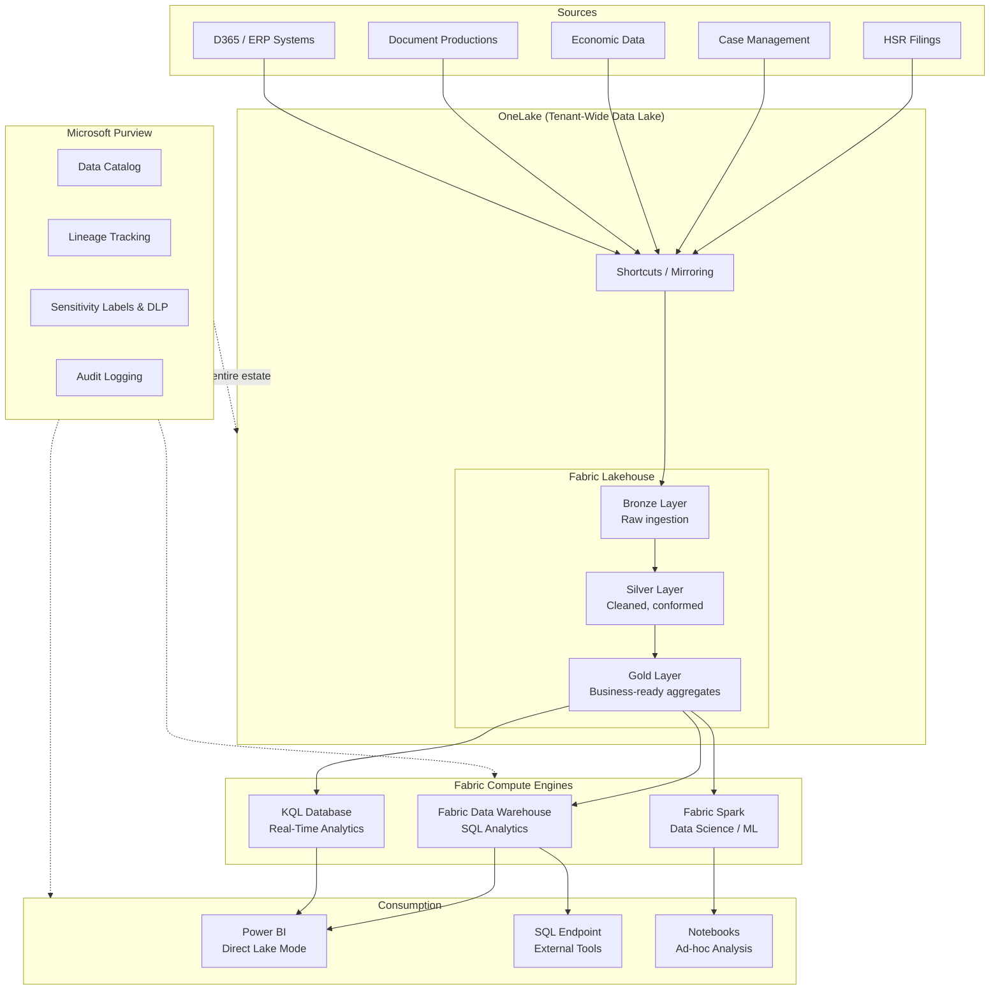

# Unified Analytics Platform on Microsoft Fabric

Fragmented analytics environments — separate systems for ingestion, warehousing, data science, and reporting — increase operational cost, slow time-to-insight, and create governance gaps. When data is copied across ADLS Gen2 accounts, Databricks workspaces, and Power BI import datasets, lineage breaks, security policies diverge, and storage costs compound.

Microsoft Fabric consolidates these workloads into a single SaaS platform built on OneLake. This guide explains how CSA-in-a-Box patterns (medallion architecture, dbt transformations, data contracts, Purview governance) map directly to Fabric, and walks through a concrete domain migration from Databricks to Fabric.

---

## Why Fabric for Unified Analytics

Fabric introduces **OneLake**, a tenant-wide logical data lake that serves as the single storage layer for all Fabric workloads. Key architectural properties:

- **Single copy of data**: OneLake stores all data in Delta Parquet format by default. Spark notebooks, SQL analytics, KQL queries, and Power BI all read from the same physical files — no import copies, no extract pipelines between engines.
- **Shortcuts and mirroring**: OneLake shortcuts create logical pointers to data in external storage (ADLS Gen2, S3, GCS, Dataverse) without copying bytes. Mirroring replicates operational databases (Azure SQL, Cosmos DB, Snowflake) into OneLake as Delta Parquet in near real-time.
- **Zero-ETL between engines**: A table written by a Spark notebook is immediately queryable from the SQL analytics endpoint and from Power BI via Direct Lake — no staging, no materialization pipeline.
- **Unified capacity model**: A single Fabric capacity (F-SKU) powers Spark, SQL, Data Factory pipelines, KQL, and Power BI. Capacity scales vertically and pauses when idle.

This model eliminates the data duplication problem that drives most analytics cost overruns. Instead of N copies of the same dataset across N tools, OneLake maintains one authoritative copy with multiple compute engines reading it in place.

---

## Architecture

The following diagram shows how CSA-in-a-Box source systems flow through Fabric into consumption layers, with Purview governance spanning the entire estate.



Each domain (DOJ, finance, inventory, sales) gets its own Fabric Lakehouse within a workspace, maintaining the domain-oriented ownership model from CSA-in-a-Box while sharing a common OneLake storage layer.

---

## Mapping CSA-in-a-Box Patterns to Fabric

The following table maps existing CSA-in-a-Box implementation patterns to their Fabric equivalents. The medallion architecture, dbt transformations, and governance patterns transfer with minimal rework.

| CSA-in-a-Box Pattern | Current Implementation | Fabric Equivalent |
|---|---|---|
| Medallion architecture | Databricks Delta Lake | Fabric Lakehouse (Delta Parquet on OneLake) |
| Data transformation | dbt on Databricks | dbt-fabric adapter on Fabric Data Warehouse, or Spark notebooks |
| Data contracts | YAML-based contract definitions | Purview data products + OneLake Catalog entries |
| Data governance | Manual Purview integration via APIs | Native Purview integration (automatic catalog, lineage, DLP) |
| Storage | ADLS Gen2 with hierarchical namespace | OneLake (built on ADLS Gen2, Delta Parquet default) |
| Compute | Databricks interactive + job clusters | Fabric capacity (Spark pools, SQL engine, KQL engine) |
| Orchestration | Azure Data Factory / Databricks Workflows | Fabric Data Factory (native pipelines) |
| Visualization | Power BI with DirectQuery to Databricks | Power BI with Direct Lake (no import, no DirectQuery) |
| Real-time ingestion | Event Hubs → Databricks Structured Streaming | Event Hubs → Fabric Eventstream → KQL Database |
| Security | Unity Catalog + custom RBAC | Fabric workspace roles + OneLake data access roles + RLS/CLS |

!!! tip "CSA-in-a-Box + Fabric"
    CSA-in-a-Box domains (DOJ, finance, inventory, sales) use dbt with Delta Lake on Databricks today. The medallion architecture, data contracts, and governance patterns transfer directly to Fabric — OneLake uses Delta Parquet natively, and the `dbt-fabric` adapter runs dbt models against Fabric Data Warehouse with no model SQL changes for standard transformations.

### What changes

- **Storage paths**: ADLS Gen2 `abfss://` paths become OneLake paths (`abfss://<workspace>@onelake.dfs.fabric.microsoft.com/<lakehouse>.Lakehouse/...`)
- **Compute configuration**: Databricks cluster policies become Fabric capacity settings
- **Authentication**: Service principal auth remains, but endpoint URLs change to `*.datawarehouse.fabric.microsoft.com`

### What stays the same

- **dbt models**: SQL transformations in `models/` directories work with the `dbt-fabric` adapter
- **Medallion layer structure**: Bronze/Silver/Gold organization is identical
- **Delta format**: OneLake uses Delta Parquet natively — no format conversion needed
- **Purview integration**: Lineage and cataloging improve (native vs. manual)

---

## Step-by-Step: Migrating a Domain to Fabric

This walkthrough migrates the DOJ Antitrust domain (`domains/doj/`) from Databricks to Fabric. The same steps apply to any CSA-in-a-Box domain.

### Step 1 — Create a Fabric Workspace

A Fabric workspace is the security and billing boundary for a set of related items (Lakehouses, Warehouses, notebooks, reports).

**Via Azure CLI and Fabric REST API:**

```bash
# Ensure you have the Fabric capacity created (F64 or higher for production)
# Workspace creation uses the Fabric REST API

# Get an access token
TOKEN=$(az account get-access-token \
  --resource "https://api.fabric.microsoft.com" \
  --query accessToken -o tsv)

# Create the workspace
curl -X POST "https://api.fabric.microsoft.com/v1/workspaces" \
  -H "Authorization: Bearer $TOKEN" \
  -H "Content-Type: application/json" \
  -d '{
    "displayName": "CSA-DOJ-Antitrust",
    "description": "DOJ Antitrust domain - CSA-in-a-Box",
    "capacityId": "<your-fabric-capacity-id>"
  }'
```

**Via Fabric Portal:**

1. Navigate to [app.fabric.microsoft.com](https://app.fabric.microsoft.com)
2. Select **Workspaces** → **New workspace**
3. Name: `CSA-DOJ-Antitrust`
4. Under **Advanced**, assign the workspace to your Fabric capacity

!!! info "Capacity Sizing"
    For development and testing, an F2 capacity is sufficient. Production workloads with concurrent Spark jobs and Power BI queries typically require F64 or higher. Fabric capacities can be paused when not in use to control cost.

### Step 2 — Create a Lakehouse

The Lakehouse is the OneLake-backed storage container that holds Bronze, Silver, and Gold tables.

```bash
# Create a Lakehouse via Fabric REST API
curl -X POST "https://api.fabric.microsoft.com/v1/workspaces/<workspace-id>/items" \
  -H "Authorization: Bearer $TOKEN" \
  -H "Content-Type: application/json" \
  -d '{
    "type": "Lakehouse",
    "displayName": "doj_antitrust"
  }'
```

OneLake organizes Lakehouse content into two top-level folders:

```
doj_antitrust.Lakehouse/
├── Tables/          # Managed Delta tables (queryable via SQL endpoint)
│   ├── bronze_antitrust_cases/
│   ├── silver_antitrust_cases/
│   └── gold_case_summary/
└── Files/           # Unstructured files (PDFs, images, raw exports)
    ├── raw_filings/
    └── document_productions/
```

Items in `Tables/` are automatically registered as Delta tables and exposed through the Lakehouse SQL analytics endpoint.

### Step 3 — Set Up OneLake Shortcuts

Shortcuts create zero-copy logical pointers to existing data in ADLS Gen2. This allows Fabric to read CSA-in-a-Box Bronze data without moving it.

```python
# create_shortcuts.py
# Creates OneLake shortcuts from existing ADLS Gen2 Bronze layer to Fabric Lakehouse

import requests
from azure.identity import DefaultAzureCredential

credential = DefaultAzureCredential()
token = credential.get_token("https://api.fabric.microsoft.com/.default").token

WORKSPACE_ID = "<workspace-id>"
LAKEHOUSE_ID = "<lakehouse-id>"
BASE_URL = f"https://api.fabric.microsoft.com/v1/workspaces/{WORKSPACE_ID}/items/{LAKEHOUSE_ID}/shortcuts"

headers = {
    "Authorization": f"Bearer {token}",
    "Content-Type": "application/json"
}

# Define shortcuts for each Bronze table
shortcuts = [
    {
        "path": "Tables/bronze_antitrust_cases",
        "name": "bronze_antitrust_cases",
        "target": {
            "adlsGen2": {
                "location": "https://csadatalake.dfs.core.windows.net",
                "subpath": "/bronze/doj/antitrust_cases",
                "connectionId": "<adls-connection-id>"
            }
        }
    },
    {
        "path": "Tables/bronze_hsr_filings",
        "name": "bronze_hsr_filings",
        "target": {
            "adlsGen2": {
                "location": "https://csadatalake.dfs.core.windows.net",
                "subpath": "/bronze/doj/hsr_filings",
                "connectionId": "<adls-connection-id>"
            }
        }
    },
    {
        "path": "Tables/bronze_economic_data",
        "name": "bronze_economic_data",
        "target": {
            "adlsGen2": {
                "location": "https://csadatalake.dfs.core.windows.net",
                "subpath": "/bronze/doj/economic_data",
                "connectionId": "<adls-connection-id>"
            }
        }
    }
]

for shortcut in shortcuts:
    response = requests.post(BASE_URL, headers=headers, json=shortcut)
    if response.status_code == 201:
        print(f"Created shortcut: {shortcut['name']}")
    else:
        print(f"Failed: {shortcut['name']} — {response.status_code}: {response.text}")
```

!!! info "Shortcut vs. Copy"
    Shortcuts are metadata pointers — no data is copied, no egress charges are incurred (within the same Azure region), and updates to the source are immediately visible through the shortcut. Use shortcuts for the Bronze layer to avoid duplicating raw data. Silver and Gold layers are typically materialized as managed Delta tables in the Lakehouse.

### Step 4 — Run dbt on Fabric

The existing dbt project in `domains/doj/dbt/` transforms Bronze → Silver → Gold. To run it against Fabric Data Warehouse, update the connection profile.

**Install the dbt-fabric adapter:**

```bash
pip install dbt-fabric
```

**Configure `profiles.yml`:**

```yaml
# ~/.dbt/profiles.yml (or CI/CD environment config)
csa_analytics:
  target: fabric
  outputs:
    fabric:
      type: fabric
      driver: "ODBC Driver 18 for SQL Server"
      server: "<workspace-guid>.datawarehouse.fabric.microsoft.com"
      database: "doj_antitrust"
      port: 1433
      schema: "dbo"
      authentication: serviceprincipal
      tenant_id: "{{ env_var('AZURE_TENANT_ID') }}"
      client_id: "{{ env_var('AZURE_CLIENT_ID') }}"
      client_secret: "{{ env_var('AZURE_CLIENT_SECRET') }}"
      threads: 4
      retries: 2
```

**Run the dbt pipeline:**

```bash
cd domains/doj/dbt

# Test the connection
dbt debug --target fabric

# Run Bronze → Silver → Gold transformations
dbt run --target fabric --select tag:silver
dbt run --target fabric --select tag:gold

# Run data quality tests
dbt test --target fabric
```

!!! warning "dbt-fabric Adapter Differences"
    The `dbt-fabric` adapter supports most dbt Core features, but there are differences from `dbt-databricks`:

    - **Materializations**: `table`, `view`, and `incremental` are supported. `ephemeral` models work as CTEs.
    - **Incremental strategies**: `append` and `delete+insert` are supported. `merge` requires Fabric Data Warehouse (not Lakehouse SQL endpoint).
    - **Python models**: Not supported in dbt-fabric. Use Fabric Spark notebooks for Python-based transformations.

    Test your dbt project with `dbt run` in a dev workspace before migrating production pipelines.

### Step 5 — Configure Purview Governance

Fabric integrates natively with Microsoft Purview. When a Fabric workspace is connected to Purview, catalog entries, lineage, and sensitivity labels propagate automatically.

**Enable Purview integration:**

1. In the Fabric Admin Portal, navigate to **Governance and insights** → **Purview Hub**
2. Connect your Purview account to the Fabric tenant
3. Enable automatic scanning for the `CSA-DOJ-Antitrust` workspace

**Apply sensitivity labels:**

```bash
# Apply sensitivity labels to a Lakehouse item via Purview REST API
curl -X PATCH "https://api.purview.azure.com/catalog/api/atlas/v2/entity/guid/<entity-guid>" \
  -H "Authorization: Bearer $PURVIEW_TOKEN" \
  -H "Content-Type: application/json" \
  -d '{
    "entity": {
      "attributes": {
        "sensitivityLabel": "Confidential - Attorney Work Product"
      }
    }
  }'
```

**What you get automatically with Purview + Fabric:**

| Capability | Manual Setup Required? | Notes |
|---|---|---|
| Data catalog entries | No | All Lakehouse tables auto-registered |
| Column-level lineage | No | Tracked through Spark notebooks and SQL pipelines |
| Sensitivity labels | Yes | Define label policies in Purview, apply to items |
| DLP policies | Yes | Configure in Microsoft 365 Compliance Center |
| Access audit logging | No | All data access logged to unified audit log |
| Data quality rules | Yes | Define in Purview data quality (preview) |

### Step 6 — OneLake Security (Row/Column-Level)

CSA-in-a-Box handles sensitive legal data — attorney work product, privileged communications, and PII. Fabric provides row-level security (RLS) and column-level security (CLS) at the SQL analytics endpoint.

**Column-level security — restrict PII access:**

```sql
-- Create roles for different access levels
CREATE ROLE [analyst_general];
CREATE ROLE [analyst_privileged];
CREATE ROLE [attorney_staff];

-- Grant base table access
GRANT SELECT ON doj_antitrust.dbo.slv_antitrust_cases TO [analyst_general];
GRANT SELECT ON doj_antitrust.dbo.slv_antitrust_cases TO [analyst_privileged];
GRANT SELECT ON doj_antitrust.dbo.slv_antitrust_cases TO [attorney_staff];

-- Deny PII columns to general analysts
DENY SELECT ON doj_antitrust.dbo.slv_antitrust_cases(defendant_name) TO [analyst_general];
DENY SELECT ON doj_antitrust.dbo.slv_antitrust_cases(defendant_ssn) TO [analyst_general];
DENY SELECT ON doj_antitrust.dbo.slv_antitrust_cases(contact_email) TO [analyst_general];

-- Deny SSN even to privileged analysts (attorney-only)
DENY SELECT ON doj_antitrust.dbo.slv_antitrust_cases(defendant_ssn) TO [analyst_privileged];
```

**Row-level security — filter by case assignment:**

```sql
-- Create a function that checks the user's case assignments
CREATE FUNCTION dbo.fn_case_access(@assigned_attorney VARCHAR(256))
RETURNS TABLE
WITH SCHEMABINDING
AS
RETURN SELECT 1 AS access_granted
WHERE @assigned_attorney = SESSION_CONTEXT(N'attorney_upn')
   OR IS_MEMBER('attorney_supervisors') = 1;

-- Apply the security policy
CREATE SECURITY POLICY doj_case_filter
ADD FILTER PREDICATE dbo.fn_case_access(assigned_attorney)
ON dbo.slv_antitrust_cases
WITH (STATE = ON);
```

**Set session context in application code:**

```python
# When connecting from an application, set the attorney context
import pyodbc

conn = pyodbc.connect(connection_string)
cursor = conn.cursor()
cursor.execute(
    "EXEC sp_set_session_context @key=N'attorney_upn', @value=?",
    (current_user_upn,)
)
```

!!! warning "Direct Lake and RLS"
    Row-level security defined on the Fabric Data Warehouse SQL endpoint is enforced when Power BI uses DirectQuery mode. For Direct Lake mode, RLS must be defined in the Power BI semantic model using DAX expressions. Ensure your security policy covers both access paths.

---

## Evidence: Production Deployments

The following table summarizes publicly documented Fabric deployments at enterprise scale. All figures are sourced from Microsoft customer stories or independent validations.

| Organization | Scale | Outcome | Source |
|---|---|---|---|
| Microsoft IDEAS | 420 PiB across 600+ teams | 50% efficiency improvement from consolidation to OneLake | [Microsoft Learn](https://learn.microsoft.com/en-us/fabric/fundamentals/ideas-data-platform-integration), [Customer Story](https://www.microsoft.com/en/customers/story/19755-microsoft-microsoft-copilot) |
| Edith Cowan University | 2,000 staff, 3.5× user growth | 50% platform cost reduction, 70% faster report development | [Customer Story](https://www.microsoft.com/en/customers/story/26158-edith-cowan-university-microsoft-fabric) |
| Dentsu | Global media analytics, D365 integration | 55% faster data replication, near real-time campaign metrics | [Customer Story](https://www.microsoft.com/en/customers/story/25667-dentsu-microsoft-fabric) |
| OBOS BBL | 600+ notebooks and pipelines migrated | 30% faster processing, 20% lower operational cost | [Fabric Blog](https://blog.fabric.microsoft.com/en-US/blog/two-years-on-how-fabric-redefines-the-modernization-path-for-synapse-users/) |

!!! info "Independent Validation"
    Enterprise Strategy Group (ESG) independently validated Fabric Data Warehouse query performance at up to 75% faster than Azure Synapse dedicated SQL pools at comparable price points. The validation covered TPC-DS derived workloads across multiple concurrency levels. See [ESG Technical Validation](https://blog.fabric.microsoft.com/en-us/blog/a-turning-point-for-enterprise-data-warehousing/) for methodology and results.

---

## Government Deployment Considerations

Federal and state government agencies have specific compliance requirements that affect Fabric adoption. Key considerations:

### FedRAMP Authorization

- Fabric is authorized at **FedRAMP High** in Azure Commercial via a Provisional Authority to Operate (P-ATO). This covers most civilian federal workloads. See [Fabric FedRAMP Blog](https://blog.fabric.microsoft.com/en-us/blog/microsoft-fabric-approved-as-a-service-within-the-fedramp-high-authorization-for-azure-commercial/).
- Azure Government (US Gov Virginia, US Gov Arizona, US Gov Texas) availability for Fabric components is evolving. Check the [Azure Government product roadmap](https://learn.microsoft.com/en-us/azure/azure-government/documentation-government-product-roadmap) for current status.
- For DoD IL4/IL5 workloads, confirm service-by-service availability in the [FedRAMP audit scope documentation](https://learn.microsoft.com/en-us/azure/azure-government/compliance/azure-services-in-fedramp-auditscope).

### Data Residency

- OneLake stores data in the Azure region associated with the Fabric capacity. For government workloads, ensure the capacity is provisioned in a region that meets data residency requirements.
- Shortcuts to external storage respect the data residency of the source — data does not move when accessed through a shortcut.

### Identity and Access

- Fabric uses Entra ID (Azure AD) for authentication. Government tenants using Entra ID for Government are supported.
- Conditional Access policies, MFA, and Privileged Identity Management (PIM) apply to Fabric workspace access.

!!! warning "Azure Government vs. Azure Commercial"
    FedRAMP High in Azure Commercial and FedRAMP High in Azure Government are distinct authorization boundaries. Government workloads requiring US-sovereign data handling, US-persons operational access, or specific DoD Impact Level controls must validate Azure Government availability separately. The FedRAMP High P-ATO in Azure Commercial does not automatically satisfy Azure Government requirements.

### Recommended Pre-Deployment Checklist

| Item | Action |
|---|---|
| FedRAMP scope | Verify each Fabric component (Lakehouse, Warehouse, Spark, Power BI) is in the FedRAMP audit scope for your authorization boundary |
| Data classification | Map data sensitivity levels to Purview sensitivity labels before ingestion |
| Network isolation | Configure Private Link for Fabric workspace if network isolation is required |
| Audit logging | Confirm unified audit log exports to your SIEM (Sentinel, Splunk) |
| Capacity region | Provision Fabric capacity in a compliant Azure region |
| Service principal governance | Register Fabric service principals in your agency's identity governance system |

---

## Migration Checklist

Use this checklist when migrating a CSA-in-a-Box domain from Databricks to Fabric:

- [ ] Create Fabric workspace and assign capacity
- [ ] Create Lakehouse for the domain
- [ ] Create OneLake shortcuts to existing ADLS Gen2 Bronze data
- [ ] Install `dbt-fabric` adapter and update `profiles.yml`
- [ ] Run `dbt debug` to validate Fabric connection
- [ ] Run Silver and Gold dbt models against Fabric Data Warehouse
- [ ] Run `dbt test` to validate data quality post-migration
- [ ] Configure Purview integration (catalog, lineage, sensitivity labels)
- [ ] Implement row-level and column-level security policies
- [ ] Create Power BI semantic model with Direct Lake connection
- [ ] Validate RLS enforcement in Power BI reports
- [ ] Update CI/CD pipelines to target Fabric endpoints
- [ ] Run parallel validation: compare Databricks and Fabric outputs
- [ ] Decommission Databricks compute after validation period

---

## Related Resources

- [ADR-0010: Fabric as Strategic Target](../adr/0010-fabric-strategic-target.md)
- [DOJ Antitrust: Step-by-Step Domain Build](doj-antitrust-deep-dive.md) — the domain this migration guide references
- [Azure Analytics: White Papers & Resources](azure-analytics-resources.md)
- [Microsoft Fabric Documentation](https://learn.microsoft.com/en-us/fabric/)
- [OneLake Documentation](https://learn.microsoft.com/en-us/fabric/onelake/onelake-overview)
- [dbt-fabric Adapter](https://github.com/microsoft/dbt-fabric)
- [Fabric REST API Reference](https://learn.microsoft.com/en-us/rest/api/fabric/core/items)
- [Purview + Fabric Integration](https://learn.microsoft.com/en-us/purview/microsoft-purview-and-microsoft-fabric)
