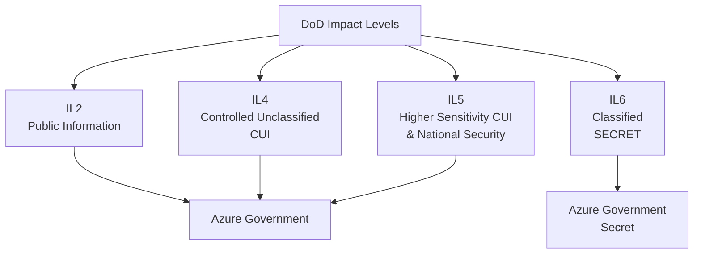
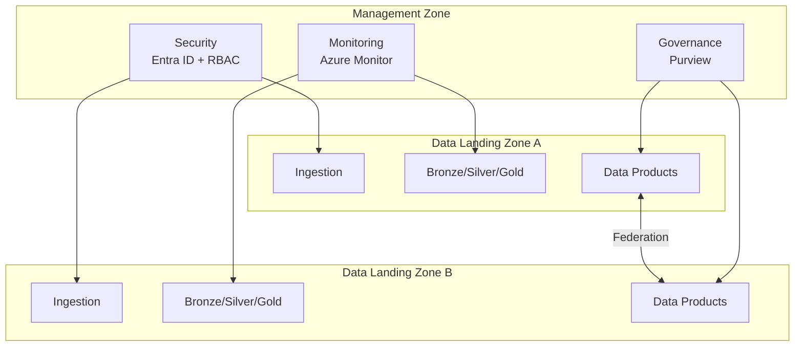

## Government Data Analytics on Azure

Azure provides purpose-built infrastructure for government analytics workloads through Azure Government Cloud, a physically isolated instance of Azure that meets the most stringent U.S. government compliance requirements. This page covers the platform capabilities, compliance frameworks, and reference architectures relevant to building analytics solutions for public sector organizations.

---

## Azure Government Cloud

Azure Government is a separate instance of Microsoft Azure designed exclusively for U.S. government agencies and their partners. It operates in dedicated datacenters with network isolation from commercial Azure.

### Key Differentiators

| Capability | Azure Government | Azure Commercial |
|---|---|---|
| **Physical isolation** | Dedicated datacenters, U.S. only | Global regions |
| **Personnel** | Screened U.S. persons only | Standard Microsoft hiring |
| **FedRAMP** | FedRAMP High baseline | FedRAMP High (select services) |
| **DoD Impact Levels** | IL2, IL4, IL5, IL6 | IL2 only |
| **CJIS** | CJIS-compliant | Not available |
| **ITAR** | ITAR-compliant | Not available |
| **IRS 1075** | Compliant | Not available |

!!! warning "Service Availability"
    Not all Azure services are available in Azure Government. Always verify service availability before architecting solutions. See the [Gov Service Matrix](../GOV_SERVICE_MATRIX.md) in this documentation for a detailed comparison.

### Impact Level Summary

---

## Compliance Frameworks for Analytics

Government analytics platforms must comply with multiple overlapping frameworks. CSA-in-a-Box includes compliance mappings for the most common ones.

### Framework Matrix

| Framework | Scope | Analytics Relevance | CSA-in-a-Box Mapping |
|---|---|---|---|
| **FedRAMP High** | All federal systems | Baseline for any federal analytics | Foundation for all patterns |
| **NIST 800-53 Rev 5** | Security controls | Access control, audit, encryption | [NIST 800-53 Mapping](../compliance/nist-800-53-rev5.md) |
| **CMMC 2.0 Level 2** | Defense contractors | CUI protection in data pipelines | [CMMC 2.0 Mapping](../compliance/cmmc-2.0-l2.md) |
| **HIPAA** | Health data | PHI in analytics pipelines | [HIPAA Mapping](../compliance/hipaa-security-rule.md) |
| **CJIS** | Criminal justice data | Law enforcement analytics | Network isolation, encryption |
| **IRS 1075** | Tax information | FTI in analytics platforms | Dedicated enclaves |

!!! tip "Compliance as Code"
    CSA-in-a-Box compliance mappings are version-controlled markdown documents that map platform capabilities to specific control requirements. This enables compliance-as-code workflows where control implementation evidence is maintained alongside infrastructure code.

---

## Reference Architectures

Microsoft publishes several reference architectures for analytics on Azure that align with CSA-in-a-Box patterns.

### Analytics End-to-End with Azure

The [Analytics End-to-End](https://learn.microsoft.com/en-us/azure/architecture/example-scenario/dataplate2e/data-platform-end-to-end) reference architecture provides a comprehensive pattern for enterprise analytics covering ingestion, transformation, serving, and governance.

**Key components:**

- Azure Data Factory for orchestration
- Azure Data Lake Storage Gen2 for storage
- Azure Databricks or Synapse for compute
- Power BI for visualization
- Microsoft Purview for governance

CSA-in-a-Box extends this architecture with:

- Domain-driven organization (Data Mesh)
- Medallion layer conventions (Bronze/Silver/Gold)
- Data product contracts
- Flag-don't-drop data quality
- Multi-tenant isolation patterns

### Cloud-Scale Analytics (Cloud Adoption Framework)

The [Cloud-Scale Analytics](https://learn.microsoft.com/en-us/azure/cloud-adoption-framework/scenarios/cloud-scale-analytics/) scenario in the Cloud Adoption Framework provides organizational and governance guidance for large-scale analytics platforms.

**Key concepts:**

- **Data Landing Zones** — Isolated environments per domain or business unit
- **Data Management Zone** — Centralized governance, catalog, and security
- **Data Products** — Self-contained, governed datasets with SLAs
- **Federated Governance** — Domain teams own their data with platform guardrails

---

## Data Governance with Microsoft Purview

Microsoft Purview provides unified data governance across on-premises, multi-cloud, and SaaS environments. For government analytics, Purview delivers:

### Core Capabilities

| Capability | Government Analytics Use |
|---|---|
| **Data Catalog** | Discover and classify datasets across agencies |
| **Data Map** | Automated scanning and classification of sensitive data |
| **Lineage** | Track data from source through transformations to reports |
| **Access Policies** | Enforce least-privilege access to data assets |
| **Sensitivity Labels** | Apply CUI, FOUO, and custom classification labels |
| **Glossary** | Standardize business terminology across domains |

### Integration with CSA-in-a-Box

Purview integrates with every layer of the CSA-in-a-Box architecture:

- **Bronze** — Scan raw data for sensitive content upon ingestion
- **Silver** — Track lineage through dbt transformations
- **Gold** — Register data products in the catalog with business glossary terms
- **Serving** — Enforce access policies on Power BI datasets and API endpoints

!!! info "Purview in Azure Government"
    Microsoft Purview is available in Azure Government regions. Verify the latest feature parity at [Azure Government services by region](https://azure.microsoft.com/en-us/explore/global-infrastructure/government/by-region/).

---

## Security and Compliance Considerations

### Encryption

| Layer | At Rest | In Transit |
|---|---|---|
| **Storage (ADLS Gen2)** | AES-256, customer-managed keys via Key Vault | TLS 1.2+ |
| **Compute (Databricks)** | Encrypted cluster storage | TLS 1.2+ |
| **Catalog (Purview)** | Platform-managed encryption | TLS 1.2+ |

### Network Isolation

Government analytics platforms require network controls beyond commercial patterns:

- **Private Endpoints** for all PaaS services (ADLS, Databricks, Key Vault, Purview)
- **Virtual Network injection** for Databricks clusters
- **Network Security Groups** restricting east-west traffic
- **Azure Firewall** or NVA for egress control
- **ExpressRoute** for hybrid connectivity to on-premises government networks
- **No public internet exposure** for data plane services

### Identity and Access

- **Microsoft Entra ID** (formerly Azure AD) for authentication
- **RBAC** at resource, resource group, and subscription levels
- **Managed Identities** for service-to-service authentication (no stored credentials)
- **Conditional Access** policies enforcing MFA, compliant devices, and trusted locations
- **Privileged Identity Management (PIM)** for just-in-time admin access

---

## Public Sector Case Studies

### Federal Civilian Agencies

Federal civilian agencies use Azure analytics platforms for:

- **Regulatory compliance monitoring** — Tracking enforcement actions and compliance status across regulated industries
- **Grant management analytics** — Analyzing grant distribution, utilization, and outcomes
- **Fraud detection** — Identifying anomalous patterns in financial transactions and benefit claims
- **FOIA request processing** — Using AI to classify and redact documents for public release

### Defense and Intelligence

Defense organizations leverage Azure Government for:

- **Logistics and supply chain** — Predictive maintenance and demand forecasting
- **Personnel analytics** — Workforce planning and readiness metrics
- **Geospatial intelligence** — Processing satellite imagery and sensor data
- **Cyber threat analytics** — Correlating security events across networks

### State and Local Government

State and local agencies apply analytics for:

- **Public health surveillance** — Disease tracking and resource allocation
- **Criminal justice analytics** — Case outcome analysis, recidivism prediction
- **Transportation planning** — Traffic pattern analysis and infrastructure prioritization
- **Revenue forecasting** — Tax collection trends and budget planning

---

## Next Steps

- [Antitrust Analytics on Azure](antitrust-analytics.md) — See a complete domain implementation
- [DOJ Antitrust Deep Dive](doj-antitrust-deep-dive.md) — Step-by-step domain build walkthrough
- [Azure Analytics Resources](azure-analytics-resources.md) — White papers and reference materials
- [Gov Service Matrix](../GOV_SERVICE_MATRIX.md) — Azure Government service availability
