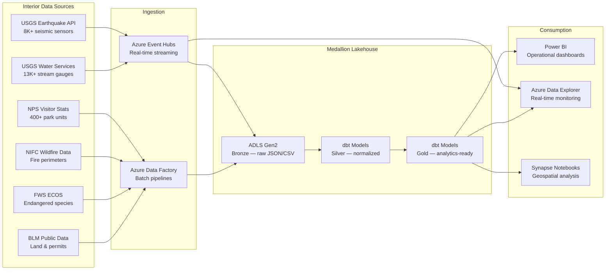

## Department of Interior Natural Resources Analytics on Azure

The U.S. Department of the Interior manages roughly 500 million acres of federal land and oversees natural resource programs spanning six major bureaus: the U.S. Geological Survey (USGS), National Park Service (NPS), Bureau of Land Management (BLM), U.S. Fish and Wildlife Service (FWS), Bureau of Reclamation, and the Office of Surface Mining. Each bureau publishes operational data through independent APIs and bulk-download portals — earthquake catalogs, stream-gauge telemetry, visitor counts, wildfire perimeters, species occurrence records, and land-use permits.

Individually, these datasets answer narrow operational questions. Combined in a unified lakehouse, they enable cross-bureau analysis: correlating seismic activity with groundwater-level changes, forecasting park capacity against wildfire smoke advisories, or mapping endangered species habitat overlap with active mining claims. This use case applies the CSA-in-a-Box medallion architecture to Interior's public data catalog, demonstrating both real-time streaming for sensor networks and batch ingestion for administrative records.

---

## Architecture

The architecture separates two ingestion paths: a **streaming path** for high-frequency sensor telemetry (USGS earthquake feeds, water-gauge readings) and a **batch path** for periodically updated administrative datasets (NPS visitor stats, FWS species listings, BLM permit records, NIFC fire perimeters). Both converge in ADLS Gen2 bronze, flow through dbt-managed silver and gold layers, and serve downstream consumers through Power BI and Azure Data Explorer.



---

## Data Sources

| Source | Description | Volume / Coverage | Update Frequency | Access Method |
|---|---|---|---|---|
| **USGS Earthquake API** | ComCat earthquake catalog — origin time, magnitude, depth, felt reports, tsunami flags from the Advanced National Seismic System | 8,000+ sensors, ~20,000 events/year globally (M2.5+) | Real-time (seconds) | [REST API (GeoJSON)](https://earthquake.usgs.gov/fdsnws/event/1/) |
| **USGS Water Services** | National Water Information System (NWIS) — daily and instantaneous streamflow, gauge height, water temperature, dissolved oxygen | 13,000+ active stream gauges, 850,000+ historical sites | Real-time (15 min) to daily | [REST API (JSON/RDB)](https://waterservices.usgs.gov/rest/) |
| **NPS Visitor Statistics** | Monthly recreation visits, camping, lodging, and backcountry use across all NPS units | 400+ park units, 300M+ recreation visits/year | Monthly | [IRMA Stats API](https://irmaservices.nps.gov/v3/rest/stats) |
| **NIFC Wildfire Data** | National Interagency Fire Center — active fire perimeters, prescribed burns, fire weather zones | 50,000+ fires/year, GIS perimeter polygons | Daily during fire season | [ArcGIS REST / GeoJSON](https://data-nifc.opendata.arcgis.com/) |
| **FWS ECOS** | Environmental Conservation Online System — threatened/endangered species listings, critical habitat designations, recovery plans | 1,600+ listed species, 800+ critical habitat designations | Quarterly | [ECOS REST API](https://ecos.fws.gov/ecp/) |
| **BLM Public Data** | Land status, mining claims, grazing allotments, oil & gas lease parcels, right-of-way grants | 245M acres of public land, 63,000+ grazing permits | Monthly | [BLM Navigator / ArcGIS](https://navigator.blm.gov/) |

!!! info "Data Access"
    All Interior datasets listed above are publicly available at no cost. The USGS Earthquake API and Water Services require no authentication. The NPS Stats API is open but rate-limited. NIFC and BLM data are available through ArcGIS Open Data portals. FWS ECOS provides both a web interface and downloadable bulk files.

!!! warning "Rate Limits"
    USGS Water Services requests should include a `User-Agent` header identifying your application. Batch fetches against NPS IRMA should observe a 300 ms delay between requests to avoid throttling. The USGS Earthquake API limits queries to 20,000 events per request — use date windowing for larger extractions.

---

## Step 1 — Real-Time Earthquake Monitoring

The USGS Earthquake Hazards Program publishes events within seconds of detection through the ComCat API. A streaming producer polls the API on a short interval, serializes events to Avro, and pushes them to Event Hubs for sub-minute alerting in Azure Data Explorer alongside batch persistence to the lakehouse.

### Streaming Producer

The following producer fetches recent earthquake events from the USGS API and forwards them to Azure Event Hubs. This pattern mirrors the fetcher in [`examples/interior/data/open-data/fetch_usgs_nps.py`](../../examples/interior/data/open-data/fetch_usgs_nps.py) but adds Event Hubs integration for real-time downstream consumption.

```python
"""USGS Earthquake streaming producer for Azure Event Hubs."""

import json
import time
from datetime import datetime, timedelta, timezone

import requests
from azure.eventhub import EventHubProducerClient, EventData

USGS_API = "https://earthquake.usgs.gov/fdsnws/event/1/query"
EVENT_HUB_CONN_STR = "Endpoint=sb://<namespace>.servicebus.windows.net/;..."
EVENT_HUB_NAME = "usgs-earthquakes"
POLL_INTERVAL_SEC = 60
MIN_MAGNITUDE = 2.5


def fetch_recent_earthquakes(since: datetime) -> list[dict]:
    """Fetch earthquake events since a given timestamp."""
    params = {
        "format": "geojson",
        "starttime": since.strftime("%Y-%m-%dT%H:%M:%S"),
        "minmagnitude": MIN_MAGNITUDE,
        "orderby": "time",
    }
    resp = requests.get(USGS_API, params=params, timeout=30)
    resp.raise_for_status()
    features = resp.json().get("features", [])

    events = []
    for feat in features:
        props = feat["properties"]
        coords = feat["geometry"]["coordinates"]
        events.append({
            "event_id": feat["id"],
            "event_time": datetime.fromtimestamp(
                props["time"] / 1000, tz=timezone.utc
            ).isoformat(),
            "latitude": coords[1],
            "longitude": coords[0],
            "depth_km": coords[2],
            "magnitude": props["mag"],
            "magnitude_type": props.get("magType", ""),
            "place": props.get("place", ""),
            "tsunami_flag": bool(props.get("tsunami", 0)),
            "felt_reports": props.get("felt"),
            "alert_level": props.get("alert", ""),
            "status": props.get("status", ""),
        })
    return events


def stream_to_event_hub():
    """Continuously poll USGS and push events to Event Hubs."""
    producer = EventHubProducerClient.from_connection_string(
        conn_str=EVENT_HUB_CONN_STR,
        eventhub_name=EVENT_HUB_NAME,
    )
    last_poll = datetime.now(timezone.utc) - timedelta(minutes=5)

    with producer:
        while True:
            events = fetch_recent_earthquakes(since=last_poll)
            if events:
                batch = producer.create_batch()
                for event in events:
                    batch.add(EventData(json.dumps(event)))
                producer.send_batch(batch)
                print(f"Sent {len(events)} earthquake events to Event Hubs")

            last_poll = datetime.now(timezone.utc)
            time.sleep(POLL_INTERVAL_SEC)


if __name__ == "__main__":
    stream_to_event_hub()
```

### KQL — Real-Time Earthquake Monitoring

Once events land in Azure Data Explorer, analysts can query for significant seismic activity, detect swarms, and correlate with nearby water-gauge anomalies.

```kql
// Recent significant earthquakes (M4.0+) in the last 24 hours
UsgsEarthquakes
| where event_time > ago(24h)
| where magnitude >= 4.0
| project event_time, magnitude, magnitude_type, depth_km,
          latitude, longitude, place, alert_level, felt_reports
| order by magnitude desc

// Earthquake swarm detection: 10+ events within 50 km in 6 hours
UsgsEarthquakes
| where event_time > ago(7d)
| extend geo_hash = geo_point_to_s2cell(longitude, latitude, 12)
| summarize event_count = count(),
            avg_magnitude = avg(magnitude),
            max_magnitude = max(magnitude),
            first_event = min(event_time),
            last_event = max(event_time)
    by geo_hash, bin(event_time, 6h)
| where event_count >= 10
| order by event_count desc

// Cross-reference: water-gauge anomalies near recent M5+ earthquakes
let significant_quakes = UsgsEarthquakes
    | where event_time > ago(48h) and magnitude >= 5.0
    | project quake_time = event_time, quake_lat = latitude,
              quake_lon = longitude, magnitude, place;
UsgsWaterGauges
| where measurement_time > ago(48h)
| extend distance_km = geo_distance_2points(
    longitude, latitude,
    toscalar(significant_quakes | top 1 by magnitude | project quake_lon),
    toscalar(significant_quakes | top 1 by magnitude | project quake_lat)
  ) / 1000
| where distance_km < 100
| summarize avg_flow = avg(streamflow_cfs),
            stddev_flow = stdev(streamflow_cfs)
    by site_id, bin(measurement_time, 1h)
| where stddev_flow > avg_flow * 0.5
| order by measurement_time desc
```

---

## Step 2 — Water Resource Analytics

USGS operates over 13,000 active stream gauges reporting streamflow (discharge) and gauge height at 15-minute to daily intervals. The silver layer normalizes raw NWIS records, calculates drought indices, classifies flood stages against NWS reference levels, and derives seasonal percentile rankings.

### dbt Silver Model — Water Observations

The silver model transforms raw bronze records into analytics-ready water observations with drought classification, flood stage mapping, and specific discharge normalization. Full model: [`examples/interior/domains/dbt/models/silver/slv_water_resources.sql`](../../examples/interior/domains/dbt/models/silver/slv_water_resources.sql).

```sql
-- Silver layer: key transformations (excerpt from slv_water_resources.sql)

-- Flood stage classification against NWS reference levels
CASE
    WHEN parameter_code = '00065'
         AND COALESCE(daily_mean, value) >= major_flood_stage_ft
        THEN 'MAJOR_FLOOD'
    WHEN parameter_code = '00065'
         AND COALESCE(daily_mean, value) >= moderate_flood_stage_ft
        THEN 'MODERATE_FLOOD'
    WHEN parameter_code = '00065'
         AND COALESCE(daily_mean, value) >= flood_stage_ft
        THEN 'MINOR_FLOOD'
    WHEN parameter_code = '00065'
         AND COALESCE(daily_mean, value) >= action_stage_ft
        THEN 'ACTION_STAGE'
    WHEN parameter_code = '00065' THEN 'NORMAL'
    ELSE NULL
END AS flood_stage_class,

-- Drought index classification using streamflow percentile
CASE
    WHEN COALESCE(daily_mean, value) <= percentile_10
        THEN 'EXTREME_DROUGHT'
    WHEN COALESCE(daily_mean, value) <= percentile_25
        THEN 'MODERATE_DROUGHT'
    WHEN COALESCE(daily_mean, value) <= percentile_75
        THEN 'NORMAL'
    WHEN COALESCE(daily_mean, value) <= percentile_90
        THEN 'ABOVE_NORMAL'
    WHEN COALESCE(daily_mean, value) > percentile_90
        THEN 'MUCH_ABOVE_NORMAL'
    ELSE 'INSUFFICIENT_HISTORY'
END AS drought_index,

-- Specific discharge: flow normalized by drainage area
CASE
    WHEN parameter_code = '00060' AND drainage_area_sq_mi > 0
    THEN ROUND(COALESCE(daily_mean, value) / drainage_area_sq_mi, 4)
    ELSE NULL
END AS specific_discharge_cfs_per_sqmi
```

!!! tip "Hydrologic Unit Codes"
    The silver model extracts HUC region and sub-region codes from the full HUC identifier, enabling watershed-level aggregation. HUC-2 regions align with major river basins (e.g., `14` = Upper Colorado, `15` = Lower Colorado), while HUC-4 sub-regions provide finer drainage area groupings.

---

## Step 3 — National Park Capacity Management

NPS publishes monthly visitation statistics for each park unit — recreation visits, camping (tent, RV, backcountry), lodging, and recreation hours. Combined with park infrastructure data (campground capacity, parking spaces, trail miles), the gold layer produces capacity utilization metrics and seasonal forecasting inputs.

### Capacity Analysis Pattern

```sql
-- Gold layer: park capacity utilization and seasonal patterns
WITH monthly_metrics AS (
    SELECT
        park_code,
        park_name,
        state,
        region,
        measurement_year,
        measurement_month,
        recreation_visits,
        tent_campers + rv_campers + backcountry_campers AS total_campers,
        campground_capacity,
        CASE
            WHEN campground_capacity > 0
            THEN ROUND(
                (tent_campers + rv_campers) * 100.0 / campground_capacity, 1
            )
            ELSE NULL
        END AS campground_utilization_pct,
        -- Year-over-year comparison
        LAG(recreation_visits, 12) OVER (
            PARTITION BY park_code ORDER BY measurement_year, measurement_month
        ) AS visits_prior_year
    FROM {{ ref('slv_park_visitors') }}
),

seasonal_rank AS (
    SELECT *,
        PERCENT_RANK() OVER (
            PARTITION BY park_code, measurement_month
            ORDER BY recreation_visits
        ) AS seasonal_percentile
    FROM monthly_metrics
)

SELECT *,
    CASE
        WHEN campground_utilization_pct >= 95 THEN 'AT_CAPACITY'
        WHEN campground_utilization_pct >= 80 THEN 'HIGH_UTILIZATION'
        WHEN campground_utilization_pct >= 50 THEN 'MODERATE'
        ELSE 'LOW'
    END AS capacity_status,
    CASE
        WHEN visits_prior_year > 0
        THEN ROUND(
            (recreation_visits - visits_prior_year) * 100.0 / visits_prior_year, 1
        )
        ELSE NULL
    END AS yoy_change_pct
FROM seasonal_rank
```

---

## Step 4 — Wildfire Risk Prediction

NIFC publishes active fire perimeters, historical fire occurrence data, and fire weather zone boundaries. The gold layer combines wildfire history with USGS vegetation and terrain data to produce risk scores at the HUC-8 watershed level.

### Cross-Bureau Wildfire Risk Model

```sql
-- Gold layer: wildfire risk scoring by watershed (excerpt from gld_wildfire_risk.sql)
SELECT
    w.huc_code,
    w.huc_name,
    w.state_code,
    -- Historical fire frequency
    COUNT(DISTINCT f.fire_id) AS fires_last_10yr,
    SUM(f.acres_burned) AS total_acres_burned_10yr,
    -- Current conditions
    AVG(h.drought_index_numeric) AS avg_drought_severity,
    -- Infrastructure exposure
    COUNT(DISTINCT p.park_code) AS nps_units_in_watershed,
    SUM(p.annual_recreation_visits) AS total_park_visits_at_risk,
    -- BLM land overlap
    SUM(b.blm_acres) AS blm_acres_in_watershed,
    COUNT(DISTINCT b.grazing_allotment_id) AS active_grazing_allotments,
    -- Composite risk score
    (
        COALESCE(fires_last_10yr, 0) * 0.3 +
        COALESCE(avg_drought_severity, 0) * 0.3 +
        CASE WHEN total_park_visits_at_risk > 1000000 THEN 20
             WHEN total_park_visits_at_risk > 100000 THEN 10
             ELSE 5 END * 0.2 +
        COALESCE(total_acres_burned_10yr / NULLIF(blm_acres_in_watershed, 0), 0) * 100 * 0.2
    ) AS composite_fire_risk_score
FROM dim_watershed w
LEFT JOIN fct_wildfires f ON w.huc_code = f.huc_code AND f.fire_year >= YEAR(CURRENT_DATE) - 10
LEFT JOIN slv_water_resources h ON w.huc_code = h.huc_code
LEFT JOIN fct_park_annual p ON w.huc_code = p.huc_code
LEFT JOIN dim_blm_lands b ON w.huc_code = b.huc_code
GROUP BY w.huc_code, w.huc_name, w.state_code
```

---

## Step 5 — Wildlife Conservation Analytics

FWS ECOS tracks 1,600+ species listed under the Endangered Species Act, including critical habitat boundary polygons. Overlaying these with BLM land-use permits and USGS water data enables impact assessment for proposed activities on federal land.

### Conservation Overlap Analysis

| Analysis | Data Sources | Output |
|---|---|---|
| Critical habitat vs. active mining claims | FWS ECOS habitat polygons + BLM mining claims | Conflict parcels requiring Section 7 consultation |
| Species range vs. wildfire perimeters | FWS species occurrence + NIFC active fires | At-risk populations for emergency response |
| Aquatic species vs. drought conditions | FWS aquatic species + USGS streamflow drought index | Streams where listed fish face low-flow stress |
| Habitat connectivity vs. BLM rights-of-way | FWS habitat corridors + BLM ROW grants | Fragmentation risk scoring for permit review |

!!! note "Section 7 Consultation"
    Under the Endangered Species Act, federal agencies must consult with FWS before authorizing actions that may affect listed species or critical habitat. The overlap analysis automates the initial screening step, identifying parcels where formal consultation is likely required.

---

## Step 6 — BLM Land Management

BLM administers 245 million acres of public land, issuing permits for grazing, mining, oil and gas exploration, renewable energy, and rights-of-way. Combining BLM permit data with environmental layers from USGS, FWS, and NIFC enables data-driven land-use planning.

### Key BLM Datasets

| Dataset | Records | Description |
|---|---|---|
| Grazing allotments | 18,000+ | Boundaries, AUMs, permittee, livestock type |
| Mining claims | 350,000+ active | Lode, placer, mill site, tunnel site claims |
| Oil & gas leases | 25,000+ active | Lease parcels, production volumes, royalties |
| Rights-of-way | 63,000+ | Roads, pipelines, power lines, communication sites |
| Solar/wind energy zones | 700+ | Designated renewable energy development areas |

---

## Cross-Bureau Analytics

The unified lakehouse enables queries that span bureau boundaries — analysis that is difficult or impossible when each bureau maintains isolated data stores.

| Scenario | Bureaus | Question Answered |
|---|---|---|
| Seismic impact on water supply | USGS Earthquake + USGS Water | Do M5+ earthquakes cause measurable streamflow changes within 100 km? |
| Wildfire smoke and park visitation | NIFC + NPS | How do active fires within 50 miles affect monthly park visits? |
| Drought and grazing permits | USGS Water + BLM | Which grazing allotments are in watersheds experiencing extreme drought? |
| Habitat and energy development | FWS + BLM | Do proposed solar energy zones overlap with critical habitat? |
| Park infrastructure and flood risk | NPS + USGS Water | Which park facilities are within flood-stage watersheds? |

---

## Implementation Reference

The `examples/interior/` directory contains the complete implementation:

```
examples/interior/
  ARCHITECTURE.md                          # System design documentation
  contracts/
    earthquake-monitoring.yaml             # Streaming data contract
    earthquake-events.yaml                 # Batch data contract
    natural-resources.yaml                 # Cross-domain contract
    park-visitors.yaml                     # NPS data contract
  data/
    generators/generate_interior_data.py   # Synthetic test data
    open-data/fetch_usgs_nps.py            # USGS/NPS API fetcher
  deploy/
    params.dev.json                        # Development parameters
    params.gov.json                        # GovCloud parameters
  domains/dbt/
    models/bronze/                         # Raw ingestion models
    models/silver/                         # Normalized & enriched
    models/gold/                           # Analytics-ready aggregates
    seeds/                                 # Reference/test data
  notebooks/
    geological_hazard_analysis.py          # Seismic analysis notebook
    park_capacity_forecasting.py           # Visitor forecasting
```

---

## Related Patterns

- **[Real-Time Intelligence & Anomaly Detection](realtime-intelligence-anomaly-detection.md)** — streaming architecture patterns applicable to earthquake and water-gauge telemetry
- **[NOAA Climate & Ocean Analytics](noaa-climate-analytics.md)** — similar medallion architecture for environmental sensor data
- **[EPA Environmental Analytics](epa-environmental-analytics.md)** — complementary environmental monitoring with air and water quality data

---

## Sources

| Resource | URL |
|---|---|
| USGS Earthquake Hazards API | <https://earthquake.usgs.gov/fdsnws/event/1/> |
| USGS Water Services (NWIS) | <https://waterservices.usgs.gov/rest/> |
| NPS Visitor Use Statistics | <https://irmaservices.nps.gov/v3/rest/stats> |
| NPS Stats Portal | <https://irma.nps.gov/Stats/> |
| NIFC Open Data | <https://data-nifc.opendata.arcgis.com/> |
| FWS ECOS | <https://ecos.fws.gov/ecp/> |
| FWS Critical Habitat Maps | <https://fws.gov/library/collections/critical-habitat-online-mapper> |
| BLM Navigator | <https://navigator.blm.gov/> |
| BLM GeoCommunicator | <https://geocommunicator.blm.gov/> |
| USGS National Map | <https://apps.nationalmap.gov/> |
