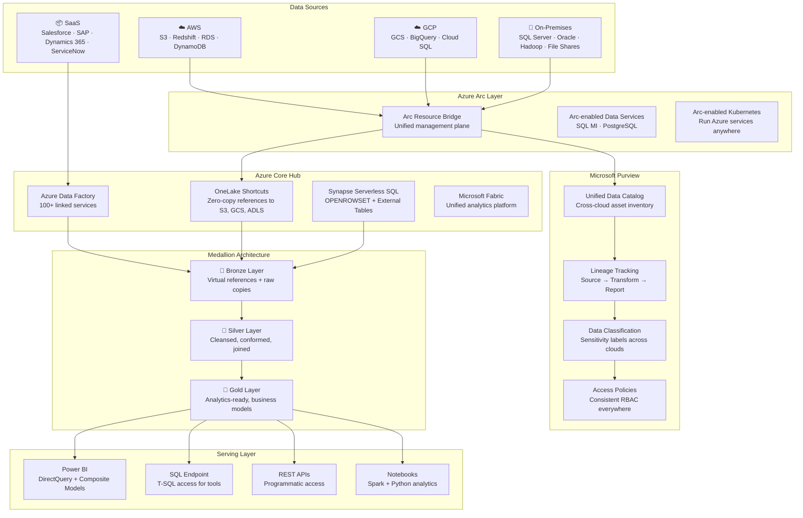
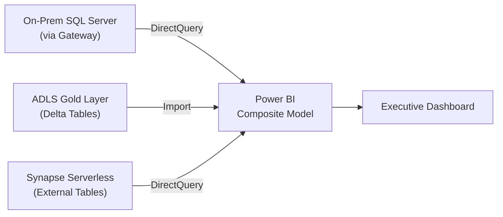
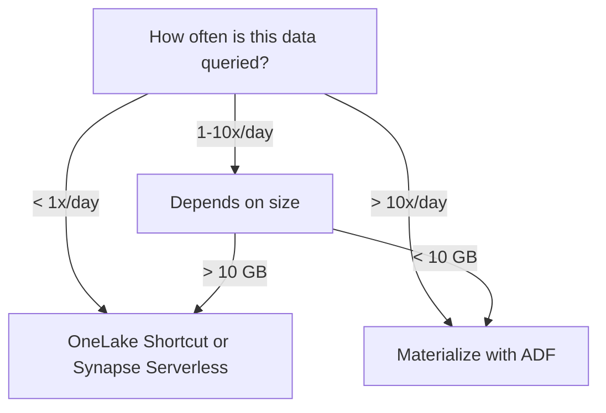

# Multi-Cloud Data Virtualization with Azure at the Core

## Overview

Every enterprise of meaningful scale has the same problem: data is everywhere. Customer records live in AWS RDS. Transaction logs stream into GCP BigQuery. The ERP system runs on-premises on Oracle. CRM data sits in Salesforce. And someone in finance has a critical spreadsheet on SharePoint.

The traditional answer — copy everything into one place — creates more problems than it solves:

- **Cost**: Storing duplicate petabytes across clouds doubles or triples storage spend.
- **Governance**: Every copy is a governance liability. Which copy is authoritative? Who has access to copy #3?
- **Latency**: Batch ETL pipelines introduce hours or days of delay. The data is always stale.
- **Data residency**: Regulations like GDPR, CCPA, and sovereign data laws may prohibit moving data across regions or borders.
- **Complexity**: N sources × M destinations = an exponential integration problem.

**Data virtualization** is the alternative: query data where it lives. Instead of moving bytes, you move queries. A virtualization layer presents a unified semantic model over physically distributed data, and the compute travels to the data — not the other way around.

!!! info "What Data Virtualization Is Not"
Data virtualization is not a replacement for a data warehouse. It is a complementary pattern. Some data should be materialized (copied, transformed, stored) for performance. Other data should be virtualized (queried in place) for freshness, cost, or compliance. The art is knowing which is which.

### Why Azure Is Uniquely Positioned as the Core

Azure is the only cloud platform that provides the complete stack required to serve as the core of a multi-cloud data virtualization architecture. No other cloud comes close to this combination:

| Capability                        | Azure Service                               | What It Does                                                                                     |
| --------------------------------- | ------------------------------------------- | ------------------------------------------------------------------------------------------------ |
| Multi-cloud management plane      | **Azure Arc**                               | Extends Azure governance, policy, and monitoring to any infrastructure — AWS, GCP, on-prem, edge |
| Zero-copy cross-cloud data access | **Microsoft Fabric OneLake Shortcuts**      | Creates virtual references to S3, GCS, and ADLS data — no data movement                          |
| Serverless cross-cloud SQL        | **Synapse Analytics Serverless SQL**        | Queries Parquet, Delta, CSV across any storage using T-SQL via OPENROWSET                        |
| Real-time BI across clouds        | **Power BI DirectQuery + Composite Models** | Queries multiple sources live in a single report without importing data                          |
| Unified multi-cloud governance    | **Microsoft Purview**                       | Scans, catalogs, classifies, and tracks lineage across AWS, GCP, on-prem, and SaaS               |
| Cross-cloud data integration      | **Azure Data Factory**                      | 100+ connectors with Mapping Data Flows for in-place transformation                              |

AWS and GCP each have strong analytics services — but they are designed to work within their own ecosystems. Azure is designed to work across all of them.

---

## Architecture

The following diagram shows the complete multi-cloud data virtualization architecture with Azure at the core.



---

## Why Azure as the Core — Technical Comparison

This is not a marketing claim. It is an architectural reality based on what each cloud platform actually offers today.

| Capability                           | Azure                                                                                                           | AWS                                                      | GCP                                                           |
| ------------------------------------ | --------------------------------------------------------------------------------------------------------------- | -------------------------------------------------------- | ------------------------------------------------------------- |
| **Multi-cloud management plane**     | Azure Arc — projects Azure Resource Manager to any infra (AWS EC2, GCP VMs, on-prem servers, edge)              | None. AWS Systems Manager is AWS-only.                   | Anthos — Kubernetes-focused, limited data service support     |
| **Cross-cloud data shortcuts**       | OneLake shortcuts to S3, GCS, ADLS, Dataverse — zero-copy, metadata-only references                             | None. Lake Formation is S3-only.                         | BigQuery Omni runs on AWS/Azure but queries GCS natively only |
| **Serverless cross-cloud SQL**       | Synapse serverless SQL pools — OPENROWSET queries Parquet/Delta/CSV in S3, GCS, ADLS, HTTP endpoints            | Athena — S3 only, no native cross-cloud                  | BigQuery — GCS only for external tables, limited cross-cloud  |
| **Unified multi-cloud governance**   | Microsoft Purview — scans AWS S3, RDS, Redshift, GCS, BigQuery, Snowflake, Oracle, SAP, Salesforce, on-prem SQL | AWS Glue Data Catalog — AWS services only                | Dataplex — GCP services only                                  |
| **Hybrid identity**                  | Microsoft Entra ID + Arc — single identity plane across all clouds and on-prem                                  | IAM — AWS-scoped, federate via SAML/OIDC only            | Cloud Identity — GCP-scoped                                   |
| **BI with live cross-cloud queries** | Power BI DirectQuery + composite models — 100+ native connectors, query any source live                         | QuickSight — limited DirectQuery, primarily SPICE import | Looker — strong modeling but limited live connectivity        |
| **Data integration connectors**      | ADF — 100+ built-in connectors including SAP, Salesforce, Oracle, Dynamics, mainframes                          | Glue — fewer connectors, AWS-focused                     | Dataflow — GCP ecosystem focused                              |

!!! tip "The Key Differentiator"
Azure Arc + Purview + OneLake shortcuts is a combination no other cloud can replicate. It gives you a single management plane, a single governance catalog, and zero-copy data access — across every cloud and on-premises environment — from one control point.

---

## Data Virtualization Patterns

### Pattern 1: OneLake Shortcuts (Zero-Copy Federation)

OneLake shortcuts create virtual pointers to data in external storage systems. When you query a shortcut, OneLake reads directly from the source — no data is copied, no storage is consumed in OneLake.

**Supported shortcut targets:**

- Amazon S3 (and S3-compatible storage)
- Google Cloud Storage
- Azure Data Lake Storage Gen2
- Dataverse

**How it works:**

1. You create a shortcut in a Fabric lakehouse that points to an S3 bucket (or GCS bucket, ADLS container).
2. The shortcut appears as a folder in your lakehouse — indistinguishable from local data.
3. Spark notebooks, SQL endpoints, and Power BI all query the shortcut as if the data were local.
4. OneLake issues read requests to the source storage at query time. No intermediate copies.

**Step-by-step: Create an S3 shortcut**

=== "REST API"

    ```python
    import requests

    # Create a shortcut to an AWS S3 bucket in a Fabric lakehouse
    url = "https://api.fabric.microsoft.com/v1/workspaces/{workspace_id}/items/{lakehouse_id}/shortcuts"

    payload = {
        "path": "Tables/aws_customers",
        "name": "aws_customers",
        "target": {
            "amazonS3": {
                "location": "https://my-bucket.s3.us-east-1.amazonaws.com",
                "subpath": "/customers/delta/",
                "connectionId": "{connection_id}"  # Pre-configured S3 connection
            }
        }
    }

    headers = {
        "Authorization": f"Bearer {access_token}",
        "Content-Type": "application/json"
    }

    response = requests.post(url, json=payload, headers=headers)
    print(response.status_code, response.json())
    ```

=== "Fabric UI"

    1. Open your Fabric lakehouse.
    2. Right-click **Tables** → **New shortcut**.
    3. Select **Amazon S3** as the source.
    4. Enter the S3 bucket URL and select your connection.
    5. Choose the subfolder containing your Delta/Parquet data.
    6. Name the shortcut and click **Create**.

**Query the shortcut via SQL endpoint:**

```sql
-- This queries AWS S3 data live — no copy exists in OneLake
SELECT
    customer_id,
    customer_name,
    region,
    lifetime_value
FROM lakehouse1.dbo.aws_customers
WHERE region = 'us-east-1'
  AND lifetime_value > 10000
ORDER BY lifetime_value DESC;
```

!!! warning "Shortcut Performance Depends on Source Latency"
OneLake shortcuts query the source storage at runtime. If your Fabric workspace is in East US and your S3 bucket is in eu-west-1, every query pays ~100-150ms of cross-region latency per request. **Co-locate your Fabric capacity region with your source data region when possible.** For high-frequency queries, consider materializing the data instead.

**When to use OneLake shortcuts:**

- Large datasets (TB+) that are too expensive to copy
- Data that must remain in the source cloud for residency or compliance
- Analytics workloads with moderate query frequency (dozens of queries/day, not thousands)
- Cross-cloud data exploration and ad-hoc analytics

---

### Pattern 2: Synapse Serverless SQL (OPENROWSET / External Tables)

Synapse serverless SQL pools let you query files in any storage account using standard T-SQL — without provisioning any compute in advance. You pay only for the data scanned.

**Step-by-step: Query S3 data via OPENROWSET**

```sql
-- Step 1: Create a database-scoped credential for AWS S3
CREATE DATABASE SCOPED CREDENTIAL s3_credential
WITH IDENTITY = 'S3 Access Key',
SECRET = '{"AccessKeyId":"AKIA...","SecretAccessKey":"wJalr..."}';
GO

-- Step 2: Create an external data source pointing to S3
CREATE EXTERNAL DATA SOURCE aws_sales_data
WITH (
    LOCATION = 's3://my-bucket.s3.us-east-1.amazonaws.com/',
    CREDENTIAL = s3_credential
);
GO

-- Step 3: Query Parquet files directly with OPENROWSET
SELECT
    order_id,
    customer_id,
    order_date,
    total_amount,
    currency
FROM OPENROWSET(
    BULK 'sales/2024/**/*.parquet',
    DATA_SOURCE = 'aws_sales_data',
    FORMAT = 'PARQUET'
) AS orders
WHERE order_date >= '2024-01-01'
  AND total_amount > 500;
```

**Create a persistent external table for repeated use:**

```sql
-- External file format
CREATE EXTERNAL FILE FORMAT parquet_format
WITH (FORMAT_TYPE = PARQUET);
GO

-- External table — reusable, looks like a normal table
CREATE EXTERNAL TABLE dbo.aws_sales (
    order_id        BIGINT,
    customer_id     BIGINT,
    order_date      DATE,
    total_amount    DECIMAL(18,2),
    currency        VARCHAR(3)
)
WITH (
    LOCATION = 'sales/2024/',
    DATA_SOURCE = aws_sales_data,
    FILE_FORMAT = parquet_format
);
GO

-- Now query like any table
SELECT * FROM dbo.aws_sales WHERE currency = 'USD';
```

!!! danger "OPENROWSET File Limit"
OPENROWSET has a limit of approximately **10,000 files per query**. If your S3 bucket has heavily partitioned data with many small files, you will hit this limit. **Partition wisely** — use date-based partitioning with fewer, larger files rather than thousands of micro-files.

**When to use Synapse serverless:**

- Ad-hoc data exploration across cloud storage
- Lightweight, infrequent queries that don't justify OneLake shortcuts
- T-SQL-native teams who need cross-cloud access without learning Spark
- Cost-sensitive workloads — pay only for TB scanned ($5/TB)

---

### Pattern 3: ADF Mapping Data Flows (Transform at Source)

Azure Data Factory connects to 100+ data sources via linked services. Mapping Data Flows provide a visual, code-free transformation layer that runs on managed Spark.

**When to use ADF instead of shortcuts:**

- **SaaS sources** (Salesforce, SAP, Dynamics, ServiceNow) — these don't expose storage-layer access
- **On-premises databases** — behind firewalls, accessible only via Self-Hosted Integration Runtime
- **Data that needs transformation before landing** — deduplication, PII masking, schema normalization

**Step-by-step: Ingest Salesforce data to Bronze layer**

1. **Create a Self-Hosted Integration Runtime** (for on-prem) or use Azure IR (for cloud/SaaS).
2. **Create a Linked Service** for Salesforce:
    - Authentication: OAuth2 or username/password + security token
    - Connection: Salesforce API endpoint
3. **Create a Mapping Data Flow**:
    - Source: Salesforce `Account` and `Opportunity` objects
    - Transformations: Select columns, rename to snake_case, add `_ingested_at` timestamp
    - Sink: ADLS Gen2 Bronze container in Delta format
4. **Create a Pipeline** that triggers the data flow on schedule.

```json
{
    "name": "SalesforceToLakehouse",
    "properties": {
        "activities": [
            {
                "name": "IngestAccounts",
                "type": "ExecuteDataFlow",
                "dataflow": { "referenceName": "df_salesforce_accounts" },
                "compute": {
                    "coreCount": 8,
                    "computeType": "MemoryOptimized"
                }
            }
        ],
        "parameters": {
            "incrementalDate": { "type": "string" }
        }
    }
}
```

!!! warning "Mapping Data Flow Cost"
Mapping Data Flows spin up dedicated Spark clusters. An 8-core MemoryOptimized cluster costs approximately **$0.96/hour**. For small datasets, consider Copy Activity (no Spark) instead. Reserve Data Flows for transformations that genuinely require Spark.

---

### Pattern 4: Power BI Composite Models (DirectQuery + Import)

Composite models let a single Power BI dataset combine DirectQuery tables (queried live) with Import tables (cached in memory). This is the serving-layer pattern for multi-cloud virtualization.

**Architecture:**



**Step-by-step:**

1. **Connect to on-premises SQL Server** via an On-Premises Data Gateway in DirectQuery mode.
2. **Connect to ADLS Gold layer** via Synapse SQL endpoint — import aggregated dimension tables.
3. **Create relationships** between DirectQuery fact tables and imported dimension tables.
4. **Build reports** that combine real-time on-prem operational data with historical cloud analytics.

!!! tip "Aggregation Tables for DirectQuery Performance"
DirectQuery performance is bounded by source query speed. Create **aggregation tables** in Power BI that pre-summarize DirectQuery data at higher grain levels. Power BI automatically routes queries to aggregations when possible, falling back to DirectQuery for detail-level queries.

!!! danger "DirectQuery Anti-Pattern"
Do not use DirectQuery against sources with >5 second query response times. Users will experience unacceptable report load times. If the source is slow, import the data or create a materialized view closer to the consumer.

---

## Azure Arc for Multi-Cloud Governance

Azure Arc extends the Azure management plane to infrastructure running anywhere. For data virtualization, Arc provides three critical capabilities:

### Arc-Enabled SQL Server

Register any SQL Server instance — on-premises, in AWS EC2, or in GCP Compute Engine — with Azure Arc. Once registered:

- **Azure Portal visibility**: The SQL Server appears in the Azure Portal alongside cloud-native resources.
- **Microsoft Defender for SQL**: Threat detection and vulnerability assessment, regardless of hosting location.
- **Purview integration**: Purview can scan Arc-connected SQL Servers for cataloging and classification.
- **Azure Policy**: Enforce configuration baselines (encryption, auditing) across all SQL Servers.

**Step-by-step: Register an AWS EC2 SQL Server with Arc**

```bash
# 1. Download and install the Azure Connected Machine agent on the EC2 instance
wget https://aka.ms/azcmagent -O install_linux_azcmagent.sh
bash install_linux_azcmagent.sh

# 2. Connect the machine to Azure Arc
azcmagent connect \
  --resource-group "rg-arc-multicloud" \
  --tenant-id "{tenant-id}" \
  --location "eastus" \
  --subscription-id "{subscription-id}" \
  --cloud "AzureCloud"

# 3. The SQL Server extension is auto-detected and registered
# Verify in Azure Portal: Azure Arc > SQL Server
```

### Arc-Enabled Data Services

Run Azure SQL Managed Instance or Azure Arc-enabled PostgreSQL on any Kubernetes cluster — on-prem, AWS EKS, or GCP GKE. This gives you Azure-managed database services on infrastructure you control.

### Arc-Enabled Kubernetes

Deploy Azure services (including data services, ML workloads, and App Services) to any CNCF-conformant Kubernetes cluster. This is the foundation for running Azure analytics components at the data source.

---

## Microsoft Purview for Unified Governance

Data virtualization without governance is just federation of chaos. Microsoft Purview provides the governance layer that makes multi-cloud virtualization manageable.

### Scanning Multi-Cloud Sources

Purview natively scans:

| Source Type | Examples                                                    | Scan Method                                           |
| ----------- | ----------------------------------------------------------- | ----------------------------------------------------- |
| AWS         | S3, RDS (SQL Server, PostgreSQL, MySQL), Redshift, DynamoDB | Purview connectors via Self-Hosted IR or managed VNet |
| GCP         | GCS, BigQuery, Cloud SQL                                    | Purview connectors                                    |
| On-premises | SQL Server, Oracle, SAP HANA, Teradata, file shares         | Self-Hosted Integration Runtime                       |
| SaaS        | Salesforce, SAP S/4HANA, Dynamics 365, Power BI             | Native connectors                                     |
| Azure       | ADLS, Synapse, Fabric, SQL Database, Cosmos DB              | Native (auto-discovery)                               |

### Unified Data Catalog

After scanning, Purview creates a single searchable catalog of every data asset across all clouds:

- **Business glossary terms** mapped to physical assets regardless of cloud
- **Data classification** — automatic detection of PII, financial data, health records
- **Sensitivity labels** — Microsoft Information Protection labels applied to data assets
- **Owner assignment** — data stewards assigned per asset or collection

### Cross-Cloud Lineage

Purview tracks data lineage from source through transformation to consumption:

```
AWS RDS (customers) → ADF Copy → ADLS Bronze → dbt transform → ADLS Silver →
Synapse View → Power BI Report
```

This lineage is visualized in the Purview portal, showing exactly how data flows across cloud boundaries. When a source schema changes or a quality issue is detected, you can trace impact downstream.

**Step-by-step: Register and scan AWS S3 in Purview**

1. **Register the source**: Purview portal → Data Map → Register → Amazon S3.
2. **Configure the connection**: Provide the ARN of the IAM role Purview will assume (cross-account access).
3. **Set up a scan**: Choose the S3 bucket(s) to scan, select a scan rule set (system default or custom), set the schedule.
4. **Run the scan**: Purview reads metadata (schema, file types, row counts) and applies classification rules.
5. **Review in catalog**: Assets appear in the Purview catalog with auto-detected classifications and suggested glossary mappings.

!!! info "Purview Scans Metadata, Not Data"
Purview scanning reads metadata and samples data for classification. It does not copy or ingest your data. Scanning an S3 bucket does not incur AWS egress charges beyond the small metadata reads.

---

## Complete Walkthrough: Multi-Cloud Analytics Pipeline

**Scenario**: An enterprise has:

- **Customer data** in AWS RDS (PostgreSQL)
- **Transaction data** in GCP BigQuery
- **Product catalog** in on-premises SQL Server
- **CRM data** in Salesforce

**Goal**: Build a unified Customer 360 analytics model queryable from Power BI, without copying all data to Azure.

### Step 1: Register All Sources with Azure Arc and Purview

```bash
# Register the on-prem SQL Server with Azure Arc
azcmagent connect --resource-group rg-multicloud --location eastus ...

# In Purview, register:
# - AWS RDS PostgreSQL (via Self-Hosted IR or managed VNet)
# - GCP BigQuery (native connector)
# - On-prem SQL Server (via Arc + SHIR)
# - Salesforce (native connector)
```

Run initial Purview scans on all four sources. Review the catalog to understand schemas, data volumes, and classifications.

### Step 2: Create OneLake Shortcuts for Cloud Data

Export AWS RDS customer data to S3 as Delta tables (scheduled daily via AWS Glue or Lambda). Export GCP BigQuery transaction data to GCS as Parquet (scheduled via BigQuery export).

```python
# Create OneLake shortcut to AWS S3 customer data
shortcut_payload = {
    "path": "Tables/aws_customers",
    "name": "aws_customers",
    "target": {
        "amazonS3": {
            "location": "https://analytics-export.s3.us-east-1.amazonaws.com",
            "subpath": "/customers/delta/",
            "connectionId": "{s3_connection_id}"
        }
    }
}

# Create OneLake shortcut to GCP GCS transaction data
shortcut_payload_gcs = {
    "path": "Tables/gcp_transactions",
    "name": "gcp_transactions",
    "target": {
        "googleCloudStorage": {
            "location": "https://storage.googleapis.com/analytics-export",
            "subpath": "/transactions/parquet/",
            "connectionId": "{gcs_connection_id}"
        }
    }
}
```

### Step 3: Configure ADF for Salesforce and On-Prem

Salesforce and on-prem SQL Server cannot be accessed via storage shortcuts. Use ADF:

- **Salesforce Linked Service**: OAuth2 connection to Salesforce API.
- **On-prem SQL Server Linked Service**: Self-Hosted Integration Runtime on the on-prem network.
- **Pipelines**: Incremental extraction to ADLS Bronze layer in Delta format.

### Step 4: Build the Bronze Layer

| Source             | Bronze Method               | Refresh Frequency                   |
| ------------------ | --------------------------- | ----------------------------------- |
| AWS RDS → S3       | OneLake shortcut (virtual)  | Real-time (reads S3 at query time)  |
| GCP BigQuery → GCS | OneLake shortcut (virtual)  | Real-time (reads GCS at query time) |
| On-prem SQL Server | ADF copy to ADLS (physical) | Every 4 hours                       |
| Salesforce         | ADF copy to ADLS (physical) | Daily                               |

### Step 5: dbt Silver Layer — Unified Customer 360

```sql
-- models/silver/customer_360.sql
{{
    config(
        materialized='table',
        file_format='delta',
        location_root='abfss://silver@lakehouse.dfs.core.windows.net/customer_360'
    )
}}

WITH customers AS (
    SELECT
        customer_id,
        customer_name,
        email,
        region,
        created_at
    FROM {{ source('bronze', 'aws_customers') }}  -- OneLake shortcut to S3
),

transactions AS (
    SELECT
        customer_id,
        COUNT(*) AS total_orders,
        SUM(amount) AS lifetime_spend,
        MAX(transaction_date) AS last_order_date
    FROM {{ source('bronze', 'gcp_transactions') }}  -- OneLake shortcut to GCS
    GROUP BY customer_id
),

products_purchased AS (
    SELECT
        t.customer_id,
        ARRAY_AGG(DISTINCT p.category) AS product_categories
    FROM {{ source('bronze', 'gcp_transactions') }} t
    JOIN {{ source('bronze', 'onprem_products') }} p  -- ADF copy
        ON t.product_id = p.product_id
    GROUP BY t.customer_id
),

crm AS (
    SELECT
        email,
        account_owner,
        lead_source,
        last_activity_date
    FROM {{ source('bronze', 'salesforce_accounts') }}  -- ADF copy
)

SELECT
    c.customer_id,
    c.customer_name,
    c.email,
    c.region,
    c.created_at,
    t.total_orders,
    t.lifetime_spend,
    t.last_order_date,
    pp.product_categories,
    crm.account_owner,
    crm.lead_source,
    crm.last_activity_date,
    CURRENT_TIMESTAMP() AS _refreshed_at
FROM customers c
LEFT JOIN transactions t ON c.customer_id = t.customer_id
LEFT JOIN products_purchased pp ON c.customer_id = pp.customer_id
LEFT JOIN crm ON c.email = crm.email
```

### Step 6: Gold Layer — Analytics-Ready Datasets

```sql
-- models/gold/customer_segments.sql
SELECT
    customer_id,
    customer_name,
    region,
    lifetime_spend,
    total_orders,
    CASE
        WHEN lifetime_spend > 100000 THEN 'Enterprise'
        WHEN lifetime_spend > 10000 THEN 'Mid-Market'
        WHEN lifetime_spend > 1000 THEN 'SMB'
        ELSE 'Self-Serve'
    END AS customer_segment,
    CASE
        WHEN last_order_date > DATEADD(DAY, -30, CURRENT_DATE()) THEN 'Active'
        WHEN last_order_date > DATEADD(DAY, -90, CURRENT_DATE()) THEN 'At Risk'
        ELSE 'Churned'
    END AS engagement_status
FROM {{ ref('customer_360') }}
```

### Step 7: Power BI Composite Model

1. **DirectQuery** to on-prem SQL Server (via gateway) for real-time inventory data.
2. **Import** from Gold layer `customer_segments` (refreshed every 4 hours).
3. **DirectQuery** to Synapse serverless for ad-hoc drill-through to transaction detail.
4. Create relationships between imported dimensions and DirectQuery facts.

### Step 8: Purview Lineage

After all components are running, Purview automatically captures lineage:

```
AWS RDS → S3 Export → OneLake Shortcut → dbt Silver → Gold → Power BI Report
GCP BigQuery → GCS Export → OneLake Shortcut ↗
On-prem SQL Server → ADF → Bronze → dbt Silver ↗
Salesforce → ADF → Bronze → dbt Silver ↗
```

This lineage is visible in the Purview portal. When a schema change occurs in the AWS RDS source, you can trace the impact all the way to the Power BI report.

---

## Best Practices

### 1. Classify Data Before Virtualizing

Before federating, classify every dataset:

| Classification              | Action                                 | Rationale                               |
| --------------------------- | -------------------------------------- | --------------------------------------- |
| **Can move, should move**   | ADF copy to ADLS                       | Performance-critical, frequently joined |
| **Can move, prefer not to** | OneLake shortcut                       | Large, infrequently queried             |
| **Cannot move**             | OneLake shortcut or Synapse serverless | Data residency, compliance, sovereignty |
| **Must stay at source**     | DirectQuery or API                     | Real-time operational data              |

### 2. Network Architecture

Multi-cloud virtualization is only as fast as the network between clouds.

- **On-prem to Azure**: Azure ExpressRoute (dedicated circuit, predictable latency).
- **Azure internal**: Private endpoints for all PaaS services (ADLS, Synapse, Fabric).
- **AWS to Azure**: AWS Direct Connect + Azure ExpressRoute via colocation, or site-to-site VPN.
- **GCP to Azure**: Google Cloud Interconnect + Azure ExpressRoute, or VPN.

!!! danger "Without Dedicated Interconnect"
Cross-cloud queries over the public internet introduce 50-200ms of latency per request and expose data in transit (even with TLS) to public routing. For production workloads, always use dedicated interconnect.

### 3. Cost Optimization

Shortcuts and serverless queries are "free" in compute — but egress from the source cloud is not.

| Source Cloud                  | Egress Cost | 1 TB/day Cost |
| ----------------------------- | ----------- | ------------- |
| AWS (to internet/other cloud) | $0.09/GB    | ~$2,700/month |
| GCP (to internet/other cloud) | $0.12/GB    | ~$3,600/month |
| Azure (to internet)           | $0.087/GB   | ~$2,610/month |

**Decision rule**: If a dataset is queried more than 3x per day and is <100 GB, it is almost always cheaper to copy it (ADF) than to virtualize it (shortcut), because egress costs compound with every query.

### 4. Performance Tiering



### 5. Security

- **Managed Identity** for all Azure-to-Azure connections (no keys to rotate).
- **Azure Key Vault** for storing AWS access keys, GCP service account keys, and database passwords.
- **Cross-cloud credential rotation**: Automate key rotation with Key Vault and ADF parameterized linked services.
- **Network isolation**: Managed VNet Integration Runtime for ADF; Private endpoints for Synapse and ADLS.

### 6. Monitoring

- **Azure Monitor** workbooks for cross-cloud pipeline health.
- **ADF pipeline run metrics**: Success/failure rates, duration, data volumes.
- **Synapse serverless**: Monitor TB scanned to control costs (set budgets).
- **Power BI**: Premium capacity metrics for DirectQuery performance.

### 7. Schema Evolution

Federated sources change independently. Protect yourself:

- **Schema drift detection** in ADF Mapping Data Flows (built-in).
- **dbt tests** on source schemas (`dbt test` with `accepted_values`, `not_null`, `relationships`).
- **Purview schema change alerts** — detect when scanned source schemas differ from baseline.
- **Backward-compatible external tables** — define Synapse external tables with `REJECT_TYPE = VALUE, REJECT_VALUE = 0` to fail fast on schema mismatch.

---

## Lessons Learned

!!! warning "Virtualization Is Not Free"
Every query against a shortcut or external table incurs egress from the source cloud. A dashboard with 50 users refreshing 5 times per day against a 10 GB shortcut generates 2.5 TB/month of egress. At AWS rates, that's **$225/month** — for a single dataset. Multiply by dozens of datasets and the math can exceed the cost of just copying the data. **Always model egress costs before choosing virtualization over replication.**

!!! warning "Governance Before Federation"
If you don't know what PII exists in your AWS RDS tables today, federating those tables into a cross-cloud analytics model does not solve the problem — it amplifies it. Now that PII is queryable from Power BI by anyone with report access. **Run Purview classification scans BEFORE creating shortcuts or external tables.**

!!! info "Start with Gold, Not Bronze"
The instinct is to virtualize everything — create shortcuts to every source and build up. Instead, start from the consumer: what Gold-layer datasets do stakeholders actually need? Then work backward to determine which sources feed those datasets. Many source datasets are irrelevant to the analytics layer and don't need federation at all.

!!! info "Latency Is Architecture"
200ms of cross-cloud latency is invisible in a batch pipeline that runs at 2 AM. It is very visible in a Power BI DirectQuery report where every slicer click triggers a cross-cloud round trip. **Design your architecture around latency tolerance**: batch workloads can virtualize freely; interactive workloads should materialize or use aggregation tables.

!!! warning "Test Failover Scenarios"
If your Gold layer depends on an OneLake shortcut to S3, and AWS us-east-1 has an outage, your Gold layer is broken. Your Power BI dashboards are broken. Your executive reporting is broken. **Identify single-cloud dependencies in your virtual layer and plan for degraded operation** — cached snapshots, fallback views, or delayed refresh tolerances.

!!! warning "Identity Is the Hardest Part"
The data plumbing (shortcuts, pipelines, queries) is the easy part. The hard part is: which Azure identity should be authorized to read from AWS S3? How do you map AWS IAM roles to Azure RBAC? How do you audit access across clouds? **Invest in cross-cloud identity architecture early.** Use Azure Key Vault for credential management and Microsoft Entra ID Workload Identity Federation where possible to avoid long-lived secrets.

---

## Gotchas & Anti-Patterns

!!! danger "Don't Virtualize Transactional Workloads"
Data virtualization is for analytics (OLAP), not transactions (OLTP). Never use OneLake shortcuts or Synapse serverless as the backend for a transactional application. The latency, consistency guarantees, and concurrency model are wrong.

!!! danger "Don't Skip Network Planning"
Cross-cloud data virtualization over the public internet is slow (variable latency), expensive (full egress pricing), and insecure (public routing). Budget for ExpressRoute, Direct Connect, or Cloud Interconnect before committing to the architecture.

!!! danger "Don't Ignore Egress Costs"
AWS charges $0.09/GB for data leaving. GCP charges $0.12/GB. If you query a 50 GB dataset via a shortcut 10 times per day, that is 500 GB/day × 30 days × $0.09/GB = **$1,350/month** in AWS egress alone. Compare this to storing a copy in ADLS (~$1/TB/month for cool tier). The math often favors replication for high-frequency queries.

!!! danger "Don't Use DirectQuery for Everything"
DirectQuery is powerful but not a silver bullet. Every report interaction generates a live query against the source. If the source is slow, the report is slow. If the source is down, the report is down. **Import data when freshness tolerance allows it.** Use composite models to blend DirectQuery and Import.

!!! danger "Don't Skip Data Contracts"
Federated data without contracts is "garbage in from everywhere." Define explicit contracts for each source: expected schema, freshness SLA, quality thresholds, owner contact. Use dbt tests, Great Expectations, or Fabric data quality rules to enforce contracts programmatically.

!!! danger "Don't Assume Source Schemas Are Stable"
The AWS team will add a column to the RDS table. The GCP team will change a BigQuery field from STRING to INT64. The Salesforce admin will add a custom field. **Implement schema drift detection** at every integration point. ADF has built-in drift handling; dbt has source freshness and schema tests.

---

## Cost Optimization

### Virtualization vs. Replication Cost Comparison

| Scenario                            | Virtualize (Shortcut) | Replicate (ADF Copy)                    | Winner                                  |
| ----------------------------------- | --------------------- | --------------------------------------- | --------------------------------------- |
| 100 GB dataset, queried 1x/week     | Egress: ~$0.36/month  | Storage: ~$0.10/month + ADF: ~$0.25/run | **Virtualize** — minimal egress         |
| 100 GB dataset, queried 10x/day     | Egress: ~$2,700/month | Storage: ~$0.10/month + ADF: ~$0.25/run | **Replicate** — egress dominates        |
| 1 TB dataset, queried 1x/day        | Egress: ~$2,700/month | Storage: ~$1/month + ADF: ~$2.50/run    | **Replicate** — storage is cheap        |
| 10 TB dataset, queried 1x/month     | Egress: ~$900/month   | Storage: ~$10/month + ADF: ~$25/run     | **Virtualize** — low frequency          |
| 10 TB dataset, residency-restricted | N/A — must virtualize | N/A — cannot copy                       | **Virtualize** — compliance requires it |

### Cross-Cloud Egress Pricing

| From → To                | Per GB | 1 TB | 10 TB  |
| ------------------------ | ------ | ---- | ------ |
| AWS → Azure/Internet     | $0.09  | $90  | $900   |
| GCP → Azure/Internet     | $0.12  | $120 | $1,200 |
| Azure → AWS/Internet     | $0.087 | $87  | $870   |
| AWS → AWS (cross-region) | $0.02  | $20  | $200   |
| Any cloud → Same region  | Free   | Free | Free   |

!!! tip "Negotiate Committed Use Discounts"
All three clouds offer egress discounts for committed volumes. AWS offers Data Transfer Out tiered pricing starting at $0.085/GB for the first 10 TB. GCP offers committed use discounts. Azure offers bandwidth pricing tiers. If you know your egress volume, negotiate.

### Decision Tree: Virtualize vs. Replicate

1. **Is data residency or compliance a constraint?** → Yes: Virtualize. No data leaves the source.
2. **Is the dataset queried more than 5x/day?** → Yes: Replicate. Egress costs compound fast.
3. **Is the dataset >1 TB?** → Yes: Consider virtualization unless query frequency is high.
4. **Is real-time freshness required?** → Yes: DirectQuery or streaming. Batch replication won't suffice.
5. **Default**: Start with virtualization, monitor egress costs, replicate if costs exceed storage.

---

## CSA-in-a-Box Integration

Multi-cloud data virtualization fits directly into the CSA-in-a-Box framework:

### Medallion Architecture with Virtual Bronze

The Bronze layer in a multi-cloud scenario is a hybrid:

- **Virtual Bronze**: OneLake shortcuts to S3/GCS — no physical storage, metadata-only references.
- **Physical Bronze**: ADF copies from SaaS/on-prem sources — raw data in ADLS Delta format.
- **Silver/Gold**: Always materialized. Joining across virtual sources requires materializing the result.

### dbt Models Across Federated Sources

dbt models in CSA-in-a-Box can reference both virtual (shortcut) and physical (ADF-landed) Bronze sources. The dbt `sources.yml` configuration is identical — dbt doesn't know or care whether the underlying table is a shortcut or a physical Delta table.

```yaml
# models/sources.yml
sources:
    - name: bronze
      schema: dbo
      tables:
          - name: aws_customers # OneLake shortcut to S3
          - name: gcp_transactions # OneLake shortcut to GCS
          - name: onprem_products # ADF copy to ADLS
          - name: salesforce_accounts # ADF copy to ADLS
```

### Data Contracts for Cross-Cloud Data Products

Each federated source should have an explicit data contract:

```yaml
# contracts/aws_customers.yml
contract:
    name: aws_customers
    owner: aws-data-team@company.com
    source: AWS RDS PostgreSQL (us-east-1)
    access_method: OneLake shortcut via S3 export
    freshness_sla: 24 hours
    schema:
        - name: customer_id
          type: BIGINT
          nullable: false
          tests: [unique, not_null]
        - name: email
          type: VARCHAR
          nullable: false
          tests: [not_null]
          classification: PII
        - name: region
          type: VARCHAR
          nullable: false
          tests: [accepted_values: ["us-east-1", "eu-west-1", "ap-southeast-1"]]
```

### Purview Governance Overlay

Purview acts as the governance overlay for all CSA-in-a-Box data products:

- **Catalog**: Every Bronze, Silver, and Gold asset is registered and classified.
- **Lineage**: End-to-end lineage from any source cloud through dbt transformation to Power BI.
- **Access control**: Data access policies enforced consistently regardless of source cloud.
- **Quality**: Integration with data quality rules to validate contract compliance.

---

## Sources

| Topic                        | Documentation                                                                                                             |
| ---------------------------- | ------------------------------------------------------------------------------------------------------------------------- |
| OneLake shortcuts            | [Create OneLake shortcuts](https://learn.microsoft.com/en-us/fabric/onelake/onelake-shortcuts)                            |
| OneLake S3 shortcut          | [Amazon S3 shortcut](https://learn.microsoft.com/en-us/fabric/onelake/create-s3-shortcut)                                 |
| OneLake GCS shortcut         | [Google Cloud Storage shortcut](https://learn.microsoft.com/en-us/fabric/onelake/create-gcs-shortcut)                     |
| Synapse serverless SQL       | [Synapse serverless SQL pool](https://learn.microsoft.com/en-us/azure/synapse-analytics/sql/on-demand-workspace-overview) |
| OPENROWSET syntax            | [OPENROWSET (Transact-SQL)](https://learn.microsoft.com/en-us/azure/synapse-analytics/sql/develop-openrowset)             |
| External tables in Synapse   | [Create external table](https://learn.microsoft.com/en-us/azure/synapse-analytics/sql/develop-tables-external-tables)     |
| Azure Data Factory           | [Azure Data Factory documentation](https://learn.microsoft.com/en-us/azure/data-factory/)                                 |
| ADF Mapping Data Flows       | [Mapping data flows](https://learn.microsoft.com/en-us/azure/data-factory/concepts-data-flow-overview)                    |
| Azure Arc overview           | [Azure Arc overview](https://learn.microsoft.com/en-us/azure/azure-arc/overview)                                          |
| Arc-enabled SQL Server       | [SQL Server on Azure Arc](https://learn.microsoft.com/en-us/sql/sql-server/azure-arc/overview)                            |
| Arc-enabled data services    | [Azure Arc-enabled data services](https://learn.microsoft.com/en-us/azure/azure-arc/data/overview)                        |
| Microsoft Purview            | [Microsoft Purview documentation](https://learn.microsoft.com/en-us/purview/)                                             |
| Purview multi-cloud scanning | [Supported data sources in Purview](https://learn.microsoft.com/en-us/purview/microsoft-purview-connector-overview)       |
| Power BI composite models    | [Composite models in Power BI](https://learn.microsoft.com/en-us/power-bi/transform-model/desktop-composite-models)       |
| Power BI DirectQuery         | [DirectQuery in Power BI](https://learn.microsoft.com/en-us/power-bi/connect-data/desktop-directquery-about)              |
| Microsoft Fabric             | [Microsoft Fabric documentation](https://learn.microsoft.com/en-us/fabric/)                                               |
| Azure ExpressRoute           | [ExpressRoute documentation](https://learn.microsoft.com/en-us/azure/expressroute/)                                       |
| Azure Key Vault              | [Key Vault documentation](https://learn.microsoft.com/en-us/azure/key-vault/)                                             |
| Entra Workload Identity      | [Workload Identity Federation](https://learn.microsoft.com/en-us/entra/workload-id/workload-identity-federation)          |
| AWS data transfer pricing    | [AWS Data Transfer pricing](https://aws.amazon.com/ec2/pricing/on-demand/#Data_Transfer)                                  |
| GCP egress pricing           | [GCP Network pricing](https://cloud.google.com/vpc/network-pricing)                                                       |
