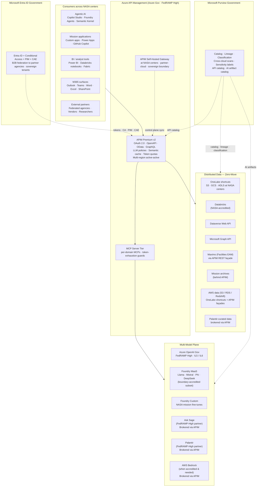
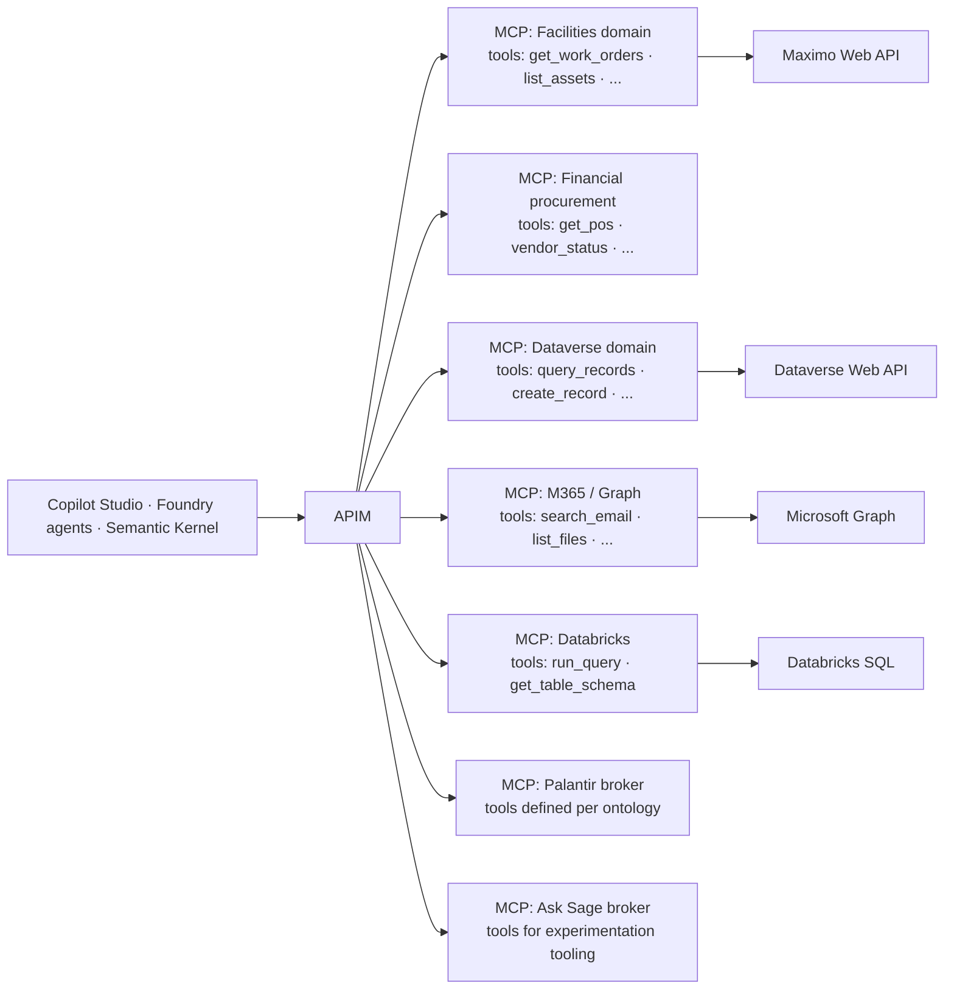
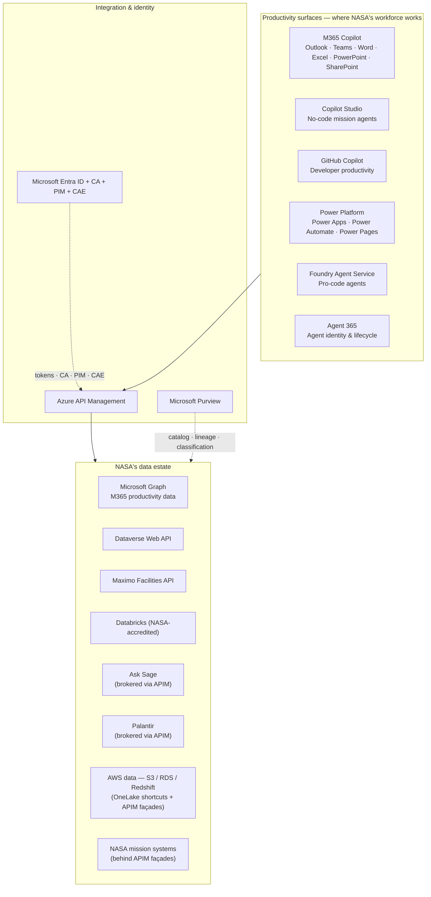
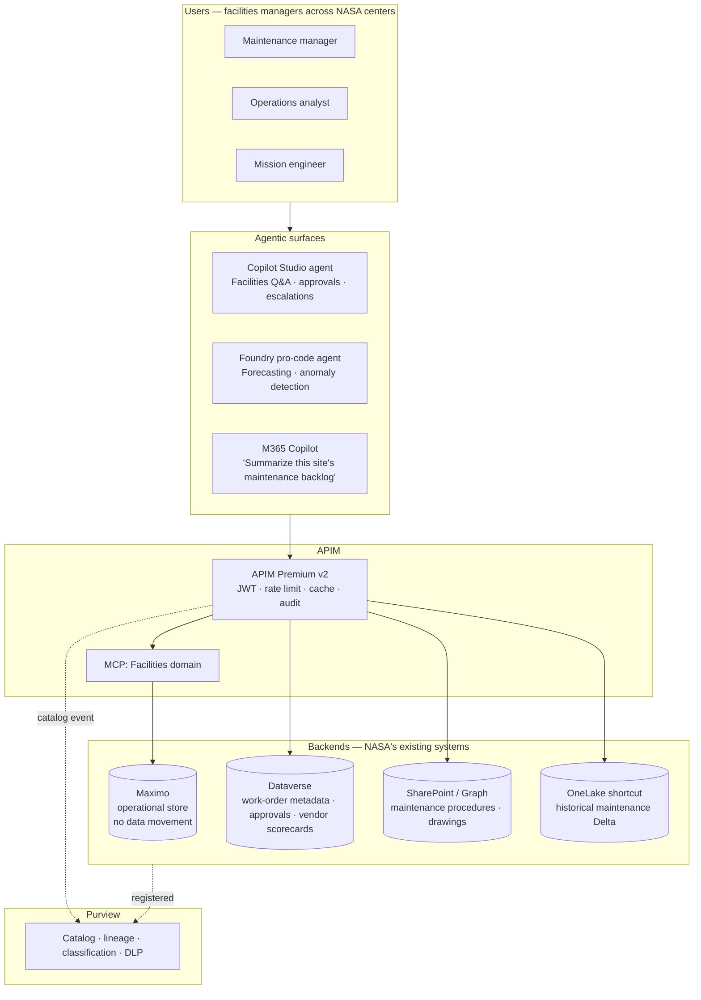
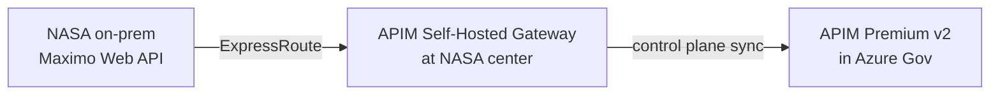
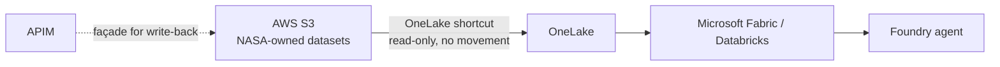

# NASA — API-First Multi-Model AI Ecosystem

## End-to-End Implementation with CSA-in-a-Box on Azure Government

> **The strategic frame.** NASA is not buying *one AI*. NASA is building an **AI ecosystem** across distributed centers, multiple model vendors, and a heterogeneous data estate that includes Databricks, Palantir, Ask Sage, AWS, MuleSoft, Dataverse, SharePoint, and decades of mission systems. Ecosystems generate four hard problems: **orchestration, governance, integration, lifecycle**. Microsoft is built to solve all four. This document is the complete, technically substantive plan for how CSA-in-a-Box delivers the API-first, multi-model, zero-move architecture NASA has already chosen — with **least burden** on the way NASA exists today.

---

## How to read this document

This is a **whitepaper-ready end-to-end implementation guide**. It mirrors the five-block briefing the field is preparing for, and goes further: every claim is paired with a concrete deployment step, every diagram is grounded in a Bicep / APIM-policy / KQL artifact in this repository, and every architectural assertion has a "least burden" callout describing what NASA does **not** have to change.

| Section | What it covers | Briefing block |
|---|---|---|
| 1. Strategic frame | "Ecosystem, not one AI"; the 4 durable-leverage categories | Frame |
| 2. NASA's 5 pillars — Microsoft mapped | One-to-one mapping with technical detail | Block 1 |
| 3. APIM as the enterprise gateway | Architecture, policies, vs MuleSoft, vs AWS | Block 2 |
| 4. Dataverse API deep dive | OData v4, `$metadata`, four auth patterns, working code | Block 3 |
| 5. Cross-platform integration — the connective tissue | Graph, Dataverse, Foundry, Copilot Studio, GitHub Copilot, MCP | Block 4 |
| 6. Facilities / Maximo first use case | End-to-end walkthrough, no data movement | Block 5 |
| 7. Financial procurement & enterprise catalog | Same pattern, next domain | Block 5 |
| 8. ITAR / FedRAMP High / IL5 / IL6 posture | Boundary handling, partner-product reciprocity | Specific req |
| 9. The 90-day implementation runbook | Subscription bootstrap → agent in production | Specific req |
| 10. "Least burden" — what NASA keeps | Co-existence pattern in detail | Specific req |
| 11. "Why APIM, not AWS or MuleSoft" — the honest answers | Technical comparison with concessions | Specific req |
| 12. Outcomes by quarter | Measurable deliverables; ROI math | Specific req |
| 13. Risk register and mitigation | What can go wrong; how we handle it | Whitepaper |
| 14. Appendix — every artifact this guide references | Direct links to Bicep, policies, samples | All |

---

## 1. The strategic frame — an ecosystem, not one AI

The foundational insight is that the most valuable position in NASA's AI strategy is not the model. It is the **secure interoperability layer** that connects the models, the data, the agents, the productivity surface, and the governance plane. That layer is where Microsoft compounds value.

The four ecosystem problems NASA is solving — exactly the four Microsoft is built to solve:

<div class="grid cards" markdown>

-   :material-graph-outline:{ .lg .middle } **Orchestration**

    ---

    Coordinating multiple models, multiple agents, and multi-step workflows across NASA's distributed centers — with consistent identity, cost governance, and observability.

-   :material-shield-check:{ .lg .middle } **Governance**

    ---

    Discovery, security, identity, retention, auditability, and compliance applied uniformly across data, APIs, models, and agents — including FedRAMP High and ITAR controls.

-   :material-vector-link:{ .lg .middle } **Integration**

    ---

    Standardized APIs that bind heterogeneous systems together — Azure, AWS, GCP, on-prem, mainframe, partner platforms (Databricks, Palantir, Ask Sage) — so NASA's ecosystem composes instead of fragments.

-   :material-refresh:{ .lg .middle } **Lifecycle**

    ---

    End-to-end management of models, agents, APIs, and data products — authoring through deployment through retirement, with versioning, rollback, evaluation, and chargeback.

</div>

Microsoft does not need to be the only AI in NASA's environment. Microsoft needs to be the layer that makes NASA's ecosystem work — and the layer that connects that ecosystem to where NASA's workforce actually does its job (Microsoft 365, Teams, Outlook, SharePoint, GitHub, Power Platform).

---

## 2. NASA's five pillars — mapped to Microsoft capabilities

NASA's published API-first AI strategy stands on five architectural pillars. Each maps one-to-one onto a Microsoft capability that is **already FedRAMP High accredited and available in Azure Government today**:

<div class="grid cards" markdown>

-   :material-numeric-1-circle:{ .lg .middle } **Multi-Model Future**

    ---

    NASA evaluates multiple AI systems simultaneously — not standardizing on one.

    **Microsoft answer:** Azure OpenAI (frontier), Foundry Models-as-a-Service (Llama, Mistral, Phi, DeepSeek), Foundry custom deployments (fine-tuned), plus **external models brokered via APIM** including AWS Bedrock and FedRAMP-High-accredited partner gateways.

-   :material-numeric-2-circle:{ .lg .middle } **Distributed Data**

    ---

    NASA data spans multiple centers, partner clouds, and mission systems — not a single repository.

    **Microsoft answer:** OneLake shortcuts to S3 / GCS / ADLS, APIM façades over on-prem and partner-cloud systems, Purview cross-cloud catalog and lineage, Azure Arc for cross-cloud management plane.

-   :material-numeric-3-circle:{ .lg .middle } **API-First Mandate**

    ---

    Everything must be machine-readable. RESTful API for all data and all systems.

    **Microsoft answer:** Azure API Management as the universal gateway; OpenAPI 3.x and OData v4 for every backend; Dataverse Web API with `$metadata` introspection; Graph API for M365; Data API Builder for SQL/Cosmos.

-   :material-numeric-4-circle:{ .lg .middle } **Zero-Move Data**

    ---

    Zero-move, zero-copy architecture — compute travels to data.

    **Microsoft answer:** OneLake shortcuts (no movement), APIM in-place façades, Synapse OPENROWSET, Power BI DirectQuery + Composite Models, Databricks Delta Sharing.

-   :material-numeric-5-circle:{ .lg .middle } **Interoperability**

    ---

    Strong emphasis on eliminating silos across the enterprise.

    **Microsoft answer:** One Entra ID identity plane, one APIM gateway, one Purview governance plane — across Azure, AWS, GCP, on-prem, sovereign boundaries, and SaaS.

</div>

This is the architecture NASA has already chosen. CSA-in-a-Box implements it.

---

## 3. Azure API Management as the NASA enterprise gateway

### 3.1 Why APIM for NASA specifically

NASA's gateway must:

1. Broker across Azure, AWS, GCP, Databricks, Palantir, Ask Sage, MuleSoft, and internal NASA mission systems
2. Run in FedRAMP High / IL5 (and select IL6) boundaries
3. Apply token management, rate limiting, chargeback / cost management, security policies, multi-backend routing, observability — for both classical and LLM workloads
4. Integrate natively with Microsoft 365 identity (Entra ID), M365 productivity surfaces (Graph), Dataverse, and Copilot Studio
5. Survive a technical review by a platform engineer writing requirements against vendors
6. Hold up through the whitepaper review chain

Every one of these requirements is in scope of APIM's native capabilities. The closest competitors — AWS API Gateway + adjacents, and MuleSoft Anypoint — solve a subset and require build-it for the rest. See [§11](#11-why-apim-not-aws-or-mulesoft--the-honest-answers) for the technical comparison.

### 3.2 NASA target gateway architecture



The architecture has three load-bearing seams:

1. **APIM is the integration seam** — one URL, one auth, one cost model, one observability surface, one catalog entry per API. NASA centers reach APIM via private endpoints and ExpressRoute; APIM reaches backends via the same mechanisms or through the self-hosted gateway at the edge.
2. **Entra is the trust fabric** — every API call carries an identity-grounded token, with Conditional Access, PIM, and Continuous Access Evaluation applied universally. Cross-tenant federation handles partner agencies and contractors.
3. **Purview is the governance plane** — APIs, data, AI artifacts all catalogued together, lineaged together, classified together.

### 3.3 APIM capabilities NASA gets out of the box

| Need | APIM mechanism | Already built into CSA-in-a-Box? |
|---|---|---|
| Token issuance & validation | Entra ID + `validate-jwt` policy + Conditional Access chain | Yes — see [`examples/apim-api-first-starter/`](https://github.com/fgarofalo56/csa-inabox/tree/main/examples/apim-api-first-starter) |
| Rate limiting | Per-subscription, per-IP, per-user, per-operation | Yes — `policies/global.xml` |
| LLM cost governance | `azure-openai-token-limit`, `emit-token-metric` | Yes — `policies/aoai-chat.xml` |
| Semantic caching | `azure-openai-semantic-cache-lookup` / `store` | Yes — `policies/aoai-chat.xml` |
| Content safety inline | `llm-content-safety` policy | Yes — pattern documented |
| Multi-backend routing | Backend pools with circuit breakers and priority | Yes — guide |
| Multi-cloud reach | Any HTTPS backend + self-hosted gateway | Yes — pattern documented |
| Observability | App Insights + Log Analytics + KQL — included | Yes — `bicep/modules/observability.bicep` |
| Sovereign coverage | APIM in Azure Gov / GCC High / IL5 / select IL6 | Yes — boundary table |

Every row is **available now**, not on roadmap. The CSA-in-a-Box Bicep starter deploys the full chain.

### 3.4 The layered MCP pattern behind APIM

NASA's pre-existing demo of layered MCP servers fronted by APIM, addressing token exhaustion and cost management, generalizes into the production pattern below. CSA-in-a-Box ships the policy chain and the MCP-server skeleton ready to apply per NASA domain.



APIM in front of every MCP server gives NASA:

- **Token-exhaustion guards.** One agent loop cannot drain the budget across multiple MCPs. `azure-openai-token-limit` per subscription enforces across all backends.
- **Per-tool authorization.** Entra scopes map to which MCP tools are reachable. An agent cannot enumerate tools it shouldn't see.
- **One observability lens.** Every tool call shows up in App Insights with consistent dimensions: agent identity, tool name, latency, token cost.
- **Per-MCP lifecycle without consumer churn.** Retiring or replacing one MCP server is a routing change in APIM, not an agent code change.
- **Inclusion in Purview catalog.** Each MCP-fronted API gets an entry with ownership, SLA, classification.

---

## 4. Dataverse as a first-class API surface — the must-win technical moment

### 4.1 The direct answer to "how would Dataverse be connected via REST?"

Dataverse exposes a fully **OData v4-compliant Web API**. In Azure Government and GCC High the endpoint is `https://{org}.api.crm.microsoftdynamics.us/api/data/v9.2/` (commercial endpoint differs; NASA's accredited boundary determines which).

| Operation | Method + path |
|---|---|
| List with filter / sort / projection | `GET /accounts?$select=name,revenue&$filter=statecode eq 0&$orderby=revenue desc&$top=50` |
| Retrieve one | `GET /accounts({id})` |
| Create | `POST /accounts` + JSON body |
| Update | `PATCH /accounts({id})` |
| Delete | `DELETE /accounts({id})` |
| Bound action | `POST /accounts({id})/Microsoft.Dynamics.CRM.Merge` |
| Custom API (NASA-authored) | `POST /nasa_RecalculateMissionStandings` |
| Batch (transactional) | `POST /$batch` |
| Change-tracking | `GET /accounts?$select=...&$deltatoken=...` |

### 4.2 The direct answer to "how do you know what's in the API?"

Every Dataverse environment exposes a **fully introspectable schema document**. This is the section that wins technical credibility.

```http
GET https://{org}.api.crm.microsoftdynamics.us/api/data/v9.2/$metadata
Authorization: Bearer {token}
Accept: application/xml
```

Returns the **Common Schema Definition Language (CSDL)** XML — an automatically generated, always-current manifest of every entity, attribute, choice set, relationship, function, and action available in the environment. This is the OData equivalent of OpenAPI / Swagger.

Beyond the static CSDL, Dataverse exposes a typed **Metadata Web API**:

```http
# Enumerate every entity
GET /api/data/v9.2/EntityDefinitions
  ?$select=LogicalName,DisplayName,EntitySetName,IsCustomEntity,PrimaryIdAttribute

# Attributes for one entity
GET /api/data/v9.2/EntityDefinitions(LogicalName='account')/Attributes
  ?$select=LogicalName,AttributeType,DisplayName,RequiredLevel,MaxLength

# Picklist options for one attribute
GET /api/data/v9.2/EntityDefinitions(LogicalName='account')/Attributes(LogicalName='industrycode')
  /Microsoft.Dynamics.CRM.PicklistAttributeMetadata?$expand=OptionSet

# Relationships
GET /api/data/v9.2/RelationshipDefinitions
```

A consuming application — a Databricks notebook, a Foundry agent, a Power Automate flow, a mainframe Java program — can **discover every table, every column, every relationship, every option label at runtime**. Nothing about the Dataverse API surface is hidden. This is what makes Dataverse a first-class participant in NASA's API-first catalog.

### 4.3 Working example — Databricks reading Dataverse from inside NASA's Azure Gov tenant

```python
# Runs in a Databricks notebook in the same Azure Gov tenant as Dataverse
from azure.identity import ManagedIdentityCredential
import httpx, pandas as pd

DV_RESOURCE = "https://nasa-org.api.crm.microsoftdynamics.us"  # Gov endpoint
DV_URL = f"{DV_RESOURCE}/api/data/v9.2/contoso_workorders"     # example entity

cred = ManagedIdentityCredential()  # cluster's assigned identity
token = cred.get_token(f"{DV_RESOURCE}/.default").token

headers = {
    "Authorization": f"Bearer {token}",
    "OData-MaxVersion": "4.0",
    "OData-Version": "4.0",
    "Accept": "application/json",
    "Prefer": 'odata.include-annotations="*"',
}
params = {
    "$select": "contoso_assetid,contoso_status,contoso_priority,modifiedon",
    "$filter": "contoso_status eq 100000000",  # open
    "$orderby": "modifiedon desc",
    "$top": 5000,
}

rows = []
url = DV_URL
with httpx.Client(timeout=60) as client:
    while url:
        r = client.get(url, params=params if url == DV_URL else None, headers=headers)
        r.raise_for_status()
        b = r.json()
        rows.extend(b["value"])
        url = b.get("@odata.nextLink")

# Land in bronze as Delta. Dataverse remains the system of record.
spark.createDataFrame(pd.DataFrame(rows)) \
     .write.format("delta").mode("overwrite").saveAsTable("bronze.dataverse_workorders")
```

Properties:

1. **Zero data movement.** Data lives in Dataverse. Databricks reads on demand.
2. **No secrets.** Managed identity issues the token; the Databricks identity is the principal in Dataverse audit logs.
3. **Identity carried through.** End-to-end attribution from Databricks user → cluster identity → Dataverse audit.

The same pattern works from a Foundry agent, an Azure Function with managed identity, a Power Automate flow with delegated auth, a mainframe job with a service principal certificate, or any HTTPS-capable system.

### 4.4 Dataverse in NASA's enterprise catalog

The vision of "Dataverse, SharePoint Lists, API/Connector-based access" maps cleanly onto a unified API catalog. In a mature catalog, Dataverse is one of several endpoint patterns:

| Endpoint pattern | When to use |
|---|---|
| **Dataverse Web API** | Structured, transactional, user-curated business data with rich security |
| **Microsoft Graph API** | M365 content — mail, sites, files, Teams, calendar, people |
| **Data API Builder** | Arbitrary SQL or Cosmos backends exposed as REST + GraphQL |
| **OneLake SQL endpoint** | Warehouse / lakehouse queries |
| **Bring-your-own REST behind APIM** | Maximo, mission systems, mainframes, Palantir, Ask Sage |

All five flow through APIM. All five inherit the same identity model, rate limits, observability, Purview catalog entry, sensitivity labels, and lineage.

Detailed reference: [Use case — Dataverse API integration](./dataverse-api-integration.md).

---

## 5. Cross-platform integration — Microsoft as NASA's connective tissue

### 5.1 The Frontier story

NASA's environment includes Microsoft (M365, Power Platform, Dataverse, SharePoint, GitHub, Azure), partners (Databricks, Palantir, Ask Sage), the wider clouds (AWS, GCP), and decades of internal mission systems. The Microsoft asymmetry: **only Microsoft owns both the integration plane and the productivity plane in one identity graph**.



### 5.2 Why this differentiates from a Gemini / SharePoint Online narrative

Gemini's positioning is that it integrates with SharePoint Online. That is one productivity surface, with one connector pattern, in one identity graph.

Microsoft integrates across the **entire enterprise platform**, all in one identity graph that NASA already operates:

| Surface | What it consumes | Why it matters for NASA |
|---|---|---|
| M365 Copilot | Graph (mail, files, sites, Teams, calendar) | NASA's workforce already lives here |
| Copilot Studio | APIM, Dataverse, Power connectors, MCP | Mission teams build agents without standing up dev infra |
| GitHub Copilot | Code, repos, custom skills | NASA engineering productivity in same identity graph |
| Power Platform | Dataverse + 1,400+ connectors | Citizen developers wire missions into business workflows |
| Sales / Service / Finance Copilots | Dynamics + Graph | Role-specific copilots over NASA business systems |
| Foundry Agent Service | MCP, OpenAPI tools, Foundry models | Pro-code agents with enterprise governance |
| Agent 365 | Cross-tenant agent identity & lifecycle | The control plane for an agent estate |

A competing AI-first strategy that reaches as far as the API leaves NASA's most valuable surfaces — the desks, inboxes, and IDEs where mission work actually happens — uncovered.

---

## 6. Facilities / Maximo — the first end-to-end use case

NASA's first enterprise use case is **Facilities (Maximo datasets)**. The pattern documented here applies one-for-one to **financial procurement** (the second use case) and to any subsequent enterprise domain.

### 6.1 The architecture for the facilities use case



Three properties define the use case:

1. **Maximo data does not move.** APIM proxies live calls; OneLake shortcut + cached aggregations handle the read-heavy tail.
2. **One identity model.** Every consumer authenticates against Entra. The Maximo system either trusts APIM via mTLS / IP allowlist, or the user identity passes through.
3. **One catalog.** Purview registers Maximo endpoints alongside Dataverse, SharePoint, OneLake shortcuts, and Databricks tables.

### 6.2 The Maximo REST surface, normalized by APIM

The Maximo native API differs by version. APIM normalizes the surface to a stable OpenAPI 3.x contract:

| Resource | Operations |
|---|---|
| `/facilities/sites` | List, retrieve by ID, filter by center / region |
| `/facilities/buildings/{id}` | Retrieve; expand children |
| `/facilities/assets/{id}` | Retrieve; lifecycle data |
| `/facilities/work-orders` | List (filter), create, update |
| `/facilities/work-orders/{id}/history` | Retrieve timeline |
| `/facilities/maintenance-events` | List paged |
| `/facilities/parts-inventory` | Read; partial-update stock levels |
| `/facilities/cost-codes` | Read |
| `/facilities/preventive-maintenance/schedules` | List, create |

OpenAPI spec is published, importable by Power Automate / Copilot Studio / Foundry / any HTTPS consumer, and registered in Purview.

### 6.3 Sample agent interaction (Copilot Studio)

A maintenance manager asks the Copilot Studio facilities agent in Teams:

> *"What is the open work-order backlog at the launch complex by priority, and which buildings have preventive maintenance overdue more than 30 days?"*

What happens:

1. Agent receives user message in Teams; user's Entra token is bound to the request
2. Agent calls APIM's facilities MCP with the user's delegated token
3. APIM validates JWT, applies Conditional Access (device compliance, location), rate-limits per the user's subscription, checks semantic cache for similar recent question, applies content safety to the prompt
4. APIM forwards to the MCP server's `get_work_orders` and `get_overdue_pm` tools
5. MCP server calls Maximo Web API for live work-order data; calls OneLake shortcut for historical PM data
6. Results return to MCP, to APIM, to AOAI for natural-language synthesis (with token-budget enforcement), back to APIM, back to agent
7. Agent presents the answer in Teams; cites the underlying data products
8. The whole transaction is logged to App Insights with subscription / user / tool / cost dimensions; lineage entry written to Purview

The data never left Maximo. The user never re-authenticated. The cost is attributable to the right NASA center. The audit trail is end-to-end.

### 6.4 What this delivers in the first 6 months

| Month | Outcome |
|---|---|
| 1 | APIM Premium v2 deployed in Azure Gov; Entra integration; first Maximo endpoint live behind APIM; OpenAPI in Purview |
| 2 | Read-only Copilot Studio agent live for facilities managers in two NASA centers; user testing |
| 3 | Cache hit rate > 60% on read traffic; rate limiting prevents noisy-neighbor incidents; Maximo backend load measurably reduced |
| 4 | Write-back via PATCH live, with Power Automate approval flow; agent handles work-order escalations |
| 5 | Cross-system join (Maximo + Dataverse + SharePoint + weather) demonstrated; rollout to remaining NASA centers |
| 6 | Financial procurement domain follows the same pattern; second agent in production |

---

## 7. Financial procurement and the enterprise catalog buildout

Once the facilities pattern works, **financial procurement** is the next use case. The shape is identical; the domain changes.

| Element | Facilities | Financial procurement |
|---|---|---|
| System of record | Maximo | NASA procurement / ERP |
| API surface | `/sites`, `/work-orders`, `/assets` | `/purchase-orders`, `/vendors`, `/invoices`, `/contracts` |
| Identity | Entra | Entra |
| Gateway | APIM | APIM |
| MCP server | `mcp-facilities-domain` | `mcp-procurement-domain` |
| Catalog | Purview | Purview |
| AI consumer | Maintenance Copilot Studio agent | Procurement Copilot Studio agent |
| Enrichment | Dataverse + Graph + OneLake + weather | Dataverse + Graph + OneLake + vendor data + market data |

Same architecture, different domain. The enterprise catalog accretes endpoint by endpoint. After four enterprise use cases (the Use Case Delivery Manager's standing count), NASA has a working API-first catalog with four governed domains, four AI agents, and consistent identity / governance / cost / observability across all of them.

---

## 8. ITAR / FedRAMP High / IL5 / IL6 — the boundary handling

The Chief Data and AI Officer's mandate that "everything is high" maps onto Azure boundaries cleanly.

### 8.1 Boundary coverage matrix

| Boundary | NASA fit | Services available |
|---|---|---|
| **Azure Commercial** | Not the default for NASA mission workloads | All services |
| **Azure Government (GCC)** | FedRAMP Moderate NASA workloads | APIM, AOAI, Foundry (subset), Dataverse, Graph, Purview, Databricks |
| **Azure Government (GCC High / FedRAMP High)** | **Default for most NASA mission AI** | APIM, AOAI (most models), Foundry (subset), Dataverse (GCC High), Graph (GCC High), Purview, Databricks |
| **DoD IL5** | Mission-specific NASA workloads where applicable | APIM, AOAI (subset), Dataverse, Databricks |
| **DoD IL6** | Classified workloads where authorized | APIM, select AOAI deployments, sovereign Foundry path |

The architecture deploys identically across boundaries. Bicep templates parameterize the cloud environment. Same APIM policies, same Entra patterns, same Purview registrations.

### 8.2 FedRAMP High reciprocity on partner products

Three partner products have FedRAMP High reciprocity NASA has accepted. APIM is the integration seam that brokers between them without crossing accreditation lines:

| Partner product | NASA role | Integration through APIM |
|---|---|---|
| **Ask Sage** | Lightweight gateway to models; experimentation tooling | APIM brokers Ask Sage as one of the model backends; consumers see Ask Sage as one endpoint among many |
| **Palantir** | Operational data fabric and ontology | APIM brokers Palantir-curated data products; Palantir endpoints participate in Purview catalog |
| **Databricks (FedRAMP High)** | Spark / ML / Unity Catalog | Direct via Azure Databricks; APIM façades over Databricks SQL endpoints when needed for consistent gateway treatment |

This positions Microsoft to **operationalize AI at scale** while Ask Sage continues to serve its strength (lightweight experimentation) and Palantir continues its (operational intelligence). No partner is displaced; the gateway is the seam.

### 8.3 ITAR-specific controls

| Control | Mechanism |
|---|---|
| ITAR data residency | Data stays in GCC High / IL5 / IL6 — never crosses to commercial |
| ITAR-cleared access | Conditional Access policy includes membership in ITAR-cleared user group; PIM for elevated access |
| Sensitivity labels | MIP labels classify ITAR-controlled data; APIM enforces no-egress-outside-boundary via label-aware policy |
| Audit | Log Analytics with immutable retention; tamper-evident with customer-managed keys |
| Cross-boundary federation | Entra B2B with cross-tenant access settings; never network bridges |

### 8.4 Concrete answer for the boundary question

> *"How do APIM, Dataverse, and AI services operate within Azure Government, GCC High, and FedRAMP High?"*

**APIM:** GA in Azure Government and GCC High; FedRAMP High accredited; self-hosted gateway runs inside any boundary.

**Dataverse:** GA in GCC and GCC High; full Web API and `$metadata` introspection available; identical contract to commercial.

**Microsoft Graph:** GA in GCC and GCC High; some preview surfaces lag commercial by quarters but the core Graph (Outlook, SharePoint, Teams, OneDrive, calendar, people) is fully available.

**Azure OpenAI:** GA in Azure Government; subset of frontier models (GPT-4o, GPT-4.1, o-series most current) accredited; model availability expands quarterly.

**Foundry MaaS:** GA in Azure Government with a curated subset of open-weight models; expanding.

**Foundry custom deployments:** GA in Azure Government for FedRAMP-High-accredited foundation models; private compute available.

**Purview:** GA in Azure Government; cross-cloud scans operate from inside the boundary.

**Databricks:** Azure Databricks GA in Azure Government / GCC High; FedRAMP High accredited.

**Copilot Studio:** GA in GCC and GCC High; connector catalog narrower than commercial but covers Power Platform connectors and custom OpenAPI connectors.

**M365 Copilot:** GA in GCC High; coverage continues to expand.

---

## 9. The 90-day implementation runbook

This is the end-to-end runbook from a clean Azure Government subscription to a working facilities Copilot Studio agent in production. Every step references a Bicep template, an APIM policy, or a documented procedure in CSA-in-a-Box.

### 9.1 Week 0 — Pre-deployment alignment

| Day | Activity | Output |
|---|---|---|
| -7 | Identify the Azure Government subscription(s) for the API-first foundation | Subscription IDs, naming conventions |
| -6 | Confirm Entra ID Government tenant + cross-tenant settings for partner agencies | Tenant ID, federation plan |
| -5 | Confirm ExpressRoute from at least one NASA center to Azure Gov | Circuit ID, peering plan |
| -4 | Confirm Purview Government account ownership and scope | Purview account name |
| -3 | Inventory the first Maximo instance to expose — URL, version, auth | OpenAPI draft of facilities endpoints |
| -2 | Identify the first Copilot Studio environment and pilot user group | Environment, user list |
| -1 | Sign off the deployment plan with the Senior Technical Principal | Approval to proceed |

### 9.2 Week 1 — Foundation deployment

Stand up the API-first foundation in Azure Government using the CSA-in-a-Box Bicep starter.

```bash
# Sign in to Azure Government
az cloud set --name AzureUSGovernment
az login
az account set --subscription "<subscription-id>"

# Resource group
az group create --name rg-apifirst-foundation --location usgovvirginia

# Deploy the API-first foundation (Bicep starter)
az deployment group create \
  --resource-group rg-apifirst-foundation \
  --template-file examples/apim-api-first-starter/bicep/main.bicep \
  --parameters \
      apimPublisherEmail="apifirst-admin@your-tenant.onmicrosoft.us" \
      apimPublisherName="NASA API-First Platform" \
      apimSku="PremiumV2" \
      apimCapacity=2 \
      deployOpenAi=true \
      deploySampleBackend=false
```

What this deploys:

| Resource | Configuration |
|---|---|
| APIM Premium v2 | Two capacity units; VNet-integrated; AZ-resilient |
| Log Analytics workspace | 30-day retention; PerGB2018; query access via Entra |
| Application Insights | Workspace-based; full telemetry from APIM |
| Azure Key Vault | RBAC-authorized; managed identity binding |
| User-assigned managed identity | For APIM → backend calls |
| Azure OpenAI account | Two deployments: `gpt-4o-mini` chat + `text-embedding-3-small` for semantic cache |
| APIM `aoai-chat` API | Wired to AOAI with full LLM policy bundle |
| APIM global policy | CORS, default rate limit, correlation IDs |
| Role assignment | APIM → AOAI `Cognitive Services OpenAI User` |
| App Insights logger | All APIM diagnostics flowing to App Insights |

**Output:** A FedRAMP-High-deployable foundation in 30 minutes. The published Bicep is in [`examples/apim-api-first-starter/`](https://github.com/fgarofalo56/csa-inabox/tree/main/examples/apim-api-first-starter).

### 9.3 Week 2 — Network hardening and self-hosted gateway

```bash
# Hub VNet + private endpoints for APIM, Key Vault, AOAI
# (Production deployment beyond the starter — pattern documented in
#  docs/guides/apim-universal-gateway.md "Network topology" section)

# Self-hosted gateway for NASA center edge deployments
helm install nasa-apim-gateway azure-marketplace/azure-api-management-gateway \
  --namespace nasa-apim \
  --create-namespace \
  --set gateway.configuration.uri=https://<apim>.management.azure-api.us \
  --set gateway.auth.token=<token>
```

Self-hosted gateways deploy as Docker containers or in AKS at each NASA center. The data plane runs inside the center; the control plane (configuration, developer portal, policies) stays in Azure Gov APIM.

### 9.4 Week 3 — Identity and Conditional Access

Configure Entra ID Government for the API-first foundation:

| Step | Action |
|---|---|
| 1 | Register the API as an Entra application; define scopes (`Facilities.Read`, `Facilities.Write`, `Procurement.Read`, etc.) |
| 2 | Configure consent for the application |
| 3 | Author Conditional Access policy on the application: compliant device + MFA + non-high-risk |
| 4 | Enable Continuous Access Evaluation (CAE) for revocation propagation |
| 5 | Configure PIM for elevated scopes (`*.Write`, `*.Admin`) |
| 6 | Configure cross-tenant access settings for partner agencies / contractors via Entra B2B |
| 7 | Configure managed identities for Azure-hosted callers (Foundry, Functions, Container Apps, Databricks) |

### 9.5 Week 4 — Purview catalog setup

```bash
# Register data sources in Purview Government
# (Run from a session with Purview Data Source Admin role)

# APIM as a catalog source
az purview source create --name apim-prod \
  --type ApiManagementService \
  --properties endpoint="<apim>.azure-api.us"

# Dataverse via Power Platform connector
# (Done in Purview Portal: register Power Platform connector)

# Maximo via custom REST source
# (Pattern: register as a REST source pointing at the APIM-fronted endpoint)

# Databricks workspace
az purview source create --name databricks-nasa-east \
  --type AzureDatabricks \
  --properties endpoint="<databricks-workspace>.azuredatabricks.net"

# AWS S3 (via cross-cloud scan)
# (Done in Purview Portal: register AWS S3 source; supply role assumption details)
```

Each source gets scanned on a schedule. Sensitivity labels propagate from MIP. Lineage is captured automatically for ADF / Synapse / Fabric flows; manually annotated for custom REST.

### 9.6 Week 5 — Maximo backend onboarding (the first business endpoint)



1. **Document Maximo's current REST surface** as OpenAPI 3.x. Where Maximo's native API differs from desired contract, normalize at APIM via `set-body`, `set-header`, transformation policies.
2. **Import OpenAPI** into APIM: `az apim api import --service-name <apim> --api-id facilities-maximo --specification-format OpenApi --specification-path facilities-maximo.openapi.yaml --path facilities`
3. **Apply the API policy chain**: JWT validation, rate limiting, cache, audit, sensitivity-label header enforcement (see [`docs/guides/apim-universal-gateway.md`](../guides/apim-universal-gateway.md) for the full policy library).
4. **Configure backend** with mTLS to the self-hosted gateway inside the NASA center boundary.
5. **Register in Purview** as a catalog entry: owner, SLA, classification, lineage.
6. **Subscribe pilot consumer applications**: assign subscription keys; configure Conditional Access on the application.

### 9.7 Week 6 — MCP server tier for the facilities domain

Deploy the facilities MCP server as a Container App or AKS workload (CSA-in-a-Box ships the skeleton):

```python
# Adapted from examples/apim-api-first-starter/samples/mcp/mcp-server-skeleton.py
from mcp.server.fastmcp import FastMCP
from azure.identity import ManagedIdentityCredential
import httpx, os

app = FastMCP("nasa-facilities", version="1.0.0")
EAM_BASE = os.environ["EAM_API_BASE"]
cred = ManagedIdentityCredential()

@app.tool()
async def get_work_orders(site: str | None = None, status: str | None = None,
                          priority: str | None = None, limit: int = 50) -> list[dict]:
    token = cred.get_token(EAM_BASE + "/.default").token
    headers = {"Authorization": f"Bearer {token}"}
    params = {"limit": str(limit)}
    for k, v in [("site", site), ("status", status), ("priority", priority)]:
        if v: params[k] = v
    async with httpx.AsyncClient(timeout=30) as client:
        r = await client.get(f"{EAM_BASE}/work-orders", params=params, headers=headers)
        r.raise_for_status()
        return r.json()["value"]

@app.tool()
async def get_overdue_preventive_maintenance(threshold_days: int = 30) -> list[dict]:
    token = cred.get_token(EAM_BASE + "/.default").token
    headers = {"Authorization": f"Bearer {token}"}
    async with httpx.AsyncClient(timeout=30) as client:
        r = await client.get(f"{EAM_BASE}/preventive-maintenance/overdue?days={threshold_days}",
                             headers=headers)
        r.raise_for_status()
        return r.json()["value"]

if __name__ == "__main__":
    app.run()
```

Deploy as a Container App in a private VNet; expose only to APIM via private link. APIM fronts the MCP endpoint with the full policy chain — including `azure-openai-token-limit` for shared budget enforcement across all MCP servers behind APIM.

### 9.8 Week 7 — Cost governance and chargeback

Configure the AI Chargeback Dashboard in App Insights / Power BI:

```kql
// Tokens consumed by NASA center per day
customMetrics
| where name == "Total tokens"
| extend center = tostring(customDimensions["subscription-id"])
| extend model = tostring(customDimensions["model-id"])
| extend api  = tostring(customDimensions["api-name"])
| summarize tokens = sum(value), cost_estimate = sum(value) * 0.000015  // adjust per model rate
        by center, model, api, bin(timestamp, 1d)
| render columnchart
```

Set Azure Monitor alerts on:

- Per-subscription token budget at 80% of monthly cap
- Sustained `429` rate above 5% over 15 minutes
- Backend ejection from APIM circuit breaker
- Auth failures spike above baseline

### 9.9 Week 8 — Copilot Studio facilities agent

| Step | Action |
|---|---|
| 1 | Create / select a Copilot Studio Government environment |
| 2 | Add the APIM-fronted Maximo OpenAPI as a custom connector |
| 3 | Configure delegated user authentication on the connector |
| 4 | Author the agent: facilities backlog Q&A, overdue PM detection, work-order escalation |
| 5 | Test with Power Platform Government environment; iterate prompts |
| 6 | Publish to a pilot group of facilities managers in two NASA centers |
| 7 | Surface in Teams; capture user feedback |

### 9.10 Week 9–10 — Second domain: Dataverse-grounded enterprise catalog

Repeat the pattern for the financial procurement domain:

- Onboard NASA procurement system as an APIM backend
- Stand up `mcp-procurement-domain` MCP server
- Register endpoints in Purview
- Build the procurement Copilot Studio agent

### 9.11 Week 11 — Cross-cloud reach (OneLake shortcuts to AWS data)



Configure OneLake shortcuts to NASA-owned AWS S3 buckets that contain mission datasets. Data stays in S3; Fabric / Databricks query in place. APIM façades cover RDS / Redshift access for transactional surfaces.

### 9.12 Week 12 — Whitepaper finalization and review chain

Produce the whitepaper deliverable for the review chain (Senior Technical Principal → Center-level review → Headquarters review → Administration). The structure of this document is engineered to be that deliverable with minimal edits.

---

## 10. "Least burden" — what NASA does not have to change

This is the architectural property the Senior Technical Principal explicitly requires. The matrix:

| Existing investment | What stays | What integrates |
|---|---|---|
| **AWS footprint** | All AWS data stays in S3 / Redshift / RDS / DynamoDB | OneLake shortcuts + APIM façades; cross-cloud Purview catalog |
| **Databricks workspaces** | All NASA Databricks workspaces stay | Unity Catalog federates; Delta Sharing publishes datasets cross-org |
| **Palantir** | Palantir operational fabric stays | Brokered via APIM; Palantir endpoints participate in Purview catalog |
| **Ask Sage** | Ask Sage stays as a lightweight model gateway | Brokered via APIM; APIM provides the operationalization layer Ask Sage doesn't |
| **MuleSoft (where deployed)** | Co-exists for the life of current contracts | New APIs route through APIM; old APIs strangled over time |
| **AWS API Gateway (where deployed)** | Co-exists; AWS-internal API consumers retained | New AI workloads on APIM; selective backend re-routing through APIM façades |
| **Maximo and mission systems** | Stay in place — no migration required | APIM REST façade exposes them as machine-readable endpoints |
| **SharePoint / M365** | Stays as the productivity surface | Graph API exposes content; M365 Copilot consumes through the same identity |
| **Dataverse / Power Platform** | Stays as the business application platform | Dataverse Web API + Power Platform connectors |
| **Existing IdPs at NASA centers** | Stay as identity sources | Federated to Entra Government via B2B / cross-tenant |
| **Existing dashboards** | Continue working | Either pointed at APIM (new front door) or left direct |
| **Existing FedRAMP authorizations** | Honored | New components deployed only in already-authorized boundaries |

**Nothing existing breaks. New value is layered on existing investments. The architecture is additive, not subtractive.** That is the contract.

---

## 11. Why APIM, not AWS or MuleSoft — the honest answers

The Platform Engineer who writes vendor requirements will test these claims. The answers below are technical, honest, and concede where competitors have a real advantage.

### 11.1 Why APIM over AWS API Gateway

| Capability | AWS API Gateway | APIM | Net to NASA |
|---|---|---|---|
| LLM-specific policies (token quota, semantic cache, content safety, emit-token-metric) | **None native** — build with Lambda + DynamoDB + OpenSearch + custom logic | **Native** — XML policy chain | APIM wins decisively; this is the single biggest gap |
| JWT validation | Lambda authorizer (30–80 ms cold start + per-invocation cost + cache management) | In-process policy | APIM lower latency, lower cost |
| Multi-cloud backends | Cross-cloud requires VPC peering + NAT + Direct Connect + custom IAM | Any HTTPS backend is a first-class citizen | APIM cleaner for NASA's multi-cloud reality |
| Developer portal | None native — bring your own | Built-in customizable portal | APIM ships what NASA needs |
| Self-hosted gateway for edge | None | Yes — single container, runs anywhere | APIM critical for NASA centers |
| FedRAMP High | Available in GovCloud | Available in Azure Gov | Parity |
| Multi-region active-active | Custom (Route 53 + WAF + replication) | Native Premium v2 | APIM simpler |
| Honest AWS concession | AWS has decade-long operational maturity in some compute / storage edge cases | — | True but not decisive for the gateway decision |

### 11.2 Why APIM over MuleSoft Anypoint Platform

| Capability | MuleSoft Anypoint | APIM | Net to NASA |
|---|---|---|---|
| LLM-specific policies | **None native** at the gateway layer | **Native** | APIM wins on AI workloads |
| Licensing cost | Per-core, per-environment; typically $$$$$ | Premium v2 capacity-priced, fraction of MuleSoft cost | Material TCO delta |
| M365 / Graph / Dataverse / Copilot Studio integration | None native | Native and deep | APIM wins on productivity reach |
| Premium connectors (SAP, mainframe, etc.) | Individually licensed | Logic Apps connectors included or per-execution | Cost delta compounds |
| Developer portal (Anypoint Exchange) | **Strong — best in market** | Good, customizable | **MuleSoft concession** — APIM ships what NASA needs, but Anypoint Exchange's UX is better in mature estates |
| DataWeave transformation DSL | **Strong — proprietary but expressive** | Multi-product (APIM policies + Logic Apps + Functions + dbt) | **MuleSoft concession** for complex schema mediation; APIM approach is more portable and open |
| FedRAMP High | Available | Available | Parity |
| Native MCP support | None | First-class | APIM wins on agentic AI |

NASA's gateway decision should weight: AI gateway features, cost, M365 / Copilot reach, native FedRAMP-High coverage. On all four, APIM wins. The Anypoint Exchange UX and DataWeave concessions are real but do not offset the structural advantages.

Detailed comparisons: [Azure vs MuleSoft Anypoint Platform](../comparison/azure-vs-mulesoft.md) and [Azure vs AWS API Stack](../comparison/azure-vs-aws-api-stack.md).

---

## 12. Outcomes by quarter — measurable, not aspirational

### 12.1 Quarter 1 (Days 1–90)

| Deliverable | Measurable evidence |
|---|---|
| API-first foundation in Azure Gov | Bicep deployment in CI; APIM endpoint resolving |
| First Maximo endpoint live | OpenAPI in APIM; Purview catalog entry |
| Conditional Access on API resource | Policy ID and assignment; CAE-capable token issued |
| First Copilot Studio facilities agent | Pilot users using it daily in two NASA centers |
| Per-subscription token budget | Demonstrable 429 on simulated budget exhaustion |
| Semantic cache hit rate | > 30% on representative facilities traffic |
| Chargeback dashboard | Per-center, per-model, per-API cost report |
| Cross-system join | Maximo + Dataverse + SharePoint join demonstrated |

### 12.2 Quarter 2 (Days 91–180)

| Deliverable | Measurable evidence |
|---|---|
| Financial procurement domain live | Second MCP, second agent, second Purview-catalogued surface |
| OneLake shortcuts to NASA AWS data | Cross-cloud query without movement; Purview lineage |
| MuleSoft co-existence | Strangler-fig migration plan in motion; one MuleSoft API retired |
| Cross-tenant federation to one partner agency | Entra B2B + APIM-to-APIM trust |
| Self-hosted gateway at three NASA centers | Container deployments, traffic flowing |

### 12.3 Quarter 3–4 (Days 181–365)

| Deliverable | Measurable evidence |
|---|---|
| Four enterprise use cases catalogued | Per the Use Case Delivery Manager's standing count |
| Multi-region active-active | Failover drill executed; RTO under target |
| Foundry MaaS in production | Second model family routing live; cost delta vs single-model documented |
| External model brokering | Ask Sage + Palantir + Bedrock brokered via APIM; consistent contract |
| Whitepaper through review chain | Approved through all levels |

### 12.4 ROI framing

Quantifiable savings compared to incumbents:

| Line item | Conservative annual savings |
|---|---|
| MuleSoft license avoidance for new APIs | $500K–$2M per scaled environment |
| AWS API Gateway + Lambda authorizer + custom AI gateway build vs APIM | $250K–$800K |
| Semantic cache on LLM workloads | 30–70% reduction in token spend (workload-specific) |
| Connector licenses (SAP, mainframe, EAM) — Logic Apps replaces Anypoint premium connectors | $100K–$500K |
| Observability — App Insights / Log Analytics included vs paid APM | $50K–$200K |

These are conservative ranges. NASA-specific TCO modeling done during Q1 will tighten the numbers.

---

## 13. Risk register and mitigation

| Risk | Likelihood | Impact | Mitigation |
|---|---|---|---|
| Maximo API surface differs more than expected from desired OpenAPI | Medium | Medium | APIM normalization policies absorb the delta; back-channel via Logic Apps for the rare case |
| Self-hosted gateway connectivity issues at a NASA center | Medium | Medium | Documented playbook; control plane resilience; engineering escalation path |
| Quota / capacity on AOAI in Azure Gov | Medium | High | Multi-region backend pool; quota requests filed early; Foundry MaaS fallback |
| MuleSoft incumbents resist co-existence | Low | Medium | Strangler-fig migration; preserve MuleSoft for current contracts; APIM only for new AI workloads initially |
| Partner-product accreditation changes | Low | Medium | APIM brokering means partner products can be swapped without consumer change |
| FedRAMP authorization gap for a new service | Low | High | Defer service introduction; use accredited equivalent (e.g., Foundry MaaS subset before full GA) |
| Sensitive-data egress incident | Low | High | Sensitivity labels + Purview DLP + APIM policy enforcement; immutable audit; quarterly tabletop exercises |
| Agent prompt-injection or data-exfiltration | Medium | High | `llm-content-safety` policy + Azure AI Prompt Shields + agent eval pipeline + scope-bound MCP tools |
| Cost overrun on LLM tokens | Medium | Medium | Per-subscription token budget enforcement; semantic cache; chargeback visibility |
| Whitepaper review chain delay | Medium | Low | Document is structured for direct repurpose; technical content is review-ready |

---

## 14. Appendix — every artifact this guide references

### Foundation

- [APIM API-First Starter (Bicep + policies)](https://github.com/fgarofalo56/csa-inabox/tree/main/examples/apim-api-first-starter)
- [Reference architecture — API-first multi-model ecosystem](../reference-architecture/api-first-multi-model-ecosystem.md)
- [ADR-0025 — APIM as the integration fabric](../adr/0025-apim-as-integration-fabric.md)

### Strategic / whitepaper-ready

- [Whitepaper — API-first data strategy on Azure](../research/api-first-data-strategy-whitepaper.md)
- [Comparison — Azure vs MuleSoft Anypoint Platform](../comparison/azure-vs-mulesoft.md)
- [Comparison — Azure vs AWS API Stack](../comparison/azure-vs-aws-api-stack.md)
- [Solution Store — Azure API-first accelerators](../solution-store/index.md)

### Use cases

- [Use case — API-first multi-model AI ecosystem](./api-first-multi-model-ai-ecosystem.md)
- [Use case — Dataverse API integration](./dataverse-api-integration.md)
- [Use case — Enterprise asset management through APIM](./enterprise-asset-management-apim.md)
- [Use case — Cross-platform integration (the connective tissue)](./cross-platform-integration-fabric.md)

### Best practices

- [Best practice — API-first data strategy](../best-practices/api-first-data-strategy.md)
- [Best practice — Zero-move data architecture](../best-practices/zero-move-data-architecture.md)
- [Best practice — Multi-model AI orchestration](../best-practices/multi-model-ai-orchestration.md)

### Implementation guides

- [Guide — APIM as the universal API gateway](../guides/apim-universal-gateway.md)
- [Guide — APIM + MCP layered orchestration](../guides/apim-mcp-layered-orchestration.md)
- [Guide — Zero-trust API governance for federal mission environments](../guides/zero-trust-api-governance-federal.md)

### External references

- [Microsoft Learn — Dataverse Web API reference](https://learn.microsoft.com/power-apps/developer/data-platform/webapi/overview)
- [Microsoft Learn — APIM AI gateway policies](https://learn.microsoft.com/azure/api-management/genai-gateway-capabilities)
- [FedRAMP High Marketplace](https://marketplace.fedramp.gov/)
- [Azure Government documentation](https://learn.microsoft.com/azure/azure-government/)

---

## Closing — the one-page narrative

> NASA is building an AI ecosystem across distributed centers and multiple vendors. Microsoft is uniquely positioned to be the secure interoperability layer that makes that ecosystem work — and the layer that connects it to where NASA's workforce actually does its job.
>
> Azure API Management is a more complete API gateway than AWS API Gateway or MuleSoft Anypoint Platform — with native LLM-gateway features, deep Microsoft 365 / Copilot Studio / GitHub integration, and FedRAMP-High availability today. Microsoft Entra ID is the only enterprise identity plane that grounds APIs, agents, productivity, and developer tooling in one trust fabric. Microsoft Purview is the only governance plane that catalogs data, APIs, and AI artifacts together with cross-cloud reach. Dataverse, Graph, and Data API Builder give NASA the deepest set of native machine-readable data endpoints of any cloud. Copilot Studio, M365 Copilot, GitHub Copilot, Power Platform, and Foundry Agent Service are the productivity surfaces no competitor can match.
>
> The architecture is additive. NASA keeps everything that works. Microsoft adds the seam. The 90-day runbook starts the day NASA approves it. The first Copilot Studio agent is in production in two centers within eight weeks. The whitepaper that survives the review chain is this document.

---

_This document is the customer-facing end-to-end implementation deliverable for NASA's API-first AI strategy. It is engineered for repurpose into a written whitepaper for review through the technical principal, center-level, headquarters, and administration review chain. Every technical claim is grounded in artifacts shipping in [CSA-in-a-Box](https://github.com/fgarofalo56/csa-inabox) today._
