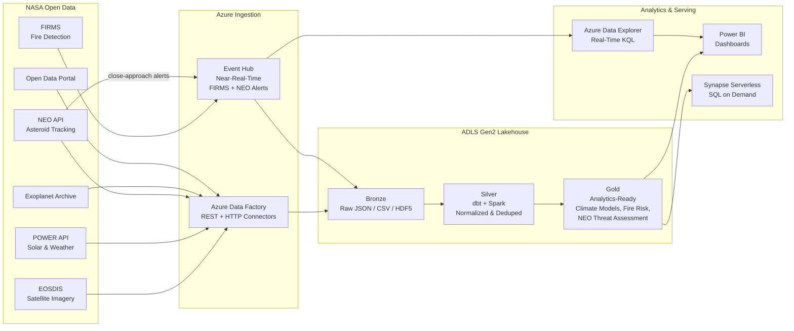

## NASA Earth Science & Space Data Analytics on Azure

NASA maintains one of the largest open scientific data ecosystems in the world: over 40 petabytes of Earth observation imagery, real-time fire detection feeds, near-earth object tracking, solar and meteorological model outputs, and thousands of curated datasets published under open-data mandates. All primary APIs are free, rate-limited by a single API key issued at [api.nasa.gov](https://api.nasa.gov/).

This use case brings NASA data into the CSA-in-a-Box medallion architecture on Azure — landing raw API responses and bulk files in Bronze, normalizing and deduplicating in Silver with dbt, and producing analytics-ready Gold tables for climate trend analysis, wildfire early warning, agricultural resource planning, and planetary defense monitoring.

---

## Data Sources

| Source | Description | Format | Refresh | Endpoint |
|---|---|---|---|---|
| **EOSDIS** (Earth Observing System Data and Information System) | Satellite imagery and derived products from 40+ missions (Terra, Aqua, Landsat, ICESat-2). Over 40 PB archived. | HDF5, GeoTIFF, NetCDF | Continuous | `https://earthdata.nasa.gov/` |
| **NASA POWER API** (Prediction of Worldwide Energy Resources) | Solar radiation, temperature, precipitation, wind speed — modeled for any lat/lon at daily/monthly/climatology temporal resolution. | JSON, CSV, NetCDF | Daily | `https://power.larc.nasa.gov/api/temporal/daily/point` |
| **NEO API** (Near Earth Object Web Service) | Asteroid and comet close-approach data sourced from JPL CNEOS. Includes estimated diameter, relative velocity, miss distance, hazard classification. | JSON | Daily | `https://api.nasa.gov/neo/rest/v1/feed` |
| **FIRMS** (Fire Information for Resource Management System) | Near-real-time active fire and thermal anomaly detections from MODIS and VIIRS instruments. ~375 m resolution, updated every few hours. | CSV, GeoJSON, WMS | ~3 hours | `https://firms.modaps.eosdis.nasa.gov/api/area/csv/` |
| **Giovanni** | Interactive visualization and analysis for atmospheric, ocean, and land surface Earth science parameters. | NetCDF, PNG | Varies | `https://giovanni.gsfc.nasa.gov/giovanni/` |
| **NASA Exoplanet Archive** | Confirmed exoplanets with orbital parameters, stellar properties, and discovery metadata. Managed by Caltech/IPAC. | CSV, VOTable | Weekly | `https://exoplanetarchive.ipac.caltech.edu/TAP/sync` |
| **NASA Open Data Portal** | 40,000+ datasets across all NASA centers — mission telemetry, climate indicators, software catalogs, patents. | CSV, JSON, API | Varies | `https://data.nasa.gov/` |
| **APOD API** (Astronomy Picture of the Day) | Daily curated image/video with expert explanation. Useful for public engagement layers. | JSON | Daily | `https://api.nasa.gov/planetary/apod` |
| **Mars Rover Photos API** | Surface imagery from Curiosity, Opportunity, Spirit, and Perseverance rovers. Indexed by sol, camera, and Earth date. | JSON (image URLs) | As received | `https://api.nasa.gov/mars-photos/api/v1/rovers/` |

!!! info "API Key"
    All `api.nasa.gov` endpoints accept the demo key `DEMO_KEY` (30 req/hr, 50 req/day). For production pipelines, register a free key at [api.nasa.gov](https://api.nasa.gov/) — rate limit increases to 1,000 req/hr.

---

## Architecture



---

## Step-by-Step Domain Build

### Step 1: API Key Registration and ADF Linked Services

Register for a free API key at [api.nasa.gov](https://api.nasa.gov/). Store the key in Azure Key Vault.

Configure ADF linked services for each NASA endpoint:

| Linked Service | Base URL | Auth | Notes |
|---|---|---|---|
| `ls_nasa_power` | `https://power.larc.nasa.gov/api/` | None (open) | No API key required |
| `ls_nasa_neo` | `https://api.nasa.gov/neo/rest/v1/` | Query param `api_key` | Key Vault reference |
| `ls_nasa_firms` | `https://firms.modaps.eosdis.nasa.gov/api/` | Query param `MAP_KEY` | Separate FIRMS key from [FIRMS](https://firms.modaps.eosdis.nasa.gov/map/#d:24hrs;@0.0,0.0,2.0z) |
| `ls_nasa_exoplanet` | `https://exoplanetarchive.ipac.caltech.edu/` | None (open) | TAP/sync endpoint |
| `ls_nasa_opendata` | `https://data.nasa.gov/resource/` | App token (optional) | Socrata API |

!!! tip "EOSDIS Earthdata Login"
    EOSDIS bulk downloads require a free [Earthdata Login](https://urs.earthdata.nasa.gov/). Configure OAuth2 bearer token flow in ADF or use the `earthaccess` Python library in Databricks.

---

### Step 2: Ingest POWER API — Solar Radiation and Weather Data

The POWER API provides modeled meteorological data for any coordinate on Earth — no satellite imagery download required. This is the fastest NASA data source to operationalize.

**ADF pipeline pattern:** Parameterized REST connector iterating over a coordinate grid.

```python
"""
Fetch NASA POWER API data for a coordinate grid.
Returns daily solar radiation, temperature, and precipitation.
"""
import requests
import json
from datetime import datetime, timedelta

POWER_BASE = "https://power.larc.nasa.gov/api/temporal/daily/point"

def fetch_power_data(
    latitude: float,
    longitude: float,
    start_date: str = "20230101",
    end_date: str = "20231231",
) -> dict:
    """Fetch solar and meteorological data from NASA POWER API."""
    params = {
        "parameters": "ALLSKY_SFC_SW_DWN,T2M,T2M_MAX,T2M_MIN,PRECTOTCORR,WS2M",
        "community": "RE",  # Renewable Energy community
        "longitude": longitude,
        "latitude": latitude,
        "start": start_date,
        "end": end_date,
        "format": "JSON",
    }
    response = requests.get(POWER_BASE, params=params, timeout=30)
    response.raise_for_status()
    data = response.json()

    # Extract parameter descriptions
    # ALLSKY_SFC_SW_DWN = All Sky Surface Shortwave Downward Irradiance (kWh/m²/day)
    # T2M              = Temperature at 2 Meters (°C)
    # T2M_MAX          = Max Temperature at 2 Meters (°C)
    # T2M_MIN          = Min Temperature at 2 Meters (°C)
    # PRECTOTCORR      = Precipitation Corrected (mm/day)
    # WS2M             = Wind Speed at 2 Meters (m/s)
    return data


def build_coordinate_grid(
    lat_min: float, lat_max: float,
    lon_min: float, lon_max: float,
    step: float = 1.0,
) -> list[tuple[float, float]]:
    """Generate a coordinate grid for bulk ingestion."""
    coords = []
    lat = lat_min
    while lat <= lat_max:
        lon = lon_min
        while lon <= lon_max:
            coords.append((round(lat, 2), round(lon, 2)))
            lon += step
        lat += step
    return coords


# Example: Continental US grid at 1-degree resolution
grid = build_coordinate_grid(25.0, 49.0, -125.0, -67.0, step=1.0)
print(f"Grid points to ingest: {len(grid)}")

# Fetch one point
sample = fetch_power_data(38.9072, -77.0369)  # Washington, DC
daily = sample["properties"]["parameter"]
print(f"Parameters returned: {list(daily.keys())}")
print(f"Days of data: {len(daily['T2M'])}")
```

**Bronze output:** One JSON file per coordinate-date range, partitioned by `year/month/latitude_longitude`.

---

### Step 3: FIRMS Near-Real-Time Fire Detection Streaming

FIRMS provides active fire detections within ~3 hours of satellite overpass. For operational wildfire monitoring, stream detections through Event Hub into Azure Data Explorer for sub-minute query latency.

**Architecture:**

1. **Polling function** (Azure Functions, 15-min timer trigger) calls FIRMS API for latest detections
2. Events published to **Event Hub** `eh-firms-fire-detections`
3. **ADX data connection** ingests from Event Hub into `raw_fire_detections` table
4. Parallel copy to **ADLS Bronze** for medallion processing

```python
"""
FIRMS API poller — fetches recent fire detections and publishes to Event Hub.
Deploy as Azure Function with Timer Trigger (*/15 * * * *).
"""
import requests
import json
from azure.eventhub import EventHubProducerClient, EventData

FIRMS_URL = "https://firms.modaps.eosdis.nasa.gov/api/area/csv"
FIRMS_MAP_KEY = "<your-firms-map-key>"  # From Key Vault

def fetch_firms_detections(
    source: str = "VIIRS_SNPP_NRT",
    area_coords: str = "-125,25,-67,49",  # CONUS bounding box
    day_range: int = 1,
) -> list[dict]:
    """Fetch active fire detections from FIRMS."""
    url = f"{FIRMS_URL}/{FIRMS_MAP_KEY}/{source}/{area_coords}/{day_range}"
    response = requests.get(url, timeout=60)
    response.raise_for_status()

    lines = response.text.strip().split("\n")
    headers = lines[0].split(",")
    detections = []
    for line in lines[1:]:
        values = line.split(",")
        record = dict(zip(headers, values))
        detections.append(record)
    return detections


def publish_to_event_hub(detections: list[dict], conn_str: str, hub_name: str):
    """Publish fire detections to Event Hub for ADX ingestion."""
    producer = EventHubProducerClient.from_connection_string(conn_str, eventhub_name=hub_name)
    with producer:
        batch = producer.create_batch()
        for det in detections:
            event = EventData(json.dumps(det))
            event.properties = {
                "source": det.get("instrument", "VIIRS"),
                "confidence": det.get("confidence", "unknown"),
            }
            try:
                batch.add(event)
            except ValueError:
                producer.send_batch(batch)
                batch = producer.create_batch()
                batch.add(event)
        producer.send_batch(batch)
    return len(detections)
```

!!! warning "FIRMS Rate Limits"
    FIRMS transaction API limits vary by data source. VIIRS NRT supports requests for up to 10 days of data per call. For large area requests, partition by region or use the bulk download files updated every few hours.

---

### Step 4: Bronze / Silver / Gold Medallion with dbt

#### Bronze → Silver Transformations

Silver models normalize raw API responses into typed, deduplicated tables with consistent schemas.

**`models/silver/stg_firms_fire_detections.sql`** — FIRMS fire detection normalization:

```sql
-- dbt model: stg_firms_fire_detections
-- Normalizes FIRMS CSV ingestion into typed, deduplicated fire events

{{ config(
    materialized='incremental',
    unique_key='detection_id',
    incremental_strategy='merge',
    partition_by={'field': 'acq_date', 'data_type': 'date'}
) }}

with source as (
    select * from {{ source('bronze', 'raw_firms_detections') }}
),

parsed as (
    select
        -- Generate deterministic ID from satellite + coordinates + timestamp
        {{ dbt_utils.generate_surrogate_key([
            'satellite', 'latitude', 'longitude', 'acq_date', 'acq_time'
        ]) }} as detection_id,

        cast(latitude as float64)                         as latitude,
        cast(longitude as float64)                        as longitude,
        cast(bright_ti4 as float64)                       as brightness_ti4_kelvin,
        cast(bright_ti5 as float64)                       as brightness_ti5_kelvin,
        cast(scan as float64)                             as scan_pixel_size,
        cast(track as float64)                            as track_pixel_size,
        parse_date('%Y-%m-%d', acq_date)                  as acq_date,
        lpad(acq_time, 4, '0')                            as acq_time_hhmm,
        timestamp(concat(acq_date, ' ',
            substr(lpad(acq_time, 4, '0'), 1, 2), ':',
            substr(lpad(acq_time, 4, '0'), 3, 2), ':00'))
                                                          as acquired_at_utc,
        satellite                                         as satellite,
        instrument                                        as instrument,
        cast(confidence as string)                        as confidence_level,
        cast(frp as float64)                              as fire_radiative_power_mw,
        case
            when upper(daynight) = 'D' then 'Day'
            when upper(daynight) = 'N' then 'Night'
            else 'Unknown'
        end                                               as day_night_flag,
        cast(version as string)                           as algorithm_version,
        current_timestamp()                               as _loaded_at

    from source
    where latitude is not null
      and longitude is not null
      and bright_ti4 is not null
)

select * from parsed


where acquired_at_utc > (select max(acquired_at_utc) from {{ this }})

```

**Additional Silver models:**

| Model | Source | Key Transformations |
|---|---|---|
| `stg_power_daily_weather` | POWER API Bronze | Pivot parameter columns, cast types, add coordinate hash, filter fill values (-999) |
| `stg_neo_close_approaches` | NEO API Bronze | Flatten nested `close_approach_data`, convert AU/km distances, flag `is_potentially_hazardous` |
| `stg_exoplanets` | Exoplanet Archive | Standardize discovery method taxonomy, compute habitable zone flag from stellar flux |

#### Silver → Gold Aggregations

| Gold Table | Logic | Grain |
|---|---|---|
| `gold_climate_trends` | 30-year rolling averages of temperature, precipitation, solar irradiance from POWER data | Monthly × 1° grid cell |
| `gold_fire_risk_index` | Composite score: FRP intensity + detection density + drought index (PRECTOTCORR) + wind speed | Daily × county/region |
| `gold_neo_threat_assessment` | Close approaches within 0.05 AU, estimated diameter, relative velocity, Torino-scale proxy | Per object per approach |
| `gold_solar_potential` | Annual GHI (Global Horizontal Irradiance) from ALLSKY_SFC_SW_DWN, capacity factor estimates | Annual × 0.5° grid |

---

### Step 5: Earth Science Analytics

With Gold tables materialized, build domain-specific analytical views:

**Climate trend analysis** — Compare POWER-derived temperature anomalies against 30-year baselines per grid cell. Join with NOAA GHCN station data ([NOAA use case](./government-data-analytics.md)) for ground-truth validation.

**Fire risk scoring** — Cross-reference FIRMS detections with POWER precipitation deficit (drought proxy), wind speed, and historical fire density. Weight by FRP (fire radiative power) for severity ranking. Integrate with [EPA AQI data](./government-data-analytics.md) for downstream air quality impact estimation.

**Agricultural solar potential** — Map ALLSKY_SFC_SW_DWN (solar irradiance) against crop calendars and precipitation patterns. Identify regions where solar installations complement rainfed agriculture.

---

### Step 6: NEO Monitoring Dashboard

Ingest daily close-approach data from the NEO API and categorize by threat level.

```python
"""
Ingest NEO (Near Earth Object) close approach data from NASA API.
"""
import requests
from datetime import date, timedelta

NEO_FEED = "https://api.nasa.gov/neo/rest/v1/feed"

def fetch_neo_approaches(
    start_date: date,
    end_date: date | None = None,
    api_key: str = "DEMO_KEY",
) -> list[dict]:
    """Fetch asteroid close approaches for a date range (max 7 days)."""
    if end_date is None:
        end_date = start_date + timedelta(days=7)

    params = {
        "start_date": start_date.isoformat(),
        "end_date": end_date.isoformat(),
        "api_key": api_key,
    }
    resp = requests.get(NEO_FEED, params=params, timeout=30)
    resp.raise_for_status()
    data = resp.json()

    approaches = []
    for date_str, objects in data["near_earth_objects"].items():
        for obj in objects:
            for ca in obj["close_approach_data"]:
                approaches.append({
                    "neo_id": obj["id"],
                    "name": obj["name"],
                    "absolute_magnitude_h": obj["absolute_magnitude_h"],
                    "estimated_diameter_min_m": obj["estimated_diameter"]["meters"]["estimated_diameter_min"],
                    "estimated_diameter_max_m": obj["estimated_diameter"]["meters"]["estimated_diameter_max"],
                    "is_potentially_hazardous": obj["is_potentially_hazardous_asteroid"],
                    "close_approach_date": ca["close_approach_date"],
                    "relative_velocity_kph": float(ca["relative_velocity"]["kilometers_per_hour"]),
                    "miss_distance_km": float(ca["miss_distance"]["kilometers"]),
                    "miss_distance_au": float(ca["miss_distance"]["astronomical"]),
                    "orbiting_body": ca["orbiting_body"],
                })
    return approaches
```

**Torino Scale proxy categorization** (simplified for dashboarding):

| Category | Criteria | Dashboard Color |
|---|---|---|
| **No Hazard (0)** | Miss distance > 0.05 AU | Green |
| **Normal (1)** | Miss distance 0.01–0.05 AU, diameter < 50 m | Yellow |
| **Meriting Attention (2-4)** | Miss distance < 0.01 AU or `is_potentially_hazardous = true` | Orange |
| **Threatening (5-7)** | Hypothetical — close approach < 1 lunar distance, diameter > 100 m | Red |

!!! note "Torino Scale"
    The actual Torino Scale incorporates collision probability, which is not available from the NEO feed API. The categorization above is a simplified proxy for dashboarding. For authoritative risk assessments, reference [JPL Sentry](https://cneos.jpl.nasa.gov/sentry/).

---

### Step 7: Power BI Dashboards and KQL Real-Time Queries

#### KQL: Real-Time NEO Close Approach Monitoring

```kql
// Near Earth Objects approaching within 0.05 AU in the next 7 days
// Table: gold_neo_close_approaches (ADX or Synapse)
gold_neo_close_approaches
| where close_approach_date between (now() .. now() + 7d)
| where miss_distance_au < 0.05
| extend diameter_estimate_m = (estimated_diameter_min_m + estimated_diameter_max_m) / 2
| extend threat_category = case(
    miss_distance_au < 0.002 and diameter_estimate_m > 100, "Threatening",
    is_potentially_hazardous == true, "Meriting Attention",
    miss_distance_au < 0.01, "Normal",
    "No Hazard"
  )
| project
    name,
    close_approach_date,
    diameter_estimate_m,
    relative_velocity_kph,
    miss_distance_km,
    miss_distance_au,
    threat_category,
    orbiting_body
| order by miss_distance_au asc
```

#### KQL: FIRMS Fire Detection Hotspot Clusters

```kql
// Active fire clusters in the last 24 hours — group by 0.5° grid
raw_fire_detections
| where acquired_at_utc > ago(24h)
| extend lat_grid = round(latitude * 2, 0) / 2
| extend lon_grid = round(longitude * 2, 0) / 2
| summarize
    detection_count = count(),
    avg_frp = avg(fire_radiative_power_mw),
    max_brightness = max(brightness_ti4_kelvin),
    latest_detection = max(acquired_at_utc)
  by lat_grid, lon_grid, satellite
| where detection_count > 5
| order by avg_frp desc
```

#### Power BI Dashboard Layout

| Page | Visuals | Data Source |
|---|---|---|
| **Climate Overview** | Global temperature anomaly map, precipitation trend lines, solar irradiance heatmap | `gold_climate_trends` |
| **Fire Watch** | Real-time fire detection map (ArcGIS visual), FRP time series, fire risk index by region | `raw_fire_detections` (ADX), `gold_fire_risk_index` |
| **NEO Tracker** | Close approach timeline, diameter vs. miss distance scatter, threat category donut | `gold_neo_threat_assessment` |
| **Solar Potential** | GHI map overlay, capacity factor by region, top sites table | `gold_solar_potential` |
| **Exoplanet Catalog** | Discovery timeline, habitable zone filter, method distribution | `stg_exoplanets` |

---

## Use Cases Within the NASA Domain

### Earth Observation for Climate Change Monitoring

Combine POWER API temperature and precipitation time series with EOSDIS-derived vegetation indices (NDVI from MODIS) to track climate change indicators at regional scale. Gold-layer 30-year baselines enable anomaly detection and trend reporting aligned with IPCC assessment intervals.

### Agricultural Resource Planning

Map solar irradiance (ALLSKY_SFC_SW_DWN) and precipitation (PRECTOTCORR) from POWER against USDA crop calendars. Identify optimal regions for agrivoltaic installations where solar panels coexist with shade-tolerant crops. Cross-reference with NOAA drought monitor data for irrigation planning.

### Wildfire Early Detection and Response

FIRMS detections arrive within ~3 hours of satellite overpass. Streaming through Event Hub into ADX enables KQL queries within seconds of ingestion. Cross-reference with:

- **NOAA weather data** — wind speed and direction for fire spread modeling
- **EPA AQI monitors** — downstream air quality impact from smoke plumes
- **USGS elevation data** — terrain slope for spread rate estimation

### Planetary Defense — NEO Tracking

Ingest daily close-approach data and maintain a running catalog of potentially hazardous asteroids (PHAs). While operational planetary defense is managed by NASA's Planetary Defense Coordination Office (PDCO), the analytics pipeline enables:

- Historical close-approach trend analysis
- Automated alerting for objects within configurable miss-distance thresholds
- Correlation with observational campaigns (e.g., DART mission follow-up)

### Space Weather Monitoring

POWER API includes space-weather-adjacent parameters (solar irradiance variations). For operational space weather, integrate with NOAA SWPC (Space Weather Prediction Center) feeds — solar flare alerts, geomagnetic storm indices — through the same Event Hub streaming pattern used for FIRMS.

---

## Cross-References

| Related Use Case | Integration Point |
|---|---|
| [Government Data Analytics](./government-data-analytics.md) | NOAA climate data synergy, EPA air quality cross-reference, federal compliance frameworks |
| [Real-Time Intelligence & Anomaly Detection](./realtime-intelligence-anomaly-detection.md) | Event Hub streaming patterns, ADX real-time queries, anomaly detection for fire/NEO events |

!!! tip "Geospatial Analytics"
    For spatial joins (fire detections × county boundaries, NEO ground tracks), consider Azure Maps or PostGIS on Azure Database for PostgreSQL. FIRMS coordinates can be enriched with reverse geocoding at ingestion time.

---

## Sources

| Resource | URL |
|---|---|
| NASA API Portal | [https://api.nasa.gov/](https://api.nasa.gov/) |
| NASA Earthdata (EOSDIS) | [https://earthdata.nasa.gov/](https://earthdata.nasa.gov/) |
| NASA POWER API Documentation | [https://power.larc.nasa.gov/docs/](https://power.larc.nasa.gov/docs/) |
| FIRMS Active Fire Data | [https://firms.modaps.eosdis.nasa.gov/](https://firms.modaps.eosdis.nasa.gov/) |
| NASA NEO API Documentation | [https://api.nasa.gov/ — Asteroids NeoWs](https://api.nasa.gov/) |
| NASA Exoplanet Archive | [https://exoplanetarchive.ipac.caltech.edu/](https://exoplanetarchive.ipac.caltech.edu/) |
| NASA Open Data Portal | [https://data.nasa.gov/](https://data.nasa.gov/) |
| Giovanni Earth Science Data | [https://giovanni.gsfc.nasa.gov/giovanni/](https://giovanni.gsfc.nasa.gov/giovanni/) |
| JPL CNEOS Sentry (NEO Risk) | [https://cneos.jpl.nasa.gov/sentry/](https://cneos.jpl.nasa.gov/sentry/) |
| NOAA Space Weather Prediction Center | [https://www.swpc.noaa.gov/](https://www.swpc.noaa.gov/) |
