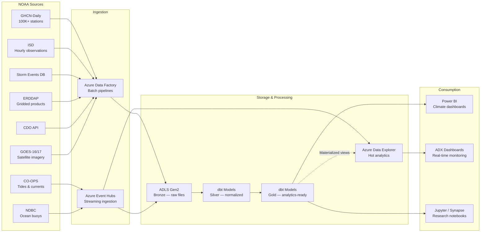

## NOAA Climate & Ocean Analytics on Azure

NOAA publishes some of the largest and longest-running environmental observation datasets in the world — daily weather station readings dating back to the 1700s, real-time coastal tide gauges, open-ocean buoy telemetry, severe storm event records, and satellite-derived gridded products. Individually, each dataset answers a narrow set of questions. Combined in a unified analytical platform, they enable multi-decadal climate trend analysis, real-time severe weather monitoring, flood risk scoring, and marine ecosystem health assessment.

This use case applies the CSA-in-a-Box medallion architecture to NOAA's public data catalog, demonstrating how batch historical ingestion and real-time station streaming converge in a single lakehouse to support both retrospective research and operational alerting.

---

## Data Sources

| Source | Description | Volume / Coverage | Update Frequency | Access Method |
|---|---|---|---|---|
| **GHCN-Daily** | Global Historical Climatology Network — daily temperature, precipitation, snowfall from 100,000+ stations worldwide | ~30 GB compressed, records from 1763–present | Daily | FTP / HTTPS bulk download |
| **CDO API** | Climate Data Online — NOAA's REST API for historical climate summaries, normals, and station metadata | Covers all GHCN + COOP + ASOS stations | On-demand | REST API (token required) |
| **CO-OPS** | Center for Operational Oceanographic Products and Services — tide predictions, water levels, currents from 200+ coastal stations | 6-minute intervals per station | Real-time (6 min) | REST API / SOAP |
| **NDBC** | National Data Buoy Center — wave height, wind speed, sea surface temperature from 900+ ocean buoys and coastal stations | Hourly+ per buoy | Real-time (hourly) | HTTPS / RSS |
| **Storm Events DB** | Severe weather events with damage estimates, fatalities, narrative descriptions | ~1.5M events, 1950–present | Monthly bulk update | CSV bulk download |
| **ERDDAP** | Environmental Research Division Data Access Program — gridded oceanographic and atmospheric datasets (SST, chlorophyll, salinity) | Multi-TB, global coverage | Varies by dataset | OPeNDAP / REST |
| **ISD** | Integrated Surface Database — hourly weather observations from 35,000+ stations globally | ~600 GB, 1901–present | Daily | FTP / HTTPS |
| **GOES-16/17** | Geostationary satellite imagery — visible, infrared, water vapor bands at 0.5–2 km resolution | ~1 TB/day per satellite | 1–15 min scan intervals | AWS S3 (NOAA Open Data) |

!!! info "Data Access"
    All NOAA datasets listed above are publicly available at no cost. The CDO API requires a free token from [ncdc.noaa.gov/cdo-web/token](https://www.ncdc.noaa.gov/cdo-web/token). GOES-16/17 imagery is hosted on AWS S3 as part of the [NOAA Open Data Dissemination (NODD)](https://www.noaa.gov/information-technology/open-data-dissemination) program and can be accessed cross-cloud via Azure Data Factory.

---

## Architecture

The architecture separates two ingestion paths: a **batch path** for historical and bulk-updated datasets (GHCN-Daily, ISD, Storm Events, ERDDAP) and a **hot path** for real-time station telemetry (CO-OPS tides, NDBC buoys, weather station streams). Both converge in ADLS Gen2 bronze, flow through dbt-managed silver and gold layers, and serve downstream consumers through Power BI and Azure Data Explorer.



!!! tip "Why two ingestion paths?"
    Historical datasets like GHCN-Daily and ISD are bulk files updated daily — ADF's copy activities handle these efficiently. CO-OPS and NDBC stations emit readings every 6–60 minutes; Event Hubs captures these as a continuous stream for sub-minute ingestion into ADX, where KQL queries power real-time dashboards. The medallion layers in dbt process both paths on a unified schedule.

---

## Step-by-Step Walkthrough

### Step 1: Ingest GHCN-Daily and ISD Historical Data via ADF

GHCN-Daily data is distributed as fixed-width text files partitioned by station. ISD uses a similar station-partitioned layout with a different schema. ADF pipelines download these files on a daily schedule, decompress them, and land them in bronze as Parquet.

**Pipeline configuration highlights:**

- **Source:** NOAA HTTPS endpoints (`https://www.ncei.noaa.gov/pub/data/ghcn/daily/ghcnd_all.tar.gz` for GHCN-Daily, `https://www.ncei.noaa.gov/pub/data/noaa/` for ISD)
- **Sink:** ADLS Gen2 bronze container, partitioned by `source/year/month/`
- **Triggers:** Daily tumbling window (06:00 UTC, after NOAA's overnight processing completes)
- **Schema handling:** Fixed-width parsing via ADF mapping data flows or downstream dbt

!!! warning "Volume considerations"
    A full GHCN-Daily backfill is approximately 30 GB compressed. ISD adds another 600 GB. Run initial backfills during off-peak hours and use ADF's parallelism controls to limit concurrent copy activities to avoid throttling NOAA's servers.

---

### Step 2: Set Up Real-Time Weather Station Streaming

CO-OPS tide gauges and NDBC buoys provide REST APIs that return the latest observations. A lightweight polling service (Azure Function or container) queries these APIs at their native update intervals and publishes readings to Event Hubs. From Event Hubs, data flows to both bronze (for dbt processing) and directly to ADX (for real-time dashboards).

```python
"""
Fetch latest CO-OPS water level readings and publish to Event Hub.
Runs as an Azure Function on a 6-minute timer trigger.
"""
import os
import json
import httpx
from datetime import datetime, timedelta, timezone
from azure.eventhub import EventHubProducerClient, EventData

COOPS_BASE = "https://api.tidesandcurrents.noaa.gov/api/prod/datagetter"
EVENT_HUB_CONN = os.environ["EVENT_HUB_CONNECTION_STRING"]
EVENT_HUB_NAME = os.environ["EVENT_HUB_NAME"]

# Representative coastal stations
STATIONS = ["8518750", "8723214", "9414290", "8443970"]  # NYC, Miami, SF, Boston

def fetch_water_levels(station_id: str) -> list[dict]:
    """Fetch the last 6 minutes of verified water level data."""
    end = datetime.now(timezone.utc)
    begin = end - timedelta(minutes=6)
    params = {
        "begin_date": begin.strftime("%Y%m%d %H:%M"),
        "end_date": end.strftime("%Y%m%d %H:%M"),
        "station": station_id,
        "product": "water_level",
        "datum": "NAVD",
        "units": "metric",
        "time_zone": "gmt",
        "format": "json",
        "application": "csa_inabox",
    }
    resp = httpx.get(COOPS_BASE, params=params, timeout=30)
    resp.raise_for_status()
    data = resp.json().get("data", [])
    return [
        {
            "station_id": station_id,
            "timestamp": reading["t"],
            "water_level_m": float(reading["v"]),
            "sigma": float(reading["s"]),
            "quality": reading["f"],
            "source": "co-ops",
            "ingested_at": end.isoformat(),
        }
        for reading in data
    ]

def publish_to_event_hub(readings: list[dict]) -> None:
    producer = EventHubProducerClient.from_connection_string(
        EVENT_HUB_CONN, eventhub_name=EVENT_HUB_NAME
    )
    with producer:
        batch = producer.create_batch()
        for reading in readings:
            batch.add(EventData(json.dumps(reading)))
        producer.send_batch(batch)

def main() -> None:
    all_readings = []
    for station in STATIONS:
        all_readings.extend(fetch_water_levels(station))
    if all_readings:
        publish_to_event_hub(all_readings)
```

---

### Step 3: Build Bronze → Silver → Gold Medallion Layers with dbt

The dbt project normalizes raw NOAA files into consistent, queryable tables across the medallion layers.

**Bronze:** Raw files landed as-is (Parquet from ADF, JSON from Event Hubs).

**Silver:** Cleaned, typed, deduplicated observations with consistent schemas.

**Gold:** Analytical tables optimized for specific use cases — climate trend aggregates, flood risk scores, marine indices.

```sql
-- models/silver/stg_weather_observations.sql
-- Normalize GHCN-Daily and ISD into a unified observation schema

{{ config(
    materialized='incremental',
    unique_key='observation_id',
    partition_by={'field': 'observation_date', 'data_type': 'date', 'granularity': 'month'}
) }}

with ghcn_raw as (
    select
        station_id,
        cast(date_str as date)                          as observation_date,
        element,
        cast(value as float64) / 10.0                   as value_scaled,
        measurement_flag,
        quality_flag,
        source_flag,
        'ghcn_daily'                                    as data_source,
        {{ dbt_utils.generate_surrogate_key(
            ['station_id', 'date_str', 'element']
        ) }}                                            as observation_id
    from {{ source('bronze', 'ghcn_daily_raw') }}
    where quality_flag not in ('D', 'I', 'S', 'X')  -- exclude failed QC
    
        and _loaded_at > (select max(_loaded_at) from {{ this }})
    
),

isd_raw as (
    select
        usaf || '-' || wban                             as station_id,
        cast(observation_date as date)                  as observation_date,
        'TEMP'                                          as element,
        air_temperature_c                               as value_scaled,
        null                                            as measurement_flag,
        quality_code                                    as quality_flag,
        'isd'                                           as source_flag,
        'isd'                                           as data_source,
        {{ dbt_utils.generate_surrogate_key(
            ['usaf', 'wban', 'observation_date', 'observation_time']
        ) }}                                            as observation_id
    from {{ source('bronze', 'isd_raw') }}
    where quality_code in ('1', '5')  -- passed automatic + manual QC
    
        and _loaded_at > (select max(_loaded_at) from {{ this }})
    
)

select * from ghcn_raw
union all
select * from isd_raw
```

```sql
-- models/gold/climate_trends_monthly.sql
-- Multi-decadal monthly climate aggregates by station and region

{{ config(materialized='table') }}

select
    s.station_id,
    s.station_name,
    s.state,
    s.climate_division,
    s.latitude,
    s.longitude,
    date_trunc('month', o.observation_date)             as month,
    avg(case when o.element = 'TMAX' then o.value_scaled end) as avg_tmax_c,
    avg(case when o.element = 'TMIN' then o.value_scaled end) as avg_tmin_c,
    sum(case when o.element = 'PRCP' then o.value_scaled end) as total_precip_mm,
    sum(case when o.element = 'SNOW' then o.value_scaled end) as total_snow_mm,
    count(distinct o.observation_date)                  as days_with_data,
    avg(case when o.element = 'TMAX' then o.value_scaled end)
        - avg(case when o.element = 'TMIN' then o.value_scaled end) as avg_diurnal_range_c
from {{ ref('stg_weather_observations') }} o
join {{ ref('dim_stations') }} s on o.station_id = s.station_id
group by 1, 2, 3, 4, 5, 6, 7
```

---

### Step 4: Storm Event Correlation and Damage Analysis

NOAA's Storm Events Database provides event-level records for tornadoes, hurricanes, hail, floods, and other severe weather with property and crop damage estimates. In gold, these records join to weather observations and geographic boundaries to build damage-per-event models and identify historically vulnerable regions.

```sql
-- models/gold/storm_damage_analysis.sql

{{ config(materialized='table') }}

select
    se.event_id,
    se.event_type,
    se.state,
    se.cz_name                                          as county_or_zone,
    se.begin_date,
    se.end_date,
    se.injuries_direct + se.injuries_indirect            as total_injuries,
    se.deaths_direct + se.deaths_indirect                as total_deaths,
    se.damage_property_usd,
    se.damage_crops_usd,
    se.damage_property_usd + se.damage_crops_usd        as total_damage_usd,
    se.magnitude,
    se.magnitude_type,
    se.tor_f_scale,
    se.flood_cause,
    -- Correlate with weather observations at nearest station
    obs.avg_tmax_c                                      as month_avg_tmax,
    obs.total_precip_mm                                  as month_total_precip,
    obs.total_snow_mm                                    as month_total_snow
from {{ ref('stg_storm_events') }} se
left join {{ ref('climate_trends_monthly') }} obs
    on se.nearest_station_id = obs.station_id
    and date_trunc('month', se.begin_date) = obs.month
```

---

### Step 5: Marine and Ocean Monitoring

CO-OPS tide readings and NDBC buoy data flow through silver into gold models that compute flood risk scores, track sea level trends, and monitor marine conditions.

**Gold layer outputs:**

| Gold Table | Inputs | Purpose |
|---|---|---|
| `flood_risk_scores` | CO-OPS water levels + tide predictions + storm surge models | Per-station flood probability at 6-hour intervals |
| `sea_level_trends` | CO-OPS monthly mean sea level, 30+ year baselines | Long-term sea level rise rates by coast |
| `marine_conditions` | NDBC buoy observations (wave, wind, SST) | Current and forecast marine safety indices |
| `marine_ecosystem_indices` | ERDDAP SST + chlorophyll-a + NDBC observations | Composite ocean health indicators by region |

!!! note "Datum alignment"
    CO-OPS provides water levels relative to multiple tidal datums (MLLW, NAVD88, MSL). The silver layer standardizes all readings to NAVD88 for consistency with elevation models and FEMA flood maps. The original datum is preserved as a metadata column.

---

### Step 6: Climate Trend Analysis

With multi-decadal data from GHCN-Daily and ISD normalized in silver, gold models compute long-term trends that support climate research and infrastructure planning.

**Analytical outputs:**

- **Temperature trend slopes** — Linear regression of annual mean temperature per station, calculated over 30/50/100-year windows
- **Precipitation regime shifts** — Change-point detection on annual precipitation totals by climate division
- **Extreme event frequency** — Count of days exceeding historical 95th/99th percentile thresholds for temperature and precipitation, by decade
- **Growing season length** — Days between last spring freeze and first fall freeze, tracked annually
- **Heating/cooling degree days** — Annual HDD and CDD totals for energy demand forecasting

---

### Step 7: Severe Weather Early Warning Dashboards

ADX ingests real-time station data from Event Hubs and materialized views from gold, powering KQL-based dashboards for operational monitoring.

```kql
// Real-time storm tracking: stations reporting extreme conditions in the last 2 hours
StationObservations
| where ingested_at > ago(2h)
| where source in ("co-ops", "ndbc", "isd_realtime")
| summarize
    latest_reading = arg_max(timestamp, *),
    reading_count = count()
    by station_id, source
| join kind=inner StationMetadata on station_id
| extend
    is_extreme_wind = iff(wind_speed_ms > 25.0, true, false),
    is_extreme_precip = iff(precip_rate_mm_hr > 50.0, true, false),
    is_flood_risk = iff(water_level_m > flood_threshold_m, true, false)
| where is_extreme_wind or is_extreme_precip or is_flood_risk
| project
    station_id,
    station_name,
    latitude,
    longitude,
    source,
    timestamp,
    wind_speed_ms,
    precip_rate_mm_hr,
    water_level_m,
    flood_threshold_m,
    is_extreme_wind,
    is_extreme_precip,
    is_flood_risk
| order by timestamp desc
```

```kql
// 7-day rolling storm event count by state — for trend dashboards
StormEvents
| where begin_date > ago(365d)
| summarize event_count = count() by state, bin(begin_date, 7d), event_type
| order by begin_date desc, event_count desc
| render timechart
```

---

## Satellite Imagery Processing

GOES-16 (East) and GOES-17 (West) geostationary satellites produce full-disk imagery every 10–15 minutes across 16 spectral bands. JPSS polar-orbiting satellites (NOAA-20, NOAA-21) add higher-resolution passes twice daily.

!!! warning "Compute and storage requirements"
    GOES-16/17 each generate approximately 1 TB/day of raw imagery. Processing satellite data at scale requires GPU-accelerated workloads (e.g., Azure Machine Learning compute clusters) and is significantly more resource-intensive than tabular weather data. Start with specific bands and regions of interest rather than ingesting full-disk imagery.

**Recommended approach:**

1. **Access:** GOES-16/17 Level 2+ products are available via [NOAA Open Data on AWS S3](https://registry.opendata.aws/noaa-goes/) — use ADF's S3-compatible connector or `azcopy` to pull specific products cross-cloud
2. **Products of interest:** Cloud and Moisture Imagery (CMI), Land Surface Temperature (LST), Sea Surface Temperature (SST), Derived Motion Winds (DMW)
3. **Processing:** Use Azure Machine Learning or Synapse Spark with `xarray` and `rioxarray` for NetCDF/HDF5 processing, output derived features as Parquet into bronze
4. **Integration:** Derived satellite features (e.g., regional SST anomalies, cloud cover percentages) join to station observations in gold for enriched analytics

---

## Cross-References

- **[Real-Time Intelligence for Anomaly Detection](realtime-intelligence-anomaly-detection.md)** — Event Hubs → ADX streaming patterns used here for weather station telemetry apply the same architecture described in the RTI use case
- **Geoanalytics** — Flood risk scoring and coastal monitoring require spatial joins against FEMA flood zones, coastline geometries, and elevation models; see the spatial analytics patterns in the CSA-in-a-Box framework
- **IoT streaming patterns** — The CO-OPS/NDBC polling-to-Event-Hub pattern is a variant of standard IoT telemetry ingestion documented in the platform's streaming guides

---

## Sources and API References

| Resource | URL |
|---|---|
| GHCN-Daily documentation | [ncei.noaa.gov/products/land-based-station/global-historical-climatology-network-daily](https://www.ncei.noaa.gov/products/land-based-station/global-historical-climatology-network-daily) |
| Climate Data Online (CDO) API | [ncdc.noaa.gov/cdo-web/webservices/v2](https://www.ncdc.noaa.gov/cdo-web/webservices/v2) |
| CO-OPS API | [api.tidesandcurrents.noaa.gov/api/prod/](https://api.tidesandcurrents.noaa.gov/api/prod/) |
| NDBC data access | [ndbc.noaa.gov/data/](https://www.ndbc.noaa.gov/data/) |
| Storm Events Database | [ncdc.noaa.gov/stormevents/](https://www.ncdc.noaa.gov/stormevents/) |
| ERDDAP | [coastwatch.pfeg.noaa.gov/erddap/](https://coastwatch.pfeg.noaa.gov/erddap/) |
| Integrated Surface Database (ISD) | [ncei.noaa.gov/products/land-based-station/integrated-surface-database](https://www.ncei.noaa.gov/products/land-based-station/integrated-surface-database) |
| GOES-16/17 on AWS | [registry.opendata.aws/noaa-goes/](https://registry.opendata.aws/noaa-goes/) |
| NOAA Open Data Dissemination | [noaa.gov/information-technology/open-data-dissemination](https://www.noaa.gov/information-technology/open-data-dissemination) |
