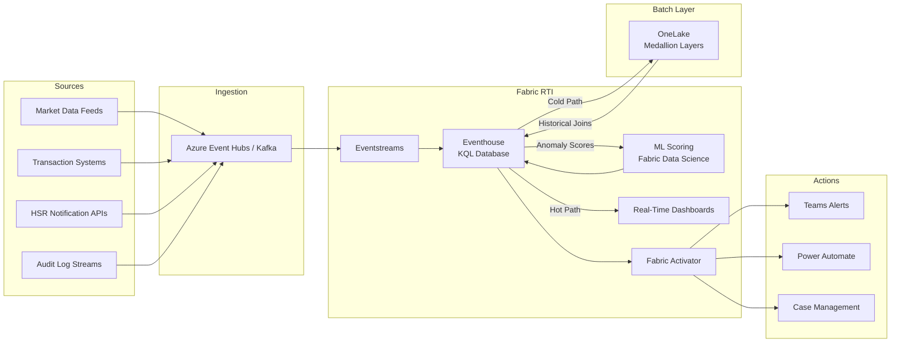

## Real-Time Intelligence for Anomaly & Pattern Detection

Detecting potentially anticompetitive conduct — coordinated pricing, bid rigging, capacity withdrawal — requires processing high-velocity transaction and market data against historical baselines in near real time. Batch analytics can surface patterns after the fact, but enforcement agencies and compliance teams increasingly need detection latency measured in minutes, not days.

Microsoft Fabric Real-Time Intelligence (RTI) provides a unified stack for streaming analytics: **Eventstreams** for ingestion, **Eventhouse** (backed by Kusto/KQL) for hot storage and query, **Real-Time Dashboards** for visualization, and **Activator** for automated alerting. Combined with the CSA-in-a-Box medallion architecture in OneLake, RTI enables a hybrid approach where streaming anomaly detection runs alongside deep historical analysis.

---

## When to Use Real-Time Intelligence

CSA-in-a-Box's core pipeline uses dbt to transform data through bronze → silver → gold medallion layers on a batch schedule. This is the right approach for the majority of analytical workloads — trend analysis, periodic reporting, enforcement statistics, and historical pattern mining.

RTI is for scenarios where **detection latency matters**:

| Scenario | Why Batch Isn't Enough | RTI Detection Window |
|---|---|---|
| **Price-fixing surveillance** | Parallel price movements across competitors must be flagged before the next pricing cycle | Minutes |
| **Bid rigging detection** | Suspiciously similar bids need investigation before contract award | Hours |
| **Market share monitoring** | Concentration shifts from large transactions should trigger review immediately | Minutes to hours |
| **Merger compliance monitoring** | Hold-separate agreement violations (e.g., information sharing between merging parties) require near-instant detection | Minutes |
| **Capacity withdrawal** | Coordinated production cuts to raise prices can be detected through real-time output data | Hours |

!!! tip "ADR-0018: Fabric RTI Adapter"
    CSA-in-a-Box includes a Fabric RTI adapter (see [ADR-0018](../adr/0018-fabric-rti-adapter.md)) that is environment-gated — it activates only when Fabric RTI is available in the target environment. Deployments without Fabric RTI continue to use the batch-only pipeline with no configuration changes.

!!! info "Batch and streaming are complementary"
    RTI does not replace the batch pipeline. Streaming detects anomalies in real time; batch analytics provides the historical context needed to determine whether an anomaly is genuinely suspicious or simply reflects normal market dynamics. The architecture below connects both paths.

---

## Architecture

The following diagram shows how streaming data flows from source systems through RTI and connects back to the batch medallion layers in OneLake.



**Key data flows:**

- **Hot path**: Events flow from Event Hubs → Eventstreams → Eventhouse, where KQL queries detect anomalies in real time. Results render on Real-Time Dashboards.
- **Cold path**: Eventhouse writes summarized or raw event data to OneLake for long-term retention and integration with the medallion layers.
- **Historical enrichment**: KQL queries in Eventhouse can join streaming data with historical tables in OneLake (via shortcuts), enabling comparisons like "Is this price movement unusual relative to the last 5 years?"
- **Alert path**: Fabric Activator monitors KQL query results and triggers alerts through Teams, Power Automate, or external case management systems.

---

## Step-by-Step: Building an Anomaly Detection Pipeline

### Step 1 — Set Up Event Hub for Market Data Ingestion

Event Hubs provides the durable, partitioned ingestion layer. Kafka compatibility is enabled so that existing Kafka producers (common in financial data infrastructure) can publish without code changes.

```bash
# Create the Event Hubs namespace with Kafka protocol support
az eventhubs namespace create \
  --name doj-market-surveillance \
  --resource-group rg-csa-analytics \
  --sku Standard \
  --enable-kafka true

# Create the event hub for price transaction events
az eventhubs eventhub create \
  --name price-transactions \
  --namespace-name doj-market-surveillance \
  --resource-group rg-csa-analytics \
  --partition-count 8 \
  --message-retention 7

# Create additional event hubs for other data streams
az eventhubs eventhub create \
  --name bid-submissions \
  --namespace-name doj-market-surveillance \
  --resource-group rg-csa-analytics \
  --partition-count 4 \
  --message-retention 7

az eventhubs eventhub create \
  --name market-share-updates \
  --namespace-name doj-market-surveillance \
  --resource-group rg-csa-analytics \
  --partition-count 4 \
  --message-retention 7
```

!!! warning "Partition count sizing"
    Partition count determines maximum consumer parallelism. For high-volume market data feeds (>10,000 events/second), increase partition count to 16 or 32. Partition count cannot be changed after creation on Standard tier — plan accordingly.

### Step 2 — Create an Eventstream in Fabric

Eventstreams connect Event Hubs to Eventhouse with built-in transformation capabilities.

1. In the Fabric portal, navigate to your workspace and select **New** → **Eventstream**.
2. Name the eventstream `es-price-surveillance`.
3. Add a **source**:
    - Source type: **Azure Event Hubs**
    - Connection: Select or create a connection to the `doj-market-surveillance` namespace
    - Event Hub: `price-transactions`
    - Consumer group: `$Default` (or create a dedicated group)
    - Data format: **JSON**
4. Add a **destination**:
    - Destination type: **Eventhouse**
    - Select the KQL database created in Step 3
    - Table: `PriceTransactions`
    - Input data format: **JSON**
    - Ingestion mapping: Map JSON fields to table columns

!!! info "Transformation in Eventstreams"
    Eventstreams supports inline transformations — filtering, field projection, calculated columns — before data reaches Eventhouse. Use this to drop irrelevant fields at ingestion time rather than storing and filtering later.

Repeat for `bid-submissions` and `market-share-updates` event hubs, creating separate eventstreams for each data domain.

### Step 3 — Create an Eventhouse and KQL Database

Eventhouse provides a managed Kusto engine optimized for time-series and streaming data. Create one Eventhouse with a single KQL database for the surveillance workload.

1. In the Fabric portal, select **New** → **Eventhouse**.
2. Name it `eh-market-surveillance`.
3. A KQL database is created automatically. Name it `db-surveillance`.

Define the schemas for ingested event types:

```kql
// Price transaction events from market data feeds
.create table PriceTransactions (
    TransactionId: string,
    IndustrySector: string,
    CompanyId: string,
    CompanyName: string,
    ProductCategory: string,
    Price: decimal,
    Volume: long,
    Timestamp: datetime,
    MarketRegion: string,
    SourceFeed: string,
    Currency: string
)

// Enable streaming ingestion for low-latency availability
.alter table PriceTransactions policy streamingingestion enable
```

```kql
// Bid submission events from procurement systems
.create table BidSubmissions (
    BidId: string,
    ContractId: string,
    ContractTitle: string,
    BidderId: string,
    BidderName: string,
    BidAmount: decimal,
    Currency: string,
    Timestamp: datetime,
    Agency: string,
    Region: string,
    BidStatus: string
)

.alter table BidSubmissions policy streamingingestion enable
```

```kql
// Market share update events derived from transaction aggregations
.create table MarketShareUpdates (
    UpdateId: string,
    IndustrySector: string,
    CompanyId: string,
    CompanyName: string,
    Revenue: decimal,
    UnitsSold: long,
    Timestamp: datetime,
    MarketRegion: string,
    ReportingPeriod: string
)

.alter table MarketShareUpdates policy streamingingestion enable
```

### Step 4 — Write KQL Queries for Anomaly Detection

This is the analytical core of the pipeline. Each query targets a specific antitrust surveillance pattern.

#### Price Correlation Detection

Detect when multiple competitors change prices in the same direction within a short window — a potential indicator of coordinated pricing behavior.

```kql
// Detect parallel price movements across competitors
// Flags when 3+ companies in the same sector move prices
// in the same direction within a 2-hour window
PriceTransactions
| where Timestamp > ago(24h)
| partition by CompanyId, ProductCategory (
    sort by Timestamp asc
    | extend PrevPrice = prev(Price, 1)
)
| where isnotnull(PrevPrice)
| extend PriceChange = Price - PrevPrice
| extend ChangePercent = round(PriceChange / PrevPrice * 100, 2)
| extend Direction = case(
    ChangePercent > 0.5, "UP",
    ChangePercent < -0.5, "DOWN",
    "FLAT")
| where Direction != "FLAT"
| summarize 
    CompaniesMoving = dcount(CompanyId),
    Companies = make_set(CompanyName),
    AvgChangePercent = round(avg(ChangePercent), 2),
    MinChangePercent = round(min(ChangePercent), 2),
    MaxChangePercent = round(max(ChangePercent), 2),
    Transactions = count()
    by IndustrySector, ProductCategory, Direction, bin(Timestamp, 2h)
| where CompaniesMoving >= 3
| extend SuspicionScore = case(
    CompaniesMoving >= 5 and MaxChangePercent - MinChangePercent < 2.0, "HIGH",
    CompaniesMoving >= 4, "MEDIUM",
    "LOW")
| order by SuspicionScore asc, CompaniesMoving desc, Timestamp desc
```

!!! warning "False positives"
    Parallel price movements are common in commodity markets responding to input cost changes (e.g., oil prices). Always join with external market data to distinguish coordinated conduct from independent responses to common stimuli. The historical enrichment in Step 7 addresses this.

#### Bid Pattern Analysis

Detect suspiciously similar bid amounts — a hallmark of bid-rigging schemes where conspirators submit complementary bids designed to ensure a predetermined winner.

```kql
// Detect bid clustering: multiple bids within a narrow spread
// Classic bid rigging pattern: losing bids are intentionally close
// to but above the designated winner's bid
BidSubmissions
| where Timestamp > ago(7d)
| summarize 
    BidCount = count(),
    Bidders = make_set(BidderName),
    BidderIds = make_set(BidderId),
    MinBid = min(BidAmount),
    MaxBid = max(BidAmount),
    AvgBid = avg(BidAmount),
    Spread = round((max(BidAmount) - min(BidAmount)) / avg(BidAmount) * 100, 3)
    by ContractId, ContractTitle, Agency, bin(Timestamp, 1d)
| where BidCount >= 3 and Spread < 1.0
| extend Pattern = case(
    Spread < 0.1, "NEAR_IDENTICAL — investigate immediately",
    Spread < 0.5, "TIGHT_CLUSTER — likely coordinated",
    "NARROW_SPREAD — warrants review")
| order by Spread asc
```

```kql
// Bid rotation detection: same set of bidders repeatedly
// winning contracts in a rotating pattern
BidSubmissions
| where Timestamp > ago(90d)
| where BidStatus == "AWARDED"
| summarize 
    ContractsWon = count(),
    Contracts = make_set(ContractId),
    TotalValue = sum(BidAmount)
    by BidderId, BidderName, Agency
| join kind=inner (
    BidSubmissions
    | where Timestamp > ago(90d)
    | summarize Participants = make_set(BidderId) by ContractId
) on $left.Contracts has_any ($right.Participants)
| summarize 
    WinnerCount = dcount(BidderId),
    Winners = make_set(BidderName),
    TotalContracts = dcount(ContractId)
    by Agency
| where WinnerCount <= 4 and TotalContracts >= 5
| extend RotationRisk = iff(WinnerCount <= 3 and TotalContracts >= 8, "HIGH", "MEDIUM")
```

#### HHI Concentration Monitoring

Track the Herfindahl-Hirschman Index in real time as transactions flow through the system.

```kql
// Real-time HHI calculation by sector
// HHI < 1500: unconcentrated
// HHI 1500-2500: moderately concentrated
// HHI > 2500: highly concentrated
let SectorRevenue = MarketShareUpdates
    | where Timestamp > ago(1h)
    | summarize TotalRevenue = sum(Revenue) by IndustrySector;
MarketShareUpdates
| where Timestamp > ago(1h)
| summarize CompanyRevenue = sum(Revenue) by IndustrySector, CompanyId, CompanyName
| lookup SectorRevenue on IndustrySector
| extend SharePercent = round(CompanyRevenue / TotalRevenue * 100, 2)
| extend HHIContribution = round(SharePercent * SharePercent, 2)
| summarize 
    HHI = round(sum(HHIContribution), 0),
    TopFirms = array_sort_desc(make_list(pack("company", CompanyName, "share", SharePercent))),
    FirmCount = dcount(CompanyId)
    by IndustrySector
| extend ConcentrationLevel = case(
    HHI < 1500, "Unconcentrated",
    HHI < 2500, "Moderately Concentrated",
    "Highly Concentrated")
| extend MergerReviewThreshold = iff(HHI >= 2500, "Above DOJ/FTC threshold — mergers in this sector face heightened scrutiny", "")
| order by HHI desc
```

#### Volume Anomaly Detection

Detect unusual trading volume that may indicate market manipulation or coordinated capacity withdrawal.

```kql
// Detect volume anomalies using rolling baseline comparison
// Flags transactions where volume deviates significantly from
// the 30-day rolling average for that company/product
PriceTransactions
| where Timestamp > ago(30d)
| summarize DailyVolume = sum(Volume) by CompanyId, CompanyName, ProductCategory, bin(Timestamp, 1d)
| order by CompanyId, ProductCategory, Timestamp asc
| extend RollingAvg = avg_if(DailyVolume, Timestamp between (ago(30d) .. ago(1d)))
| extend RollingStdDev = stdev_if(DailyVolume, Timestamp between (ago(30d) .. ago(1d)))
| where isnotnull(RollingAvg) and RollingAvg > 0
| extend ZScore = round((DailyVolume - RollingAvg) / RollingStdDev, 2)
| where abs(ZScore) > 2.5
| extend AnomalyType = iff(ZScore > 0, "VOLUME_SPIKE", "VOLUME_DROP")
| extend Severity = case(
    abs(ZScore) > 4.0, "CRITICAL",
    abs(ZScore) > 3.0, "HIGH",
    "MEDIUM")
| project Timestamp, CompanyName, ProductCategory, DailyVolume, RollingAvg, ZScore, AnomalyType, Severity
| order by abs(ZScore) desc
```

### Step 5 — Configure Fabric Activator for Automated Alerts

Fabric Activator monitors data conditions and triggers actions automatically. Configure rules for each anomaly type.

1. In the Fabric portal, open the Eventhouse and select **Set alert** on a saved query.
2. Configure the following alert rules:

| Alert Rule | Trigger Condition | Action | Severity |
|---|---|---|---|
| Price Correlation | `CompaniesMoving >= 3` in price correlation query | Teams notification to `#antitrust-surveillance` | High |
| Bid Clustering | `Spread < 1.0` in bid pattern query | Power Automate → create investigation ticket | Critical |
| HHI Threshold | `HHI >= 2500` for any sector | Email to enforcement team + Teams alert | High |
| Volume Anomaly | `ZScore > 3.0` or `ZScore < -3.0` | Teams notification + log to investigation queue | Medium |
| Near-Identical Bids | `Spread < 0.1` in bid pattern query | Immediate escalation via Power Automate | Critical |

!!! tip "Alert fatigue mitigation"
    Start with conservative thresholds (e.g., `CompaniesMoving >= 5` instead of 3) and tighten as the team calibrates. Track false-positive rates in the investigation queue and adjust monthly.

3. For Power Automate integration, create a flow that:
    - Receives the Activator trigger payload (anomaly details, affected companies, scores)
    - Creates a case in the investigation management system
    - Attaches the raw KQL query results as evidence
    - Assigns to the appropriate analyst based on sector

### Step 6 — Build Real-Time Dashboards

Create a Real-Time Dashboard in Fabric with the following tiles:

**Dashboard: Market Surveillance Command Center**

| Tile | Visualization | Data Source | Refresh |
|---|---|---|---|
| Live Anomaly Feed | Table with conditional formatting | Price correlation query | 30 seconds |
| Price Movement Heatmap | Heatmap (sector × company) | Price change aggregation | 1 minute |
| HHI by Sector | Bar chart with threshold lines at 1500/2500 | HHI query | 5 minutes |
| Bid Spread Distribution | Scatter plot (contract × spread) | Bid pattern query | 5 minutes |
| Alert History | Timeline | Activator alert log | 1 minute |
| Volume Anomaly Map | Map overlay (by MarketRegion) | Volume anomaly query | 5 minutes |
| Top Suspicion Scores | KPI cards | Composite scoring query | 30 seconds |

To create the dashboard:

1. Select **New** → **Real-Time Dashboard** in the Fabric workspace.
2. Connect to the `db-surveillance` KQL database as the data source.
3. Add each tile using the KQL queries from Step 4 as the data source.
4. Set auto-refresh intervals per tile based on the table above.
5. Add parameter controls for `IndustrySector` and `MarketRegion` to enable analyst filtering.

### Step 7 — Connect to OneLake for Historical Context

Streaming anomalies are more meaningful when compared against historical baselines. Create an external table shortcut in Eventhouse that references the gold-layer tables in the CSA-in-a-Box lakehouse.

```kql
// Create an external table pointing to historical price data in OneLake
.create external table HistoricalPrices (
    TransactionDate: datetime,
    IndustrySector: string,
    CompanyId: string,
    ProductCategory: string,
    AvgPrice: decimal,
    TotalVolume: long,
    MarketRegion: string
) 
kind=delta
(
    'abfss://analytics-lakehouse@onelake.dfs.fabric.microsoft.com/gold/price_history'
)
```

```kql
// Compare current streaming prices against 5-year historical baseline
// to determine if a detected anomaly is genuinely unusual
let CurrentAnomaly = PriceTransactions
    | where Timestamp > ago(2h)
    | summarize CurrentAvgPrice = avg(Price) by IndustrySector, CompanyId, ProductCategory;
let HistoricalBaseline = external_table('HistoricalPrices')
    | where TransactionDate > ago(1825d)  // 5 years
    | summarize 
        HistAvgPrice = avg(AvgPrice),
        HistStdDev = stdev(AvgPrice),
        DataPoints = count()
        by IndustrySector, CompanyId, ProductCategory;
CurrentAnomaly
| join kind=inner HistoricalBaseline 
    on IndustrySector, CompanyId, ProductCategory
| extend DeviationFromHistorical = round(
    (CurrentAvgPrice - HistAvgPrice) / HistStdDev, 2)
| where abs(DeviationFromHistorical) > 2.0
| extend Assessment = case(
    abs(DeviationFromHistorical) > 4.0, "EXTREME — unprecedented in 5-year history",
    abs(DeviationFromHistorical) > 3.0, "SEVERE — outside 99.7% historical range",
    "NOTABLE — outside 95% historical range")
| project IndustrySector, CompanyId, ProductCategory, 
    CurrentAvgPrice, HistAvgPrice, DeviationFromHistorical, Assessment, DataPoints
| order by abs(DeviationFromHistorical) desc
```

---

## Data Lifecycle Management

Eventhouse supports tiered retention policies to balance query performance against storage cost.

```kql
// Configure hot cache: 30 days of full-speed queries
.alter table PriceTransactions policy caching hot = 30d

// Configure retention: keep data for 365 days in Eventhouse
.alter table PriceTransactions policy retention softdelete = 365d recoverability = enabled

// Same policies for other tables
.alter table BidSubmissions policy caching hot = 30d
.alter table BidSubmissions policy retention softdelete = 365d recoverability = enabled

.alter table MarketShareUpdates policy caching hot = 30d
.alter table MarketShareUpdates policy retention softdelete = 365d recoverability = enabled
```

| Tier | Retention | Query Performance | Storage Cost | Use Case |
|---|---|---|---|---|
| **Hot** | 30 days | Full-speed KQL | Highest | Active surveillance, real-time dashboards |
| **Warm** | 31–365 days | Slower queries, still in Eventhouse | Medium | Recent historical analysis, trend detection |
| **Cold** | 1–7 years | OneLake Delta tables, batch query | Lowest | Long-term retention, deep historical analysis |
| **Archive** | 7+ years | OneLake with Purview retention policies | Minimal | Legal hold, regulatory compliance |

!!! info "Legal hold integration"
    For investigations where data preservation is legally mandated, integrate with Microsoft Purview retention policies. Tag relevant data with a litigation hold label in Purview, which prevents deletion regardless of the retention policies configured above. See [Purview retention documentation](https://learn.microsoft.com/en-us/purview/retention) for configuration details.

**Continuous export to OneLake for cold storage:**

```kql
// Set up continuous export to OneLake for long-term retention
.create-or-alter continuous-export PriceTransactionsExport
over (PriceTransactions)
to table ExternalPriceArchive
with (intervalInMinutes=60, forcedLatency=5m)
<| PriceTransactions
   | where Timestamp < ago(30d)
```

---

## Evidence: Production Deployments

The following organizations have deployed Microsoft Fabric Real-Time Intelligence for anomaly detection and surveillance workloads at scale.

| Organization | Use Case | Outcome | Source |
|---|---|---|---|
| IWG (5,500+ locations, 120 countries) | Real-time fraud detection across global workspace operations | Detection latency reduced from weeks to seconds | [Customer Story](https://www.microsoft.com/en/customers/story/23070-international-workplace-group-iwg-microsoft-fabric) |
| Microsoft SQL Telemetry | Real-time telemetry processing at petabyte scale | 10+ PB platform, ~5 PB Silver zone in compressed Parquet | [Fabric Blog](https://blog.fabric.microsoft.com/en-us/blog/sql-telemetry-intelligence-how-we-built-a-petabyte-scale-data-platform-with-fabric) |

> "We can now stop fraudulent activities immediately, thanks to Fabric and Real-Time Intelligence. Previously, reports could lag a week to a month."
> — Johan Eckerstein, CIO, IWG

!!! info "Applicability to antitrust surveillance"
    While these production deployments focus on fraud detection and telemetry, the underlying patterns — high-velocity event ingestion, KQL-based anomaly queries, automated alerting — are directly applicable to antitrust surveillance. The CSA-in-a-Box RTI adapter implements these same patterns with domain-specific KQL queries and schemas.

---

## Related Resources

- [ADR-0018: Fabric RTI Adapter](../adr/0018-fabric-rti-adapter.md) — Architecture decision record for the RTI integration
- [Fabric Real-Time Intelligence Documentation](https://learn.microsoft.com/en-us/fabric/real-time-intelligence/) — Microsoft Learn reference
- [Fraud Detection Architecture (Microsoft Learn)](https://learn.microsoft.com/en-us/fabric/real-time-intelligence/architectures/fraud-detection) — Reference architecture for fraud detection with RTI
- [Unified Analytics Platform on Fabric](fabric-unified-analytics.md) — Companion guide for the batch/lakehouse layer
- [Antitrust Analytics on Azure](antitrust-analytics.md) — DOJ-specific analytical context and enforcement data patterns
