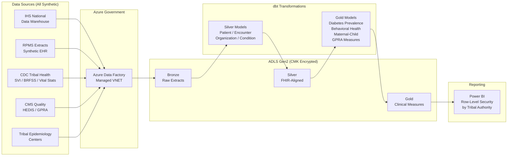

## IHS & Tribal Health Analytics on Azure Government

This use case implements a population health analytics platform for Indian Health Service (IHS) and tribal health programs. The architecture ingests synthetic clinical, demographic, and public health data through a medallion pipeline on Azure Government, producing GPRA measure dashboards, chronic disease surveillance, and behavioral health utilization reports — all governed by tribal data sovereignty policies and HIPAA Safe Harbor de-identification.

!!! info "Reference Implementation"
The complete working code for this domain lives in [`examples/tribal-health/`](../../examples/tribal-health/). This page explains the architecture, data sources, and step-by-step build process.

!!! warning "Synthetic Data Only"
**ALL data in this implementation is fully synthetic.** No real Protected Health Information (PHI), Personally Identifiable Information (PII), or actual tribal health records are used anywhere in this project. The synthetic generators produce statistically representative distributions based on published IHS and CDC aggregate statistics. Never substitute real patient data without completing a full HIPAA Security Risk Assessment, executing a Business Associate Agreement (BAA) with Microsoft, and obtaining tribal IRB approval.

---

## Architecture Overview

The platform follows a batch ingestion model through Azure Data Factory on Azure Government (FedRAMP High), landing raw files in ADLS Gen2 and transforming them through Bronze → Silver → Gold layers using dbt. Silver models align to HL7 FHIR R4 resource types. Gold models produce clinical quality measures with small cell suppression. Power BI enforces Row-Level Security by tribal authority.



---

## Data Sources

All sources listed below are either public reference datasets or fully synthetic generators included in the repository. No authenticated connections to IHS or tribal systems are required.

| Source                               | Type                     | Contents                                                   | Update Cadence |
| ------------------------------------ | ------------------------ | ---------------------------------------------------------- | -------------- |
| IHS National Data Warehouse (NDW)    | Synthetic generator      | Patient demographics, enrollment, service unit assignments | Quarterly      |
| RPMS Extracts                        | Synthetic CSV seeds      | Encounters, diagnoses (ICD-10), procedures (CPT), labs     | Monthly        |
| CDC Social Vulnerability Index (SVI) | Public download          | Census-tract vulnerability scores for tribal areas         | Annual         |
| CDC BRFSS                            | Public download          | Behavioral risk factor prevalence estimates                | Annual         |
| CDC Vital Statistics                 | Public download          | Birth/death rates, infant mortality, life expectancy       | Annual         |
| CMS HEDIS / GPRA Measures            | Reference specifications | Clinical quality measure definitions and benchmarks        | Annual         |
| Tribal Epidemiology Centers          | Synthetic generator      | Regional disease surveillance, outbreak reporting          | Quarterly      |

### Synthetic Data Generation

The repository includes two generators in `examples/tribal-health/data/generators/`:

- **`generate_tribal_health_data.py`** — produces patient demographics, facility rosters, and enrollment records with distributions matching published IHS aggregate statistics.
- **`generate_synthetic_clinical.py`** — produces encounter records, diagnoses, lab results, and procedures using ICD-10/CPT code distributions from public CDC and IHS reports.

---

## Step-by-Step Implementation

### 1. Azure Government Deployment (FedRAMP High)

Deploy the base infrastructure using the government-specific parameter file:

```bash
# Deploy to Azure Government (usgovvirginia)
az cloud set --name AzureUSGovernment

az deployment group create \
  --resource-group rg-tribal-health-gov \
  --template-file infra/main.bicep \
  --parameters examples/tribal-health/deploy/params.gov.json \
  --parameters environment=gov \
               azureRegion=usgovvirginia \
               enableCmk=true \
               enablePrivateEndpoints=true
```

The `params.gov.json` parameter file configures:

- Azure Government region (`usgovvirginia` or `usgovarizona`)
- Customer-managed keys (CMK) for ADLS Gen2 encryption at rest
- Private endpoints for all PaaS services (no public network access)
- Diagnostic settings shipping to Log Analytics for audit trails

### 2. HIPAA-Compliant Architecture

The deployment enforces HIPAA administrative, physical, and technical safeguards:

| Safeguard             | Implementation                                  | Azure Service                    |
| --------------------- | ----------------------------------------------- | -------------------------------- |
| Encryption at rest    | AES-256 with customer-managed keys              | Key Vault + ADLS Gen2            |
| Encryption in transit | TLS 1.2+ enforced on all endpoints              | Application Gateway / Front Door |
| Access control        | Microsoft Entra ID with Conditional Access, MFA | Azure Active Directory           |
| Audit logging         | All data-plane operations logged                | Monitor Diagnostic Settings      |
| Network isolation     | Private endpoints, no public IPs                | Private Link + NSGs              |
| Data Loss Prevention  | Sensitivity labels on PHI columns               | Microsoft Purview                |
| BAA coverage          | Microsoft BAA covers Azure Government services  | Azure Compliance Manager         |

!!! note "Business Associate Agreement"
Microsoft's BAA covers Azure Government services listed in the [HIPAA/HITRUST compliance documentation](https://learn.microsoft.com/en-us/azure/compliance/offerings/offering-hipaa-us). Verify your specific services are covered before processing any real PHI.

### 3. Tribal Data Sovereignty

Tribal data sovereignty is the principle that tribal nations retain ownership, control, and authority over data collected from their communities. This implementation enforces sovereignty through technical controls:

#### Row-Level Security by Tribal Authority

Every table in the Silver and Gold layers includes a `tribal_affiliation` column used to enforce access boundaries. Each tribal authority can only query records belonging to their community.

```sql
-- Row-Level Security policy for tribal data sovereignty
-- Applied via Databricks Unity Catalog or Synapse security policies

CREATE FUNCTION tribal_rls_filter(tribal_affiliation STRING)
RETURNS BOOLEAN
AS (
    -- Current user's tribal authority claim from Microsoft Entra ID
    tribal_affiliation = CURRENT_USER_ATTRIBUTE('tribal_authority')
    -- IHS Area Office users see their area's tribes
    OR CURRENT_USER_ATTRIBUTE('ihs_area_office') = GET_AREA_FOR_TRIBE(tribal_affiliation)
    -- Federal aggregate reporting role sees all (de-identified only)
    OR IS_MEMBER('role_federal_aggregate_reporting')
);

-- Apply to patient demographics
ALTER TABLE silver.slv_patient_demographics
SET ROW FILTER tribal_rls_filter ON (tribal_affiliation);

-- Apply to clinical encounters
ALTER TABLE silver.slv_encounters
SET ROW FILTER tribal_rls_filter ON (tribal_affiliation);

-- Apply to gold analytics
ALTER TABLE gold.gld_diabetes_prevalence
SET ROW FILTER tribal_rls_filter ON (service_unit);
```

#### Access Tiers

| Role                       | Scope             | Data Level                      | Purpose                     |
| -------------------------- | ----------------- | ------------------------------- | --------------------------- |
| Tribal Health Director     | Single tribe      | Patient-level (de-identified)   | Clinical program management |
| IHS Area Office            | Area tribes       | Aggregate by service unit       | Regional oversight          |
| Tribal Epidemiology Center | Affiliated tribes | Aggregate with cell suppression | Surveillance and research   |
| Federal Reporting          | All areas         | De-identified aggregate         | GPRA/Congress reporting     |

### 4. HL7 FHIR Alignment (Silver Layer)

Silver models standardize raw extracts into structures aligned with HL7 FHIR R4 resource types. This is not a full FHIR server — it is a dimensional model whose columns and semantics map to FHIR resources for interoperability.

| dbt Silver Model           | FHIR R4 Resource | Key Fields                                                                           |
| -------------------------- | ---------------- | ------------------------------------------------------------------------------------ |
| `slv_patient_demographics` | Patient          | `patient_id`, `gender`, `age_group`, `tribal_affiliation`, `eligibility_status`      |
| `slv_encounters`           | Encounter        | `encounter_id`, `patient_id`, `encounter_type`, `primary_dx_icd10`, `encounter_date` |
| `slv_facilities`           | Organization     | `facility_id`, `facility_name`, `service_unit`, `facility_type`                      |
| (future) `slv_conditions`  | Condition        | `condition_id`, `patient_id`, `icd10_code`, `onset_date`, `clinical_status`          |

#### Silver Patient Dimension (FHIR-Aligned)

The `slv_patient_demographics` model demonstrates the transformation pattern — standardizing codes, computing age bands for aggregate reporting, and adding HIPAA de-identification flags:

```sql
-- From examples/tribal-health/domains/dbt/models/silver/slv_patient_demographics.sql
-- Key transformation logic (simplified)

SELECT
    -- Surrogate key
    MD5(CONCAT_WS('|', patient_id, tribal_affiliation, service_unit)) AS patient_sk,

    patient_id,
    tribal_affiliation,       -- Used for RLS enforcement
    service_unit,

    -- Age band for aggregate reporting (not exact age — HIPAA Safe Harbor)
    age_group,
    CASE
        WHEN age_group IN ('0-4', '5-9', '10-14') THEN 'PEDIATRIC'
        WHEN age_group IN ('15-19') THEN 'ADOLESCENT'
        WHEN age_group IN ('20-24', '25-29', '30-34', '35-39', '40-44') THEN 'ADULT'
        WHEN age_group IN ('45-49', '50-54', '55-59', '60-64') THEN 'MIDDLE_AGED'
        WHEN age_group IN ('65-69', '70-74', '75-79', '80+') THEN 'ELDER'
        ELSE 'UNKNOWN'
    END AS age_band,

    -- De-identification flags (HIPAA Safe Harbor method)
    TRUE AS is_deidentified,
    FALSE AS contains_phi,
    FALSE AS contains_direct_identifiers,

    LEFT(zip_code, 3) AS zip3   -- 3-digit ZIP for de-identified reporting

FROM bronze.brz_patient_demographics
WHERE is_valid_record = TRUE
```

### 5. Clinical Analytics (Gold Layer)

Gold models aggregate Silver data into clinical quality measures. All Gold models enforce small cell suppression — any count below the configurable threshold (default: 5) is replaced with `NULL` to prevent re-identification of individuals in small populations.

#### Diabetes Prevalence

```sql
-- From examples/tribal-health/domains/dbt/models/gold/gld_diabetes_prevalence.sql
-- Prevalence calculation with small cell suppression (simplified)

SELECT
    service_unit,
    reporting_period,
    total_population,

    -- Suppress small cells
    CASE
        WHEN total_diabetic_patients >= {{ var('small_cell_threshold') }}
        THEN total_diabetic_patients
        ELSE NULL
    END AS total_diabetic_patients,

    -- Prevalence rate per 1,000 adult population
    CASE
        WHEN total_diabetic_patients >= {{ var('small_cell_threshold') }}
             AND adult_population > 0
        THEN ROUND(total_diabetic_patients::DECIMAL / adult_population * 1000, 1)
        ELSE NULL
    END AS prevalence_rate_per_1000,

    -- Complication sub-classification (ICD-10 E11.x)
    -- E11.6x = retinopathy, E11.2x = nephropathy, E11.4x = neuropathy
    complication_rate_pct,
    retinopathy_screening_pct,
    nephropathy_screening_pct,

    -- Year-over-year trend
    prevalence_trend   -- INCREASING / DECREASING / STABLE / INSUFFICIENT_DATA

FROM gold.gld_diabetes_prevalence
ORDER BY service_unit, reporting_period DESC
```

#### Behavioral Health

The `gld_behavioral_health` model tracks substance use disorder (SUD) and mental health service utilization. SUD data is 42 CFR Part 2 protected — this model includes SUD counts only in aggregate form with small cell suppression. Individual-level SUD data requires separate patient consent.

Metrics produced:

- Provider-to-population ratios by service unit
- Behavioral health ED utilization rates (high ED use signals access gaps)
- Crisis intervention volume and response times
- Waitlist depth and average wait-to-appointment days
- SUD vs. mental health encounter distribution (aggregate only)

#### Maternal and Child Health

The `gld_maternal_child_health` model tracks prenatal care adequacy, birth outcomes, childhood immunization rates, and well-child visit compliance against GPRA targets.

### 6. GPRA Clinical Measures

The Government Performance and Results Act (GPRA) measures are the primary clinical quality framework for IHS. Gold models map directly to GPRA measure specifications:

| GPRA Measure              | Gold Model                  | Key Metric                       | FY2024 Target      |
| ------------------------- | --------------------------- | -------------------------------- | ------------------ |
| Diabetes: A1C < 9.0%      | `gld_diabetes_prevalence`   | `a1c_poor_control_pct` (inverse) | ≤ 20% poor control |
| Diabetes: Eye Exam        | `gld_diabetes_prevalence`   | `retinopathy_screening_pct`      | ≥ 55%              |
| Diabetes: Kidney          | `gld_diabetes_prevalence`   | `nephropathy_screening_pct`      | ≥ 30%              |
| Depression Screening      | `gld_behavioral_health`     | `depression_screening_pct`       | ≥ 55%              |
| Prenatal in 1st Trimester | `gld_maternal_child_health` | `early_prenatal_pct`             | ≥ 65%              |
| Childhood Immunization    | `gld_maternal_child_health` | `childhood_immunization_pct`     | ≥ 40%              |

### 7. De-Identified Reporting and Cell Suppression

All aggregate reporting follows HIPAA Safe Harbor de-identification (45 CFR § 164.514(b)):

- **Age**: reported as bands (e.g., `PEDIATRIC`, `ADULT`, `ELDER`), never exact dates of birth
- **Geography**: 3-digit ZIP (`zip3`) only; full ZIP suppressed
- **Small cells**: any count < 5 replaced with `NULL`
- **Complementary suppression**: when only one cell in a row is suppressed, an additional cell is suppressed to prevent back-calculation
- **No direct identifiers**: no names, MRNs, SSNs, tribal enrollment numbers in any Gold table

```sql
-- Small cell suppression utility macro
-- Used across all Gold models


    CASE
        WHEN {{ column }} >= {{ threshold }} THEN {{ column }}
        ELSE NULL  -- Suppressed: count below threshold
    END

```

---

## Data Sovereignty

### Guiding Principles

This implementation follows tribal data sovereignty principles aligned with the [CARE Principles for Indigenous Data Governance](https://www.gida-global.org/care):

1. **Collective Benefit** — data collection and analytics serve the health priorities identified by tribal communities, not external research agendas.
2. **Authority to Control** — tribal nations determine who accesses their data, at what granularity, and for what purpose. RLS policies enforce this technically.
3. **Responsibility** — organizations handling tribal health data maintain transparency about data use and protect against re-identification.
4. **Ethics** — data practices respect cultural protocols, community consent processes, and tribal IRB requirements.

### Technical Enforcement

| Principle             | Technical Control                                                                      |
| --------------------- | -------------------------------------------------------------------------------------- |
| Tribal ownership      | `tribal_affiliation` column in all tables; RLS filters by Microsoft Entra ID claim     |
| Consent-based sharing | Data sharing agreements codified as RLS policy exceptions                              |
| Minimum necessary     | Role-based access tiers (tribal → area → federal) with decreasing granularity          |
| Audit trail           | All queries logged in Azure Monitor; tribal authorities can audit access to their data |
| Right to restrict     | Tribal authority can request removal of their data from aggregate federal datasets     |
| Cultural sensitivity  | Categories and terminology reviewed with tribal health boards                          |

### Data Sharing Agreements

Inter-tribal or tribal-to-federal data sharing is implemented as explicit RLS policy exceptions. No data flows between tribal boundaries without a codified agreement:

```sql
-- Example: Tribal Epidemiology Center data sharing agreement
-- TEC "Great Plains" authorized to access aggregates for affiliated tribes

CREATE FUNCTION tec_sharing_filter(tribal_affiliation STRING)
RETURNS BOOLEAN
AS (
    -- Base tribal access
    tribal_rls_filter(tribal_affiliation)
    -- TEC agreement: Great Plains TEC sees affiliated tribes (aggregate only)
    OR (
        IS_MEMBER('role_tec_great_plains')
        AND tribal_affiliation IN (
            SELECT tribe_name FROM ref.tec_affiliations
            WHERE tec_name = 'GREAT_PLAINS'
            AND agreement_status = 'ACTIVE'
            AND agreement_expiry > CURRENT_DATE()
        )
    )
);
```

---

## Power BI Configuration

### Row-Level Security in Power BI

Power BI Desktop roles mirror the database-level RLS policies:

1. **Create roles** in Power BI Desktop → Modeling → Manage Roles
2. **Define DAX filter**: `[tribal_affiliation] = USERPRINCIPALNAME()` (mapped via Microsoft Entra ID group claims)
3. **Publish** to Power BI Service on Azure Government (`app.powerbigov.us`)
4. **Assign** Microsoft Entra ID security groups to roles

### Dashboard Pages

| Page                  | Audience               | Content                                                   |
| --------------------- | ---------------------- | --------------------------------------------------------- |
| Tribal Health Summary | Tribal Health Director | KPIs, GPRA scorecard, trend sparklines                    |
| Diabetes Deep Dive    | Clinical staff         | Prevalence maps, A1C distributions, complication rates    |
| Behavioral Health     | BH program managers    | SUD/MH split, provider ratios, crisis volume              |
| Maternal-Child Health | MCH coordinators       | Prenatal adequacy, immunization rates, birth outcomes     |
| Federal GPRA Report   | IHS Area Office        | Cross-tribe aggregates (de-identified), target vs. actual |

---

## Cross-References

- [HIPAA Compliance Mapping](../compliance/hipaa-security-rule.md) — full safeguard-to-implementation mapping
- [Azure Government Service Matrix](../GOV_SERVICE_MATRIX.md) — FedRAMP High service availability
- [Architecture Overview](../ARCHITECTURE.md) — platform-wide medallion architecture
- [Data Factory Setup](../ADF_SETUP.md) — pipeline configuration and managed VNET integration
- [Cost Management](../COST_MANAGEMENT.md) — Azure Government pricing and reservation guidance

---

## Sources

| Reference                                      | URL                                                                                                        |
| ---------------------------------------------- | ---------------------------------------------------------------------------------------------------------- |
| IHS GPRA Measures                              | <https://www.ihs.gov/crs/>                                                                                 |
| CARE Principles for Indigenous Data Governance | <https://www.gida-global.org/care>                                                                         |
| HL7 FHIR R4 Patient Resource                   | <https://hl7.org/fhir/R4/patient.html>                                                                     |
| HIPAA Safe Harbor De-Identification            | <https://www.hhs.gov/hipaa/for-professionals/privacy/special-topics/de-identification/>                    |
| 42 CFR Part 2 (SUD Confidentiality)            | <https://www.ecfr.gov/current/title-42/chapter-I/subchapter-A/part-2>                                      |
| Azure Government FedRAMP High                  | <https://learn.microsoft.com/en-us/azure/azure-government/compliance/azure-services-in-fedramp-auditscope> |
| CDC Social Vulnerability Index                 | <https://www.atsdr.cdc.gov/place-health/php/svi/index.html>                                                |
| Microsoft HIPAA/HITRUST Compliance             | <https://learn.microsoft.com/en-us/azure/compliance/offerings/offering-hipaa-us>                           |
