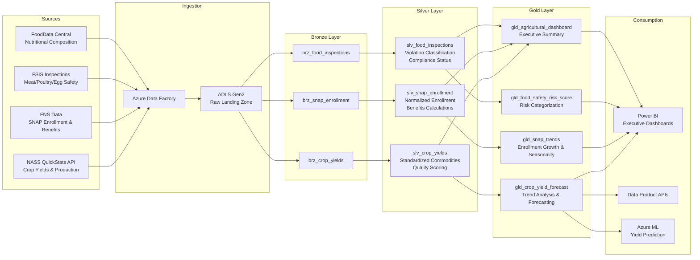
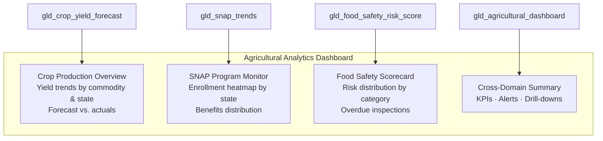

## USDA Agricultural Analytics on Azure

This use case covers the ingestion, transformation, and analysis of data from multiple USDA agencies — NASS, FNS, FSIS, and FoodData Central — using Azure Cloud Scale Analytics patterns. The implementation combines crop production statistics with nutrition assistance program data, food safety inspection records, and nutritional composition databases to produce yield forecasts, enrollment trend analysis, food safety risk scores, and agricultural dashboards.

!!! info "Reference Implementation"
The complete working code for this domain lives in [`examples/usda/`](../../examples/usda/). This page explains the architecture, data sources, and step-by-step build process.

---

## Architecture Overview

The platform follows a batch-first ingestion model. Azure Data Factory pulls data from USDA REST APIs and file-based sources into ADLS Gen2, where dbt models implement the Bronze-Silver-Gold medallion architecture. Gold-layer analytical models feed Power BI dashboards and downstream APIs.



---

## Data Sources

| Source                   | Agency                                   | Data Content                                                                                         | Format         | Update Frequency                           |
| ------------------------ | ---------------------------------------- | ---------------------------------------------------------------------------------------------------- | -------------- | ------------------------------------------ |
| **NASS QuickStats API**  | National Agricultural Statistics Service | Crop yields (bu/acre), planted & harvested acres, production volumes by commodity, state, and county | JSON (REST)    | Daily (current year), monthly (historical) |
| **FNS SNAP Data**        | Food and Nutrition Service               | SNAP enrollment counts, benefit amounts by state and county, household demographics                  | CSV (data.gov) | Monthly (2-month lag)                      |
| **FSIS Inspection Data** | Food Safety and Inspection Service       | Meat, poultry, and egg inspection results, violation records, establishment compliance status        | XML / CSV      | Daily batch                                |
| **FoodData Central**     | Agricultural Research Service            | Nutritional composition per food item, nutrient amounts, food categories                             | JSON (REST)    | Quarterly                                  |

!!! tip "API Registration"
NASS QuickStats API keys are free. Register at [quickstats.nass.usda.gov/api](https://quickstats.nass.usda.gov/api). The free tier allows 1,000 requests per day — sufficient for daily incremental loads but requires rate-limiting logic for historical backfills.

---

## Step-by-Step Walkthrough

### Step 1 — Ingest NASS Crop Data via QuickStats API

The ingestion script queries the NASS QuickStats REST API for crop yield, production, and acreage data. It supports multiple commodities (corn, soybeans, wheat, cotton, rice) and handles pagination, rate limiting, and error recovery.

```python
"""Fetch crop statistics from NASS QuickStats API."""
import requests
import time

NASS_BASE_URL = "https://quickstats.nass.usda.gov/api/api_GET/"

def fetch_crop_yields(
    api_key: str,
    commodity: str,
    states: list[str],
    years: list[int],
) -> list[dict]:
    """Retrieve yield data for a commodity across states and years."""
    records = []
    for state in states:
        for year in years:
            params = {
                "key": api_key,
                "source_desc": "SURVEY",
                "sector_desc": "CROPS",
                "group_desc": "FIELD CROPS",
                "commodity_desc": commodity,
                "statisticcat_desc": "YIELD",
                "state_alpha": state,
                "year": year,
                "agg_level_desc": "STATE",
                "format": "JSON",
            }
            resp = requests.get(NASS_BASE_URL, params=params, timeout=30)
            resp.raise_for_status()
            data = resp.json().get("data", [])
            records.extend(data)
            time.sleep(0.2)  # respect rate limits
    return records
```

!!! warning "Rate Limits"
The free-tier NASS API enforces 1,000 requests/day. Use the `--delay` flag on `fetch_nass.py` to throttle requests. For county-level backfills across all states, schedule the load across multiple days or request an elevated quota from NASS.

The full fetcher with multi-commodity support, CSV/JSON export, and connection testing is at [`examples/usda/data/open-data/fetch_nass.py`](../../examples/usda/data/open-data/fetch_nass.py).

### Step 2 — Build Bronze Layer (Raw Ingestion)

Bronze models preserve the raw API responses with minimal transformation. Each source lands in its own table with ingestion metadata for lineage tracking.

```sql
-- examples/usda/domains/dbt/models/bronze/brz_crop_yields.sql
SELECT
    source_system,
    ingestion_timestamp,
    raw_data,
    year,
    state_fips_code,
    county_code,
    commodity_desc,
    data_item,
    value,
    cv_pct,
    load_time,
    _source_file_name,
    _source_file_timestamp
FROM {{ source('usda_raw', 'crop_yields') }}
```

Three Bronze tables map to the primary source systems:

| Bronze Model           | Source          | Key Fields                                                  |
| ---------------------- | --------------- | ----------------------------------------------------------- |
| `brz_crop_yields`      | NASS QuickStats | `commodity_desc`, `state_fips_code`, `year`, `value`        |
| `brz_snap_enrollment`  | FNS SNAP        | `state_code`, `enrollment_date`, `persons`, `benefits`      |
| `brz_food_inspections` | FSIS            | `establishment_number`, `inspection_date`, `violation_type` |

### Step 3 — Build Silver Layer (Cleansed and Conformed)

Silver models standardize commodity names, validate numeric fields, flag outliers, and compute derived metrics. The crop yields model demonstrates the pattern:

```sql
-- examples/usda/domains/dbt/models/silver/slv_crop_yields.sql (excerpt)
standardized AS (
    SELECT
        MD5(CONCAT_WS('|',
            state_fips_code, county_code,
            commodity_desc, CAST(year AS STRING), data_item
        )) AS crop_yield_sk,

        -- Commodity standardization
        CASE
            WHEN UPPER(commodity_desc) LIKE '%CORN%'
                 AND UPPER(commodity_desc) NOT LIKE '%POPCORN%'
            THEN 'CORN'
            WHEN UPPER(commodity_desc) LIKE '%SOYBEAN%' THEN 'SOYBEANS'
            WHEN UPPER(commodity_desc) LIKE '%WHEAT%'   THEN 'WHEAT'
            ELSE UPPER(TRIM(commodity_desc))
        END AS commodity,

        -- Derived yield metric
        CASE
            WHEN UPPER(data_item) LIKE '%YIELD%'
            THEN CAST(value AS DECIMAL(10,2))
        END AS yield_per_acre,

        -- Quality flag
        CASE
            WHEN value ~ '^[0-9]+\.?[0-9]*$' THEN TRUE
            ELSE FALSE
        END AS is_valid,

        CURRENT_TIMESTAMP() AS _dbt_loaded_at
    FROM base
)
```

Key Silver-layer transformations:

- **Geographic standardization** — FIPS codes mapped to 2-letter state codes and county names
- **Commodity normalization** — raw `commodity_desc` values collapsed into canonical names
- **Outlier detection** — yield values flagged when they exceed 2 standard deviations from the 5-year rolling mean for the same state-commodity pair
- **Harvest efficiency** — `harvested_acres / planted_acres` computed to catch data-quality issues (ratio should not exceed 110%)

### Step 4 — Build Gold Layer: Crop Yield Forecasting

The yield forecast model computes 3-, 5-, and 10-year moving averages, year-over-year changes, trend classification, and a linear-regression-based next-year forecast with 95% confidence intervals.

```sql
-- examples/usda/domains/dbt/models/gold/gld_crop_yield_forecast.sql (excerpt)
trend_analysis AS (
    SELECT
        *,
        AVG(yield_per_acre) OVER (
            PARTITION BY state_code, commodity
            ORDER BY year ROWS BETWEEN 2 PRECEDING AND CURRENT ROW
        ) AS yield_3yr_avg,

        REGR_SLOPE(yield_per_acre, year) OVER (
            PARTITION BY state_code, commodity
            ORDER BY year ROWS BETWEEN 4 PRECEDING AND CURRENT ROW
        ) AS yield_5yr_trend_slope
    FROM base_yields
),

forecasting AS (
    SELECT
        *,
        ROUND(yield_3yr_avg + yield_5yr_trend_slope, 2)
            AS yield_forecast_next_year,

        CONCAT(
            ROUND(yield_3yr_avg - (1.96 * yield_5yr_stddev), 1),
            ' - ',
            ROUND(yield_3yr_avg + (1.96 * yield_5yr_stddev), 1)
        ) AS yield_95pct_confidence_interval
    FROM trend_analysis
)
```

!!! tip "Forecast Method"
The default forecast uses linear trend extrapolation from 5-year slopes. For production workloads, integrate Azure ML to train ARIMA or Prophet models on the Silver-layer time series and write predictions back to the Gold table via the `yield_forecast_next_year` column.

### Step 5 — Build Gold Layer: SNAP Enrollment Trends

The SNAP trends model aggregates county-level enrollment to state-level monthly totals, then computes year-over-year growth, 3- and 12-month rolling averages, seasonal adjustments, and enrollment volatility.

```sql
-- Query: States with fastest-growing SNAP enrollment
SELECT
    state_code,
    enrollment_date,
    current_enrollment,
    enrollment_change_1yr,
    enrollment_trend,
    enrollment_3mo_avg,
    avg_benefits_per_person
FROM gold.gld_snap_trends
WHERE is_latest_month = TRUE
ORDER BY enrollment_change_1yr DESC
LIMIT 10;
```

The model classifies each state-month as `INCREASING` (>5% YoY growth), `DECREASING` (<-5%), or `STABLE`, and includes placeholder columns for economic correlation (unemployment rate, median income, poverty rate) to support future enrichment.

### Step 6 — Build Gold Layer: Food Safety Risk Scoring

The risk scoring model computes a composite 0-100 score for each FSIS-inspected establishment based on three weighted components:

| Component          | Weight | Scoring Logic                                          |
| ------------------ | ------ | ------------------------------------------------------ |
| Violation history  | 40%    | 12-month violation rate mapped to 0-100 scale          |
| Inspection recency | 30%    | Days since last inspection — longer gaps increase risk |
| Violation severity | 30%    | Critical/moderate/minor breakdown with recency decay   |

The composite score is adjusted by industry multiplier (slaughter facilities 1.2x, retail 0.9x) and establishment size, then categorized into five tiers: `CRITICAL`, `HIGH`, `MODERATE`, `LOW`, `MINIMAL`.

```sql
-- Query: Establishments requiring immediate inspection
SELECT
    establishment_number,
    establishment_name,
    state_code,
    adjusted_risk_score,
    adjusted_risk_category,
    recommended_action,
    days_since_last_inspection,
    critical_violations,
    compliance_rate
FROM gold.gld_food_safety_risk_score
WHERE adjusted_risk_category IN ('CRITICAL', 'HIGH')
ORDER BY adjusted_risk_score DESC;
```

!!! warning "Score Reliability"
The `is_risk_score_reliable` flag is `TRUE` only when an establishment has 3+ inspections within the last 12 months. New or infrequently inspected establishments may have artificially low scores. Filter on this flag for enforcement-priority dashboards.

---

## Gold Layer Data Products

| Data Product           | dbt Model                    | Key Metrics                                                                                  | Refresh |
| ---------------------- | ---------------------------- | -------------------------------------------------------------------------------------------- | ------- |
| Crop Yield Forecast    | `gld_crop_yield_forecast`    | `yield_per_acre`, `yield_3yr_avg`, `yield_forecast_next_year`, `yield_trend_5yr`             | Daily   |
| SNAP Enrollment Trends | `gld_snap_trends`            | `current_enrollment`, `enrollment_change_1yr`, `enrollment_trend`, `avg_benefits_per_person` | Monthly |
| Food Safety Risk Score | `gld_food_safety_risk_score` | `adjusted_risk_score`, `adjusted_risk_category`, `compliance_rate`, `recommended_action`     | Weekly  |
| Agricultural Dashboard | `gld_agricultural_dashboard` | Cross-domain KPIs for executive reporting                                                    | Daily   |

---

## Dashboard Design

The Power BI executive dashboard surfaces four analytical views:



---

## Deployment

!!! warning "Cost"
This vertical deploys real Azure resources. A running environment costs approximately **$180-300/day** (Synapse, Databricks, ADF, Storage, Key Vault). Always run `teardown.sh` when finished. See [`examples/usda/deploy/teardown.sh`](../../examples/usda/deploy/teardown.sh).

```bash
# Deploy infrastructure
az deployment group create \
  --resource-group rg-usda-analytics \
  --template-file deploy/bicep/DLZ/main.bicep \
  --parameters @examples/usda/deploy/params.dev.json

# Run dbt pipeline
cd examples/usda/domains/dbt
dbt seed && dbt run && dbt test
```

Two parameter files are provided: `params.dev.json` for commercial Azure and `params.gov.json` for Azure Government (IL4/IL5).

---

## Cross-References

- **Reference implementation** — [`examples/usda/`](../../examples/usda/) contains all dbt models, ingestion scripts, data contracts, seed data, and deployment parameters
- **Architecture deep-dive** — [`examples/usda/ARCHITECTURE.md`](../../examples/usda/ARCHITECTURE.md) covers security, DR, cost optimization, and future ML integration
- **Geoanalytics** — Combine with [spatial analysis patterns](index.md) for county-level crop yield mapping and precision agriculture overlays
- **Related verticals** — [EPA Environmental Analytics](epa-environmental-analytics.md) and [NOAA Climate Analytics](noaa-climate-analytics.md) share geographic and environmental data that correlates with agricultural outcomes

---

## Data Sources and API References

| Resource                      | URL                                                                                                                            |
| ----------------------------- | ------------------------------------------------------------------------------------------------------------------------------ |
| NASS QuickStats API           | [quickstats.nass.usda.gov/api](https://quickstats.nass.usda.gov/api)                                                           |
| NASS QuickStats Web Interface | [quickstats.nass.usda.gov](https://quickstats.nass.usda.gov/)                                                                  |
| FoodData Central API          | [fdc.nal.usda.gov](https://fdc.nal.usda.gov/)                                                                                  |
| FNS SNAP Data (data.gov)      | [catalog.data.gov/dataset/snap-data](https://catalog.data.gov/dataset?q=SNAP&sort=score+desc%2C+name+asc&tags=food-assistance) |
| FSIS Inspection Data          | [www.fsis.usda.gov/science-data](https://www.fsis.usda.gov/science-data)                                                       |
| USDA ERS Data Products        | [ers.usda.gov/data-products](https://www.ers.usda.gov/data-products/)                                                          |
