## USPS Postal Operations Analytics on Azure

The United States Postal Service operates the largest civilian logistics network in the world — 34,000+ post offices, 230,000+ delivery routes, 160 million delivery points, and roughly 127 billion mail pieces processed annually. The operational data generated across this network — delivery scan events, facility throughput metrics, mail volume counts by product class, and address-level geographic records — represents a high-value analytical corpus that is largely underutilized outside of internal USPS reporting.

This use case applies the CSA-in-a-Box medallion architecture to USPS public data sources, combining Web Tools API outputs, quarterly service performance reports, Census ZCTA geographic boundaries, USPS Facts & Figures statistical publications, and OpenAddresses geocoding records. The result is an analytics platform capable of last-mile route optimization, seasonal volume forecasting, facility utilization analysis, and ZIP code market segmentation — built entirely on publicly available data.

---

## Data Sources

| Source | Description | Volume / Coverage | Update Frequency | Access Method |
|---|---|---|---|---|
| **USPS Web Tools APIs** | Address validation (Verify API), city/state lookup, ZIP code lookup, package tracking (TrackV2), and domestic rate calculation (RateV4) | 160M+ delivery points, 41K+ ZIP codes | On-demand | XML REST API (free User ID required) |
| **Service Performance Reports** | Quarterly on-time delivery rates by product class (First-Class, Priority, Marketing Mail) and postal district | All 67 postal districts, 7 product classes | Quarterly | PDF / spreadsheet download |
| **Census ZCTA Boundaries** | ZIP Code Tabulation Areas from TIGER/Line shapefiles with demographic overlays from the American Community Survey | 33,000+ ZCTAs, national coverage | Annual (decennial base) | Shapefile / REST API |
| **USPS Facts & Figures** | Annual operational statistics: total mail volume, revenue by product, facility counts, employee headcount, vehicle fleet size | Historical data back to 2000 | Annual | Web / downloadable datasets |
| **OpenAddresses** | Community-sourced address point data with latitude/longitude coordinates for geocoding and delivery point validation | 500M+ address points globally, US focus | Continuous community updates | Bulk download (CSV/GeoJSON) |

!!! info "API Registration"
    The USPS Web Tools APIs require a free User ID obtained through the [USPS Web Tools Registration](https://www.usps.com/business/web-tools-apis/). Rate limits are approximately 5 requests per second for individual operations; the batch Address Validation API supports up to 5 addresses per call. Census TIGER/Line data is freely available via the [TIGERweb REST API](https://tigerweb.geo.census.gov/arcgis/rest/services).

---

## Architecture

The architecture follows a batch ingestion pattern. USPS Web Tools API responses, service performance report extracts, Census ZCTA shapefiles, USPS Facts & Figures datasets, and OpenAddresses geocoding files are all ingested through Azure Data Factory into ADLS Gen2 bronze. dbt models handle silver-layer cleansing (address standardization, product class normalization, on-time flag calculation) and gold-layer analytics (route optimization scoring, volume forecasting, facility utilization). Power BI consumes gold-layer tables for operational dashboards.

```mermaid
graph LR
    subgraph External Sources
        A[USPS Web Tools APIs<br/>Address, ZIP, Tracking]
        B[Service Performance<br/>Quarterly Reports]
        C[Census ZCTA<br/>TIGER/Line Boundaries]
        D[USPS Facts & Figures<br/>Annual Statistics]
        E[OpenAddresses<br/>Geocoding Points]
    end

    subgraph Ingestion
        F[Azure Data Factory<br/>REST + File Pipelines]
    end

    subgraph "ADLS Gen2 — Medallion Architecture"
        G[Bronze<br/>Raw JSON/XML/CSV]
        H[dbt Silver<br/>Cleaned & Conformed]
        I[dbt Gold<br/>Analytics-Ready]
    end

    subgraph Consumption
        J[Power BI<br/>Operations Dashboards]
        K[Jupyter Notebooks<br/>Forecasting & Optimization]
        L[Azure SQL<br/>Data Product APIs]
    end

    A --> F
    B --> F
    C --> F
    D --> F
    E --> F
    F --> G
    G --> H
    H --> I
    I --> J
    I --> K
    I --> L
```



---

## Step-by-Step Implementation

### 1. API Ingestion and Raw Data Landing

Data Factory pipelines handle three ingestion patterns:

- **REST API extraction**: USPS Web Tools API calls for address validation, city/state lookups, and ZIP code geography. Responses arrive as XML, parsed and stored as JSON in bronze.
- **File-based ingestion**: Service performance PDFs/spreadsheets and USPS Facts & Figures datasets are downloaded, parsed, and landed as CSV in bronze.
- **Geospatial ingestion**: Census TIGER/Line shapefiles and OpenAddresses CSV/GeoJSON files are loaded through ADF file connectors with schema inference.

All raw data lands in ADLS Gen2 under a `bronze/usps/` partition structure organized by source and ingestion date.

!!! tip "Batch Address Validation"
    The USPS Verify API supports batching up to 5 addresses per request. For bulk validation workloads, the `fetch_usps_data.py` script in `examples/usps/data/open-data/` implements automatic batching with configurable rate limiting (default 0.3s delay between calls).

### 2. Bronze Layer — Raw Data Preservation

Bronze dbt models (`brz_delivery_performance`, `brz_facility_operations`, `brz_mail_volume`) land raw records with source-system metadata, ingestion timestamps, and record hashes for deduplication. No business logic is applied at this layer.

Key bronze tables:

| Model | Source | Grain | Partition Strategy |
|---|---|---|---|
| `brz_delivery_performance` | Synthetic delivery scans | One row per delivery event | `product_class`, `acceptance_year` |
| `brz_facility_operations` | USPS Facts & Figures | One row per facility-month | `facility_type` |
| `brz_mail_volume` | USPS Facts & Figures | One row per product-class-day | `product_class` |

### 3. Silver Layer — Cleansing and Conforming

Silver models apply address standardization, product class normalization, on-time delivery flag computation, and geographic enrichment. The `slv_delivery_performance` model demonstrates the core transformation pattern:

- **ZIP code standardization**: Left-padded to 5 digits, 3-digit Sectional Center Facility (SCF) code derived for routing analysis.
- **Product class normalization**: Aliases mapped to canonical values (`FC` → `FIRST_CLASS`, `PM` → `PRIORITY`, `PS` → `PARCEL_SELECT`, etc.).
- **On-time flag**: Computed by comparing actual delivery date against expected delivery date or service standard (e.g., 3 days for First-Class, 2 days for Priority).
- **Intra-SCF and intra-state flags**: Derived for local vs. cross-country routing segmentation.
- **Surrogate keys**: MD5 hash of tracking ID and acceptance date for incremental merge.

### 4. Gold Layer — Last-Mile Route Optimization

The `gld_route_optimization` model scores 230,000+ carrier routes on a 0–100 efficiency scale using four weighted factors:

| Factor | Weight | Scoring Logic |
|---|---|---|
| Volume density (stops/day) | 30% | ≥100 stops = 100 pts, ≥75 = 85, ≥50 = 70, ≥25 = 50, ≥10 = 30, <10 = 15 |
| On-time delivery rate | 30% | Direct percentage (capped at 100) |
| First-attempt delivery rate | 20% | ≤1.05 avg attempts = 100, ≤1.10 = 80, ≤1.20 = 60, ≤1.30 = 40, >1.30 = 20 |
| Delivery speed vs. standard | 20% | ≤1 day = 100, ≤2 = 85, ≤3 = 70, ≤5 = 50, >5 = 25 |

Routes are classified into optimization categories (`WELL_OPTIMIZED`, `ADEQUATE`, `NEEDS_IMPROVEMENT`, `HIGH_OPTIMIZATION_POTENTIAL`) with specific action recommendations:

- `REDUCE_REDELIVERY_RATE` — routes with >1.20 average delivery attempts
- `CONSIDER_ROUTE_CONSOLIDATION` — routes with <25 stops per day
- `IMPROVE_ON_TIME_PERFORMANCE` — routes below 80% on-time rate
- `SEPARATE_PARCEL_ROUTE` — parcel-heavy routes (>50% parcels, avg weight >32 oz)

### 5. Gold Layer — Seasonal Volume Forecasting

The `gld_volume_forecast` model decomposes mail volume time series by product class and region into trend, seasonal, and residual components. It identifies:

- **Peak periods**: Holiday mailing surge (November–December), tax season (March–April), election mail cycles
- **Secular trends**: Year-over-year volume decline in First-Class Mail, growth in parcel volume
- **Staffing signals**: Resource allocation recommendations based on forecast volume and historical throughput

### 6. Gold Layer — Facility Utilization Analysis

The `gld_facility_analysis` model evaluates processing facility performance across 34,000+ post offices and 200+ distribution centers:

- **Utilization rate**: Actual throughput vs. rated capacity, flagging facilities consistently above 95% (overcapacity risk) or below 40% (consolidation candidate)
- **Catchment area overlap**: Geographic analysis identifying facilities with overlapping service areas suitable for consolidation
- **Equipment utilization**: Sorting machine and vehicle fleet usage rates by facility

### 7. ZIP Code Market Analytics

By joining silver delivery data with Census ZCTA demographic overlays, the platform enables market segmentation at the ZIP code level:

- Delivery density (pieces per household per day) by ZIP
- Product class mix (letter vs. parcel ratio) by demographic profile
- Service quality variance across urban, suburban, and rural ZCTAs

---

## Code Samples

### Python — USPS Web Tools API Address Validation

The `fetch_usps_data.py` script in `examples/usps/data/open-data/` provides a complete USPS API client. The address validation method demonstrates the XML-based request pattern:

```python
from examples.usps.data.open_data.fetch_usps_data import USPSDataFetcher

fetcher = USPSDataFetcher(api_key="YOUR_USPS_USER_ID")

# Validate a batch of addresses (up to 5 per API call)
addresses = [
    {
        "address2": "1600 Pennsylvania Ave NW",
        "city": "Washington",
        "state": "DC",
        "zip5": "20500"
    },
    {
        "address2": "31 Center Drive",
        "city": "Bethesda",
        "state": "MD",
        "zip5": "20892"
    }
]

results = fetcher.validate_address(addresses)
for addr in results:
    if addr["is_valid"]:
        print(f"{addr['Address2']}, {addr['City']}, {addr['State']} {addr['Zip5']}-{addr.get('Zip4', '')}")
    else:
        print(f"Invalid: {addr.get('error', 'Unknown error')}")
```

The underlying API call builds an XML request and sends it to `https://secure.shippingapis.com/ShippingAPI.dll`:

```python
# Internal request structure (from USPSDataFetcher.validate_address)
xml_request = (
    f'<AddressValidateRequest USERID="{api_key}">'
    f'  <Address ID="0">'
    f'    <Address1></Address1>'
    f'    <Address2>1600 Pennsylvania Ave NW</Address2>'
    f'    <City>Washington</City>'
    f'    <State>DC</State>'
    f'    <Zip5>20500</Zip5>'
    f'    <Zip4></Zip4>'
    f'  </Address>'
    f'</AddressValidateRequest>'
)

response = requests.get(
    "https://secure.shippingapis.com/ShippingAPI.dll",
    params={"API": "Verify", "XML": xml_request},
    timeout=30
)
```

### dbt — Silver Delivery Performance Model

The `slv_delivery_performance` model standardizes raw delivery records with product class normalization and on-time flag computation:

```sql
-- From examples/usps/domains/dbt/models/silver/slv_delivery_performance.sql
{{ config(
    materialized='incremental',
    unique_key='delivery_sk',
    tags=['silver', 'delivery_performance', 'cleaned']
) }}

WITH base AS (
    SELECT * FROM {{ ref('brz_delivery_performance') }}
    WHERE is_valid_record = TRUE
    
        AND _dbt_loaded_at > (SELECT MAX(_dbt_loaded_at) FROM {{ this }})
    
),

standardized AS (
    SELECT
        MD5(CONCAT_WS('|', tracking_id, CAST(acceptance_date AS STRING))) AS delivery_sk,
        tracking_id,
        carrier_route,

        -- ZIP code standardization (left-pad to 5 digits)
        LPAD(LEFT(TRIM(origin_zip), 5), 5, '0') AS origin_zip,
        LPAD(LEFT(TRIM(destination_zip), 5), 5, '0') AS destination_zip,

        -- Product class normalization
        CASE UPPER(TRIM(product_class))
            WHEN 'FC' THEN 'FIRST_CLASS'
            WHEN 'PM' THEN 'PRIORITY'
            WHEN 'PME' THEN 'PRIORITY_EXPRESS'
            WHEN 'PS' THEN 'PARCEL_SELECT'
            WHEN 'MM' THEN 'MEDIA_MAIL'
            WHEN 'MKT' THEN 'MARKETING_MAIL'
            ELSE UPPER(TRIM(product_class))
        END AS product_class,

        -- On-time delivery flag
        CASE
            WHEN actual_delivery_date <= expected_delivery_date THEN TRUE
            ELSE FALSE
        END AS is_on_time,

        DATEDIFF(actual_delivery_date, acceptance_date) AS calculated_delivery_days,
        CURRENT_TIMESTAMP() AS _dbt_loaded_at

    FROM base
)

SELECT * FROM standardized
```

### SQL — Delivery Performance Dashboard Query

A typical Power BI dataset query aggregating gold-layer route optimization data for an operations dashboard:

```sql
-- District-level delivery performance summary
-- Feeds Power BI operations dashboard
SELECT
    r.district,
    r.region,
    r.analysis_year,
    r.analysis_month,

    -- Volume metrics
    COUNT(DISTINCT r.route_id) AS total_routes,
    SUM(r.total_deliveries) AS total_deliveries,
    ROUND(AVG(r.stops_per_day), 1) AS avg_stops_per_day,

    -- Performance metrics
    ROUND(AVG(r.on_time_rate_pct), 1) AS avg_on_time_rate,
    ROUND(AVG(r.avg_delivery_days), 2) AS avg_delivery_days,
    ROUND(AVG(r.avg_delivery_attempts), 3) AS avg_delivery_attempts,

    -- Efficiency distribution
    SUM(CASE WHEN r.optimization_category = 'HIGH_OPTIMIZATION_POTENTIAL' THEN 1 ELSE 0 END) AS high_potential_routes,
    SUM(CASE WHEN r.optimization_category = 'NEEDS_IMPROVEMENT' THEN 1 ELSE 0 END) AS needs_improvement_routes,
    SUM(CASE WHEN r.optimization_category = 'WELL_OPTIMIZED' THEN 1 ELSE 0 END) AS well_optimized_routes,

    -- Estimated savings
    SUM(r.estimated_savings_minutes) AS total_savings_minutes,
    ROUND(SUM(r.estimated_savings_minutes) / 60.0, 1) AS total_savings_hours

FROM gold.gld_route_optimization r
WHERE r.analysis_year = YEAR(CURRENT_DATE)
GROUP BY r.district, r.region, r.analysis_year, r.analysis_month
ORDER BY avg_on_time_rate ASC
```

---

## Power BI Dashboards

The gold-layer models feed three primary dashboard surfaces:

**1. National Operations Dashboard**

- Delivery performance heatmap by district (67 districts, color-coded by on-time rate)
- Product class on-time trend lines with quarterly service standard targets
- Volume trend charts with seasonal forecast overlay
- District and region scorecards with drill-through to route-level detail

**2. Route Planning Console**

- Route efficiency ranking table (sortable by optimization score, stops/day, on-time rate)
- Geographic stop density visualization using ZCTA centroids
- Optimization category distribution (pie chart: well-optimized vs. needs-improvement)
- Estimated savings waterfall chart by recommendation type

**3. Facility Capacity Report**

- Processing plant utilization gauges (threshold alerts at 85% and 95%)
- Throughput trend by facility type (post office, distribution center, hub)
- Consolidation candidate map with catchment area overlap visualization
- Equipment utilization breakdown by sorting machine type

---

## Data Quality and Validation

dbt tests enforce data integrity at each layer:

```yaml
# From examples/usps/domains/dbt/models/schema.yml
models:
  - name: slv_delivery_performance
    columns:
      - name: delivery_sk
        tests:
          - unique
          - not_null
      - name: origin_zip
        tests:
          - not_null
          - dbt_utils.length_equal_to:
              length: 5
      - name: product_class
        tests:
          - accepted_values:
              values: ['FIRST_CLASS', 'PRIORITY', 'PRIORITY_EXPRESS',
                       'PARCEL_SELECT', 'MEDIA_MAIL', 'MARKETING_MAIL',
                       'PERIODICALS']
      - name: is_on_time
        tests:
          - not_null:
              where: "delivery_status = 'DELIVERED'"
```

!!! warning "Synthetic Data"
    The `examples/usps/` implementation uses synthetic delivery records generated by `examples/usps/data/generators/generate_usps_data.py`. Volume counts and performance rates approximate real-world distributions but are not actual USPS operational data. Service performance baselines are derived from publicly reported quarterly figures.

---

## Deployment

The example includes environment-specific parameter files for both commercial and government Azure regions:

| File | Target Environment | Notes |
|---|---|---|
| `examples/usps/deploy/params.dev.json` | Commercial Azure (dev) | Standard ADLS + Databricks deployment |
| `examples/usps/deploy/params.gov.json` | Azure Government | FedRAMP-compliant endpoints, Gov cloud region mappings |
| `examples/usps/deploy/teardown.sh` | Cleanup | Removes all deployed resources |

!!! note "Government Cloud"
    For federal agency deployments, the `params.gov.json` configuration targets Azure Government regions with FedRAMP High-compliant service endpoints. USPS operational data, while largely public, may require FISMA controls when combined with route-level carrier performance or individual tracking records.

---

## Cross-References

| Resource | Description |
|---|---|
| [`examples/usps/`](../../examples/usps/) | Complete example implementation — dbt models, data generators, API fetcher, deployment configs |
| [`examples/usps/ARCHITECTURE.md`](../../examples/usps/ARCHITECTURE.md) | Detailed architecture document with security, partitioning, and monitoring specifications |
| [`examples/usps/notebooks/`](../../examples/usps/notebooks/) | Jupyter notebooks for delivery optimization and volume forecasting analysis |
| [`examples/usps/contracts/`](../../examples/usps/contracts/) | Data contracts for delivery analytics, mail volume, and facility operations |
| [NOAA Climate Analytics](noaa-climate-analytics.md) | Related use case demonstrating similar medallion architecture with environmental data |
| [EPA Environmental Analytics](epa-environmental-analytics.md) | Related federal agency analytics use case |

---

## Sources

| Resource | URL |
|---|---|
| USPS Web Tools API Registration | <https://www.usps.com/business/web-tools-apis/> |
| USPS Web Tools API Technical Documentation | <https://www.usps.com/business/web-tools-apis/documentation-updates.htm> |
| USPS Address Validation API (Verify) | <https://www.usps.com/business/web-tools-apis/address-information-api.htm> |
| USPS Package Tracking API (TrackV2) | <https://www.usps.com/business/web-tools-apis/track-and-confirm-api.htm> |
| USPS Service Performance Reports | <https://about.usps.com/what/performance/service-performance/> |
| USPS Facts & Figures | <https://facts.usps.com/> |
| Census TIGER/Line Shapefiles (ZCTA) | <https://www.census.gov/geographies/mapping-files/time-series/geo/tiger-line-file.html> |
| TIGERweb REST API | <https://tigerweb.geo.census.gov/arcgis/rest/services> |
| Census Geocoder | <https://geocoding.geo.census.gov/geocoder/> |
| OpenAddresses Project | <https://openaddresses.io/> |
| American Community Survey (ACS) | <https://www.census.gov/programs-surveys/acs> |
