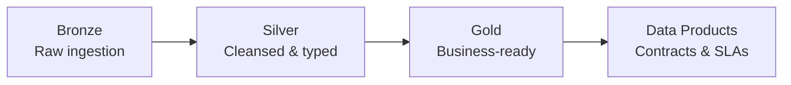

# Data Domains — Data Mesh Ownership

> **Federation model:** This repo follows the contract-driven mesh
> federation model described in
> [ADR-0012](../docs/adr/0012-data-mesh-federation.md) — each domain
> publishes a `contract.yaml`, CI validates, Purview registers, the
> portal marketplace surfaces.


> [!TIP]
> **TL;DR** — Data Mesh implementation with domain-owned data models, pipelines, and contracts. Each domain follows the medallion architecture (Bronze → Silver → Gold) using dbt on Delta Lake.

This directory implements the **Data Mesh** pattern: each subdirectory is a domain that owns
its data models, pipelines, contracts, and quality rules. All domains follow the **medallion
architecture** (Bronze → Silver → Gold) using dbt on Delta Lake.

## Table of Contents

- [Domains](#-domains)
- [Domain Structure](#-domain-structure)
- [Getting Started](#-getting-started)
- [Key Concepts](#-key-concepts)
- [Related Documentation](#-related-documentation)

---

## 📋 Domains

| Domain | Description |
|--------|-------------|
| [finance/](finance/) | Financial reporting — budgets, actuals, forecasts |
| [sales/](sales/) | Revenue and sales analytics |
| [inventory/](inventory/) | Inventory tracking and supply chain |
| [shared/](shared/) | Cross-domain models, shared dbt macros, and data product contracts |
| [dlz/](dlz/) | Data Landing Zone configuration and storage layout |
| [spark/](spark/) | PySpark utilities and GeoAnalytics Engine integration |

---

## 📁 Domain Structure

Each domain follows this layout:

```text
domains/{domain}/
├── dbt/              # dbt models (Bronze / Silver / Gold layers)
├── notebooks/        # Databricks / Synapse analytics notebooks
├── data-products/    # Published data product definitions
└── pipelines/        # ADF / Synapse pipeline definitions (if applicable)
```

---

## 🚀 Getting Started

1. Run `make setup` (or `make setup-win`) to install dependencies
2. Start with `domains/shared/dbt/` to understand the base models and macros
3. Run `make test-dbt` to validate dbt compilation across all domains
4. Explore a specific domain (e.g., `domains/finance/dbt/models/`) for examples

---

## 💡 Key Concepts



| Layer | Description |
|-------|-------------|
| **Bronze** | Raw ingestion, schema-on-read, append-only |
| **Silver** | Cleansed, conformed, deduplicated, typed |
| **Gold** | Business-ready aggregates, KPIs, and analytics views |
| **Data Products** | Published Gold-layer datasets with contracts and SLAs |

---

## 🔗 Related Documentation

- [Developer Pathways](../docs/DEVELOPER_PATHWAYS.md) — Role-based onboarding guide
- [Architecture](../docs/ARCHITECTURE.md) — System architecture reference
- [Examples](../examples/README.md) — Industry vertical implementations using these domains
