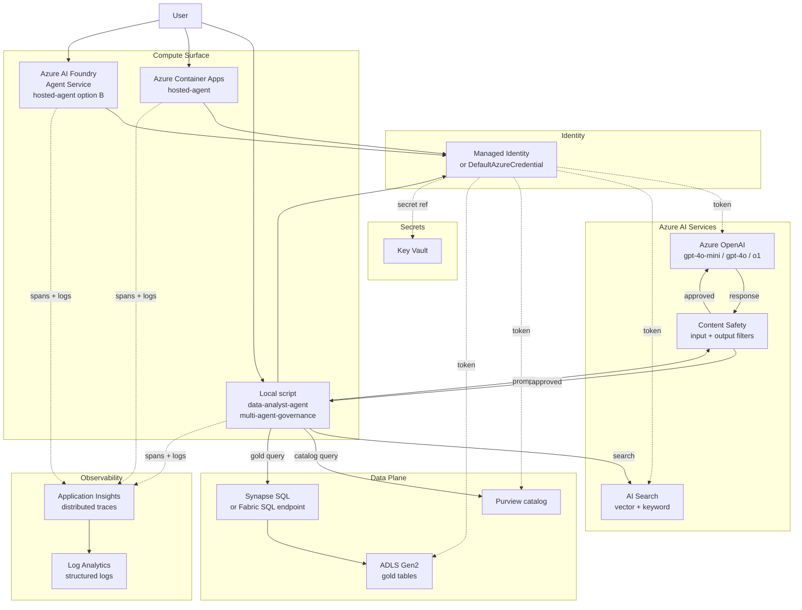
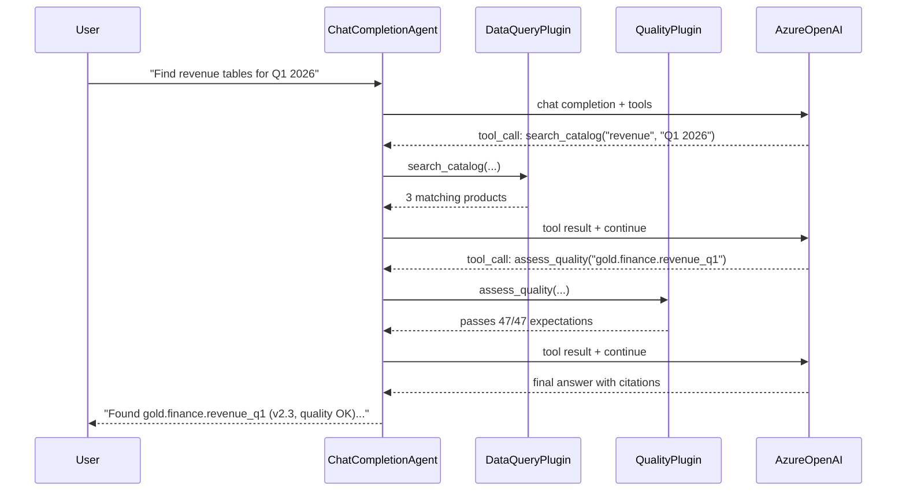
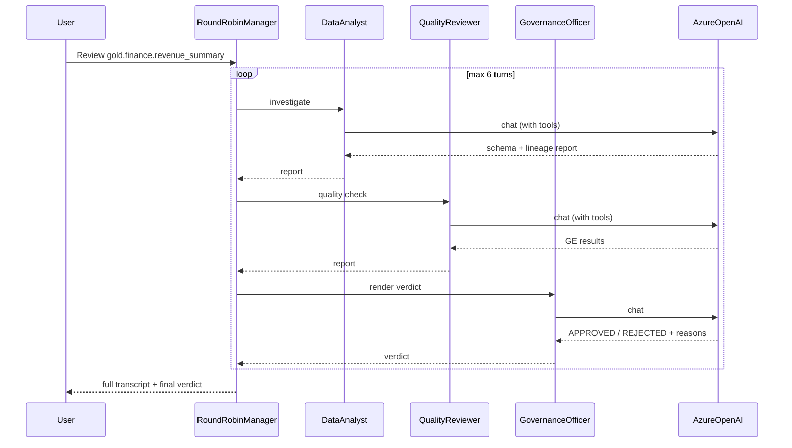
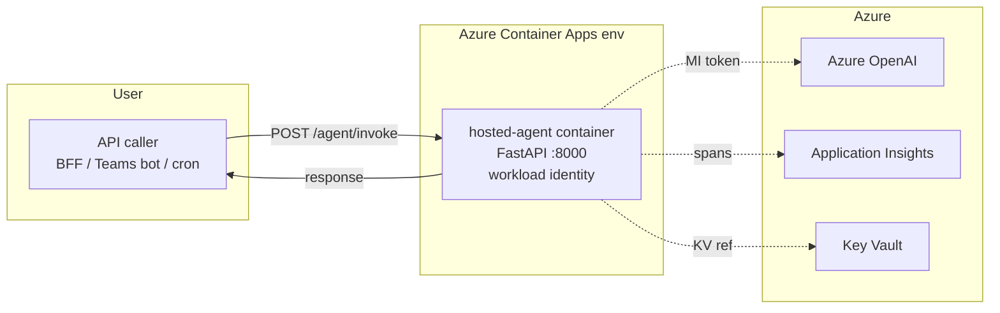
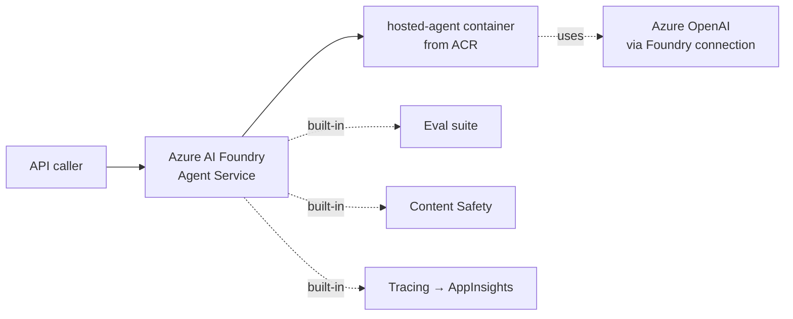
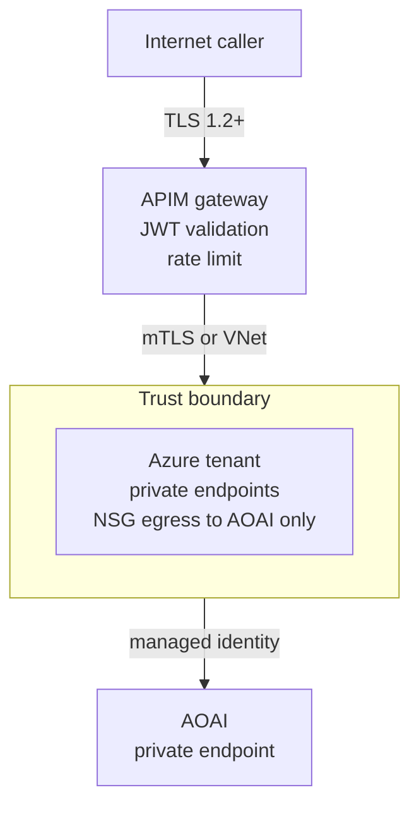

# Architecture — AI Agents on Azure

> **Status:** Three production-shaped agent patterns. Single agent and multi-agent run anywhere Python runs (laptop, Container Apps, AKS). Hosted agent deploys to Azure AI Foundry Agent Service.

## High-level

## Pattern 1 — Single agent (`data-analyst-agent/`)

**Topology**: 1 agent + 2 plugins, all in one process. 5 round-trips to AOAI (1 entry + 2 tool calls + 2 follow-ups) for a typical question.

## Pattern 2 — Multi-agent governance (`multi-agent-governance/`)

**Topology**: 3 agents collaborating via in-process orchestrator. Each agent has its own tool surface; manager drives turn-taking. 12-20 AOAI calls per review.

## Pattern 3 — Hosted agent (`hosted-agent/`)

Two deployment options:

### Option A — Container Apps + Workload Identity

### Option B — Foundry Agent Service

Foundry Agent Service adds eval + content safety + tracing without extra code, at the cost of region/Gov availability (check current GA status).

## Identity & secrets flow

| Resource | Auth |
|----------|------|
| Azure OpenAI | Managed identity → `Cognitive Services OpenAI User` role on the AOAI resource |
| AI Search | Managed identity → `Search Index Data Reader` |
| Purview | Managed identity → `Purview Reader` (or finer-grained collection role) |
| ADLS / Synapse | Managed identity → `Storage Blob Data Reader` + Synapse workspace role |
| Key Vault | Managed identity → `Key Vault Secrets User` (only for genuine secrets — no cleartext keys for AOAI when MI works) |

No API keys are stored in container env vars when the platform supports MI (it always does for Azure-native services in this stack).

## Observability contract

Every agent invocation emits:

| Telemetry | Sink | Required attributes |
|-----------|------|---------------------|
| Trace span `agent.invoke` | App Insights | `agent.name`, `agent.pattern`, `request_id`, `user_id_hash`, `tokens_in`, `tokens_out`, `tools_called` (array), `cost_usd_estimate` |
| Trace span `agent.tool_call` (per tool) | App Insights | `tool.name`, `tool.duration_ms`, `tool.success` |
| Log event `agent.refusal` (when AOAI refuses) | Log Analytics | `request_id`, `reason`, `severity` |
| Log event `agent.eval_failure` (CI eval suite) | Log Analytics | `eval_id`, `expected`, `actual`, `score` |

Dashboards live in `deploy/observability/` (planned alongside future PRs).

## Cost model (USD, ballpark)

| Component | Pricing | Typical agent (per 1K invocations) |
|-----------|---------|-----------------------------------|
| AOAI gpt-4o-mini input | $0.15 / 1M tokens | ~5K tokens × 1K = 5M = $0.75 |
| AOAI gpt-4o-mini output | $0.60 / 1M tokens | ~1K tokens × 1K = 1M = $0.60 |
| Container Apps consumption | per vCPU-sec + req | ~$0.10–0.50 |
| App Insights ingestion | $2.30 / GB | depends on log volume |
| **Total** | | **~$1.50 / 1K invocations** for the single-agent pattern |

Multi-agent governance is ~5× more expensive (more turns, larger context). Hosted agent on Foundry Agent Service adds platform fee per inference.

## Security boundaries

The agent containers themselves are **not internet-exposed**. APIM (or Front Door) terminates TLS, validates JWT from Entra, applies rate limits, then forwards to the agent VNet over private connectivity.

## Production hardening checklist

See [README — Production hardening](README.md#production-hardening-checklist).

## Related

- [README](README.md) — usage and pattern selection
- [`deploy/bicep/main.bicep`](deploy/bicep/main.bicep) — IaC
- [`contracts/`](contracts/) — agent input/output data contracts
- [`tests/eval/`](tests/eval/) — eval seeds for CI
- [Patterns — LLMOps & Evaluation](../../docs/patterns/llmops-evaluation.md)
- [Reference Architecture — Identity & Secrets](../../docs/reference-architecture/identity-secrets-flow.md)
- [ADR 0007 — Azure OpenAI over self-hosted LLM](../../docs/adr/0007-azure-openai-over-self-hosted-llm.md)
- [ADR 0017 — RAG service layer](../../docs/adr/0017-rag-service-layer.md)
