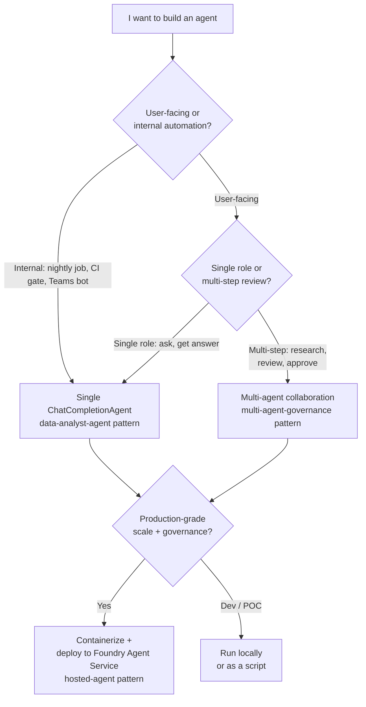

# AI Agent Examples — Azure AI Foundry + Semantic Kernel

> **Status:** Three working agent examples — single-agent, multi-agent collaboration, and containerized hosted agent. All are deployable today; production hardening notes included.

A reference for building AI agents on Azure that ground themselves in CSA-in-a-Box data products, enforce governance, and run safely in production. Three patterns scaling from "5 lines of code" to "containerized in Foundry Agent Service."

## What's in this folder

| Sub-example | Purpose | Complexity |
|------------|---------|-----------|
| [`data-analyst-agent/`](https://github.com/fgarofalo56/csa-inabox/tree/main/examples/ai-agents/data-analyst-agent) | Single `ChatCompletionAgent` with custom plugins (data query + quality assessment) | ★ |
| [`multi-agent-governance/`](https://github.com/fgarofalo56/csa-inabox/tree/main/examples/ai-agents/multi-agent-governance) | 3 agents (analyst + quality + governance) collaborating via `GroupChatOrchestration` | ★★ |
| [`hosted-agent/`](https://github.com/fgarofalo56/csa-inabox/tree/main/examples/ai-agents/hosted-agent) | Containerized agent deployed to Azure AI Foundry Agent Service | ★★★ |

All three share the `csa_platform.ai_integration` library (RAG, MCP, Semantic Kernel skills) and the platform's identity / secrets pattern (managed identity + Key Vault).

## When to use which pattern



## Prerequisites

```bash
# Python deps
pip install semantic-kernel[azure] azure-identity azure-ai-projects

# Azure setup (Commercial; for Gov see GOV_NOTE under examples/fabric-data-agent/)
export AZURE_OPENAI_ENDPOINT="https://<your-openai>.openai.azure.com/"
export AZURE_OPENAI_DEPLOYMENT="gpt-4o-mini"   # or gpt-4o, o1-mini, etc.
az login
```

For the hosted-agent pattern you also need:
- Azure Container Registry
- Azure AI Foundry project provisioned (`ai-foundry-project` resource)
- Workload identity on AKS or Container Apps (whichever hosts the runtime)

## Pattern 1 — Single Agent (data-analyst-agent)

```bash
cd examples/ai-agents/data-analyst-agent
python agent.py
```

A single `ChatCompletionAgent` with two plugins:

- **DataQueryPlugin** — query Purview catalog + run `SELECT` against gold tables
- **QualityPlugin** — run Great Expectations suites and return summary

```python
# data-analyst-agent/agent.py (excerpt)
from semantic_kernel.agents import ChatCompletionAgent
from semantic_kernel.connectors.ai.open_ai import AzureChatCompletion
from azure.identity import DefaultAzureCredential

agent = ChatCompletionAgent(
    service=AzureChatCompletion(
        deployment_name=os.environ["AZURE_OPENAI_DEPLOYMENT"],
        endpoint=os.environ["AZURE_OPENAI_ENDPOINT"],
        ad_token_provider=DefaultAzureCredential().get_token,
    ),
    name="DataAnalyst",
    instructions="""
        You help analysts find data products and assess their quality.
        Always cite the data product name + version when answering.
        If a quality check fails, recommend an action.
    """,
    plugins=[DataQueryPlugin(), QualityPlugin()],
)

async for response in agent.invoke_stream("Find revenue tables for Q1 2026"):
    print(response.content, end="", flush=True)
```

**Use this pattern for**: nightly data-quality reports, CI pipeline gates, Teams bot integrations, simple "ask the catalog" tools.

## Pattern 2 — Multi-Agent Collaboration (multi-agent-governance)

```bash
cd examples/ai-agents/multi-agent-governance
python team.py "gold.finance.revenue_summary"
```

Three specialist agents collaborate to review a data product before publication:

```mermaid
sequenceDiagram
    participant U as User
    participant Mgr as RoundRobinGroupChatManager
    participant DA as DataAnalyst
    participant QR as QualityReviewer
    participant GO as GovernanceOfficer

    U->>Mgr: Review gold.finance.revenue_summary
    Mgr->>DA: Investigate the product
    DA-->>Mgr: Schema, lineage, downstream refs
    Mgr->>QR: Quality check
    QR-->>Mgr: GE suite passes; row count stable
    Mgr->>GO: Final verdict
    GO-->>Mgr: APPROVED with conditions
    Mgr-->>U: Final report with all 3 agent transcripts
```

**Use this pattern for**: data-product review workflows, multi-perspective document analysis, change-approval automation, complex agentic reasoning.

## Pattern 3 — Hosted Agent in Foundry Agent Service (hosted-agent)

```bash
cd examples/ai-agents/hosted-agent

# 1. Build container
docker build -t csa-hosted-agent:v1 .

# 2. Push to ACR
az acr login --name <registry>
docker tag csa-hosted-agent:v1 <registry>.azurecr.io/csa-hosted-agent:v1
docker push <registry>.azurecr.io/csa-hosted-agent:v1

# 3. Deploy to Foundry Agent Service
az ai-projects agent deploy \
  --project <foundry-project> \
  --name csa-hosted-agent \
  --image <registry>.azurecr.io/csa-hosted-agent:v1 \
  --identity system-assigned
```

**Use this pattern for**: production-grade agents serving real users, agents that need MCP tool connections to other Azure services, agents subject to compliance audit (Foundry provides built-in evaluation + content safety + tracing).

## Production hardening checklist

Before pointing real users at any of these:

- [ ] **Content Safety** in front (input filter) and behind (output filter) — see [Patterns — LLMOps](../../docs/patterns/llmops-evaluation.md)
- [ ] **Eval suite** of 50+ representative inputs run on every PR ([`apps/copilot/evals/`](https://github.com/fgarofalo56/csa-inabox/tree/main/apps/copilot/evals) framework)
- [ ] **Rate limiting** in front (APIM or BFF) — see [ADR 0021](../../docs/adr/0021-two-rate-limiters-not-duplicates.md)
- [ ] **Application Insights** trace per agent invocation with `request_id`, `user_id_hash`, `tokens`, `tools_called`
- [ ] **Managed identity** for AOAI auth, not API keys
- [ ] **Key Vault references** for any secrets (OAI key fallback if MI not used, downstream API tokens)
- [ ] **Tool allow-list** — agents should not have access to tools that can write to production resources without explicit human-in-loop
- [ ] **Conversation history** capped (token + turn count) to prevent runaway loops
- [ ] **Cost alerts** at 1.5x and 2x daily baseline AOAI spend per deployment
- [ ] **Drift detection** — weekly re-run eval on production sample
- [ ] **Refusal-rate monitoring** — sustained spike usually means corpus drift or model version change

## Data product contract

Each agent's request/response surface should be governed by a YAML data contract:

```yaml
# Example contract for the data-analyst-agent
apiVersion: csa.microsoft.com/v1
kind: DataProductContract
metadata:
  name: ai-agent.data-analyst
  domain: ai-agents
  owner: data-platform-team@example.com
  classification: unrestricted
schema:
  primary_key: [request_id]
  columns:
    - name: request_id
      type: string
    - name: question
      type: string
    - name: answer
      type: string
    - name: cited_data_products
      type: array<string>
    - name: tools_called
      type: array<string>
policy:
  read_only: true
  max_response_tokens: 1500
  content_safety_severity_max: "Medium"
```

Validated by [`csa_platform/governance/contracts/contract_validator.py`](https://github.com/fgarofalo56/csa-inabox/tree/main/csa_platform/governance/contracts).

## Azure Government note

For Azure Government deployments:
- Azure OpenAI is GA in MAG (IL4) and IL5 regions
- Semantic Kernel works the same way (no SDK changes)
- Foundry Agent Service hosting may be **pre-GA** in Gov — check current status; fall back to AKS / Container Apps with the same container image

## Roadmap (in this example)

- [ ] Add `deploy/main.bicep` (currently the agents run as scripts; should ship a deployable IaC)
- [ ] Add `contracts/` YAML for each agent (currently inline above)
- [ ] Add `dbt/` model that the data-analyst-agent queries (vs hard-coded gold tables)
- [ ] Add `tests/` with eval suite seed (50 representative questions per agent)
- [ ] Add `ARCHITECTURE.md` with full deployment diagram

This example is **deliberately minimal** today to teach the patterns. The roadmap items above are tracked in [`.todo-nav-reorg.md`](https://github.com/fgarofalo56/csa-inabox/blob/main/.todo-nav-reorg.md) for follow-up PRs.

## Related

- [Tutorial 07 — AI Agents with Semantic Kernel](../../docs/tutorials/07-agents-foundry-sk/README.md)
- [Patterns — LLMOps & Evaluation](../../docs/patterns/llmops-evaluation.md)
- [Example — Fabric Data Agent](../fabric-data-agent/README.md) (read-only Q&A pattern over Fabric Lakehouse)
- [ADR 0007 — Azure OpenAI over Self-Hosted LLM](../../docs/adr/0007-azure-openai-over-self-hosted-llm.md)
- [ADR 0017 — RAG Service Layer](../../docs/adr/0017-rag-service-layer.md)
- [ADR 0022 — Copilot Surfaces vs Docs Widget](../../docs/adr/0022-copilot-surfaces-vs-docs-widget.md)
- Semantic Kernel docs: https://learn.microsoft.com/semantic-kernel/
- Azure AI Foundry docs: https://learn.microsoft.com/azure/ai-studio/
