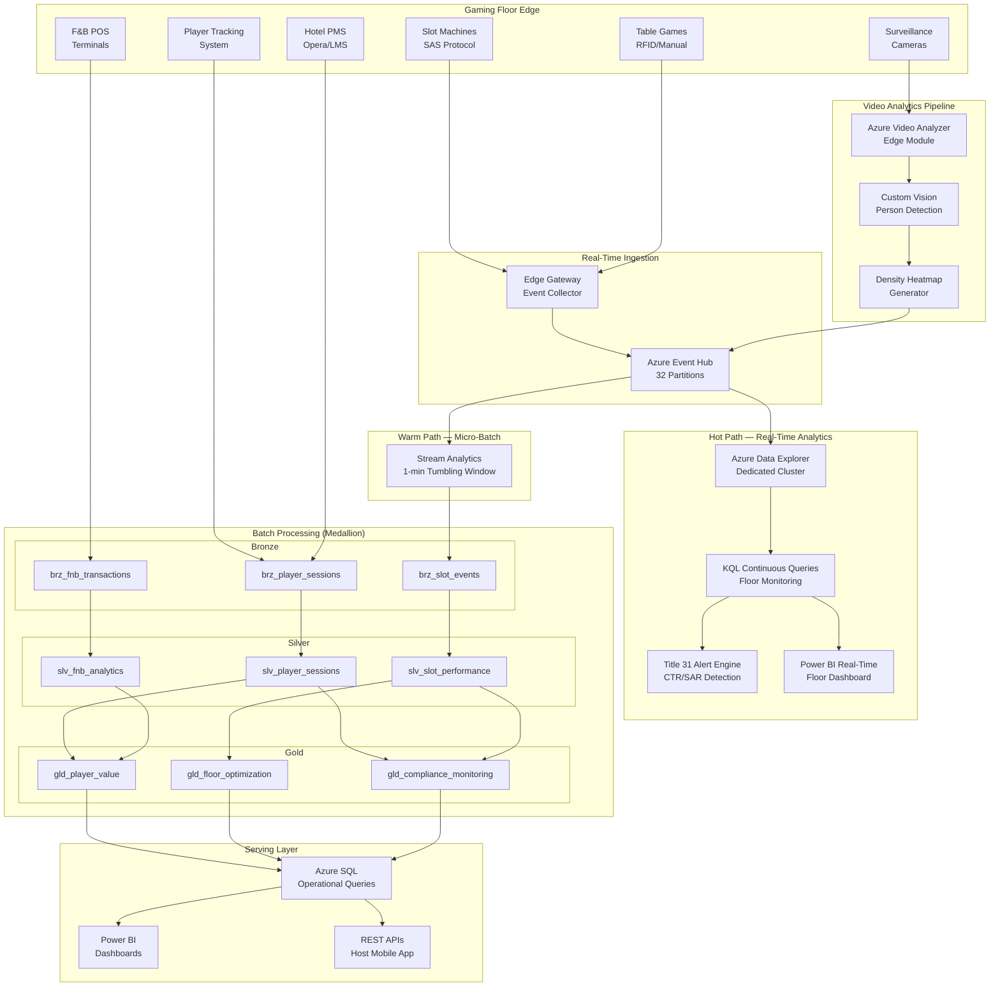
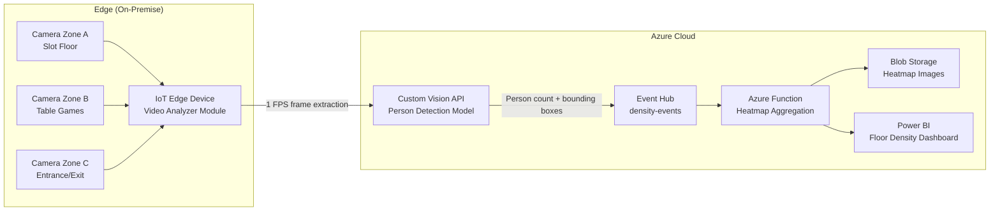
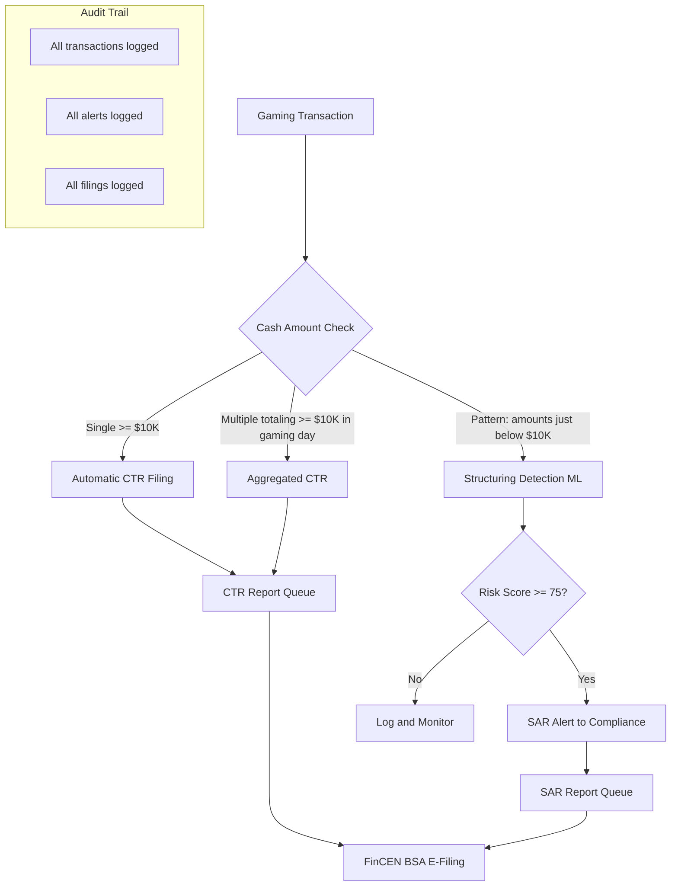
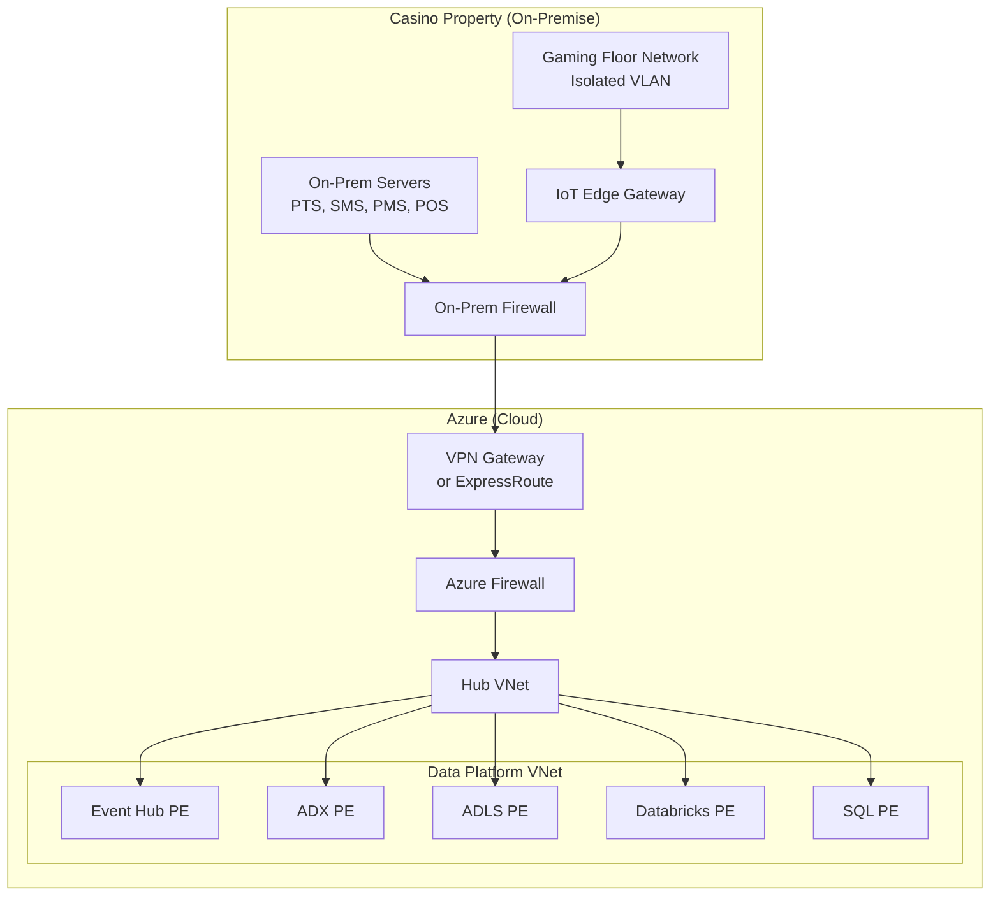

# Casino Analytics Platform — Architecture

## Overview

The Casino Analytics Platform is built on Azure Cloud Scale Analytics (CSA) and combines high-velocity streaming ingestion (slot telemetry at thousands of events per second) with batch analytics for player lifetime value, floor optimization, and regulatory compliance. The architecture supports both Azure Commercial and Azure Government deployments, since tribal casinos on sovereign land may choose either cloud boundary based on their data residency requirements.

## System Architecture



## Real-Time Data Flow

### Slot Machine Telemetry

Slot machines communicate via the SAS (Slot Accounting System) protocol, generating events for every spin, bonus trigger, jackpot, error, and cash transaction. The platform captures these at the edge and streams them through Event Hub to Azure Data Explorer for sub-second analytics.

```
Slot Machine (SAS Protocol)
    └── Edge Gateway (Protocol Translation)
        └── Azure Event Hub (casino-slot-events, 32 partitions)
            ├── Hot Path: Azure Data Explorer
            │   ├── KQL Continuous Query: Floor monitoring (15-sec windows)
            │   ├── KQL Continuous Query: Title 31 CTR threshold detection
            │   └── KQL Materialized View: Hourly machine performance
            └── Warm Path: Stream Analytics → ADLS Gen2 (Parquet, 1-min windows)
                └── Bronze Layer: brz_slot_events
```

### Event Schema

```json
{
  "event_id": "evt-a1b2c3d4",
  "machine_id": "SLT-0042",
  "timestamp": "2025-03-15T14:23:01.847Z",
  "event_type": "spin",
  "denomination": 0.25,
  "credits_wagered": 3,
  "credits_won": 0,
  "player_id": "PLY-001234",
  "rtp_contribution": 0.75,
  "floor_zone": "B2",
  "progressive_contribution": 0.01,
  "session_id": "sess-x7y8z9"
}
```

### Throughput Requirements

| Metric | Development | Production |
|---|---|---|
| Slot machines | 150 simulated | 2,000+ |
| Events per second | ~1,000 | ~15,000 |
| Event Hub partitions | 8 | 32 |
| ADX cluster | Dev/Test SKU | Standard D14 (8-node) |
| Data retention (hot) | 7 days | 30 days |
| Data retention (warm/ADLS) | 90 days | 7 years (NIGC MICS) |

## Event Hub Streaming Architecture

### Namespace Configuration

```
Event Hub Namespace: eh-casino-analytics
├── casino-slot-events      (32 partitions, 7-day retention)
│   ├── Consumer Group: adx-ingestion
│   ├── Consumer Group: stream-analytics
│   └── Consumer Group: compliance-monitor
├── casino-table-events      (8 partitions, 7-day retention)
│   └── Consumer Group: adx-ingestion
├── casino-density-events    (4 partitions, 1-day retention)
│   └── Consumer Group: heatmap-generator
└── casino-compliance-alerts (4 partitions, 30-day retention)
    └── Consumer Group: compliance-team
```

### Partitioning Strategy

- **Slot events**: Partitioned by `machine_id` hash — ensures ordered processing per machine
- **Table events**: Partitioned by `table_id` — maintains hand sequence integrity
- **Density events**: Partitioned by `zone_id` — enables zone-level processing
- **Compliance alerts**: Partitioned by `player_id` — groups alerts per individual

## Azure Data Explorer (ADX) Architecture

### Database Schema

```kql
// Hot analytics database
.create database gaming

// Raw slot events — high-volume ingestion table
.create table SlotMachineEvents (
    event_id: string,
    machine_id: string,
    event_time: datetime,
    event_type: string,
    denomination: real,
    credits_wagered: int,
    credits_won: int,
    player_id: string,
    rtp_contribution: real,
    floor_zone: string,
    session_id: string,
    ingestion_time: datetime
)

// Continuous ingestion from Event Hub
.create table SlotMachineEvents ingestion json mapping 'SlotEventMapping'
    '[{"column":"event_id","path":"$.event_id"},'
    '{"column":"machine_id","path":"$.machine_id"},'
    '{"column":"event_time","path":"$.timestamp","transform":"DateTimeFromUnixMilliseconds"},'
    '{"column":"event_type","path":"$.event_type"},'
    '{"column":"denomination","path":"$.denomination"},'
    '{"column":"credits_wagered","path":"$.credits_wagered"},'
    '{"column":"credits_won","path":"$.credits_won"},'
    '{"column":"player_id","path":"$.player_id"},'
    '{"column":"rtp_contribution","path":"$.rtp_contribution"},'
    '{"column":"floor_zone","path":"$.floor_zone"},'
    '{"column":"session_id","path":"$.session_id"}]'

// Materialized view: hourly machine performance
.create materialized-view MachinePerformanceHourly on table SlotMachineEvents {
    SlotMachineEvents
    | summarize
        total_spins = countif(event_type == "spin"),
        total_wagered = sum(credits_wagered * denomination),
        total_paid = sum(credits_won * denomination),
        jackpot_count = countif(event_type == "jackpot"),
        error_count = countif(event_type == "error"),
        unique_players = dcount(player_id)
    by machine_id, floor_zone, bin(event_time, 1h)
}
```

### Key KQL Queries

```kql
// Real-time floor performance (last 15 minutes)
SlotMachineEvents
| where ingestion_time() > ago(15m)
| summarize
    total_spins = countif(event_type == "spin"),
    total_wagered = sum(credits_wagered * denomination),
    total_paid = sum(credits_won * denomination),
    hold_pct = round((sum(credits_wagered * denomination) - sum(credits_won * denomination))
                / sum(credits_wagered * denomination) * 100, 2),
    active_machines = dcount(machine_id),
    jackpot_hits = countif(event_type == "jackpot")
by floor_zone, bin(event_time, 1m)
| order by event_time desc

// Title 31 CTR threshold monitoring
SlotMachineEvents
| where ingestion_time() > ago(24h)
| where isnotempty(player_id)
| summarize
    total_cash_in = sum(iff(event_type == "cash_in", credits_wagered * denomination, 0.0)),
    total_cash_out = sum(iff(event_type == "cash_out", credits_won * denomination, 0.0)),
    session_count = dcount(session_id),
    machines_played = dcount(machine_id)
by player_id
| where total_cash_in > 8000 or total_cash_out > 8000
| extend ctr_pct = round(max_of(total_cash_in, total_cash_out) / 10000.0 * 100, 1)
| order by ctr_pct desc
```

## Video Analytics Pipeline

### Floor Density Monitoring



### Privacy Considerations

- Frames are processed for person counting only — no facial recognition
- Bounding box coordinates are stored; raw frames are discarded after processing
- No PII is linked to density data
- Surveillance footage retention follows NIGC MICS requirements (7 days minimum)
- Video analytics processing occurs on-premise at the edge; only counts and heatmaps go to cloud

## Player Data Privacy & NIGC Compliance

### Data Classification

| Data Category | Classification | Access | Retention |
|---|---|---|---|
| Player PII (name, DOB, SSN) | Restricted | Compliance team only | Duration of relationship + 5 years |
| Player gaming activity | Confidential | Marketing, hosts, analytics | 7 years (NIGC MICS) |
| Financial transactions | Restricted | Cage, compliance, audit | 7 years (BSA) |
| Slot telemetry (no player) | Internal | Analytics team | 7 years |
| Floor density counts | Internal | Operations | 90 days |
| CTR/SAR records | Restricted | Compliance officer, FinCEN | 5 years (BSA) |

### Title 31 Compliance Architecture



### Gaming Day Boundary

The "gaming day" for Title 31 purposes is defined by the tribal gaming commission, typically 6:00 AM to 5:59 AM local time. All cash aggregation for CTR thresholds uses this boundary, not calendar day.

## Integration Architecture

### Loyalty & PMS Integration

```
┌─────────────────────────────────────────────────────────────┐
│                  Integration Points                          │
├─────────────────────────────────────────────────────────────┤
│                                                              │
│  Player Tracking System (PTS)                                │
│    ├── Real-time: Player card-in/card-out events via SAS    │
│    ├── Batch: Daily rated play summary, tier calculations    │
│    └── API: Player lookup, comp issuance, offer delivery     │
│                                                              │
│  Slot Management System (SMS)                                │
│    ├── Real-time: SAS event stream via edge gateway          │
│    ├── Batch: Machine configuration, par sheet data          │
│    └── API: Machine status, meter reads, error clearing      │
│                                                              │
│  Hotel Property Management System (PMS)                      │
│    ├── Batch: Nightly reservation/folio extract              │
│    ├── API: Room availability, rate management               │
│    └── Integration: Comp room issuance from player value     │
│                                                              │
│  F&B Point of Sale (POS)                                     │
│    ├── Batch: End-of-day transaction extract                 │
│    ├── API: Comp validation, menu item lookup                │
│    └── Integration: Player card swipe for comp redemption    │
│                                                              │
│  Loyalty Program                                             │
│    ├── Batch: Points accrual, tier evaluation                │
│    ├── API: Points balance, redemption catalog               │
│    └── Integration: Offer engine trigger from Gold models    │
│                                                              │
└─────────────────────────────────────────────────────────────┘
```

## Network Architecture

### On-Premise to Cloud Connectivity



### Security Controls

- Gaming floor network is on an isolated VLAN — no internet access
- Edge gateway communicates only with Event Hub via VPN/ExpressRoute
- All PaaS services use Private Link — no public endpoints
- Managed Identity for all service-to-service auth
- Key Vault for any secrets (Event Hub connection strings, API keys)
- NSGs restrict traffic to minimum necessary ports

## Deployment Options

### Azure Commercial vs. Azure Government

Tribal casinos operate on sovereign land, which creates flexibility in cloud deployment:

| Consideration | Azure Commercial | Azure Government |
|---|---|---|
| Data residency | US regions | US Gov regions only |
| FedRAMP | FedRAMP Moderate available | FedRAMP High |
| ADX availability | All US regions | US Gov Virginia, US Gov Arizona |
| Event Hub | All regions | US Gov Virginia, US Gov Arizona |
| Video Analyzer | All regions | Limited availability |
| Cost | Standard pricing | ~15-20% premium |
| NIGC requirement | Check with tribal gaming commission | Recommended for federal reporting |

**Recommendation**: Use Azure Government if the tribal casino handles federal reporting (e.g., Title 31 FinCEN filings) or if the tribal gaming commission requires government cloud. Use Azure Commercial for cost optimization when federal requirements don't mandate government cloud.

## Performance & Scalability

### Data Volume Estimates

| Data Source | Daily Volume | Monthly Volume | Annual Volume |
|---|---|---|---|
| Slot events | ~50M events | ~1.5B events | ~18B events |
| Table game events | ~2M events | ~60M events | ~720M events |
| F&B transactions | ~5,000 records | ~150K records | ~1.8M records |
| Hotel stays | ~200 records | ~6,000 records | ~72K records |
| Player profiles | N/A (slowly changing) | ~500 updates | ~6,000 updates |
| Density events | ~86K per camera/day | ~2.6M per camera | ~31M per camera |

### Storage Strategy

- **Hot (ADX)**: Last 30 days of streaming events — optimized for real-time KQL
- **Warm (ADLS Bronze)**: Last 7 years — Parquet format, partitioned by date
- **Cold (ADLS Archive)**: 7+ years — compressed Parquet, lifecycle management to Archive tier

## Technology Stack

### Core Platform
- **Streaming**: Azure Event Hub, Azure Data Explorer, Stream Analytics
- **Compute**: Azure Databricks, Azure Functions
- **Storage**: Azure Data Lake Storage Gen2, Azure SQL Database
- **Orchestration**: Azure Data Factory
- **Analytics**: Power BI (real-time tiles + batch reports)

### Video Analytics
- **Edge**: Azure Video Analyzer on IoT Edge
- **ML**: Custom Vision (person detection model)
- **Processing**: Azure Functions (heatmap generation)

### Development Tools
- **Data Modeling**: dbt (1.7+)
- **Version Control**: Git, GitHub / Azure DevOps
- **CI/CD**: GitHub Actions or Azure Pipelines
- **IaC**: Bicep
- **Monitoring**: Azure Monitor, Log Analytics
