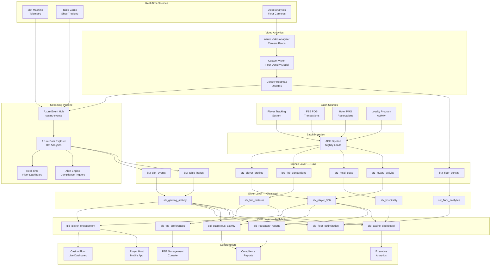
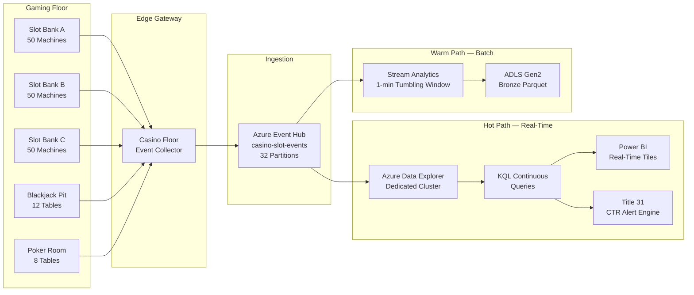
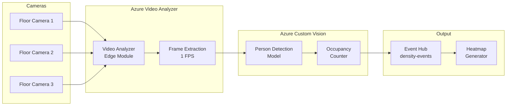

# Tribal Casino Player Analytics Platform

> **Last Updated:** 2026-04-15 | **Status:** Active | **Audience:** Data Engineers

## Table of Contents
- [Overview](#overview)
  - [Key Features](#key-features)
  - [Data Sources (All Synthetic)](#data-sources-all-synthetic)
- [Architecture Overview](#architecture-overview)
- [Real-Time Streaming Architecture](#real-time-streaming-architecture)
  - [Video Analytics Pipeline](#video-analytics-pipeline)
  - [Streaming Quick Start](#streaming-quick-start)
  - [Sample KQL — Real-Time Floor Monitoring](#sample-kql--real-time-floor-monitoring)
- [Prerequisites](#prerequisites)
  - [Azure Resources](#azure-resources)
  - [Tools Required](#tools-required)
  - [Compliance Requirements](#compliance-requirements)
- [Quick Start](#quick-start)
  - [1. Environment Setup](#1-environment-setup)
  - [2. Generate Synthetic Data](#2-generate-synthetic-data)
  - [3. Deploy Infrastructure](#3-deploy-infrastructure)
  - [4. Run dbt Models](#4-run-dbt-models)
- [Sample Analytics Scenarios](#sample-analytics-scenarios)
  - [1. Real-Time Player Engagement Scoring](#1-real-time-player-engagement-scoring)
  - [2. Floor Layout Optimization](#2-floor-layout-optimization)
  - [3. F&B Preference Analysis](#3-fb-preference-analysis)
  - [4. Suspicious Activity Detection](#4-suspicious-activity-detection)
- [Regulatory Compliance](#regulatory-compliance)
  - [NIGC Minimum Internal Control Standards (MICS)](#nigc-minimum-internal-control-standards-mics)
  - [Title 31 — Bank Secrecy Act / AML](#title-31--bank-secrecy-act--aml)
  - [Data Retention](#data-retention)
- [Data Products](#data-products)
  - [Player Engagement](#player-engagement-player-engagement)
  - [Floor Optimization](#floor-optimization-floor-optimization)
  - [Suspicious Activity](#suspicious-activity-suspicious-activity)
- [Configuration](#configuration)
  - [dbt Profiles](#dbt-profiles)
  - [Environment Variables](#environment-variables)
- [Azure Government Notes](#azure-government-notes)
- [Monitoring & Alerts](#monitoring--alerts)
- [Troubleshooting](#troubleshooting)
  - [Common Issues](#common-issues)
- [Contributing](#contributing)
- [License](#license)
- [Acknowledgments](#acknowledgments)

A comprehensive casino operations analytics platform built on Azure Cloud Scale Analytics (CSA), providing real-time player engagement scoring, floor optimization, food & beverage analytics, and regulatory compliance reporting. **All data in this example is fully synthetic** — no real player data is included.

## Overview

Tribal casinos represent a $40 billion industry operated by 245 tribes across 29 states. Casino operations generate massive volumes of real-time telemetry: slot machines produce thousands of events per second, table games track hand-by-hand results, player tracking systems monitor loyalty program engagement, and surveillance systems ensure regulatory compliance. This platform demonstrates how Cloud Scale Analytics handles high-velocity streaming data alongside batch analytics for a complete casino intelligence solution.

> **⚠️ ALL DATA IS SYNTHETIC**
>
> This example uses **entirely synthetic data** generated for demonstration purposes. No real player information, financial records, or operational data from any tribal casino is included. The synthetic data generators produce realistic but fictional records for: player profiles, slot machine events, table game hands, F&B transactions, hotel reservations, and loyalty program activity.

### Key Features

- **Real-Time Player Engagement**: Slot machine event streaming via Event Hub → ADX for live dashboards
- **Floor Layout Optimization**: Heat mapping and machine placement analytics
- **F&B Preference Analysis**: Dining pattern recognition with comp optimization
- **Loyalty Program Intelligence**: Player lifecycle tracking and churn prediction
- **Video Analytics**: Azure Video Analyzer + Custom Vision for floor density estimation
- **Regulatory Compliance**: NIGC reporting, Title 31 CTR/SAR automated detection
- **Suspicious Activity Detection**: ML-based anomaly detection for AML compliance

### Data Sources (All Synthetic)

| Source | Type | Description | Generator |
|--------|------|-------------|-----------|
| Player Tracking System | Synthetic | Player profiles, rated play, tier status | `generate_player_data.py` |
| Slot Machine Telemetry | Synthetic/Streaming | Spin events, denomination, win/loss, bonus triggers | `slot_event_simulator.py` |
| Table Game Records | Synthetic | Buy-ins, hands played, avg bet, win/loss by position | `generate_table_data.py` |
| F&B POS Transactions | Synthetic | Restaurant/bar orders, comps, timing | `generate_fnb_data.py` |
| Hotel PMS Records | Synthetic | Reservations, room types, revenue, stay patterns | `generate_hotel_data.py` |
| Loyalty Program | Synthetic | Points earned/redeemed, tier changes, offers accepted | `generate_loyalty_data.py` |
| Surveillance Events | Synthetic | Floor density counts, incident flags | `generate_surveillance_data.py` |

## Architecture Overview



## Real-Time Streaming Architecture

The streaming pipeline is the centerpiece of this example, demonstrating high-velocity event processing from slot machines and table games:



### Video Analytics Pipeline



### Streaming Quick Start

```bash
# Start the slot machine event simulator
# Generates ~1,000 events/second for 150 machines
python streaming/slot_event_simulator.py \
  --event-hub-connection "$EVENTHUB_CONNECTION_STRING" \
  --machine-count 150 \
  --events-per-second 1000 \
  --denominations "0.01,0.05,0.25,1.00,5.00"

# Start the table game simulator
python streaming/table_game_simulator.py \
  --event-hub-connection "$EVENTHUB_CONNECTION_STRING" \
  --tables 20 \
  --games "blackjack,poker,baccarat,roulette"

# Deploy ADX tables and ingestion mapping
az kusto script create \
  --cluster-name casino-adx \
  --database-name gaming \
  --resource-group rg-casino-analytics \
  --script-content @streaming/adx/create_tables.kql
```

### Sample KQL — Real-Time Floor Monitoring

```kql
// Real-time floor performance by slot bank (last 15 minutes)
SlotMachineEvents
| where ingestion_time() > ago(15m)
| summarize
    total_spins = count(),
    total_wagered = sum(wager_amount),
    total_paid = sum(payout_amount),
    hold_pct = (sum(wager_amount) - sum(payout_amount)) / sum(wager_amount) * 100,
    active_machines = dcount(machine_id),
    jackpot_hits = countif(event_type == "jackpot")
    by slot_bank, bin(event_time, 1m)
| order by event_time desc, slot_bank asc

// Title 31 CTR threshold monitoring — players approaching $10K
SlotMachineEvents
| where ingestion_time() > ago(24h)
| where player_id != ""
| summarize
    total_cash_in = sum(cash_in_amount),
    total_cash_out = sum(cash_out_amount),
    session_count = dcount(session_id),
    machines_played = dcount(machine_id)
    by player_id
| where total_cash_in > 8000 or total_cash_out > 8000
| extend ctr_threshold_pct = max_of(total_cash_in, total_cash_out) / 10000.0 * 100
| order by ctr_threshold_pct desc
```

## Prerequisites

### Azure Resources
- Azure subscription with contributor access
- Azure Data Explorer cluster (dedicated, for streaming throughput)
- Azure Event Hub namespace (Standard or Premium, 32 partitions)
- Azure Data Factory or Synapse Analytics
- Azure Data Lake Storage Gen2
- Azure SQL Database or Synapse SQL Pool
- Azure Video Analyzer (optional, for floor density)
- Azure Custom Vision (optional, for person detection)
- Azure Key Vault for credentials

### Tools Required
- Azure CLI (2.55.0 or later)
- dbt CLI (1.7.0 or later)
- Python 3.9+
- Git

### Compliance Requirements
- NIGC Minimum Internal Control Standards (MICS) familiarity
- Title 31 BSA/AML compliance understanding
- Tribal Gaming Commission authorization (for production deployment)

## Quick Start

### 1. Environment Setup

```bash
# Clone the repository
git clone <repository-url>
cd csa-inabox/examples/casino-analytics

# Install Python dependencies
pip install -r requirements.txt

# Install dbt packages
cd domains/dbt
dbt deps
```

### 2. Generate Synthetic Data

```bash
# Generate synthetic player and transaction data
python data/generators/generate_player_data.py \
  --output-dir domains/dbt/seeds \
  --player-count 10000 \
  --days 365

python data/generators/generate_fnb_data.py \
  --output-dir domains/dbt/seeds \
  --transaction-count 500000

python data/generators/generate_hotel_data.py \
  --output-dir domains/dbt/seeds \
  --reservation-count 50000

python data/generators/generate_loyalty_data.py \
  --output-dir domains/dbt/seeds \
  --player-count 10000
```

### 3. Deploy Infrastructure

```bash
# Configure parameters
cp deploy/params.dev.json deploy/params.local.json
# Edit params.local.json with your values

# Deploy using Azure CLI
az deployment group create \
  --resource-group rg-casino-analytics \
  --template-file ../../deploy/bicep/DLZ/main.bicep \
  --parameters @deploy/params.local.json
```

### 4. Run dbt Models

```bash
cd domains/dbt

# Test connections
dbt debug

# Load seed data
dbt seed

# Run models
dbt run

# Run tests
dbt test

# Generate documentation
dbt docs generate
dbt docs serve
```

## Sample Analytics Scenarios

### 1. Real-Time Player Engagement Scoring

Score active players in real-time based on play velocity, bet sizing, session duration, and historical patterns to enable proactive host outreach.

```sql
-- Player engagement scores with recommended actions
SELECT
    player_id,
    player_tier,
    current_session_minutes,
    total_wagered_session,
    avg_bet_vs_historical,
    play_velocity_spins_per_min,
    win_loss_current_session,
    theoretical_win,
    engagement_score,
    churn_risk_score,
    recommended_action,
    comp_budget_available
FROM gold.gld_player_engagement
WHERE engagement_score >= 70
    AND current_session_minutes > 30
ORDER BY engagement_score DESC;
```

### 2. Floor Layout Optimization

Combine slot performance data with floor density heatmaps to optimize machine placement, bank configuration, and denomination mix.

```sql
-- Machine placement optimization recommendations
SELECT
    zone_id,
    zone_name,
    machine_count,
    avg_occupancy_pct,
    revenue_per_machine_day,
    hold_pct_actual,
    hold_pct_theoretical,
    denomination_mix_optimal,
    denomination_mix_current,
    traffic_flow_score,
    adjacency_score,
    optimization_recommendation,
    estimated_revenue_lift_pct
FROM gold.gld_floor_optimization
WHERE estimated_revenue_lift_pct > 5
ORDER BY estimated_revenue_lift_pct DESC;
```

### 3. F&B Preference Analysis

Analyze dining patterns by player tier, time of day, and gaming activity to optimize restaurant staffing, menu offerings, and comp strategies.

```sql
-- F&B preferences by player segment
SELECT
    player_tier,
    outlet_name,
    outlet_type,
    avg_check_amount,
    comp_pct,
    visits_per_month,
    preferred_day_of_week,
    preferred_time_slot,
    top_menu_categories,
    avg_time_gaming_before_dining_min,
    post_dining_return_rate_pct,
    revenue_correlation_coefficient
FROM gold.gld_fnb_preferences
ORDER BY player_tier, visits_per_month DESC;
```

### 4. Suspicious Activity Detection

Detect potential structuring, unusual play patterns, and Title 31 reporting triggers using ML-based anomaly detection.

```sql
-- Flagged suspicious activity for compliance review
SELECT
    alert_id,
    alert_date,
    player_id,
    alert_type,
    risk_score,
    total_cash_transactions_24h,
    transaction_count_24h,
    structuring_pattern_flag,
    multiple_id_flag,
    unusual_play_pattern,
    previous_alerts_count,
    recommended_action,
    ctr_required,
    sar_recommended
FROM gold.gld_suspicious_activity
WHERE alert_date >= CURRENT_DATE - INTERVAL '7 days'
    AND risk_score >= 75
ORDER BY risk_score DESC;
```

## Regulatory Compliance

### NIGC Minimum Internal Control Standards (MICS)

This platform supports MICS reporting requirements for:
- Slot machine accounting (coin-in, coin-out, jackpots, fills)
- Table game drop and count
- Player rating accuracy verification
- Cage and vault reconciliation data

### Title 31 — Bank Secrecy Act / AML

Automated compliance features include:
- **Currency Transaction Report (CTR)**: Auto-detection of cash transactions ≥ $10,000 in a gaming day
- **Suspicious Activity Report (SAR)**: ML-based structuring detection (transactions just below $10K)
- **Multiple Transaction Log (MTL)**: Aggregation of cash transactions by player within 24 hours
- **NIGC Regulation 542**: Full audit trail for all patron cash transactions

### Data Retention
- Gaming transaction data: 7 years minimum (per NIGC MICS)
- Surveillance footage references: 7 days minimum (per MICS)
- CTR/SAR records: 5 years (per BSA requirements)

## Data Products

### Player Engagement (`player-engagement`)
- **Description**: Real-time and historical player engagement scoring with churn prediction
- **Freshness**: Real-time (streaming) with daily batch recalibration
- **Coverage**: All rated players (synthetic: 10,000 profiles)
- **API**: `/api/v1/player-engagement`

### Floor Optimization (`floor-optimization`)
- **Description**: Machine placement and denomination mix optimization by zone
- **Freshness**: Daily recalculation with hourly density updates
- **Coverage**: All gaming floor zones and machine banks
- **API**: `/api/v1/floor-optimization`

### Suspicious Activity (`suspicious-activity`)
- **Description**: AML compliance alerts with risk scoring
- **Freshness**: Real-time alerting with daily aggregation
- **Coverage**: All cash transactions and player activity
- **API**: `/api/v1/suspicious-activity` (restricted to compliance team)

## Configuration

### dbt Profiles

Add to your `~/.dbt/profiles.yml`:

```yaml
casino_analytics:
  target: dev
  outputs:
    dev:
      type: databricks
      host: "{{ env_var('DBT_HOST') }}"
      http_path: "{{ env_var('DBT_HTTP_PATH') }}"
      token: "{{ env_var('DBT_TOKEN') }}"
      schema: casino_dev
      catalog: dev
    prod:
      type: databricks
      host: "{{ env_var('DBT_HOST_PROD') }}"
      http_path: "{{ env_var('DBT_HTTP_PATH_PROD') }}"
      token: "{{ env_var('DBT_TOKEN_PROD') }}"
      schema: casino
      catalog: prod
```

### Environment Variables

```bash
# Required for streaming
EVENTHUB_CONNECTION_STRING=your-eventhub-connection

# Required for dbt
DBT_HOST=your-databricks-host
DBT_HTTP_PATH=your-sql-warehouse-path
DBT_TOKEN=your-access-token

# Optional — Video Analytics
VIDEO_ANALYZER_ENDPOINT=your-video-analyzer-endpoint
CUSTOM_VISION_ENDPOINT=your-custom-vision-endpoint
CUSTOM_VISION_KEY=your-custom-vision-key

# Optional
CASINO_LOG_LEVEL=INFO
SLOT_SIMULATOR_EVENTS_PER_SEC=1000
ADX_CLUSTER_URI=https://casino-adx.region.kusto.windows.net
```

## Azure Government Notes

This example can be deployed to Azure Government (US) regions for tribal operations requiring government cloud compliance:

- Use `usgovvirginia` or `usgovarizona` as your Azure region
- ADX and Event Hub are available in Azure Government
- Video Analyzer availability in Azure Government may vary — check regional availability
- Custom Vision is available in Azure Government
- Ensure NIGC regulatory data remains within approved cloud boundaries
- Title 31 reports may need to be filed with FinCEN — verify data residency requirements

## Monitoring & Alerts

- **Streaming Health**: Event Hub partition lag, ADX ingestion latency, event throughput
- **Title 31 Alerts**: Automated notifications when players approach $10K cash threshold
- **Floor Performance**: Real-time hold percentage deviation alerts by machine bank
- **Video Analytics**: Camera feed health and person detection model accuracy monitoring
- **Data Quality**: Automated tests on slot event integrity, player profile completeness
- **Cost Management**: ADX cluster auto-scale monitoring with spend guardrails

## Troubleshooting

### Common Issues

1. **Event Hub Throughput**: At 1,000 events/second, use at least 16 partitions. Scale to 32 for production floor loads.
2. **ADX Ingestion Lag**: If ingestion falls behind, check ADX cluster compute and increase cache allocation.
3. **Slot Simulator Memory**: Running 500+ virtual machines requires ~8 GB RAM. Use `--batch-mode` for lower memory.
4. **Video Analyzer Connectivity**: Ensure edge module has outbound HTTPS access to Azure Video Analyzer endpoints.
5. **Title 31 Time Zones**: Gaming day boundaries are defined by tribal gaming commission. Configure `GAMING_DAY_START_HOUR` appropriately (typically 6:00 AM local).
6. **Synthetic Data Realism**: Adjust `--house-edge` and `--hold-variance` parameters to match your target analytics scenarios.

## Contributing

1. Fork the repository
2. Create a feature branch (`git checkout -b feature/new-data-source`)
3. Make changes and add tests
4. Run quality checks (`make lint test`)
5. Submit a pull request

## License

This project is licensed under the MIT License. See `LICENSE` file for details.

## Acknowledgments

- National Indian Gaming Commission for regulatory framework guidance
- Azure Cloud Scale Analytics team for the foundational platform
- Azure Data Explorer team for high-velocity streaming capabilities
- Contributors and the open-source community

---

## Related Documentation

- [Casino Analytics Architecture](ARCHITECTURE.md) — Detailed platform architecture and design decisions
- [Examples Index](../README.md) — Overview of all CSA-in-a-Box example verticals
- [Platform Architecture](../../docs/ARCHITECTURE.md) — Core CSA platform architecture
- [Getting Started Guide](../../docs/GETTING_STARTED.md) — Platform setup and onboarding
- [Commerce Economic Analytics](../commerce/README.md) — Related economic analytics vertical
- [IoT & Streaming Analytics](../iot-streaming/README.md) — Shared streaming patterns
