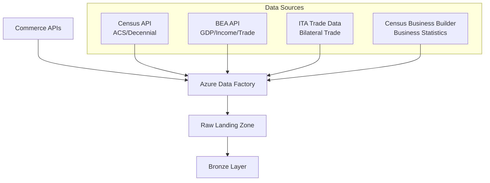
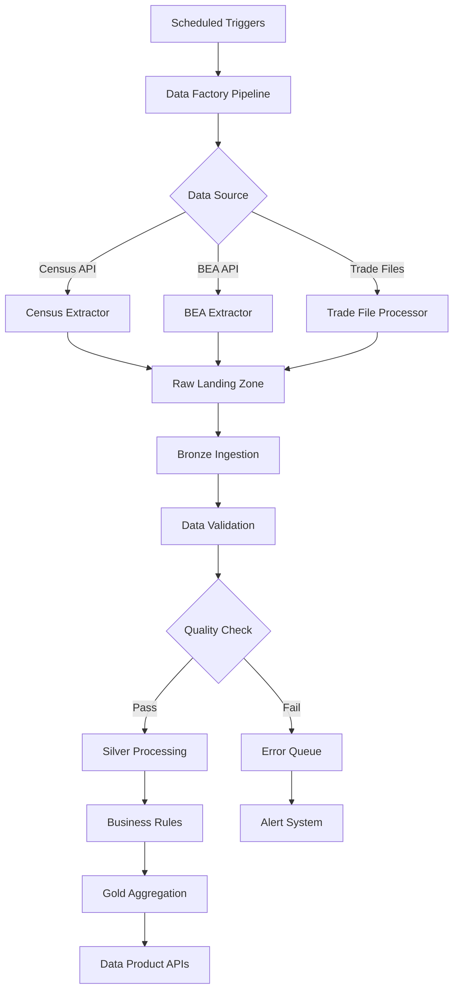
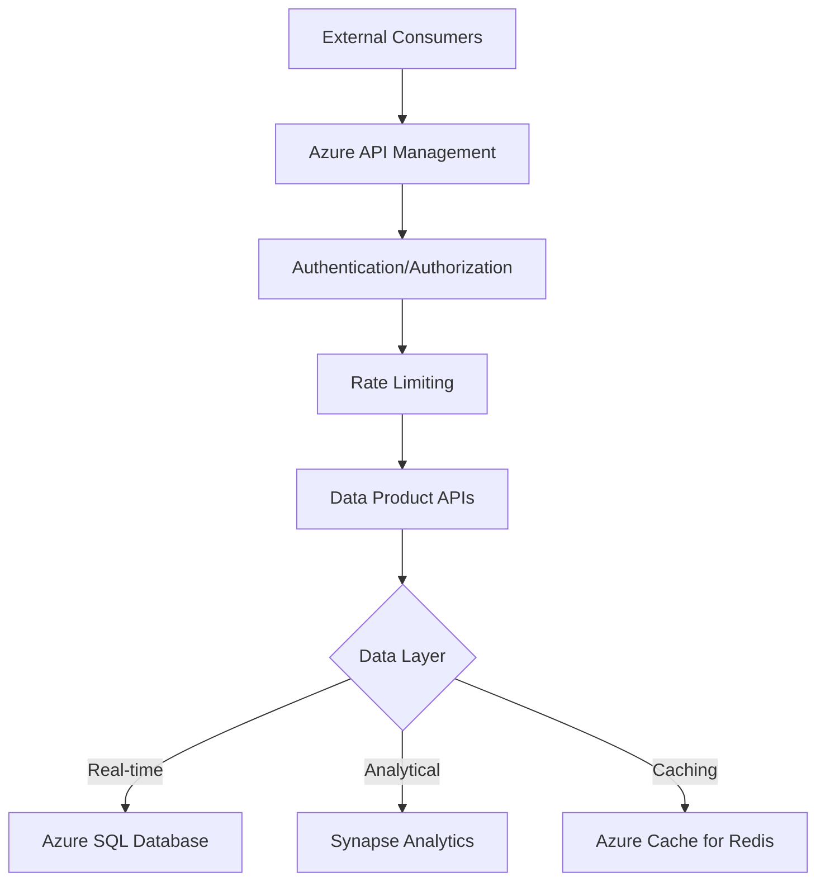

# Department of Commerce Economic Analytics Architecture

> [**Examples**](../README.md) > [**Commerce**](README.md) > **Architecture**

> **Last Updated:** 2026-04-15 | **Status:** Active | **Audience:** Architects / Data Engineers

> [!TIP]
> **TL;DR** — Domain-driven architecture ingesting Census, BEA, ITA, and NIST data through a medallion pipeline. Features batch processing for quarterly GDP releases, API gateway with Redis caching, and FISMA-compliant security.


---

## 📋 Table of Contents
- [Overview](#overview)
- [Domain Context](#domain-context)
  - [Economic Data Landscape](#economic-data-landscape)
  - [Data Characteristics](#data-characteristics)
- [Architecture Layers](#architecture-layers)
  - [Data Ingestion Layer](#data-ingestion-layer)
  - [Bronze Layer (Raw Data)](#bronze-layer-raw-data)
  - [Silver Layer (Cleaned & Conformed)](#silver-layer-cleaned--conformed)
  - [Gold Layer (Business Analytics)](#gold-layer-business-analytics)
- [Data Flow Architecture](#data-flow-architecture)
  - [Batch Processing Pipeline](#batch-processing-pipeline)
- [Integration Patterns](#integration-patterns)
  - [API Gateway Architecture](#api-gateway-architecture)
  - [Data Contracts](#data-contracts)
- [Security Architecture](#security-architecture)
  - [Data Protection](#data-protection)
  - [Compliance](#compliance)
- [Performance Optimization](#performance-optimization)
  - [Data Partitioning Strategy](#data-partitioning-strategy)
  - [Caching Strategy](#caching-strategy)
  - [Indexing Strategy](#indexing-strategy)
- [Monitoring & Observability](#monitoring--observability)
  - [Data Quality Monitoring](#data-quality-monitoring)
  - [Pipeline Monitoring](#pipeline-monitoring)
  - [Alerting Strategy](#alerting-strategy)
- [Disaster Recovery](#disaster-recovery)
  - [Backup Strategy](#backup-strategy)
  - [Business Continuity](#business-continuity)
- [Technology Stack](#technology-stack)
  - [Core Platform](#core-platform)
  - [Development Tools](#development-tools)
  - [Programming Languages](#programming-languages)


---

## 📋 Overview

The Commerce Economic Analytics platform is built on Azure Cloud Scale Analytics (CSA) and follows a domain-driven design approach. It ingests data from multiple Commerce Department bureaus, transforms it through a medallion architecture, and provides analytical insights for economic policy, trade analysis, and business development.


---

## 📋 Domain Context

### Economic Data Landscape

The Commerce Department ecosystem produces vast amounts of economic data through multiple bureaus:

- **Census Bureau**: Demographic, economic, and housing characteristics from the American Community Survey and Decennial Census
- **BEA (Bureau of Economic Analysis)**: GDP, personal income, international trade, and industry accounts
- **ITA (International Trade Administration)**: Bilateral trade statistics, tariff data, and export promotion
- **NIST (National Institute of Standards and Technology)**: Manufacturing competitiveness and innovation metrics

### Data Characteristics

- **Volume**: Billions of records across census tracts, GDP estimates, and trade transactions
- **Velocity**: Quarterly GDP releases, monthly trade data, annual census updates
- **Variety**: Structured (GDP tables, trade records), semi-structured (API responses), geospatial (census geographies)
- **Veracity**: Government-grade statistical data with published methodologies and confidence intervals


---

## 🏗️ Architecture Layers

### 🔄 Data Ingestion Layer



#### Ingestion Patterns

**Census API (ACS)**
- REST API with hierarchical geography selection
- Rate limit: 500 requests/day (free tier)
- Data format: JSON arrays with variable-based schema
- Update frequency: Annual (1-year estimates in September, 5-year in December)

**BEA API**
- REST API with dataset/table/frequency parameters
- Rate limit: 100 requests/minute
- Data format: JSON with nested data/dimension structure
- Update frequency: Quarterly (advance, second, third estimates)

**ITA Trade Data**
- CSV/JSON downloads from USA Trade Online
- Monthly updates with 35-day lag
- HS code-based commodity classification
- Coverage: 200+ partner countries

### 🗄️ Bronze Layer (Raw Data)

The Bronze layer stores raw, unprocessed data exactly as received from source systems.

```sql
-- Example: Bronze census demographics table structure
CREATE TABLE bronze.brz_census_demographics (
    source_system STRING,
    ingestion_timestamp TIMESTAMP,
    raw_json STRING,
    geo_id STRING,           -- Census GEOID (state+county+tract)
    state_fips STRING,
    county_fips STRING,
    tract_code STRING,
    variable_code STRING,
    variable_name STRING,
    estimate DECIMAL(18,2),
    margin_of_error DECIMAL(18,2),
    year INT,
    dataset STRING,          -- 'acs1', 'acs5', 'dec'
    load_time TIMESTAMP,
    _source_file_name STRING,
    _source_file_timestamp TIMESTAMP
)
USING DELTA
PARTITIONED BY (year, state_fips)
```

#### Data Lineage Tracking

- Source API metadata preserved (dataset, vintage, geography level)
- Ingestion timestamps for audit trails
- Original API responses stored as JSON for reprocessing
- Change data capture for incremental Census data loads

### 🗄️ Silver Layer (Cleaned & Conformed)

The Silver layer applies business rules, data quality checks, and standardization.

#### Transformation Patterns

**Geographic Standardization**
- Census GEOID decomposition (state + county + tract)
- FIPS code validation against Census geographic reference files
- MSA/CBSA mapping for metropolitan area analytics
- Region and division assignment for macro-level analysis

**Economic Data Normalization**
- GDP deflation using BEA price indices (chained 2017 dollars)
- Per-capita calculations using Census population estimates
- Seasonal adjustment for quarterly GDP figures
- HS code harmonization for cross-year trade comparisons

**Data Quality Rules**
- Census margin-of-error validation (flag high-CV estimates)
- GDP component consistency checks (sum of parts = total)
- Trade balance validation (exports - imports = balance)
- Temporal consistency checks for revised estimates

```sql
-- Example: Silver layer with quality indicators
CREATE TABLE silver.slv_census_demographics (
    census_sk STRING,
    geo_id STRING,
    state_code STRING,
    state_name STRING,
    county_code STRING,
    county_name STRING,
    tract_code STRING,
    region STRING,
    division STRING,
    cbsa_code STRING,
    cbsa_name STRING,
    year INT,

    -- Demographics
    total_population BIGINT,
    median_age DECIMAL(4,1),
    median_household_income DECIMAL(12,2),
    per_capita_income DECIMAL(10,2),
    poverty_rate DECIMAL(5,2),

    -- Employment
    labor_force_participation_rate DECIMAL(5,2),
    unemployment_rate DECIMAL(5,2),
    employed_population BIGINT,

    -- Education
    pct_bachelors_or_higher DECIMAL(5,2),
    pct_high_school_or_higher DECIMAL(5,2),

    -- Quality indicators
    is_valid BOOLEAN,
    data_quality_score DECIMAL(3,2),
    validation_errors STRING,

    -- Metadata
    source_system STRING,
    processed_timestamp TIMESTAMP,
    _dbt_loaded_at TIMESTAMP
)
USING DELTA
PARTITIONED BY (year, state_code)
```

### 🗄️ Gold Layer (Business Analytics)

The Gold layer contains aggregated, enriched data optimized for analytics and reporting.

#### Analytical Models

**Economic Resilience Scoring**
- Herfindahl-Hirschman Index (HHI) for industry concentration
- Employment diversity index using Shannon entropy
- GDP stability measured by coefficient of variation
- Composite resilience score with configurable weights

**International Trade Analysis**
- Bilateral trade balance by partner country
- Commodity trend analysis with growth rates
- Revealed Comparative Advantage (RCA) calculation
- Trade intensity and complementarity indices

**Business Growth Prediction**
- Business formation rates from Census Business Dynamics Statistics
- Survival rate curves by industry and geography
- Economic indicator correlation for growth scoring
- Predictive features for business climate assessment

```sql
-- Example: Gold analytical model
CREATE TABLE gold.gld_economic_resilience (
    state_code STRING,
    region_name STRING,
    year INT,

    -- Resilience components
    employment_diversity_index DECIMAL(5,4),
    hhi_score DECIMAL(8,2),
    gdp_stability_score DECIMAL(5,2),

    -- Composite
    resilience_score DECIMAL(5,2),
    resilience_category STRING,

    -- Context
    dominant_industry STRING,
    total_employment BIGINT,
    gdp_total DECIMAL(18,2),
    population BIGINT,

    -- Metadata
    report_date DATE,
    _dbt_loaded_at TIMESTAMP
)
USING DELTA
PARTITIONED BY (year, state_code)
```


---

## 🔄 Data Flow Architecture

### 🔄 Batch Processing Pipeline




---

## 🔌 Integration Patterns

### 🔌 API Gateway Architecture



### 🔌 Data Contracts

Each data product exposes a versioned contract:

```yaml
apiVersion: v1
kind: DataProduct
metadata:
  name: economic-resilience
  version: "1.0.0"
spec:
  schema:
    format: parquet
    primary_key: [state_code, year]
  sla:
    freshness_hours: 2160  # Quarterly
    availability: 99.5%
  quality:
    completeness: 98%
    accuracy: 99%
```


---

## 🔒 Security Architecture

### 🔒 Data Protection

- **Encryption at Rest**: Azure Storage Service Encryption (SSE) with AES-256
- **Encryption in Transit**: TLS 1.2+ for all API communications
- **Network Security**: VNet integration with private endpoints
- **Access Control**: Azure AD integration with RBAC

### Compliance

- **FISMA**: Federal Information Security Modernization Act compliance
- **FedRAMP**: Moderate/High authorization for Azure Government
- **Section 508**: Accessibility compliance for dashboards
- **Open Data**: Public data products follow data.gov standards
- **IRS Publication 1075**: For tax-linked economic data (if applicable)


---

## ⚡ Performance Optimization

### Data Partitioning Strategy

- **Time-based partitioning**: Year for census/GDP data, year/month for trade data
- **Geographic partitioning**: State FIPS for regional queries
- **Commodity partitioning**: HS chapter for trade analytics

### Caching Strategy

- **Redis Cache**: Frequently accessed resilience scores (24-hour TTL)
- **CDN**: Static dashboard assets and documentation
- **Query Result Cache**: Synapse SQL result caching (12-hour TTL for quarterly data)

### Indexing Strategy

```sql
-- Optimized for common query patterns
CREATE INDEX idx_census_geo_year
ON silver.slv_census_demographics (state_code, county_code, year);

CREATE INDEX idx_gdp_state_quarter
ON silver.slv_gdp_data (state_code, year, quarter);

CREATE INDEX idx_trade_partner_hs
ON silver.slv_trade_data (partner_country_code, hs_code, year, month);
```


---

## 📊 Monitoring & Observability

### 📊 Data Quality Monitoring

- **dbt Tests**: Schema validation and business logic checks
- **Custom Monitors**: Census margin-of-error thresholds, GDP revision tracking
- **Anomaly Detection**: Statistical process control for economic indicators

### 📊 Pipeline Monitoring

- **Azure Monitor**: Infrastructure and pipeline health
- **Application Insights**: API performance and errors
- **Log Analytics**: Centralized logging with KQL queries

### Alerting Strategy

```yaml
alert:
  name: "BEA GDP Data Freshness"
  condition: "last_update_time > 7 days after scheduled release"
  severity: "high"
  notification:
    - slack: "#data-engineering"
    - email: "commerce-data-team@contoso.com"
```


---

## 🔒 Disaster Recovery

### Backup Strategy

- **Automated Backups**: Daily incremental, weekly full
- **Cross-region Replication**: Primary (East US), Secondary (West US)
- **Point-in-time Recovery**: 30-day retention for all layers

### Business Continuity

- **RTO**: 4 hours for critical analytics
- **RPO**: 24 hours maximum data loss
- **Failover**: Automated for infrastructure, manual for data pipelines


---

## 📎 Technology Stack

### Core Platform
- **Compute**: Azure Databricks, Azure Functions
- **Storage**: Azure Data Lake Storage Gen2, Azure SQL Database
- **Orchestration**: Azure Data Factory, Azure Logic Apps
- **Analytics**: Azure Synapse Analytics, Power BI

### 🚀 Development Tools
- **Data Modeling**: dbt, Great Expectations
- **Version Control**: Git, Azure DevOps
- **CI/CD**: Azure Pipelines, GitHub Actions
- **Monitoring**: Azure Monitor, Application Insights

### Programming Languages
- **Data Processing**: Python, SQL
- **Web APIs**: Python (FastAPI)
- **Infrastructure**: Bicep, Terraform
- **Analytics**: Python (pandas, scikit-learn), R

---

## 🔗 Related Documentation

- [Commerce README](README.md) — Deployment guide, quick start, and analytics scenarios
- [Platform Architecture](../../docs/ARCHITECTURE.md) — Core CSA platform architecture
- [Platform Services](../../docs/PLATFORM_SERVICES.md) — Shared Azure service configurations
- [Casino Analytics Architecture](../casino-analytics/ARCHITECTURE.md) — Related economic analytics architecture
- [USPS Architecture](../usps/ARCHITECTURE.md) — Related logistics and trade architecture
