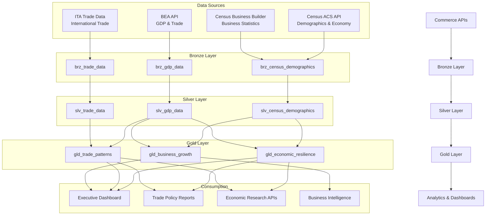

# Department of Commerce Economic Analytics Platform

> [**Examples**](../README.md) > **Commerce**


> [!TIP]
> **TL;DR** — Economic analytics platform analyzing Census demographics, BEA GDP/trade data, and business formation statistics. Provides regional economic resilience scoring, international trade pattern analysis, and small business growth prediction.


---

## 📋 Table of Contents
- [Overview](#overview)
  - [Key Features](#key-features)
  - [Data Sources](#data-sources)
  - [Open Data APIs](#open-data-apis)
- [Architecture Overview](#architecture-overview)
- [Prerequisites](#prerequisites)
  - [Azure Resources](#azure-resources)
  - [Tools Required](#tools-required)
  - [API Access](#api-access)
- [Quick Start](#quick-start)
  - [1. Environment Setup](#1-environment-setup)
  - [2. Configure API Keys](#2-configure-api-keys)
  - [3. Generate Sample Data](#3-generate-sample-data)
  - [4. Deploy Infrastructure](#4-deploy-infrastructure)
  - [5. Run dbt Models](#5-run-dbt-models)
- [Sample Analytics Scenarios](#sample-analytics-scenarios)
  - [1. Regional Economic Resilience Scoring](#1-regional-economic-resilience-scoring)
  - [2. International Trade Pattern Analysis](#2-international-trade-pattern-analysis)
  - [3. Small Business Growth Prediction](#3-small-business-growth-prediction)
- [Data Products](#data-products)
  - [Economic Resilience Index](#economic-resilience-index-economic-resilience)
  - [International Trade Patterns](#international-trade-patterns-trade-patterns)
  - [Business Growth Analytics](#business-growth-analytics-business-growth)
- [Configuration](#configuration)
  - [dbt Profiles](#dbt-profiles)
  - [Environment Variables](#environment-variables)
- [Government Cloud Deployment Notes](#government-cloud-deployment-notes)
  - [Azure Government (GovCloud)](#azure-government-govcloud)
  - [FISMA Compliance](#fisma-compliance)
  - [Data Sensitivity](#data-sensitivity)
- [Monitoring & Alerts](#monitoring--alerts)
- [Troubleshooting](#troubleshooting)
  - [Common Issues](#common-issues)
  - [Logs](#logs)
- [Development](#development)
  - [Adding New Data Sources](#adding-new-data-sources)
  - [Testing](#testing)
- [Contributing](#contributing)
- [License](#license)
- [Support](#support)
- [Acknowledgments](#acknowledgments)

A comprehensive economic analytics platform built on Azure Cloud Scale Analytics (CSA), providing insights into regional economic resilience, international trade patterns, and small business growth using official Commerce Department data sources.


---

## 📋 Overview

This platform ingests, processes, and analyzes data from multiple Commerce Department bureaus to provide actionable insights for economic policy, trade analysis, and business development decision-making. The platform follows the medallion architecture (Bronze -> Silver -> Gold) and implements modern data engineering best practices for federal data systems.

### ✨ Key Features

- **Regional Economic Analytics**: Employment diversity, industry concentration, and GDP stability scoring
- **International Trade Intelligence**: Bilateral trade flows, commodity trends, and tariff impact analysis
- **Small Business Growth Prediction**: Business formation rates, survival curves, and economic indicator correlation
- **Census Demographic Insights**: Population, income, education, and employment data at census-tract granularity
- **Interactive Dashboards**: Executive dashboards with KPIs and drill-down capabilities
- **API-First Architecture**: RESTful APIs for all data products

### 🗄️ Data Sources

- **Census Bureau (ACS/Decennial)**: Demographic, economic, and housing data from the American Community Survey (1-year and 5-year estimates) and Decennial Census
- **BEA (Bureau of Economic Analysis)**: GDP by state and industry, personal income, trade in goods and services, and national economic accounts
- **NIST (National Institute of Standards and Technology)**: Manufacturing extension partnership data, industry competitiveness metrics
- **ITA (International Trade Administration)**: Bilateral trade statistics, export/import data by partner country and commodity, tariff schedules

### 🗄️ Open Data APIs

| API | URL | Auth | Rate Limit |
|-----|-----|------|------------|
| Census API | https://api.census.gov/data | API key (free) | 500 requests/day |
| BEA API | https://apps.bea.gov/api | API key (free) | 100 requests/minute |
| USA Trade Online | https://usatrade.census.gov | Public | Varies |
| Census Business Builder | https://www.census.gov/data/data-tools/cbb.html | Public | N/A |


---

## 🏗️ Architecture Overview




---

## 📎 Prerequisites

### Azure Resources
- Azure subscription with contributor access
- Azure Data Factory or Synapse Analytics
- Azure Data Lake Storage Gen2
- Azure SQL Database or Synapse SQL Pool
- Azure Key Vault for API credentials

### Tools Required
- Azure CLI (2.55.0 or later)
- dbt CLI (1.7.0 or later)
- Python 3.9+
- Git

### API Access
- Census API key (free registration at https://api.census.gov/data/key_signup.html)
- BEA API key (free registration at https://apps.bea.gov/API/signup/)


---

## 🚀 Quick Start

### 1. Environment Setup

```bash
# Clone the repository
git clone <repository-url>
cd csa-inabox/examples/commerce

# Install Python dependencies
pip install -r requirements.txt

# Install dbt packages
cd domains/dbt
dbt deps
```

### 2. Configure API Keys

```bash
# Add to Azure Key Vault or local environment
export CENSUS_API_KEY="your-census-api-key"
export BEA_API_KEY="your-bea-api-key"
```

### 3. Generate Sample Data

```bash
# Generate synthetic data for development (no API keys required)
python data/generators/generate_commerce_data.py \
  --records 5000 \
  --output-dir domains/dbt/seeds \
  --seed 42

# Or fetch real data from Census API
python data/open-data/fetch_census.py \
  --api-key $CENSUS_API_KEY \
  --dataset acs5 \
  --year 2022 \
  --geography tract
```

### 4. Deploy Infrastructure

```bash
# Configure parameters
cp deploy/params.dev.json deploy/params.local.json
# Edit params.local.json with your values

# Deploy using Azure CLI
az deployment group create \
  --resource-group rg-commerce-analytics \
  --template-file ../../deploy/bicep/DLZ/main.bicep \
  --parameters @deploy/params.local.json
```

### 5. Run dbt Models

```bash
cd domains/dbt

# Test connections
dbt debug

# Load seed data
dbt seed

# Run models
dbt run

# Run tests
dbt test

# Generate documentation
dbt docs generate
dbt docs serve
```


---

## 💡 Sample Analytics Scenarios

### 1. Regional Economic Resilience Scoring

Assess the economic resilience of metropolitan statistical areas by combining employment diversity, industry concentration (HHI), and GDP stability metrics.

```sql
-- Top 20 most economically resilient regions
SELECT
    state_code,
    region_name,
    resilience_score,
    employment_diversity_index,
    hhi_score,
    gdp_stability_score,
    resilience_category,
    dominant_industry
FROM gold.gld_economic_resilience
WHERE year = 2023
ORDER BY resilience_score DESC
LIMIT 20;
```

### 2. International Trade Pattern Analysis

Analyze bilateral trade flows, identify commodity trends, and assess trade balance dynamics by partner country.

```sql
-- Trade balance by top 10 partner countries
SELECT
    partner_country,
    total_exports,
    total_imports,
    trade_balance,
    export_growth_yoy_pct,
    top_export_commodity,
    top_import_commodity
FROM gold.gld_trade_patterns
WHERE year = 2023
    AND flow_type = 'BILATERAL_SUMMARY'
ORDER BY ABS(trade_balance) DESC
LIMIT 10;
```

### 3. Small Business Growth Prediction

Identify regions with strong business formation trends and predict growth potential based on economic indicators.

```sql
-- States with highest small business growth potential
SELECT
    state_code,
    state_name,
    net_business_formation_rate,
    business_survival_rate_5yr,
    growth_score,
    median_household_income,
    unemployment_rate,
    gdp_per_capita,
    growth_prediction_category
FROM gold.gld_business_growth
WHERE year = 2023
ORDER BY growth_score DESC
LIMIT 15;
```


---

## ✨ Data Products

### Economic Resilience Index (`economic-resilience`)
- **Description**: Regional economic resilience scores combining employment diversity, industry concentration, and GDP stability
- **Freshness**: Quarterly updates (aligned with BEA GDP releases)
- **Coverage**: 2010-present, all 50 states and DC, MSA-level detail
- **API**: `/api/v1/economic-resilience`

### International Trade Patterns (`trade-patterns`)
- **Description**: Bilateral trade analysis with commodity-level detail and trend indicators
- **Freshness**: Monthly updates (1-month lag for customs data)
- **Coverage**: 2015-present, 200+ partner countries, 6-digit HS codes
- **API**: `/api/v1/trade-patterns`

### Business Growth Analytics (`business-growth`)
- **Description**: Small business formation, survival rates, and growth prediction scores
- **Freshness**: Quarterly updates
- **Coverage**: 2010-present, state and county level
- **API**: `/api/v1/business-growth`


---

## ⚙️ Configuration

### ⚙️ dbt Profiles

Add to your `~/.dbt/profiles.yml`:

```yaml
commerce_analytics:
  target: dev
  outputs:
    dev:
      type: databricks
      host: "{{ env_var('DBT_HOST') }}"
      http_path: "{{ env_var('DBT_HTTP_PATH') }}"
      token: "{{ env_var('DBT_TOKEN') }}"
      schema: commerce_dev
      catalog: dev
    prod:
      type: databricks
      host: "{{ env_var('DBT_HOST_PROD') }}"
      http_path: "{{ env_var('DBT_HTTP_PATH_PROD') }}"
      token: "{{ env_var('DBT_TOKEN_PROD') }}"
      schema: commerce
      catalog: prod
```

### ⚙️ Environment Variables

```bash
# Required for data fetching
CENSUS_API_KEY=your-census-api-key
BEA_API_KEY=your-bea-api-key

# Required for dbt
DBT_HOST=your-databricks-host
DBT_HTTP_PATH=your-sql-warehouse-path
DBT_TOKEN=your-access-token

# Optional
COMMERCE_LOG_LEVEL=INFO
COMMERCE_BATCH_SIZE=1000
```


---

## 🔒 Government Cloud Deployment Notes

### 🔒 Azure Government (GovCloud)
- Use `usgovvirginia` or `usgovarizona` regions
- Azure Government endpoints differ from commercial Azure:
  - Storage: `*.blob.core.usgovcloudapi.net`
  - Key Vault: `*.vault.usgovcloudapi.net`
  - Microsoft Entra ID: `login.microsoftonline.us`
- Ensure FedRAMP High compliance for production workloads
- Use Azure Government-specific resource providers
- FIPS 140-2 validated cryptographic modules required

### FISMA Compliance
- All data at rest encrypted using AES-256
- TLS 1.2+ enforced for all data in transit
- Microsoft Entra Conditional Access policies for user authentication
- Audit logging enabled for all data access operations
- Network segmentation via VNet with private endpoints
- Data classification: CUI (Controlled Unclassified Information) for economic data

### Data Sensitivity
- Census data: Publicly available aggregated data (no PII at tract level)
- BEA data: Public economic statistics
- Trade data: Aggregated customs data (individual transaction details are restricted)
- Apply data masking for any sub-threshold census cells to prevent re-identification


---

## 📊 Monitoring & Alerts

The platform includes built-in monitoring for:

- **Data Freshness**: Alerts when data sources haven't updated within SLA (Census: weekly, BEA: quarterly, Trade: monthly)
- **Data Quality**: Automated dbt tests with Slack notifications on failure
- **API Performance**: Response time and error rate monitoring via Application Insights
- **Cost Management**: Daily Azure spend alerts and optimization recommendations
- **Pipeline Health**: Azure Data Factory pipeline run monitoring with auto-retry


---

## 🔧 Troubleshooting

### 🔧 Common Issues

1. **Census API Rate Limits**: The Census API allows 500 requests/day with a free key. Use `--delay 2` in fetch scripts for bulk operations. Request a bulk data agreement for higher limits.

2. **BEA API Throttling**: BEA limits to 100 requests/minute. The data generator includes built-in backoff. For production, use cached responses where possible.

3. **Authentication Errors**: Verify API keys are correctly set in environment variables or Key Vault. Census keys are 40-character alphanumeric strings.

4. **dbt Connection Issues**: Verify Databricks credentials and that your IP is allowlisted. Run `dbt debug` to test connectivity.

5. **Large Data Volumes**: Use incremental models and partitioning for historical census data. The ACS 5-year detailed tables can exceed 10GB per year.

6. **Trade Data HS Code Changes**: Harmonized System codes are revised every 5 years. The silver layer includes a concordance table for cross-year comparisons.

### 📊 Logs

- Application logs: `logs/commerce-analytics.log`
- dbt logs: `domains/dbt/logs/dbt.log`
- Data pipeline logs: Azure Data Factory monitoring


---

## 🚀 Development

### 🗄️ Adding New Data Sources

1. Create Bronze model in `domains/dbt/models/bronze/`
2. Add data quality tests in `schema.yml`
3. Create corresponding Silver model with transformations
4. Add to Gold aggregations as needed
5. Update data contracts in `contracts/`

### 🧪 Testing

```bash
# Unit tests
pytest data/tests/

# dbt tests
dbt test

# Integration tests
pytest data/tests/integration/

# Load tests
python data/tests/load_test.py
```


---

## 🔗 Contributing

1. Fork the repository
2. Create a feature branch (`git checkout -b feature/new-data-source`)
3. Make changes and add tests
4. Run quality checks (`make lint test`)
5. Submit a pull request


---

## 🔗 License

This project is licensed under the MIT License. See `LICENSE` file for details.


---

## 🔗 Support

- **Documentation**: https://csa-inabox.docs.microsoft.com/commerce
- **Issues**: Use GitHub Issues for bug reports and feature requests
- **Security**: Report security issues to security@contoso.com
- **Community**: Join our Slack channel `#csa-commerce-analytics`


---

## 🔗 Acknowledgments

- U.S. Census Bureau for comprehensive demographic and economic data APIs
- Bureau of Economic Analysis for GDP and trade statistics
- International Trade Administration for trade data
- Azure Cloud Scale Analytics team for the foundational platform
- Contributors and the open-source community

---

## 🔗 Related Documentation

- [Commerce Architecture](ARCHITECTURE.md) — Detailed platform architecture and design decisions
- [Examples Index](../README.md) — Overview of all CSA-in-a-Box example verticals
- [Platform Architecture](../../docs/ARCHITECTURE.md) — Core CSA platform architecture
- [Getting Started Guide](../../docs/GETTING_STARTED.md) — Platform setup and onboarding
- [Casino Analytics](../casino-analytics/README.md) — Related economic analytics vertical
- [USPS Postal Operations](../usps/README.md) — Related logistics and trade vertical


---

## Prerequisites / Cost / Teardown

> [!IMPORTANT]
> **Cost-safety:** this vertical deploys real Azure resources. Always run `teardown.sh` when you are done. A forgotten workshop environment can run **$120-200/day**.

### Prerequisites

- Azure CLI 2.50+ logged in (`az login`), subscription selected (`az account set --subscription <id>`)
- `jq` installed (used by teardown enumeration)
- Bicep CLI 0.25+ (`az bicep version`)
- Contributor + User Access Administrator on target subscription (or a pre-created RG with equivalent RBAC)
- `bash scripts/deploy/validate-prerequisites.sh` passes

### Cost estimate (rough, East US 2)

- **While running:** ~$$120-200/day (services: Synapse, Databricks, Cosmos DB, ADF, Storage, Key Vault)
- **Idle overnight:** roughly half if you stop compute (Databricks autostop + Synapse pause)
- **Storage + Key Vault residual:** <$5/month if you skip teardown

Numbers are indicative for a small demo dataset; production workloads vary significantly. Use `az consumption usage list` or Cost Management for live numbers.

### Runtime

- **Deploy:** ~30-45 minutes (first run; cold Bicep)
- **Teardown:** ~10-15 minutes (async RG delete completes in the background)

### Teardown

When finished, run the per-example teardown script. It enforces a typed `DESTROY-commerce` confirmation, logs every step to `reports/teardown/commerce-<timestamp>.log`, and deletes the resource group `rg-commerce-analytics` along with any matching subscription-scope deployments.

```bash
# Interactive (recommended)
bash examples/commerce/deploy/teardown.sh

# Dry run (enumerate only)
bash examples/commerce/deploy/teardown.sh --dry-run

# From the repo root via Makefile
make teardown-example VERTICAL=commerce
make teardown-example VERTICAL=commerce DRYRUN=1

# CI automation (no prompt — only for ephemeral environments)
bash examples/commerce/deploy/teardown.sh --yes
```

See [`docs/QUICKSTART.md#teardown`](../../docs/QUICKSTART.md#teardown) for the platform-wide teardown flow.

## Directory Structure

```text
commerce/
├── contracts/                # Data product contracts (schemas, SLOs, owners)
│   ├── census-demographics.yaml
│   ├── economic-indicators.yaml
│   └── trade-data.yaml
├── data/                     # Sample data + synthetic generators
│   ├── generators/
│   └── open-data/
├── deploy/                   # Deployment parameters / Bicep templates
│   ├── params.dev.json
│   ├── params.gov.json
│   └── teardown.sh
├── domains/                  # dbt models (bronze / silver / gold) and seeds
│   └── dbt/
├── notebooks/                # Synapse / Fabric / Databricks notebooks
│   ├── economic_analysis.py
│   └── trade_pattern_prediction.py
├── reports/                  # Power BI report templates and pbix sources
├── ARCHITECTURE.md           # Mermaid + prose architecture diagrams
└── README.md                 # This file
```
