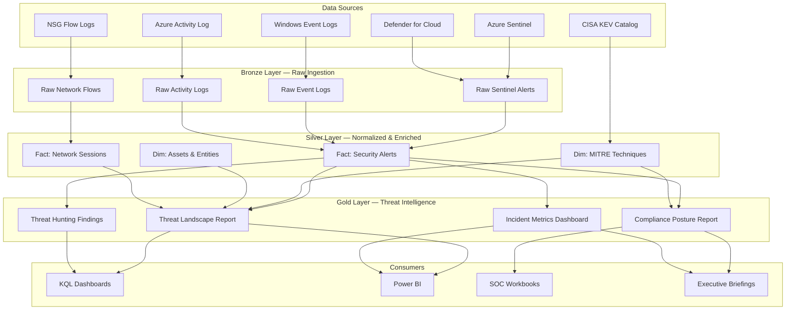

# Cybersecurity Threat Detection & MITRE ATT&CK Analytics

> [**Examples**](../README.md) > **Cybersecurity**


> [!TIP]
> **TL;DR** — Azure Sentinel-based threat detection and MITRE ATT&CK correlation platform for federal agencies. Ingests security alerts, network flows, and vulnerability data through a medallion architecture to produce actionable threat intelligence, compliance posture reporting, and automated threat hunting dashboards.


---

## 📋 Table of Contents
- [Overview](#overview)
  - [Key Features](#key-features)
  - [Data Sources](#data-sources)
- [Architecture Overview](#architecture-overview)
- [Business Drivers](#business-drivers)
- [Data Mesh Integration](#data-mesh-integration)
- [Prerequisites](#prerequisites)
- [Quick Start](#quick-start)
- [Data Pipeline](#data-pipeline)
  - [Bronze Layer](#bronze-layer-raw-ingestion)
  - [Silver Layer](#silver-layer-normalized--enriched)
  - [Gold Layer](#gold-layer-threat-intelligence)
- [KQL Query Examples](#kql-query-examples)
- [Notebooks](#notebooks)
- [Data Contract](#data-contract)
- [Deployment](#deployment)
- [Related Resources](#related-resources)
- [Contributing](#contributing)
- [License](#license)


---

## 📋 Overview

This vertical provides a production-ready cybersecurity analytics platform built on Azure Cloud Scale Analytics (CSA). It demonstrates how federal agencies can operationalize Azure Sentinel alert data, correlate events with the MITRE ATT&CK framework, and produce continuous monitoring dashboards that satisfy CISA Binding Operational Directives, CMMC, and FedRAMP requirements.

### ✨ Key Features

- **Real-Time Threat Detection**: Sentinel analytics rules for brute force, lateral movement, exfiltration, and ransomware indicators
- **MITRE ATT&CK Mapping**: Every alert is normalized and correlated to ATT&CK tactics and techniques
- **Compliance Posture Reporting**: Automated CMMC and NIST 800-53 control gap analysis
- **Threat Hunting Notebooks**: Interactive Databricks notebooks for anomaly detection and ML-based alert scoring
- **CISA KEV Integration**: Known Exploited Vulnerabilities catalog cross-referenced with environment telemetry
- **Zero Trust Analytics**: Continuous verification metrics across identity, device, and network pillars

### 🗄️ Data Sources

| Source | Description | Ingestion |
|--------|-------------|-----------|
| **Azure Sentinel Alerts** | Security alerts from all connected providers | Near real-time via Log Analytics |
| **Windows Security Events** | Event IDs 4624-4634, 4688, 4720, 7045 | Data Collection Rules |
| **NSG Flow Logs** | Network traffic metadata from Azure NSGs | Storage Account → ADLS |
| **Azure Activity Log** | Control plane operations and audit trail | Diagnostic Settings |
| **Microsoft Defender for Cloud** | Cloud security posture and recommendations | Continuous Export |
| **CISA KEV Catalog** | Known exploited vulnerabilities | Scheduled API pull |


---

## 🏗️ Architecture Overview




---

## 🎯 Business Drivers

### Regulatory Compliance

| Requirement | Description | How This Vertical Addresses It |
|-------------|-------------|-------------------------------|
| **CISA BOD 22-01** | Reduce risk from known exploited vulnerabilities | CISA KEV integration with automated remediation tracking |
| **CISA BOD 23-01** | Asset visibility and vulnerability detection | Asset inventory via entity extraction, continuous scanning metrics |
| **CMMC Level 2+** | Cybersecurity Maturity Model Certification | Control mapping to NIST 800-171, gap analysis reporting |
| **FedRAMP** | Continuous monitoring for cloud authorization | Automated control evidence collection, monthly POA&M generation |
| **EO 14028** | Zero Trust Architecture adoption | Identity, device, and network trust scoring |
| **FISMA** | Federal Information Security Management Act | Annual assessment automation, continuous diagnostics |

### Operational Value

- **Mean Time to Detect (MTTD)**: Reduce from hours to minutes with automated correlation
- **Mean Time to Respond (MTTR)**: Prioritize alerts using ML-based scoring
- **Alert Fatigue Reduction**: Correlate and deduplicate alerts, reducing noise by 60-80%
- **Proactive Threat Hunting**: Shift from reactive to proactive with behavioral analytics


---

## 🔗 Data Mesh Integration

### Security Domain Ownership

The cybersecurity vertical operates as a **Security Domain** within the CSA Data Mesh:

| Aspect | Details |
|--------|---------|
| **Domain Owner** | Chief Information Security Officer (CISO) |
| **Domain Team** | SOC Analysts, Security Engineers, Threat Hunters |
| **Self-Service Platform** | Sentinel workspace + Databricks notebooks |
| **Governance** | NIST 800-53, CMMC, agency-specific policies |

### Data Products

| Data Product | Description | Consumers |
|-------------|-------------|-----------|
| **Threat Landscape** | Daily/weekly threat summary with tactic trends and technique frequency | CISO, SOC Lead, Risk Management |
| **Compliance Posture** | Control implementation status mapped to CMMC/NIST frameworks | Authorizing Officials, ISSO, Auditors |
| **Incident Metrics** | MTTD, MTTR, alert volume, resolution rates, SLA compliance | SOC Manager, CIO Dashboard |
| **Vulnerability Exposure** | CISA KEV overlap, patching SLA compliance, risk scoring | Vulnerability Management Team |


---

## 📦 Prerequisites

### Azure Resources

- Azure Subscription with Microsoft Sentinel enabled
- Log Analytics Workspace (Sentinel-connected)
- Azure Data Lake Storage Gen2 (for medallion layers)
- Azure Databricks Workspace
- Microsoft Defender for Cloud (Standard tier recommended)

### Tools Required

- Azure CLI ≥ 2.50
- Bicep CLI ≥ 0.20
- dbt-core ≥ 1.7 with dbt-databricks adapter
- Python ≥ 3.10
- Databricks CLI

### Permissions

- `Microsoft Sentinel Contributor` on the resource group
- `Log Analytics Contributor` for workspace configuration
- `Storage Blob Data Contributor` on ADLS Gen2


---

## 🚀 Quick Start

### 1. Clone and Navigate

```bash
git clone https://github.com/your-org/csa-inabox.git
cd csa-inabox/examples/cybersecurity
```

### 2. Deploy Sentinel Workspace

```bash
az deployment group create \
  --resource-group rg-cybersecurity-dev \
  --template-file deploy/sentinel-workspace.bicep \
  --parameters namePrefix=csa environment=dev location=usgovvirginia
```

### 3. Deploy Analytics Rules

```bash
az deployment group create \
  --resource-group rg-cybersecurity-dev \
  --template-file deploy/analytics-rules.bicep \
  --parameters workspaceName=csa-law-dev
```

### 4. Load Sample Data

```bash
# Upload sample data to ADLS Bronze container
az storage blob upload-batch \
  --destination bronze/sentinel-alerts \
  --source data/ \
  --account-name csadatalakedev
```

### 5. Run dbt Models

```bash
cd domains
dbt seed --profiles-dir .
dbt run --profiles-dir .
dbt test --profiles-dir .
```

### 6. Open Notebooks

Import the `notebooks/` folder into your Databricks workspace and run sequentially.


---

## 🔄 Data Pipeline

### Bronze Layer — Raw Ingestion

Raw data lands in ADLS Gen2 with no transformations. Each source maintains its original schema.

| Table | Source | Format | Refresh |
|-------|--------|--------|---------|
| `raw_sentinel_alerts` | Sentinel API / Diagnostic Export | JSON | Near real-time |
| `raw_windows_events` | Data Collection Rules | JSON | Near real-time |
| `raw_nsg_flows` | NSG Flow Logs v2 | JSON | 5-minute batches |
| `raw_activity_logs` | Azure Monitor Diagnostic Settings | JSON | Near real-time |

### Silver Layer — Normalized & Enriched

Cleansed, deduplicated, and enriched with MITRE ATT&CK context.

| Table | Description | Key Joins |
|-------|-------------|-----------|
| `fct_security_alerts` | Normalized alerts with severity scores, entity extraction | `dim_mitre_techniques` |
| `dim_mitre_techniques` | MITRE ATT&CK technique reference with detection guidance | — |
| `dim_assets` | Host, user, and IP entity dimension | Entity extraction from alerts |
| `fct_network_sessions` | Sessionized network flows with anomaly flags | `dim_assets` |

### Gold Layer — Threat Intelligence

Aggregated, business-ready views for dashboards and reporting.

| Table | Description | Refresh |
|-------|-------------|---------|
| `rpt_threat_landscape` | Tactic/technique trends, severity distribution, 30-day rolling | Hourly |
| `rpt_compliance_posture` | CMMC/NIST control status, gap analysis, remediation priority | Daily |
| `rpt_incident_metrics` | MTTD, MTTR, volume trends, SLA tracking | Hourly |


---

## 🔍 KQL Query Examples

### 1. High-Severity Alerts in the Last 24 Hours

```kql
SecurityAlert
| where TimeGenerated > ago(24h)
| where AlertSeverity == "High" or AlertSeverity == "Critical"
| summarize AlertCount = count() by AlertName, ProviderName
| order by AlertCount desc
| take 20
```

### 2. MITRE ATT&CK Tactic Heatmap

```kql
SecurityAlert
| where TimeGenerated > ago(30d)
| mv-expand Tactics
| summarize Count = count() by tostring(Tactics), bin(TimeGenerated, 1d)
| render timechart
```

### 3. Brute Force Detection — Failed Sign-Ins

```kql
SigninLogs
| where TimeGenerated > ago(1h)
| where ResultType != "0"
| summarize FailedAttempts = count() by UserPrincipalName, IPAddress, bin(TimeGenerated, 5m)
| where FailedAttempts > 10
| project UserPrincipalName, IPAddress, FailedAttempts, TimeGenerated
| order by FailedAttempts desc
```

### 4. Lateral Movement — Unusual RDP Connections

```kql
SecurityEvent
| where TimeGenerated > ago(7d)
| where EventID == 4624 and LogonType == 10
| summarize RDPSources = dcount(IpAddress) by TargetAccount, Computer
| where RDPSources > 3
| project TargetAccount, Computer, RDPSources
| order by RDPSources desc
```

### 5. Data Exfiltration Indicator — Large Outbound Transfers

```kql
AzureNetworkAnalytics_CL
| where TimeGenerated > ago(24h)
| where FlowDirection_s == "O" and FlowStatus_s == "A"
| summarize TotalBytesSent = sum(toint(BytesSent_d)) by SrcIP_s, DestIP_s
| where TotalBytesSent > 500000000
| project SrcIP_s, DestIP_s, TotalGB = round(TotalBytesSent / 1073741824.0, 2)
| order by TotalGB desc
```

### 6. DNS Tunneling Suspicion — High Query Volume

```kql
DnsEvents
| where TimeGenerated > ago(24h)
| summarize QueryCount = count(), UniqueSubdomains = dcount(Name) by ClientIP
| where QueryCount > 5000 and UniqueSubdomains > 500
| project ClientIP, QueryCount, UniqueSubdomains
| order by QueryCount desc
```


---

## 📓 Notebooks

| Notebook | Description |
|----------|-------------|
| `01-alert-exploration.py` | Load Bronze alerts, analyze distribution by severity/tactic/source, timeline visualization, entity network graph |
| `02-threat-detection-ml.py` | Feature engineering on Silver data, Isolation Forest anomaly detection, alert scoring and prioritization |
| `03-kql-threat-hunting.py` | KQL query examples for Log Analytics, threat hunting for unusual processes, lateral movement, C2 patterns |


---

## 📄 Data Contract

The `contracts/sentinel-alerts.yaml` data contract defines the schema, quality thresholds, and SLAs for the core Sentinel alerts data product. See [contracts/](contracts/) for details.

Key guarantees:
- **Freshness**: Alerts available in Silver within 15 minutes of generation
- **Completeness**: ≥ 99.5% of alerts ingested without data loss
- **Accuracy**: MITRE mapping validated against ATT&CK v14+
- **Availability**: 99.9% uptime for Gold layer query access


---

## 🚢 Deployment

### Infrastructure as Code

| File | Purpose |
|------|---------|
| `deploy/sentinel-workspace.bicep` | Log Analytics Workspace + Sentinel solution, data connectors, collection rules |
| `deploy/analytics-rules.bicep` | 5 Sentinel scheduled analytics rules with MITRE mapping |

### Environment Matrix

| Environment | Resource Group | Location | Retention |
|-------------|---------------|----------|-----------|
| Development | `rg-cybersecurity-dev` | `usgovvirginia` | 30 days |
| Staging | `rg-cybersecurity-stg` | `usgovvirginia` | 90 days |
| Production | `rg-cybersecurity-prd` | `usgovvirginia` | 365 days |


---

## 📚 Related Resources

- [MITRE ATT&CK Framework](https://attack.mitre.org/) — Adversary tactics, techniques, and procedures
- [CISA Known Exploited Vulnerabilities](https://www.cisa.gov/known-exploited-vulnerabilities-catalog) — KEV catalog
- [Azure Sentinel Documentation](https://learn.microsoft.com/en-us/azure/sentinel/) — Microsoft Sentinel docs
- [NIST 800-53 Rev 5](https://csf.tools/reference/nist-sp-800-53/r5/) — Security and privacy controls
- [CMMC Model](https://dodcio.defense.gov/CMMC/) — Cybersecurity Maturity Model Certification
- [CISA Binding Operational Directives](https://www.cisa.gov/directives) — Federal cybersecurity directives
- [Zero Trust Architecture — NIST SP 800-207](https://csrc.nist.gov/publications/detail/sp/800-207/final) — Zero Trust reference


---

## 🤝 Contributing

1. Fork the repository
2. Create a feature branch: `git checkout -b feature/cybersecurity-enhancement`
3. Follow existing coding conventions and data contract patterns
4. Submit a pull request with test evidence

---

## 📜 License

This project is part of [CSA-in-a-Box](../../README.md) and follows the repository-level license.

## Directory Structure

```text
cybersecurity/
├── contracts/                # Data product contracts (schemas, SLOs, owners)
│   └── sentinel-alerts.yaml
├── data/                     # Sample data + synthetic generators
│   ├── cisa-kev-sample.json
│   ├── mitre-attack-mapping.json
│   └── sample-sentinel-alerts.json
├── deploy/                   # Deployment parameters / Bicep templates
│   ├── analytics-rules.bicep
│   └── sentinel-workspace.bicep
├── domains/                  # dbt models (bronze / silver / gold) and seeds
│   ├── bronze/
│   ├── gold/
│   └── silver/
├── notebooks/                # Synapse / Fabric / Databricks notebooks
│   ├── 01-alert-exploration.py
│   ├── 02-threat-detection-ml.py
│   └── 03-kql-threat-hunting.py
└── README.md                 # This file
```
